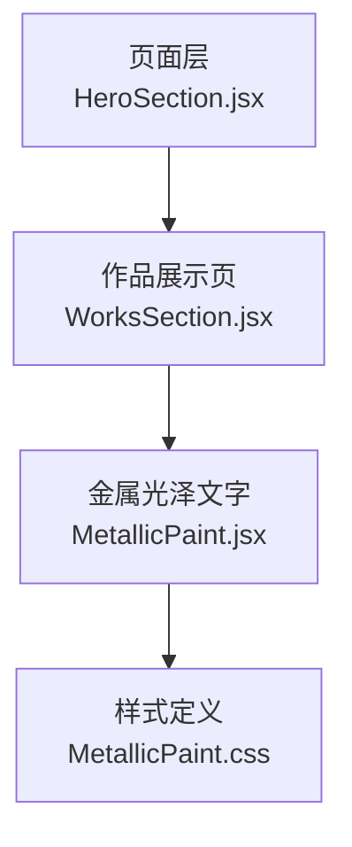
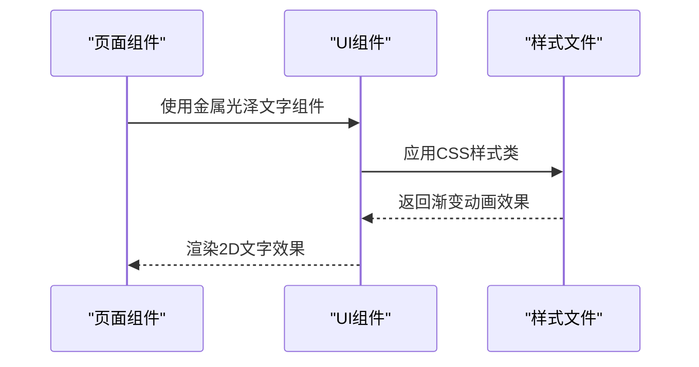
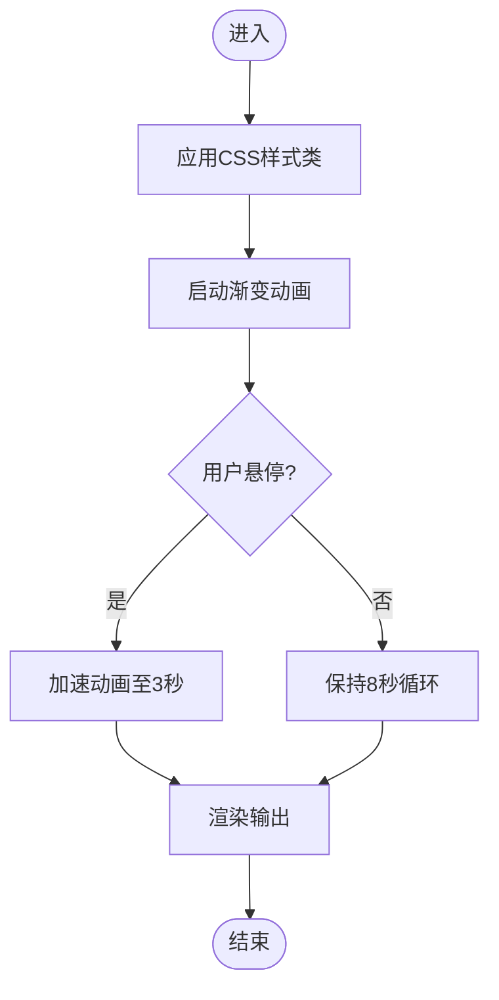
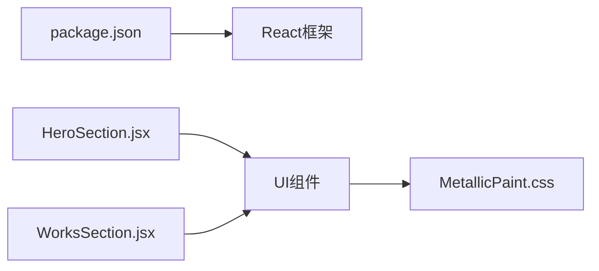

# 3D文本特效

<cite>
**本文引用的文件**   
- [src/components/ui/MetallicPaint.jsx](file://src/components/ui/MetallicPaint.jsx)
- [src/components/ui/MetallicPaint.css](file://src/components/ui/MetallicPaint.css)
- [src/components/HeroSection.jsx](file://src/components/HeroSection.jsx)
- [src/components/WorksSection.jsx](file://src/components/WorksSection.jsx)
- [package.json](file://package.json)
- [README.md](file://README.md)
</cite>

## 更新摘要
**变更内容**   
- 移除了所有3D文本组件（PuffedText、PortfolioText3D、MetallicText）的详细说明
- 更新了项目结构以反映当前仅保留2D金属光泽文字效果的状态
- 简化了依赖关系分析，移除Three.js相关依赖说明
- 调整了架构总览和详细组件分析章节

## 目录
1. [简介](#简介)
2. [项目结构](#项目结构)
3. [核心组件](#核心组件)
4. [架构总览](#架构总览)
5. [详细组件分析](#详细组件分析)
6. [依赖关系分析](#依赖关系分析)
7. [性能与优化](#性能与优化)
8. [故障排查指南](#故障排查指南)
9. [结论](#结论)
10. [附录：样式定制与主题切换](#附录样式定制与主题切换)

## 简介
本技术文档围绕2D金属光泽文字特效的实现，系统解析CSS渐变动画、背景裁剪、字体渲染等关键技术。结合仓库中的金属光泽文字效果，给出从原理到落地的完整说明，并补充性能优化、跨平台兼容性与主题切换方案，帮助读者快速搭建高质量的2D文字视觉效果。

**已移除** 原3D文本特效（包括PuffedText、PortfolioText3D、MetallicText组件）已全部从代码库中删除，当前项目专注于2D CSS动画实现的金属光泽文字效果。

## 项目结构
本项目采用按功能域组织的前端工程结构，文字特效相关逻辑集中在 src/components/ui 下，页面级入口在 src/components 中通过组合引入。

图表来源
- [src/components/HeroSection.jsx](file://src/components/HeroSection.jsx)
- [src/components/WorksSection.jsx](file://src/components/WorksSection.jsx)
- [src/components/ui/MetallicPaint.jsx](file://src/components/ui/MetallicPaint.jsx)
- [src/components/ui/MetallicPaint.css](file://src/components/ui/MetallicPaint.css)

章节来源
- [src/components/HeroSection.jsx](file://src/components/HeroSection.jsx)
- [src/components/WorksSection.jsx](file://src/components/WorksSection.jsx)
- [src/components/ui/MetallicPaint.jsx](file://src/components/ui/MetallicPaint.jsx)

## 核心组件
- 金属光泽文字（MetallicPaint）：基于CSS渐变动画实现缓慢流动的金属光泽效果，适用于section标题等强调性文案。
- 页面组件（HeroSection、WorksSection）：负责布局与数据绑定，通过组合UI组件实现整体页面效果。

**已移除** 以下3D文本组件已从代码库中完全删除：
- 金属文本（MetallicText）
- 膨胀文本（PuffedText）  
- 作品集文本（PortfolioText3D）

章节来源
- [src/components/ui/MetallicPaint.jsx](file://src/components/ui/MetallicPaint.jsx)
- [src/components/HeroSection.jsx](file://src/components/HeroSection.jsx)
- [src/components/WorksSection.jsx](file://src/components/WorksSection.jsx)

## 架构总览
整体采用"页面层 -> UI组件"的简洁分层架构。页面负责布局与数据绑定；UI组件封装具体的视觉效果实现；样式文件提供视觉表现。

图表来源
- [src/components/HeroSection.jsx](file://src/components/HeroSection.jsx)
- [src/components/WorksSection.jsx](file://src/components/WorksSection.jsx)
- [src/components/ui/MetallicPaint.jsx](file://src/components/ui/MetallicPaint.jsx)
- [src/components/ui/MetallicPaint.css](file://src/components/ui/MetallicPaint.css)

## 详细组件分析

### 金属光泽文字（MetallicPaint）
- 设计要点
  - 使用大尺寸linear-gradient背景配合background-clip: text实现文字渐变效果
  - 通过CSS动画缓慢移动gradient position，形成金属光泽流动感
  - hover时加速动画，增强交互反馈
- 关键流程
  - 组件接收children和className参数 -> 应用基础样式类 -> 触发CSS动画 -> 响应hover状态
- 交互与动画
  - 默认8秒循环动画，hover时缩短至3秒
  - 支持暖色变体（metallic-paint--warm）
  - 尊重prefers-reduced-motion无障碍设置
- 代码片段路径
  - [src/components/ui/MetallicPaint.jsx](file://src/components/ui/MetallicPaint.jsx)
  - [src/components/ui/MetallicPaint.css](file://src/components/ui/MetallicPaint.css)

图表来源
- [src/components/ui/MetallicPaint.jsx](file://src/components/ui/MetallicPaint.jsx)
- [src/components/ui/MetallicPaint.css](file://src/components/ui/MetallicPaint.css)

章节来源
- [src/components/ui/MetallicPaint.jsx](file://src/components/ui/MetallicPaint.jsx)
- [src/components/ui/MetallicPaint.css](file://src/components/ui/MetallicPaint.css)

### 页面组件集成
- HeroSection：视频背景页面，不包含3D文本效果
- WorksSection：作品展示页面，使用BorderGlow边框发光效果而非3D文本

章节来源
- [src/components/HeroSection.jsx](file://src/components/HeroSection.jsx)
- [src/components/WorksSection.jsx](file://src/components/WorksSection.jsx)

## 依赖关系分析
- 外部依赖
  - React框架：用于组件化开发
  - Framer Motion：页面级动画效果
  - Lenis：平滑滚动体验
- 内部依赖
  - 页面组件依赖UI组件；UI组件依赖CSS样式文件

图表来源
- [package.json](file://package.json)
- [src/components/HeroSection.jsx](file://src/components/HeroSection.jsx)
- [src/components/WorksSection.jsx](file://src/components/WorksSection.jsx)
- [src/components/ui/MetallicPaint.jsx](file://src/components/ui/MetallicPaint.jsx)
- [src/components/ui/MetallicPaint.css](file://src/components/ui/MetallicPaint.css)

章节来源
- [package.json](file://package.json)
- [src/components/HeroSection.jsx](file://src/components/HeroSection.jsx)
- [src/components/WorksSection.jsx](file://src/components/WorksSection.jsx)

## 性能与优化
- CSS动画优化
  - 使用transform和opacity属性确保GPU加速
  - 合理设置动画持续时间，避免过度消耗CPU
  - 利用CSS变量统一管理样式值
- 兼容性处理
  - 添加webkit前缀确保Safari兼容性
  - 尊重prefers-reduced-motion媒体查询
  - 使用background-clip:text的现代浏览器特性
- 资源加载
  - 无外部字体依赖，减少网络请求
  - CSS内联样式，避免额外HTTP请求
- 内存管理
  - 纯函数组件，无状态管理开销
  - 事件监听器自动清理

[本节为通用指导，不直接分析具体文件]

## 故障排查指南
- 金属光泽不显示
  - 检查浏览器是否支持background-clip: text属性
  - 确认CSS类名正确应用
  - 验证渐变颜色对比度足够
- 动画卡顿或无响应
  - 检查是否有其他CSS动画冲突
  - 确认设备性能是否支持流畅动画
  - 查看控制台是否有JavaScript错误
- 移动端显示异常
  - 测试不同屏幕尺寸的适配情况
  - 检查iOS Safari的特殊行为
  - 验证触摸设备的hover效果替代方案

章节来源
- [src/components/ui/MetallicPaint.jsx](file://src/components/ui/MetallicPaint.jsx)
- [src/components/ui/MetallicPaint.css](file://src/components/ui/MetallicPaint.css)

## 结论
项目已从复杂的3D文本特效转向简洁高效的2D CSS动画实现。通过MetallicPaint组件提供的金属光泽文字效果，在保证视觉吸引力的同时，显著降低了技术复杂度和性能开销。这种转变体现了对用户体验和开发效率的平衡考虑。

[本节为总结性内容，不直接分析具体文件]

## 附录：样式定制与主题切换
- 样式定制
  - 颜色主题：修改MetallicPaint.css中的渐变颜色值
  - 动画速度：调整animation-duration属性
  - 文字大小：通过CSS font-size控制
- 主题切换实现
  - 定义不同的CSS类变体（如metallic-paint--warm）
  - 通过className参数动态切换样式
  - 使用CSS变量统一管理主题配置
- 示例参考路径
  - 组件使用方式：
    - [src/components/ui/MetallicPaint.jsx](file://src/components/ui/MetallicPaint.jsx)
  - 样式定义：
    - [src/components/ui/MetallicPaint.css](file://src/components/ui/MetallicPaint.css)
  - 页面集成：
    - [src/components/HeroSection.jsx](file://src/components/HeroSection.jsx)
    - [src/components/WorksSection.jsx](file://src/components/WorksSection.jsx)

章节来源
- [src/components/ui/MetallicPaint.jsx](file://src/components/ui/MetallicPaint.jsx)
- [src/components/ui/MetallicPaint.css](file://src/components/ui/MetallicPaint.css)
- [src/components/HeroSection.jsx](file://src/components/HeroSection.jsx)
- [src/components/WorksSection.jsx](file://src/components/WorksSection.jsx)