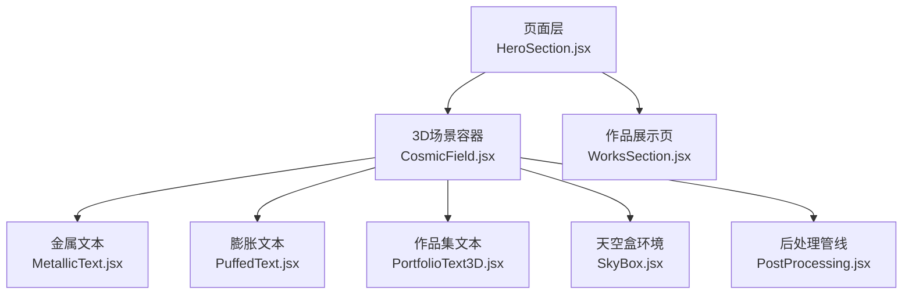
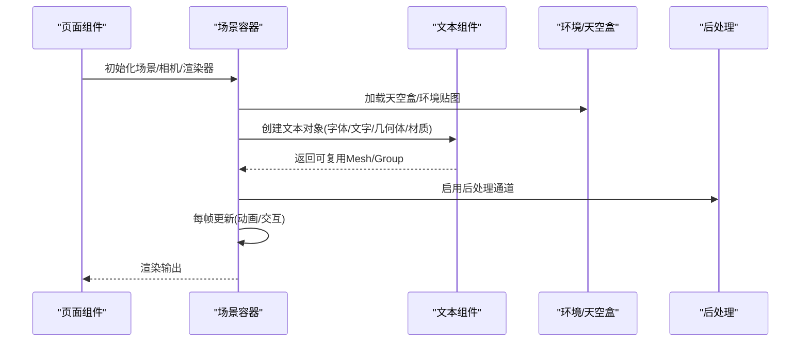
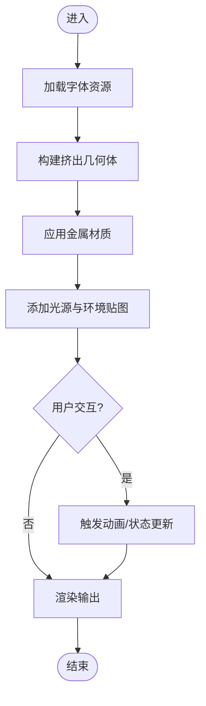
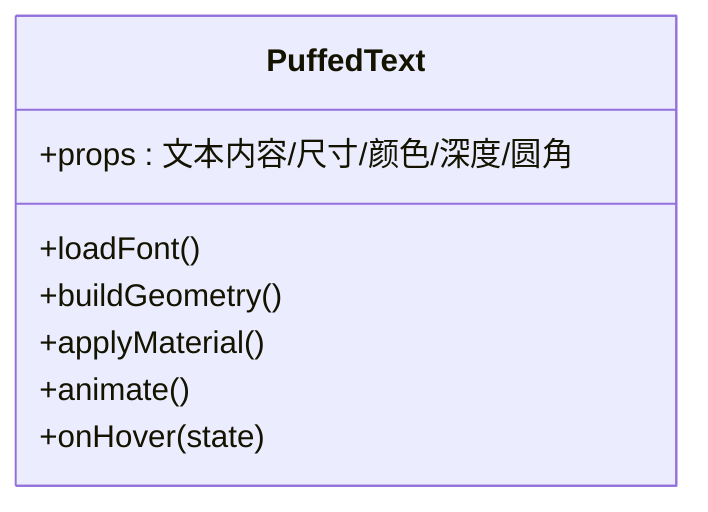
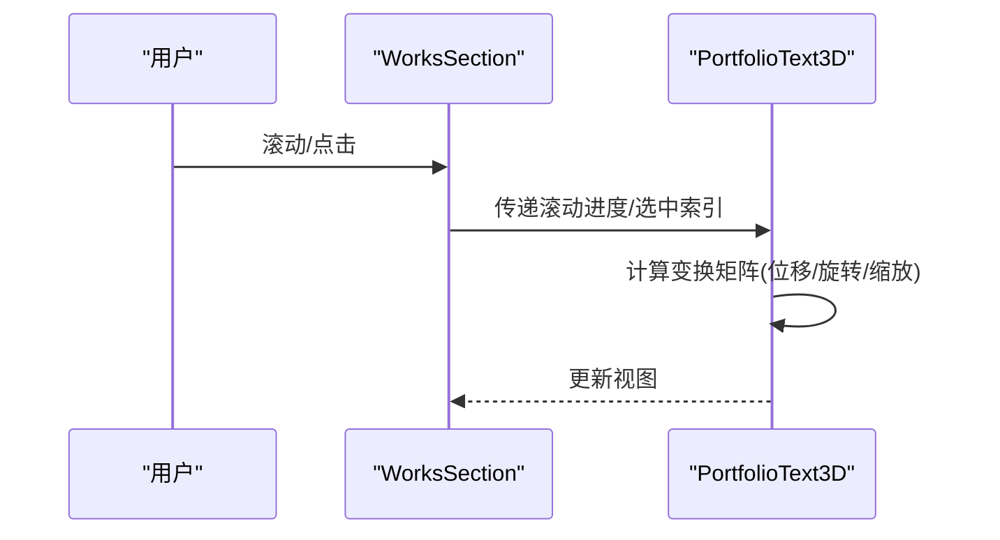
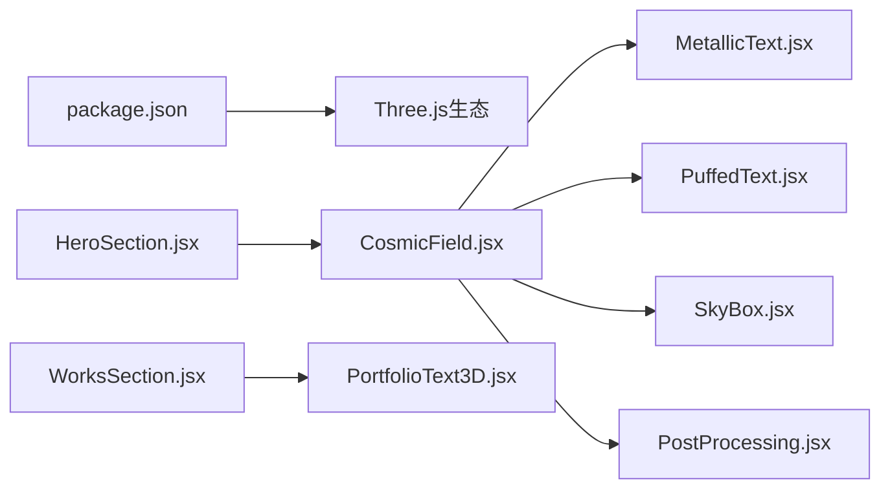

# 3D文本特效

<cite>
**本文引用的文件**   
- [src/components/three/MetallicText.jsx](file://src/components/three/MetallicText.jsx)
- [src/components/three/PuffedText.jsx](file://src/components/three/PuffedText.jsx)
- [src/components/three/PortfolioText3D.jsx](file://src/components/three/PortfolioText3D.jsx)
- [src/components/three/CosmicField.jsx](file://src/components/three/CosmicField.jsx)
- [src/components/three/SkyBox.jsx](file://src/components/three/SkyBox.jsx)
- [src/components/three/PostProcessing.jsx](file://src/components/three/PostProcessing.jsx)
- [src/components/HeroSection.jsx](file://src/components/HeroSection.jsx)
- [src/components/WorksSection.jsx](file://src/components/WorksSection.jsx)
- [package.json](file://package.json)
</cite>

## 目录
1. [简介](#简介)
2. [项目结构](#项目结构)
3. [核心组件](#核心组件)
4. [架构总览](#架构总览)
5. [详细组件分析](#详细组件分析)
6. [依赖关系分析](#依赖关系分析)
7. [性能与优化](#性能与优化)
8. [故障排查指南](#故障排查指南)
9. [结论](#结论)
10. [附录：样式定制与主题切换](#附录样式定制与主题切换)

## 简介
本技术文档围绕3D文本特效的实现，系统解析字体加载、几何体构建、材质应用、后处理、动画与交互等关键技术。结合仓库中的金属文本、膨胀文本、作品集文本三类效果，给出从原理到落地的完整说明，并补充字体优化、渲染性能、跨平台兼容性与主题切换方案，帮助读者快速搭建高质量3D文本体验。

## 项目结构
本项目采用按功能域组织的前端工程结构，3D文本相关逻辑集中在 src/components/three 下，页面级入口在 src/components 中通过组合引入。

图表来源
- [src/components/HeroSection.jsx](file://src/components/HeroSection.jsx)
- [src/components/WorksSection.jsx](file://src/components/WorksSection.jsx)
- [src/components/three/CosmicField.jsx](file://src/components/three/CosmicField.jsx)
- [src/components/three/MetallicText.jsx](file://src/components/three/MetallicText.jsx)
- [src/components/three/PuffedText.jsx](file://src/components/three/PuffedText.jsx)
- [src/components/three/PortfolioText3D.jsx](file://src/components/three/PortfolioText3D.jsx)
- [src/components/three/SkyBox.jsx](file://src/components/three/SkyBox.jsx)
- [src/components/three/PostProcessing.jsx](file://src/components/three/PostProcessing.jsx)

章节来源
- [src/components/HeroSection.jsx](file://src/components/HeroSection.jsx)
- [src/components/WorksSection.jsx](file://src/components/WorksSection.jsx)
- [src/components/three/CosmicField.jsx](file://src/components/three/CosmicField.jsx)

## 核心组件
- 金属文本（MetallicText）：基于高反射金属材质与光照模型，呈现镜面高光与反射细节，适合标题与强调文案。
- 膨胀文本（PuffedText）：通过挤出深度与圆角倒角参数，营造“充气”立体感，适合装饰性大字号。
- 作品集文本（PortfolioText3D）：面向作品列表的3D排版，支持动态变换与交互反馈，提升浏览沉浸感。
- 场景与环境（CosmicField、SkyBox）：提供宇宙背景与天空盒环境贴图，为金属反射提供真实环境映射。
- 后处理（PostProcessing）：集成辉光、景深、色调映射等效果，增强视觉层次。

章节来源
- [src/components/three/MetallicText.jsx](file://src/components/three/MetallicText.jsx)
- [src/components/three/PuffedText.jsx](file://src/components/three/PuffedText.jsx)
- [src/components/three/PortfolioText3D.jsx](file://src/components/three/PortfolioText3D.jsx)
- [src/components/three/CosmicField.jsx](file://src/components/three/CosmicField.jsx)
- [src/components/three/SkyBox.jsx](file://src/components/three/SkyBox.jsx)
- [src/components/three/PostProcessing.jsx](file://src/components/three/PostProcessing.jsx)

## 架构总览
整体采用“页面层 -> 场景容器 -> 文本组件 -> 环境与后处理”的分层架构。页面负责布局与数据绑定；场景容器管理Three.js实例、相机、渲染器与生命周期；文本组件封装字体加载、几何体生成与材质配置；环境与后处理提供视觉增强。

图表来源
- [src/components/HeroSection.jsx](file://src/components/HeroSection.jsx)
- [src/components/three/CosmicField.jsx](file://src/components/three/CosmicField.jsx)
- [src/components/three/MetallicText.jsx](file://src/components/three/MetallicText.jsx)
- [src/components/three/PuffedText.jsx](file://src/components/three/PuffedText.jsx)
- [src/components/three/PortfolioText3D.jsx](file://src/components/three/PortfolioText3D.jsx)
- [src/components/three/SkyBox.jsx](file://src/components/three/SkyBox.jsx)
- [src/components/three/PostProcessing.jsx](file://src/components/three/PostProcessing.jsx)

## 详细组件分析

### 金属文本（MetallicText）
- 设计要点
  - 使用高金属度与低粗糙度的物理材质，配合多光源与反射环境，形成强烈高光与反射。
  - 文本几何体由字体轮廓生成，需合理设置挤出深度与倒角半径以平衡体积与性能。
  - 建议开启阴影接收与投射，增强空间感。
- 关键流程
  - 字体加载 -> 生成字形路径 -> 构建挤出几何体 -> 应用金属材质 -> 加入场景 -> 响应交互与动画。
- 交互与动画
  - 鼠标悬停时提高金属度或降低粗糙度，触发微动效（轻微缩放/位移）。
  - 滚动或时间驱动的光照变化，使高光位置随视角移动。
- 代码片段路径
  - [src/components/three/MetallicText.jsx](file://src/components/three/MetallicText.jsx)

图表来源
- [src/components/three/MetallicText.jsx](file://src/components/three/MetallicText.jsx)
- [src/components/three/SkyBox.jsx](file://src/components/three/SkyBox.jsx)

章节来源
- [src/components/three/MetallicText.jsx](file://src/components/three/MetallicText.jsx)
- [src/components/three/SkyBox.jsx](file://src/components/three/SkyBox.jsx)

### 膨胀文本（PuffedText）
- 设计要点
  - 通过较大的挤出深度与圆角倒角，模拟“充气”体积；表面材质可选用半透明或次表面散射近似，增加柔和感。
  - 控制顶点数量与面数，避免低端设备掉帧。
- 关键流程
  - 字体加载 -> 生成带倒角的挤出几何体 -> 应用柔光材质 -> 加入场景 -> 实现呼吸式动画。
- 交互与动画
  - 呼吸动画：周期性地微调缩放与透明度，营造“呼吸”节奏。
  - 点击/悬停：放大并提高发光强度，突出当前焦点。
- 代码片段路径
  - [src/components/three/PuffedText.jsx](file://src/components/three/PuffedText.jsx)

图表来源
- [src/components/three/PuffedText.jsx](file://src/components/three/PuffedText.jsx)

章节来源
- [src/components/three/PuffedText.jsx](file://src/components/three/PuffedText.jsx)

### 作品集文本（PortfolioText3D）
- 设计要点
  - 面向作品列表的3D排版，支持动态变换（旋转、位移、透视），提升浏览沉浸感。
  - 与页面滚动/手势联动，实现视差与入场动画。
- 关键流程
  - 读取作品数据 -> 为每个条目创建3D文本节点 -> 根据滚动进度计算变换矩阵 -> 应用材质与动画。
- 交互与动画
  - 滚动驱动：根据滚动位置计算Z轴位移与旋转角度，形成“卡片堆叠”效果。
  - 点击展开：聚焦选中项，其他项退后模糊。
- 代码片段路径
  - [src/components/three/PortfolioText3D.jsx](file://src/components/three/PortfolioText3D.jsx)
  - [src/components/WorksSection.jsx](file://src/components/WorksSection.jsx)

图表来源
- [src/components/WorksSection.jsx](file://src/components/WorksSection.jsx)
- [src/components/three/PortfolioText3D.jsx](file://src/components/three/PortfolioText3D.jsx)

章节来源
- [src/components/three/PortfolioText3D.jsx](file://src/components/three/PortfolioText3D.jsx)
- [src/components/WorksSection.jsx](file://src/components/WorksSection.jsx)

### 场景与环境（CosmicField、SkyBox）
- CosmicField：提供粒子/星云背景，增强空间纵深。
- SkyBox：加载立方体贴图作为环境映射，为金属反射提供真实反射源。
- 与文本的关系：文本材质依赖环境贴图进行反射计算，因此SkyBox的质量直接影响金属文本观感。

章节来源
- [src/components/three/CosmicField.jsx](file://src/components/three/CosmicField.jsx)
- [src/components/three/SkyBox.jsx](file://src/components/three/SkyBox.jsx)

### 后处理（PostProcessing）
- 常见通道：辉光（Bloom）、色调映射（ToneMapping）、抗锯齿（AA）、景深（DOF）。
- 使用建议：在移动端关闭或降级部分通道，保证流畅度；在桌面端开启Bloom增强氛围。

章节来源
- [src/components/three/PostProcessing.jsx](file://src/components/three/PostProcessing.jsx)

## 依赖关系分析
- 外部依赖
  - Three.js生态：用于3D渲染、材质、后处理与字体几何生成。
  - React集成：通过React组件封装Three.js逻辑，便于状态管理与事件绑定。
- 内部依赖
  - 页面组件依赖场景容器；场景容器组合多个文本与环境组件；后处理贯穿渲染链路。

图表来源
- [package.json](file://package.json)
- [src/components/HeroSection.jsx](file://src/components/HeroSection.jsx)
- [src/components/WorksSection.jsx](file://src/components/WorksSection.jsx)
- [src/components/three/CosmicField.jsx](file://src/components/three/CosmicField.jsx)
- [src/components/three/MetallicText.jsx](file://src/components/three/MetallicText.jsx)
- [src/components/three/PuffedText.jsx](file://src/components/three/PuffedText.jsx)
- [src/components/three/PortfolioText3D.jsx](file://src/components/three/PortfolioText3D.jsx)
- [src/components/three/SkyBox.jsx](file://src/components/three/SkyBox.jsx)
- [src/components/three/PostProcessing.jsx](file://src/components/three/PostProcessing.jsx)

章节来源
- [package.json](file://package.json)
- [src/components/HeroSection.jsx](file://src/components/HeroSection.jsx)
- [src/components/WorksSection.jsx](file://src/components/WorksSection.jsx)
- [src/components/three/CosmicField.jsx](file://src/components/three/CosmicField.jsx)

## 性能与优化
- 字体加载与缓存
  - 预加载常用字体，避免首屏卡顿；对字体资源进行压缩与分片加载。
  - 将字体URL与版本信息纳入缓存键，确保更新生效。
- 几何体优化
  - 控制挤出深度与倒角半径，减少顶点与三角面数量。
  - 对静态文本使用合并几何体或纹理化替代复杂几何。
- 材质与光照
  - 金属材质尽量使用PBR标准材质，减少自定义Shader复杂度。
  - 光源数量控制在合理范围，优先使用环境光+定向光组合。
- 后处理策略
  - 移动端关闭或降级Bloom/DOF；桌面端按需开启。
  - 使用分辨率缩放因子，降低渲染目标尺寸。
- 动画与交互
  - 使用requestAnimationFrame节流更新；批量更新变换矩阵，减少重排。
  - 将频繁更新的属性放入统一的数据结构中，避免逐帧分配内存。
- 跨平台兼容性
  - 检测WebGL能力与特性，回退到轻量模式。
  - 针对iOS Safari与Android WebView做特殊适配（如纹理格式、字体渲染差异）。

[本节为通用指导，不直接分析具体文件]

## 故障排查指南
- 字体无法加载
  - 检查字体URL可达性与CORS策略；确认字体格式受浏览器支持。
  - 查看网络面板是否有404/403错误。
- 文本显示异常（空白/错位）
  - 校验字体字符集是否包含所需字符；必要时替换为全量字体。
  - 检查几何体生成参数（大小、间距、对齐方式）。
- 金属反射失真
  - 确认已正确加载天空盒/环境贴图；检查环境贴图方向与UV映射。
  - 调整材质金属度/粗糙度，避免过曝或过暗。
- 性能抖动
  - 监控FPS与GPU占用；逐步关闭后处理通道定位瓶颈。
  - 降低几何体复杂度与光源数量，观察改善情况。
- 交互无响应
  - 检查射线检测范围与命中阈值；确认事件监听器挂载与销毁时机。

章节来源
- [src/components/three/MetallicText.jsx](file://src/components/three/MetallicText.jsx)
- [src/components/three/PuffedText.jsx](file://src/components/three/PuffedText.jsx)
- [src/components/three/PortfolioText3D.jsx](file://src/components/three/PortfolioText3D.jsx)
- [src/components/three/SkyBox.jsx](file://src/components/three/SkyBox.jsx)
- [src/components/three/PostProcessing.jsx](file://src/components/three/PostProcessing.jsx)

## 结论
通过将字体加载、几何体构建、材质与后处理解耦为独立组件，并以场景容器统一管理生命周期与渲染循环，本项目实现了高质量的3D文本特效。金属文本、膨胀文本与作品集文本分别覆盖强调、装饰与列表三种典型场景，配合环境与后处理，形成完整的视觉体系。遵循性能与兼容性优化策略，可在多设备上稳定运行。

[本节为总结性内容，不直接分析具体文件]

## 附录：样式定制与主题切换
- 样式定制
  - 文本外观：通过材质参数（颜色、金属度、粗糙度、透明度）与几何体参数（挤出深度、倒角半径）实现风格化。
  - 环境氛围：更换天空盒贴图与背景粒子密度，快速切换主题。
  - 后处理强度：调节Bloom阈值与强度，匹配不同品牌调性。
- 主题切换实现
  - 定义主题配置对象（颜色、材质预设、后处理开关）。
  - 在场景容器内监听主题变更事件，批量更新材质与环境贴图。
  - 对正在播放的动画平滑过渡，避免突变。
- 示例参考路径
  - 主题配置与切换入口可参考页面组件的组合方式：
    - [src/components/HeroSection.jsx](file://src/components/HeroSection.jsx)
    - [src/components/WorksSection.jsx](file://src/components/WorksSection.jsx)
  - 文本组件的参数化接口：
    - [src/components/three/MetallicText.jsx](file://src/components/three/MetallicText.jsx)
    - [src/components/three/PuffedText.jsx](file://src/components/three/PuffedText.jsx)
    - [src/components/three/PortfolioText3D.jsx](file://src/components/three/PortfolioText3D.jsx)
  - 环境与后处理：
    - [src/components/three/SkyBox.jsx](file://src/components/three/SkyBox.jsx)
    - [src/components/three/PostProcessing.jsx](file://src/components/three/PostProcessing.jsx)

章节来源
- [src/components/HeroSection.jsx](file://src/components/HeroSection.jsx)
- [src/components/WorksSection.jsx](file://src/components/WorksSection.jsx)
- [src/components/three/MetallicText.jsx](file://src/components/three/MetallicText.jsx)
- [src/components/three/PuffedText.jsx](file://src/components/three/PuffedText.jsx)
- [src/components/three/PortfolioText3D.jsx](file://src/components/three/PortfolioText3D.jsx)
- [src/components/three/SkyBox.jsx](file://src/components/three/SkyBox.jsx)
- [src/components/three/PostProcessing.jsx](file://src/components/three/PostProcessing.jsx)