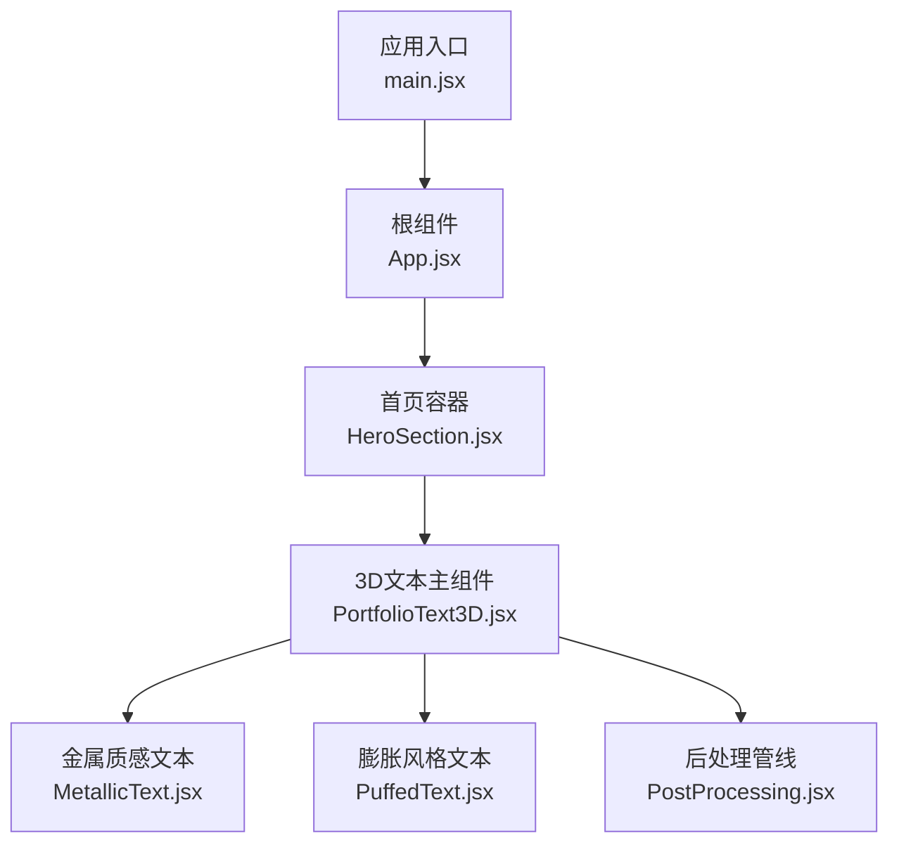
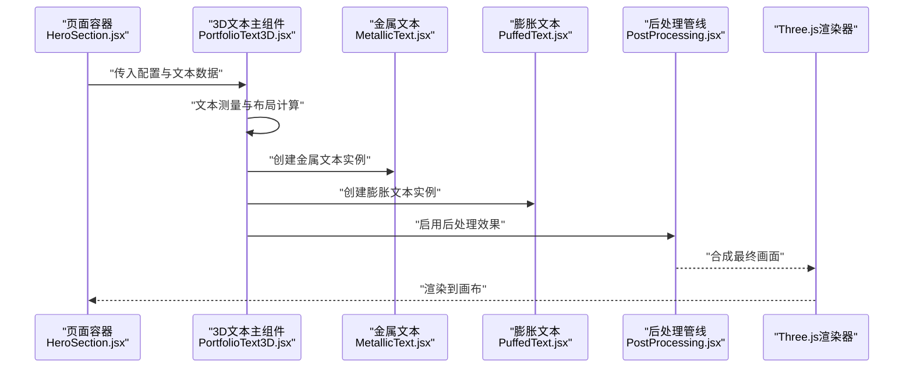
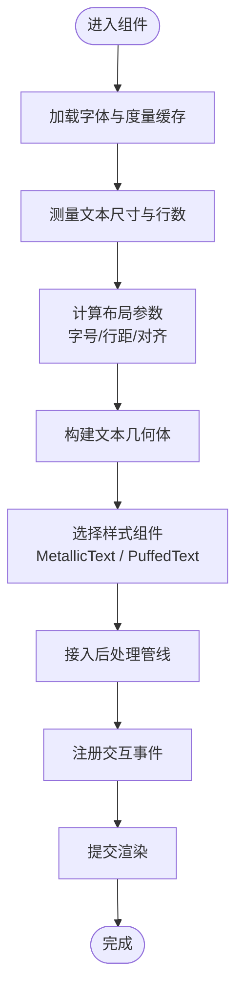
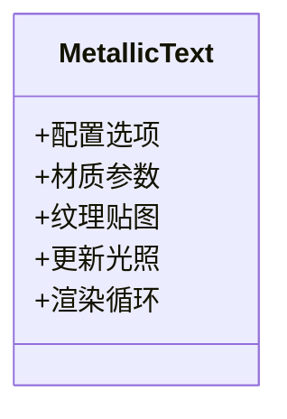
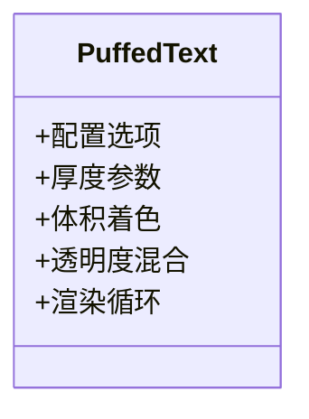
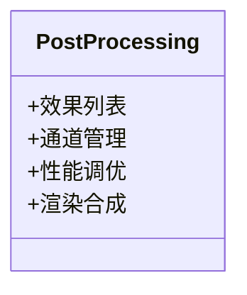
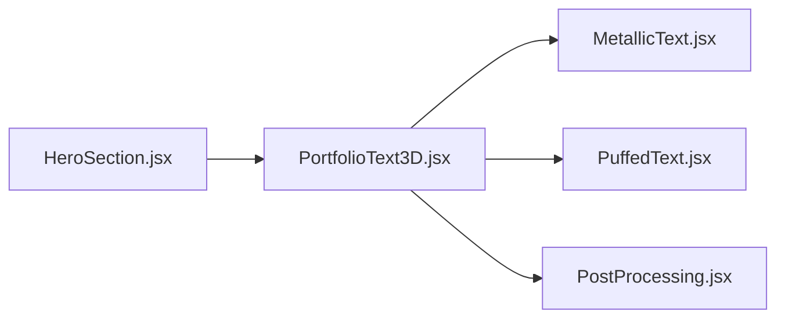

# 作品集3D文本

<cite>
**本文引用的文件**   
- [PortfolioText3D.jsx](file://src/components/three/PortfolioText3D.jsx)
- [MetallicText.jsx](file://src/components/three/MetallicText.jsx)
- [PuffedText.jsx](file://src/components/three/PuffedText.jsx)
- [PostProcessing.jsx](file://src/components/three/PostProcessing.jsx)
- [HeroSection.jsx](file://src/components/HeroSection.jsx)
- [App.jsx](file://src/App.jsx)
- [main.jsx](file://src/main.jsx)
</cite>

## 目录
1. [简介](#简介)
2. [项目结构](#项目结构)
3. [核心组件](#核心组件)
4. [架构总览](#架构总览)
5. [详细组件分析](#详细组件分析)
6. [依赖关系分析](#依赖关系分析)
7. [性能考量](#性能考量)
8. [故障排查指南](#故障排查指南)
9. [结论](#结论)
10. [附录：API参考与集成示例](#附录api参考与集成示例)

## 简介
本技术文档围绕“作品集3D文本”主题，聚焦 PortfolioText3D 组件及其相关渲染子组件（如 MetallicText、PuffedText）与后处理管线（PostProcessing），系统阐述其设计架构、文本布局算法、响应式适配、多行文本处理、字体加载优化、纹理映射、阴影效果、用户交互集成（鼠标悬停、点击事件、滚动监听）等关键技术点。同时提供完整的API参考与集成示例，帮助读者在真实项目中快速落地。

## 项目结构
该功能位于 React + Three.js 生态中，主要代码分布在 src/components/three 下的多个可复用3D组件，以及页面级容器组件 HeroSection.jsx 中进行组合与编排。整体采用“场景-组件-材质/后处理”的分层组织方式，便于扩展与维护。

图表来源
- [main.jsx](file://src/main.jsx)
- [App.jsx](file://src/App.jsx)
- [HeroSection.jsx](file://src/components/HeroSection.jsx)
- [PortfolioText3D.jsx](file://src/components/three/PortfolioText3D.jsx)
- [MetallicText.jsx](file://src/components/three/MetallicText.jsx)
- [PuffedText.jsx](file://src/components/three/PuffedText.jsx)
- [PostProcessing.jsx](file://src/components/three/PostProcessing.jsx)

章节来源
- [main.jsx](file://src/main.jsx)
- [App.jsx](file://src/App.jsx)
- [HeroSection.jsx](file://src/components/HeroSection.jsx)
- [PortfolioText3D.jsx](file://src/components/three/PortfolioText3D.jsx)
- [MetallicText.jsx](file://src/components/three/MetallicText.jsx)
- [PuffedText.jsx](file://src/components/three/PuffedText.jsx)
- [PostProcessing.jsx](file://src/components/three/PostProcessing.jsx)

## 核心组件
- PortfolioText3D：负责3D文本的布局、响应式适配、多行文本处理、交互事件绑定以及与Three.js场景的集成。
- MetallicText：提供金属质感外观的文本渲染实现，包含材质参数与光照交互。
- PuffedText：提供膨胀风格的文本渲染实现，强调体积感与视觉张力。
- PostProcessing：统一的后处理管线，用于增强文本视觉效果（如辉光、景深、色调映射等）。

章节来源
- [PortfolioText3D.jsx](file://src/components/three/PortfolioText3D.jsx)
- [MetallicText.jsx](file://src/components/three/MetallicText.jsx)
- [PuffedText.jsx](file://src/components/three/PuffedText.jsx)
- [PostProcessing.jsx](file://src/components/three/PostProcessing.jsx)

## 架构总览
从数据到渲染的整体流程如下：页面容器传入配置与文案数据至 PortfolioText3D；组件内部完成文本测量与布局计算，生成几何体并交由具体文本样式组件（MetallicText/PuffedText）进行材质与着色；随后通过 PostProcessing 进行后处理增强；最终由Three.js渲染器输出到画布。

图表来源
- [HeroSection.jsx](file://src/components/HeroSection.jsx)
- [PortfolioText3D.jsx](file://src/components/three/PortfolioText3D.jsx)
- [MetallicText.jsx](file://src/components/three/MetallicText.jsx)
- [PuffedText.jsx](file://src/components/three/PuffedText.jsx)
- [PostProcessing.jsx](file://src/components/three/PostProcessing.jsx)

## 详细组件分析

### PortfolioText3D 组件
职责与能力
- 文本布局算法：基于容器尺寸与字体度量信息，计算字符间距、行高与对齐策略，支持换行与自适应缩放。
- 响应式适配：监听窗口尺寸变化与容器尺寸变化，动态调整文本大小与布局，确保在不同屏幕下表现一致。
- 多行文本处理：将长文本拆分为多行，按最大宽度约束进行断行，保证可读性与视觉平衡。
- 字体加载优化：优先使用本地字体或预加载字体资源，避免首次渲染闪烁；对字体度量信息进行缓存以减少重复计算。
- 纹理映射：为文本表面生成或应用纹理贴图，提升细节与质感。
- 阴影效果：通过几何偏移或后处理通道实现投影与柔和阴影，增强立体层次。
- 交互集成：支持鼠标悬停高亮、点击事件回调、滚动监听联动动画等用户体验增强。

关键流程
- 初始化阶段：解析配置项、加载字体、构建基础场景与相机。
- 布局阶段：根据文本内容与容器尺寸计算布局参数，生成网格或几何体。
- 渲染阶段：调用具体文本样式组件进行材质与着色，接入后处理管线。
- 交互阶段：注册事件监听器，处理悬停、点击、滚动等输入。

图表来源
- [PortfolioText3D.jsx](file://src/components/three/PortfolioText3D.jsx)
- [MetallicText.jsx](file://src/components/three/MetallicText.jsx)
- [PuffedText.jsx](file://src/components/three/PuffedText.jsx)
- [PostProcessing.jsx](file://src/components/three/PostProcessing.jsx)

章节来源
- [PortfolioText3D.jsx](file://src/components/three/PortfolioText3D.jsx)

### MetallicText 组件
职责与能力
- 金属质感材质：通过高光反射、粗糙度与法线贴图控制表面光泽与反射特性。
- 光照交互：随视角与光源位置变化产生动态反射，增强立体感。
- 纹理映射：支持漫反射贴图与法线贴图叠加，丰富细节层次。
- 阴影与边缘光：结合几何体厚度与后处理通道，实现更真实的阴影与轮廓光。

图表来源
- [MetallicText.jsx](file://src/components/three/MetallicText.jsx)

章节来源
- [MetallicText.jsx](file://src/components/three/MetallicText.jsx)

### PuffedText 组件
职责与能力
- 膨胀风格：通过增加几何体厚度与体积感，营造“充气”视觉效果。
- 体积渲染：利用多层面片或体积着色模拟厚度与深度。
- 颜色渐变与透明度：支持渐变色与半透明混合，增强氛围感。
- 轻量后处理：可选加入轻微辉光或模糊以强化膨胀效果。

图表来源
- [PuffedText.jsx](file://src/components/three/PuffedText.jsx)

章节来源
- [PuffedText.jsx](file://src/components/three/PuffedText.jsx)

### PostProcessing 组件
职责与能力
- 统一后处理管线：集中管理多种后处理效果（如辉光、景深、色调映射、抗锯齿等）。
- 性能优化：按需启用效果、合并通道、降低采样率以提升帧率。
- 配置化开关：通过配置项灵活开启/关闭特定效果，适应不同设备性能。

图表来源
- [PostProcessing.jsx](file://src/components/three/PostProcessing.jsx)

章节来源
- [PostProcessing.jsx](file://src/components/three/PostProcessing.jsx)

## 依赖关系分析
组件间的依赖关系清晰且低耦合：PortfolioText3D 作为编排者，依赖 MetallicText 与 PuffedText 的具体渲染实现，并通过 PostProcessing 统一增强视觉效果。页面容器 HeroSection.jsx 负责数据注入与生命周期管理。

图表来源
- [HeroSection.jsx](file://src/components/HeroSection.jsx)
- [PortfolioText3D.jsx](file://src/components/three/PortfolioText3D.jsx)
- [MetallicText.jsx](file://src/components/three/MetallicText.jsx)
- [PuffedText.jsx](file://src/components/three/PuffedText.jsx)
- [PostProcessing.jsx](file://src/components/three/PostProcessing.jsx)

章节来源
- [HeroSection.jsx](file://src/components/HeroSection.jsx)
- [PortfolioText3D.jsx](file://src/components/three/PortfolioText3D.jsx)
- [MetallicText.jsx](file://src/components/three/MetallicText.jsx)
- [PuffedText.jsx](file://src/components/three/PuffedText.jsx)
- [PostProcessing.jsx](file://src/components/three/PostProcessing.jsx)

## 性能考量
- 字体加载与度量缓存：避免重复测量与网络请求，减少首屏延迟。
- 几何体复杂度控制：限制顶点数量与面片层级，合理设置视锥剔除与LOD。
- 后处理通道合并：减少绘制调用次数，按需启用效果，降低GPU压力。
- 事件节流与防抖：对滚动与鼠标事件进行节流，避免频繁重排与重绘。
- 资源复用：共享材质与纹理对象，减少内存占用与GC抖动。

[本节为通用性能建议，不直接分析具体文件]

## 故障排查指南
常见问题与定位思路
- 文本未显示或空白：检查字体是否成功加载与度量缓存是否命中；确认容器尺寸非零。
- 布局错乱或换行异常：验证最大宽度与行高配置；检查文本内容是否包含不可见字符。
- 交互无响应：确认事件监听器是否正确注册；检查射线检测范围与碰撞体。
- 性能卡顿：观察后处理效果是否过多；降低采样率或关闭非必要效果。
- 阴影缺失或异常：检查光源位置与强度；确认阴影通道已启用且分辨率合适。

章节来源
- [PortfolioText3D.jsx](file://src/components/three/PortfolioText3D.jsx)
- [PostProcessing.jsx](file://src/components/three/PostProcessing.jsx)

## 结论
PortfolioText3D 组件通过清晰的架构与模块化设计，实现了高性能、可配置的3D文本渲染方案。其文本布局算法、响应式适配、多行处理与后处理管线共同构成了稳定可靠的渲染体系。配合 MetallicText 与 PuffedText 的多样化视觉风格，能够满足不同作品集展示需求。建议在项目中按需启用后处理效果，并结合事件节流与资源复用策略，以获得更佳的用户体验与性能表现。

[本节为总结性内容，不直接分析具体文件]

## 附录：API参考与集成示例

### API参考（概念性说明）
- 配置项（Props）
  - textContent：文本内容（字符串或多行数组）
  - layout：布局配置（最大宽度、行高、对齐方式、字号基准）
  - style：样式选择（metallic/puffed）
  - postProcess：后处理开关与参数（辉光强度、景深半径、色调映射曲线）
  - interaction：交互配置（悬停高亮、点击回调、滚动监听联动）
  - font：字体资源与度量缓存策略
- 事件回调
  - onHover：鼠标悬停触发
  - onClick：点击触发
  - onScroll：滚动监听联动
- 方法调用
  - updateLayout：重新计算布局
  - setStyle：切换文本样式
  - enableEffect：动态启用/禁用后处理效果
  - dispose：释放资源

[本节为概念性API说明，不直接分析具体文件]

### 集成示例（步骤说明）
- 在页面容器中引入 PortfolioText3D 组件并传入配置项。
- 准备字体资源与纹理贴图，确保路径正确并可访问。
- 根据需要启用后处理效果，并根据设备性能调整参数。
- 注册交互事件回调，实现悬停高亮与点击跳转等行为。
- 监听窗口尺寸变化，确保响应式适配生效。

章节来源
- [HeroSection.jsx](file://src/components/HeroSection.jsx)
- [PortfolioText3D.jsx](file://src/components/three/PortfolioText3D.jsx)