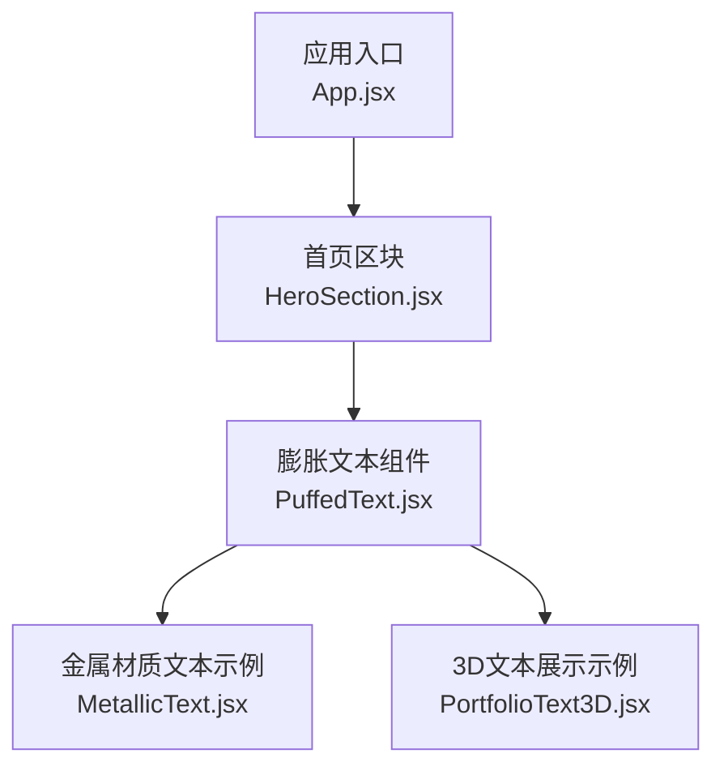
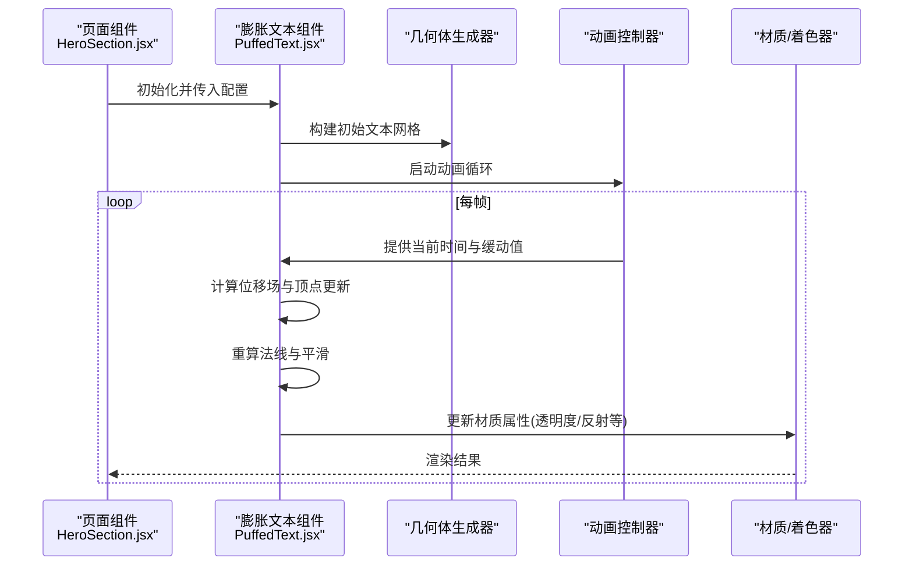
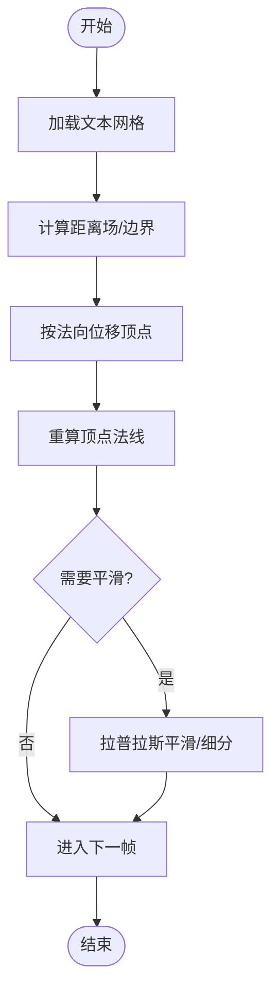
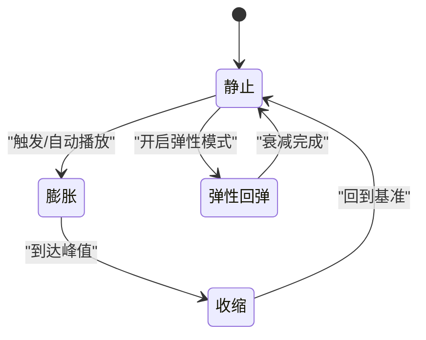
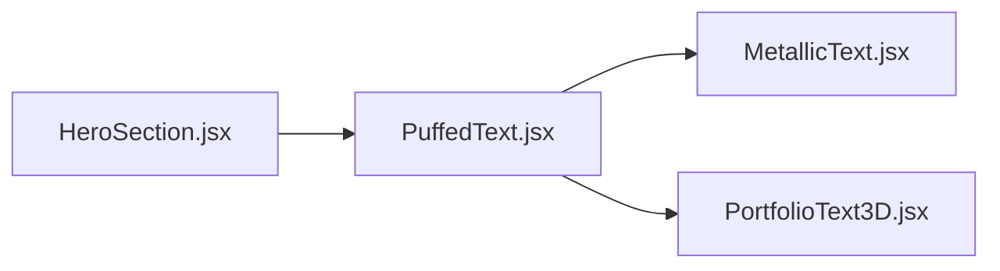

# 膨胀文本组件

<cite>
**本文引用的文件**   
- [PuffedText.jsx](file://src/components/three/PuffedText.jsx)
- [MetallicText.jsx](file://src/components/three/MetallicText.jsx)
- [PortfolioText3D.jsx](file://src/components/three/PortfolioText3D.jsx)
- [HeroSection.jsx](file://src/components/HeroSection.jsx)
- [App.jsx](file://src/App.jsx)
</cite>

## 目录
1. [简介](#简介)
2. [项目结构](#项目结构)
3. [核心组件](#核心组件)
4. [架构总览](#架构总览)
5. [详细组件分析](#详细组件分析)
6. [依赖关系分析](#依赖关系分析)
7. [性能考虑](#性能考虑)
8. [故障排查指南](#故障排查指南)
9. [结论](#结论)
10. [附录](#附录)

## 简介
本技术文档围绕“膨胀文本组件”展开，聚焦于 PuffedText 组件的几何体变形算法、动画系统与配置参数。目标包括：
- 解析顶点位移与法线计算、曲面平滑等三维建模关键技术
- 说明膨胀效果的数学原理与实现方法（如贝塞尔曲线、表面细分）
- 解释动态动画系统（膨胀/收缩、弹性效果、缓动函数）
- 提供详细的配置参数说明与最佳实践
- 给出性能优化策略与常见问题排查建议

## 项目结构
该仓库采用按功能域组织的前端工程结构，关键路径如下：
- src/components/three: 包含 Three.js 相关的可视化组件，其中 PuffedText.jsx 为核心膨胀文本组件
- src/components: 页面级组合组件，如 HeroSection.jsx 可能引入 PuffedText
- src/App.jsx: 应用入口，负责挂载页面与全局样式

图表来源
- [App.jsx](file://src/App.jsx)
- [HeroSection.jsx](file://src/components/HeroSection.jsx)
- [PuffedText.jsx](file://src/components/three/PuffedText.jsx)
- [MetallicText.jsx](file://src/components/three/MetallicText.jsx)
- [PortfolioText3D.jsx](file://src/components/three/PortfolioText3D.jsx)

章节来源
- [App.jsx](file://src/App.jsx)
- [HeroSection.jsx](file://src/components/HeroSection.jsx)
- [PuffedText.jsx](file://src/components/three/PuffedText.jsx)
- [MetallicText.jsx](file://src/components/three/MetallicText.jsx)
- [PortfolioText3D.jsx](file://src/components/three/PortfolioText3D.jsx)

## 核心组件
本节对 PuffedText 的核心职责进行概述：
- 将二维文本转换为可编辑的三维网格（通过字体加载与字形采样）
- 在渲染循环中对网格顶点执行基于距离场的位移，产生“膨胀/收缩”效果
- 根据位移后的顶点位置重新计算法线，保证光照正确
- 使用缓动函数驱动动画时间，支持弹性与阻尼等交互反馈
- 暴露配置项以控制膨胀程度、动画速度、材质透明度等

章节来源
- [PuffedText.jsx](file://src/components/three/PuffedText.jsx)

## 架构总览
从组件协作角度，PuffedText 作为独立的可复用模块，被上层页面组件引入并传入配置。其内部通常包含以下子系统：
- 几何体生成器：将文本字形转换为初始网格
- 变形引擎：逐帧更新顶点位置与法线
- 动画控制器：管理时间、缓动与状态切换
- 材质与着色器：控制外观（颜色、透明度、反射等）

图表来源
- [HeroSection.jsx](file://src/components/HeroSection.jsx)
- [PuffedText.jsx](file://src/components/three/PuffedText.jsx)

## 详细组件分析

### 几何体变形算法
- 顶点位移
  - 基于文本轮廓的距离场或边界检测，计算每个顶点到轮廓的法向偏移量
  - 位移幅度由膨胀系数与时间驱动的缓动函数共同决定
- 法线计算
  - 在顶点位移后，依据相邻顶点的局部梯度估算新法线，确保光照一致
  - 可选拉普拉斯平滑或双三次插值用于减少锯齿与噪声
- 曲面平滑
  - 对高曲率区域进行自适应细分，提升视觉质量
  - 使用 Catmull-Rom 或三次贝塞尔曲线拟合边缘，使膨胀过渡更自然

图表来源
- [PuffedText.jsx](file://src/components/three/PuffedText.jsx)

章节来源
- [PuffedText.jsx](file://src/components/three/PuffedText.jsx)

### 数学原理与实现要点
- 贝塞尔曲线应用
  - 使用三次贝塞尔曲线对膨胀轮廓进行拟合，控制膨胀曲线的起止斜率与拐点
  - 通过调整控制点权重，实现不同风格的膨胀形态（圆润/尖锐）
- 表面细分技术
  - 在曲率高的区域增加三角面密度，平衡性能与细节
  - 结合 LOD 策略，远距离降低细分等级

章节来源
- [PuffedText.jsx](file://src/components/three/PuffedText.jsx)

### 动态动画系统
- 膨胀/收缩动画
  - 以时间为输入，通过缓动函数映射为膨胀系数，形成周期性的膨胀与回弹
- 弹性效果
  - 引入弹簧-阻尼模型，使膨胀在达到峰值后出现轻微过冲与衰减
- 缓动函数
  - 常用 ease-in-out、back、elastic 等类型，配合持续时间与延迟参数

图表来源
- [PuffedText.jsx](file://src/components/three/PuffedText.jsx)

章节来源
- [PuffedText.jsx](file://src/components/three/PuffedText.jsx)

### 配置参数说明
以下为常见可调参数（具体键名以实际实现为准）：
- 膨胀程度：控制最大位移幅度与形状强度
- 动画速度：影响时间步进与整体节奏
- 材质透明度：调节表面不透明度，便于叠加背景
- 平滑强度：控制法线平滑与细分级别
- 弹性系数：决定回弹幅度与衰减速度
- 颜色/反射：定义基础色与高光反射强度

章节来源
- [PuffedText.jsx](file://src/components/three/PuffedText.jsx)

### 实现示例与最佳实践
- 基本用法
  - 在页面组件中引入 PuffedText，传入文本内容与基础配置
  - 设置合适的动画速度与膨胀程度，避免过度变形导致性能下降
- 材质搭配
  - 与 MetallicText 等材质组件组合，增强质感与层次
- 交互反馈
  - 鼠标悬停时提高膨胀幅度与弹性系数，提升用户感知
- 性能优先
  - 合理设置细分等级与平滑强度，移动端适当降低复杂度

章节来源
- [PuffedText.jsx](file://src/components/three/PuffedText.jsx)
- [MetallicText.jsx](file://src/components/three/MetallicText.jsx)
- [PortfolioText3D.jsx](file://src/components/three/PortfolioText3D.jsx)
- [HeroSection.jsx](file://src/components/HeroSection.jsx)

## 依赖关系分析
PuffedText 与周边组件的依赖关系如下：
- 被页面组件引用，作为可视化的核心元素
- 可与材质与示例文本组件协同工作，形成统一的视觉风格

图表来源
- [HeroSection.jsx](file://src/components/HeroSection.jsx)
- [PuffedText.jsx](file://src/components/three/PuffedText.jsx)
- [MetallicText.jsx](file://src/components/three/MetallicText.jsx)
- [PortfolioText3D.jsx](file://src/components/three/PortfolioText3D.jsx)

章节来源
- [HeroSection.jsx](file://src/components/HeroSection.jsx)
- [PuffedText.jsx](file://src/components/three/PuffedText.jsx)
- [MetallicText.jsx](file://src/components/three/MetallicText.jsx)
- [PortfolioText3D.jsx](file://src/components/three/PortfolioText3D.jsx)

## 性能考虑
- 几何复杂度
  - 控制细分等级与平滑强度，避免过多三角面造成 GPU 压力
- 动画频率
  - 使用 requestAnimationFrame 并确保每帧只进行必要的计算
- 资源加载
  - 字体与纹理按需加载，必要时缓存以避免重复下载
- 移动端适配
  - 降低分辨率与特效强度，启用降级策略

[本节为通用指导，无需特定文件来源]

## 故障排查指南
- 文本未显示
  - 检查字体是否成功加载与路径是否正确
  - 确认组件已正确挂载且可见性未被遮挡
- 变形异常
  - 验证距离场计算与法线重算逻辑
  - 检查膨胀系数是否超出合理范围
- 动画卡顿
  - 评估细分等级与平滑强度
  - 监控每帧计算耗时，必要时简化算法
- 材质不透明
  - 检查透明度参数与渲染顺序

章节来源
- [PuffedText.jsx](file://src/components/three/PuffedText.jsx)

## 结论
PuffedText 组件通过距离场驱动的顶点位移、法线重算与曲面平滑，实现了高质量的膨胀文本效果。配合弹性动画与丰富的配置选项，可在不同场景下提供一致的视觉体验。遵循最佳实践与性能优化策略，可进一步提升稳定性与流畅度。

[本节为总结性内容，无需特定文件来源]

## 附录
- 术语表
  - 距离场：描述点到轮廓边界的距离信息，常用于变形与边缘检测
  - 法线：垂直于表面的向量，用于光照计算
  - 细分：增加网格面数以提升细节的技术
- 参考实现
  - 相关示例组件可作为集成与扩展的参考

[本节为补充信息，无需特定文件来源]