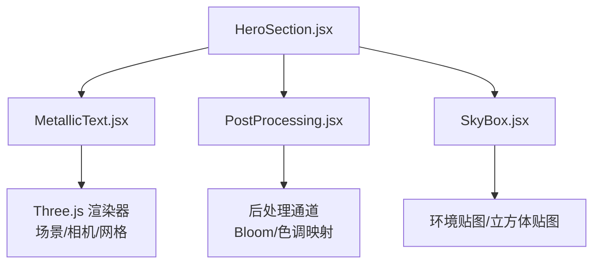
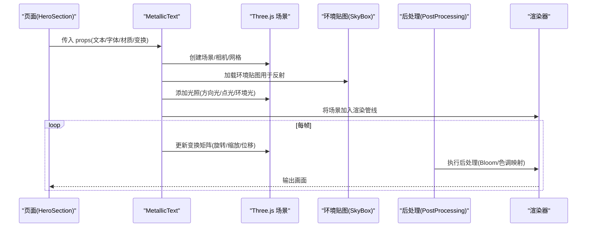
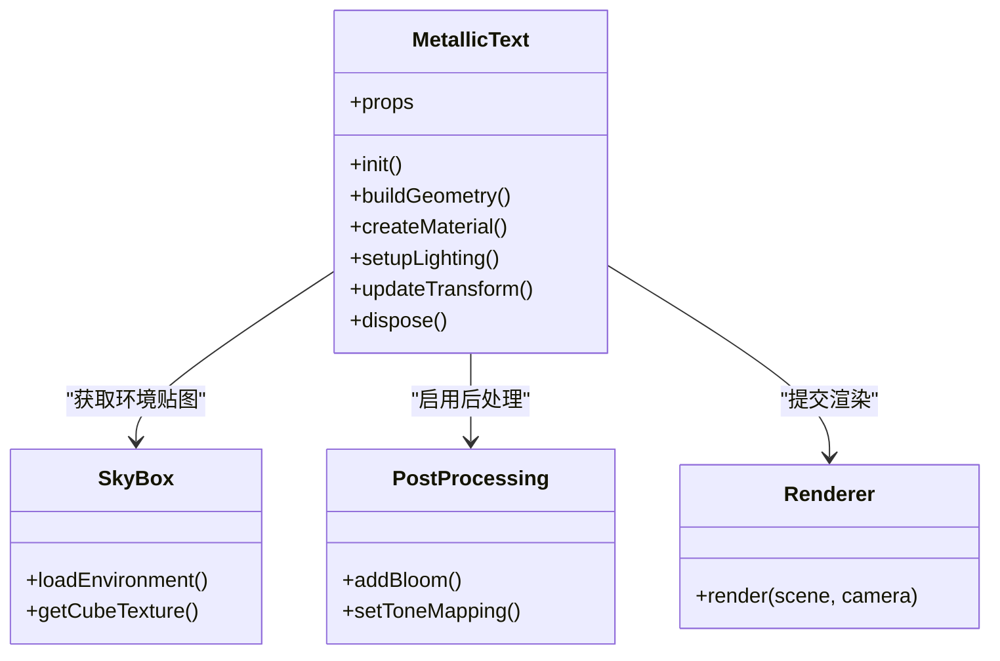
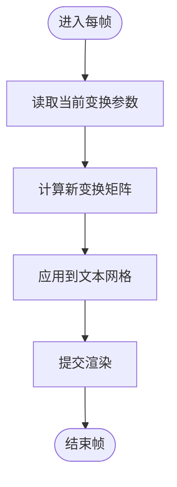
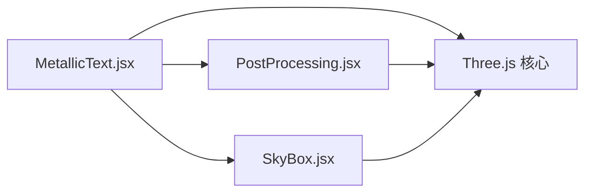

# 金属文本组件

<cite>
**本文引用的文件**   
- [MetallicText.jsx](file://src/components/three/MetallicText.jsx)
- [PostProcessing.jsx](file://src/components/three/PostProcessing.jsx)
- [SkyBox.jsx](file://src/components/three/SkyBox.jsx)
- [HeroSection.jsx](file://src/components/HeroSection.jsx)
- [package.json](file://package.json)
</cite>

## 目录
1. [简介](#简介)
2. [项目结构](#项目结构)
3. [核心组件](#核心组件)
4. [架构总览](#架构总览)
5. [详细组件分析](#详细组件分析)
6. [依赖关系分析](#依赖关系分析)
7. [性能考虑](#性能考虑)
8. [故障排查指南](#故障排查指南)
9. [结论](#结论)
10. [附录](#附录)

## 简介
本技术文档围绕 Three.js 的“金属文本”效果，系统性解析 MetallicText 组件的实现原理与使用方式。内容涵盖：
- 金属材质在 Three.js 中的实现要点（环境贴图、反射、粗糙度、金属度等）
- 光照系统配置（方向光、点光源、环境光对金属质感的影响）
- 反射效果计算与环境映射策略
- 组件 props 接口设计（文本内容、字体大小、颜色、材质参数等）
- 3D 变换矩阵应用（旋转、缩放、位置调整与动画）
- 完整示例路径与最佳实践
- 常见问题排查与浏览器兼容性建议

## 项目结构
本项目采用按功能域组织的前端工程结构，Three.js 相关可视化组件集中在 src/components/three 目录下。其中：
- MetallicText.jsx：金属文本核心组件
- PostProcessing.jsx：后处理管线（如泛光、色调映射等）
- SkyBox.jsx：天空盒/环境贴图容器，为金属反射提供环境信息
- HeroSection.jsx：页面入口之一，演示如何组合使用上述组件

图表来源
- [HeroSection.jsx](file://src/components/HeroSection.jsx)
- [MetallicText.jsx](file://src/components/three/MetallicText.jsx)
- [PostProcessing.jsx](file://src/components/three/PostProcessing.jsx)
- [SkyBox.jsx](file://src/components/three/SkyBox.jsx)

章节来源
- [HeroSection.jsx](file://src/components/HeroSection.jsx)
- [MetallicText.jsx](file://src/components/three/MetallicText.jsx)
- [PostProcessing.jsx](file://src/components/three/PostProcessing.jsx)
- [SkyBox.jsx](file://src/components/three/SkyBox.jsx)

## 核心组件
本节聚焦 MetallicText 组件的职责与对外接口，并说明其与场景、材质、光照、后处理的协作关系。

- 职责边界
  - 负责加载字体、生成几何体、创建金属材质、绑定到网格对象
  - 管理基础光照与环境贴图，确保金属反射可见
  - 暴露统一的 props 接口供上层页面配置文本内容与视觉风格
  - 可选地参与动画循环，驱动旋转、缩放、位移等变换

- 关键流程
  - 初始化：创建场景、相机、渲染器；设置光照与环境贴图
  - 构建文本：根据 props 生成文本几何体并赋予金属材质
  - 渲染：将网格加入场景，交由渲染器输出帧
  - 更新：在每帧中按需更新变换矩阵或材质属性

章节来源
- [MetallicText.jsx](file://src/components/three/MetallicText.jsx)

## 架构总览
下图展示了从页面到 Three.js 渲染的关键调用链路与数据流。

图表来源
- [HeroSection.jsx](file://src/components/HeroSection.jsx)
- [MetallicText.jsx](file://src/components/three/MetallicText.jsx)
- [PostProcessing.jsx](file://src/components/three/PostProcessing.jsx)
- [SkyBox.jsx](file://src/components/three/SkyBox.jsx)

## 详细组件分析

### 组件类结构与交互
以下类图展示 MetallicText 与其依赖的主要模块关系（以概念化方式呈现）。

图表来源
- [MetallicText.jsx](file://src/components/three/MetallicText.jsx)
- [SkyBox.jsx](file://src/components/three/SkyBox.jsx)
- [PostProcessing.jsx](file://src/components/three/PostProcessing.jsx)

章节来源
- [MetallicText.jsx](file://src/components/three/MetallicText.jsx)
- [SkyBox.jsx](file://src/components/three/SkyBox.jsx)
- [PostProcessing.jsx](file://src/components/three/PostProcessing.jsx)

### 金属材质与反射计算
- 材质类型
  - 推荐使用基于物理的材质（PBR），通过“金属度/粗糙度”控制表面反射强度与高光扩散范围
  - 金属度接近 1 时呈现强镜面反射；粗糙度越低，反射越清晰
- 环境映射
  - 使用立方体贴图或 HDR 环境贴图作为反射源，使金属表面能反射周围场景
  - 可通过 SkyBox 组件加载并注入到场景中，供材质采样
- 反射质量
  - 提高环境贴图分辨率可提升反射清晰度，但会增加内存占用
  - 合理设置 mipmaps 与过滤模式，平衡画质与性能

章节来源
- [MetallicText.jsx](file://src/components/three/MetallicText.jsx)
- [SkyBox.jsx](file://src/components/three/SkyBox.jsx)

### 光照系统配置
- 光源类型
  - 方向光：模拟远距离主光源，塑造主体明暗对比
  - 点光源：局部补光，增强高光区域与反射细节
  - 环境光：提供基础亮度，避免纯黑阴影
- 光照与材质的耦合
  - 金属材质对环境光敏感，需配合高质量环境贴图
  - 多光源叠加可丰富反射层次，但需注意过曝与噪点

章节来源
- [MetallicText.jsx](file://src/components/three/MetallicText.jsx)

### 文本几何体与字体加载
- 字体加载
  - 使用异步加载机制，支持常见字体格式
  - 失败时应提供降级方案（例如回退到默认字体或显示占位）
- 几何体生成
  - 根据文本内容与字体轮廓生成 3D 几何体
  - 可配置 extrudeDepth 控制厚度，影响体积感与性能

章节来源
- [MetallicText.jsx](file://src/components/three/MetallicText.jsx)

### 3D 变换矩阵与动画
- 变换操作
  - 旋转：绕 X/Y/Z 轴旋转，常用于缓慢自转或跟随鼠标
  - 缩放：整体或各轴向缩放，强调视觉层级
  - 位移：沿坐标轴移动，结合相机运动营造空间感
- 动画策略
  - 使用 requestAnimationFrame 驱动每帧更新
  - 将变换矩阵更新封装在统一方法中，便于复用与调试

图表来源
- [MetallicText.jsx](file://src/components/three/MetallicText.jsx)

章节来源
- [MetallicText.jsx](file://src/components/three/MetallicText.jsx)

### Props 接口设计
以下为推荐的设计维度（具体字段以实际实现为准）：
- 文本与排版
  - 文本内容：字符串
  - 字体资源：URL 或预加载句柄
  - 字号/字重：数值或预设
  - 挤出深度：数值，控制 3D 厚度
- 材质与外观
  - 颜色：基础色或渐变色
  - 金属度：[0,1]，越高越像金属
  - 粗糙度：[0,1]，越低反射越锐利
  - 环境贴图：引用 SkyBox 提供的纹理
- 光照与后处理
  - 是否启用 Bloom：布尔
  - 色调映射强度：数值
- 变换与动画
  - 初始位置/旋转/缩放：向量或欧拉角
  - 动画开关与速度：布尔/数值

章节来源
- [MetallicText.jsx](file://src/components/three/MetallicText.jsx)

### 使用示例与集成路径
- 页面集成
  - 在 HeroSection 中引入 MetallicText、PostProcessing、SkyBox
  - 通过 props 配置文本、材质与动画参数
- 运行流程
  - 页面挂载时初始化 Three.js 场景
  - 加载字体与环境贴图
  - 创建金属文本网格并加入场景
  - 启动渲染循环与后处理

章节来源
- [HeroSection.jsx](file://src/components/HeroSection.jsx)
- [MetallicText.jsx](file://src/components/three/MetallicText.jsx)
- [PostProcessing.jsx](file://src/components/three/PostProcessing.jsx)
- [SkyBox.jsx](file://src/components/three/SkyBox.jsx)

## 依赖关系分析
- 内部依赖
  - MetallicText 依赖 SkyBox 提供的环境贴图
  - 与 PostProcessing 协作完成 Bloom 与色调映射
- 外部依赖
  - Three.js 核心库（场景、材质、几何体、渲染器）
  - 字体加载器与纹理加载器
- 潜在风险
  - 字体与环境贴图加载失败导致渲染异常
  - 高解析度环境贴图造成内存压力
  - 过多光源与后处理通道影响帧率

图表来源
- [MetallicText.jsx](file://src/components/three/MetallicText.jsx)
- [SkyBox.jsx](file://src/components/three/SkyBox.jsx)
- [PostProcessing.jsx](file://src/components/three/PostProcessing.jsx)

章节来源
- [MetallicText.jsx](file://src/components/three/MetallicText.jsx)
- [SkyBox.jsx](file://src/components/three/SkyBox.jsx)
- [PostProcessing.jsx](file://src/components/three/PostProcessing.jsx)

## 性能考虑
- 材质与纹理
  - 控制环境贴图分辨率与 mipmap 层级，避免过大纹理
  - 合理设置粗糙度，降低过度反射带来的采样开销
- 几何体复杂度
  - 文本挤出深度不宜过大，减少三角面数量
  - 对长文本进行分段或简化字形
- 光照与后处理
  - 限制光源数量与半径，避免不必要的阴影计算
  - 适度开启 Bloom，控制阈值与强度
- 渲染循环
  - 仅在需要时更新变换矩阵，避免无谓的重算
  - 使用节流/防抖策略降低高频输入导致的频繁更新

## 故障排查指南
- 文本不显示
  - 检查字体加载状态与 URL 可达性
  - 确认几何体生成成功且已添加到场景
- 金属质感不明显
  - 检查环境贴图是否正确加载并注入材质
  - 调整金属度与粗糙度参数
- 反射模糊或出现噪点
  - 提高环境贴图分辨率或更换 HDR 贴图
  - 关闭或减弱 Bloom，避免过曝
- 性能下降
  - 降低环境贴图尺寸与后处理强度
  - 减少光源数量与阴影计算
- 浏览器兼容性问题
  - 确认 Three.js 版本与目标浏览器特性匹配
  - 针对移动端优化纹理与后处理强度

章节来源
- [MetallicText.jsx](file://src/components/three/MetallicText.jsx)
- [PostProcessing.jsx](file://src/components/three/PostProcessing.jsx)
- [SkyBox.jsx](file://src/components/three/SkyBox.jsx)

## 结论
MetallicText 组件通过 PBR 材质、环境映射与合理的光照配置，实现了高质量的金属文本效果。其 props 接口覆盖文本、材质、光照与变换等多维配置，便于在不同业务场景下灵活定制。结合后处理与动画，可在保证性能的前提下获得出色的视觉表现。建议在项目中遵循本文的性能与兼容性建议，以获得稳定流畅的用户体验。

## 附录
- 包管理与依赖
  - package.json 中声明了项目依赖与脚本命令，可用于安装依赖与启动开发服务器
- 参考路径
  - 组件入口与集成示例参见 HeroSection.jsx
  - 后处理与环境贴图分别由 PostProcessing.jsx 与 SkyBox.jsx 提供

章节来源
- [package.json](file://package.json)
- [HeroSection.jsx](file://src/components/HeroSection.jsx)