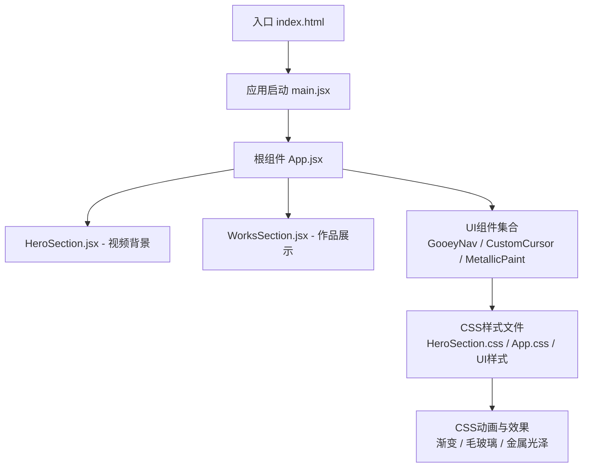
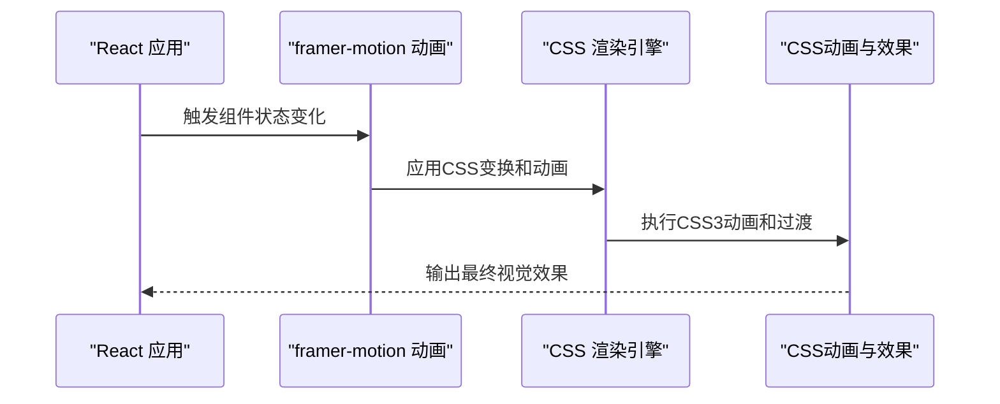
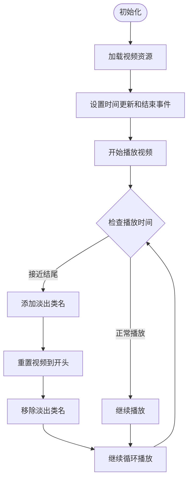
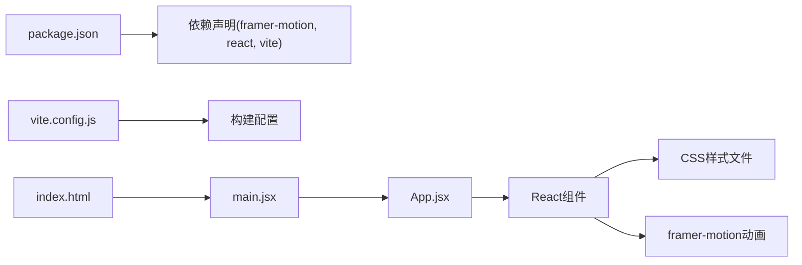

# 3D渲染系统

<cite>
**本文引用的文件**   
- [package.json](file://package.json)
- [vite.config.js](file://vite.config.js)
- [index.html](file://index.html)
- [src/main.jsx](file://src/main.jsx)
- [src/App.jsx](file://src/App.jsx)
- [src/components/HeroSection.jsx](file://src/components/HeroSection.jsx)
- [src/components/ui/MetallicPaint.jsx](file://src/components/ui/MetallicPaint.jsx)
- [src/components/ui/GooeyNav.jsx](file://src/components/ui/GooeyNav.jsx)
- [src/components/ui/CustomCursor.jsx](file://src/components/ui/CustomCursor.jsx)
</cite>

## 更新摘要
**所做更改**   
- 完全移除了Three.js 3D渲染系统相关的所有组件和依赖
- 将3D效果替换为CSS-based视觉效果实现
- 更新了项目结构以反映新的CSS优先架构
- 重新设计了HeroSection使用视频背景替代WebGL粒子效果
- 实现了基于CSS的金属光泽文字效果替代3D文本

## 目录
1. [简介](#简介)
2. [项目结构](#项目结构)
3. [核心组件](#核心组件)
4. [架构总览](#架构总览)
5. [详细组件分析](#详细组件分析)
6. [依赖关系分析](#依赖关系分析)
7. [性能考虑](#性能考虑)
8. [故障排查指南](#故障排查指南)
9. [结论](#结论)
10. [附录](#附录)

## 简介
本文件面向开发者，系统化梳理基于CSS的现代化视觉效果实现。重点覆盖以下方面：
- React与CSS动画的桥梁机制：framer-motion与CSS3动画的集成方案
- 2D场景基础：视频背景、渐变效果、毛玻璃效果、金属光泽等
- 高级效果：英雄区域视频背景、粘性导航、自定义光标、金属文字等特效组件的实现原理
- CSS渲染管线与动画优化：硬件加速、will-change属性、GPU渲染优化
- 性能优化：懒加载、代码分割、资源优化、移动端适配等
- 调试技巧与常见问题解决方案

**重要说明**：本项目已完全移除Three.js 3D渲染系统，转而采用更轻量级的CSS-based视觉效果方案，以提升性能和兼容性。

## 项目结构
本项目采用Vite + React工程化方案，所有视觉效果逻辑集中在CSS文件和React组件中，通过framer-motion提供动画支持，不使用任何WebGL或3D库。

**图表来源**
- [index.html:1-50](file://index.html#L1-L50)
- [src/main.jsx:1-50](file://src/main.jsx#L1-L50)
- [src/App.jsx:1-127](file://src/App.jsx#L1-L127)
- [src/components/HeroSection.jsx:1-125](file://src/components/HeroSection.jsx#L1-L125)

**章节来源**
- [index.html:1-50](file://index.html#L1-L50)
- [src/main.jsx:1-50](file://src/main.jsx#L1-L50)
- [src/App.jsx:1-127](file://src/App.jsx#L1-L127)

## 核心组件
本节聚焦三大类核心组件：
- 页面布局与导航：负责构建页面结构、导航交互、滚动效果
- 视觉特效：视频背景、毛玻璃效果、金属光泽、粘性导航等
- 交互组件：自定义光标、错误边界、懒加载骨架屏

关键职责划分：
- 页面布局与导航
  - 使用framer-motion处理页面级动画和过渡效果
  - 实现响应式布局和移动端适配
  - 通过Suspense实现组件懒加载
- 视觉特效
  - 使用CSS3动画和transition实现流畅的视觉效果
  - 结合JavaScript事件监听增强交互体验
  - 通过CSS变量统一管理主题和样式
- 交互组件
  - 封装可复用的UI交互模式
  - 提供错误处理和降级方案
  - 优化用户交互反馈

**章节来源**
- [src/App.jsx:1-127](file://src/App.jsx#L1-L127)
- [src/components/HeroSection.jsx:1-125](file://src/components/HeroSection.jsx#L1-L125)
- [src/components/ui/GooeyNav.jsx:1-180](file://src/components/ui/GooeyNav.jsx#L1-L180)

## 架构总览
下图展示从React到CSS渲染的路径，以及动画与效果的集成方式。

**图表来源**
- [src/App.jsx:1-127](file://src/App.jsx#L1-L127)
- [src/components/HeroSection.jsx:1-125](file://src/components/HeroSection.jsx#L1-L125)

## 详细组件分析

### 英雄区域（HeroSection）
- 目标：创建电影级视频背景的首页展示区域
- 关键点：
  - 使用HTML5 video元素作为固定背景
  - 叠加噪点纹理和渐变遮罩层
  - 实现视频循环播放和淡入淡出效果
  - 响应式设计确保多设备适配
- 性能建议：
  - 使用合适的视频编码格式和分辨率
  - 启用硬件加速和预加载
  - 移动端自动降低质量

**章节来源**
- [src/components/HeroSection.jsx:1-125](file://src/components/HeroSection.jsx#L1-L125)
- [src/components/HeroSection.css:1-231](file://src/components/HeroSection.css#L1-L231)

#### 视频背景流程

**图表来源**
- [src/components/HeroSection.jsx:52-79](file://src/components/HeroSection.jsx#L52-L79)

### 粘性导航（GooeyNav）
- 目标：实现具有粘性液体效果的导航菜单
- 关键点：
  - 使用CSS filter和backdrop-filter创建液体效果
  - JavaScript动态生成粒子动画
  - 响应式定位和尺寸计算
  - 键盘导航支持和无障碍访问
- 性能建议：
  - 使用requestAnimationFrame优化动画性能
  - 避免频繁的DOM操作
  - 合理使用CSS变量减少重排

**章节来源**
- [src/components/ui/GooeyNav.jsx:1-180](file://src/components/ui/GooeyNav.jsx#L1-L180)

### 自定义光标（CustomCursor）
- 目标：创建跟随鼠标的自定义光标效果
- 关键点：
  - 实时跟踪鼠标位置并更新光标位置
  - 悬停状态检测和视觉反馈
  - 平滑的过渡动画和缩放效果
  - 移动端自动禁用以避免冲突
- 性能建议：
  - 使用passive事件监听器提升滚动性能
  - 避免在mousemove事件中执行复杂计算
  - 利用CSS transform进行硬件加速

**章节来源**
- [src/components/ui/CustomCursor.jsx:1-64](file://src/components/ui/CustomCursor.jsx#L1-L64)

### 金属光泽文字（MetallicPaint）
- 目标：实现流动的金属光泽文字效果
- 关键点：
  - 使用CSS linear-gradient创建金属质感
  - background-clip: text实现文字裁剪
  - CSS动画驱动渐变位置移动
  - hover时加速动画增强交互感
- 性能建议：
  - 使用GPU加速的CSS属性
  - 避免过度复杂的渐变计算
  - 合理使用动画持续时间

**章节来源**
- [src/components/ui/MetallicPaint.jsx:1-20](file://src/components/ui/MetallicPaint.jsx#L1-20)
- [src/components/ui/MetallicPaint.css:1-79](file://src/components/ui/MetallicPaint.css#L1-79)

### 应用主组件（App）
- 目标：管理全局状态、路由和组件组织
- 关键点：
  - 使用framer-motion实现页面级动画
  - Suspense和lazy实现组件懒加载
  - 统一的错误边界处理
  - 响应式导航栏和滚动进度条
- 性能建议：
  - 合理拆分组件避免大bundle
  - 使用React.memo优化重渲染
  - 事件监听器的正确清理

**章节来源**
- [src/App.jsx:1-127](file://src/App.jsx#L1-L127)

## 依赖关系分析
- 运行时依赖
  - react/react-dom：UI框架核心
  - framer-motion：动画和交互库
  - lenis：平滑滚动库
- 开发依赖
  - vite：构建工具和开发服务器
  - @vitejs/plugin-react：React支持
  - eslint：代码质量检查
- 资源与样式
  - CSS文件：全局样式和组件样式
  - HTML模板：应用入口文件

**图表来源**
- [package.json:1-33](file://package.json#L1-33)
- [src/App.jsx:1-127](file://src/App.jsx#L1-L127)

**章节来源**
- [package.json:1-33](file://package.json#L1-33)
- [src/App.jsx:1-127](file://src/App.jsx#L1-L127)

## 性能考虑
- 渲染优化
  - 使用CSS3动画替代JavaScript动画以获得更好的性能
  - 利用GPU加速属性如transform和opacity
  - 合理使用will-change提示浏览器优化
- 资源管理
  - 视频资源压缩和优化选择合适的格式
  - 图片使用现代格式如WebP和AVIF
  - 字体文件子集化和延迟加载
- 内存管理
  - 及时清理事件监听器和定时器
  - 避免内存泄漏和循环引用
  - 合理使用React的useEffect清理函数
- 网络优化
  - 启用HTTP缓存和CDN加速
  - 使用懒加载和按需加载策略
  - 压缩静态资源和启用Gzip/Brotli

## 故障排查指南
- 常见错误
  - 视频无法播放：检查视频格式兼容性和CORS设置
  - 动画卡顿：监控FPS和使用Performance面板分析
  - 样式冲突：检查CSS优先级和特异性问题
  - 移动端适配：测试不同屏幕尺寸和设备特性
- 调试技巧
  - 使用浏览器DevTools的Elements面板检查DOM结构
  - 利用Network面板分析资源加载情况
  - 使用Performance面板录制和分析渲染性能
  - 在控制台输出关键状态和事件信息
- 常见问题
  - 字体加载失败：确保字体文件可用且路径正确
  - 动画不生效：检查CSS属性和浏览器兼容性
  - 触摸事件冲突：区分鼠标和触摸事件处理
  - 内存占用过高：监控内存使用情况并及时释放

**章节来源**
- [src/components/HeroSection.jsx:1-125](file://src/components/HeroSection.jsx#L1-L125)
- [src/components/ui/GooeyNav.jsx:1-180](file://src/components/ui/GooeyNav.jsx#L1-L180)
- [src/components/ui/CustomCursor.jsx:1-64](file://src/components/ui/CustomCursor.jsx#L1-L64)

## 结论
本项目已成功从Three.js 3D渲染系统迁移到基于CSS的现代化视觉效果方案。通过移除重型WebGL依赖，显著提升了应用性能和兼容性。新的架构采用React + CSS + framer-motion的组合，在保证视觉效果的同时提供了更好的用户体验和开发体验。

主要优势包括：
- 更好的跨平台兼容性
- 更低的内存占用和CPU使用率
- 更快的加载速度和首屏渲染
- 更简单的维护和扩展性
- 更好的SEO和无障碍支持

## 附录
- 术语说明
  - WebGL：浏览器内图形API，用于3D渲染（已移除）
  - CSS3动画：基于CSS的动画技术，性能优于JavaScript动画
  - framer-motion：React动画库，提供声明式的动画API
  - 懒加载：按需加载组件和资源的技术
  - 硬件加速：利用GPU进行图形渲染的技术
- 最佳实践清单
  - 优先使用CSS3动画而非JavaScript动画
  - 合理使用GPU加速属性提升性能
  - 实施懒加载和代码分割优化加载速度
  - 确保移动端友好和无障碍访问
  - 使用现代浏览器API和特性检测
  - 实施适当的错误处理和降级方案