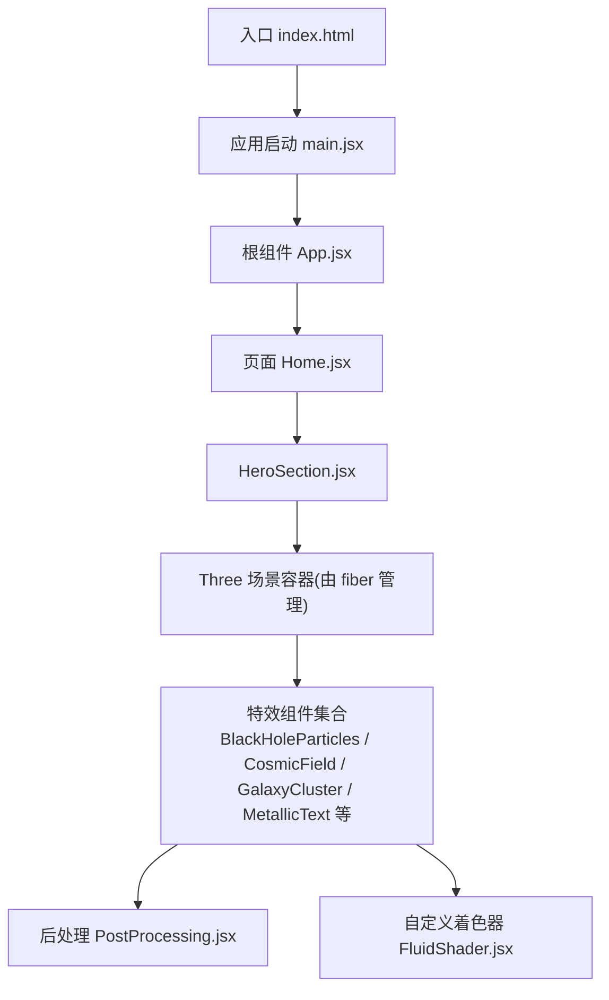
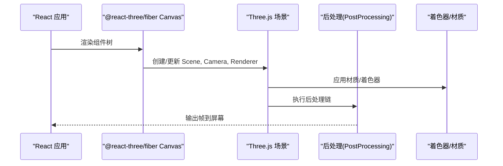
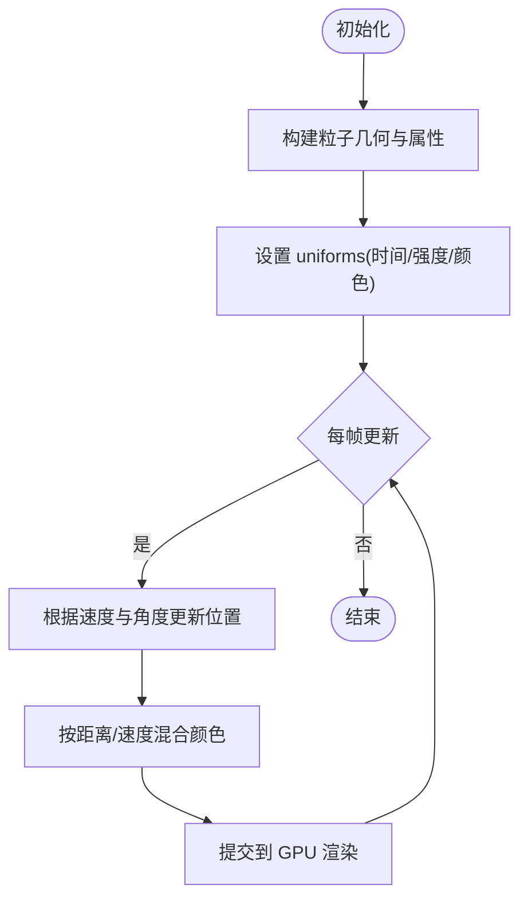
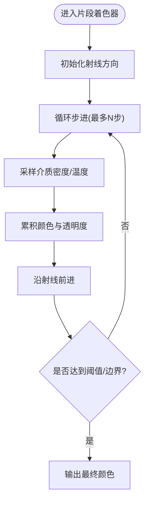
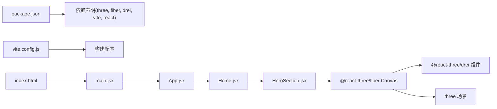

# 3D渲染系统

<cite>
**本文引用的文件**   
- [package.json](file://package.json)
- [vite.config.js](file://vite.config.js)
- [index.html](file://index.html)
- [src/main.jsx](file://src/main.jsx)
- [src/App.jsx](file://src/App.jsx)
- [src/Home.jsx](file://src/Home.jsx)
- [src/components/three/BlackHoleParticles.jsx](file://src/components/three/BlackHoleParticles.jsx)
- [src/components/three/RayMarchedBlackHole.jsx](file://src/components/three/RayMarchedBlackHole.jsx)
- [src/components/three/CosmicField.jsx](file://src/components/three/CosmicField.jsx)
- [src/components/three/CosmicParticles.jsx](file://src/components/three/CosmicParticles.jsx)
- [src/components/three/GalaxyCluster.jsx](file://src/components/three/GalaxyCluster.jsx)
- [src/components/three/MetallicText.jsx](file://src/components/three/MetallicText.jsx)
- [src/components/three/PortfolioText3D.jsx](file://src/components/three/PortfolioText3D.jsx)
- [src/components/three/PostProcessing.jsx](file://src/components/three/PostProcessing.jsx)
- [src/components/three/FluidShader.jsx](file://src/components/three/FluidShader.jsx)
- [src/components/three/PuffedText.jsx](file://src/components/three/PuffedText.jsx)
- [src/components/three/SaturnParticles.jsx](file://src/components/three/SaturnParticles.jsx)
- [src/components/three/ShootingStars.jsx](file://src/components/three/ShootingStars.jsx)
- [src/components/three/SkyBox.jsx](file://src/components/three/SkyBox.jsx)
- [src/components/three/TerrazzoMaterial.jsx](file://src/components/three/TerrazzoMaterial.jsx)
- [src/components/HeroSection.jsx](file://src/components/HeroSection.jsx)
</cite>

## 目录
1. [简介](#简介)
2. [项目结构](#项目结构)
3. [核心组件](#核心组件)
4. [架构总览](#架构总览)
5. [详细组件分析](#详细组件分析)
6. [依赖关系分析](#依赖关系分析)
7. [性能考虑](#性能考虑)
8. [故障排查指南](#故障排查指南)
9. [结论](#结论)
10. [附录](#附录)

## 简介
本文件面向开发者，系统化梳理基于 Three.js 的沉浸式视觉效果实现。重点覆盖以下方面：
- React 与 Three.js 的桥梁机制：@react-three/fiber 与 @react-three/drei 的集成方案
- 3D 场景基础：场景创建、相机控制、光照设置、材质定义
- 高级效果：黑洞粒子、宇宙场、星系集群、金属文本等特效组件的实现原理
- WebGL 渲染管线与着色器编程：顶点/片段着色器、后处理效果（后处理链）
- 性能优化：几何体合并、纹理压缩、LOD、实例化渲染等
- 调试技巧与常见问题解决方案

## 项目结构
本项目采用 Vite + React 工程化方案，3D 相关逻辑集中在 src/components/three 目录下，通过 React 组件封装 Three.js 能力，并使用 @react-three/fiber 作为渲染桥接层，@react-three/drei 提供常用辅助组件与工具。

图表来源
- [index.html:1-50](file://index.html#L1-L50)
- [src/main.jsx:1-50](file://src/main.jsx#L1-L50)
- [src/App.jsx:1-50](file://src/App.jsx#L1-L50)
- [src/Home.jsx:1-50](file://src/Home.jsx#L1-L50)
- [src/components/HeroSection.jsx:1-50](file://src/components/HeroSection.jsx#L1-L50)
- [src/components/three/PostProcessing.jsx:1-50](file://src/components/three/PostProcessing.jsx#L1-L50)
- [src/components/three/FluidShader.jsx:1-50](file://src/components/three/FluidShader.jsx#L1-L50)

章节来源
- [index.html:1-50](file://index.html#L1-L50)
- [src/main.jsx:1-50](file://src/main.jsx#L1-L50)
- [src/App.jsx:1-50](file://src/App.jsx#L1-L50)
- [src/Home.jsx:1-50](file://src/Home.jsx#L1-L50)
- [src/components/HeroSection.jsx:1-50](file://src/components/HeroSection.jsx#L1-L50)

## 核心组件
本节聚焦三大类核心组件：
- 场景与后处理：负责构建 Three.js 场景、相机、光照、后处理链
- 视觉特效：黑洞、宇宙场、星系、金属文本等
- 着色器与材质：流体着色器、特殊材质（如 Terrazzo）

关键职责划分：
- 场景与后处理
  - 使用 @react-three/fiber 的 Canvas 挂载 Three.js 渲染上下文
  - 使用 drei 的 OrbitControls、Environment、Html 等增强交互与 UI
  - 使用 drei 的后处理管线或自定义 EffectComposer 组合后处理
- 视觉特效
  - 将复杂几何与动画封装为可复用 React 组件
  - 通过 props 暴露配置项（密度、速度、颜色、强度等）
- 着色器与材质
  - 在组件中声明 vertex/fragment shader，结合 uniforms 驱动动态效果
  - 对材质进行参数化，便于在不同场景中复用

章节来源
- [src/components/three/PostProcessing.jsx:1-120](file://src/components/three/PostProcessing.jsx#L1-L120)
- [src/components/three/FluidShader.jsx:1-120](file://src/components/three/FluidShader.jsx#L1-L120)
- [src/components/three/BlackHoleParticles.jsx:1-120](file://src/components/three/BlackHoleParticles.jsx#L1-L120)
- [src/components/three/CosmicField.jsx:1-120](file://src/components/three/CosmicField.jsx#L1-L120)
- [src/components/three/GalaxyCluster.jsx:1-120](file://src/components/three/GalaxyCluster.jsx#L1-L120)
- [src/components/three/MetallicText.jsx:1-120](file://src/components/three/MetallicText.jsx#L1-L120)

## 架构总览
下图展示从 React 到 Three.js 的渲染路径，以及后处理与着色器的集成方式。

图表来源
- [src/main.jsx:1-50](file://src/main.jsx#L1-L50)
- [src/App.jsx:1-50](file://src/App.jsx#L1-L50)
- [src/components/three/PostProcessing.jsx:1-120](file://src/components/three/PostProcessing.jsx#L1-L120)
- [src/components/three/FluidShader.jsx:1-120](file://src/components/three/FluidShader.jsx#L1-L120)

## 详细组件分析

### 黑洞粒子效果（BlackHoleParticles）
- 目标：模拟围绕中心旋转的粒子流，形成“吸积盘”视觉
- 关键点：
  - 使用 BufferGeometry 存储大量粒子的位置、速度、颜色
  - 在每帧更新 uniforms（时间、半径、速度、颜色混合）
  - 可选：结合后处理（辉光、模糊）增强视觉冲击
- 性能建议：
  - 使用点精灵（Points）而非 Mesh
  - 合理控制粒子数量与纹理尺寸
  - 避免每帧创建新对象，复用 Buffer

章节来源
- [src/components/three/BlackHoleParticles.jsx:1-120](file://src/components/three/BlackHoleParticles.jsx#L1-L120)

#### 算法流程（粒子运动与绘制）

图表来源
- [src/components/three/BlackHoleParticles.jsx:1-120](file://src/components/three/BlackHoleParticles.jsx#L1-L120)

### 光线步进黑洞（RayMarchedBlackHole）
- 目标：使用射线步进在片段着色器中计算引力透镜与吸积盘
- 关键点：
  - 在 fragment shader 中迭代步进，累积散射与吸收
  - 使用球坐标与径向函数近似黑洞势场
  - 通过 uniforms 控制质量、视角、分辨率
- 性能建议：
  - 限制最大步数与步进精度
  - 使用较低分辨率渲染后再放大
  - 利用多边形裁剪减少无效区域

章节来源
- [src/components/three/RayMarchedBlackHole.jsx:1-120](file://src/components/three/RayMarchedBlackHole.jsx#L1-L120)

#### 射线步进流程

图表来源
- [src/components/three/RayMarchedBlackHole.jsx:1-120](file://src/components/three/RayMarchedBlackHole.jsx#L1-L120)

### 宇宙场渲染（CosmicField）
- 目标：生成大规模背景星场与星云噪声
- 关键点：
  - 使用噪声函数（Perlin/Simplex）生成空间密度
  - 将密度映射为颜色与亮度，叠加多层频率
  - 可通过相机移动产生视差
- 性能建议：
  - 使用体积云或大平面+噪声贴图
  - 降低采样次数或使用预计算纹理

章节来源
- [src/components/three/CosmicField.jsx:1-120](file://src/components/three/CosmicField.jsx#L1-L120)

### 宇宙粒子（CosmicParticles）
- 目标：营造深空氛围的随机分布粒子
- 关键点：
  - 均匀/泊松分布生成初始位置
  - 缓慢漂移与闪烁动画
  - 与背景场配合形成层次
- 性能建议：
  - 使用 InstancedMesh 或 Points
  - 控制可见范围（视锥剔除）

章节来源
- [src/components/three/CosmicParticles.jsx:1-120](file://src/components/three/CosmicParticles.jsx#L1-L120)

### 星系集群（GalaxyCluster）
- 目标：多个旋涡星系组成的集群场景
- 关键点：
  - 每个星系由中心核、旋臂、尘埃带组成
  - 使用分形/螺旋函数生成旋臂点集
  - 集群间相对运动与自转
- 性能建议：
  - 合并相近几何体
  - 使用 LOD 切换细节等级

章节来源
- [src/components/three/GalaxyCluster.jsx:1-120](file://src/components/three/GalaxyCluster.jsx#L1-L120)

### 金属文本（MetallicText）
- 目标：高反射金属质感的 3D 文字
- 关键点：
  - 加载字体并生成 TextGeometry
  - 使用高粗糙度/金属度材质与环境贴图反射
  - 添加边缘高光与菲涅尔效应
- 性能建议：
  - 缓存字体几何
  - 使用低分段数并在近景切换高模

章节来源
- [src/components/three/MetallicText.jsx:1-120](file://src/components/three/MetallicText.jsx#L1-L120)

### 作品集 3D 文本（PortfolioText3D）
- 目标：用于作品集展示的 3D 标题文本
- 关键点：
  - 与 HeroSection 联动，随滚动/鼠标变化
  - 材质与光照强调立体感
- 性能建议：
  - 仅在可视区域内渲染
  - 使用轻量字体与简化几何

章节来源
- [src/components/three/PortfolioText3D.jsx:1-120](file://src/components/three/PortfolioText3D.jsx#L1-L120)

### 后处理（PostProcessing）
- 目标：统一的后处理链（泛光、色调映射、色差等）
- 关键点：
  - 使用 EffectComposer 串联多个 Pass
  - 通过 uniforms 控制强度与阈值
  - 支持按需启用/禁用以提升性能
- 性能建议：
  - 降低后处理分辨率
  - 合并相似 Pass

章节来源
- [src/components/three/PostProcessing.jsx:1-120](file://src/components/three/PostProcessing.jsx#L1-L120)

### 流体着色器（FluidShader）
- 目标：基于 GLSL 的动态流体/烟雾效果
- 关键点：
  - 顶点着色器传递 UV 与法线
  - 片段着色器使用噪声与时间变量扰动颜色
  - 通过 uniforms 调节粘度、速度、颜色渐变
- 性能建议：
  - 使用较低分辨率渲染流体
  - 预计算噪声纹理

章节来源
- [src/components/three/FluidShader.jsx:1-120](file://src/components/three/FluidShader.jsx#L1-L120)

### 膨胀文本（PuffedText）
- 目标：具有充气/膨胀感的 3D 文本
- 关键点：
  - 在片段着色器中对表面法线进行扰动
  - 增加高光扩散与体积感
- 性能建议：
  - 控制扰动幅度与采样次数

章节来源
- [src/components/three/PuffedText.jsx:1-120](file://src/components/three/PuffedText.jsx#L1-L120)

### 土星粒子（SaturnParticles）
- 目标：模拟土星环的粒子系统
- 关键点：
  - 环形分布与厚度控制
  - 粒子大小与透明度随距离衰减
- 性能建议：
  - 使用 Points 与纹理遮罩
  - 限制可见半径

章节来源
- [src/components/three/SaturnParticles.jsx:1-120](file://src/components/three/SaturnParticles.jsx#L1-L120)

### 流星（ShootingStars）
- 目标：随机出现的流星轨迹
- 关键点：
  - 随机起点与方向，快速位移
  - 尾部拖尾与渐隐
- 性能建议：
  - 池化对象复用
  - 控制同时出现数量

章节来源
- [src/components/three/ShootingStars.jsx:1-120](file://src/components/three/ShootingStars.jsx#L1-L120)

### 天空盒（SkyBox）
- 目标：提供环境背景与反射参考
- 关键点：
  - 六面立方体贴图或程序化噪声天空
  - 与全局光照/环境贴图联动
- 性能建议：
  - 使用压缩纹理格式
  - 按需加载不同分辨率

章节来源
- [src/components/three/SkyBox.jsx:1-120](file://src/components/three/SkyBox.jsx#L1-L120)

### 水磨石材质（TerrazzoMaterial）
- 目标：装饰性材质，适合 UI 元素或背景
- 关键点：
  - 在片段着色器中生成碎石与基色混合
  - 通过 uniforms 调整颗粒密度与尺寸
- 性能建议：
  - 预计算噪声纹理
  - 避免逐像素复杂运算

章节来源
- [src/components/three/TerrazzoMaterial.jsx:1-120](file://src/components/three/TerrazzoMaterial.jsx#L1-L120)

## 依赖关系分析
- 运行时依赖
  - three：WebGL 渲染核心
  - @react-three/fiber：React 与 Three.js 的桥接
  - @react-three/drei：常用 3D 组件与工具（控制器、后处理、环境贴图等）
- 构建与打包
  - vite：开发与构建工具
  - react/react-dom：UI 框架
- 资源与样式
  - index.html：应用入口
  - CSS：全局样式与组件样式

图表来源
- [package.json:1-120](file://package.json#L1-L120)
- [vite.config.js:1-120](file://vite.config.js#L1-L120)
- [index.html:1-50](file://index.html#L1-L50)
- [src/main.jsx:1-50](file://src/main.jsx#L1-L50)
- [src/App.jsx:1-50](file://src/App.jsx#L1-L50)
- [src/Home.jsx:1-50](file://src/Home.jsx#L1-L50)
- [src/components/HeroSection.jsx:1-50](file://src/components/HeroSection.jsx#L1-L50)

章节来源
- [package.json:1-120](file://package.json#L1-L120)
- [vite.config.js:1-120](file://vite.config.js#L1-L120)
- [index.html:1-50](file://index.html#L1-L50)
- [src/main.jsx:1-50](file://src/main.jsx#L1-L50)
- [src/App.jsx:1-50](file://src/App.jsx#L1-L50)
- [src/Home.jsx:1-50](file://src/Home.jsx#L1-L50)
- [src/components/HeroSection.jsx:1-50](file://src/components/HeroSection.jsx#L1-L50)

## 性能考虑
- 几何与网格
  - 合并静态几何体以减少 draw call
  - 使用 InstancedMesh 批量渲染重复对象
  - 合理使用 LOD 切换细节等级
- 纹理与材质
  - 使用压缩纹理（如 KTX2/Basis）与合适 mipmaps
  - 避免过高分辨率纹理；按需加载
  - 材质参数尽量复用，减少状态切换
- 着色器与后处理
  - 限制片段着色器复杂度与采样次数
  - 后处理使用较低分辨率或选择性启用
- 动画与更新
  - 使用 requestAnimationFrame 节流
  - 避免每帧分配内存（复用 Buffer、对象池）
- 场景组织
  - 视锥剔除与层级管理
  - 隐藏不可见对象，减少渲染负担

[本节为通用指导，不直接分析具体文件]

## 故障排查指南
- 常见错误
  - 纹理未加载或跨域问题：检查资源路径与 CORS 配置
  - 着色器编译失败：确认 uniform 类型与语法正确
  - 后处理黑屏：检查 EffectComposer 顺序与 renderTarget
  - 性能卡顿：监控 draw call 与三角面数，定位热点组件
- 调试技巧
  - 使用 drei 的 Stats 组件查看 FPS 与渲染统计
  - 在浏览器 DevTools 的 Performance 面板录制帧
  - 逐步关闭后处理与特效，定位瓶颈
- 常见问题
  - 字体加载失败：确保字体文件可用且路径正确
  - 相机控制异常：检查 OrbitControls 绑定与事件冲突
  - 移动端适配：降低分辨率与粒子数量，禁用重型后处理

章节来源
- [src/components/three/PostProcessing.jsx:1-120](file://src/components/three/PostProcessing.jsx#L1-L120)
- [src/components/three/FluidShader.jsx:1-120](file://src/components/three/FluidShader.jsx#L1-L120)
- [src/components/three/MetallicText.jsx:1-120](file://src/components/three/MetallicText.jsx#L1-L120)
- [src/components/three/SkyBox.jsx:1-120](file://src/components/three/SkyBox.jsx#L1-L120)

## 结论
本系统以 @react-three/fiber 为核心桥梁，将 React 组件模型与 Three.js 渲染能力无缝对接，并通过 @react-three/drei 提供丰富的 3D 工具与后处理支持。通过对黑洞、宇宙场、星系、金属文本等特效组件的系统化封装，实现了高性能、可复用的 3D 视觉效果。结合合理的性能优化策略与调试方法，可在保证视觉表现的同时维持流畅的用户体验。

[本节为总结性内容，不直接分析具体文件]

## 附录
- 术语说明
  - WebGL：浏览器内图形 API，驱动 GPU 进行 3D 渲染
  - 着色器：运行在 GPU 上的程序，分为顶点与片段着色器
  - 后处理：在渲染完成后对整帧图像进行处理的技术
  - LOD：根据距离或重要性切换不同细节级别的模型
- 最佳实践清单
  - 优先使用 Points/InstancedMesh 渲染大规模粒子
  - 控制后处理强度与分辨率，按需启用
  - 预计算与缓存昂贵数据（字体、噪声纹理）
  - 在移动端降级特效，保障基本体验

[本节为补充信息，不直接分析具体文件]