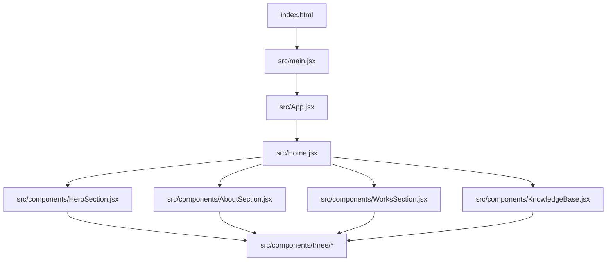
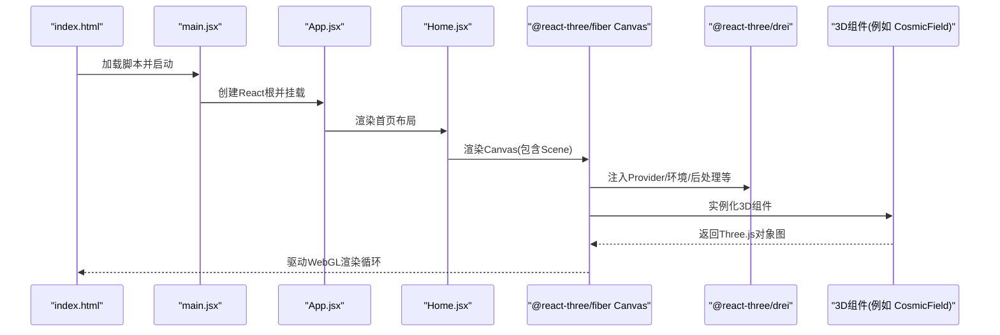
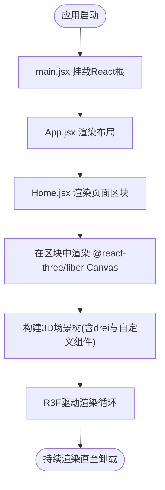
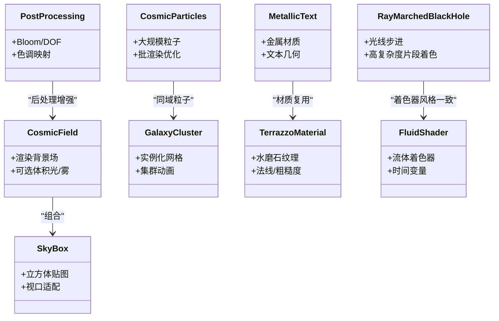
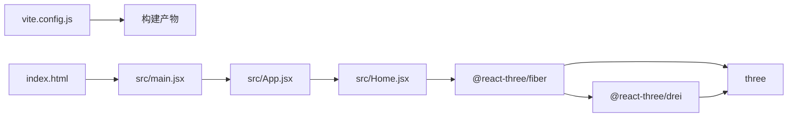

# Three.js集成架构

<cite>
**本文引用的文件**   
- [package.json](file://package.json)
- [vite.config.js](file://vite.config.js)
- [index.html](file://index.html)
- [src/main.jsx](file://src/main.jsx)
- [src/App.jsx](file://src/App.jsx)
- [src/Home.jsx](file://src/Home.jsx)
- [src/components/HeroSection.jsx](file://src/components/HeroSection.jsx)
- [src/components/AboutSection.jsx](file://src/components/AboutSection.jsx)
- [src/components/WorksSection.jsx](file://src/components/WorksSection.jsx)
- [src/components/KnowledgeBase.jsx](file://src/components/KnowledgeBase.jsx)
- [src/components/three/CosmicField.jsx](file://src/components/three/CosmicField.jsx)
- [src/components/three/CosmicParticles.jsx](file://src/components/three/CosmicParticles.jsx)
- [src/components/three/GalaxyCluster.jsx](file://src/components/three/GalaxyCluster.jsx)
- [src/components/three/SkyBox.jsx](file://src/components/three/SkyBox.jsx)
- [src/components/three/PostProcessing.jsx](file://src/components/three/PostProcessing.jsx)
- [src/components/three/MetallicText.jsx](file://src/components/three/MetallicText.jsx)
- [src/components/three/TerrazzoMaterial.jsx](file://src/components/three/TerrazzoMaterial.jsx)
- [src/components/three/FluidShader.jsx](file://src/components/three/FluidShader.jsx)
- [src/components/three/RayMarchedBlackHole.jsx](file://src/components/three/RayMarchedBlackHole.jsx)
- [src/components/three/ParticleHero.jsx](file://src/components/three/ParticleHero.jsx)
- [src/components/three/ShootingStars.jsx](file://src/components/three/ShootingStars.jsx)
- [src/components/three/PortfolioText3D.jsx](file://src/components/three/PortfolioText3D.jsx)
- [src/components/three/PuffedText.jsx](file://src/components/three/PuffedText.jsx)
- [src/components/three/BlackHoleParticles.jsx](file://src/components/three/BlackHoleParticles.jsx)
- [src/components/three/SaturnParticles.jsx](file://src/components/three/SaturnParticles.jsx)
</cite>

## 目录
1. [简介](#简介)
2. [项目结构](#项目结构)
3. [核心组件](#核心组件)
4. [架构总览](#架构总览)
5. [详细组件分析](#详细组件分析)
6. [依赖关系分析](#依赖关系分析)
7. [性能考虑](#性能考虑)
8. [故障排查指南](#故障排查指南)
9. [结论](#结论)
10. [附录](#附录)

## 简介
本文件面向希望在React生态中高效构建3D体验的开发者，系统性阐述基于@react-three/fiber与@react-three/drei的Three.js集成架构。文档覆盖以下主题：
- React与Three.js的桥梁机制（渲染树、事件系统、生命周期）
- 3D场景初始化流程与渲染循环管理
- 组件化3D开发模式的优势与实现方式
- WebGL上下文管理、性能监控与错误处理
- 从传统Three.js迁移到React Three Fiber的最佳实践
- 提供“第一个3D场景”的完整示例路径指引（几何体、材质、光照基础配置）

## 项目结构
本项目采用Vite + React工程化方案，3D相关逻辑集中在src/components/three目录，页面级组合在src/components下，入口位于src/main.jsx与src/App.jsx。

图表来源
- [index.html:1-200](file://index.html#L1-L200)
- [src/main.jsx:1-200](file://src/main.jsx#L1-L200)
- [src/App.jsx:1-200](file://src/App.jsx#L1-L200)
- [src/Home.jsx:1-200](file://src/Home.jsx#L1-L200)
- [src/components/HeroSection.jsx:1-200](file://src/components/HeroSection.jsx#L1-L200)
- [src/components/AboutSection.jsx:1-200](file://src/components/AboutSection.jsx#L1-L200)
- [src/components/WorksSection.jsx:1-200](file://src/components/WorksSection.jsx#L1-L200)
- [src/components/KnowledgeBase.jsx:1-200](file://src/components/KnowledgeBase.jsx#L1-L200)

章节来源
- [package.json:1-200](file://package.json#L1-L200)
- [vite.config.js:1-200](file://vite.config.js#L1-L200)
- [index.html:1-200](file://index.html#L1-L200)
- [src/main.jsx:1-200](file://src/main.jsx#L1-L200)
- [src/App.jsx:1-200](file://src/App.jsx#L1-L200)
- [src/Home.jsx:1-200](file://src/Home.jsx#L1-L200)

## 核心组件
- 应用入口与路由组织
  - src/main.jsx：创建React根节点并挂载到DOM
  - src/App.jsx：顶层布局与全局状态
  - src/Home.jsx：首页容器，聚合各业务区块
- 页面区块
  - HeroSection.jsx：首屏3D展示区
  - AboutSection.jsx：关于页区块
  - WorksSection.jsx：作品展示区块
  - KnowledgeBase.jsx：知识库区块
- 3D组件集合（src/components/three）
  - 宇宙背景与粒子：CosmicField.jsx、CosmicParticles.jsx、SaturnParticles.jsx、ShootingStars.jsx
  - 星系与黑洞：GalaxyCluster.jsx、RayMarchedBlackHole.jsx、BlackHoleParticles.jsx
  - 天空盒与后处理：SkyBox.jsx、PostProcessing.jsx
  - 文本与材质：MetallicText.jsx、TerrazzoMaterial.jsx、PuffedText.jsx、PortfolioText3D.jsx
  - 自定义着色器与特效：FluidShader.jsx、ParticleHero.jsx

章节来源
- [src/main.jsx:1-200](file://src/main.jsx#L1-L200)
- [src/App.jsx:1-200](file://src/App.jsx#L1-L200)
- [src/Home.jsx:1-200](file://src/Home.jsx#L1-L200)
- [src/components/HeroSection.jsx:1-200](file://src/components/HeroSection.jsx#L1-L200)
- [src/components/AboutSection.jsx:1-200](file://src/components/AboutSection.jsx#L1-L200)
- [src/components/WorksSection.jsx:1-200](file://src/components/WorksSection.jsx#L1-L200)
- [src/components/KnowledgeBase.jsx:1-200](file://src/components/KnowledgeBase.jsx#L1-L200)
- [src/components/three/CosmicField.jsx:1-200](file://src/components/three/CosmicField.jsx#L1-L200)
- [src/components/three/CosmicParticles.jsx:1-200](file://src/components/three/CosmicParticles.jsx#L1-L200)
- [src/components/three/GalaxyCluster.jsx:1-200](file://src/components/three/GalaxyCluster.jsx#L1-L200)
- [src/components/three/SkyBox.jsx:1-200](file://src/components/three/SkyBox.jsx#L1-L200)
- [src/components/three/PostProcessing.jsx:1-200](file://src/components/three/PostProcessing.jsx#L1-L200)
- [src/components/three/MetallicText.jsx:1-200](file://src/components/three/MetallicText.jsx#L1-L200)
- [src/components/three/TerrazzoMaterial.jsx:1-200](file://src/components/three/TerrazzoMaterial.jsx#L1-L200)
- [src/components/three/FluidShader.jsx:1-200](file://src/components/three/FluidShader.jsx#L1-L200)
- [src/components/three/RayMarchedBlackHole.jsx:1-200](file://src/components/three/RayMarchedBlackHole.jsx#L1-L200)
- [src/components/three/ParticleHero.jsx:1-200](file://src/components/three/ParticleHero.jsx#L1-L200)
- [src/components/three/ShootingStars.jsx:1-200](file://src/components/three/ShootingStars.jsx#L1-L200)
- [src/components/three/PortfolioText3D.jsx:1-200](file://src/components/three/PortfolioText3D.jsx#L1-L200)
- [src/components/three/PuffedText.jsx:1-200](file://src/components/three/PuffedText.jsx#L1-L200)
- [src/components/three/BlackHoleParticles.jsx:1-200](file://src/components/three/BlackHoleParticles.jsx#L1-L200)
- [src/components/three/SaturnParticles.jsx:1-200](file://src/components/three/SaturnParticles.jsx#L1-L200)

## 架构总览
下图展示了从HTML入口到React应用再到R3F Canvas与3D组件的调用链，以及drei提供的常用能力（如环境贴图、后处理、交互等）。

图表来源
- [index.html:1-200](file://index.html#L1-L200)
- [src/main.jsx:1-200](file://src/main.jsx#L1-L200)
- [src/App.jsx:1-200](file://src/App.jsx#L1-L200)
- [src/Home.jsx:1-200](file://src/Home.jsx#L1-L200)
- [src/components/HeroSection.jsx:1-200](file://src/components/HeroSection.jsx#L1-L200)
- [src/components/three/CosmicField.jsx:1-200](file://src/components/three/CosmicField.jsx#L1-L200)

## 详细组件分析

### 3D场景初始化流程
- 入口挂载：main.jsx负责创建React根节点并挂载到DOM
- 应用装配：App.jsx组织全局布局与路由；Home.jsx聚合页面区块
- 3D画布：在页面区块（如HeroSection）中引入@react-three/fiber的Canvas，作为3D渲染容器
- 场景组装：在Canvas内放置由drei与自定义3D组件构成的场景树
- 渲染循环：R3F接管requestAnimationFrame，自动同步React状态与Three.js对象图

图表来源
- [src/main.jsx:1-200](file://src/main.jsx#L1-L200)
- [src/App.jsx:1-200](file://src/App.jsx#L1-L200)
- [src/Home.jsx:1-200](file://src/Home.jsx#L1-L200)
- [src/components/HeroSection.jsx:1-200](file://src/components/HeroSection.jsx#L1-L200)

章节来源
- [src/main.jsx:1-200](file://src/main.jsx#L1-L200)
- [src/App.jsx:1-200](file://src/App.jsx#L1-L200)
- [src/Home.jsx:1-200](file://src/Home.jsx#L1-L200)
- [src/components/HeroSection.jsx:1-200](file://src/components/HeroSection.jsx#L1-L200)

### 渲染循环管理与WebGL上下文
- 渲染循环：R3F内部维护渲染循环，将React状态变化映射为Three.js对象更新
- 上下文管理：Canvas支持WebGL上下文选项（如抗锯齿、深度、透明度），可通过props传入
- 生命周期：组件挂载/卸载时，R3F会触发对应的钩子，便于资源分配与释放
- 性能要点：避免在每帧创建对象；使用useRef缓存引用；按需启用阴影/反射等高开销特性

章节来源
- [src/components/HeroSection.jsx:1-200](file://src/components/HeroSection.jsx#L1-L200)
- [src/components/three/CosmicField.jsx:1-200](file://src/components/three/CosmicField.jsx#L1-L200)

### 事件处理机制
- 指针事件：通过onPointerDown/onPointerMove/onPointerUp等捕获鼠标/触摸事件
- 拾取与射线：R3F内置射线拾取，可直接在3D对象上绑定事件处理器
- 交互优化：对大量粒子的场景建议合并事件或降级为命中测试近似计算

章节来源
- [src/components/three/CosmicParticles.jsx:1-200](file://src/components/three/CosmicParticles.jsx#L1-L200)
- [src/components/three/GalaxyCluster.jsx:1-200](file://src/components/three/GalaxyCluster.jsx#L1-L200)

### 组件化3D开发模式
- 优势
  - 声明式描述场景：以React组件表达3D对象，天然具备复用、组合与状态管理能力
  - 生态整合：借助drei快速获得环境贴图、后处理、动画、交互等能力
  - 可测试性：组件边界清晰，易于单元测试与可视化调试
- 实现方式
  - 将几何体、材质、光照封装为独立组件（如MetallicText.jsx、TerrazzoMaterial.jsx）
  - 使用drei的现成组件减少样板代码（如Environment、Html、Sparkles等）
  - 通过props与context传递配置，保持高内聚低耦合

章节来源
- [src/components/three/MetallicText.jsx:1-200](file://src/components/three/MetallicText.jsx#L1-L200)
- [src/components/three/TerrazzoMaterial.jsx:1-200](file://src/components/three/TerrazzoMaterial.jsx#L1-L200)
- [src/components/three/PostProcessing.jsx:1-200](file://src/components/three/PostProcessing.jsx#L1-L200)

### 关键3D组件职责划分
- 宇宙背景与粒子
  - CosmicField.jsx：大尺度背景场（可能包含体积光/雾效/渐变）
  - CosmicParticles.jsx：大规模粒子系统（注意批渲染与纹理复用）
  - SaturnParticles.jsx / ShootingStars.jsx：动态天体与流星效果
- 星系与黑洞
  - GalaxyCluster.jsx：星系集群（实例化/InstancedMesh优化）
  - RayMarchedBlackHole.jsx：光线步进黑洞（着色器复杂度较高）
  - BlackHoleParticles.jsx：围绕黑洞的粒子环绕
- 天空盒与后处理
  - SkyBox.jsx：立方体贴图天空盒
  - PostProcessing.jsx：Bloom/DOF/色调映射等后处理管线
- 文本与材质
  - MetallicText.jsx：金属质感文本
  - TerrazzoMaterial.jsx：水磨石材质
  - PuffedText.jsx / PortfolioText3D.jsx：膨胀/作品集风格文本
- 自定义着色器与特效
  - FluidShader.jsx：流体着色器
  - ParticleHero.jsx：英雄区域粒子动效

图表来源
- [src/components/three/CosmicField.jsx:1-200](file://src/components/three/CosmicField.jsx#L1-L200)
- [src/components/three/CosmicParticles.jsx:1-200](file://src/components/three/CosmicParticles.jsx#L1-L200)
- [src/components/three/GalaxyCluster.jsx:1-200](file://src/components/three/GalaxyCluster.jsx#L1-L200)
- [src/components/three/SkyBox.jsx:1-200](file://src/components/three/SkyBox.jsx#L1-L200)
- [src/components/three/PostProcessing.jsx:1-200](file://src/components/three/PostProcessing.jsx#L1-L200)
- [src/components/three/MetallicText.jsx:1-200](file://src/components/three/MetallicText.jsx#L1-L200)
- [src/components/three/TerrazzoMaterial.jsx:1-200](file://src/components/three/TerrazzoMaterial.jsx#L1-L200)
- [src/components/three/FluidShader.jsx:1-200](file://src/components/three/FluidShader.jsx#L1-L200)
- [src/components/three/RayMarchedBlackHole.jsx:1-200](file://src/components/three/RayMarchedBlackHole.jsx#L1-L200)

章节来源
- [src/components/three/CosmicField.jsx:1-200](file://src/components/three/CosmicField.jsx#L1-L200)
- [src/components/three/CosmicParticles.jsx:1-200](file://src/components/three/CosmicParticles.jsx#L1-L200)
- [src/components/three/GalaxyCluster.jsx:1-200](file://src/components/three/GalaxyCluster.jsx#L1-L200)
- [src/components/three/SkyBox.jsx:1-200](file://src/components/three/SkyBox.jsx#L1-L200)
- [src/components/three/PostProcessing.jsx:1-200](file://src/components/three/PostProcessing.jsx#L1-L200)
- [src/components/three/MetallicText.jsx:1-200](file://src/components/three/MetallicText.jsx#L1-L200)
- [src/components/three/TerrazzoMaterial.jsx:1-200](file://src/components/three/TerrazzoMaterial.jsx#L1-L200)
- [src/components/three/FluidShader.jsx:1-200](file://src/components/three/FluidShader.jsx#L1-L200)
- [src/components/three/RayMarchedBlackHole.jsx:1-200](file://src/components/three/RayMarchedBlackHole.jsx#L1-L200)

### 第一个3D场景示例（路径指引）
- 目标：创建一个包含几何体、材质、光照的基础3D场景
- 步骤概览
  - 在页面区块中引入Canvas
  - 添加Camera与OrbitControls（来自drei）
  - 添加一个基础几何体（如球体/立方体）
  - 添加材质（标准材质或自定义材质）
  - 添加光源（环境光+方向光）
  - 运行并观察渲染结果
- 参考路径
  - 页面区块入口：[src/components/HeroSection.jsx](file://src/components/HeroSection.jsx)
  - 3D组件示例（可借鉴结构与写法）：[src/components/three/CosmicField.jsx](file://src/components/three/CosmicField.jsx)、[src/components/three/MetallicText.jsx](file://src/components/three/MetallicText.jsx)

章节来源
- [src/components/HeroSection.jsx:1-200](file://src/components/HeroSection.jsx#L1-L200)
- [src/components/three/CosmicField.jsx:1-200](file://src/components/three/CosmicField.jsx#L1-L200)
- [src/components/three/MetallicText.jsx:1-200](file://src/components/three/MetallicText.jsx#L1-L200)

## 依赖关系分析
- 运行时依赖
  - @react-three/fiber：React与Three.js的桥梁，提供Canvas、事件、渲染循环
  - @react-three/drei：高级3D组件库（环境、后处理、交互、动画等）
  - three：底层3D引擎
- 构建与工具
  - vite：开发与构建工具
  - react/react-dom：UI框架
- 依赖图

图表来源
- [vite.config.js:1-200](file://vite.config.js#L1-L200)
- [index.html:1-200](file://index.html#L1-L200)
- [src/main.jsx:1-200](file://src/main.jsx#L1-L200)
- [src/App.jsx:1-200](file://src/App.jsx#L1-L200)
- [src/Home.jsx:1-200](file://src/Home.jsx#L1-L200)

章节来源
- [package.json:1-200](file://package.json#L1-L200)
- [vite.config.js:1-200](file://vite.config.js#L1-L200)

## 性能考虑
- 几何与材质
  - 复用BufferGeometry与Texture，避免重复创建
  - 使用InstancedMesh批量绘制相同几何体
- 着色器与后处理
  - 控制后处理通道数量与分辨率
  - 复杂着色器（如光线步进）仅在必要时启用
- 事件与交互
  - 对大规模粒子禁用逐点事件，改用命中测试或降采样
- 内存与资源
  - 组件卸载时释放纹理/几何体/监听器
  - 图片与模型使用懒加载与预加载策略
- 渲染优化
  - 合理设置Canvas的WebGL上下文选项（如antialias、depth、stencil）
  - 使用drei的环境贴图替代昂贵的光照计算

章节来源
- [src/components/three/GalaxyCluster.jsx:1-200](file://src/components/three/GalaxyCluster.jsx#L1-L200)
- [src/components/three/PostProcessing.jsx:1-200](file://src/components/three/PostProcessing.jsx#L1-L200)
- [src/components/three/RayMarchedBlackHole.jsx:1-200](file://src/components/three/RayMarchedBlackHole.jsx#L1-L200)

## 故障排查指南
- 常见问题定位
  - 白屏/无渲染：检查Canvas是否可见、相机位置是否正确、光源是否缺失
  - 纹理不显示：确认资源路径与MIME类型，确保跨域资源正确配置
  - 性能抖动：开启浏览器GPU面板，关注Draw Call与三角面数
- 日志与调试
  - 在组件挂载/卸载处打印关键信息，定位资源泄漏
  - 使用drei的辅助组件进行可视化调试（如GridHelper、AxesHelper）
- 错误处理
  - 捕获异步资源加载异常，提供降级UI
  - 对复杂着色器增加try/catch与回退材质

章节来源
- [src/components/three/PostProcessing.jsx:1-200](file://src/components/three/PostProcessing.jsx#L1-L200)
- [src/components/three/RayMarchedBlackHole.jsx:1-200](file://src/components/three/RayMarchedBlackHole.jsx#L1-L200)

## 结论
通过将React的声明式能力与Three.js的图形能力结合，@react-three/fiber与@react-three/drei显著降低了3D开发的复杂度。借助组件化模式、成熟的生态与完善的性能优化手段，可以在保证可维护性的同时构建高质量的交互式3D体验。

## 附录

### 从传统Three.js迁移到React Three Fiber的最佳实践
- 思维转变
  - 从命令式API转向声明式组件
  - 用React状态驱动3D对象属性
- 迁移步骤
  - 逐步将场景对象替换为R3F组件
  - 将事件监听改为onPointer*等事件处理器
  - 将手动渲染循环交由R3F管理
- 资源与生命周期
  - 使用useRef保存Three.js对象引用
  - 在effect中订阅/取消订阅外部事件
- 性能与稳定性
  - 优先使用drei的高级组件减少样板代码
  - 对大数据集采用实例化与批渲染
  - 谨慎使用昂贵的后处理与复杂着色器

章节来源
- [src/components/HeroSection.jsx:1-200](file://src/components/HeroSection.jsx#L1-L200)
- [src/components/three/CosmicField.jsx:1-200](file://src/components/three/CosmicField.jsx#L1-L200)
- [src/components/three/PostProcessing.jsx:1-200](file://src/components/three/PostProcessing.jsx#L1-L200)