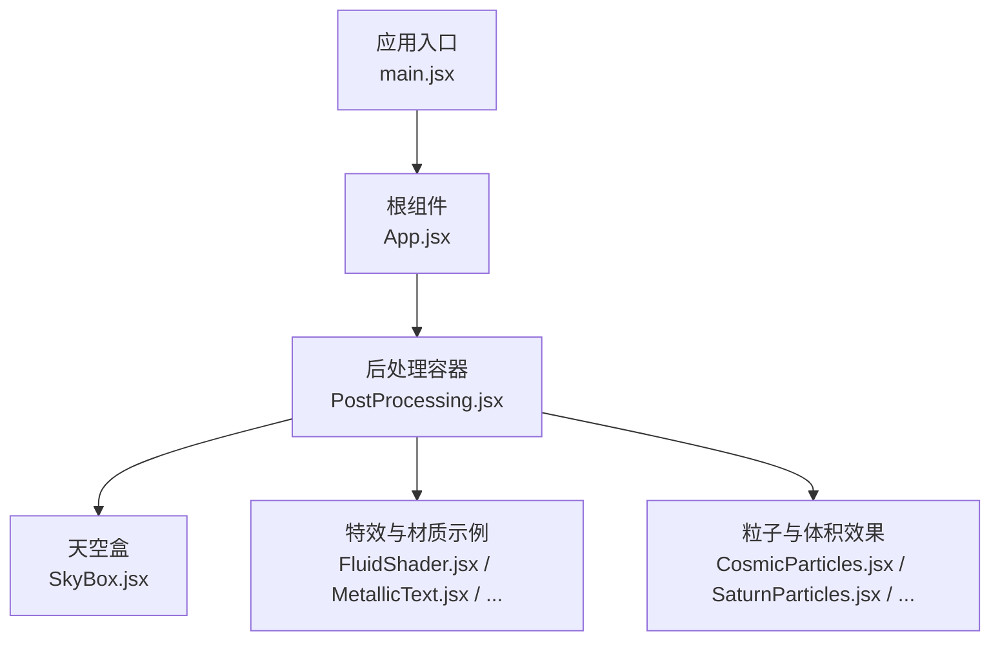
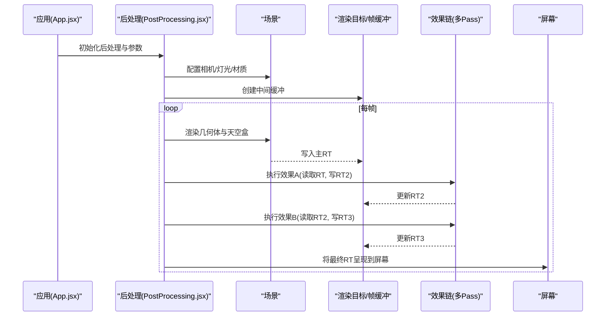
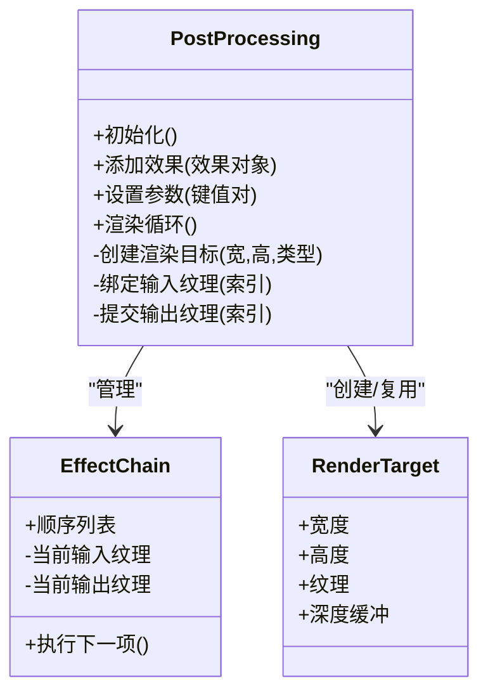
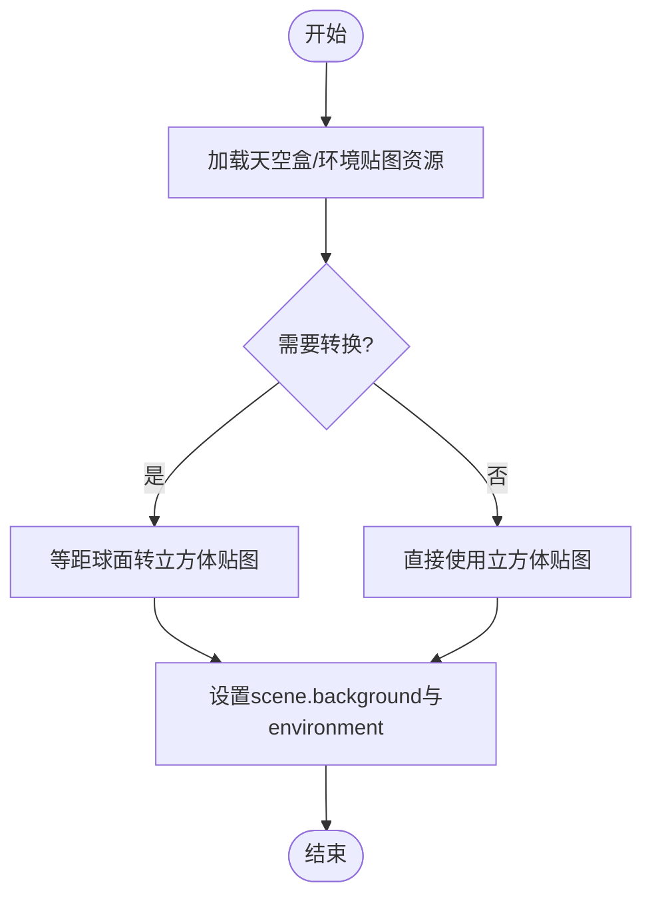
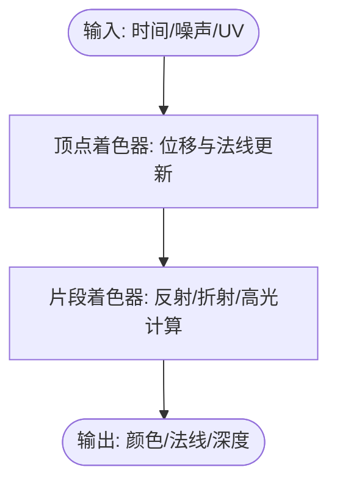
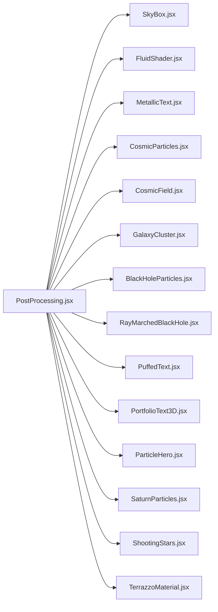

# 后处理效果

<cite>
**本文引用的文件**   
- [PostProcessing.jsx](file://src/components/three/PostProcessing.jsx)
- [SkyBox.jsx](file://src/components/three/SkyBox.jsx)
- [FluidShader.jsx](file://src/components/three/FluidShader.jsx)
- [BlackHoleParticles.jsx](file://src/components/three/BlackHoleParticles.jsx)
- [CosmicField.jsx](file://src/components/three/CosmicField.jsx)
- [CosmicParticles.jsx](file://src/components/three/CosmicParticles.jsx)
- [GalaxyCluster.jsx](file://src/components/three/GalaxyCluster.jsx)
- [MetallicText.jsx](file://src/components/three/MetallicText.jsx)
- [ParticleHero.jsx](file://src/components/three/ParticleHero.jsx)
- [PortfolioText3D.jsx](file://src/components/three/PortfolioText3D.jsx)
- [PuffedText.jsx](file://src/components/three/PuffedText.jsx)
- [RayMarchedBlackHole.jsx](file://src/components/three/RayMarchedBlackHole.jsx)
- [SaturnParticles.jsx](file://src/components/three/SaturnParticles.jsx)
- [ShootingStars.jsx](file://src/components/three/ShootingStars.jsx)
- [TerrazzoMaterial.jsx](file://src/components/three/TerrazzoMaterial.jsx)
- [App.jsx](file://src/App.jsx)
- [main.jsx](file://src/main.jsx)
</cite>

## 目录
1. [简介](#简介)
2. [项目结构](#项目结构)
3. [核心组件](#核心组件)
4. [架构总览](#架构总览)
5. [详细组件分析](#详细组件分析)
6. [依赖关系分析](#依赖关系分析)
7. [性能考量](#性能考量)
8. [故障排查指南](#故障排查指南)
9. [结论](#结论)
10. [附录](#附录)

## 简介
本技术文档围绕Three.js后处理管线，系统阐述渲染目标、帧缓冲、效果链等核心概念，并结合仓库中的实际实现，解析天空盒渲染、环境贴图与光影增强等视觉技术。文档同时覆盖后处理叠加顺序、性能影响与兼容性考虑，提供常用效果（泛光、景深、色调映射）的配置与使用建议，并给出自定义后处理效果的开发指南与优化策略，帮助读者构建电影级视觉效果。

## 项目结构
本项目采用React + Vite组织代码，Three.js相关能力集中在src/components/three目录下，其中：
- PostProcessing.jsx：封装后处理管线，管理渲染目标、帧缓冲与效果链。
- SkyBox.jsx：负责天空盒加载与场景背景设置。
- 其他组件：包含粒子、流体、金属材质、射线步进黑洞等示例，用于演示不同着色器与材质在后处理下的表现。

图表来源
- [main.jsx](file://src/main.jsx)
- [App.jsx](file://src/App.jsx)
- [PostProcessing.jsx](file://src/components/three/PostProcessing.jsx)
- [SkyBox.jsx](file://src/components/three/SkyBox.jsx)
- [FluidShader.jsx](file://src/components/three/FluidShader.jsx)
- [MetallicText.jsx](file://src/components/three/MetallicText.jsx)
- [CosmicParticles.jsx](file://src/components/three/CosmicParticles.jsx)
- [SaturnParticles.jsx](file://src/components/three/SaturnParticles.jsx)

章节来源
- [main.jsx](file://src/main.jsx)
- [App.jsx](file://src/App.jsx)
- [PostProcessing.jsx](file://src/components/three/PostProcessing.jsx)
- [SkyBox.jsx](file://src/components/three/SkyBox.jsx)

## 核心组件
本节聚焦后处理管线的关键实现点与数据流，结合仓库中的具体组件进行说明。

- 渲染目标与帧缓冲
  - 通过创建多个RenderTarget作为中间缓冲，将场景渲染到纹理上，再在后续阶段对纹理进行采样与计算，最终输出到屏幕。
  - 典型流程：场景渲染至RT1 → 效果A读取RT1写入RT2 → 效果B读取RT2写入RT3 → 合成输出到屏幕。
  - 注意分辨率、类型（如半精度/浮点）、深度/模板缓冲的取舍，以平衡画质与性能。

- 效果链与叠加顺序
  - 后处理效果按顺序串联，每个效果是一个Pass或Effect对象，负责从输入纹理采样并写回输出纹理。
  - 常见顺序：基础光照与阴影 → 色调映射 → 泛光（提取亮部、模糊、叠加）→ 景深（基于距离或亮度加权模糊）→ 色彩校正/胶片颗粒。
  - 顺序会影响最终观感与性能，需根据场景动态调整。

- 天空盒与环境贴图
  - 天空盒通常由六张立方体贴图组成，用于填充远处背景；环境贴图可用于反射/折射与IBL照明。
  - 在Three.js中可通过CubeTextureLoader或EquirectangularToCubeTexture转换等工具生成环境贴图，并设置scene.environment与scene.background。

- 光影与材质增强
  - 金属/粗糙度工作流材质配合环境贴图可产生真实反射。
  - 体积光、辉光、散射等效果可在后处理阶段通过亮度阈值与卷积核近似实现。

章节来源
- [PostProcessing.jsx](file://src/components/three/PostProcessing.jsx)
- [SkyBox.jsx](file://src/components/three/SkyBox.jsx)
- [FluidShader.jsx](file://src/components/three/FluidShader.jsx)
- [MetallicText.jsx](file://src/components/three/MetallicText.jsx)
- [CosmicParticles.jsx](file://src/components/three/CosmicParticles.jsx)
- [SaturnParticles.jsx](file://src/components/three/SaturnParticles.jsx)

## 架构总览
下图展示了从应用入口到后处理输出的整体调用关系与数据流向。

图表来源
- [App.jsx](file://src/App.jsx)
- [PostProcessing.jsx](file://src/components/three/PostProcessing.jsx)
- [SkyBox.jsx](file://src/components/three/SkyBox.jsx)

## 详细组件分析

### 后处理管线组件（PostProcessing.jsx）
该组件是后处理的核心，负责：
- 创建与管理多个渲染目标，控制分辨率与格式。
- 编排效果链，确保正确的读写顺序与纹理绑定。
- 暴露统一接口供上层组件配置参数（如强度、半径、阈值）。

图表来源
- [PostProcessing.jsx](file://src/components/three/PostProcessing.jsx)

章节来源
- [PostProcessing.jsx](file://src/components/three/PostProcessing.jsx)

### 天空盒与环境贴图（SkyBox.jsx）
职责包括：
- 加载立方体贴图或等距球面贴图，转换为适合环境的格式。
- 设置场景背景与全局环境贴图，为反射/折射与IBL提供数据源。
- 支持动态切换与LOD策略，降低带宽与显存占用。

图表来源
- [SkyBox.jsx](file://src/components/three/SkyBox.jsx)

章节来源
- [SkyBox.jsx](file://src/components/three/SkyBox.jsx)

### 流体着色器（FluidShader.jsx）
用于演示复杂表面流动与扰动效果，常与后处理叠加形成更丰富的视觉层次：
- 顶点着色器：基于时间或噪声扰动顶点位置，模拟流体波动。
- 片段着色器：采样法线/高度场，计算高光与菲涅尔反射，增强体积感。
- 与后处理联动：在泛光与色调映射下，流体的高频细节更易被强调。

图表来源
- [FluidShader.jsx](file://src/components/three/FluidShader.jsx)

章节来源
- [FluidShader.jsx](file://src/components/three/FluidShader.jsx)

### 金属文本（MetallicText.jsx）
展示金属/粗糙度材质与反射环境贴图的结合：
- 材质参数：金属度、粗糙度、环境强度，决定反射强度与锐利程度。
- 与后处理：在泛光与色调映射下，高光区域更突出，提升质感。

章节来源
- [MetallicText.jsx](file://src/components/three/MetallicText.jsx)

### 宇宙粒子与星云（CosmicParticles.jsx / CosmicField.jsx / GalaxyCluster.jsx）
- 粒子系统：通过BufferGeometry与自定义着色器实现大规模粒子渲染。
- 体积云/星云：利用噪声与密度函数模拟体积散射，配合后处理增强对比与色彩。
- 与后处理：景深与泛光可强化远近层次与发光细节。

章节来源
- [CosmicParticles.jsx](file://src/components/three/CosmicParticles.jsx)
- [CosmicField.jsx](file://src/components/three/CosmicField.jsx)
- [GalaxyCluster.jsx](file://src/components/three/GalaxyCluster.jsx)

### 黑洞与射线步进（BlackHoleParticles.jsx / RayMarchedBlackHole.jsx）
- 粒子环绕：模拟吸积盘与引力透镜效应。
- 射线步进：在片段着色器中进行体积积分，渲染强引力弯曲与热辐射。
- 与后处理：色调映射与泛光能显著提升黑洞边缘的光晕与对比。

章节来源
- [BlackHoleParticles.jsx](file://src/components/three/BlackHoleParticles.jsx)
- [RayMarchedBlackHole.jsx](file://src/components/three/RayMarchedBlackHole.jsx)

### 其他示例组件
- PuffedText.jsx：膨胀字体效果，适合标题展示。
- PortfolioText3D.jsx：三维文字排版与动画。
- ParticleHero.jsx：英雄区粒子动效。
- SaturnParticles.jsx：土星环粒子系统。
- ShootingStars.jsx：流星轨迹与尾迹。
- TerrazzoMaterial.jsx：水磨石材质，展示复杂纹理与微表面细节。

章节来源
- [PuffedText.jsx](file://src/components/three/PuffedText.jsx)
- [PortfolioText3D.jsx](file://src/components/three/PortfolioText3D.jsx)
- [ParticleHero.jsx](file://src/components/three/ParticleHero.jsx)
- [SaturnParticles.jsx](file://src/components/three/SaturnParticles.jsx)
- [ShootingStars.jsx](file://src/components/three/ShootingStars.jsx)
- [TerrazzoMaterial.jsx](file://src/components/three/TerrazzoMaterial.jsx)

## 依赖关系分析
后处理管线与各组件之间的依赖关系如下：

图表来源
- [PostProcessing.jsx](file://src/components/three/PostProcessing.jsx)
- [SkyBox.jsx](file://src/components/three/SkyBox.jsx)
- [FluidShader.jsx](file://src/components/three/FluidShader.jsx)
- [MetallicText.jsx](file://src/components/three/MetallicText.jsx)
- [CosmicParticles.jsx](file://src/components/three/CosmicParticles.jsx)
- [CosmicField.jsx](file://src/components/three/CosmicField.jsx)
- [GalaxyCluster.jsx](file://src/components/three/GalaxyCluster.jsx)
- [BlackHoleParticles.jsx](file://src/components/three/BlackHoleParticles.jsx)
- [RayMarchedBlackHole.jsx](file://src/components/three/RayMarchedBlackHole.jsx)
- [PuffedText.jsx](file://src/components/three/PuffedText.jsx)
- [PortfolioText3D.jsx](file://src/components/three/PortfolioText3D.jsx)
- [ParticleHero.jsx](file://src/components/three/ParticleHero.jsx)
- [SaturnParticles.jsx](file://src/components/three/SaturnParticles.jsx)
- [ShootingStars.jsx](file://src/components/three/ShootingStars.jsx)
- [TerrazzoMaterial.jsx](file://src/components/three/TerrazzoMaterial.jsx)

章节来源
- [PostProcessing.jsx](file://src/components/three/PostProcessing.jsx)

## 性能考量
- 渲染目标分辨率
  - 降低后处理阶段的分辨率可显著减少GPU负载，但会损失细节。建议根据设备能力动态调整。
- 纹理格式与精度
  - 使用半精度（Float16）或压缩格式可减少显存占用与带宽压力；高精度需求时使用Float32。
- Pass数量与复杂度
  - 每个额外Pass都会增加一次全屏采样与计算成本。优先合并相近效果的Pass。
- 天空盒与环境贴图
  - 选择合适尺寸与Mipmap层级，避免过大的贴图导致内存峰值。
- 材质与着色器
  - 复杂体积与射线步进效果代价较高，应限制采样次数与迭代步数。
- 自适应质量
  - 根据帧率或GPU利用率动态降级后处理强度与分辨率，保持流畅体验。

[本节为通用指导，不直接分析具体文件]

## 故障排查指南
- 画面全黑或无输出
  - 检查渲染目标是否成功创建且尺寸非零。
  - 确认效果链的输入/输出纹理绑定顺序正确。
- 闪烁或撕裂
  - 检查同步机制与双缓冲策略，确保每帧只读/写对应RT。
- 颜色异常或过曝
  - 调整色调映射参数与曝光值，避免超出显示范围。
- 性能骤降
  - 降低后处理分辨率或Pass数量，关闭不必要的体积/射线步进效果。
- 天空盒不显示
  - 验证贴图路径与格式，确保已正确设置scene.background与environment。

章节来源
- [PostProcessing.jsx](file://src/components/three/PostProcessing.jsx)
- [SkyBox.jsx](file://src/components/three/SkyBox.jsx)

## 结论
通过合理组织渲染目标与效果链，结合天空盒与环境贴图，可以在Three.js中构建高质量的视觉增强体系。后处理的叠加顺序与参数调优直接影响最终观感与性能。建议在开发过程中持续监控GPU指标，并根据目标平台进行自适应降级，以实现稳定且富有表现力的电影级效果。

[本节为总结性内容，不直接分析具体文件]

## 附录

### 常用后处理效果配置要点
- 泛光（Bloom）
  - 关键参数：阈值、强度、半径、模糊等级。
  - 建议：先做亮度提取，再进行多级模糊，最后叠加到原图。
- 景深（Depth of Field）
  - 关键参数：焦点距离、光圈大小、模糊半径。
  - 建议：结合深度缓冲或距离信息，对不同区域进行差异化模糊。
- 色调映射（Tone Mapping）
  - 关键参数：曝光、对比度、饱和度、曲线形状。
  - 建议：在后期阶段统一进行，避免多次重映射造成色偏。

[本节为通用指导，不直接分析具体文件]

### 自定义后处理效果开发指南
- 设计思路
  - 明确输入纹理与输出纹理，定义统一的接口（如setInputTexture、render）。
  - 将效果拆分为独立Pass，便于组合与调试。
- 实现步骤
  - 创建着色器程序（顶点+片段），在片段着色器中采样输入纹理并进行计算。
  - 在效果链中注册Pass，指定输入/输出RT索引。
  - 暴露参数接口，允许运行时调整。
- 调试技巧
  - 可视化中间结果（如仅输出亮度或法线），定位问题。
  - 逐步启用效果，观察性能变化与画面差异。

[本节为通用指导，不直接分析具体文件]

### 电影级视觉效果实现清单
- 基础层
  - 高质量材质与光照模型（PBR）。
  - 合理的天空盒与环境贴图。
- 增强层
  - 泛光与辉光，强调高光与发光体。
  - 色调映射与色彩分级，塑造风格化影调。
  - 景深与运动模糊，引导视觉焦点。
- 细节层
  - 体积光与雾效，增强空间感。
  - 胶片颗粒与镜头畸变，提升真实感。

[本节为通用指导，不直接分析具体文件]