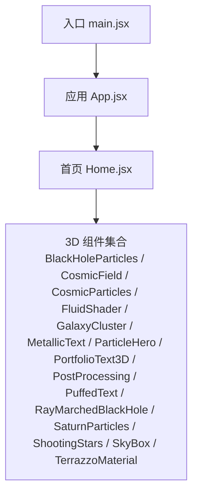
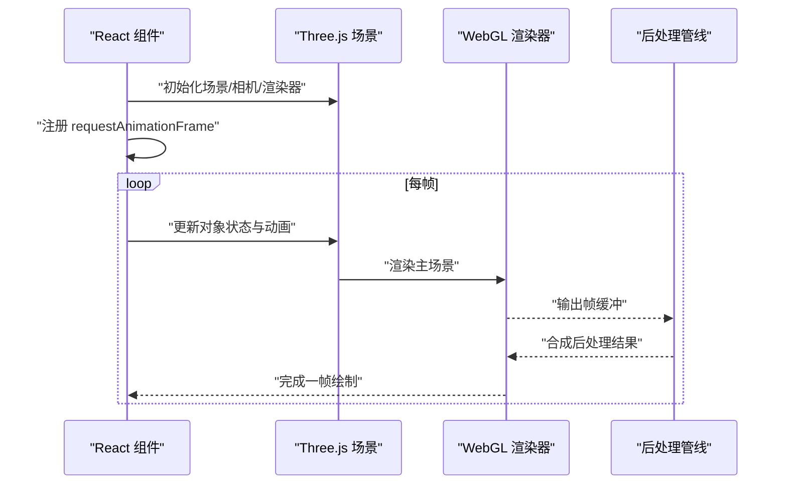
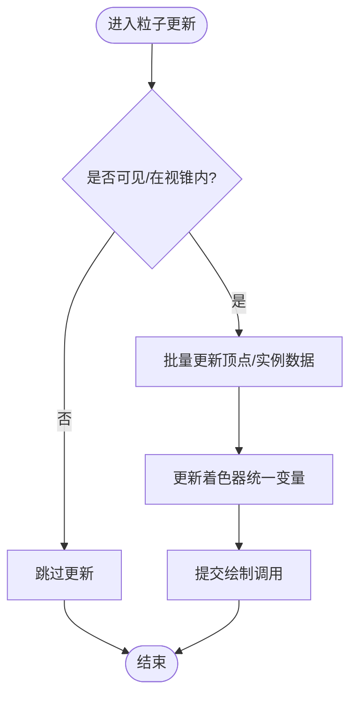
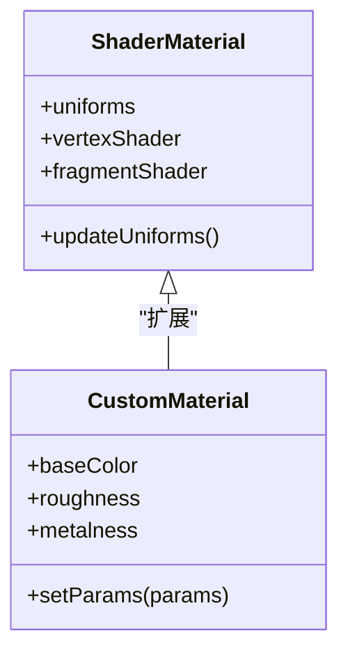
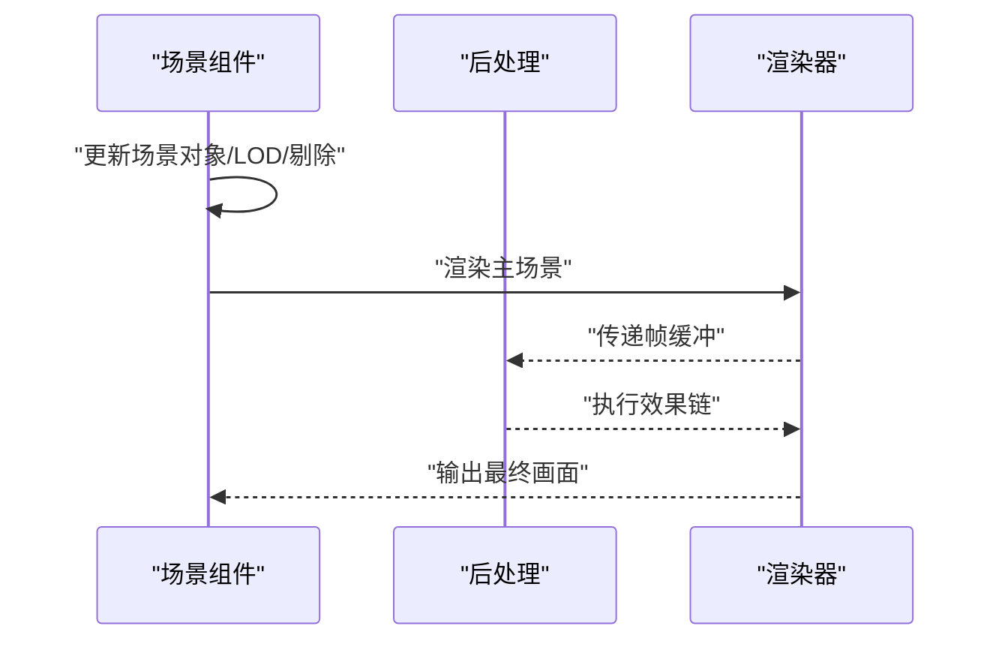
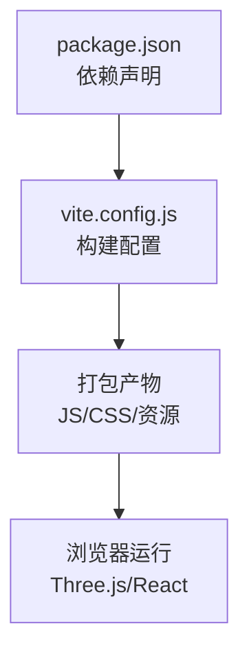

# 性能优化策略

<cite>
**本文引用的文件**   
- [package.json](file://package.json)
- [vite.config.js](file://vite.config.js)
- [src/main.jsx](file://src/main.jsx)
- [src/App.jsx](file://src/App.jsx)
- [src/Home.jsx](file://src/Home.jsx)
- [src/components/three/BlackHoleParticles.jsx](file://src/components/three/BlackHoleParticles.jsx)
- [src/components/three/CosmicField.jsx](file://src/components/three/CosmicField.jsx)
- [src/components/three/CosmicParticles.jsx](file://src/components/three/CosmicParticles.jsx)
- [src/components/three/FluidShader.jsx](file://src/components/three/FluidShader.jsx)
- [src/components/three/GalaxyCluster.jsx](file://src/components/three/GalaxyCluster.jsx)
- [src/components/three/MetallicText.jsx](file://src/components/three/MetallicText.jsx)
- [src/components/three/ParticleHero.jsx](file://src/components/three/ParticleHero.jsx)
- [src/components/three/PortfolioText3D.jsx](file://src/components/three/PortfolioText3D.jsx)
- [src/components/three/PostProcessing.jsx](file://src/components/three/PostProcessing.jsx)
- [src/components/three/PuffedText.jsx](file://src/components/three/PuffedText.jsx)
- [src/components/three/RayMarchedBlackHole.jsx](file://src/components/three/RayMarchedBlackHole.jsx)
- [src/components/three/SaturnParticles.jsx](file://src/components/three/SaturnParticles.jsx)
- [src/components/three/ShootingStars.jsx](file://src/components/three/ShootingStars.jsx)
- [src/components/three/SkyBox.jsx](file://src/components/three/SkyBox.jsx)
- [src/components/three/TerrazzoMaterial.jsx](file://src/components/three/TerrazzoMaterial.jsx)
</cite>

## 目录
1. [简介](#简介)
2. [项目结构](#项目结构)
3. [核心组件](#核心组件)
4. [架构总览](#架构总览)
5. [详细组件分析](#详细组件分析)
6. [依赖分析](#依赖分析)
7. [性能考量](#性能考量)
8. [故障排查指南](#故障排查指南)
9. [结论](#结论)
10. [附录](#附录)

## 简介
本指南面向使用 Three.js 与 React 构建的 Web 3D 应用，聚焦 WebGL 渲染性能瓶颈定位、内存管理、绘制调用优化、几何体合并、纹理压缩、LOD、视锥剔除、粒子系统优化、着色器调优、后处理优化、FPS 提升与移动端适配等主题。文档结合仓库中的 Three.js 组件实现，提供可落地的优化策略与实战建议，并给出性能监控工具使用方法与基准测试思路，帮助开发者打造流畅的 3D 用户体验。

## 项目结构
本项目采用 Vite + React 工程化方案，Three.js 相关 3D 场景与特效以独立组件形式组织在 src/components/three 下，便于按需加载与复用。入口文件负责初始化应用与挂载根节点，页面级组件（如 Home）组合多个 3D 子组件形成完整场景。

图表来源
- [src/main.jsx:1-50](file://src/main.jsx#L1-L50)
- [src/App.jsx:1-50](file://src/App.jsx#L1-L50)
- [src/Home.jsx:1-50](file://src/Home.jsx#L1-L50)

章节来源
- [src/main.jsx:1-50](file://src/main.jsx#L1-L50)
- [src/App.jsx:1-50](file://src/App.jsx#L1-L50)
- [src/Home.jsx:1-50](file://src/Home.jsx#L1-L50)

## 核心组件
以下组件是 3D 渲染的核心单元，涉及粒子系统、材质、后处理与特殊效果：
- 粒子与场：BlackHoleParticles、CosmicField、CosmicParticles、SaturnParticles、ShootingStars、ParticleHero
- 材质与着色器：FluidShader、TerrazzoMaterial、MetallicText、PuffedText
- 场景与后处理：SkyBox、GalaxyCluster、PortfolioText3D、PostProcessing、RayMarchedBlackHole

这些组件通常包含：
- 场景图构建（Scene/Group）
- 几何体与材质创建（Geometry/Material）
- 动画循环（requestAnimationFrame）
- 事件与交互（PointerEvents/OrbitControls）
- 资源加载（TextureLoader/GLTFLoader）
- 渲染管线控制（Renderer/Fog/PostProcessing）

章节来源
- [src/components/three/BlackHoleParticles.jsx:1-200](file://src/components/three/BlackHoleParticles.jsx#L1-L200)
- [src/components/three/CosmicField.jsx:1-200](file://src/components/three/CosmicField.jsx#L1-L200)
- [src/components/three/CosmicParticles.jsx:1-200](file://src/components/three/CosmicParticles.jsx#L1-L200)
- [src/components/three/FluidShader.jsx:1-200](file://src/components/three/FluidShader.jsx#L1-L200)
- [src/components/three/GalaxyCluster.jsx:1-200](file://src/components/three/GalaxyCluster.jsx#L1-L200)
- [src/components/three/MetallicText.jsx:1-200](file://src/components/three/MetallicText.jsx#L1-L200)
- [src/components/three/ParticleHero.jsx:1-200](file://src/components/three/ParticleHero.jsx#L1-L200)
- [src/components/three/PortfolioText3D.jsx:1-200](file://src/components/three/PortfolioText3D.jsx#L1-L200)
- [src/components/three/PostProcessing.jsx:1-200](file://src/components/three/PostProcessing.jsx#L1-L200)
- [src/components/three/PuffedText.jsx:1-200](file://src/components/three/PuffedText.jsx#L1-L200)
- [src/components/three/RayMarchedBlackHole.jsx:1-200](file://src/components/three/RayMarchedBlackHole.jsx#L1-L200)
- [src/components/three/SaturnParticles.jsx:1-200](file://src/components/three/SaturnParticles.jsx#L1-L200)
- [src/components/three/ShootingStars.jsx:1-200](file://src/components/three/ShootingStars.jsx#L1-L200)
- [src/components/three/SkyBox.jsx:1-200](file://src/components/three/SkyBox.jsx#L1-L200)
- [src/components/three/TerrazzoMaterial.jsx:1-200](file://src/components/three/TerrazzoMaterial.jsx#L1-L200)

## 架构总览
整体渲染流程遵循“React 组件生命周期 → Three.js 场景更新 → WebGL 渲染”的模式。关键路径包括：
- 组件挂载时创建场景、相机、渲染器与控制器
- 在动画帧中更新对象状态（位置、旋转、材质参数）
- 执行渲染输出到画布
- 后处理阶段对帧缓冲进行二次合成

图表来源
- [src/components/three/PostProcessing.jsx:1-200](file://src/components/three/PostProcessing.jsx#L1-L200)
- [src/components/three/ParticleHero.jsx:1-200](file://src/components/three/ParticleHero.jsx#L1-L200)

## 详细组件分析

### 粒子系统优化（以 BlackHoleParticles、CosmicParticles、SaturnParticles、ShootingStars、ParticleHero 为例）
- 批量绘制与实例化
  - 使用 InstancedMesh 或 BufferGeometry 的顶点属性批量更新，减少 draw call 数量
  - 将静态几何体合并为单一 BufferGeometry，降低 GPU 切换成本
- 顶点与片元着色器优化
  - 避免在片元着色器中进行昂贵分支与重复计算
  - 使用预计算表（查找表）替代复杂函数
- 生命周期与可见性
  - 根据距离与视锥剔除动态启用/禁用粒子更新
  - 对不可见粒子暂停动画，释放 CPU 开销
- 纹理与材质
  - 使用点精灵贴图（Sprite Texture），避免过多材质实例
  - 纹理尺寸与格式选择合适分辨率，必要时使用压缩纹理（如 KTX2/Basis）

图表来源
- [src/components/three/BlackHoleParticles.jsx:1-200](file://src/components/three/BlackHoleParticles.jsx#L1-L200)
- [src/components/three/CosmicParticles.jsx:1-200](file://src/components/three/CosmicParticles.jsx#L1-L200)
- [src/components/three/SaturnParticles.jsx:1-200](file://src/components/three/SaturnParticles.jsx#L1-L200)
- [src/components/three/ShootingStars.jsx:1-200](file://src/components/three/ShootingStars.jsx#L1-L200)
- [src/components/three/ParticleHero.jsx:1-200](file://src/components/three/ParticleHero.jsx#L1-L200)

章节来源
- [src/components/three/BlackHoleParticles.jsx:1-200](file://src/components/three/BlackHoleParticles.jsx#L1-L200)
- [src/components/three/CosmicParticles.jsx:1-200](file://src/components/three/CosmicParticles.jsx#L1-L200)
- [src/components/three/SaturnParticles.jsx:1-200](file://src/components/three/SaturnParticles.jsx#L1-L200)
- [src/components/three/ShootingStars.jsx:1-200](file://src/components/three/ShootingStars.jsx#L1-L200)
- [src/components/three/ParticleHero.jsx:1-200](file://src/components/three/ParticleHero.jsx#L1-L200)

### 材质与着色器优化（以 FluidShader、TerrazzoMaterial、MetallicText、PuffedText 为例）
- 着色器复杂度控制
  - 减少高精度数学函数与条件分支；使用近似函数或查表
  - 将逐像素计算尽量移至顶点阶段或使用预烘焙贴图
- 材质复用与共享
  - 相同材质参数尽量复用同一 Material 实例，避免重复创建
  - 通过 Uniform 动态变化外观，而非频繁替换材质
- 光照与阴影
  - 关闭不必要的阴影投射/接收；使用简单光源模型
  - 对静态物体使用环境光或预计算光照贴图

图表来源
- [src/components/three/FluidShader.jsx:1-200](file://src/components/three/FluidShader.jsx#L1-L200)
- [src/components/three/TerrazzoMaterial.jsx:1-200](file://src/components/three/TerrazzoMaterial.jsx#L1-L200)
- [src/components/three/MetallicText.jsx:1-200](file://src/components/three/MetallicText.jsx#L1-L200)
- [src/components/three/PuffedText.jsx:1-200](file://src/components/three/PuffedText.jsx#L1-L200)

章节来源
- [src/components/three/FluidShader.jsx:1-200](file://src/components/three/FluidShader.jsx#L1-L200)
- [src/components/three/TerrazzoMaterial.jsx:1-200](file://src/components/three/TerrazzoMaterial.jsx#L1-L200)
- [src/components/three/MetallicText.jsx:1-200](file://src/components/three/MetallicText.jsx#L1-L200)
- [src/components/three/PuffedText.jsx:1-200](file://src/components/three/PuffedText.jsx#L1-L200)

### 场景与后处理优化（以 SkyBox、GalaxyCluster、PortfolioText3D、PostProcessing、RayMarchedBlackHole 为例）
- 场景层次与剔除
  - 合理组织 Scene Graph，利用 frustum culling 与 occlusion culling
  - 对远距离物体使用 LOD 或多细节层级
- 后处理管线
  - 控制后处理通道数量与分辨率；仅在需要时启用
  - 使用轻量级效果（如 Bloom、SSAO）并调整强度与采样数
- 射线步进（Ray Marching）
  - 限制最大步数与精度；使用分层步进或自适应步长
  - 将复杂体积渲染降级为近似效果

图表来源
- [src/components/three/SkyBox.jsx:1-200](file://src/components/three/SkyBox.jsx#L1-L200)
- [src/components/three/GalaxyCluster.jsx:1-200](file://src/components/three/GalaxyCluster.jsx#L1-L200)
- [src/components/three/PortfolioText3D.jsx:1-200](file://src/components/three/PortfolioText3D.jsx#L1-L200)
- [src/components/three/PostProcessing.jsx:1-200](file://src/components/three/PostProcessing.jsx#L1-L200)
- [src/components/three/RayMarchedBlackHole.jsx:1-200](file://src/components/three/RayMarchedBlackHole.jsx#L1-L200)

章节来源
- [src/components/three/SkyBox.jsx:1-200](file://src/components/three/SkyBox.jsx#L1-L200)
- [src/components/three/GalaxyCluster.jsx:1-200](file://src/components/three/GalaxyCluster.jsx#L1-L200)
- [src/components/three/PortfolioText3D.jsx:1-200](file://src/components/three/PortfolioText3D.jsx#L1-L200)
- [src/components/three/PostProcessing.jsx:1-200](file://src/components/three/PostProcessing.jsx#L1-L200)
- [src/components/three/RayMarchedBlackHole.jsx:1-200](file://src/components/three/RayMarchedBlackHole.jsx#L1-L200)

## 依赖分析
项目依赖与构建配置直接影响运行时性能与资源体积。重点关注：
- Three.js 版本与插件生态（后处理、加载器）
- Vite 构建优化（代码分割、资源压缩、缓存策略）
- 第三方库引入范围与按需加载

图表来源
- [package.json:1-200](file://package.json#L1-L200)
- [vite.config.js:1-200](file://vite.config.js#L1-L200)

章节来源
- [package.json:1-200](file://package.json#L1-L200)
- [vite.config.js:1-200](file://vite.config.js#L1-L200)

## 性能考量
- WebGL 渲染瓶颈定位
  - 使用浏览器开发者工具的 Performance 面板记录帧时间，识别 CPU 与 GPU 热点
  - 关注 Draw Calls、Overdraw、纹理带宽、着色器复杂度
- 内存管理
  - 及时释放不再使用的 Geometry、Texture、Material 与 Buffer
  - 避免在动画循环中分配新对象，使用对象池与复用
- 绘制调用优化
  - 合并几何体与材质，减少状态切换
  - 使用 InstancedMesh 批量绘制相似对象
- 纹理与资源
  - 使用合适的纹理尺寸与格式（如 KTX2/Basis），开启纹理压缩
  - 对远景使用低分辨率纹理或程序化生成
- LOD 与视锥剔除
  - 基于距离与重要性切换不同细节级别
  - 确保 Three.js 的 FrustumCulling 启用，并对复杂子树进行分组
- 粒子系统与着色器
  - 将计算从片元移至顶点或预计算；减少分支与高精度函数
  - 使用点精灵与纹理图集减少材质数量
- 后处理效果
  - 控制通道数量与分辨率；仅在必要区域启用
  - 调整采样次数与强度，平衡质量与性能
- FPS 优化与移动端适配
  - 目标稳定 60fps，低端设备降至 30fps 并降低画质
  - 针对移动端关闭不必要特性（如阴影、反射），降低像素密度
- 性能监控与基准测试
  - 使用 Performance API 与自定义计数器统计帧率与耗时
  - 在不同设备平台（桌面/平板/手机）建立基准对比，记录优化前后指标

[本节为通用指导，不直接分析具体文件]

## 故障排查指南
- 常见症状与定位
  - 卡顿与掉帧：检查动画循环中的重分配与同步阻塞操作
  - 内存泄漏：追踪未释放的纹理与几何体，确认卸载逻辑
  - 高 Draw Calls：合并几何体与材质，启用实例化
  - 着色器过慢：简化片段着色器，减少分支与高精度运算
- 调试工具
  - 浏览器 Performance 面板：记录帧时间与火焰图
  - GPU 性能分析：使用 Chrome DevTools 的 Rendering 与 GPU 信息
  - 自定义日志：在关键路径打印耗时与计数，辅助定位热点
- 回退策略
  - 动态降级：检测性能阈值自动降低画质与特效
  - 分阶段加载：首屏仅加载必要资源，其余按需异步加载

章节来源
- [src/components/three/PostProcessing.jsx:1-200](file://src/components/three/PostProcessing.jsx#L1-L200)
- [src/components/three/ParticleHero.jsx:1-200](file://src/components/three/ParticleHero.jsx#L1-L200)

## 结论
通过对粒子系统、材质与着色器、场景与后处理的系统性优化，结合严格的内存管理与绘制调用控制，可以在多平台上显著提升 3D 渲染性能。建议在开发过程中持续进行性能监控与基准测试，针对不同设备制定差异化策略，确保用户获得流畅稳定的体验。

[本节为总结性内容，不直接分析具体文件]

## 附录
- 性能监控清单
  - 帧率与帧时间分布
  - Draw Calls 与 Overdraw
  - 纹理带宽与显存占用
  - 着色器复杂度与采样次数
- 优化优先级建议
  - 先降 Draw Calls 与合并几何体
  - 再优化着色器与纹理
  - 最后精细调节后处理与特效

[本节为补充信息，不直接分析具体文件]