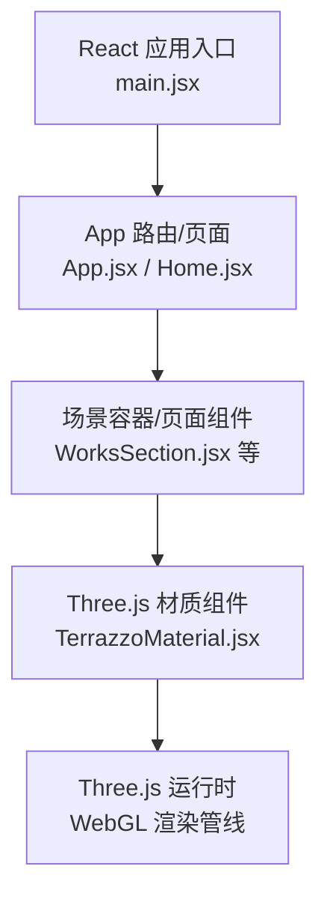
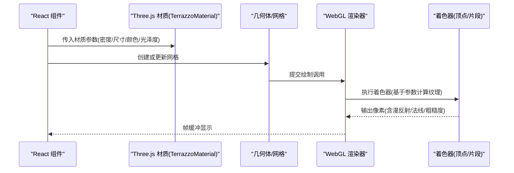
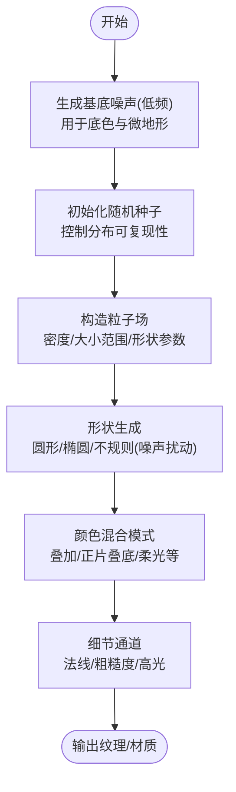
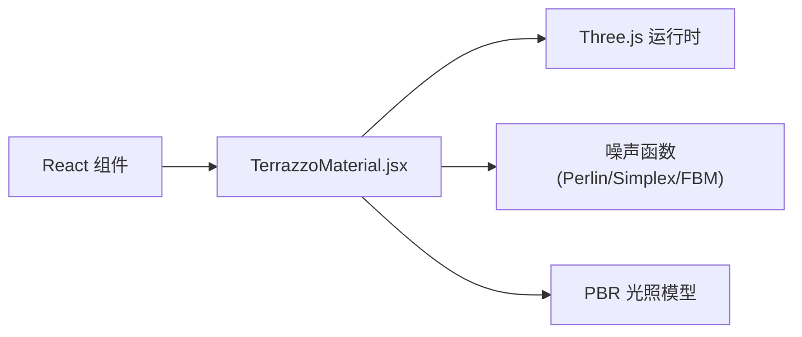

# 水磨石材质

<cite>
**本文引用的文件**   
- [TerrazzoMaterial.jsx](file://src/components/three/TerrazzoMaterial.jsx)
- [package.json](file://package.json)
- [README.md](file://README.md)
</cite>

## 目录
1. [简介](#简介)
2. [项目结构](#项目结构)
3. [核心组件](#核心组件)
4. [架构总览](#架构总览)
5. [详细组件分析](#详细组件分析)
6. [依赖关系分析](#依赖关系分析)
7. [性能考虑](#性能考虑)
8. [故障排查指南](#故障排查指南)
9. [结论](#结论)
10. [附录](#附录)

## 简介
本技术文档围绕“水磨石材质”的程序化纹理生成与渲染实现，系统性解析以下主题：
- 程序化纹理生成：随机粒子分布算法、颜色混合模式、表面粗糙度模拟
- 噪声函数与自然图案：石子形状生成、边界处理、光照响应
- 材质属性配置：石子密度、大小范围、颜色调色板、光泽度等
- 自定义变体：不同风格的水磨石效果实现路径
- 渲染优化与内存管理：GPU/CPU协同、批处理、纹理复用、LOD策略

该文档旨在帮助开发者快速理解并扩展水磨石材质的能力，同时提供可操作的优化建议与排障方法。

## 项目结构
本项目为基于 React + Vite 的前端工程，Three.js 相关组件位于 src/components/three 目录下。水磨石材质由一个独立的 Three.js 材质组件实现，并通过 React 组件进行参数化暴露与集成。

图表来源
- [TerrazzoMaterial.jsx](file://src/components/three/TerrazzoMaterial.jsx)
- [package.json](file://package.json)

章节来源
- [package.json](file://package.json)
- [README.md](file://README.md)

## 核心组件
- 水磨石材质组件（TerrazzoMaterial）
  - 职责：封装程序化水磨石纹理的着色器逻辑与材质参数，向 React 层暴露可调属性（如石子密度、尺寸范围、颜色调色板、光泽度等）。
  - 关键特性：
    - 使用噪声函数生成自然分布与形状
    - 支持多种颜色混合模式以模拟真实石材颗粒
    - 通过法线/粗糙度通道增强表面细节与光照响应
    - 提供参数化接口便于实时调节与多风格切换

章节来源
- [TerrazzoMaterial.jsx](file://src/components/three/TerrazzoMaterial.jsx)

## 架构总览
下图展示了从 React 到 WebGL 的渲染链路，以及水磨石材质在其中的角色。

图表来源
- [TerrazzoMaterial.jsx](file://src/components/three/TerrazzoMaterial.jsx)

## 详细组件分析

### 程序化纹理生成流程
水磨石的视觉特征来源于“基底+嵌入颗粒”的组合。其生成流程通常包括：
- 基底纹理：使用低频噪声构建基础色与微起伏
- 颗粒生成：基于随机种子与噪声场确定位置、半径、形状
- 颜色混合：将颗粒颜色与基底按权重融合，形成层次
- 表面细节：通过法线与粗糙度通道增强光照响应

图表来源
- [TerrazzoMaterial.jsx](file://src/components/three/TerrazzoMaterial.jsx)

章节来源
- [TerrazzoMaterial.jsx](file://src/components/three/TerrazzoMaterial.jsx)

### 随机粒子分布算法
- 目标：在给定区域内均匀且自然地散布石子，避免聚集与空洞
- 常用策略：
  - 泊松圆盘采样：保证最小间距，提升自然感
  - 噪声引导分布：结合 Perlin/Simplex 噪声场调整密度
  - 分层抽样：按区域划分，分别采样后合并
- 复杂度与权衡：
  - 时间复杂度随粒子数近似 O(n log n) 或 O(n)（取决于数据结构）
  - 空间复杂度与粒子数量线性相关
- 优化要点：
  - 预计算与缓存：对静态场景缓存粒子布局
  - 分块/视锥剔除：仅对可见区域生成或更新
  - GPU 并行：在着色器中批量计算位置与形状

章节来源
- [TerrazzoMaterial.jsx](file://src/components/three/TerrazzoMaterial.jsx)

### 颜色混合模式与调色板
- 混合模式：
  - 叠加类：增强对比与层次
  - 正片叠底：加深阴影与暗部
  - 柔光/硬光：控制高光强度与过渡
- 调色板设计：
  - 主色调：决定整体风格（暖灰、冷灰、米白等）
  - 点缀色：小面积高饱和颗粒增加活力
  - 明度/饱和度约束：保持整体协调
- 实现建议：
  - 使用分段线性插值或查找表加速
  - 根据光照条件动态调整混合权重

章节来源
- [TerrazzoMaterial.jsx](file://src/components/three/TerrazzoMaterial.jsx)

### 表面粗糙度与光照响应
- 粗糙度通道：
  - 控制高光扩散范围，影响“磨砂/抛光”观感
  - 与法线贴图配合，增强微观凹凸
- 法线通道：
  - 模拟颗粒边缘与基底的微小落差
  - 可通过高度图转法线或直接程序化生成
- 高光模型：
  - 推荐使用物理基础渲染(PBR)模型（如 GGX）
  - 合理设置金属度与粗糙度映射，确保在不同光源下表现稳定

章节来源
- [TerrazzoMaterial.jsx](file://src/components/three/TerrazzoMaterial.jsx)

### 噪声函数与自然图案
- 噪声类型：
  - Perlin/Simplex：平滑连续，适合基底与地形
  - Value/FBM：多层叠加产生更丰富的细节
- 石子形状生成：
  - 基础形状：圆/椭圆
  - 扰动：用噪声场对半径与轮廓进行扰动，形成不规则
- 边界处理：
  - 裁剪：在屏幕/UV边界处做平滑过渡
  - 无缝拼接：采用周期性噪声或镜像对称
- 光照响应：
  - 利用法线/粗糙度通道参与 PBR 计算
  - 根据视角与入射角调整高光强度

章节来源
- [TerrazzoMaterial.jsx](file://src/components/three/TerrazzoMaterial.jsx)

### 材质属性配置选项
以下为常见可调参数及其作用说明（具体字段名以实际实现为准）：
- 石子密度：控制单位面积内颗粒数量，影响视觉密集程度
- 大小范围：最小/最大半径，决定颗粒尺度变化
- 形状参数：椭圆率、噪声扰动强度，塑造不规则感
- 颜色调色板：主色/点缀色列表及权重，控制色彩分布
- 混合模式：选择叠加/正片叠底/柔光等
- 光泽度/粗糙度：控制高光与漫反射比例
- 法线强度：放大或减弱微观凹凸
- 光照模型：PBR 开关、金属度映射
- 分辨率/缩放：纹理分辨率与 UV 缩放，影响细节与性能

章节来源
- [TerrazzoMaterial.jsx](file://src/components/three/TerrazzoMaterial.jsx)

### 自定义水磨石效果的完整示例
- 现代极简风格：
  - 低密度、小尺寸颗粒、中性灰主色、低光泽度
  - 强调大面积留白与细腻质感
- 复古暖调风格：
  - 中高密度、较大颗粒、暖色系为主、中等光泽度
  - 加入少量深色点缀提升层次
- 工业粗犷风格：
  - 高密度、大尺寸、不规则形状、较高粗糙度
  - 强法线强度突出颗粒边缘
- 海洋清新风格：
  - 中低密度、中小颗粒、蓝绿主色、柔和光泽度
  - 使用柔光混合营造通透感

实现步骤概览：
- 设定密度与大小范围
- 选择调色板与混合模式
- 调整粗糙度与法线强度
- 预览并微调至目标风格

章节来源
- [TerrazzoMaterial.jsx](file://src/components/three/TerrazzoMaterial.jsx)

## 依赖关系分析
- 运行时依赖：
  - Three.js：提供 WebGL 渲染、材质与着色器框架
  - React：组件化封装与参数传递
- 内部依赖：
  - TerrazzoMaterial 作为独立模块被页面组件引用
  - 可能依赖通用工具（如数学库、噪声实现）

图表来源
- [TerrazzoMaterial.jsx](file://src/components/three/TerrazzoMaterial.jsx)
- [package.json](file://package.json)

章节来源
- [package.json](file://package.json)
- [TerrazzoMaterial.jsx](file://src/components/three/TerrazzoMaterial.jsx)

## 性能考虑
- 纹理生成与缓存
  - 静态场景：预生成纹理并缓存，避免每帧重算
  - 动态场景：增量更新局部区域，减少全量重建
- 着色器优化
  - 减少分支与循环，使用查表与近似函数
  - 合并多次噪声采样，降低采样次数
- 资源管理
  - 复用纹理与材质实例，避免重复分配
  - 按需加载高分辨率纹理，移动端使用较低分辨率
- 渲染管线
  - 合理使用 LOD，远距离降低细节
  - 视锥剔除与批处理，减少 Draw Call
- 内存管理
  - 及时释放不再使用的纹理与缓冲区
  - 监控 GPU 内存占用，避免峰值溢出

[本节为通用指导，不直接分析具体文件]

## 故障排查指南
- 常见问题
  - 纹理出现接缝：检查 UV 缩放与噪声周期设置
  - 颗粒过于密集导致卡顿：降低密度或启用视锥剔除
  - 光泽度过高失真：调整粗糙度与高光模型参数
  - 颜色异常：核对调色板权重与混合模式
- 调试手段
  - 可视化中间结果：单独输出噪声场、粒子场、法线/粗糙度通道
  - 逐步关闭特效：定位问题来源（噪声/混合/光照）
  - 日志与断点：记录关键参数与运行状态

章节来源
- [TerrazzoMaterial.jsx](file://src/components/three/TerrazzoMaterial.jsx)

## 结论
水磨石材质的关键在于“自然分布+精细细节+合理光照”。通过噪声函数与随机粒子算法，可以高效生成具有丰富层次的纹理；借助 PBR 与法线/粗糙度通道，能够显著提升真实感。在实际工程中，应重视性能优化与内存管理，确保在不同设备与场景下稳定运行。

[本节为总结性内容，不直接分析具体文件]

## 附录
- 术语解释
  - PBR：基于物理的渲染，提供更一致的光照与材质表现
  - FBM：分形布朗运动，用于生成多层噪声细节
  - 视锥剔除：仅渲染相机视野内的对象，提升性能
- 参考实现路径
  - 噪声函数：Perlin/Simplex/FBM
  - 混合模式：叠加/正片叠底/柔光
  - 光照模型：GGX 高光、PBR 工作流

[本节为概念性内容，不直接分析具体文件]