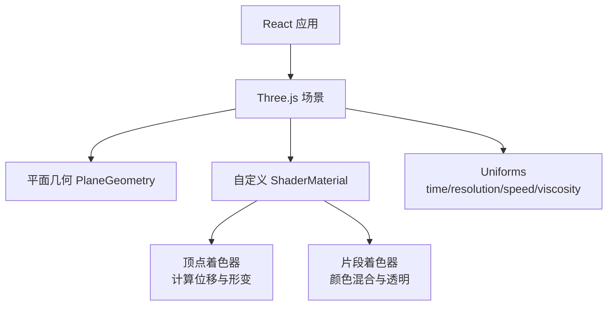
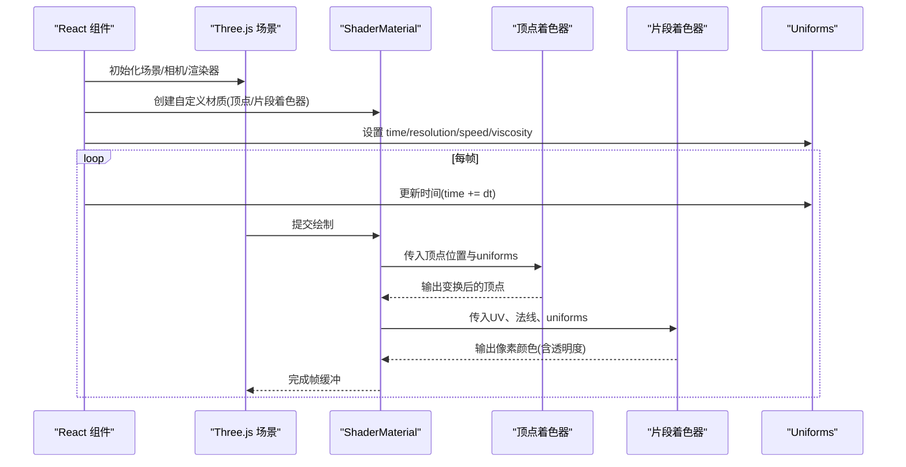
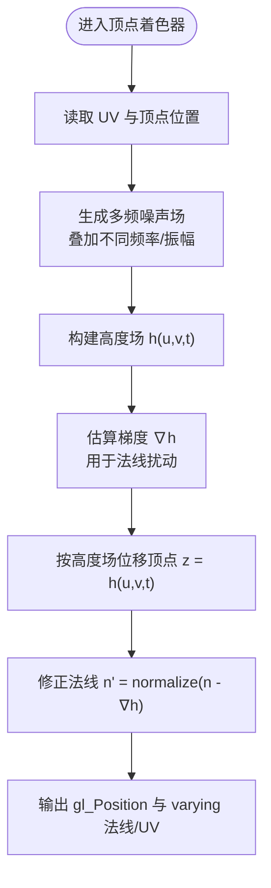
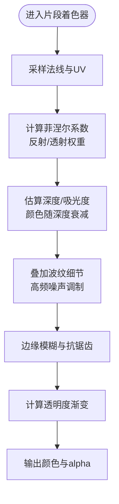
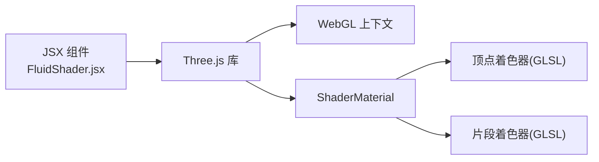

# 流体着色器

<cite>
**本文引用的文件**   
- [FluidShader.jsx](file://src/components/three/FluidShader.jsx)
</cite>

## 目录
1. [简介](#简介)
2. [项目结构](#项目结构)
3. [核心组件](#核心组件)
4. [架构总览](#架构总览)
5. [详细组件分析](#详细组件分析)
6. [依赖分析](#依赖分析)
7. [性能考虑](#性能考虑)
8. [故障排查指南](#故障排查指南)
9. [结论](#结论)
10. [附录](#附录)

## 简介
本技术文档围绕“流体着色器”的实现与优化展开，聚焦于在 WebGL/Three.js 环境下通过自定义着色器实现逼真的流体动画。内容涵盖：
- 数学原理：噪声函数、波纹叠加、时间变量控制
- 顶点着色器：基于噪声的位移计算与动态变形
- 片段着色器：颜色混合、透明度渐变、边缘模糊
- 参数化控制：流速、粘度等物理感观参数的映射
- 性能优化与浏览器兼容性建议

## 项目结构
本项目为 React + Vite 的前端工程，流体着色器以 Three.js 组件形式集成在 src/components/three 中。关键入口为 FluidShader.jsx，负责创建几何体、材质与渲染循环，并通过 uniform 向 GLSL 传递时间、分辨率、流速、粘度等参数。

图表来源
- [FluidShader.jsx](file://src/components/three/FluidShader.jsx)

章节来源
- [FluidShader.jsx](file://src/components/three/FluidShader.jsx)

## 核心组件
- 组件职责
  - 初始化 Three.js 场景、相机、渲染器
  - 创建平面几何作为流体表面载体
  - 使用自定义 ShaderMaterial 绑定顶点与片段着色器
  - 每帧更新 uniforms（时间、分辨率、流速、粘度）
  - 处理窗口尺寸变化与资源清理

- 关键 Uniforms 与属性
  - time：驱动动画的时间变量
  - resolution：屏幕或画布分辨率，用于归一化坐标
  - speed：流速参数，影响波纹传播速度
  - viscosity：粘度参数，影响波纹衰减与平滑度
  - 其他可选：振幅、频率、色彩调色板等

- 数据流与控制流
  - React 生命周期管理 Three.js 实例
  - requestAnimationFrame 驱动时间步进
  - uniforms 更新后触发 GPU 重绘

章节来源
- [FluidShader.jsx](file://src/components/three/FluidShader.jsx)

## 架构总览
下图展示从 React 到 GPU 的完整调用链与数据流向，包括 uniforms 的传递与着色器的执行阶段。

图表来源
- [FluidShader.jsx](file://src/components/three/FluidShader.jsx)

## 详细组件分析

### 顶点着色器：位移与动态变形
- 目标
  - 将二维平面网格根据噪声场进行三维位移，形成起伏的流体表面
  - 通过时间变量产生连续波动，结合流速与粘度控制波形形态
- 关键步骤
  - 输入：顶点位置、UV、uniforms（time、resolution、speed、viscosity）
  - 计算：
    - 生成多频噪声并叠加，得到高度场
    - 对高度场求梯度近似，得到局部法线扰动
    - 依据速度向量与时间积分，产生相位偏移与波前推进
  - 输出：变换后的顶点位置与法线

图表来源
- [FluidShader.jsx](file://src/components/three/FluidShader.jsx)

章节来源
- [FluidShader.jsx](file://src/components/three/FluidShader.jsx)

### 片段着色器：颜色混合与透明效果
- 目标
  - 基于高度场与法线信息，计算光照反射、折射与吸收，模拟水体质感
  - 实现透明度渐变与边缘模糊，增强真实感
- 关键步骤
  - 输入：varying UV、法线、uniforms（time、resolution、speed、viscosity）
  - 计算：
    - 利用法线与视角方向计算菲涅尔效应，决定反射/透射比例
    - 基于高度场与深度近似，计算吸光度，得到随深度变化的颜色
    - 叠加多层波纹细节，提升高频纹理
    - 对边缘区域进行抗锯齿与模糊，避免硬边
  - 输出：最终颜色与透明度

图表来源
- [FluidShader.jsx](file://src/components/three/FluidShader.jsx)

章节来源
- [FluidShader.jsx](file://src/components/three/FluidShader.jsx)

### 数学原理与算法要点
- 噪声函数
  - 常用方法：Perlin/Simplex 噪声、FBM（分形布朗运动）叠加
  - 作用：提供自然、非周期的高度场与细节纹理
- 波纹算法
  - 线性叠加多个正弦波或噪声波，调节频率、振幅与相位
  - 相位随时间与速度推进，形成流动感
- 时间变量控制
  - 使用全局 time 驱动所有波动项，确保同步与可重复性
  - 可通过时间缩放控制整体节奏

章节来源
- [FluidShader.jsx](file://src/components/three/FluidShader.jsx)

### 参数化控制：流速与粘度
- 流速（speed）
  - 控制波的传播速度与相位推进速率
  - 较高流速带来更快速的波纹移动
- 粘度（viscosity）
  - 控制波纹的衰减与平滑程度
  - 高粘度使表面更“粘稠”，低频细节更明显，高频被抑制
- 其他可调参数
  - 振幅：控制位移幅度
  - 频率：控制波纹密度
  - 色彩调色板：控制基础色与高光色

章节来源
- [FluidShader.jsx](file://src/components/three/FluidShader.jsx)

### 逼真效果的实现要点
- 透明度渐变
  - 基于深度与菲涅尔效应，近处较透明、远处较不透明
- 边缘模糊
  - 在边界区域进行软过渡，避免硬切边
- 动态变形
  - 多频噪声叠加与时间推进，形成复杂而自然的形变

章节来源
- [FluidShader.jsx](file://src/components/three/FluidShader.jsx)

## 依赖分析
- 运行时依赖
  - Three.js：提供场景、几何体、材质与渲染管线
  - WebGL：底层图形 API，执行 GLSL 着色器
- 组件内依赖
  - 自定义 ShaderMaterial 依赖顶点与片段着色器逻辑
  - uniforms 由 React 侧每帧更新，驱动 GPU 计算

图表来源
- [FluidShader.jsx](file://src/components/three/FluidShader.jsx)

章节来源
- [FluidShader.jsx](file://src/components/three/FluidShader.jsx)

## 性能考虑
- 降低复杂度
  - 减少噪声采样次数与层级，控制 FBM 迭代次数
  - 使用较低分辨率的几何体或 LOD 策略
- 批处理与复用
  - 合并多次噪声计算，缓存中间结果
  - 避免在着色器中进行昂贵分支判断
- 内存与带宽
  - 合理设置分辨率 uniform，避免过高的片元处理量
  - 减少不必要的纹理采样
- 浏览器兼容性
  - 针对移动端限制精度（mediump/lowp），必要时回退到较低质量
  - 检测 WebGL 支持并优雅降级

[本节为通用指导，无需特定文件引用]

## 故障排查指南
- 常见问题
  - 画面无变化：检查 time 是否递增、uniforms 是否正确传递
  - 闪烁或撕裂：确认帧率稳定与时间步长合理
  - 性能下降：降低噪声层级、减小分辨率或关闭多余特效
- 调试技巧
  - 在片段着色器输出中间值（如高度场、法线）辅助定位问题
  - 使用浏览器开发者工具的 WebGL 面板查看状态

章节来源
- [FluidShader.jsx](file://src/components/three/FluidShader.jsx)

## 结论
通过将噪声场、波纹叠加与时间推进引入顶点与片段着色器，可以在 WebGL 上高效实现逼真的流体效果。合理的参数化控制（流速、粘度）与性能优化策略，能够在不同设备上取得平衡的视觉与性能表现。

[本节为总结性内容，无需特定文件引用]

## 附录
- 参考实现路径
  - 顶点着色器与片段着色器逻辑位于自定义 ShaderMaterial 中，具体代码参见：
    - [FluidShader.jsx](file://src/components/three/FluidShader.jsx)