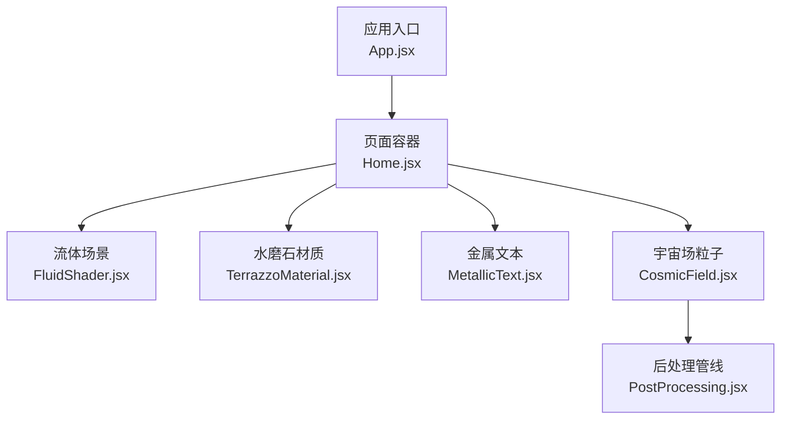
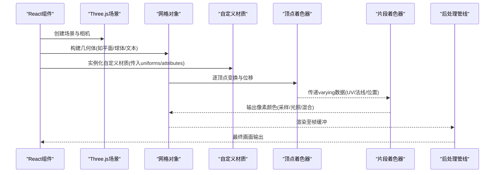
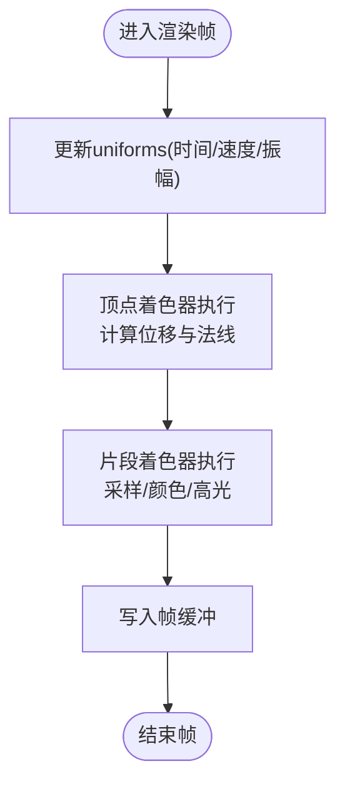
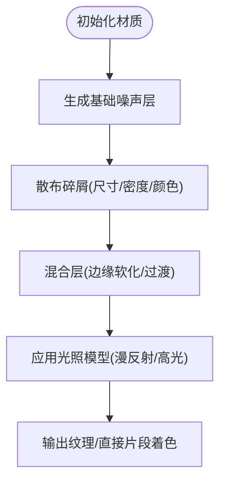
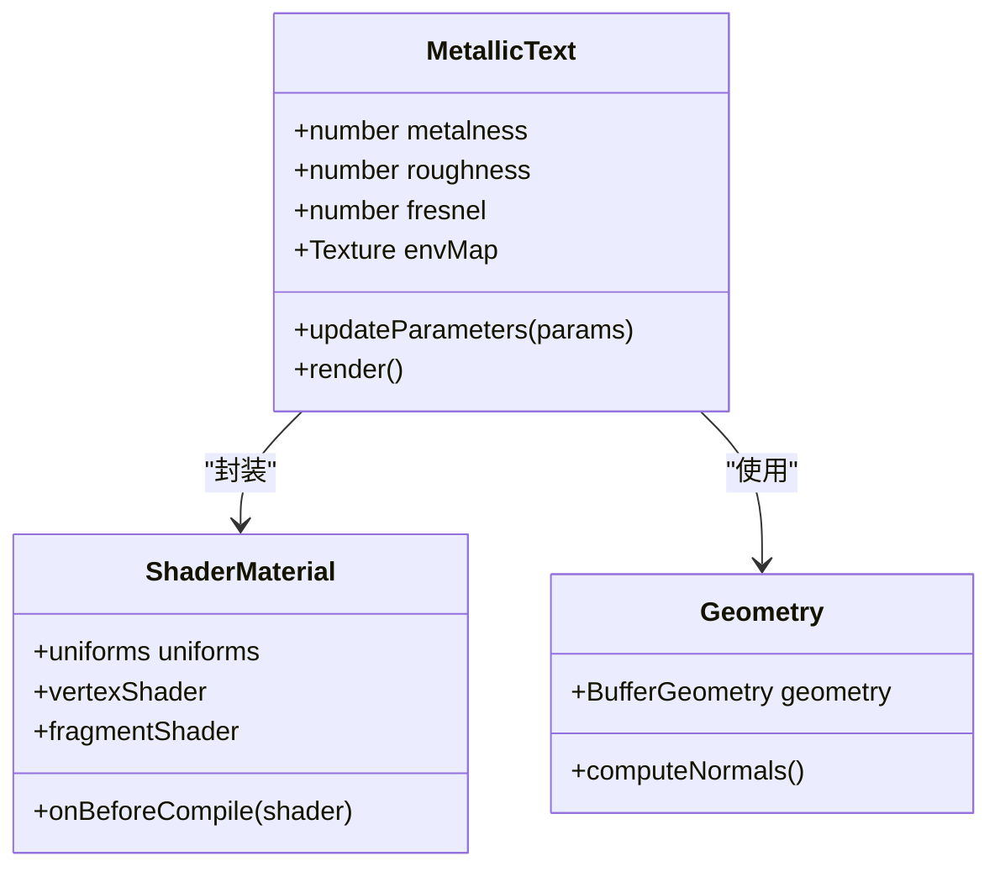
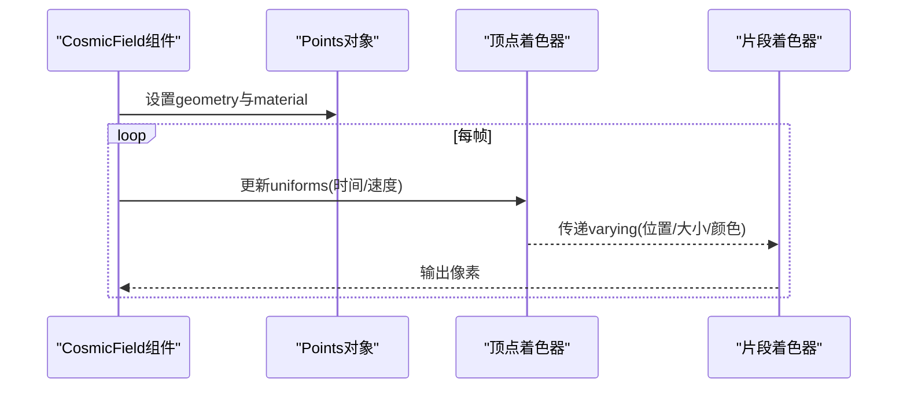
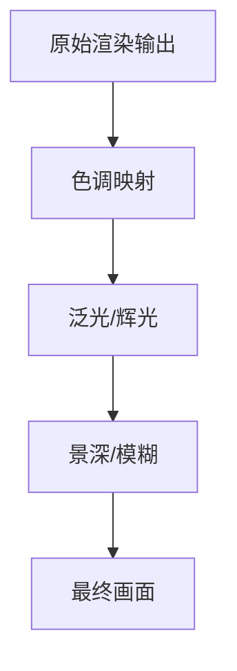
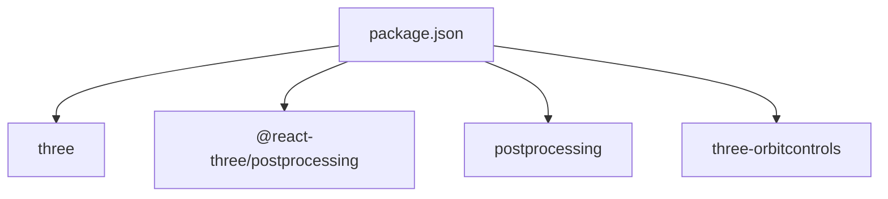

# 着色器与材质

<cite>
**本文引用的文件**   
- [FluidShader.jsx](file://src/components/three/FluidShader.jsx)
- [TerrazzoMaterial.jsx](file://src/components/three/TerrazzoMaterial.jsx)
- [MetallicText.jsx](file://src/components/three/MetallicText.jsx)
- [CosmicField.jsx](file://src/components/three/CosmicField.jsx)
- [PostProcessing.jsx](file://src/components/three/PostProcessing.jsx)
- [package.json](file://package.json)
</cite>

## 目录
1. [简介](#简介)
2. [项目结构](#项目结构)
3. [核心组件](#核心组件)
4. [架构总览](#架构总览)
5. [详细组件分析](#详细组件分析)
6. [依赖关系分析](#依赖关系分析)
7. [性能考虑](#性能考虑)
8. [故障排查指南](#故障排查指南)
9. [结论](#结论)
10. [附录](#附录)

## 简介
本技术文档聚焦于本项目中的自定义着色器与高级材质实现，涵盖流体着色器、水磨石材质、金属文本等典型效果。文档从系统架构、数据流、处理逻辑、集成点、错误处理与性能特性等多维度展开，帮助读者理解GLSL在Three.js环境下的使用方式、纹理采样与光照模型、法线映射、透明度混合等关键技术，并提供调试方法与优化策略。

## 项目结构
与着色器和材质相关的核心代码位于 src/components/three 目录下，主要包括：
- 流体着色器示例：FluidShader.jsx
- 水磨石材质示例：TerrazzoMaterial.jsx
- 金属文本材质示例：MetallicText.jsx
- 宇宙场粒子背景（含着色器）：CosmicField.jsx
- 后处理管线入口：PostProcessing.jsx

图表来源
- [FluidShader.jsx](file://src/components/three/FluidShader.jsx)
- [TerrazzoMaterial.jsx](file://src/components/three/TerrazzoMaterial.jsx)
- [MetallicText.jsx](file://src/components/three/MetallicText.jsx)
- [CosmicField.jsx](file://src/components/three/CosmicField.jsx)
- [PostProcessing.jsx](file://src/components/three/PostProcessing.jsx)

章节来源
- [FluidShader.jsx](file://src/components/three/FluidShader.jsx)
- [TerrazzoMaterial.jsx](file://src/components/three/TerrazzoMaterial.jsx)
- [MetallicText.jsx](file://src/components/three/MetallicText.jsx)
- [CosmicField.jsx](file://src/components/three/CosmicField.jsx)
- [PostProcessing.jsx](file://src/components/three/PostProcessing.jsx)

## 核心组件
本节概述各组件的职责与关键能力：
- 流体着色器：基于顶点位移与片段着色计算，模拟动态流体表面；支持时间驱动动画、UV扰动与颜色渐变。
- 水磨石材质：通过程序化噪声与多尺度碎屑叠加生成水磨石纹理；可配置颗粒大小、密度与色彩分布。
- 金属文本：结合高光反射与菲涅尔效应，呈现金属质感文字；支持粗糙度、金属度与贴图控制。
- 宇宙场粒子：大规模粒子渲染，使用自定义着色器实现体积光感与深度融合。
- 后处理管线：将上述效果整合到渲染流程中，提供色调映射、泛光等增强。

章节来源
- [FluidShader.jsx](file://src/components/three/FluidShader.jsx)
- [TerrazzoMaterial.jsx](file://src/components/three/TerrazzoMaterial.jsx)
- [MetallicText.jsx](file://src/components/three/MetallicText.jsx)
- [CosmicField.jsx](file://src/components/three/CosmicField.jsx)
- [PostProcessing.jsx](file://src/components/three/PostProcessing.jsx)

## 架构总览
下图展示从React组件到Three.js渲染管线的整体交互关系，包括几何体、材质、着色器与后处理的协作。

图表来源
- [FluidShader.jsx](file://src/components/three/FluidShader.jsx)
- [TerrazzoMaterial.jsx](file://src/components/three/TerrazzoMaterial.jsx)
- [MetallicText.jsx](file://src/components/three/MetallicText.jsx)
- [CosmicField.jsx](file://src/components/three/CosmicField.jsx)
- [PostProcessing.jsx](file://src/components/three/PostProcessing.jsx)

## 详细组件分析

### 流体着色器（FluidShader）
职责与特性
- 顶点着色器：根据时间与UV坐标对顶点进行位移，形成波浪或涡旋形态；可加入法线估算以改善光照。
- 片段着色器：基于UV与高度信息计算颜色渐变、高光与阴影，模拟液体表面光泽。
- Uniforms与Attributes：时间、速度、振幅、频率、UV偏移、颜色参数等；顶点属性包含位置、UV、法线。

关键流程
- 初始化：加载几何体与材质，设置uniforms初始值。
- 更新循环：每帧递增时间并重新计算顶点位移与颜色。
- 渲染：将结果提交至后处理或直接输出。

图表来源
- [FluidShader.jsx](file://src/components/three/FluidShader.jsx)

章节来源
- [FluidShader.jsx](file://src/components/three/FluidShader.jsx)

### 水磨石材质（TerrazzoMaterial）
职责与特性
- 程序化纹理：使用多层噪声与随机碎屑叠加，生成水磨石风格图案。
- 可控参数：颗粒尺寸、密度、颜色范围、粗糙度、光泽度。
- UV处理：支持平铺与偏移，适配不同几何体尺寸。

实现要点
- 噪声函数：分形布朗运动或多层Perlin/Simplex噪声组合。
- 碎屑生成：基于阈值与距离场判断碎屑形状与边界。
- 光照模型：漫反射+高光，配合粗糙度控制反射强度。

图表来源
- [TerrazzoMaterial.jsx](file://src/components/three/TerrazzoMaterial.jsx)

章节来源
- [TerrazzoMaterial.jsx](file://src/components/three/TerrazzoMaterial.jsx)

### 金属文本（MetallicText）
职责与特性
- 材质属性：金属度、粗糙度、反射强度、菲涅尔系数。
- 光照与反射：基于物理的反射模型，突出金属高光与边缘反射。
- 文本几何：由字体生成三维网格，便于着色器直接作用于表面。

实现要点
- 法线贴图：可选，用于增强细节与微表面起伏。
- 环境映射：可选，使用立方体贴图或屏幕空间反射提升真实感。
- 透明度与混合：文本边缘抗锯齿与半透明描边。

图表来源
- [MetallicText.jsx](file://src/components/three/MetallicText.jsx)

章节来源
- [MetallicText.jsx](file://src/components/three/MetallicText.jsx)

### 宇宙场粒子（CosmicField）
职责与特性
- 大规模粒子：使用Instanced或Points渲染大量粒子，实现星空或星云效果。
- 体积光感：通过深度与距离衰减模拟体积散射。
- 动画：缓慢漂移与闪烁，增强沉浸感。

实现要点
- 顶点着色器：按时间偏移位置，缩放与旋转粒子。
- 片段着色器：基于距离与角度计算亮度与颜色。
- 性能：批处理与合并绘制调用。

图表来源
- [CosmicField.jsx](file://src/components/three/CosmicField.jsx)

章节来源
- [CosmicField.jsx](file://src/components/three/CosmicField.jsx)

### 后处理管线（PostProcessing）
职责与特性
- 统一后处理：将多个效果的输出进行合成，提供色调映射、泛光、景深等。
- 模块化：每个效果作为独立pass，按需启用或调整参数。
- 性能：使用多重帧缓冲与最小化拷贝操作。

图表来源
- [PostProcessing.jsx](file://src/components/three/PostProcessing.jsx)

章节来源
- [PostProcessing.jsx](file://src/components/three/PostProcessing.jsx)

## 依赖关系分析
项目依赖Three.js生态库以实现WebGL渲染与后处理。以下为关键依赖概览：

图表来源
- [package.json](file://package.json)

章节来源
- [package.json](file://package.json)

## 性能考虑
- 减少绘制调用：合并几何体或使用Instanced渲染，降低CPU-GPU同步开销。
- 控制分辨率：后处理与全屏效果尽量使用较低分辨率再上采样。
- 避免过度分支：在片段着色器中使用条件分支可能导致分支发散，尽量用数学函数替代。
- 纹理压缩与Mipmap：合理选择纹理格式与mipmap层级，减少带宽占用。
- 限制复杂度：噪声与碎屑层数不宜过多，必要时预计算或烘焙。
- 合理使用透明度：混合模式会增加过绘制成本，尽量在后处理阶段处理半透明。

[本节为通用指导，不直接分析具体文件]

## 故障排查指南
常见问题与定位方法
- 着色器编译失败：检查语法错误与版本声明；确认uniforms与attributes名称一致。
- 纹理未显示：验证纹理路径与加载状态；确保UV坐标范围正确。
- 性能骤降：监控GPU利用率与帧时间；减少复杂计算与过绘制。
- 后处理黑屏：检查pass顺序与帧缓冲切换；确认输入输出纹理绑定正确。
- 透明度异常：调整混合方程与深度测试；避免深度排序问题。

建议工具
- WebGL Inspector：查看着色器编译日志与资源状态。
- Chrome DevTools Performance面板：分析帧耗时与瓶颈。
- Three.js Inspector：可视化场景结构与材质参数。

[本节为通用指导，不直接分析具体文件]

## 结论
本项目通过自定义着色器与材质实现了多种高级视觉效果，包括流体、水磨石与金属文本等。借助Three.js与后处理管线，这些效果能够高效地集成到Web应用中。遵循本文档提供的实现要点、调试方法与优化策略，可以进一步提升视觉质量与运行性能。

[本节为总结性内容，不直接分析具体文件]

## 附录
- GLSL入门要点
  - 变量类型：float、vec2/3/4、mat2/3/4、sampler2D/samplerCube等。
  - 内置函数：mix、smoothstep、pow、length、normalize等。
  - 精度限定：precision mediump/highp float; 在不同平台选择合适的精度。
- 常用技巧
  - UV处理：重复平铺、镜像、极坐标转换。
  - 透明度混合：gl_FragColor.a与gl.enableBlending。
  - 法线映射：切线空间法线与世界空间法线转换。
  - 光照模型：Phong/Blinn-Phong、PBR金属度/粗糙度工作流。
- 定制指南
  - 逐步调整uniforms观察变化，记录最佳参数。
  - 使用可视化工具辅助调试（如颜色编码表示法线方向）。
  - 将复杂效果拆分为多个pass，便于维护与优化。

[本节为概念性内容，不直接分析具体文件]