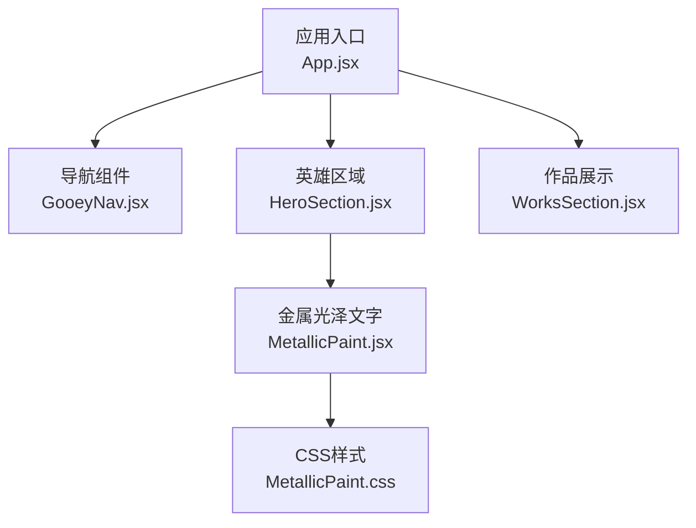
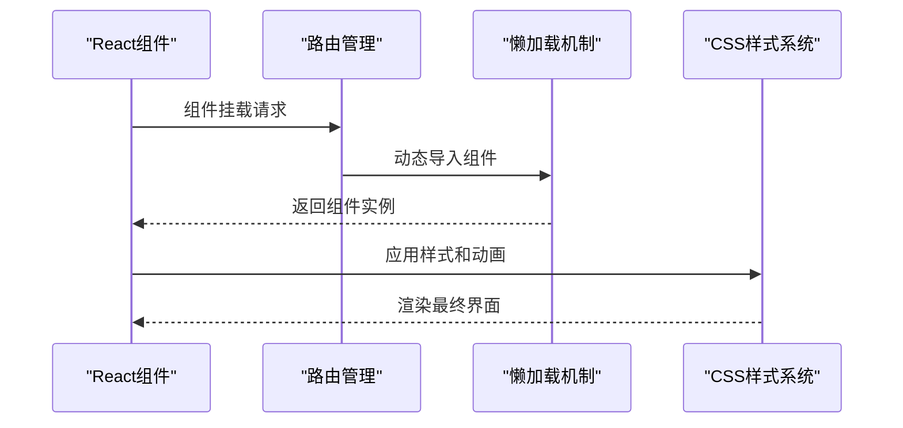
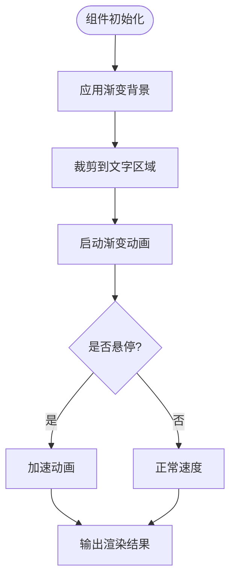
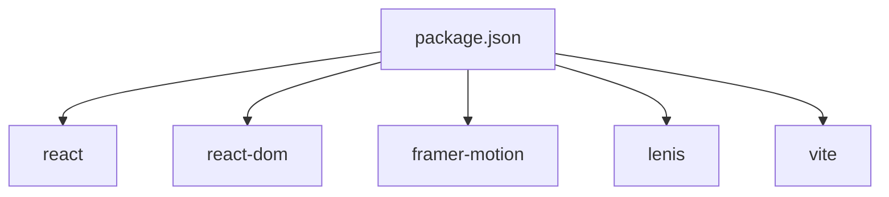

# 着色器与材质

<cite>
**本文引用的文件**   
- [MetallicPaint.jsx](file://src/components/ui/MetallicPaint.jsx)
- [MetallicPaint.css](file://src/components/ui/MetallicPaint.css)
- [package.json](file://package.json)
- [README.md](file://README.md)
</cite>

## 更新摘要
**所做更改**   
- 移除了所有Three.js相关的着色器和材质组件（FluidShader、TerrazzoMaterial、MetallicText）
- 项目不再使用自定义GLSL着色器或Three.js材质
- 保留了CSS实现的金属光泽效果作为替代方案
- 更新了技术栈说明，移除Three.js相关依赖

## 目录
1. [简介](#简介)
2. [项目结构](#项目结构)
3. [核心组件](#核心组件)
4. [架构总览](#架构总览)
5. [详细组件分析](#详细组件分析)
6. [依赖关系分析](#依赖关系分析)
7. [性能考虑](#性能考虑)
8. [故障排查指南](#故障排查指南)
9. [结论](#结论)
10. [附录](#附录)

## 简介
本技术文档聚焦于项目中现有的视觉效果实现。经过重大重构后，项目已完全移除Three.js相关的自定义着色器和材质系统，转而采用更轻量级的CSS动画和渐变技术来实现视觉效果。当前主要保留的是基于CSS的金属光泽文字效果，通过渐变动画模拟金属质感。

## 项目结构
经过重构后，项目结构大幅简化，移除了所有Three.js相关的着色器文件：
- 金属光泽文字组件：MetallicPaint.jsx（CSS实现）
- 金属光泽样式：MetallicPaint.css（渐变动画）
- 主应用入口：App.jsx（无Three.js集成）
- 项目配置：package.json（无Three.js依赖）

图表来源
- [App.jsx](file://src/App.jsx)
- [MetallicPaint.jsx](file://src/components/ui/MetallicPaint.jsx)
- [MetallicPaint.css](file://src/components/ui/MetallicPaint.css)

章节来源
- [App.jsx](file://src/App.jsx)
- [MetallicPaint.jsx](file://src/components/ui/MetallicPaint.jsx)
- [MetallicPaint.css](file://src/components/ui/MetallicPaint.css)

## 核心组件
本节概述当前项目的核心组件及其职责：
- 金属光泽文字（MetallicPaint）：使用CSS渐变动画实现金属光泽效果，支持多种配色方案和交互响应。
- 应用主组件（App）：负责页面布局、路由导航和懒加载优化。
- 导航组件（GooeyNav）：提供粘性导航和滚动监听功能。
- 各内容区块组件：懒加载的内容展示组件。

**更新** 移除了所有Three.js相关的着色器组件，包括流体着色器、水磨石材质和3D金属文本效果。

章节来源
- [MetallicPaint.jsx](file://src/components/ui/MetallicPaint.jsx)
- [App.jsx](file://src/App.jsx)

## 架构总览
下图展示了当前React应用的架构模式，采用组件化设计和懒加载策略：

图表来源
- [App.jsx](file://src/App.jsx)
- [MetallicPaint.jsx](file://src/components/ui/MetallicPaint.jsx)

## 详细组件分析

### 金属光泽文字（MetallicPaint）
职责与特性
- CSS渐变动画：使用linear-gradient创建金属光泽背景，配合background-clip: text实现文字填充效果。
- 多主题支持：提供标准银色和暖色调两种配色方案。
- 交互响应：hover时加速动画，提升用户体验。
- 无障碍支持：遵循prefers-reduced-motion媒体查询，尊重用户偏好。

实现要点
- 渐变背景：大尺寸线性渐变覆盖整个元素，通过动画改变背景位置。
- 文字裁剪：使用background-clip: text将背景限制在文字区域内。
- 动画优化：使用CSS动画而非JavaScript，确保流畅的60fps表现。

图表来源
- [MetallicPaint.jsx](file://src/components/ui/MetallicPaint.jsx)
- [MetallicPaint.css](file://src/components/ui/MetallicPaint.css)

章节来源
- [MetallicPaint.jsx](file://src/components/ui/MetallicPaint.jsx)
- [MetallicPaint.css](file://src/components/ui/MetallicPaint.css)

### 应用主组件（App）
职责与特性
- 页面布局：管理整体页面结构和导航系统。
- 懒加载：对非首屏内容进行延迟加载，优化初始渲染性能。
- 滚动优化：集成平滑滚动和进度条显示。
- 状态管理：处理导航状态和滚动监听。

实现要点
- React.lazy：使用代码分割减少初始包大小。
- Suspense：为懒加载组件提供加载状态。
- Framer Motion：集成动画库实现流畅过渡效果。

章节来源
- [App.jsx](file://src/App.jsx)

## 依赖关系分析
项目依赖已大幅简化，移除了所有Three.js相关依赖：

**更新** 移除了three、@react-three/fiber、@react-three/drei等Three.js生态依赖。

图表来源
- [package.json](file://package.json)

章节来源
- [package.json](file://package.json)

## 性能考虑
- 代码分割：使用React.lazy和Suspense实现按需加载，减少初始包体积。
- CSS动画优先：使用CSS动画而非JavaScript动画，利用GPU加速。
- 懒加载策略：非关键内容延迟加载，提升首屏渲染速度。
- 资源优化：避免大型3D模型和纹理文件，使用轻量级CSS效果。
- 内存管理：及时清理事件监听器和动画定时器。

## 故障排查指南
常见问题与定位方法
- 样式不生效：检查CSS文件是否正确引入，确认类名匹配。
- 动画卡顿：检查浏览器开发者工具的性能面板，优化动画性能。
- 懒加载失败：确认组件路径正确，检查网络请求状态。
- 移动端兼容：测试不同设备和浏览器的兼容性。

建议工具
- Chrome DevTools：调试样式和性能问题。
- React Developer Tools：检查组件状态和props。
- Lighthouse：评估性能和可访问性。

## 结论
经过重大重构，项目已从复杂的Three.js 3D渲染系统转向简洁高效的CSS动画方案。虽然失去了高级3D效果，但获得了更好的性能表现、更小的包体积和更广泛的设备兼容性。当前的金属光泽文字效果通过纯CSS实现，既保持了视觉吸引力，又确保了跨平台的一致性。

## 附录
- CSS动画最佳实践
  - 使用transform和opacity属性获得最佳性能
  - 合理使用will-change提示浏览器优化
  - 遵循prefers-reduced-motion媒体查询
- 性能优化技巧
  - 代码分割和懒加载策略
  - CSS动画优于JavaScript动画
  - 避免重排和重绘操作
- 无障碍设计
  - 尊重用户的运动偏好设置
  - 提供足够的对比度和可读性
  - 确保键盘导航支持

[本节为概念性内容，不直接分析具体文件]