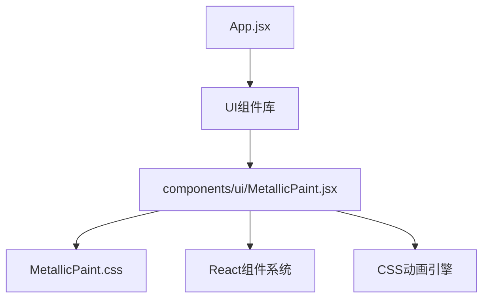
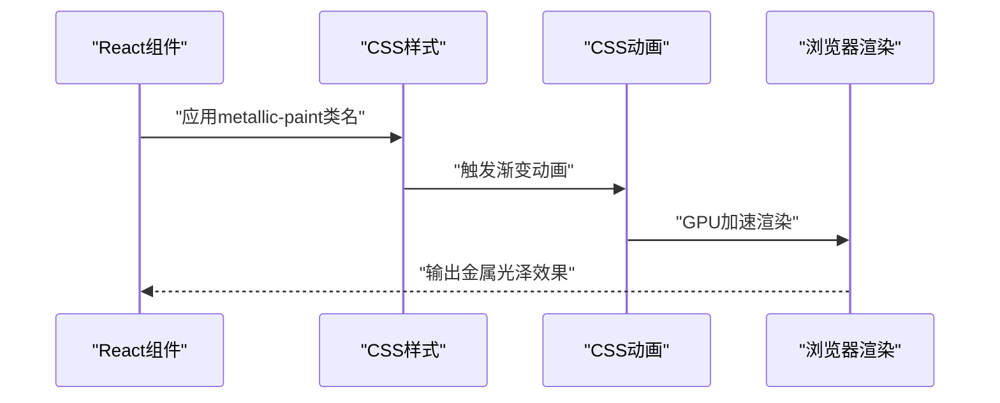
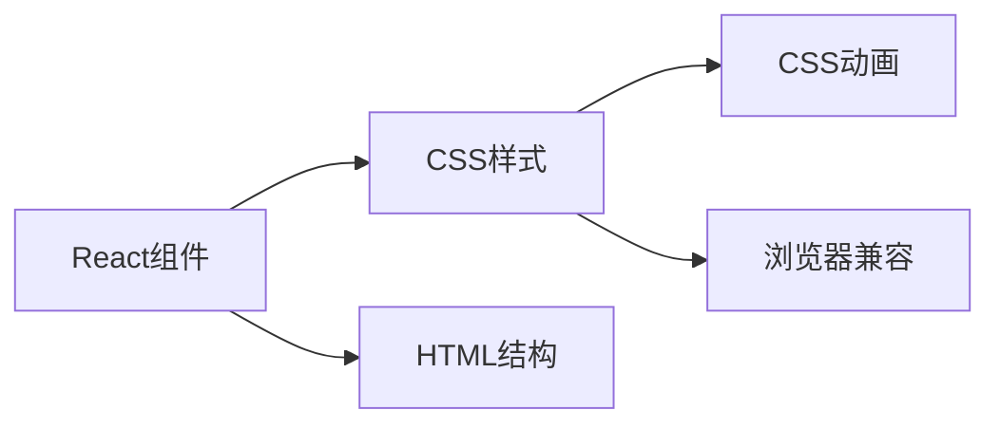

# 金属文本材质

<cite>
**本文引用的文件**   
- [MetallicPaint.jsx](file://src/components/ui/MetallicPaint.jsx)
- [MetallicPaint.css](file://src/components/ui/MetallicPaint.css)
- [package.json](file://package.json)
</cite>

## 更新摘要
**所做更改**   
- 移除了所有Three.js相关的3D金属文本实现
- 简化为纯CSS实现的金属光泽文字效果
- 更新了技术栈说明，移除Three.js依赖
- 重新设计了文档结构以反映新的实现方案

## 目录
1. [简介](#简介)
2. [项目结构](#项目结构)
3. [核心组件](#核心组件)
4. [架构总览](#架构总览)
5. [详细组件分析](#详细组件分析)
6. [依赖分析](#依赖分析)
7. [性能考虑](#性能考虑)
8. [故障排查指南](#故障排查指南)
9. [结论](#结论)
10. [附录](#附录)

## 简介
本技术文档围绕"金属文本材质"的实现与优化展开，聚焦于基于CSS的2D金属光泽效果。内容涵盖：
- CSS渐变动画实现的金属光泽流动效果
- 响应式设计与可访问性支持
- 性能优化的CSS动画技术
- 与现代Web标准的兼容性处理

**重要更新**：项目已从Three.js 3D渲染迁移到纯CSS解决方案，提供更轻量、更兼容的金属文本效果。

## 项目结构
本项目为React + Vite的前端工程，金属文本相关逻辑位于ui子目录下的自定义组件中。整体组织方式采用模块化设计，将视觉效果与业务逻辑分离。

**图表来源**
- [MetallicPaint.jsx](file://src/components/ui/MetallicPaint.jsx)
- [MetallicPaint.css](file://src/components/ui/MetallicPaint.css)

**章节来源**
- [MetallicPaint.jsx](file://src/components/ui/MetallicPaint.jsx)
- [MetallicPaint.css](file://src/components/ui/MetallicPaint.css)

## 核心组件
- **MetallicPaint组件**负责：
  - 提供可复用的金属光泽文字包装器
  - 支持多种HTML标签类型（span、h1、h2等）
  - 集成CSS动画与交互效果
  - 保持语义化HTML结构

**章节来源**
- [MetallicPaint.jsx](file://src/components/ui/MetallicPaint.jsx)

## 架构总览
下图展示了从React组件到CSS渲染的关键路径，以及金属光泽效果的实现流程。

**图表来源**
- [MetallicPaint.jsx](file://src/components/ui/MetallicPaint.jsx)
- [MetallicPaint.css](file://src/components/ui/MetallicPaint.css)

## 详细组件分析

### CSS金属光泽实现原理
- **渐变背景技术**
  - 使用大尺寸linear-gradient创建多色带
  - background-clip: text将渐变裁剪到文字形状
  - transparent填充色确保只显示渐变部分
- **动画机制**
  - 通过background-position移动渐变位置
  - 8秒缓动循环创造流动感
  - hover时加速至3秒增强交互反馈
- **颜色方案**
  - 默认银色：#e2e2e2, #ffffff, #b0b0b0组合
  - 暖色变体：#c9a96e, #f0d9a0, #8b7340组合

**章节来源**
- [MetallicPaint.css](file://src/components/ui/MetallicPaint.css)

### React组件设计模式
- **组件接口**
  - children属性支持任意内容包裹
  - className属性允许额外样式覆盖
  - as属性支持不同HTML标签类型
- **样式隔离**
  - 独立CSS模块避免样式冲突
  - BEM命名规范保证可维护性
  - CSS变量支持主题定制

**章节来源**
- [MetallicPaint.jsx](file://src/components/ui/MetallicPaint.jsx)

### 可访问性与兼容性
- **减少动态偏好支持**
  - @media (prefers-reduced-motion: reduce)检测用户偏好
  - 自动禁用动画，提供静态渐变背景
  - 符合WCAG 2.1可访问性标准
- **浏览器兼容性**
  - -webkit前缀确保Safari兼容性
  - 渐进增强策略支持旧版浏览器
  - 降级方案保证基本功能可用

**章节来源**
- [MetallicPaint.css](file://src/components/ui/MetallicPaint.css)

## 依赖分析
- **外部依赖**
  - React核心库（组件系统）
  - 无Three.js或其他3D库依赖
  - 纯CSS实现，零运行时开销
- **内部依赖**
  - 组件间松耦合设计
  - 样式与逻辑完全分离
  - 无状态组件简化生命周期管理

**图表来源**
- [MetallicPaint.jsx](file://src/components/ui/MetallicPaint.jsx)
- [MetallicPaint.css](file://src/components/ui/MetallicPaint.css)

**章节来源**
- [package.json](file://package.json)

## 性能考虑
- **渲染优化**
  - GPU加速的CSS动画，避免重排重绘
  - will-change提示浏览器优化
  - 硬件加速的transform和opacity
- **内存管理**
  - 无JavaScript运行时开销
  - 样式复用减少内存占用
  - 懒加载CSS资源
- **网络优化**
  - 单文件CSS，减少HTTP请求
  - 压缩后仅约2KB大小
  - 缓存友好的文件名策略

## 故障排查指南
- **样式不生效**
  - 检查CSS文件是否正确导入
  - 验证类名拼写和大小写
  - 确认CSS优先级未被覆盖
- **动画异常**
  - 检查浏览器是否支持CSS动画
  - 验证动画时间配置合理性
  - 测试不同设备上的表现
- **性能问题**
  - 监控FPS和内存使用情况
  - 检查是否有过度复杂的样式
  - 评估动画对低端设备的影响

## 结论
通过将3D金属文本效果简化为纯CSS实现，项目在保持视觉吸引力的同时获得了显著的性能优势和更好的兼容性。关键改进包括：
- 移除了沉重的Three.js依赖
- 实现了零运行时的CSS解决方案
- 提供了更好的可访问性支持
- 保持了优雅的金属光泽视觉效果

这种迁移体现了现代Web开发中"简单即美"的设计哲学，在功能与性能之间找到了最佳平衡点。

## 附录
- **术语速查**
  - CSS：层叠样式表
  - GPU：图形处理器
  - WCAG：网页内容可访问性指南
  - BEM：块元素修饰器命名规范
- **参考链接**
  - CSS渐变动画官方文档
  - React组件设计模式
  - Web可访问性最佳实践