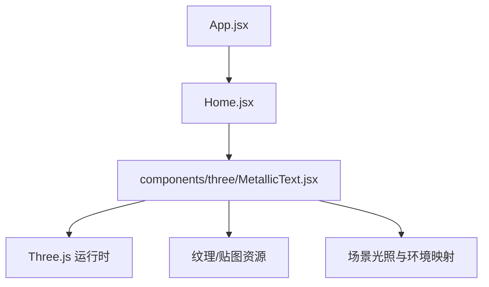
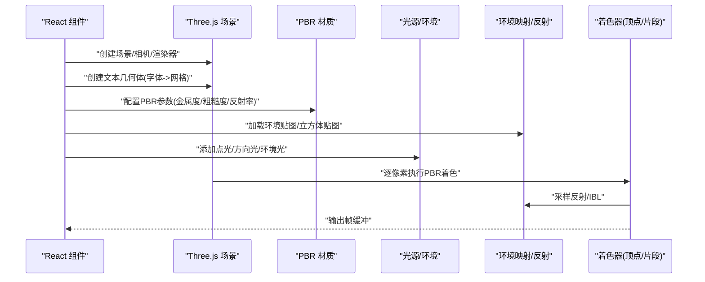
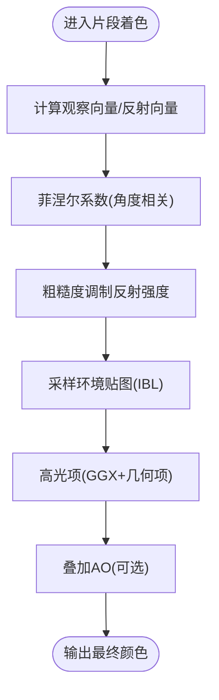
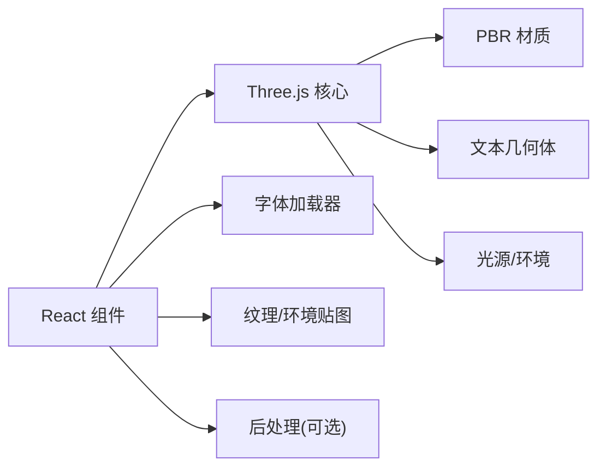

# 金属文本材质

<cite>
**本文引用的文件**   
- [MetallicText.jsx](file://src/components/three/MetallicText.jsx)
- [Three.js 文档](file://https://threejs.org/docs/)
</cite>

## 目录
1. [简介](#简介)
2. [项目结构](#项目结构)
3. [核心组件](#核心组件)
4. [架构总览](#架构总览)
5. [详细组件分析](#详细组件分析)
6. [依赖分析](#依赖分析)
7. [性能考虑](#性能考虑)
8. [故障排查指南](#故障排查指南)
9. [结论](#结论)
10. [附录](#附录)

## 简介
本技术文档围绕“金属文本材质”的实现与优化展开，聚焦于基于物理的渲染（PBR）在3D文本上的应用。内容涵盖：
- PBR 金属材质的关键要素：高光反射、菲涅尔效应、环境映射、粗糙度控制与环境光遮蔽
- 3D 文本几何体构建、法线计算与 UV 坐标映射
- 着色器层面的实现思路与不同金属类型（金、银、铜等）的视觉差异
- 文本材质与场景光照的交互原理及性能优化技巧

## 项目结构
本项目为 React + Three.js 的前端工程，金属文本相关逻辑位于 three 子目录下的自定义组件中。整体组织方式以功能组件为主，将 3D 场景、材质与后处理进行模块化拆分。

图表来源
- [MetallicText.jsx](file://src/components/three/MetallicText.jsx)

章节来源
- [MetallicText.jsx](file://src/components/three/MetallicText.jsx)

## 核心组件
- 金属文本组件负责：
  - 加载字体并生成 3D 文本几何体
  - 配置 PBR 材质参数（金属度、粗糙度、反射率等）
  - 设置环境映射与反射采样
  - 管理光照与相机，驱动动画或交互
  - 可选的后处理增强（如泛光、色调映射）

章节来源
- [MetallicText.jsx](file://src/components/three/MetallicText.jsx)

## 架构总览
下图展示了从 React 组件到 Three.js 渲染管线的关键路径，以及 PBR 材质与环境映射的交互关系。

图表来源
- [MetallicText.jsx](file://src/components/three/MetallicText.jsx)
- [Three.js 文档](file://https://threejs.org/docs/)

## 详细组件分析

### 3D 文本几何体构建
- 字体加载与几何生成
  - 使用异步字体加载器获取字形数据
  - 通过 TextGeometry 或等效 API 将字符轮廓转换为三角面片
  - 对生成的几何体进行缩放、位置与旋转调整
- 法线与切线空间
  - 由几何体自动生成法线；若需各向异性或复杂反射，可补充切线/副切线
  - 确保 UV 坐标覆盖完整，避免拉伸导致反射失真
- UV 映射策略
  - 默认平面映射适用于大多数情况
  - 对于曲面或特殊效果，可采用程序化 UV 或贴图驱动

章节来源
- [MetallicText.jsx](file://src/components/three/MetallicText.jsx)

### PBR 金属材质与着色器
- 材质参数
  - 金属度：区分导体与非导体，金属通常接近 1
  - 粗糙度：控制表面微观起伏，影响镜面反射宽度与强度
  - 反射率/基础色：决定入射角较小时的反射强度与颜色倾向
- 菲涅尔效应
  - 随视角变化，掠射角反射更强
  - 常用 Schlick 近似或更精确的介质函数
- 高光与微表面模型
  - GGX/Trowbridge-Reitz 分布用于描述微表面法线分布
  - 几何项（Smith/GGX）处理自遮挡
  - 半透明/透射不适用于典型金属，但可用于复合材质
- 环境映射与 IBL
  - 使用立方体贴图或球谐环境贴图提供间接照明
  - 预过滤环境贴图与 BRDF LUT 提升质量与性能
- 环境光遮蔽（AO）
  - 可通过 AO 贴图或屏幕空间方法增强接触阴影与细节

图表来源
- [MetallicText.jsx](file://src/components/three/MetallicText.jsx)
- [Three.js 文档](file://https://threejs.org/docs/)

### 不同金属类型的视觉效果
- 金
  - 基础色偏暖黄，反射率高，低粗糙度呈现锐利高光
  - 掠射角下反射增强，细节处可见暖色边缘
- 银
  - 基础色中性灰白，高反射，低粗糙度时镜面清晰
  - 适合展示干净的高光与清晰的反射轮廓
- 铜
  - 基础色偏红棕，反射带有色偏，粗糙度适中可营造氧化质感
  - 配合 AO 强化缝隙与雕刻细节

章节来源
- [MetallicText.jsx](file://src/components/three/MetallicText.jsx)

### 文本材质与场景光照的交互
- 直接光照
  - 方向光/点光提供主光源，影响高光位置与强度
  - 多光源叠加可丰富反射层次
- 间接光照
  - 环境贴图贡献全局反射与漫反射
  - 反射强度受粗糙度与菲涅尔共同调制
- 动态交互
  - 相机移动改变观察向量，触发菲涅尔变化
  - 光源或环境贴图更新可实时刷新反射

章节来源
- [MetallicText.jsx](file://src/components/three/MetallicText.jsx)

## 依赖分析
- 外部依赖
  - Three.js 核心库（场景、材质、几何体、纹理、光照）
  - 字体加载器与文本几何体扩展
  - 可选：后处理管线（泛光、色调映射、抗锯齿）
- 内部依赖
  - React 组件生命周期管理 Three.js 实例
  - 资源管理器负责纹理/环境贴图的加载与缓存

图表来源
- [MetallicText.jsx](file://src/components/three/MetallicText.jsx)
- [Three.js 文档](file://https://threejs.org/docs/)

章节来源
- [MetallicText.jsx](file://src/components/three/MetallicText.jsx)

## 性能考虑
- 几何体优化
  - 合理设置文本分段与倒角，避免过度细分
  - 复用几何体与材质实例，减少 GPU/CPU 开销
- 纹理与 IBL
  - 使用合适分辨率的环境贴图，必要时分屏预过滤
  - 限制反射采样次数，采用近似方案
- 着色器效率
  - 避免分支与昂贵函数，尽量使用查表与近似
  - 合并多次采样，减少带宽压力
- 渲染管线
  - 启用必要的后处理，但控制数量与分辨率
  - 使用视锥剔除与层级管理，降低绘制调用

[本节为通用指导，不直接分析具体文件]

## 故障排查指南
- 文本几何体异常
  - 检查字体文件是否成功加载与解析
  - 确认几何体尺寸与相机距离匹配，避免过小不可见
- 反射与环境贴图
  - 验证环境贴图格式与加载状态
  - 检查材质金属度/粗糙度设置是否合理
- 性能问题
  - 监控帧率与 GPU 占用，定位瓶颈（几何体/纹理/后处理）
  - 逐步关闭后处理与降低分辨率，对比效果

章节来源
- [MetallicText.jsx](file://src/components/three/MetallicText.jsx)

## 结论
通过对 3D 文本几何体构建、PBR 材质参数与着色器流程的系统化梳理，可以实现逼真的金属文本效果。关键在于：
- 准确的几何与 UV 映射
- 合理的 PBR 参数与菲涅尔/粗糙度控制
- 高质量的环境映射与间接光照
- 针对性能的优化策略

[本节为总结性内容，不直接分析具体文件]

## 附录
- 术语速查
  - PBR：基于物理的渲染
  - IBL：基于图像的照明
  - AO：环境光遮蔽
  - GGX：微表面分布函数
- 参考链接
  - Three.js 官方文档与示例

[本节为参考资料，不直接分析具体文件]