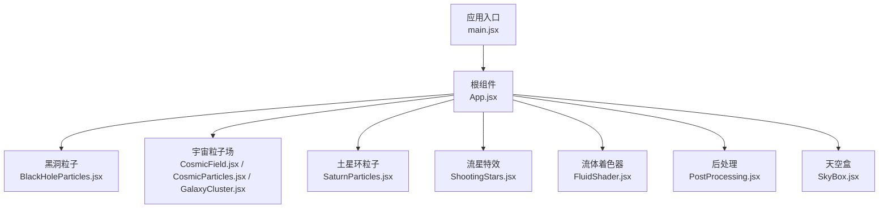
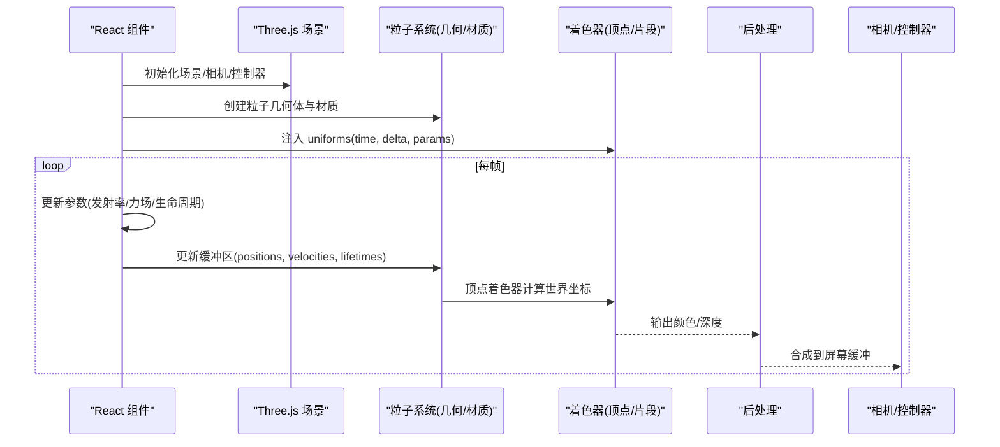
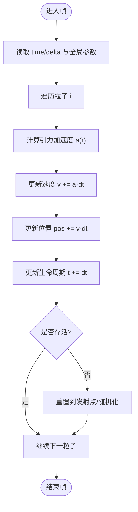
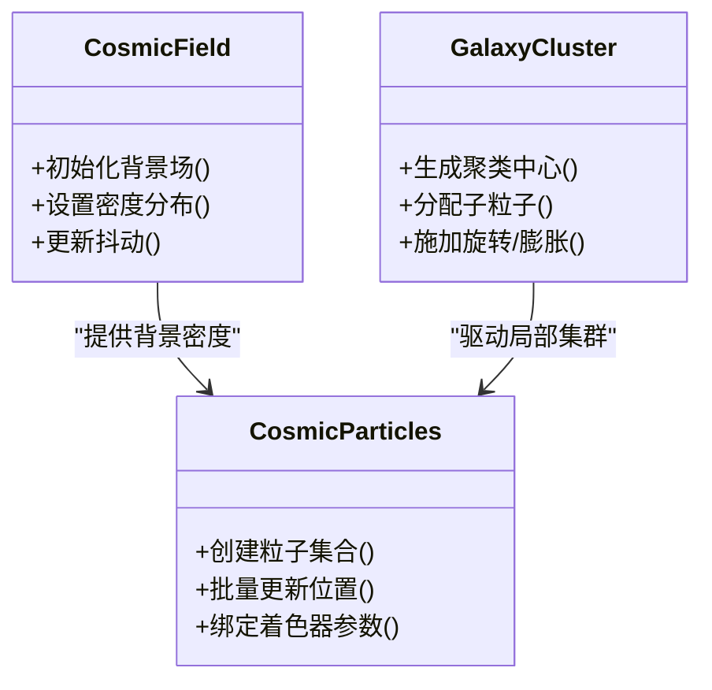
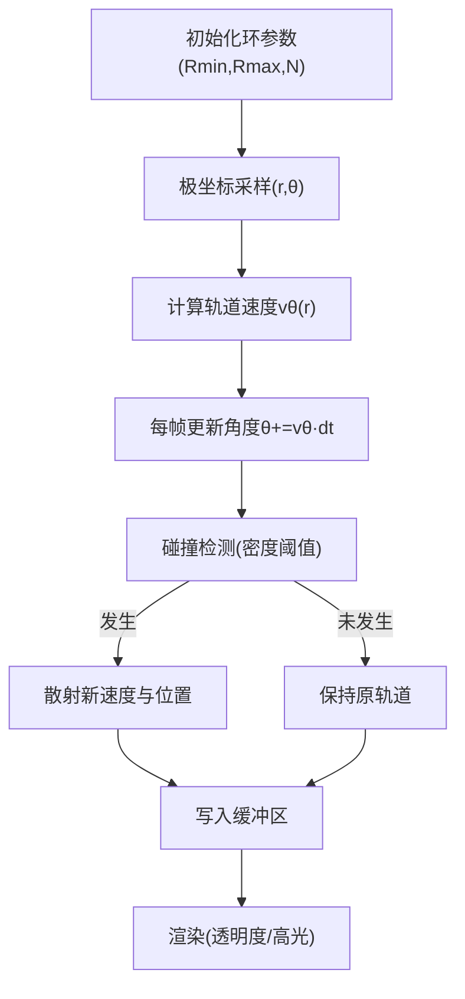
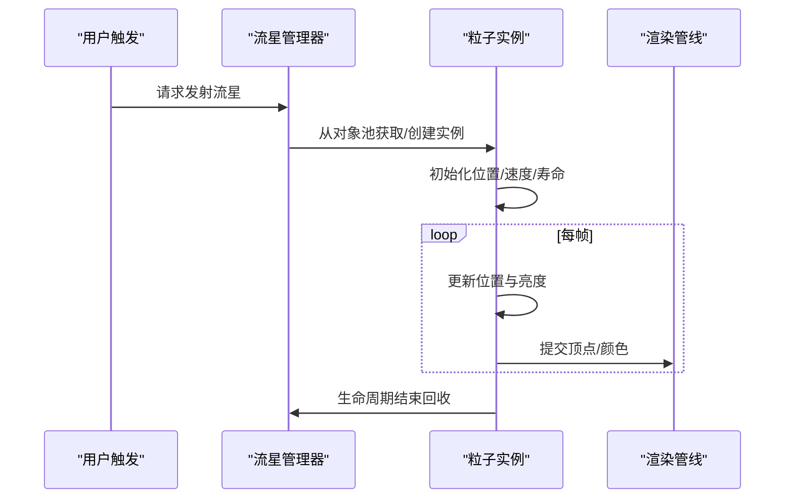
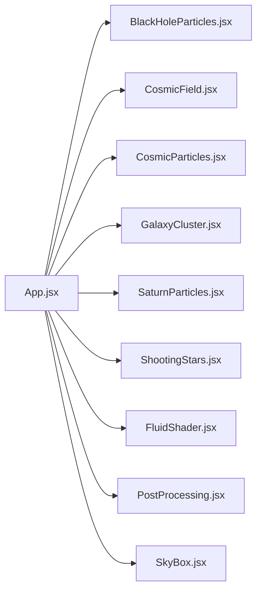

# 粒子系统实现

<cite>
**本文引用的文件**   
- [BlackHoleParticles.jsx](file://src/components/three/BlackHoleParticles.jsx)
- [CosmicField.jsx](file://src/components/three/CosmicField.jsx)
- [CosmicParticles.jsx](file://src/components/three/CosmicParticles.jsx)
- [FluidShader.jsx](file://src/components/three/FluidShader.jsx)
- [GalaxyCluster.jsx](file://src/components/three/GalaxyCluster.jsx)
- [ParticleHero.jsx](file://src/components/three/ParticleHero.jsx)
- [PostProcessing.jsx](file://src/components/three/PostProcessing.jsx)
- [SaturnParticles.jsx](file://src/components/three/SaturnParticles.jsx)
- [ShootingStars.jsx](file://src/components/three/ShootingStars.jsx)
- [SkyBox.jsx](file://src/components/three/SkyBox.jsx)
- [App.jsx](file://src/App.jsx)
- [main.jsx](file://src/main.jsx)
</cite>

## 目录
1. [简介](#简介)
2. [项目结构](#项目结构)
3. [核心组件](#核心组件)
4. [架构总览](#架构总览)
5. [详细组件分析](#详细组件分析)
6. [依赖关系分析](#依赖关系分析)
7. [性能考虑](#性能考虑)
8. [故障排查指南](#故障排查指南)
9. [结论](#结论)
10. [附录](#附录)

## 简介
本技术文档围绕仓库中的 Three.js 粒子系统实现，系统性解析黑洞粒子效果、宇宙粒子场、土星环粒子等复杂粒子的数学模型与物理模拟算法，阐述 GPU 渲染管线、顶点着色器编程、生命周期管理、发射器设计、运动轨迹计算与碰撞检测策略。同时提供批处理渲染、内存管理与 LOD 等性能优化建议，并给出创建自定义粒子效果的步骤与调试技巧。

## 项目结构
本项目采用 React + Vite 组织，Three.js 相关粒子组件集中于 src/components/three 目录，按“功能/视觉效果”维度拆分：
- 黑洞粒子：BlackHoleParticles.jsx、RayMarchedBlackHole.jsx（后者为射线步进黑洞）
- 宇宙粒子场：CosmicField.jsx、CosmicParticles.jsx、GalaxyCluster.jsx
- 行星环粒子：SaturnParticles.jsx
- 动态特效：ShootingStars.jsx、FluidShader.jsx
- 场景支撑：SkyBox.jsx、PostProcessing.jsx
- 应用入口：App.jsx、main.jsx

图表来源
- [main.jsx](file://src/main.jsx)
- [App.jsx](file://src/App.jsx)
- [BlackHoleParticles.jsx](file://src/components/three/BlackHoleParticles.jsx)
- [CosmicField.jsx](file://src/components/three/CosmicField.jsx)
- [CosmicParticles.jsx](file://src/components/three/CosmicParticles.jsx)
- [GalaxyCluster.jsx](file://src/components/three/GalaxyCluster.jsx)
- [SaturnParticles.jsx](file://src/components/three/SaturnParticles.jsx)
- [ShootingStars.jsx](file://src/components/three/ShootingStars.jsx)
- [FluidShader.jsx](file://src/components/three/FluidShader.jsx)
- [PostProcessing.jsx](file://src/components/three/PostProcessing.jsx)
- [SkyBox.jsx](file://src/components/three/SkyBox.jsx)

章节来源
- [main.jsx](file://src/main.jsx)
- [App.jsx](file://src/App.jsx)

## 核心组件
本节聚焦关键粒子组件的职责与交互方式，说明其数据流与控制流。

- 黑洞粒子（BlackHoleParticles.jsx）
  - 职责：构建围绕中心质量吸积的粒子云，模拟引力汇聚、角动量守恒导致的盘状结构与喷流。
  - 关键点：径向速度衰减、切向速度提升、时间步长积分、GPU 位置更新。
- 宇宙粒子场（CosmicField.jsx / CosmicParticles.jsx / GalaxyCluster.jsx）
  - 职责：大规模背景星场与局部星系团聚合，体现密度分布与尺度变化。
  - 关键点：空间划分（如网格/八叉树）、批量实例化、视锥剔除。
- 土星环粒子（SaturnParticles.jsx）
  - 职责：在行星周围生成环形粒子带，体现开普勒轨道与碰撞破碎。
  - 关键点：极坐标初始化、轨道速度 v = sqrt(GM/r)、碰撞概率与碎片散射。
- 流星特效（ShootingStars.jsx）
  - 职责：快速划过天穹的流星尾迹，强调轨迹拉伸与亮度衰减。
  - 关键点：指数衰减、速度插值、尾迹长度控制。
- 流体着色器（FluidShader.jsx）
  - 职责：基于 GLSL 的体积/表面扰动效果，常用于增强粒子发光或介质感。
  - 关键点：噪声函数、法线扰动、光照近似。
- 后处理（PostProcessing.jsx）
  - 职责：对最终帧进行辉光、景深、色调映射等增强。
  - 关键点：多通道渲染、全屏四边形、采样开销控制。
- 天空盒（SkyBox.jsx）
  - 职责：提供远景环境贴图，降低近景粒子对比度压力。
  - 关键点：立方体贴图、远平面裁剪。

章节来源
- [BlackHoleParticles.jsx](file://src/components/three/BlackHoleParticles.jsx)
- [CosmicField.jsx](file://src/components/three/CosmicField.jsx)
- [CosmicParticles.jsx](file://src/components/three/CosmicParticles.jsx)
- [GalaxyCluster.jsx](file://src/components/three/GalaxyCluster.jsx)
- [SaturnParticles.jsx](file://src/components/three/SaturnParticles.jsx)
- [ShootingStars.jsx](file://src/components/three/ShootingStars.jsx)
- [FluidShader.jsx](file://src/components/three/FluidShader.jsx)
- [PostProcessing.jsx](file://src/components/three/PostProcessing.jsx)
- [SkyBox.jsx](file://src/components/three/SkyBox.jsx)

## 架构总览
整体渲染流程遵循“CPU 参数准备 → GPU 顶点/片段着色 → 可选后处理 → 输出帧”的模式。React 组件负责生命周期与参数注入，Three.js 负责几何体、材质与渲染循环。

图表来源
- [App.jsx](file://src/App.jsx)
- [BlackHoleParticles.jsx](file://src/components/three/BlackHoleParticles.jsx)
- [CosmicField.jsx](file://src/components/three/CosmicField.jsx)
- [SaturnParticles.jsx](file://src/components/three/SaturnParticles.jsx)
- [PostProcessing.jsx](file://src/components/three/PostProcessing.jsx)

## 详细组件分析

### 黑洞粒子系统（BlackHoleParticles.jsx）
- 数学模型
  - 引力加速度 a = -GM/r^2 · r̂
  - 角动量守恒导致切向速度增加，形成吸积盘
  - 阻尼项用于能量耗散，避免数值爆炸
- 物理模拟
  - 显式欧拉或半隐式积分；小步长稳定
  - 边界条件：内半径截断（事件视界）、外半径逃逸
- 渲染与着色
  - 顶点着色器根据生命周期与距离计算尺寸与透明度
  - 片段着色器使用径向渐变与辉光近似
- 性能优化
  - 使用 BufferGeometry + Float32Array 批量更新
  - 合并绘制调用，减少 draw call
  - 视锥剔除与距离阈值裁剪

图表来源
- [BlackHoleParticles.jsx](file://src/components/three/BlackHoleParticles.jsx)

章节来源
- [BlackHoleParticles.jsx](file://src/components/three/BlackHoleParticles.jsx)

### 宇宙粒子场（CosmicField.jsx / CosmicParticles.jsx / GalaxyCluster.jsx）
- 数学模型
  - 密度分布 ρ(r) ∝ r^(-α)，结合高斯聚类形成星系团
  - 大尺度均匀背景 + 局部高密度区域
- 物理模拟
  - 静态背景场无需动力学，仅做视觉抖动
  - 局部集群可叠加缓慢旋转与膨胀
- 渲染与着色
  - 多层级纹理混合，远距离简化细节
  - 使用 instanced 或合并几何体减少 draw call
- 性能优化
  - 空间分区（网格/八叉树）加速可见性判断
  - 基于相机距离的 LOD：近处高分辨率，远处低分辨率

图表来源
- [CosmicField.jsx](file://src/components/three/CosmicField.jsx)
- [CosmicParticles.jsx](file://src/components/three/CosmicParticles.jsx)
- [GalaxyCluster.jsx](file://src/components/three/GalaxyCluster.jsx)

章节来源
- [CosmicField.jsx](file://src/components/three/CosmicField.jsx)
- [CosmicParticles.jsx](file://src/components/three/CosmicParticles.jsx)
- [GalaxyCluster.jsx](file://src/components/three/GalaxyCluster.jsx)

### 土星环粒子（SaturnParticles.jsx）
- 数学模型
  - 极坐标初始化 (r, θ, z=0)，z 方向微小扰动
  - 轨道速度 vθ = sqrt(GM/r)，保证近快远慢
- 物理模拟
  - 碰撞概率随密度增加，产生碎片散射与间隙
  - 阻尼与热运动使环面厚度演化
- 渲染与着色
  - 基于距离与倾角的透明度调制
  - 高光反射模拟冰粒反光
- 性能优化
  - 环形扇区分块绘制，按需加载
  - 使用纹理图集减少采样次数

图表来源
- [SaturnParticles.jsx](file://src/components/three/SaturnParticles.jsx)

章节来源
- [SaturnParticles.jsx](file://src/components/three/SaturnParticles.jsx)

### 流星特效（ShootingStars.jsx）
- 数学模型
  - 直线轨迹 p(t) = p0 + v·t，叠加指数衰减亮度 L(t) = L0·e^(-kt)
- 物理模拟
  - 速度插值与尾迹长度控制
  - 随机初始相位与角度分布
- 渲染与着色
  - 顶点着色器沿速度方向拉伸顶点，形成尾迹
  - 片段着色器根据剩余寿命调整颜色与透明度
- 性能优化
  - 对象池复用，避免频繁分配释放
  - 限制并发数量与最大尾迹长度

图表来源
- [ShootingStars.jsx](file://src/components/three/ShootingStars.jsx)

章节来源
- [ShootingStars.jsx](file://src/components/three/ShootingStars.jsx)

### 流体着色器（FluidShader.jsx）
- 数学模型
  - 使用噪声函数（如 Perlin/Simplex）生成扰动场
  - 法线扰动与菲涅尔近似增强体积感
- 渲染与着色
  - 顶点着色器位移顶点以模拟波动
  - 片段着色器计算光照与透射
- 性能优化
  - 预计算噪声纹理
  - 限制迭代次数与采样半径

章节来源
- [FluidShader.jsx](file://src/components/three/FluidShader.jsx)

### 后处理（PostProcessing.jsx）
- 作用
  - 辉光（Bloom）、色调映射、抗锯齿、景深等
- 实现要点
  - 全屏四边形 + 多 pass 渲染
  - 控制分辨率缩放因子以减少带宽
- 性能优化
  - 仅在需要时启用昂贵 pass
  - 使用较低精度浮点格式

章节来源
- [PostProcessing.jsx](file://src/components/three/PostProcessing.jsx)

### 天空盒（SkyBox.jsx）
- 作用
  - 提供远景环境贴图，降低近景粒子对比度压力
- 实现要点
  - 立方体贴图，远平面裁剪
- 性能优化
  - 压缩纹理格式，按需加载

章节来源
- [SkyBox.jsx](file://src/components/three/SkyBox.jsx)

## 依赖关系分析
组件间通过 React 组合与 Three.js 场景图建立依赖关系。核心依赖包括：
- 场景与相机：由 App.jsx 统一初始化
- 粒子系统：各组件独立维护自身几何体与材质
- 后处理：在渲染链末端合成

图表来源
- [App.jsx](file://src/App.jsx)
- [BlackHoleParticles.jsx](file://src/components/three/BlackHoleParticles.jsx)
- [CosmicField.jsx](file://src/components/three/CosmicField.jsx)
- [CosmicParticles.jsx](file://src/components/three/CosmicParticles.jsx)
- [GalaxyCluster.jsx](file://src/components/three/GalaxyCluster.jsx)
- [SaturnParticles.jsx](file://src/components/three/SaturnParticles.jsx)
- [ShootingStars.jsx](file://src/components/three/ShootingStars.jsx)
- [FluidShader.jsx](file://src/components/three/FluidShader.jsx)
- [PostProcessing.jsx](file://src/components/three/PostProcessing.jsx)
- [SkyBox.jsx](file://src/components/three/SkyBox.jsx)

章节来源
- [App.jsx](file://src/App.jsx)

## 性能考虑
- 批处理渲染
  - 合并几何体与材质，减少 draw call
  - 使用 InstancedMesh 或 BufferGeometry 批量更新
- 内存管理
  - 对象池复用粒子实例，避免频繁 GC
  - 及时释放不再使用的纹理与缓冲区
- LOD 技术
  - 基于相机距离切换粒子密度与着色复杂度
  - 远距离使用低分辨率纹理与简单着色
- GPU 加速
  - 将位置/速度/生命周期移至 GPU（Transform Feedback 或 Compute Shader）
  - 顶点着色器中完成大部分变换与可见性判断
- 渲染路径优化
  - 控制后处理 pass 的数量与分辨率
  - 使用较浅的颜色缓冲与压缩纹理

[本节为通用指导，不直接分析具体文件]

## 故障排查指南
- 常见问题
  - 粒子闪烁或撕裂：检查时间步长与积分稳定性，确保 dt 有上限
  - 内存泄漏：确认对象池回收逻辑与纹理释放
  - 性能骤降：定位高 draw call 或过大的后处理 pass
- 调试技巧
  - 可视化速度场与生命周期：临时修改片段着色器输出颜色
  - 统计信息：记录粒子数量、平均寿命、峰值内存
  - 逐步关闭后处理 pass，定位瓶颈
- 日志与指标
  - 在关键路径打印耗时与计数
  - 使用浏览器开发者工具的性能面板分析帧时间

[本节为通用指导，不直接分析具体文件]

## 结论
本项目的粒子系统通过模块化组件与 GPU 加速实现了高质量的黑洞、宇宙场与土星环等视觉效果。合理的数学模型、稳定的物理积分、完善的生命周期管理与性能优化策略共同保障了实时性与观感。后续可在 GPU 计算与更精细的碰撞模型上进一步演进。

[本节为总结性内容，不直接分析具体文件]

## 附录
- 自定义粒子效果创建步骤
  - 定义数据结构：位置、速度、生命周期、质量等
  - 选择积分器：欧拉/半隐式/Verlet，依据稳定性与精度权衡
  - 编写着色器：顶点着色器计算世界坐标与尺寸，片段着色器处理颜色与透明度
  - 集成到场景：在 App.jsx 中注册组件，传入 uniforms 与参数
  - 性能调优：批处理、对象池、LOD、后处理开关
- 调试清单
  - 验证输入参数范围与单位一致性
  - 检查边界条件与归一化
  - 逐步开启后处理，观察影响
  - 在不同设备上测试帧时间与功耗

[本节为通用指导，不直接分析具体文件]