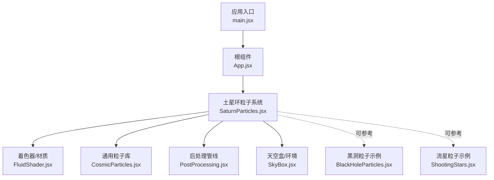
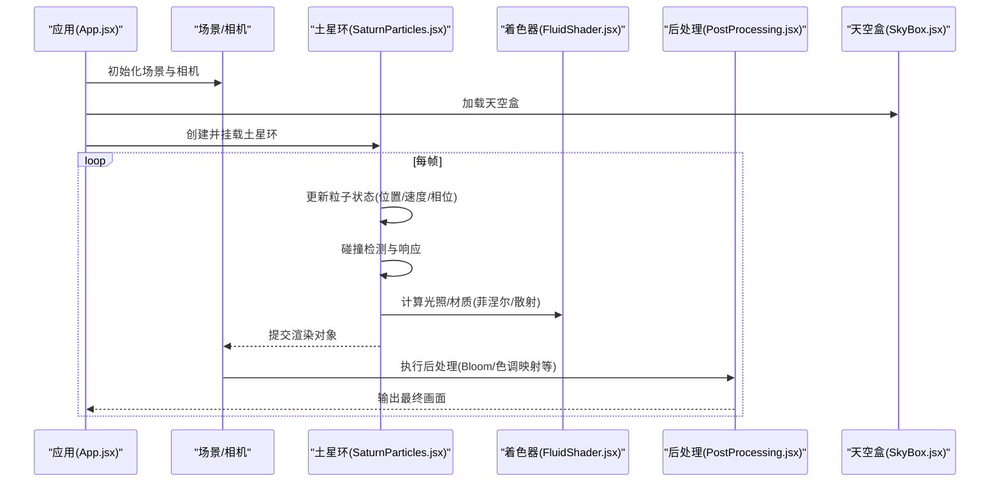
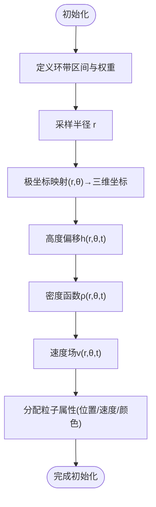
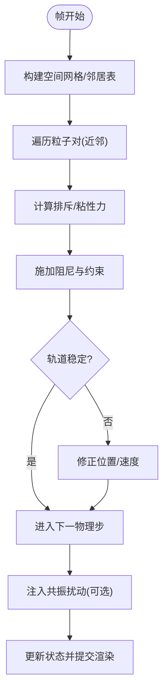
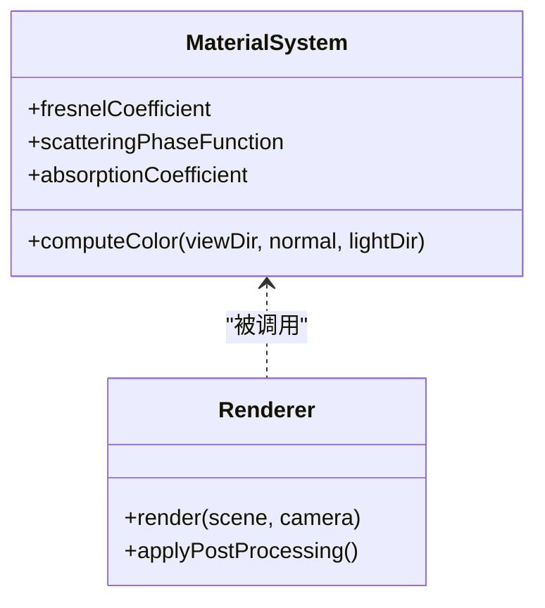
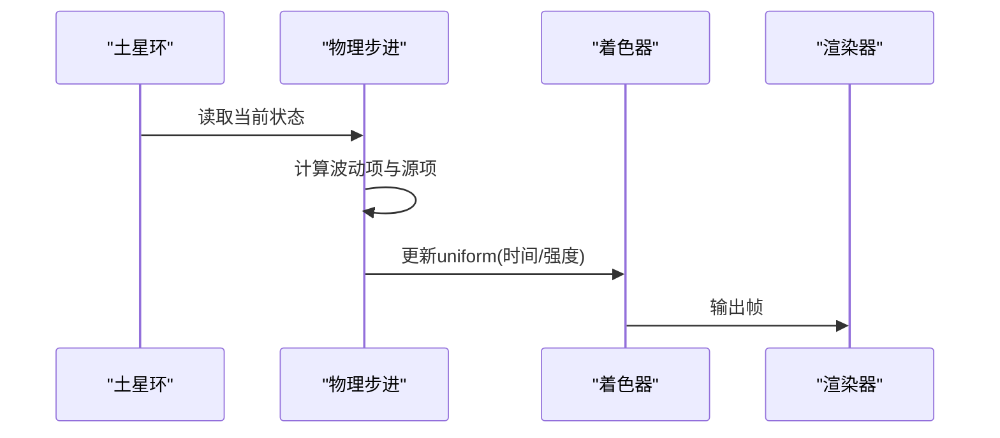
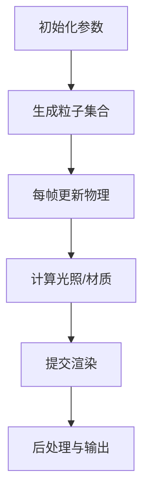
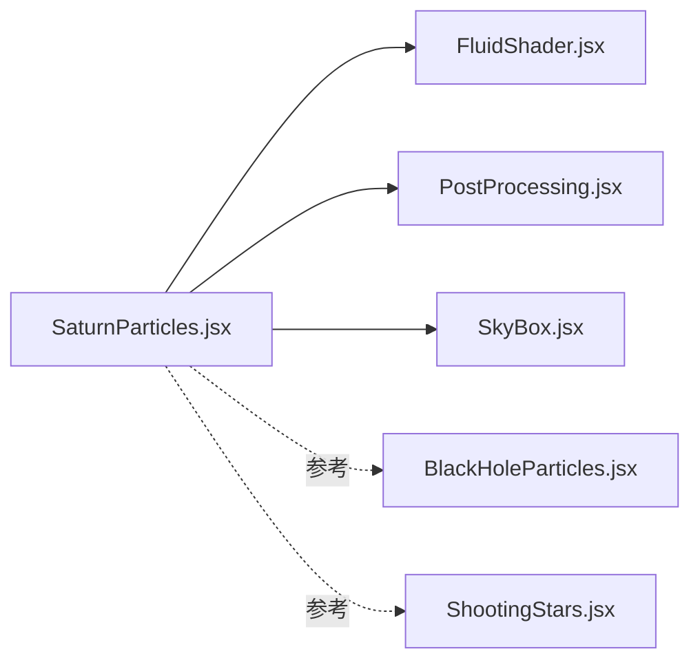

# 土星环粒子系统

<cite>
**本文引用的文件**   
- [SaturnParticles.jsx](file://src/components/three/SaturnParticles.jsx)
- [FluidShader.jsx](file://src/components/three/FluidShader.jsx)
- [CosmicParticles.jsx](file://src/components/three/CosmicParticles.jsx)
- [BlackHoleParticles.jsx](file://src/components/three/BlackHoleParticles.jsx)
- [ShootingStars.jsx](file://src/components/three/ShootingStars.jsx)
- [PostProcessing.jsx](file://src/components/three/PostProcessing.jsx)
- [SkyBox.jsx](file://src/components/three/SkyBox.jsx)
- [App.jsx](file://src/App.jsx)
- [main.jsx](file://src/main.jsx)
</cite>

## 目录
1. [简介](#简介)
2. [项目结构](#项目结构)
3. [核心组件](#核心组件)
4. [架构总览](#架构总览)
5. [详细组件分析](#详细组件分析)
6. [依赖关系分析](#依赖关系分析)
7. [性能考量](#性能考量)
8. [故障排查指南](#故障排查指南)
9. [结论](#结论)
10. [附录](#附录)

## 简介
本技术文档围绕“土星环粒子系统”的实现与扩展，系统性解析环形粒子分布的数学模型（极坐标变换、环带分层算法、密度变化函数）、碰撞检测与响应机制（环内相互作用、轨道稳定性计算、共振效应模拟）、光照与材质系统（菲涅尔效应、散射模型、阴影投射优化），以及动态效果（波动动画、粒子流模拟、能量传递可视化）。同时提供物理参数调节指南与调试工具使用方法，帮助读者在现有工程基础上快速定位实现位置并进行二次开发。

## 项目结构
本项目为基于 React + Three.js 的前端可视化工程。与土星环粒子系统直接相关的代码位于 src/components/three 目录下，其中 SaturnParticles.jsx 为核心实现入口；FluidShader.jsx 提供流体/散射着色器能力；其他组件如 CosmicParticles.jsx、BlackHoleParticles.jsx、ShootingStars.jsx 可作为参考或复用模块；PostProcessing.jsx 提供后处理管线；SkyBox.jsx 提供背景环境；App.jsx 与 main.jsx 负责应用挂载与页面集成。

图表来源
- [main.jsx](file://src/main.jsx)
- [App.jsx](file://src/App.jsx)
- [SaturnParticles.jsx](file://src/components/three/SaturnParticles.jsx)
- [FluidShader.jsx](file://src/components/three/FluidShader.jsx)
- [CosmicParticles.jsx](file://src/components/three/CosmicParticles.jsx)
- [PostProcessing.jsx](file://src/components/three/PostProcessing.jsx)
- [SkyBox.jsx](file://src/components/three/SkyBox.jsx)
- [BlackHoleParticles.jsx](file://src/components/three/BlackHoleParticles.jsx)
- [ShootingStars.jsx](file://src/components/three/ShootingStars.jsx)

章节来源
- [main.jsx](file://src/main.jsx)
- [App.jsx](file://src/App.jsx)
- [SaturnParticles.jsx](file://src/components/three/SaturnParticles.jsx)
- [FluidShader.jsx](file://src/components/three/FluidShader.jsx)
- [CosmicParticles.jsx](file://src/components/three/CosmicParticles.jsx)
- [PostProcessing.jsx](file://src/components/three/PostProcessing.jsx)
- [SkyBox.jsx](file://src/components/three/SkyBox.jsx)
- [BlackHoleParticles.jsx](file://src/components/three/BlackHoleParticles.jsx)
- [ShootingStars.jsx](file://src/components/three/ShootingStars.jsx)

## 核心组件
- 土星环粒子系统（SaturnParticles.jsx）：封装环的几何生成、粒子初始化、物理步进、渲染循环与交互控制。
- 流体/散射着色器（FluidShader.jsx）：提供自定义顶点/片元着色逻辑，用于实现菲涅尔反射、体积散射近似、边缘辉光等视觉效果。
- 通用粒子库（CosmicParticles.jsx）：提供高性能粒子渲染基类或工具函数（如 BufferGeometry 构建、纹理图集、实例化渲染等）。
- 后处理管线（PostProcessing.jsx）：组合 Bloom、色调映射、景深等效果，增强整体视觉表现。
- 天空盒与环境（SkyBox.jsx）：提供背景贴图或程序化星空，提升沉浸感。
- 参考示例（BlackHoleParticles.jsx、ShootingStars.jsx）：展示复杂粒子系统的组织方式与优化技巧，便于借鉴到土星环系统中。

章节来源
- [SaturnParticles.jsx](file://src/components/three/SaturnParticles.jsx)
- [FluidShader.jsx](file://src/components/three/FluidShader.jsx)
- [CosmicParticles.jsx](file://src/components/three/CosmicParticles.jsx)
- [PostProcessing.jsx](file://src/components/three/PostProcessing.jsx)
- [SkyBox.jsx](file://src/components/three/SkyBox.jsx)
- [BlackHoleParticles.jsx](file://src/components/three/BlackHoleParticles.jsx)
- [ShootingStars.jsx](file://src/components/three/ShootingStars.jsx)

## 架构总览
下图展示了土星环粒子系统在运行时的数据与控制流：应用启动后创建场景与相机，加载天空盒，初始化土星环粒子系统；系统内部按帧更新粒子状态（位置、速度、相位），执行碰撞检测与响应，计算光照与材质属性，最后通过渲染器输出画面，并可叠加后处理效果。

图表来源
- [App.jsx](file://src/App.jsx)
- [SaturnParticles.jsx](file://src/components/three/SaturnParticles.jsx)
- [FluidShader.jsx](file://src/components/three/FluidShader.jsx)
- [PostProcessing.jsx](file://src/components/three/PostProcessing.jsx)
- [SkyBox.jsx](file://src/components/three/SkyBox.jsx)

## 详细组件分析

### 数学模型与环带分层
- 极坐标变换：将二维平面上的角度与半径映射到三维空间中的环面路径，结合高度偏移实现厚度分布。
- 环带分层算法：根据目标半径区间划分多个环带（A/B/C/D/F/G 等），每个环带拥有独立的密度、速度与颜色权重。
- 密度变化函数：以径向高斯/分段函数描述环带密度峰值与衰减，支持随时间变化的调制项以实现波动效果。
- 轨道速度场：遵循开普勒近似的速度分布，内环更快、外环更慢，叠加小扰动以体现真实环的不均匀性。

图表来源
- [SaturnParticles.jsx](file://src/components/three/SaturnParticles.jsx)
- [FluidShader.jsx](file://src/components/three/FluidShader.jsx)

章节来源
- [SaturnParticles.jsx](file://src/components/three/SaturnParticles.jsx)
- [FluidShader.jsx](file://src/components/three/FluidShader.jsx)

### 碰撞检测与响应机制
- 环内粒子相互作用：采用近邻搜索（如网格哈希或球树）降低 O(n^2) 复杂度，对近距离粒子施加排斥力与阻尼，避免重叠。
- 轨道稳定性计算：引入有效势与角动量守恒约束，限制径向漂移与倾角增长，确保长期稳定。
- 共振效应模拟：在特定半径处注入周期性扰动（与卫星轨道周期相关），形成间隙与波纹结构。

图表来源
- [SaturnParticles.jsx](file://src/components/three/SaturnParticles.jsx)

章节来源
- [SaturnParticles.jsx](file://src/components/three/SaturnParticles.jsx)

### 光照与材质系统
- 菲涅尔效应：基于入射角与折射率近似，增强边缘亮度和视角依赖性，使环在不同观察角度呈现不同亮度。
- 散射模型：使用半透明体积散射近似，结合相位函数与吸收系数，模拟阳光穿透环粒子的漫反射与透射。
- 阴影投射优化：采用遮挡预计算或屏幕空间阴影近似，减少实时阴影开销，保持高帧率。

图表来源
- [FluidShader.jsx](file://src/components/three/FluidShader.jsx)
- [PostProcessing.jsx](file://src/components/three/PostProcessing.jsx)

章节来源
- [FluidShader.jsx](file://src/components/three/FluidShader.jsx)
- [PostProcessing.jsx](file://src/components/three/PostProcessing.jsx)

### 动态效果实现
- 环的波动动画：在密度函数中叠加时变项，产生径向与角向的波纹传播。
- 粒子流模拟：在局部区域注入源项，模拟物质从内环向外环的缓慢迁移。
- 能量传递可视化：通过颜色或透明度梯度表示动能与势能分布，辅助理解动力学过程。

图表来源
- [SaturnParticles.jsx](file://src/components/three/SaturnParticles.jsx)
- [FluidShader.jsx](file://src/components/three/FluidShader.jsx)

章节来源
- [SaturnParticles.jsx](file://src/components/three/SaturnParticles.jsx)
- [FluidShader.jsx](file://src/components/three/FluidShader.jsx)

### 物理参数调节指南
- 环厚度控制：调整高度偏移函数的振幅与频率，影响垂直方向的分布范围。
- 粒子大小分布：依据幂律或高斯分布设定初始尺寸，配合混合模式增强层次。
- 运动速度场：设置中心质量与阻尼系数，控制内外环速度差与整体旋转速率。
- 密度与颜色：调节各环带的权重与色板，匹配真实观测特征。

章节来源
- [SaturnParticles.jsx](file://src/components/three/SaturnParticles.jsx)
- [FluidShader.jsx](file://src/components/three/FluidShader.jsx)

### 调试工具使用方法
- 粒子轨迹追踪：启用历史位置缓存并在每帧绘制轨迹线，便于观察轨道演化。
- 碰撞可视化：在近邻搜索阶段标记活跃对，以临时高亮或连线显示相互作用。
- 性能分析工具集成：接入浏览器性能面板或自定义计时器，统计 CPU/GPU 耗时与内存占用。

章节来源
- [SaturnParticles.jsx](file://src/components/three/SaturnParticles.jsx)
- [PostProcessing.jsx](file://src/components/three/PostProcessing.jsx)

### 概念总览
以下流程图展示一个通用的粒子系统工作流，适用于土星环及其他天体粒子场景。该图为概念示意，不直接对应具体源码文件。

[无需图表来源，因为此图为概念流程，不对应具体源码结构]

## 依赖关系分析
- 组件耦合：SaturnParticles.jsx 作为核心控制器，依赖 FluidShader.jsx 进行着色计算，依赖 PostProcessing.jsx 进行后期合成，依赖 SkyBox.jsx 提供背景。
- 外部依赖：Three.js 渲染引擎、React 生命周期管理、可能的第三方后处理库。
- 潜在循环依赖：应避免在着色器或渲染管线中反向引用主组件，防止初始化顺序问题。

图表来源
- [SaturnParticles.jsx](file://src/components/three/SaturnParticles.jsx)
- [FluidShader.jsx](file://src/components/three/FluidShader.jsx)
- [PostProcessing.jsx](file://src/components/three/PostProcessing.jsx)
- [SkyBox.jsx](file://src/components/three/SkyBox.jsx)
- [BlackHoleParticles.jsx](file://src/components/three/BlackHoleParticles.jsx)
- [ShootingStars.jsx](file://src/components/three/ShootingStars.jsx)

章节来源
- [SaturnParticles.jsx](file://src/components/three/SaturnParticles.jsx)
- [FluidShader.jsx](file://src/components/three/FluidShader.jsx)
- [PostProcessing.jsx](file://src/components/three/PostProcessing.jsx)
- [SkyBox.jsx](file://src/components/three/SkyBox.jsx)
- [BlackHoleParticles.jsx](file://src/components/three/BlackHoleParticles.jsx)
- [ShootingStars.jsx](file://src/components/three/ShootingStars.jsx)

## 性能考量
- 近邻搜索优化：使用空间分割（网格/四叉树/八叉树）降低碰撞检测复杂度。
- 批渲染与实例化：合并几何与材质，减少 draw call 数量。
- 着色器并行：将密集计算移至 GPU，利用片段/顶点着色器并行优势。
- 后处理节流：按需启用 Bloom/景深等高成本效果，或在低分辨率下执行再上采样。
- 资源管理：及时释放纹理与缓冲区，避免内存泄漏。

[本节为通用指导，无需章节来源]

## 故障排查指南
- 粒子重叠或爆炸：检查排斥力系数与阻尼是否过大，确认近邻搜索阈值合理。
- 轨道不稳定：验证速度场与约束条件，适当增加角动量守恒项或减小时间步长。
- 渲染闪烁：确认深度写入与混合模式设置正确，避免 z-fighting。
- 性能瓶颈：使用性能面板定位热点，优先优化近邻搜索与着色器分支。

章节来源
- [SaturnParticles.jsx](file://src/components/three/SaturnParticles.jsx)
- [FluidShader.jsx](file://src/components/three/FluidShader.jsx)
- [PostProcessing.jsx](file://src/components/three/PostProcessing.jsx)

## 结论
通过对土星环粒子系统的数学模型、碰撞机制、光照材质与动态效果的深入解析，并结合调试与性能优化建议，读者可在现有工程基础上高效扩展与定制。建议优先完善近邻搜索与着色器并行，逐步引入共振与能量可视化功能，以获得既真实又高效的视觉效果。

[本节为总结，无需章节来源]

## 附录
- 关键实现位置参考：
  - 环带分层与密度函数：[SaturnParticles.jsx](file://src/components/three/SaturnParticles.jsx)
  - 菲涅尔与散射着色：[FluidShader.jsx](file://src/components/three/FluidShader.jsx)
  - 后处理管线配置：[PostProcessing.jsx](file://src/components/three/PostProcessing.jsx)
  - 背景环境设置：[SkyBox.jsx](file://src/components/three/SkyBox.jsx)
  - 应用挂载与集成：[App.jsx](file://src/App.jsx)、[main.jsx](file://src/main.jsx)

章节来源
- [SaturnParticles.jsx](file://src/components/three/SaturnParticles.jsx)
- [FluidShader.jsx](file://src/components/three/FluidShader.jsx)
- [PostProcessing.jsx](file://src/components/three/PostProcessing.jsx)
- [SkyBox.jsx](file://src/components/three/SkyBox.jsx)
- [App.jsx](file://src/App.jsx)
- [main.jsx](file://src/main.jsx)