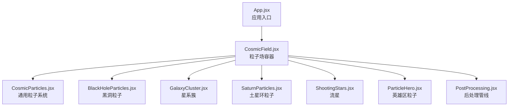
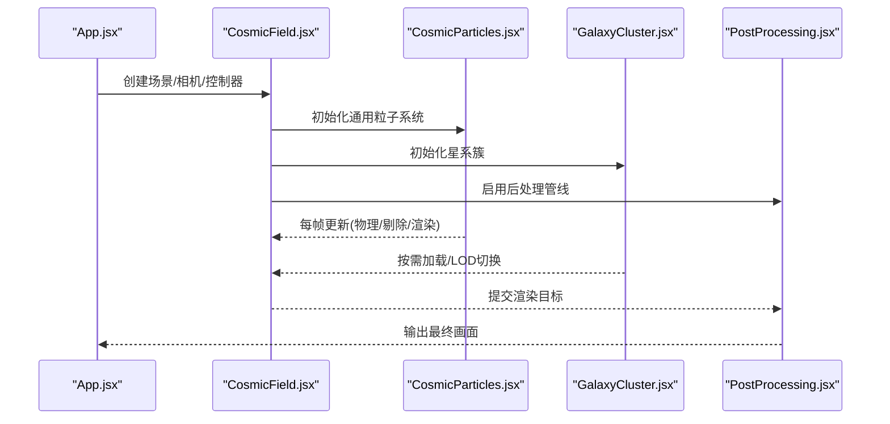
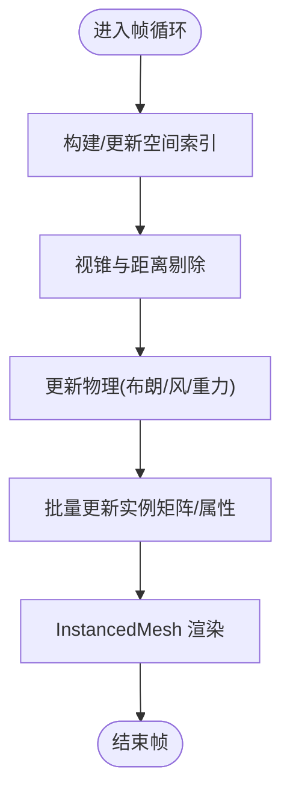
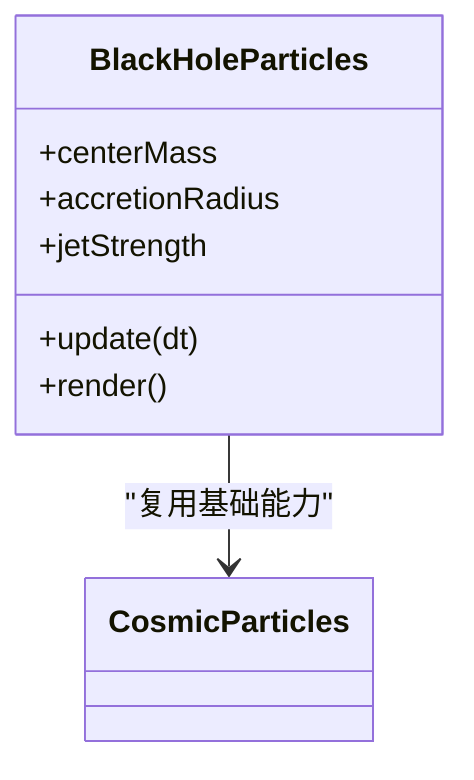
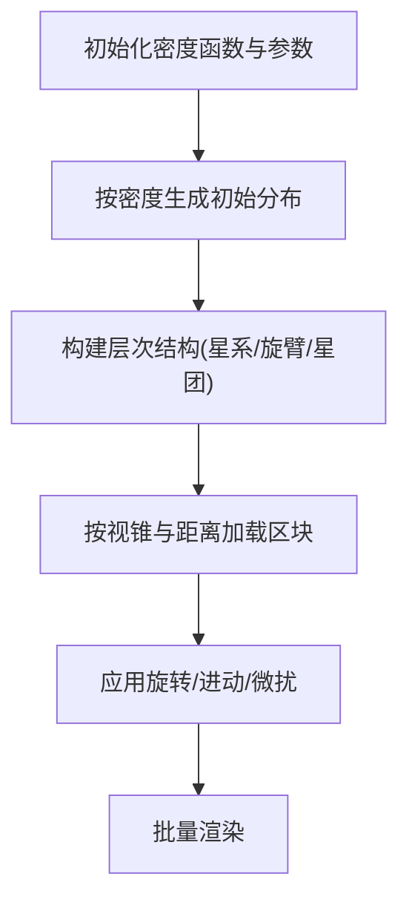
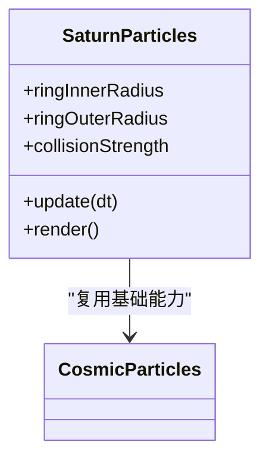
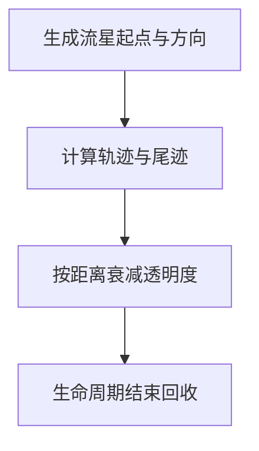
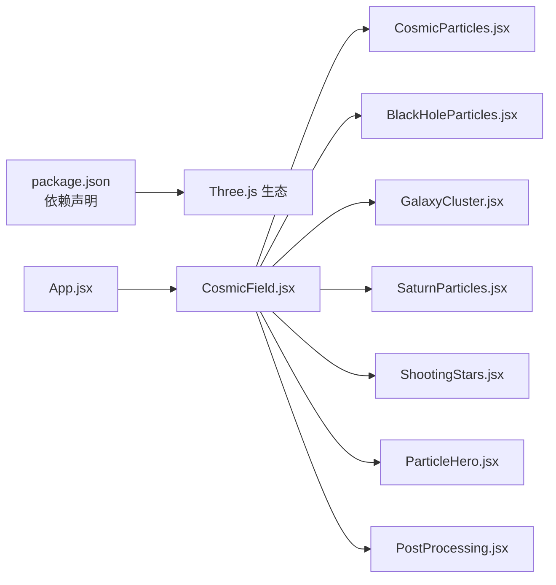

# 宇宙粒子场

<cite>
**本文引用的文件**   
- [src/components/three/CosmicField.jsx](file://src/components/three/CosmicField.jsx)
- [src/components/three/CosmicParticles.jsx](file://src/components/three/CosmicParticles.jsx)
- [src/components/three/BlackHoleParticles.jsx](file://src/components/three/BlackHoleParticles.jsx)
- [src/components/three/GalaxyCluster.jsx](file://src/components/three/GalaxyCluster.jsx)
- [src/components/three/SaturnParticles.jsx](file://src/components/three/SaturnParticles.jsx)
- [src/components/three/ShootingStars.jsx](file://src/components/three/ShootingStars.jsx)
- [src/components/three/ParticleHero.jsx](file://src/components/three/ParticleHero.jsx)
- [src/components/three/PostProcessing.jsx](file://src/components/three/PostProcessing.jsx)
- [src/App.jsx](file://src/App.jsx)
- [package.json](file://package.json)
</cite>

## 目录
1. [简介](#简介)
2. [项目结构](#项目结构)
3. [核心组件](#核心组件)
4. [架构总览](#架构总览)
5. [详细组件分析](#详细组件分析)
6. [依赖关系分析](#依赖关系分析)
7. [性能考量](#性能考量)
8. [故障排查指南](#故障排查指南)
9. [结论](#结论)
10. [附录](#附录)

## 简介
本技术文档围绕“宇宙粒子场”主题，系统化解析大规模粒子系统的架构设计与实现要点。内容覆盖空间分割与视锥剔除、动态加载、粒子生成算法（随机分布、密度函数控制、层次组织）、动画系统（布朗运动、风场、重力场）、GPU加速渲染（InstancedMesh、纹理图集、批处理策略），以及性能监控与调优方法（FPS、内存占用、绘制调用优化）。同时提供自定义粒子场的配置指南，帮助快速搭建不同星系的粒子分布模式与视觉效果。

## 项目结构
本项目采用基于功能的组件化组织方式，Three.js 相关可视化组件集中在 src/components/three 下，应用入口在 src/App.jsx，依赖管理通过 package.json 维护。

图表来源
- [src/App.jsx](file://src/App.jsx)
- [src/components/three/CosmicField.jsx](file://src/components/three/CosmicField.jsx)
- [src/components/three/CosmicParticles.jsx](file://src/components/three/CosmicParticles.jsx)
- [src/components/three/BlackHoleParticles.jsx](file://src/components/three/BlackHoleParticles.jsx)
- [src/components/three/GalaxyCluster.jsx](file://src/components/three/GalaxyCluster.jsx)
- [src/components/three/SaturnParticles.jsx](file://src/components/three/SaturnParticles.jsx)
- [src/components/three/ShootingStars.jsx](file://src/components/three/ShootingStars.jsx)
- [src/components/three/ParticleHero.jsx](file://src/components/three/ParticleHero.jsx)
- [src/components/three/PostProcessing.jsx](file://src/components/three/PostProcessing.jsx)

章节来源
- [src/App.jsx](file://src/App.jsx)
- [package.json](file://package.json)

## 核心组件
- CosmicField：作为场景容器，负责初始化 Three.js 环境、相机、控制器、后处理管线，并挂载各类粒子子系统。
- CosmicParticles：通用粒子系统，封装 InstancedMesh 批量渲染、空间索引（如八叉树/网格）、视锥剔除、物理更新（布朗运动、风场、重力场）等。
- BlackHoleParticles：黑洞吸积盘与喷流粒子，强调向心引力与旋转剪切效果。
- GalaxyCluster：多星系聚合体，按密度函数分层布局，支持 LOD 与动态加载。
- SaturnParticles：行星环粒子，侧重轨道动力学与碰撞避让。
- ShootingStars：流星轨迹，使用尾迹与衰减着色器增强视觉。
- ParticleHero：首屏粒子背景，强调低开销与高帧率。
- PostProcessing：后处理（如泛光、景深、色调映射），提升整体观感。

章节来源
- [src/components/three/CosmicField.jsx](file://src/components/three/CosmicField.jsx)
- [src/components/three/CosmicParticles.jsx](file://src/components/three/CosmicParticles.jsx)
- [src/components/three/BlackHoleParticles.jsx](file://src/components/three/BlackHoleParticles.jsx)
- [src/components/three/GalaxyCluster.jsx](file://src/components/three/GalaxyCluster.jsx)
- [src/components/three/SaturnParticles.jsx](file://src/components/three/SaturnParticles.jsx)
- [src/components/three/ShootingStars.jsx](file://src/components/three/ShootingStars.jsx)
- [src/components/three/ParticleHero.jsx](file://src/components/three/ParticleHero.jsx)
- [src/components/three/PostProcessing.jsx](file://src/components/three/PostProcessing.jsx)

## 架构总览
下图展示从应用入口到各粒子子系统的装配关系，以及后处理对最终画面的影响。

图表来源
- [src/App.jsx](file://src/App.jsx)
- [src/components/three/CosmicField.jsx](file://src/components/three/CosmicField.jsx)
- [src/components/three/CosmicParticles.jsx](file://src/components/three/CosmicParticles.jsx)
- [src/components/three/GalaxyCluster.jsx](file://src/components/three/GalaxyCluster.jsx)
- [src/components/three/PostProcessing.jsx](file://src/components/three/PostProcessing.jsx)

## 详细组件分析

### 通用粒子系统（CosmicParticles）
- 空间分割与视锥剔除
  - 使用空间索引（八叉树或均匀网格）将粒子分组，仅对可见区域进行更新与渲染。
  - 结合相机视锥与距离阈值，剔除不可见实例，降低 CPU 计算与 GPU 传输压力。
- 批量渲染与批处理策略
  - 使用 InstancedMesh 合并绘制调用，减少 draw call。
  - 纹理图集打包多种粒子贴图，避免多次纹理绑定。
- 动画与物理
  - 布朗运动：引入随机扰动项，模拟热噪声导致的无规则位移。
  - 风场：叠加全局或局部向量场，随时间变化产生漂移。
  - 重力场：中心质量点施加向心力，支持多源叠加与屏蔽半径。
- 动态加载与 LOD
  - 根据相机距离与重要性评分，动态加载/卸载高密度区域。
  - 多级细节（LOD）切换，远距离使用简化几何与更低采样率。

图表来源
- [src/components/three/CosmicParticles.jsx](file://src/components/three/CosmicParticles.jsx)

章节来源
- [src/components/three/CosmicParticles.jsx](file://src/components/three/CosmicParticles.jsx)

### 黑洞粒子（BlackHoleParticles）
- 向心引力与角动量守恒：粒子靠近中心时速度增加，形成吸积盘形态。
- 剪切与湍流：径向梯度速度场叠加随机扰动，模拟吸积盘不稳定。
- 喷流方向性：沿极轴方向施加定向力，形成双极喷流视觉效果。

图表来源
- [src/components/three/BlackHoleParticles.jsx](file://src/components/three/BlackHoleParticles.jsx)
- [src/components/three/CosmicParticles.jsx](file://src/components/three/CosmicParticles.jsx)

章节来源
- [src/components/three/BlackHoleParticles.jsx](file://src/components/three/BlackHoleParticles.jsx)

### 星系簇（GalaxyCluster）
- 密度函数控制：使用核函数（如高斯或幂律）定义空间密度，控制恒星/星云聚集程度。
- 层次结构组织：按层级划分（星系→旋臂→星团→粒子），便于 LOD 与动态加载。
- 动态加载机制：依据相机位置与视锥，分块加载/卸载，保持内存稳定。

图表来源
- [src/components/three/GalaxyCluster.jsx](file://src/components/three/GalaxyCluster.jsx)

章节来源
- [src/components/three/GalaxyCluster.jsx](file://src/components/three/GalaxyCluster.jsx)

### 土星环粒子（SaturnParticles）
- 轨道动力学：粒子近似遵循开普勒轨道，内快外慢，形成清晰环带。
- 碰撞避让：局部排斥力防止粒子重叠，维持环的厚度与稳定性。
- 光照与阴影：考虑光源方向与遮挡，增强立体感。

图表来源
- [src/components/three/SaturnParticles.jsx](file://src/components/three/SaturnParticles.jsx)
- [src/components/three/CosmicParticles.jsx](file://src/components/three/CosmicParticles.jsx)

章节来源
- [src/components/three/SaturnParticles.jsx](file://src/components/three/SaturnParticles.jsx)

### 流星（ShootingStars）
- 轨迹生成：沿直线或曲线路径生成前导头与拖尾，尾部透明度随距离衰减。
- 闪烁与色散：加入随机亮度波动与颜色偏移，增强真实感。
- 生命周期管理：自动回收与池化，避免频繁分配与销毁。

图表来源
- [src/components/three/ShootingStars.jsx](file://src/components/three/ShootingStars.jsx)

章节来源
- [src/components/three/ShootingStars.jsx](file://src/components/three/ShootingStars.jsx)

### 英雄区粒子（ParticleHero）
- 轻量级背景：减少粒子数量与复杂度，确保首屏加载速度与交互流畅。
- 简单物理：弱风场与微弱布朗运动，营造柔和氛围。
- 低开销渲染：合并材质与纹理，最小化状态切换。

章节来源
- [src/components/three/ParticleHero.jsx](file://src/components/three/ParticleHero.jsx)

### 后处理（PostProcessing）
- 常用效果：泛光（Bloom）、景深（DOF）、色调映射（Tone Mapping）、抗锯齿（AA）。
- 管线顺序：渲染目标→后处理链→屏幕输出，注意分辨率与采样数平衡。
- 性能权衡：在高 DPI 设备上谨慎开启高分辨率后处理。

章节来源
- [src/components/three/PostProcessing.jsx](file://src/components/three/PostProcessing.jsx)

## 依赖关系分析
- 运行时依赖：Three.js 生态库（如 postprocessing、OrbitControls 等）由 package.json 声明。
- 组件耦合：CosmicField 作为装配器，组合多个子系统；CosmicParticles 提供通用能力被其他子系统复用。
- 外部资源：纹理图集、模型与着色器需预加载，避免运行时卡顿。

图表来源
- [package.json](file://package.json)
- [src/App.jsx](file://src/App.jsx)
- [src/components/three/CosmicField.jsx](file://src/components/three/CosmicField.jsx)
- [src/components/three/CosmicParticles.jsx](file://src/components/three/CosmicParticles.jsx)
- [src/components/three/BlackHoleParticles.jsx](file://src/components/three/BlackHoleParticles.jsx)
- [src/components/three/GalaxyCluster.jsx](file://src/components/three/GalaxyCluster.jsx)
- [src/components/three/SaturnParticles.jsx](file://src/components/three/SaturnParticles.jsx)
- [src/components/three/ShootingStars.jsx](file://src/components/three/ShootingStars.jsx)
- [src/components/three/ParticleHero.jsx](file://src/components/three/ParticleHero.jsx)
- [src/components/three/PostProcessing.jsx](file://src/components/three/PostProcessing.jsx)

章节来源
- [package.json](file://package.json)
- [src/App.jsx](file://src/App.jsx)

## 性能考量
- 绘制调用优化
  - 使用 InstancedMesh 合并同类对象，减少 draw call。
  - 纹理图集减少纹理切换与绑定次数。
- 内存与带宽
  - 动态加载/卸载分区数据，控制峰值内存。
  - 压缩纹理与合理 mipmaps，降低显存占用。
- 计算负载
  - 空间索引与视锥剔除减少无效计算。
  - 物理步长与精度可调，移动端适当降低。
- 后处理
  - 控制分辨率与采样数，必要时降级效果。
- 监控指标
  - FPS：关注最低帧与抖动。
  - 内存：跟踪显存与堆内存增长。
  - 绘制调用：统计 draw call 与批次合并效率。

[本节为通用指导，不直接分析具体文件]

## 故障排查指南
- 常见问题定位
  - 卡顿：检查是否未启用视锥剔除或空间索引失效。
  - 掉帧：确认 InstancedMesh 批次是否过大，尝试拆分或降低粒子密度。
  - 内存泄漏：核查动态加载/卸载逻辑是否正确释放引用。
  - 后处理异常：检查渲染目标尺寸与格式是否与设备兼容。
- 调试建议
  - 使用浏览器开发者工具的性能面板记录帧时间与内存快照。
  - 逐步关闭后处理效果，定位瓶颈模块。
  - 降低粒子数量与物理复杂度，验证是否为计算或渲染问题。

[本节为通用指导，不直接分析具体文件]

## 结论
通过模块化组件设计、空间分割与视锥剔除、InstancedMesh 批处理、纹理图集与后处理管线的协同，本项目实现了高性能的宇宙粒子场。配合动态加载与 LOD，可在不同设备上取得良好的视觉与性能平衡。建议在生产环境中持续监控关键指标，并根据平台特性调整参数以获得最佳体验。

[本节为总结性内容，不直接分析具体文件]

## 附录

### 自定义粒子场配置指南
- 分布模式
  - 均匀分布：适用于背景星空，密度恒定。
  - 高斯聚集：用于星团或星云核心，中心密度高、边缘渐淡。
  - 幂律分布：适合星系盘与环带，体现内外差异。
- 密度函数控制
  - 调节核函数宽度与强度，控制聚集程度与平滑度。
  - 叠加多层密度函数，形成复杂结构（如旋臂与暗带）。
- 层次结构组织
  - 按尺度分层（星系→旋臂→星团→粒子），便于管理与优化。
- 视觉效果调节
  - 颜色与大小：按距离或速度映射，增强深度感。
  - 透明度与混合：使用加法或正常混合，营造发光或柔和效果。
  - 动画参数：布朗强度、风场向量、重力常数可按场景需求微调。

[本节为概念性说明，不直接分析具体文件]