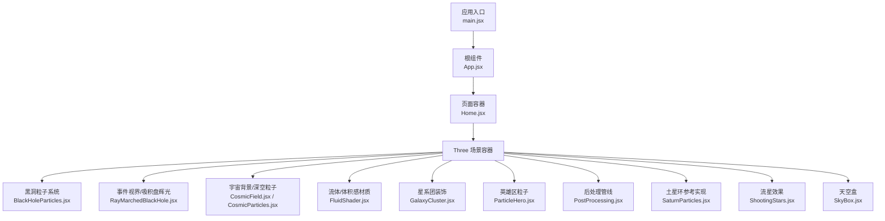
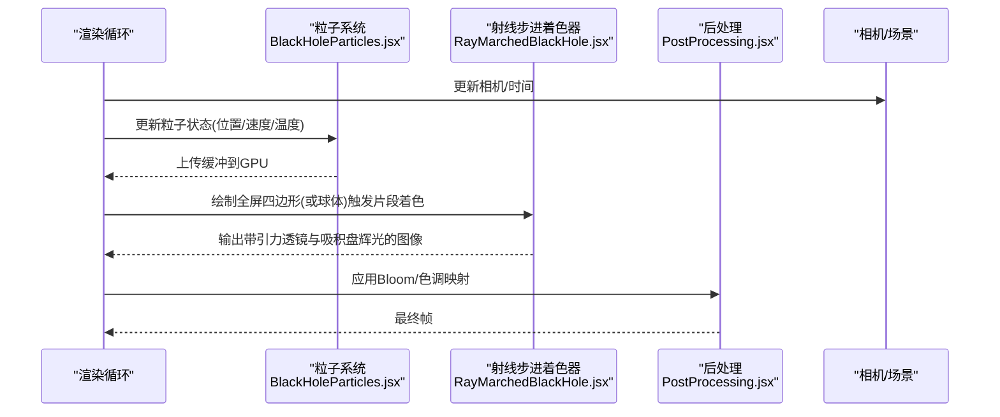
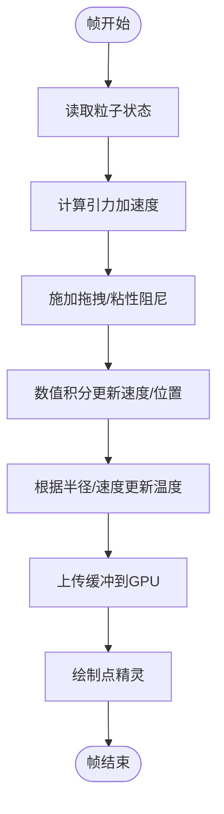
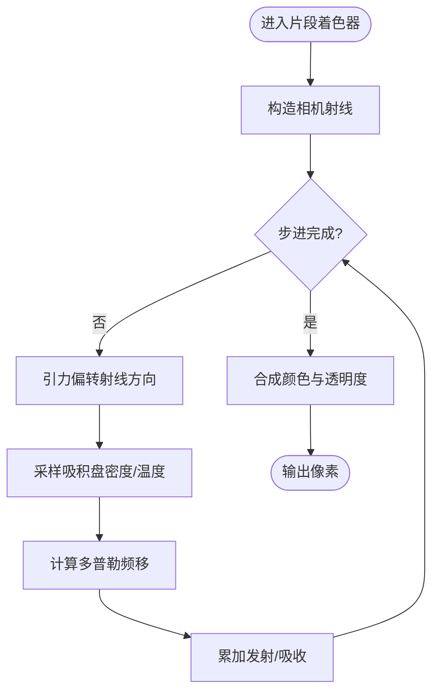
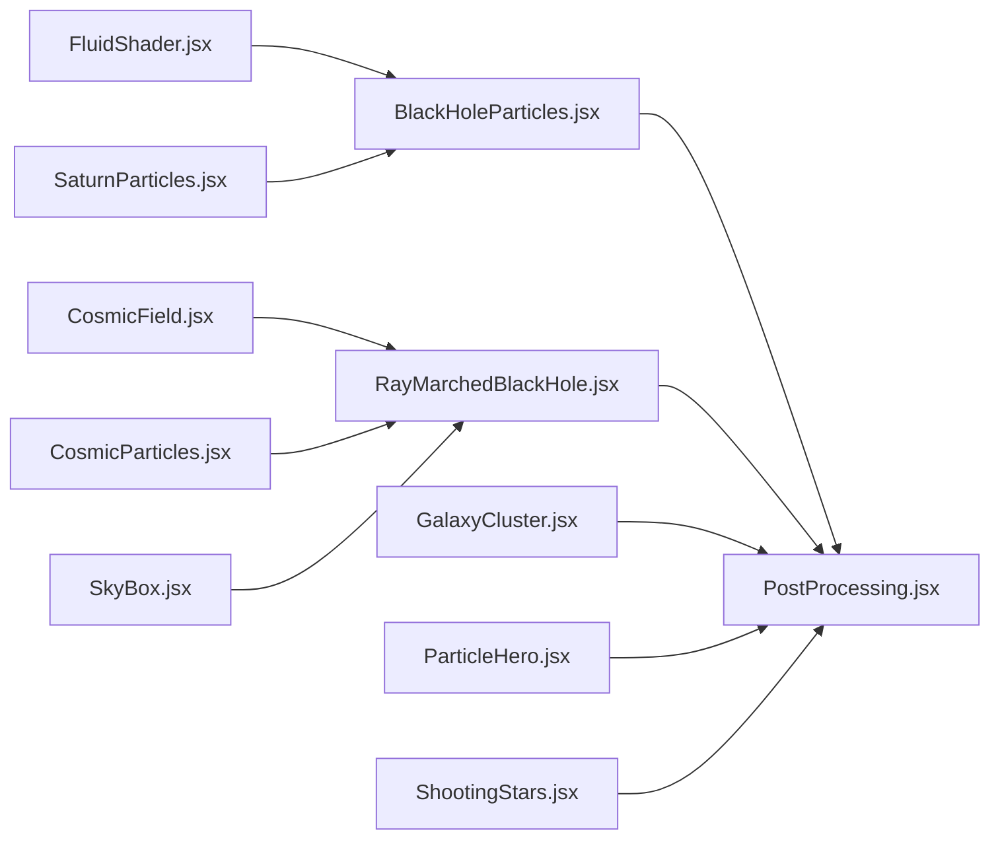

# 黑洞粒子效果

<cite>
**本文引用的文件**   
- [BlackHoleParticles.jsx](file://src/components/three/BlackHoleParticles.jsx)
- [RayMarchedBlackHole.jsx](file://src/components/three/RayMarchedBlackHole.jsx)
- [CosmicField.jsx](file://src/components/three/CosmicField.jsx)
- [CosmicParticles.jsx](file://src/components/three/CosmicParticles.jsx)
- [FluidShader.jsx](file://src/components/three/FluidShader.jsx)
- [GalaxyCluster.jsx](file://src/components/three/GalaxyCluster.jsx)
- [ParticleHero.jsx](file://src/components/three/ParticleHero.jsx)
- [PostProcessing.jsx](file://src/components/three/PostProcessing.jsx)
- [SaturnParticles.jsx](file://src/components/three/SaturnParticles.jsx)
- [ShootingStars.jsx](file://src/components/three/ShootingStars.jsx)
- [SkyBox.jsx](file://src/components/three/SkyBox.jsx)
- [App.jsx](file://src/App.jsx)
- [Home.jsx](file://src/Home.jsx)
- [main.jsx](file://src/main.jsx)
</cite>

## 目录
1. [简介](#简介)
2. [项目结构](#项目结构)
3. [核心组件](#核心组件)
4. [架构总览](#架构总览)
5. [详细组件分析](#详细组件分析)
6. [依赖关系分析](#依赖关系分析)
7. [性能考虑](#性能考虑)
8. [故障排查指南](#故障排查指南)
9. [结论](#结论)
10. [附录](#附录)

## 简介
本技术文档围绕“黑洞粒子效果”的实现与优化展开，聚焦以下目标：
- 吸积盘粒子的数学模型与物理模拟（引力场、轨道运动、拖拽效应）
- GPU 粒子渲染管线（顶点着色器位置计算、颜色渐变、透明度控制）
- 事件视界视觉效果（光线弯曲、多普勒效应、红移蓝移）
- 性能优化策略（粒子数量控制、LOD、内存池复用）
- 参数化示例（质量、旋转速度、吸积率等对视觉的影响）

本项目基于 React + Three.js 生态构建，核心实现位于 src/components/three 下的多个组件中。

## 项目结构
与黑洞粒子效果直接相关的代码集中在 three 子目录，主要包含：
- 粒子系统与吸积盘模拟
- 射线步进（Ray Marching）渲染的事件视界与吸积盘辉光
- 后处理与场景组合

图表来源
- [main.jsx](file://src/main.jsx)
- [App.jsx](file://src/App.jsx)
- [Home.jsx](file://src/Home.jsx)
- [BlackHoleParticles.jsx](file://src/components/three/BlackHoleParticles.jsx)
- [RayMarchedBlackHole.jsx](file://src/components/three/RayMarchedBlackHole.jsx)
- [CosmicField.jsx](file://src/components/three/CosmicField.jsx)
- [CosmicParticles.jsx](file://src/components/three/CosmicParticles.jsx)
- [FluidShader.jsx](file://src/components/three/FluidShader.jsx)
- [GalaxyCluster.jsx](file://src/components/three/GalaxyCluster.jsx)
- [ParticleHero.jsx](file://src/components/three/ParticleHero.jsx)
- [PostProcessing.jsx](file://src/components/three/PostProcessing.jsx)
- [SaturnParticles.jsx](file://src/components/three/SaturnParticles.jsx)
- [ShootingStars.jsx](file://src/components/three/ShootingStars.jsx)
- [SkyBox.jsx](file://src/components/three/SkyBox.jsx)

章节来源
- [main.jsx](file://src/main.jsx)
- [App.jsx](file://src/App.jsx)
- [Home.jsx](file://src/Home.jsx)

## 核心组件
- BlackHoleParticles.jsx：负责吸积盘粒子系统的初始化、更新与渲染，通常使用 BufferGeometry + Points 或自定义 ShaderMaterial 在 GPU 上执行位置与颜色计算。
- RayMarchedBlackHole.jsx：通过射线步进在片段着色器中模拟引力透镜、吸积盘自发光与热辐射分布，呈现事件视界阴影与边缘亮环。
- CosmicField.jsx / CosmicParticles.jsx：提供深空背景与稀疏粒子，增强空间深度感。
- FluidShader.jsx：为吸积盘或气体云提供体积/流体外观的着色器实现。
- PostProcessing.jsx：集成 Bloom、色调映射、色差等后处理，提升整体观感。
- SaturnParticles.jsx：可复用的环形粒子系统参考实现，有助于理解盘状结构的生成与动画。
- GalaxyCluster.jsx / ParticleHero.jsx / ShootingStars.jsx / SkyBox.jsx：辅助场景元素，丰富画面层次。

章节来源
- [BlackHoleParticles.jsx](file://src/components/three/BlackHoleParticles.jsx)
- [RayMarchedBlackHole.jsx](file://src/components/three/RayMarchedBlackHole.jsx)
- [CosmicField.jsx](file://src/components/three/CosmicField.jsx)
- [CosmicParticles.jsx](file://src/components/three/CosmicParticles.jsx)
- [FluidShader.jsx](file://src/components/three/FluidShader.jsx)
- [PostProcessing.jsx](file://src/components/three/PostProcessing.jsx)
- [SaturnParticles.jsx](file://src/components/three/SaturnParticles.jsx)
- [GalaxyCluster.jsx](file://src/components/three/GalaxyCluster.jsx)
- [ParticleHero.jsx](file://src/components/three/ParticleHero.jsx)
- [ShootingStars.jsx](file://src/components/three/ShootingStars.jsx)
- [SkyBox.jsx](file://src/components/three/SkyBox.jsx)

## 架构总览
从渲染管线角度，黑洞效果由“几何粒子层 + 射线步进层 + 后处理层”组成：
- 几何粒子层：在 CPU 或 GPU 上维护粒子状态（位置、速度、角动量、温度），每帧更新并上传至 GPU。
- 射线步进层：在片段着色器中对相机射线进行步进，累积吸积盘发射率与吸收率，叠加引力透镜偏移。
- 后处理层：Bloom 强化辉光，色调映射控制动态范围，可选色差增强边缘对比。

图表来源
- [BlackHoleParticles.jsx](file://src/components/three/BlackHoleParticles.jsx)
- [RayMarchedBlackHole.jsx](file://src/components/three/RayMarchedBlackHole.jsx)
- [PostProcessing.jsx](file://src/components/three/PostProcessing.jsx)

## 详细组件分析

### 吸积盘粒子系统（BlackHoleParticles.jsx）
- 数据模型
  - 粒子属性：位置、速度、角动量、半径、相位、温度、寿命、类型（内盘/外盘）。
  - 批量存储：使用 Float32Array 或 TypedArray 组织顶点与颜色缓冲，减少 CPU-GPU 同步开销。
- 物理模型
  - 引力场：中心质量产生向心加速度，近似牛顿引力；靠近事件视界时可引入相对论修正项以增强内盘动力学。
  - 轨道运动：根据当前速度与引力加速度积分得到下一时刻位置；可采用半隐式欧拉或 Verlet 提高稳定性。
  - 拖拽效应：引入径向阻尼与切向粘性，模拟吸积物质间的摩擦与能量耗散，使粒子向内迁移。
  - 温度演化：根据半径与耗散功率估算温度，用于颜色与透明度映射。
- 渲染逻辑
  - 顶点着色器：将世界坐标转换为裁剪空间；可按半径/速度缩放点大小，实现近大远小与速度相关尺寸。
  - 片元着色器：按温度映射黑体辐射色温曲线，结合距离衰减与视锥剔除控制透明度。
- 关键流程（伪流程图）

图表来源
- [BlackHoleParticles.jsx](file://src/components/three/BlackHoleParticles.jsx)

章节来源
- [BlackHoleParticles.jsx](file://src/components/three/BlackHoleParticles.jsx)

### 事件视界与吸积盘辉光（RayMarchedBlackHole.jsx）
- 射线步进
  - 对每条像素射线进行步进，沿路径累积吸积盘的发射率与吸收率，采用 Beer-Lambert 定律合成不透明介质。
  - 引力透镜：在步进过程中对射线方向施加偏转，模拟强引力场的光线弯曲，形成爱因斯坦环与阴影边界。
- 吸积盘模型
  - 密度分布：随半径递减的幂律分布，内盘更致密。
  - 温度分布：遵循 r^(-3/4) 类分布，内盘更热更亮，外盘较冷较暗。
  - 多普勒效应：根据局部流速与视线夹角进行频率偏移，朝向观测者的一侧蓝移，远离的一侧红移。
- 颜色与亮度
  - 黑体辐射近似：将温度映射到可见光谱，内盘偏蓝白，外盘偏橙红。
  - 自发光叠加：吸积盘作为面光源，与背景星空和散射光混合。
- 关键流程（伪流程图）

图表来源
- [RayMarchedBlackHole.jsx](file://src/components/three/RayMarchedBlackHole.jsx)

章节来源
- [RayMarchedBlackHole.jsx](file://src/components/three/RayMarchedBlackHole.jsx)

### 宇宙背景与深空粒子（CosmicField.jsx / CosmicParticles.jsx）
- 作用：提供空间纵深与尺度感，避免纯黑背景导致的视觉扁平。
- 实现要点：
  - 稀疏粒子随机分布在较大球壳或立方体内，低密度以避免干扰主焦点。
  - 颜色偏向冷色系，亮度较低，部分粒子带有微弱闪烁。
- 与黑洞效果的协同：
  - 作为射线步进的背景源，被吸积盘辉光与引力透镜调制。

章节来源
- [CosmicField.jsx](file://src/components/three/CosmicField.jsx)
- [CosmicParticles.jsx](file://src/components/three/CosmicParticles.jsx)

### 流体/体积感材质（FluidShader.jsx）
- 用途：为吸积盘外围气体云或等离子体提供柔和体积外观。
- 实现要点：
  - 使用噪声函数（如 Perlin/Simplex）扰动密度场，模拟湍流。
  - 结合菲涅尔反射与次表面散射近似，增强边缘发光与内部透射。
- 与粒子系统协作：
  - 粒子提供离散细节，流体着色器提供连续体积过渡，二者叠加提升真实感。

章节来源
- [FluidShader.jsx](file://src/components/three/FluidShader.jsx)

### 后处理管线（PostProcessing.jsx）
- 典型节点：
  - Bloom：提取高亮区域并模糊叠加，强化吸积盘边缘与热点。
  - 色调映射：将 HDR 结果压缩到显示范围，保留高光细节。
  - 色差/晕影：可选，增强电影感。
- 与黑洞渲染的耦合：
  - 射线步进输出的自发光需经 Bloom 放大，但需控制强度避免过曝。

章节来源
- [PostProcessing.jsx](file://src/components/three/PostProcessing.jsx)

### 参考实现与装饰（SaturnParticles.jsx / GalaxyCluster.jsx / ParticleHero.jsx / ShootingStars.jsx / SkyBox.jsx）
- SaturnParticles.jsx：环形粒子系统参考，可用于学习盘状结构与速度场的可视化。
- GalaxyCluster.jsx：星系团装饰，增加场景层次。
- ParticleHero.jsx：英雄区粒子，展示通用粒子技巧。
- ShootingStars.jsx：流星轨迹，可作为瞬态现象的参考。
- SkyBox.jsx：静态或动态天空盒，提供环境光照与背景。

章节来源
- [SaturnParticles.jsx](file://src/components/three/SaturnParticles.jsx)
- [GalaxyCluster.jsx](file://src/components/three/GalaxyCluster.jsx)
- [ParticleHero.jsx](file://src/components/three/ParticleHero.jsx)
- [ShootingStars.jsx](file://src/components/three/ShootingStars.jsx)
- [SkyBox.jsx](file://src/components/three/SkyBox.jsx)

## 依赖关系分析
- 组件耦合
  - BlackHoleParticles.jsx 与 RayMarchedBlackHole.jsx 共同构成主视觉层，前者提供离散粒子细节，后者提供连续体积与引力透镜。
  - PostProcessing.jsx 作为全局后处理，作用于所有前层输出。
  - CosmicField.jsx / CosmicParticles.jsx 作为背景源，被射线步进采样。
- 外部依赖
  - Three.js 核心：场景、相机、渲染器、BufferGeometry、Points、ShaderMaterial、EffectComposer 等。
  - 可能的第三方库：postprocessing、three/examples 中的 EffectComposer 节点。

图表来源
- [BlackHoleParticles.jsx](file://src/components/three/BlackHoleParticles.jsx)
- [RayMarchedBlackHole.jsx](file://src/components/three/RayMarchedBlackHole.jsx)
- [PostProcessing.jsx](file://src/components/three/PostProcessing.jsx)
- [CosmicField.jsx](file://src/components/three/CosmicField.jsx)
- [CosmicParticles.jsx](file://src/components/three/CosmicParticles.jsx)
- [FluidShader.jsx](file://src/components/three/FluidShader.jsx)
- [SaturnParticles.jsx](file://src/components/three/SaturnParticles.jsx)
- [GalaxyCluster.jsx](file://src/components/three/GalaxyCluster.jsx)
- [ParticleHero.jsx](file://src/components/three/ParticleHero.jsx)
- [ShootingStars.jsx](file://src/components/three/ShootingStars.jsx)
- [SkyBox.jsx](file://src/components/three/SkyBox.jsx)

章节来源
- [BlackHoleParticles.jsx](file://src/components/three/BlackHoleParticles.jsx)
- [RayMarchedBlackHole.jsx](file://src/components/three/RayMarchedBlackHole.jsx)
- [PostProcessing.jsx](file://src/components/three/PostProcessing.jsx)
- [CosmicField.jsx](file://src/components/three/CosmicField.jsx)
- [CosmicParticles.jsx](file://src/components/three/CosmicParticles.jsx)
- [FluidShader.jsx](file://src/components/three/FluidShader.jsx)
- [SaturnParticles.jsx](file://src/components/three/SaturnParticles.jsx)
- [GalaxyCluster.jsx](file://src/components/three/GalaxyCluster.jsx)
- [ParticleHero.jsx](file://src/components/three/ParticleHero.jsx)
- [ShootingStars.jsx](file://src/components/three/ShootingStars.jsx)
- [SkyBox.jsx](file://src/components/three/SkyBox.jsx)

## 性能考虑
- 粒子数量控制
  - 根据设备能力与帧预算动态调整粒子数；移动端降低点数，桌面端提高。
  - 使用实例化或 GPU 缓冲区减少 CPU-GPU 传输成本。
- LOD 管理
  - 远距离时降低粒子分辨率与射线步进次数；近距离时提高精度。
  - 吸积盘内外区域采用不同密度与步长。
- 内存池复用
  - 预分配 TypedArray 缓冲，避免每帧 new 对象；复用粒子生命周期对象。
- 着色器优化
  - 合并多次纹理采样；使用近似函数替代昂贵计算（如 exp/sin 的查表）。
  - 限制射线步进最大迭代次数，早停条件提前退出。
- 后处理调优
  - Bloom 强度与半径适中，避免过度模糊导致性能下降。
  - 仅在需要时启用色差/晕影。

[本节为通用指导，无需特定文件引用]

## 故障排查指南
- 粒子抖动或不稳定
  - 检查数值积分方法是否合适；尝试半隐式欧拉或减小时间步长。
  - 验证阻尼系数是否过大导致数值不稳定。
- 吸积盘颜色异常
  - 核对温度到颜色的映射曲线；确保温度范围合理。
  - 检查多普勒频移的方向符号是否正确。
- 事件视界阴影缺失
  - 确认射线步进起点与步进长度；检查引力偏转强度。
  - 验证吸积盘密度与温度分布参数。
- 性能瓶颈
  - 使用浏览器开发者工具的性能面板定位 CPU/GPU 热点。
  - 降低粒子数量或射线步进次数，观察帧率变化。

章节来源
- [BlackHoleParticles.jsx](file://src/components/three/BlackHoleParticles.jsx)
- [RayMarchedBlackHole.jsx](file://src/components/three/RayMarchedBlackHole.jsx)
- [PostProcessing.jsx](file://src/components/three/PostProcessing.jsx)

## 结论
通过将离散粒子系统与连续射线步进相结合，并在后处理阶段进行辉光与色调映射，可以在 Web 环境中实现具有物理启发的高保真黑洞视觉效果。关键在于：
- 合理的物理模型（引力、轨道、拖拽、温度）
- 高效的 GPU 实现（缓冲、着色器、步进优化）
- 精细的参数调节（质量、旋转速度、吸积率）
- 全面的性能策略（LOD、内存池、后处理调优）

[本节为总结性内容，无需特定文件引用]

## 附录

### 参数化示例与效果对照
以下为可调参数的说明与预期视觉影响（以组件导出配置为准，具体键名请参考对应组件源码）：
- 质量（Mass）
  - 增大质量：引力更强，内盘更紧凑，事件视界阴影更大，光线弯曲更明显。
  - 减小质量：盘更松散，阴影更小，透镜效应减弱。
- 旋转速度（Spin/AccretionRate）
  - 提高旋转/吸积率：内盘更亮更热，多普勒蓝移侧更亮，红移侧更暗，整体亮度上升。
  - 降低旋转/吸积率：盘变冷变暗，多普勒效应减弱。
- 吸积率（AccretionRate）
  - 提高吸积率：密度与温度上升，自发光增强，Bloom 更显著。
  - 降低吸积率：盘更稀薄，细节减少。
- 粒子数量（ParticleCount）
  - 提高数量：细节更丰富，但可能降低帧率。
  - 降低数量：性能更好，细节减少。
- 射线步进次数（RaySteps）
  - 提高步进：吸积盘厚度与边缘更清晰，但性能开销增加。
  - 降低步进：更快，但可能出现阶梯或漏采样。
- 引力偏转强度（LensStrength）
  - 提高偏转：爱因斯坦环更明显，阴影边界更锐利。
  - 降低偏转：透镜效应减弱，更接近经典光学。

建议实践步骤：
- 先固定基础参数，逐步调整质量与吸积率，观察阴影与亮度变化。
- 再调节旋转速度，注意多普勒效应的左右不对称。
- 最后微调粒子数量与射线步进次数，平衡画质与性能。

章节来源
- [BlackHoleParticles.jsx](file://src/components/three/BlackHoleParticles.jsx)
- [RayMarchedBlackHole.jsx](file://src/components/three/RayMarchedBlackHole.jsx)
- [PostProcessing.jsx](file://src/components/three/PostProcessing.jsx)