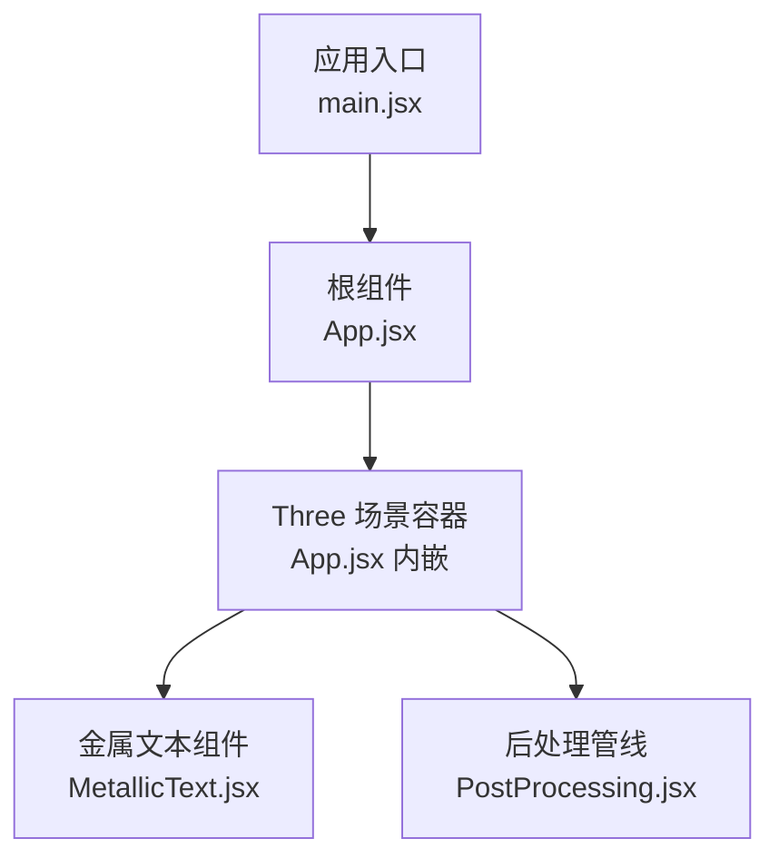
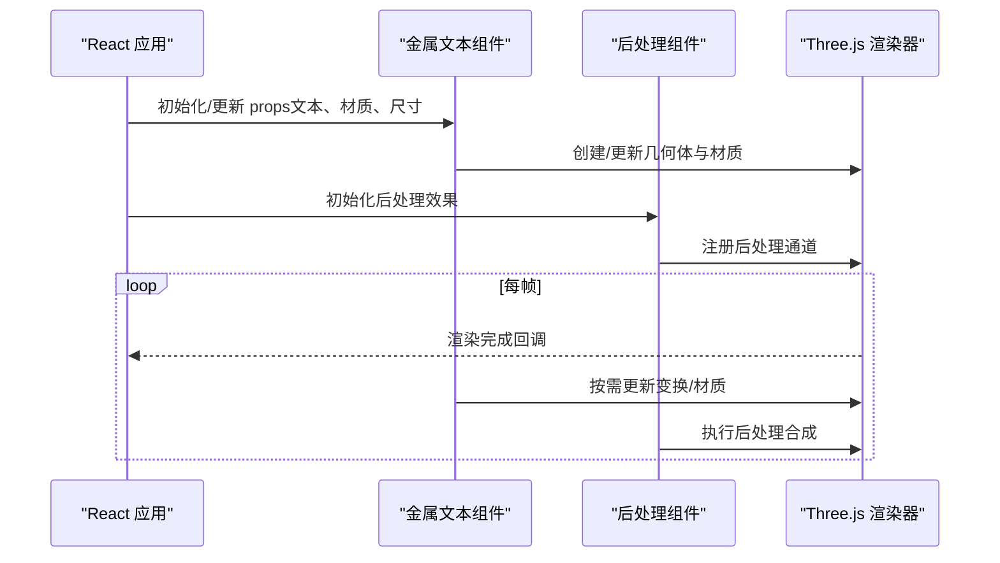
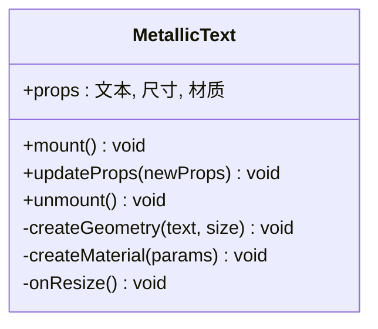
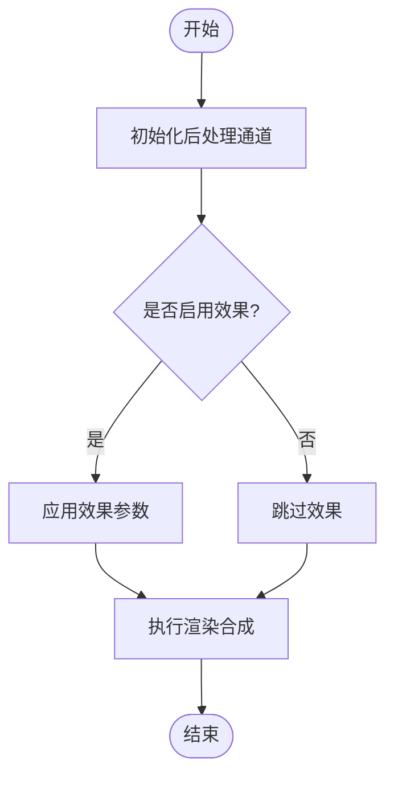
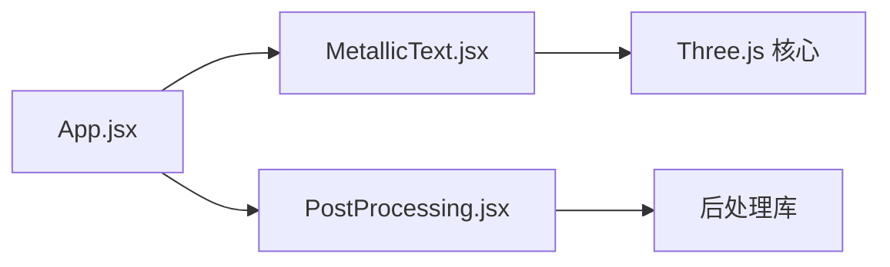

# 金属文本组件

<cite>
**本文引用的文件**   
- [MetallicText.jsx](file://src/components/three/MetallicText.jsx)
- [PostProcessing.jsx](file://src/components/three/PostProcessing.jsx)
- [App.jsx](file://src/App.jsx)
- [main.jsx](file://src/main.jsx)
</cite>

## 目录
1. [简介](#简介)
2. [项目结构](#项目结构)
3. [核心组件](#核心组件)
4. [架构总览](#架构总览)
5. [详细组件分析](#详细组件分析)
6. [依赖分析](#依赖分析)
7. [性能考虑](#性能考虑)
8. [故障排查指南](#故障排查指南)
9. [结论](#结论)
10. [附录](#附录)

## 简介
本文件聚焦于“金属文本组件”的实现与使用，围绕 Three.js 场景中的金属质感文字渲染展开。文档从系统架构、组件关系、数据流、处理逻辑、集成点、错误处理与性能特征等维度进行系统化说明，并提供可视化图示与排障建议，帮助读者快速理解并高效使用该组件。

## 项目结构
该仓库采用基于功能分层的组织方式：
- src/components/three：Three.js 相关可视化组件（含金属文本与后处理）
- src/components/ui：通用 UI 组件
- src：应用入口、路由与页面级组件
- public：静态资源（示例项目资料）

图表来源
- [main.jsx:1-50](file://src/main.jsx#L1-L50)
- [App.jsx:1-120](file://src/App.jsx#L1-L120)
- [MetallicText.jsx:1-200](file://src/components/three/MetallicText.jsx#L1-L200)
- [PostProcessing.jsx:1-200](file://src/components/three/PostProcessing.jsx#L1-L200)

章节来源
- [main.jsx:1-50](file://src/main.jsx#L1-L50)
- [App.jsx:1-120](file://src/App.jsx#L1-L120)

## 核心组件
- 金属文本组件（MetallicText）
  - 职责：加载字体、生成几何体、创建金属材质、构建网格并挂载到 Three.js 场景；提供文本内容、尺寸、材质参数等配置能力。
  - 关键特性：支持动态更新文本与材质属性；与后处理管线协作实现高光、反射等金属视觉效果。
- 后处理组件（PostProcessing）
  - 职责：在渲染阶段注入后处理效果（如泛光、色调映射等），增强金属质感的视觉表现。
  - 关键特性：可配置强度、阈值、采样半径等参数；与渲染器输出链集成。

章节来源
- [MetallicText.jsx:1-200](file://src/components/three/MetallicText.jsx#L1-L200)
- [PostProcessing.jsx:1-200](file://src/components/three/PostProcessing.jsx#L1-L200)

## 架构总览
整体渲染流程遵循 React 组件树驱动 Three.js 场景的常见模式：React 状态变化触发组件重渲染，组件内部维护 Three.js 对象生命周期，并在需要时更新几何体或材质。后处理作为独立组件接入渲染管线，对最终画面进行增强。

图表来源
- [App.jsx:1-120](file://src/App.jsx#L1-L120)
- [MetallicText.jsx:1-200](file://src/components/three/MetallicText.jsx#L1-L200)
- [PostProcessing.jsx:1-200](file://src/components/three/PostProcessing.jsx#L1-L200)

## 详细组件分析

### 金属文本组件（MetallicText）
- 设计要点
  - 字体加载：异步加载字体文件，完成后构建文本几何体。
  - 材质模型：使用高反射、高粗糙度可调的金属材质，配合环境贴图或光照提升真实感。
  - 生命周期：在挂载时创建 Three.js 对象，卸载时释放资源，避免内存泄漏。
  - 响应式更新：当 props 变更时，增量更新文本内容与材质属性，减少不必要的重建。
- 关键接口（概念性描述）
  - 文本内容：字符串类型，用于设置显示文本。
  - 尺寸控制：高度、深度、分段数等，影响几何体复杂度与渲染成本。
  - 材质参数：金属度、粗糙度、反射强度、颜色等，决定视觉风格。
  - 事件回调：可选的点击/悬停回调，便于交互扩展。
- 典型用法
  - 在页面中引入并传入文本与样式参数，即可在 Three.js 场景中呈现金属质感文字。
  - 通过状态管理动态切换文案或主题色，实现多语言或品牌化展示。

图表来源
- [MetallicText.jsx:1-200](file://src/components/three/MetallicText.jsx#L1-L200)

章节来源
- [MetallicText.jsx:1-200](file://src/components/three/MetallicText.jsx#L1-L200)

### 后处理组件（PostProcessing）
- 设计要点
  - 通道组合：将多个后处理效果串联，形成最终的渲染输出。
  - 参数调节：暴露强度、阈值、半径等滑块，便于实时调优。
  - 性能优化：根据设备能力自适应质量设置，避免过度消耗 GPU。
- 关键接口（概念性描述）
  - 效果开关：启用/禁用特定效果。
  - 质量档位：低/中/高三档，平衡画质与性能。
  - 回调通知：渲染完成后的统计信息（耗时、帧率）。

图表来源
- [PostProcessing.jsx:1-200](file://src/components/three/PostProcessing.jsx#L1-L200)

章节来源
- [PostProcessing.jsx:1-200](file://src/components/three/PostProcessing.jsx#L1-L200)

### 集成与编排（App.jsx）
- 职责
  - 组装 Three.js 场景容器，挂载金属文本与后处理组件。
  - 管理全局状态（如主题、分辨率、设备适配）。
  - 协调组件间通信（例如通过上下文或状态共享）。
- 关键点
  - 确保 Three.js 实例的生命周期与 React 组件同步。
  - 在窗口大小变化时更新相机与渲染器尺寸。
  - 为移动端提供降级策略与性能保护。

章节来源
- [App.jsx:1-120](file://src/App.jsx#L1-L120)

## 依赖分析
- 组件耦合
  - 金属文本组件依赖字体加载器与 Three.js 基础 API。
  - 后处理组件依赖渲染器与后处理库。
  - App 层负责编排与生命周期管理。
- 外部依赖
  - Three.js 核心与常用插件（如字体加载器、后处理包）。
  - React 生态（状态管理、事件绑定）。

图表来源
- [App.jsx:1-120](file://src/App.jsx#L1-L120)
- [MetallicText.jsx:1-200](file://src/components/three/MetallicText.jsx#L1-L200)
- [PostProcessing.jsx:1-200](file://src/components/three/PostProcessing.jsx#L1-L200)

章节来源
- [App.jsx:1-120](file://src/App.jsx#L1-L120)
- [MetallicText.jsx:1-200](file://src/components/three/MetallicText.jsx#L1-L200)
- [PostProcessing.jsx:1-200](file://src/components/three/PostProcessing.jsx#L1-L200)

## 性能考虑
- 几何体复杂度
  - 文本分段数与深度直接影响面片数量，建议在高分屏上适度提高，在低端设备上降低。
- 材质计算
  - 高反射与高粗糙度会加重着色器负担，可通过调整参数或在离线烘焙环境贴图中减轻运行时压力。
- 后处理开销
  - 泛光、色调映射等效果在不同设备上差异显著，建议提供质量档位与自动降级策略。
- 资源加载
  - 字体文件较大时应预加载并缓存，避免首屏卡顿。
- 渲染循环
  - 仅在必要时更新几何体或材质，避免每帧全量重建。

[本节为通用指导，不直接分析具体文件]

## 故障排查指南
- 常见问题
  - 文本未显示：检查字体路径是否正确、网络请求是否成功、Three.js 场景是否已挂载。
  - 材质异常：确认光照与环境贴图是否存在，材质参数是否在合理范围。
  - 性能抖动：关闭部分后处理效果，降低几何体分段数，观察帧率变化。
  - 内存泄漏：确保组件卸载时清理 Three.js 对象与监听器。
- 定位方法
  - 在浏览器开发者工具中查看控制台错误与网络请求。
  - 使用 Three.js 调试工具检查场景图与材质状态。
  - 在后处理组件中打印渲染耗时，评估效果对性能的影响。

章节来源
- [MetallicText.jsx:1-200](file://src/components/three/MetallicText.jsx#L1-L200)
- [PostProcessing.jsx:1-200](file://src/components/three/PostProcessing.jsx#L1-L200)

## 结论
金属文本组件通过合理的几何体构建、材质设计与后处理增强，能够在 Web 端呈现高质量的三维文字效果。结合 App 层的编排与性能策略，可在不同设备上获得稳定且美观的视觉体验。建议在生产环境中加入质量档位、资源预加载与错误恢复机制，以提升鲁棒性与用户体验。

[本节为总结性内容，不直接分析具体文件]

## 附录
- 术语表
  - 几何体：由顶点、边、面构成的三维形状。
  - 材质：定义表面外观的属性集合（颜色、反射、粗糙度等）。
  - 后处理：在最终渲染阶段对画面进行的额外图像处理。
- 参考路径
  - 入口与编排：[main.jsx](file://src/main.jsx), [App.jsx](file://src/App.jsx)
  - 核心实现：[MetallicText.jsx](file://src/components/three/MetallicText.jsx), [PostProcessing.jsx](file://src/components/three/PostProcessing.jsx)