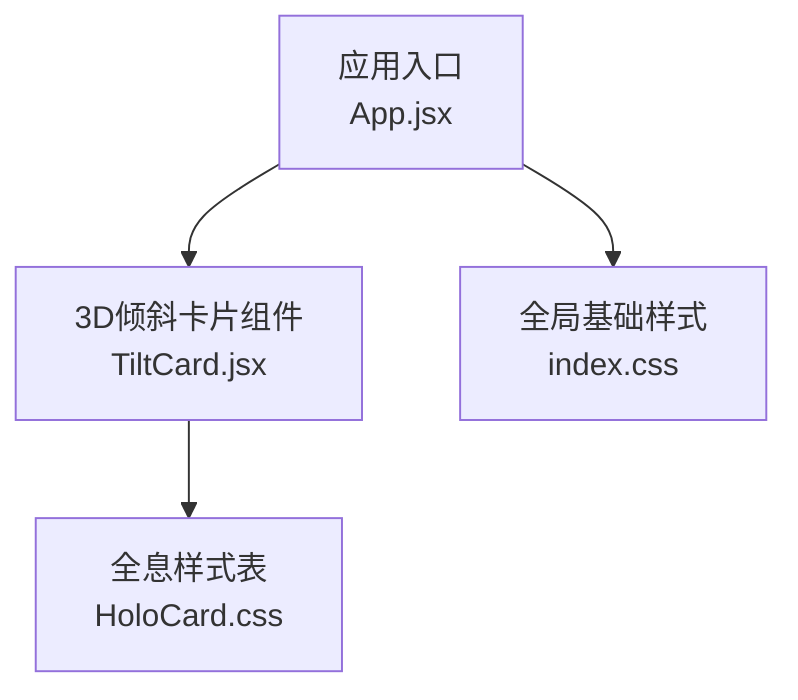
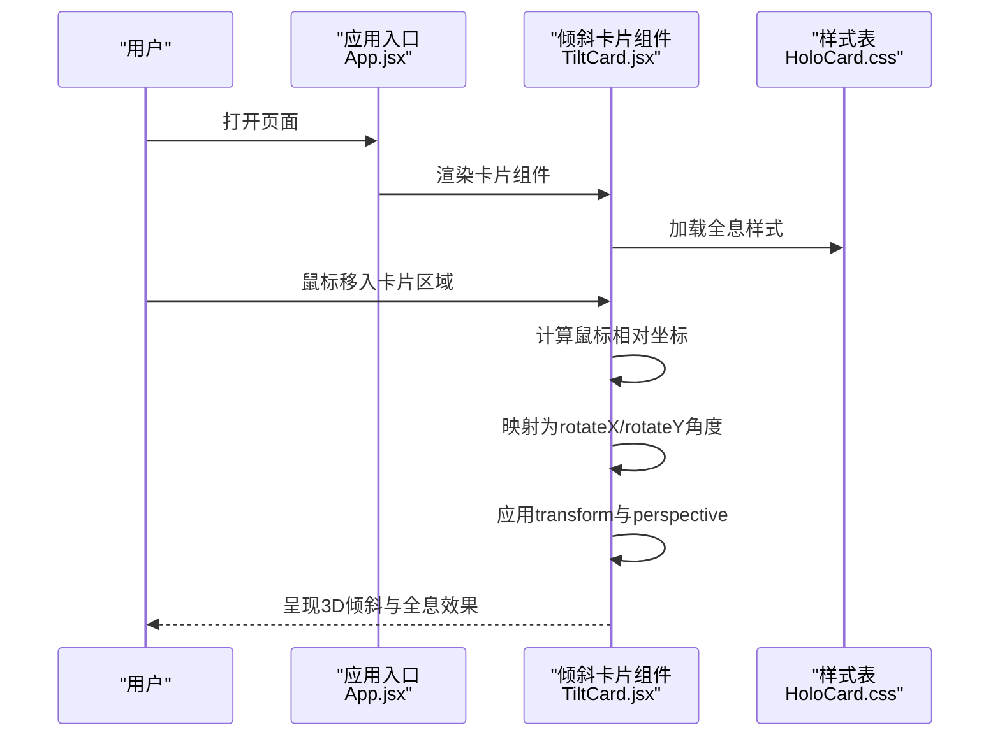
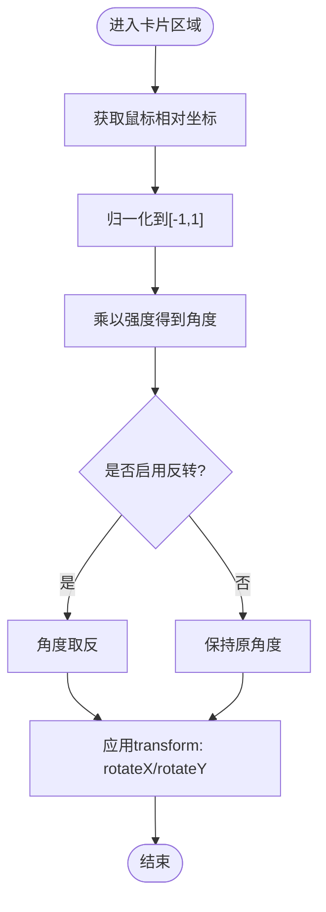
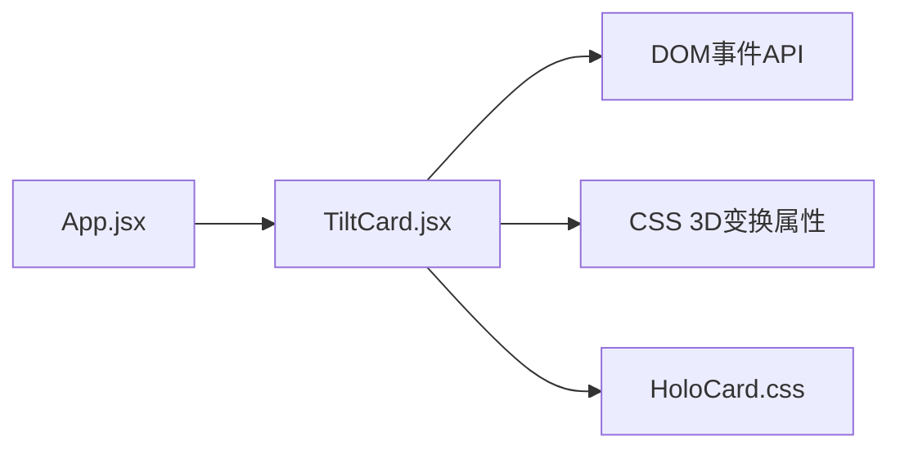

# 3D卡片倾斜组件

<cite>
**本文引用的文件**   
- [TiltCard.jsx](file://src/components/ui/TiltCard.jsx)
- [HoloCard.css](file://src/components/ui/HoloCard.css)
- [App.jsx](file://src/App.jsx)
- [index.css](file://src/index.css)
</cite>

## 目录
1. [简介](#简介)
2. [项目结构](#项目结构)
3. [核心组件](#核心组件)
4. [架构总览](#架构总览)
5. [详细组件分析](#详细组件分析)
6. [依赖分析](#依赖分析)
7. [性能考虑](#性能考虑)
8. [故障排查指南](#故障排查指南)
9. [结论](#结论)
10. [附录](#附录)

## 简介
本文件面向希望集成与定制“3D卡片倾斜”效果的开发者，系统性讲解基于CSS 3D变换的倾斜实现原理、鼠标位置到旋转角度的映射算法、强度控制与反转模式、缩放效果、以及全息（Holographic）视觉样式。文档同时提供性能优化建议与完整使用示例路径，帮助你在现有项目中快速落地并自定义。

## 项目结构
本项目采用按功能/特性组织的目录结构，3D卡片倾斜相关代码位于UI组件目录中：
- 交互逻辑与渲染：TiltCard.jsx
- 全息样式：HoloCard.css
- 应用入口与页面集成：App.jsx
- 全局基础样式：index.css

图表来源
- [App.jsx](file://src/App.jsx)
- [TiltCard.jsx](file://src/components/ui/TiltCard.jsx)
- [HoloCard.css](file://src/components/ui/HoloCard.css)
- [index.css](file://src/index.css)

章节来源
- [App.jsx](file://src/App.jsx)
- [TiltCard.jsx](file://src/components/ui/TiltCard.jsx)
- [HoloCard.css](file://src/components/ui/HoloCard.css)
- [index.css](file://src/index.css)

## 核心组件
- TiltCard.jsx：封装了3D倾斜交互的核心逻辑，包括监听鼠标移动、计算相对坐标、将坐标映射为旋转角度、应用transform-style与perspective等关键属性，并提供强度、反转、缩放等配置项。
- HoloCard.css：定义全息风格所需的渐变背景、边框高光、阴影与光晕等视觉效果，配合组件的类名进行组合。

章节来源
- [TiltCard.jsx](file://src/components/ui/TiltCard.jsx)
- [HoloCard.css](file://src/components/ui/HoloCard.css)

## 架构总览
从调用关系看，应用入口引入并使用TiltCard组件；TiltCard在运行时通过事件监听与DOM操作完成3D变换；其样式由HoloCard.css提供。

图表来源
- [App.jsx](file://src/App.jsx)
- [TiltCard.jsx](file://src/components/ui/TiltCard.jsx)
- [HoloCard.css](file://src/components/ui/HoloCard.css)

## 详细组件分析

### 3D变换与透视原理
- perspective：为元素建立三维空间深度，决定观察者距离，影响旋转时的透视感。
- transform-style：设置子元素的3D渲染方式，通常设为preserve-3d以保留层级间的3D关系。
- rotateX/rotateY：围绕X/Y轴旋转，产生前后倾侧与左右偏转的立体感。
- translateZ：用于提升或降低元素在Z轴的层次，常用于叠加高光和阴影层。

这些属性的协同工作使得卡片在鼠标移动时能够产生自然的3D倾斜反馈。

章节来源
- [TiltCard.jsx](file://src/components/ui/TiltCard.jsx)
- [HoloCard.css](file://src/components/ui/HoloCard.css)

### 鼠标位置计算与角度映射算法
- 获取鼠标相对于卡片的坐标：通过事件对象的clientX/clientY减去元素边界框的left/top得到相对位置。
- 归一化到[-1, 1]区间：将相对坐标除以卡片宽高的一半，得到中心为0、边缘为±1的归一化值。
- 映射为旋转角度：将归一化值乘以最大倾斜角度（强度），得到最终的rotateX/rotateY。
- 方向控制：根据是否启用反转模式，对角度进行符号翻转，从而改变倾斜方向。

图表来源
- [TiltCard.jsx](file://src/components/ui/TiltCard.jsx)

章节来源
- [TiltCard.jsx](file://src/components/ui/TiltCard.jsx)

### 配置选项与行为说明
- 强度控制：限制最大倾斜角度，避免过度旋转导致视觉失真。
- 反转模式：切换倾斜方向，满足不同的设计需求。
- 缩放效果：在倾斜的同时对卡片进行轻微缩放，增强聚焦感。
- 过渡动画：为transform变化添加平滑过渡，提升体验。
- 响应式适配：在不同屏幕尺寸下调整强度与缩放比例。

章节来源
- [TiltCard.jsx](file://src/components/ui/TiltCard.jsx)

### 全息（Holographic）效果实现细节
- 渐变背景：使用多层线性或径向渐变模拟彩虹色散与光泽流动。
- 边框高光：利用渐变边框或伪元素叠加，形成随视角变化的亮边。
- 阴影与光晕：通过box-shadow与filter模糊营造悬浮与发光质感。
- 动态反射：结合背景渐变与遮罩，模拟表面反射的动态变化。

章节来源
- [HoloCard.css](file://src/components/ui/HoloCard.css)

### 使用示例与集成指南
- 在页面中引入并渲染TiltCard组件，传入必要的配置项（如强度、反转、缩放）。
- 为卡片内容包裹合适的容器，确保父级具备必要的布局与尺寸。
- 如需自定义外观，可在HoloCard.css基础上扩展类名与变量。
- 参考应用入口中的使用方式，了解组件在整体页面中的组织与复用。

章节来源
- [App.jsx](file://src/App.jsx)
- [TiltCard.jsx](file://src/components/ui/TiltCard.jsx)
- [HoloCard.css](file://src/components/ui/HoloCard.css)

## 依赖分析
- 组件内部依赖：
  - DOM事件API：用于捕获鼠标移动与进出区域事件。
  - CSS 3D变换：perspective、transform-style、rotateX/rotateY、translateZ等。
  - 样式模块：HoloCard.css提供全息视觉样式。
- 外部依赖：
  - 无第三方库依赖，纯原生实现，便于集成与维护。

图表来源
- [TiltCard.jsx](file://src/components/ui/TiltCard.jsx)
- [HoloCard.css](file://src/components/ui/HoloCard.css)
- [App.jsx](file://src/App.jsx)

章节来源
- [TiltCard.jsx](file://src/components/ui/TiltCard.jsx)
- [HoloCard.css](file://src/components/ui/HoloCard.css)
- [App.jsx](file://src/App.jsx)

## 性能考虑
- will-change：对频繁变化的transform属性提前声明，促使浏览器进行GPU加速。
- transform与opacity：优先使用这两个属性做动画，减少重排与重绘。
- 节流与防抖：对mousemove事件进行节流，降低高频回调带来的开销。
- 分层合成：将需要独立合成的图层分离，避免大面积重绘。
- 媒体查询与降级：在低性能设备上降低强度或禁用复杂特效。

[本节为通用性能指导，不直接分析具体文件]

## 故障排查指南
- 卡片未出现3D效果：
  - 检查父容器是否设置了足够的尺寸与overflow。
  - 确认transform-style与perspective是否正确应用。
- 倾斜方向异常：
  - 核对反转模式开关与角度映射逻辑。
  - 验证坐标系与边界框计算是否正确。
- 动画卡顿：
  - 检查是否对mousemove进行了节流。
  - 评估will-change的使用范围与必要性。
- 样式冲突：
  - 确认HoloCard.css的类名未被全局样式覆盖。
  - 必要时提高选择器优先级或使用命名空间。

章节来源
- [TiltCard.jsx](file://src/components/ui/TiltCard.jsx)
- [HoloCard.css](file://src/components/ui/HoloCard.css)

## 结论
通过合理的3D变换与事件映射，3D卡片倾斜组件能够在不依赖第三方库的前提下提供流畅且可定制的交互体验。结合全息样式与性能优化策略，可以在不同设备与场景下获得一致的视觉与性能表现。建议在集成时遵循本文的配置与最佳实践，并根据业务需求进行适度扩展。

[本节为总结性内容，不直接分析具体文件]

## 附录
- 术语解释：
  - 透视（Perspective）：观察者在Z轴上的虚拟距离，影响3D投影的深度感。
  - 变换样式（Transform Style）：控制子元素在3D空间中如何被渲染。
  - 旋转轴（RotateX/RotateY）：围绕水平或垂直轴的旋转，产生倾斜效果。
- 参考路径：
  - 组件实现：[TiltCard.jsx](file://src/components/ui/TiltCard.jsx)
  - 全息样式：[HoloCard.css](file://src/components/ui/HoloCard.css)
  - 集成示例：[App.jsx](file://src/App.jsx)
  - 全局样式：[index.css](file://src/index.css)

[本节为补充信息，不直接分析具体文件]