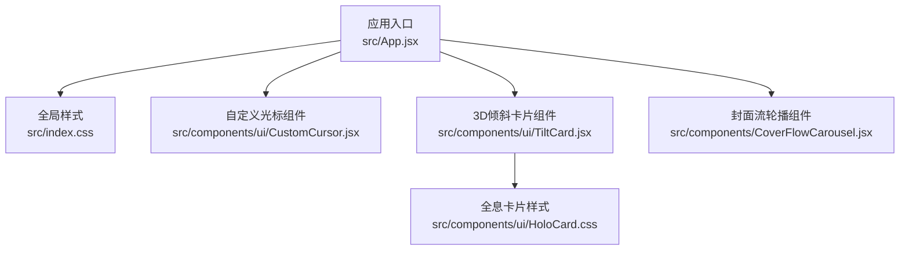
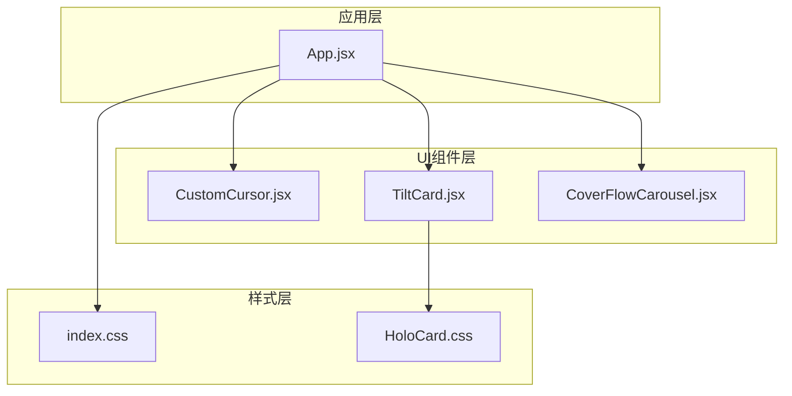
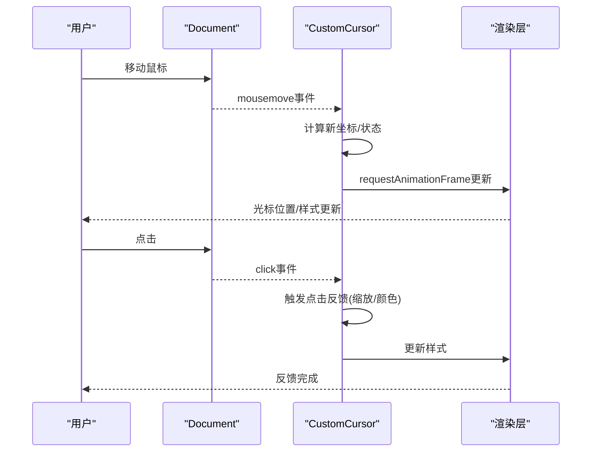
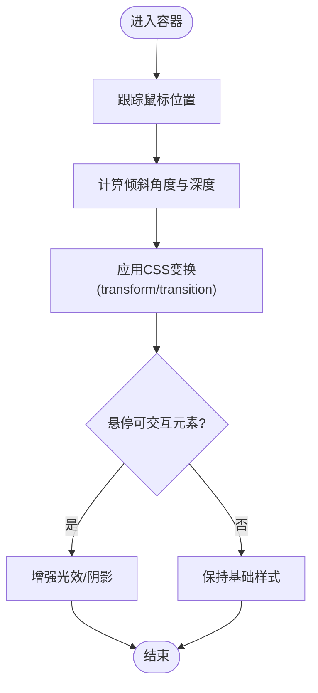
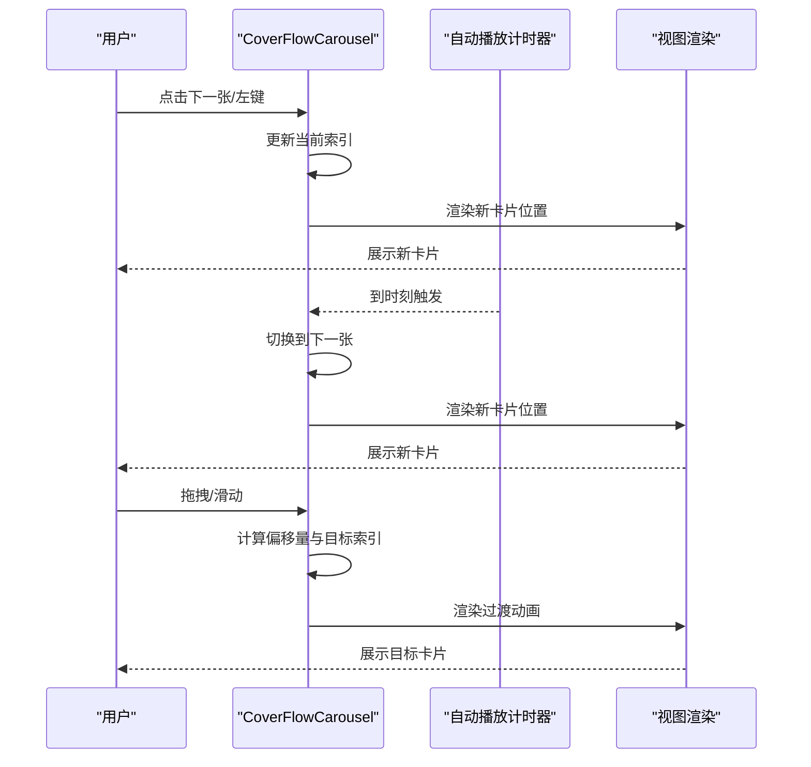
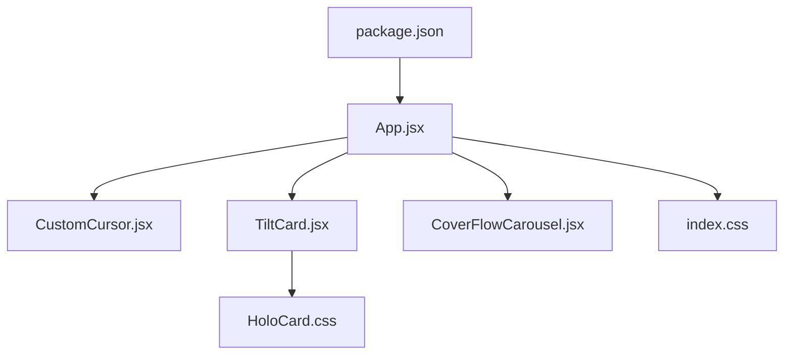

# UI组件库

<cite>
**本文引用的文件**   
- [CustomCursor.jsx](file://src/components/ui/CustomCursor.jsx)
- [TiltCard.jsx](file://src/components/ui/TiltCard.jsx)
- [HoloCard.css](file://src/components/ui/HoloCard.css)
- [CoverFlowCarousel.jsx](file://src/components/CoverFlowCarousel.jsx)
- [App.jsx](file://src/App.jsx)
- [index.css](file://src/index.css)
- [package.json](file://package.json)
</cite>

## 目录
1. [简介](#简介)
2. [项目结构](#项目结构)
3. [核心组件](#核心组件)
4. [架构总览](#架构总览)
5. [详细组件分析](#详细组件分析)
6. [依赖关系分析](#依赖关系分析)
7. [性能考量](#性能考量)
8. [故障排查指南](#故障排查指南)
9. [结论](#结论)
10. [附录](#附录)

## 简介
本UI组件库聚焦于可复用的交互与视觉增强组件，包含：
- 自定义光标组件：通过监听鼠标事件、平滑过渡与渲染优化，提供一致的指针体验。
- 3D卡片倾斜效果组件：结合CSS变换与JavaScript动画，实现跟随鼠标的立体倾斜与回弹。
- 轮播组件（封面流）：支持多卡片横向滚动、自动播放、键盘与触摸控制等特性。

文档将深入解析各组件的实现原理、API接口、配置项、事件处理与回调，并提供集成示例、样式定制方案、响应式适配与浏览器兼容性建议，帮助开发者快速上手并进行二次开发。

## 项目结构
本项目采用按功能划分的目录组织方式，UI相关组件集中在 src/components/ui 与 src/components 下，样式集中于对应 CSS 文件与应用级 index.css。

图表来源
- [App.jsx](file://src/App.jsx)
- [index.css](file://src/index.css)
- [CustomCursor.jsx](file://src/components/ui/CustomCursor.jsx)
- [TiltCard.jsx](file://src/components/ui/TiltCard.jsx)
- [HoloCard.css](file://src/components/ui/HoloCard.css)
- [CoverFlowCarousel.jsx](file://src/components/CoverFlowCarousel.jsx)

章节来源
- [App.jsx](file://src/App.jsx)
- [index.css](file://src/index.css)

## 核心组件
- 自定义光标组件：负责隐藏默认指针、绘制跟随光标、处理移动/离开/点击事件，并管理动画帧与性能节流。
- 3D倾斜卡片组件：监听容器内鼠标位置，计算倾斜角度与透视深度，驱动CSS transform与过渡动画。
- 封面流轮播组件：维护当前索引、自动播放定时器、拖拽/滑动切换、键盘导航与边界循环逻辑。

章节来源
- [CustomCursor.jsx](file://src/components/ui/CustomCursor.jsx)
- [TiltCard.jsx](file://src/components/ui/TiltCard.jsx)
- [HoloCard.css](file://src/components/ui/HoloCard.css)
- [CoverFlowCarousel.jsx](file://src/components/CoverFlowCarousel.jsx)

## 架构总览
整体架构遵循“轻量组件 + 集中样式”的模式：
- App作为入口挂载所有UI组件。
- 组件内部通过事件监听与状态更新驱动视图变化。
- 样式由组件级CSS与全局CSS共同构成，便于主题化与覆盖。

图表来源
- [App.jsx](file://src/App.jsx)
- [CustomCursor.jsx](file://src/components/ui/CustomCursor.jsx)
- [TiltCard.jsx](file://src/components/ui/TiltCard.jsx)
- [HoloCard.css](file://src/components/ui/HoloCard.css)
- [index.css](file://src/index.css)

## 详细组件分析

### 自定义光标组件
该组件通过以下机制实现一致且高性能的自定义光标体验：
- 鼠标事件监听：在document或指定容器上监听mousemove、mouseenter、mouseleave、click等事件，获取坐标并更新光标位置。
- 动画过渡：使用requestAnimationFrame进行平滑更新，避免频繁重排；对transform与opacity进行GPU加速。
- 性能优化：节流/防抖策略限制高频事件触发；仅在可见时渲染；必要时合并多次更新。
- 交互反馈：在悬停可点击元素时放大或变色；点击时缩放反馈；离开视口时隐藏。

图表来源
- [CustomCursor.jsx](file://src/components/ui/CustomCursor.jsx)

章节来源
- [CustomCursor.jsx](file://src/components/ui/CustomCursor.jsx)

#### API与配置
- 属性
  - enabled: 是否启用自定义光标
  - size: 光标尺寸
  - color: 光标颜色
  - hoverScale: 悬停时缩放比例
  - container: 监听事件的容器选择器或DOM节点
  - hideOnLeave: 离开容器时是否隐藏
- 事件
  - onMove: 鼠标移动回调，参数为坐标信息
  - onClick: 点击回调
  - onHover: 进入可交互元素回调
  - onLeave: 离开可交互元素回调
- 方法
  - show(): 显示光标
  - hide(): 隐藏光标
  - updateStyle(style): 动态更新样式对象

章节来源
- [CustomCursor.jsx](file://src/components/ui/CustomCursor.jsx)

#### 使用示例与集成
- 在应用根组件中引入并挂载，设置container为全局或局部容器。
- 通过属性控制外观与行为，按需订阅事件以扩展交互。
- 在移动端或触屏设备上禁用默认行为以提升体验。

章节来源
- [CustomCursor.jsx](file://src/components/ui/CustomCursor.jsx)

#### 样式定制与主题
- 通过CSS变量或类名覆盖光标样式（如颜色、阴影）。
- 在全局样式中定义主题色，组件读取后应用到光标。
- 支持暗色/亮色模式切换，根据系统或用户偏好动态调整。

章节来源
- [CustomCursor.jsx](file://src/components/ui/CustomCursor.jsx)
- [index.css](file://src/index.css)

#### 响应式与兼容性
- 在小屏设备或触屏环境下自动降级为默认指针。
- 兼容主流现代浏览器，对不支持requestAnimationFrame的环境提供polyfill或降级策略。

章节来源
- [CustomCursor.jsx](file://src/components/ui/CustomCursor.jsx)

### 3D卡片倾斜效果组件
该组件结合CSS变换与JavaScript动画，实现跟随鼠标位置的立体倾斜与回弹：
- 倾斜计算：基于鼠标相对容器的位置，计算X/Y轴旋转角度与透视深度。
- 动画过渡：使用CSS transition与transform实现平滑倾斜与回弹。
- 光效与层级：配合阴影、渐变与z-index营造立体感。
- 性能优化：仅对必要属性进行变换，避免布局抖动。

图表来源
- [TiltCard.jsx](file://src/components/ui/TiltCard.jsx)
- [HoloCard.css](file://src/components/ui/HoloCard.css)

章节来源
- [TiltCard.jsx](file://src/components/ui/TiltCard.jsx)
- [HoloCard.css](file://src/components/ui/HoloCard.css)

#### API与配置
- 属性
  - tiltIntensity: 倾斜强度系数
  - perspective: 透视距离
  - transitionDuration: 过渡时长
  - glowEnabled: 是否启用光效
  - content: 卡片内容插槽
- 事件
  - onTiltStart: 开始倾斜回调
  - onTiltEnd: 结束倾斜回调
  - onHoverEnter: 进入可交互区域回调
  - onHoverLeave: 离开可交互区域回调
- 方法
  - reset(): 重置倾斜状态
  - setIntensity(value): 动态调整倾斜强度

章节来源
- [TiltCard.jsx](file://src/components/ui/TiltCard.jsx)

#### 使用示例与集成
- 将需要倾斜效果的卡片包裹在该组件中，传入内容插槽。
- 通过属性调节倾斜强度与过渡时间，匹配整体动效风格。
- 在列表或网格中使用，确保每个实例独立计算位置。

章节来源
- [TiltCard.jsx](file://src/components/ui/TiltCard.jsx)

#### 样式定制与主题
- 通过HoloCard.css中的类名覆盖阴影、渐变与边框样式。
- 使用CSS变量统一主题色，组件引用以实现一键换肤。
- 支持暗色模式下的对比度调整与高光增强。

章节来源
- [HoloCard.css](file://src/components/ui/HoloCard.css)
- [index.css](file://src/index.css)

#### 响应式与兼容性
- 在小屏设备上降低倾斜强度，避免过度变形影响可读性。
- 对不支持某些CSS属性的浏览器提供降级样式。

章节来源
- [TiltCard.jsx](file://src/components/ui/TiltCard.jsx)
- [HoloCard.css](file://src/components/ui/HoloCard.css)

### 封面流轮播组件
该组件提供流畅的多卡片横向浏览体验，具备以下特性：
- 自动播放：定时切换下一张，支持暂停与恢复。
- 拖拽/滑动：支持鼠标拖拽与触摸滑动切换。
- 键盘导航：左右键切换，空格键暂停/继续。
- 边界循环：到达末尾回到开头，反之亦然。
- 指示器与缩略图：显示当前位置与可选缩略图导航。

图表来源
- [CoverFlowCarousel.jsx](file://src/components/CoverFlowCarousel.jsx)

章节来源
- [CoverFlowCarousel.jsx](file://src/components/CoverFlowCarousel.jsx)

#### API与配置
- 属性
  - items: 数据源数组
  - autoplay: 是否自动播放
  - interval: 自动播放间隔毫秒数
  - loop: 是否循环
  - draggable: 是否允许拖拽
  - keyboardNav: 是否启用键盘导航
  - indicators: 是否显示指示器
  - thumbnails: 是否显示缩略图
  - speed: 切换速度
- 事件
  - onChange(index): 当前索引变更回调
  - onPlay(): 开始播放回调
  - onPause(): 暂停播放回调
  - onDragStart(): 拖拽开始回调
  - onDragEnd(): 拖拽结束回调
- 方法
  - next(): 切换到下一张
  - prev(): 切换到上一张
  - goTo(index): 跳转到指定索引
  - play(): 开始播放
  - pause(): 暂停播放

章节来源
- [CoverFlowCarousel.jsx](file://src/components/CoverFlowCarousel.jsx)

#### 使用示例与集成
- 准备items数据源，传入组件渲染卡片内容。
- 根据业务需求开启自动播放与循环，配置切换速度与指示器。
- 在页面布局中合理设置宽度与高度，确保在不同屏幕下表现良好。

章节来源
- [CoverFlowCarousel.jsx](file://src/components/CoverFlowCarousel.jsx)

#### 样式定制与主题
- 通过覆盖组件类名调整卡片间距、圆角、阴影与过渡曲线。
- 使用全局CSS变量统一主题色，适配品牌风格。
- 支持暗色模式下的对比度与高亮调整。

章节来源
- [CoverFlowCarousel.jsx](file://src/components/CoverFlowCarousel.jsx)
- [index.css](file://src/index.css)

#### 响应式与兼容性
- 在小屏设备上减少同时显示的卡片数量，提升触控体验。
- 对不支持触摸事件的环境提供鼠标拖拽替代方案。
- 兼容主流现代浏览器，必要时提供polyfill。

章节来源
- [CoverFlowCarousel.jsx](file://src/components/CoverFlowCarousel.jsx)

## 依赖关系分析
组件之间保持低耦合，主要通过App进行组合与注入。样式层面通过全局与组件级CSS分离，便于主题化与维护。

图表来源
- [package.json](file://package.json)
- [App.jsx](file://src/App.jsx)
- [CustomCursor.jsx](file://src/components/ui/CustomCursor.jsx)
- [TiltCard.jsx](file://src/components/ui/TiltCard.jsx)
- [CoverFlowCarousel.jsx](file://src/components/CoverFlowCarousel.jsx)
- [index.css](file://src/index.css)
- [HoloCard.css](file://src/components/ui/HoloCard.css)

章节来源
- [package.json](file://package.json)
- [App.jsx](file://src/App.jsx)

## 性能考量
- 自定义光标
  - 使用requestAnimationFrame合并渲染，避免频繁重绘。
  - 对mousemove事件进行节流，降低CPU占用。
  - 仅在可见区域内渲染，减少不必要的计算。
- 3D倾斜卡片
  - 仅对transform与opacity进行变换，避免布局抖动。
  - 使用CSS transition而非JS逐帧动画，提升流畅度。
  - 在小屏设备上降低倾斜强度与复杂度。
- 轮播组件
  - 懒加载卡片内容，减少初始渲染开销。
  - 使用will-change提示浏览器优化合成层。
  - 自动播放定时器在不可见时暂停，节省资源。

[本节为通用性能指导，不直接分析具体文件]

## 故障排查指南
- 自定义光标不跟随
  - 检查事件监听是否正确绑定到document或指定容器。
  - 确认requestAnimationFrame是否被浏览器支持，必要时添加polyfill。
  - 查看控制台是否有阻止默认行为的脚本冲突。
- 3D倾斜无效果
  - 验证容器尺寸与定位是否正确，确保鼠标坐标计算有效。
  - 检查CSS transform与transition属性是否被覆盖或禁用。
  - 在小屏设备上确认已降低倾斜强度。
- 轮播无法切换
  - 确认items数据源非空且格式正确。
  - 检查自动播放定时器是否被意外清除。
  - 验证拖拽/触摸事件是否被其他组件拦截。

章节来源
- [CustomCursor.jsx](file://src/components/ui/CustomCursor.jsx)
- [TiltCard.jsx](file://src/components/ui/TiltCard.jsx)
- [CoverFlowCarousel.jsx](file://src/components/CoverFlowCarousel.jsx)

## 结论
本UI组件库提供了三个高可用、易扩展的交互组件，涵盖光标、3D倾斜与轮播三大常见场景。通过清晰的API设计、完善的配置选项与事件回调，开发者可以快速集成并根据业务需求进行样式定制与功能扩展。建议在项目中统一使用CSS变量进行主题管理，并结合响应式策略与浏览器兼容性方案，确保跨端一致的用户体验。

[本节为总结性内容，不直接分析具体文件]

## 附录
- 集成步骤
  - 在应用入口引入并挂载各组件。
  - 通过属性配置外观与行为。
  - 根据需要订阅事件与调用方法。
- 主题与样式
  - 使用全局CSS变量定义品牌色与字体。
  - 在组件级CSS中覆盖默认样式。
- 二次开发建议
  - 保持组件职责单一，通过props与事件通信。
  - 对复杂动画优先使用CSS transform与transition。
  - 针对移动端进行触控与性能优化。

[本节为通用指导，不直接分析具体文件]