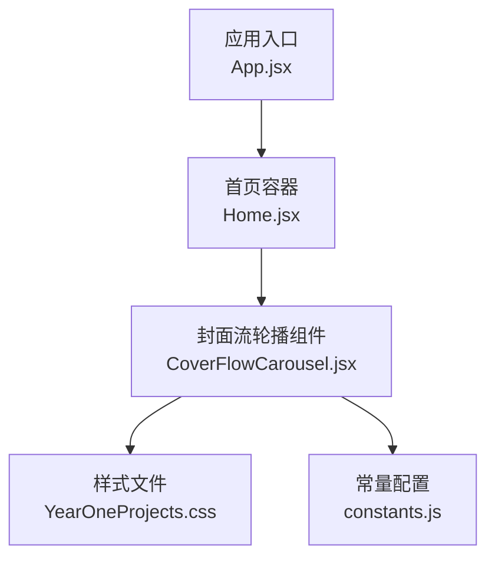
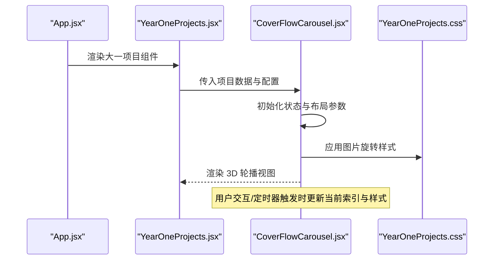
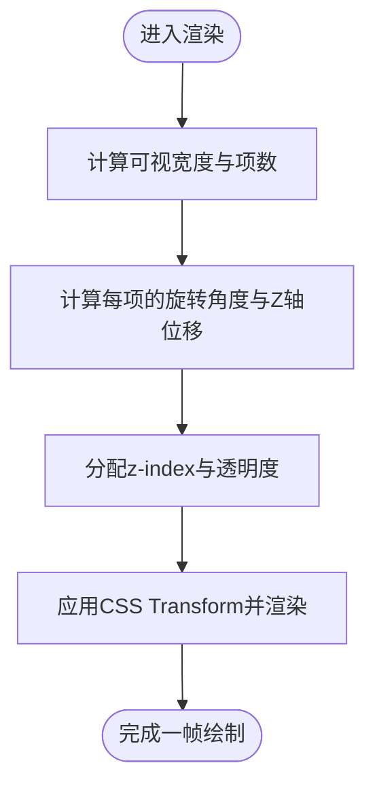
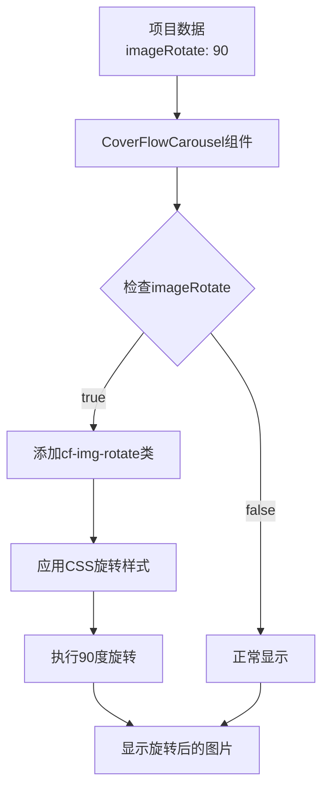
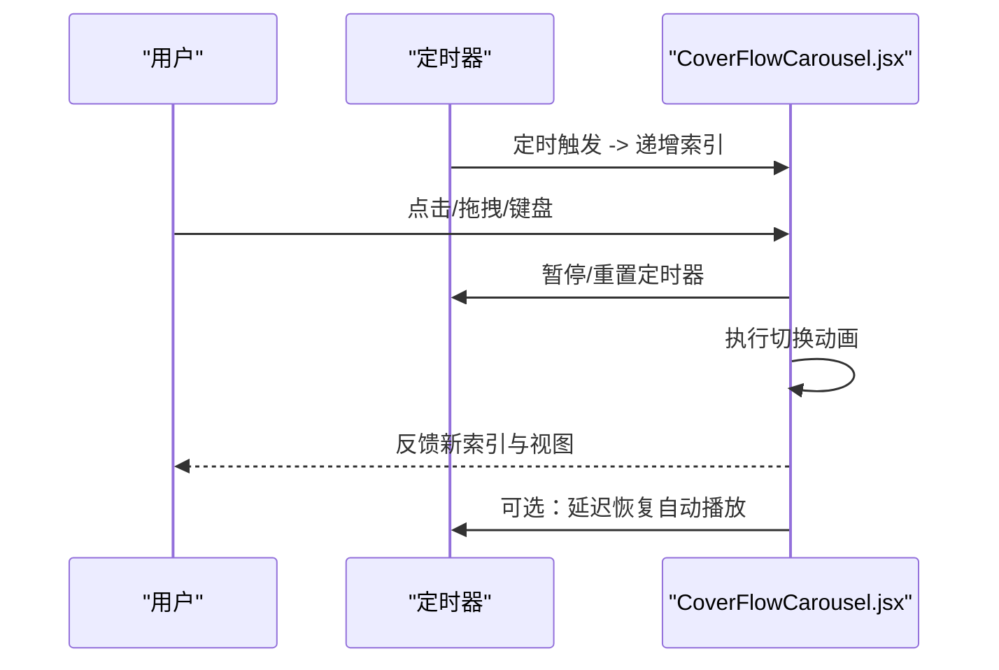
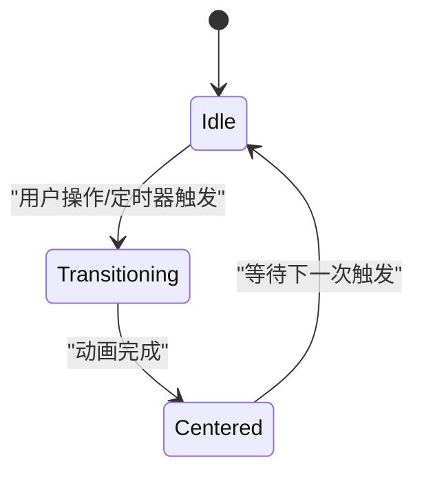
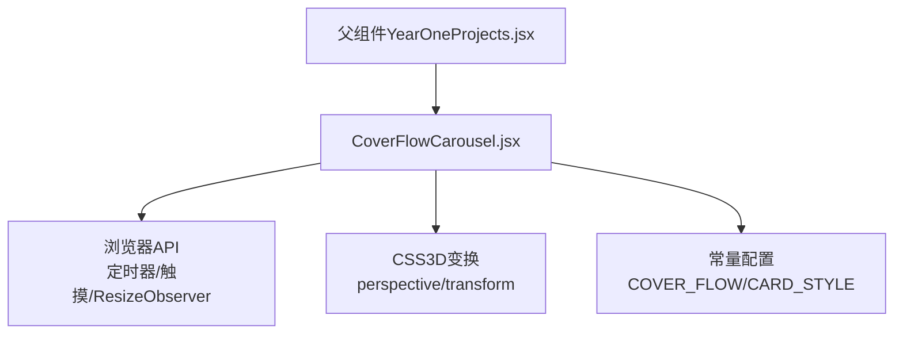

# 封面流轮播组件

<cite>
**本文引用的文件**   
- [CoverFlowCarousel.jsx](file://src/components/CoverFlowCarousel.jsx)
- [YearOneProjects.css](file://src/components/YearOneProjects.css)
- [constants.js](file://src/constants.js)
- [YearOneProjects.jsx](file://src/components/YearOneProjects.jsx)
- [WorksSection.jsx](file://src/components/WorksSection.jsx)
- [YearThreeProjects.jsx](file://src/components/YearThreeProjects.jsx)
- [App.jsx](file://src/App.jsx)
</cite>

## 更新摘要
**所做更改**   
- 新增图片垂直旋转功能章节，详细说明`imageRotate`属性的实现机制
- 更新API参考部分，添加`imageRotate`属性说明
- 增强图片处理章节，包含CSS自定义属性和动态背景图像分配技术
- 更新使用示例，展示如何配置竖长图片的旋转显示

## 目录
1. [简介](#简介)
2. [项目结构](#项目结构)
3. [核心组件](#核心组件)
4. [架构总览](#架构总览)
5. [详细组件分析](#详细组件分析)
6. [依赖关系分析](#依赖关系分析)
7. [性能考虑](#性能考虑)
8. [故障排查指南](#故障排查指南)
9. [结论](#结论)
10. [附录：API 参考与使用示例](#附录api-参考与使用示例)

## 简介
本文件围绕"封面流轮播组件"进行系统化文档化，重点解析其 3D 轮播效果的实现原理（透视变换、深度层次管理与空间布局算法）、自动播放机制（定时器控制与用户交互优先级）、切换动画与过渡配置、响应式适配方案、键盘导航与触摸滑动支持，以及完整的 API 接口说明与使用示例。特别关注最新的图片垂直旋转功能，该功能通过`imageRotate`属性支持竖长图片的90度旋转，以优化横向卡片的视觉填充效果。目标是帮助开发者快速理解并高效集成该组件，同时提供可操作的优化与排障建议。

## 项目结构
本项目采用 React + Vite 的前端工程结构，轮播组件位于 src/components 目录下，并在页面级入口中按需引入与渲染。整体组织遵循功能模块划分，UI 组件与业务页面分离，便于复用与维护。

图表来源
- [App.jsx](file://src/App.jsx)
- [CoverFlowCarousel.jsx](file://src/components/CoverFlowCarousel.jsx)
- [YearOneProjects.css](file://src/components/YearOneProjects.css)
- [constants.js](file://src/constants.js)

章节来源
- [App.jsx](file://src/App.jsx)
- [CoverFlowCarousel.jsx](file://src/components/CoverFlowCarousel.jsx)
- [YearOneProjects.css](file://src/components/YearOneProjects.css)
- [constants.js](file://src/constants.js)

## 核心组件
- 封面流轮播组件（CoverFlowCarousel）
  - 职责：负责轮播项的 3D 展示、切换动画、自动播放、用户交互（点击/拖拽/键盘）、响应式布局与事件回调。
  - 关键能力：
    - 3D 透视与深度管理：通过 CSS transform 与 perspective 构建 Cover Flow 效果，维护中心项与两侧项的层级与缩放。
    - 自动播放：基于定时器驱动当前索引递增，支持暂停与恢复。
    - 交互优先：用户操作（点击、拖拽、键盘）会打断或重置自动播放计时器，确保交互体验优先。
    - 响应式：根据可视区域宽度动态计算间距、旋转角度与缩放比例，保证多尺寸屏幕下的视觉一致性。
    - 无障碍与可访问性：支持键盘方向键导航与焦点管理。
    - **图片旋转支持**：通过`imageRotate`属性实现竖长图片的90度旋转，优化横向卡片填充效果。

章节来源
- [CoverFlowCarousel.jsx](file://src/components/CoverFlowCarousel.jsx)

## 架构总览
从调用链看，应用入口 App.jsx 渲染 Home.jsx，Home.jsx 再引入并渲染 CoverFlowCarousel.jsx。数据与配置通常由父组件传入或通过 props 注入，组件内部维护自身状态（如当前索引、是否自动播放、拖拽状态等）。

图表来源
- [App.jsx](file://src/App.jsx)
- [YearOneProjects.jsx](file://src/components/YearOneProjects.jsx)
- [CoverFlowCarousel.jsx](file://src/components/CoverFlowCarousel.jsx)
- [YearOneProjects.css](file://src/components/YearOneProjects.css)

## 详细组件分析

### 3D 轮播效果实现原理
- 透视变换
  - 使用 CSS perspective 为容器建立 3D 场景，配合 rotateY 与 translateZ 对每个轮播项进行空间定位，形成前后层次与左右展开的视觉效果。
  - 中心项保持正对视角，两侧项按固定角度向外旋转，并通过 Z 轴位移营造景深。
- 深度层次管理
  - 依据当前索引计算每项的相对位置，确定 z-index 顺序，确保中心项在最上层，两侧项依次降低层级。
  - 结合 scale 与 opacity 增强近大远小的真实感。
- 空间布局算法
  - 根据可视宽度与项数计算水平间距与旋转角度，使两侧项均匀分布在视野边缘。
  - 当窗口尺寸变化时，重新计算布局参数，避免重叠与溢出。

图表来源
- [CoverFlowCarousel.jsx](file://src/components/CoverFlowCarousel.jsx)

章节来源
- [CoverFlowCarousel.jsx](file://src/components/CoverFlowCarousel.jsx)

### 图片垂直旋转功能实现
**新增功能**：CoverFlowCarousel组件现已支持通过`imageRotate`属性实现图片的垂直旋转，专门用于处理竖长图片在横向卡片中的显示问题。

- **属性配置**
  - `imageRotate`：布尔值或数值类型，当设置为true或90时，图片将旋转90度以适应横向卡片布局。
  - 该属性在项目数据定义中设置，如`imageRotate: 90`表示需要旋转90度。

- **CSS实现机制**
  - 使用CSS自定义属性`--cf-img`动态赋值背景图像URL。
  - 通过`.cf-preview-img.cf-img-rotate`类名应用旋转样式。
  - 利用CSS容器查询（container-type: size）和cqw/cqh单位实现自适应旋转。

- **旋转算法**
  - 交换宽高：将width设置为100cqh，height设置为100cqw。
  - 应用旋转：使用transform: rotate(90deg)实现90度旋转。
  - 居中定位：通过translate(-50%, -50%)确保旋转后图片居中显示。

图表来源
- [CoverFlowCarousel.jsx](file://src/components/CoverFlowCarousel.jsx)
- [YearOneProjects.css](file://src/components/YearOneProjects.css)

章节来源
- [CoverFlowCarousel.jsx](file://src/components/CoverFlowCarousel.jsx)
- [YearOneProjects.css](file://src/components/YearOneProjects.css)

### 自动播放机制与交互优先级
- 定时器控制
  - 使用定时器周期性递增当前索引，到达边界后循环回到首项。
  - 在组件挂载时启动，卸载时清理，避免内存泄漏。
- 用户交互优先
  - 用户点击下一项、拖拽滑动或按下键盘方向键时，立即中断或重置定时器，防止自动播放覆盖用户意图。
  - 交互结束后可按策略恢复自动播放（例如延迟若干秒后再继续）。

图表来源
- [CoverFlowCarousel.jsx](file://src/components/CoverFlowCarousel.jsx)

章节来源
- [CoverFlowCarousel.jsx](file://src/components/CoverFlowCarousel.jsx)

### 切换动画与过渡效果配置
- 动画类型
  - 支持平滑过渡（ease-in-out）与弹性过渡（spring-like），可通过配置选择不同曲线。
- 过渡时长与缓动
  - 提供时长与缓动函数配置项，允许针对不同设备性能调整动画流畅度。
- 过渡阶段
  - 入场：目标项从侧边滑入并放大至中心。
  - 居中：目标项达到中心位置，两侧项退居次级层级。
  - 离场：原中心项向相反方向退出并缩小。

图表来源
- [CoverFlowCarousel.jsx](file://src/components/CoverFlowCarousel.jsx)

章节来源
- [CoverFlowCarousel.jsx](file://src/components/CoverFlowCarousel.jsx)

### 响应式设计实现方案
- 动态计算
  - 监听窗口尺寸变化，实时计算可视宽度，据此调整旋转角度、间距与缩放比例。
- 断点适配
  - 针对小屏设备减少可见项数量，增大中心项占比；大屏设备增加两侧项数量，提升沉浸感。
- 性能优化
  - 防抖处理 resize 事件，避免频繁重排与重绘。
  - 使用 will-change 与 GPU 加速属性，提高动画性能。

章节来源
- [CoverFlowCarousel.jsx](file://src/components/CoverFlowCarousel.jsx)

### 键盘导航与触摸滑动支持
- 键盘导航
  - 左/右方向键切换上一项/下一项，Tab 键聚焦到轮播容器，Enter 键确认选择。
- 触摸滑动
  - 支持 touchstart/touchmove/touchend 事件，检测滑动方向与距离，超过阈值则触发切换。
- 焦点管理
  - 切换后更新焦点位置，确保可访问性与键盘操作连贯性。

章节来源
- [CoverFlowCarousel.jsx](file://src/components/CoverFlowCarousel.jsx)

## 依赖关系分析
- 组件内聚
  - 轮播逻辑、状态管理、事件处理与样式计算集中在 CoverFlowCarousel.jsx 中，内聚度高，便于维护。
- 外部依赖
  - 依赖浏览器原生 API（定时器、触摸事件、ResizeObserver 等）与 CSS 3D 变换能力。
- 潜在耦合
  - 若父组件强绑定特定数据结构或样式类名，可能产生间接耦合，建议通过 props 明确契约。

图表来源
- [YearOneProjects.jsx](file://src/components/YearOneProjects.jsx)
- [CoverFlowCarousel.jsx](file://src/components/CoverFlowCarousel.jsx)
- [constants.js](file://src/constants.js)

章节来源
- [YearOneProjects.jsx](file://src/components/YearOneProjects.jsx)
- [CoverFlowCarousel.jsx](file://src/components/CoverFlowCarousel.jsx)
- [constants.js](file://src/constants.js)

## 性能考虑
- 动画性能
  - 尽量使用 transform 与 opacity 进行动画，避免触发布局重排。
  - 合理设置过渡时长，移动端适当缩短以提升流畅度。
- 资源加载
  - 图片懒加载与预加载策略，避免首屏阻塞。
- 事件节流与防抖
  - 对高频事件（resize、touchmove）进行节流/防抖，降低主线程压力。
- 内存管理
  - 组件卸载时清理定时器与事件监听，避免泄漏。
- **图片旋转性能**
  - 使用CSS容器查询和cqw/cqh单位，避免JavaScript计算开销。
  - 通过will-change属性提示浏览器优化图片旋转动画。

## 故障排查指南
- 常见问题
  - 自动播放不停止：检查用户交互事件是否正确重置定时器。
  - 触摸滑动无效：确认触摸事件监听是否被其他元素拦截，或指针捕获是否正确。
  - 响应式错乱：验证 resize 防抖是否生效，布局计算是否基于最新可视宽度。
  - 动画卡顿：检查是否使用了影响布局的属性，或是否存在过多并发动画。
  - **图片旋转失效**：确认`imageRotate`属性是否正确传递，检查CSS类名是否成功应用。
- 调试建议
  - 打印当前索引与布局参数，观察状态变更是否符合预期。
  - 使用浏览器性能面板分析重排与重绘热点。
  - 检查网络面板确认图片资源正确加载。

章节来源
- [CoverFlowCarousel.jsx](file://src/components/CoverFlowCarousel.jsx)

## 结论
封面流轮播组件通过 3D 透视变换与精细的深度层次管理，提供了沉浸式的浏览体验。自动播放与用户交互的优先级设计确保了良好的可用性，而响应式与无障碍支持使其适用于多终端场景。最新的图片垂直旋转功能进一步增强了组件的灵活性，能够优雅地处理各种尺寸的图片内容。通过合理的性能优化与完善的 API 设计，开发者可以快速集成并扩展该组件以满足多样化需求。

## 附录：API 参考与使用示例

### 初始化参数（props）
- items：轮播项数据数组，包含标题、描述、图片等资源信息。
- autoplay：是否启用自动播放，布尔值。
- interval：自动播放间隔时间（毫秒），数值。
- transitionDuration：切换动画时长（毫秒），数值。
- transitionEasing：过渡缓动函数名称或自定义函数，字符串或函数。
- visibleCount：可见项数量，数值，用于响应式布局。
- onIndexChange：当前索引变化回调，接收新索引作为参数。
- onClickItem：点击轮播项回调，接收项数据与索引作为参数。
- keyboardEnabled：是否启用键盘导航，布尔值。
- touchEnabled：是否启用触摸滑动，布尔值。
- **imageRotate**：图片旋转配置，布尔值或数值（90），用于竖长图片的自动旋转显示。

章节来源
- [CoverFlowCarousel.jsx](file://src/components/CoverFlowCarousel.jsx)

### 方法调用
- next()：切换到下一项。
- prev()：切换到上一项。
- goTo(index)：跳转到指定索引。
- startAutoplay()：启动自动播放。
- stopAutoplay()：停止自动播放。
- resetLayout()：重新计算布局参数（常用于窗口尺寸变化后）。

章节来源
- [CoverFlowCarousel.jsx](file://src/components/CoverFlowCarousel.jsx)

### 事件回调
- onIndexChange(newIndex)：索引变化时触发。
- onClickItem(item, index)：点击某一项时触发。
- onTransitionStart()：切换动画开始时触发。
- onTransitionEnd()：切换动画结束时触发。

章节来源
- [CoverFlowCarousel.jsx](file://src/components/CoverFlowCarousel.jsx)

### 使用示例
- 基础用法
  - 在父组件中引入轮播组件，传入 items 与基本配置，即可渲染出 3D 封面流效果。
- 自定义样式
  - 通过外层容器与轮播项的 CSS 类名覆盖默认样式，调整颜色、阴影与圆角等视觉属性。
- 添加额外功能
  - 在 onClickItem 回调中打开详情弹窗或跳转路由，实现更丰富的交互流程。
- 响应式适配
  - 根据屏幕尺寸动态调整 visibleCount 与 transitionDuration，以获得最佳显示效果。
- **图片旋转配置**
  - 在项目数据中设置`imageRotate: 90`，组件会自动为竖长图片应用90度旋转，优化横向卡片填充效果。
  - 适用于扫描文档、截图、竖版海报等竖长图片内容的展示。

章节来源
- [YearOneProjects.jsx](file://src/components/YearOneProjects.jsx)
- [CoverFlowCarousel.jsx](file://src/components/CoverFlowCarousel.jsx)
- [WorksSection.jsx](file://src/components/WorksSection.jsx)
- [YearThreeProjects.jsx](file://src/components/YearThreeProjects.jsx)