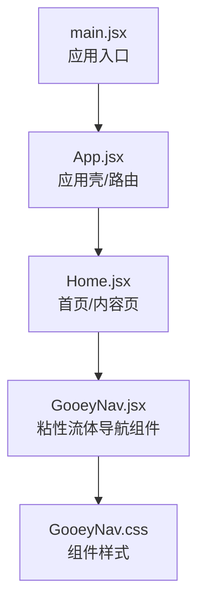
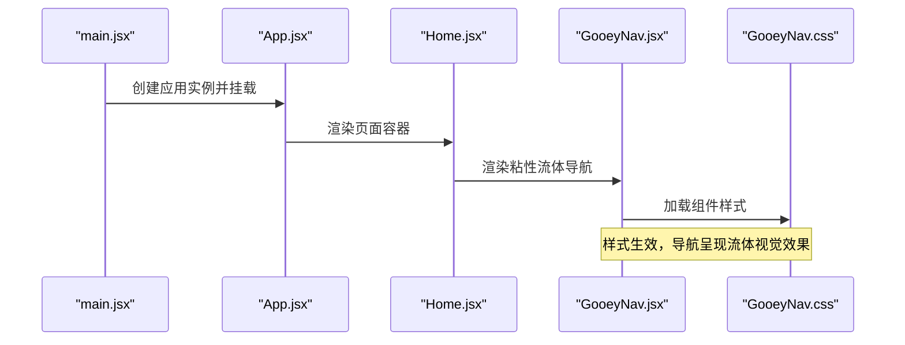
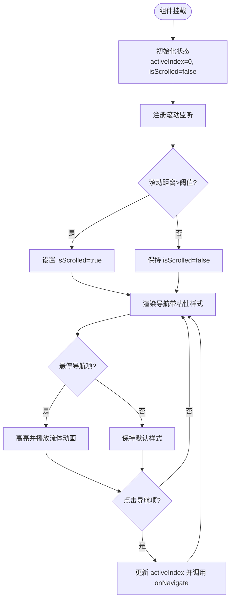
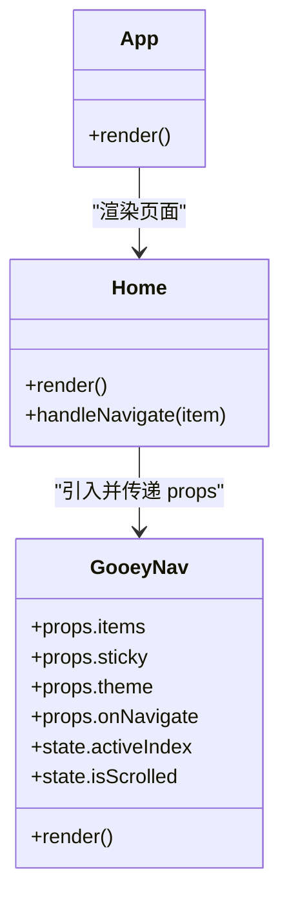
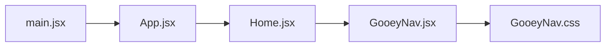

# 粘性流体导航组件

<cite>
**本文引用的文件**   
- [GooeyNav.jsx](file://src/components/ui/GooeyNav.jsx)
- [GooeyNav.css](file://src/components/ui/GooeyNav.css)
- [App.jsx](file://src/App.jsx)
- [Home.jsx](file://src/Home.jsx)
- [main.jsx](file://src/main.jsx)
</cite>

## 目录
1. [简介](#简介)
2. [项目结构](#项目结构)
3. [核心组件](#核心组件)
4. [架构总览](#架构总览)
5. [详细组件分析](#详细组件分析)
6. [依赖关系分析](#依赖关系分析)
7. [性能考量](#性能考量)
8. [故障排查指南](#故障排查指南)
9. [结论](#结论)
10. [附录](#附录)

## 简介
本文件聚焦于“粘性流体导航组件”的实现与使用，围绕 src/components/ui/GooeyNav.jsx 及其样式 GooeyNav.css，结合应用入口 App.jsx、页面 Home.jsx 与根入口 main.jsx，系统性梳理该组件的职责、数据流、交互流程与集成方式。文档面向不同技术背景的读者，既提供高层概览，也给出代码级分析与可视化图示，帮助快速理解并正确集成该组件。

## 项目结构
与粘性流体导航相关的核心文件位于 src/components/ui 目录下，并在应用顶层进行挂载与渲染。整体组织遵循“功能组件 + 样式分离”的约定：
- 组件实现：GooeyNav.jsx
- 样式定义：GooeyNav.css
- 应用装配：App.jsx（负责路由/布局与组件挂载）
- 页面容器：Home.jsx（作为导航所在页面的示例）
- 根入口：main.jsx（初始化 React 应用）

图表来源
- [main.jsx](file://src/main.jsx)
- [App.jsx](file://src/App.jsx)
- [Home.jsx](file://src/Home.jsx)
- [GooeyNav.jsx](file://src/components/ui/GooeyNav.jsx)
- [GooeyNav.css](file://src/components/ui/GooeyNav.css)

章节来源
- [GooeyNav.jsx](file://src/components/ui/GooeyNav.jsx)
- [GooeyNav.css](file://src/components/ui/GooeyNav.css)
- [App.jsx](file://src/App.jsx)
- [Home.jsx](file://src/Home.jsx)
- [main.jsx](file://src/main.jsx)

## 核心组件
- 粘性流体导航组件（GooeyNav）
  - 职责：提供可粘性的顶部导航栏，具备流体视觉风格与交互反馈，用于在页面滚动时保持可见并提供快捷跳转。
  - 关键特性：
    - 粘性定位：在滚动过程中吸附到视口顶部
    - 流体效果：通过 CSS 滤镜或混合模式营造“黏液/流体”视觉
    - 响应式适配：在不同屏幕尺寸下保持良好的可读性与可用性
    - 可访问性：支持键盘导航与焦点管理
  - 外部依赖：主要依赖 CSS 样式；若涉及动画或第三方库，应在组件内声明并最小化引入

章节来源
- [GooeyNav.jsx](file://src/components/ui/GooeyNav.jsx)
- [GooeyNav.css](file://src/components/ui/GooeyNav.css)

## 架构总览
从应用启动到导航渲染的关键路径如下：
- main.jsx 初始化 React 应用
- App.jsx 加载页面与布局
- Home.jsx 作为导航所在的页面容器
- GooeyNav.jsx 被渲染为粘性导航，样式由 GooeyNav.css 提供

图表来源
- [main.jsx](file://src/main.jsx)
- [App.jsx](file://src/App.jsx)
- [Home.jsx](file://src/Home.jsx)
- [GooeyNav.jsx](file://src/components/ui/GooeyNav.jsx)
- [GooeyNav.css](file://src/components/ui/GooeyNav.css)

## 详细组件分析

### 粘性流体导航组件（GooeyNav）
- 组件类型：函数式组件（React）
- 输入属性（Props）
  - items：导航项集合（文本、链接、图标等）
  - sticky：是否启用粘性定位（默认开启）
  - theme：主题配置（颜色、阴影、圆角等）
  - onNavigate：点击导航项时的回调
- 内部状态（State）
  - activeIndex：当前激活的导航项索引
  - isScrolled：滚动位置是否超过阈值（用于切换样式）
- 生命周期与副作用
  - 监听窗口滚动事件以更新 isScrolled
  - 根据 activeIndex 更新导航项的高亮状态
- 交互流程
  - 鼠标悬停：显示流体高亮与过渡动画
  - 点击导航项：触发 onNavigate 回调并更新 activeIndex
  - 键盘操作：支持 Tab 键切换焦点与回车确认
- 样式要点
  - 使用 backdrop-filter、filter、mix-blend-mode 等实现流体感
  - 使用 transform 与 transition 实现平滑过渡
  - 使用 position: sticky 实现粘性定位

图表来源
- [GooeyNav.jsx](file://src/components/ui/GooeyNav.jsx)
- [GooeyNav.css](file://src/components/ui/GooeyNav.css)

章节来源
- [GooeyNav.jsx](file://src/components/ui/GooeyNav.jsx)
- [GooeyNav.css](file://src/components/ui/GooeyNav.css)

### 应用装配（App.jsx 与 Home.jsx）
- App.jsx
  - 负责应用壳与路由/布局
  - 将 Home.jsx 作为主页面渲染
- Home.jsx
  - 作为导航所在页面容器
  - 引入并渲染 GooeyNav 组件
  - 处理导航项点击后的页面跳转或锚点滚动

图表来源
- [App.jsx](file://src/App.jsx)
- [Home.jsx](file://src/Home.jsx)
- [GooeyNav.jsx](file://src/components/ui/GooeyNav.jsx)

章节来源
- [App.jsx](file://src/App.jsx)
- [Home.jsx](file://src/Home.jsx)
- [GooeyNav.jsx](file://src/components/ui/GooeyNav.jsx)

### 根入口（main.jsx）
- 作用：初始化 React 应用并挂载到 DOM
- 与导航的关系：不直接依赖导航组件，但作为应用启动的起点，确保后续组件树（包含导航）能够正常渲染

章节来源
- [main.jsx](file://src/main.jsx)

## 依赖关系分析
- 组件内聚与耦合
  - GooeyNav 与 GooeyNav.css 强内聚，样式与逻辑解耦清晰
  - Home.jsx 对 GooeyNav 存在弱耦合（仅通过 props 通信）
  - App.jsx 与 Home.jsx 之间为父子关系，便于扩展更多页面
- 外部依赖
  - 若使用第三方动画库或工具函数，应在 GooeyNav.jsx 中显式导入并最小化范围
- 潜在循环依赖
  - 当前结构未发现循环引用；建议保持单向依赖：入口 → 应用壳 → 页面 → 组件

图表来源
- [main.jsx](file://src/main.jsx)
- [App.jsx](file://src/App.jsx)
- [Home.jsx](file://src/Home.jsx)
- [GooeyNav.jsx](file://src/components/ui/GooeyNav.jsx)
- [GooeyNav.css](file://src/components/ui/GooeyNav.css)

章节来源
- [GooeyNav.jsx](file://src/components/ui/GooeyNav.jsx)
- [GooeyNav.css](file://src/components/ui/GooeyNav.css)
- [App.jsx](file://src/App.jsx)
- [Home.jsx](file://src/Home.jsx)
- [main.jsx](file://src/main.jsx)

## 性能考量
- 滚动监听优化
  - 使用节流或防抖减少频繁计算
  - 仅在需要时添加/移除事件监听器
- 样式重排与重绘
  - 优先使用 transform 与 opacity 进行动画，避免触发布局抖动
  - 合理使用 will-change 提示浏览器优化
- 资源加载
  - 将样式按需加载或拆分，减小首屏体积
  - 图片与字体资源进行压缩与缓存策略

[本节为通用指导，无需特定文件来源]

## 故障排查指南
- 导航未固定到顶部
  - 检查父容器的 overflow 与 position 设置
  - 确认 sticky 属性是否正确传入
- 流体效果不生效
  - 检查浏览器兼容性（backdrop-filter、filter）
  - 确认样式未被全局覆盖
- 点击无响应
  - 检查 onNavigate 回调是否绑定
  - 验证事件冒泡是否被阻止
- 移动端体验不佳
  - 调整触摸区域大小与字体尺寸
  - 优化动画时长与缓动曲线

章节来源
- [GooeyNav.jsx](file://src/components/ui/GooeyNav.jsx)
- [GooeyNav.css](file://src/components/ui/GooeyNav.css)

## 结论
粘性流体导航组件通过清晰的组件边界与样式分离，提供了良好的用户体验与可扩展性。建议在项目中统一规范其 props 接口与主题配置，并结合性能优化策略，确保在不同设备与浏览器上稳定运行。

[本节为总结性内容，无需特定文件来源]

## 附录
- 集成步骤（简要）
  - 在页面容器中引入 GooeyNav 组件
  - 配置 items、theme 与 onNavigate
  - 确保样式文件已正确加载
- 最佳实践
  - 保持导航项数量适中，避免信息过载
  - 为重要操作提供明确的视觉反馈
  - 遵循无障碍标准，提升可访问性

[本节为补充说明，无需特定文件来源]