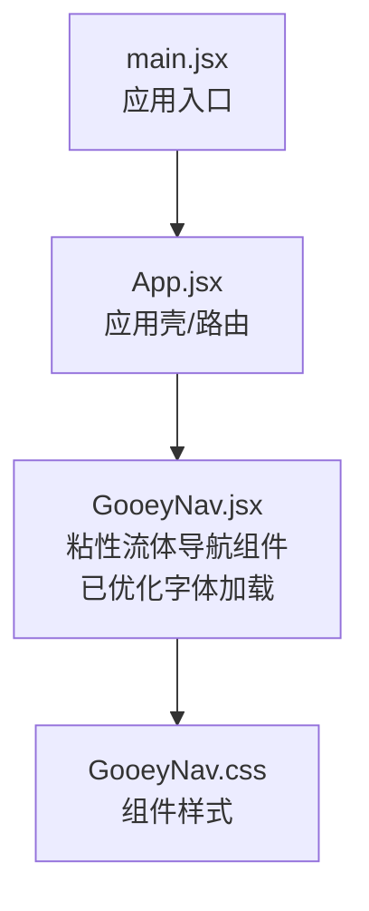
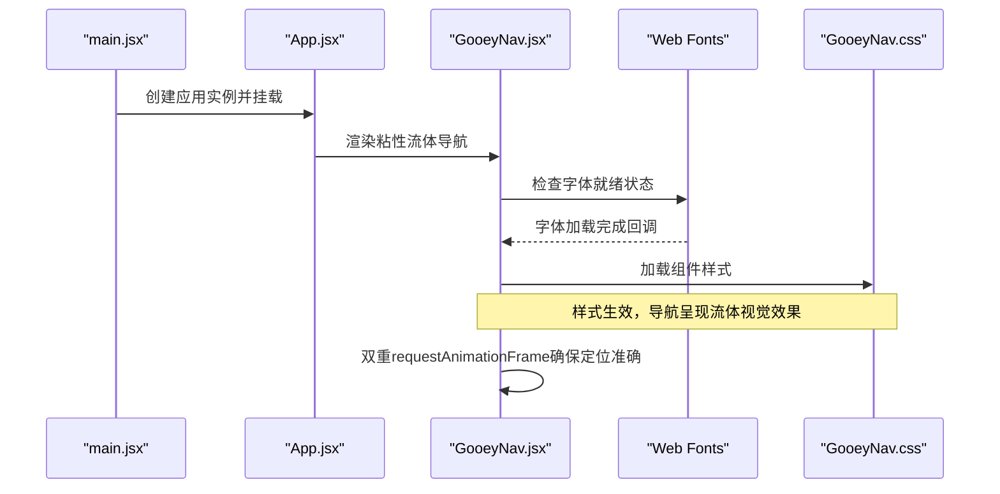
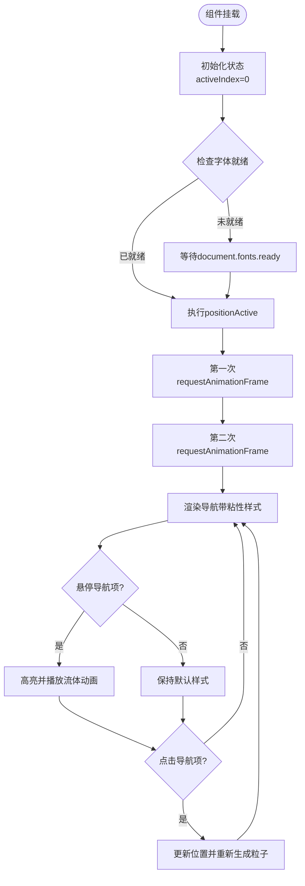
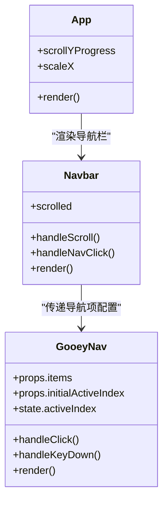
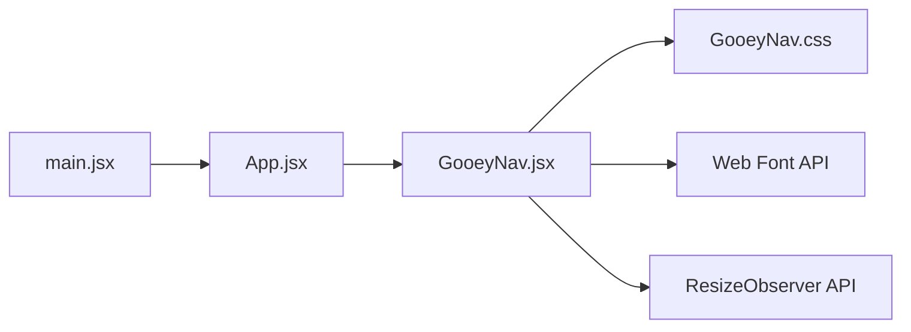

# 粘性流体导航组件

<cite>
**本文引用的文件**   
- [GooeyNav.jsx](file://src/components/ui/GooeyNav.jsx)
- [GooeyNav.css](file://src/components/ui/GooeyNav.css)
- [App.jsx](file://src/App.jsx)
- [main.jsx](file://src/main.jsx)
</cite>

## 更新摘要
**所做更改**   
- 更新了核心组件分析部分，重点说明字体加载时序问题的修复
- 新增了Web字体就绪检测机制的详细说明
- 更新了故障排查指南，包含字体加载相关问题的解决方案
- 完善了性能考量部分，增加了字体渲染优化的建议

## 目录
1. [简介](#简介)
2. [项目结构](#项目结构)
3. [核心组件](#核心组件)
4. [架构总览](#架构总览)
5. [详细组件分析](#详细组件分析)
6. [依赖关系分析](#依赖关系分析)
7. [性能考量](#性能考量)
8. [故障排查指南](#故障排查指南)
9. [结论](#结论)
10. [附录](#附录)

## 简介
本文件聚焦于"粘性流体导航组件"的实现与使用，围绕 src/components/ui/GooeyNav.jsx 及其样式 GooeyNav.css，结合应用入口 App.jsx 与根入口 main.jsx，系统性梳理该组件的职责、数据流、交互流程与集成方式。**最新更新**：组件已修复初始加载时的字体重叠问题，通过实现双重 requestAnimationFrame 调用和 Web 字体就绪检测机制，确保导航文本在字体加载完成后再进行定位计算。

## 项目结构
与粘性流体导航相关的核心文件位于 src/components/ui 目录下，并在应用顶层进行挂载与渲染。整体组织遵循"功能组件 + 样式分离"的约定：
- 组件实现：GooeyNav.jsx（已优化字体加载时序）
- 样式定义：GooeyNav.css
- 应用装配：App.jsx（负责路由/布局与组件挂载）
- 根入口：main.jsx（初始化 React 应用）

**图表来源**
- [main.jsx](file://src/main.jsx)
- [App.jsx](file://src/App.jsx)
- [GooeyNav.jsx](file://src/components/ui/GooeyNav.jsx)
- [GooeyNav.css](file://src/components/ui/GooeyNav.css)

章节来源
- [GooeyNav.jsx](file://src/components/ui/GooeyNav.jsx)
- [GooeyNav.css](file://src/components/ui/GooeyNav.css)
- [App.jsx](file://src/App.jsx)
- [main.jsx](file://src/main.jsx)

## 核心组件
- 粘性流体导航组件（GooeyNav）
  - 职责：提供可粘性的顶部导航栏，具备流体视觉风格与交互反馈，用于在页面滚动时保持可见并提供快捷跳转。
  - 关键特性：
    - 粘性定位：在滚动过程中吸附到视口顶部
    - 流体效果：通过 CSS 滤镜或混合模式营造"黏液/流体"视觉
    - 响应式适配：在不同屏幕尺寸下保持良好的可读性与可用性
    - 可访问性：支持键盘导航与焦点管理
    - **字体同步**：通过 Web Font API 确保文本渲染一致性
  - 外部依赖：主要依赖 CSS 样式；若涉及动画或第三方库，应在组件内声明并最小化引入

章节来源
- [GooeyNav.jsx](file://src/components/ui/GooeyNav.jsx)
- [GooeyNav.css](file://src/components/ui/GooeyNav.css)

## 架构总览
从应用启动到导航渲染的关键路径如下：
- main.jsx 初始化 React 应用
- App.jsx 加载页面与布局
- GooeyNav.jsx 被渲染为粘性导航，样式由 GooeyNav.css 提供
- **新增**：Web 字体就绪检测确保文本定位准确性

**图表来源**
- [main.jsx](file://src/main.jsx)
- [App.jsx](file://src/App.jsx)
- [GooeyNav.jsx](file://src/components/ui/GooeyNav.jsx)
- [GooeyNav.css](file://src/components/ui/GooeyNav.css)

## 详细组件分析

### 粘性流体导航组件（GooeyNav）
- 组件类型：函数式组件（React）
- 输入属性（Props）
  - items：导航项集合（文本、链接、图标等）
  - animationTime：动画时长（默认600ms）
  - particleCount：粒子数量（默认15）
  - particleDistances：粒子距离范围（默认[90, 10]）
  - particleR：粒子半径（默认100）
  - timeVariance：时间方差（默认300）
  - colors：颜色数组（默认[1, 2, 3, 1, 2, 3, 1, 4]）
  - initialActiveIndex：初始激活索引（默认0）
- 内部状态（State）
  - activeIndex：当前激活的导航项索引
- 生命周期与副作用
  - **字体就绪监听**：使用 document.fonts.ready 确保字体加载完成后进行定位计算
  - **双重渲染优化**：通过两次 requestAnimationFrame 调用确保 DOM 完全渲染
  - ResizeObserver 监听容器大小变化
  - 根据 activeIndex 更新导航项的高亮状态
- 交互流程
  - 鼠标悬停：显示流体高亮与过渡动画
  - 点击导航项：触发位置更新并重新生成粒子效果
  - 键盘操作：支持 Tab 键切换焦点与回车确认
- 样式要点
  - 使用 backdrop-filter、filter、mix-blend-mode 等实现流体感
  - 使用 transform 与 transition 实现平滑过渡
  - 响应式设计适配不同屏幕尺寸

**更新** 组件现在实现了智能的字体加载处理机制，解决了初始加载时文本重叠的问题。

**图表来源**
- [GooeyNav.jsx](file://src/components/ui/GooeyNav.jsx)
- [GooeyNav.css](file://src/components/ui/GooeyNav.css)

章节来源
- [GooeyNav.jsx:129-158](file://src/components/ui/GooeyNav.jsx#L129-L158)
- [GooeyNav.css](file://src/components/ui/GooeyNav.css)

### 应用装配（App.jsx）
- App.jsx
  - 负责应用壳与路由/布局
  - 将 GooeyNav 组件作为导航集成到应用中
  - 定义了导航项配置（NAV_ITEMS）
  - 实现了平滑滚动和滚动状态管理

**图表来源**
- [App.jsx](file://src/App.jsx)
- [GooeyNav.jsx](file://src/components/ui/GooeyNav.jsx)

章节来源
- [App.jsx:31-81](file://src/App.jsx#L31-L81)
- [GooeyNav.jsx](file://src/components/ui/GooeyNav.jsx)

### 根入口（main.jsx）
- 作用：初始化 React 应用并挂载到 DOM
- 与导航的关系：不直接依赖导航组件，但作为应用启动的起点，确保后续组件树（包含导航）能够正常渲染

章节来源
- [main.jsx](file://src/main.jsx)

## 依赖关系分析
- 组件内聚与耦合
  - GooeyNav 与 GooeyNav.css 强内聚，样式与逻辑解耦清晰
  - App.jsx 对 GooeyNav 存在弱耦合（仅通过 props 通信）
  - 组件间依赖关系清晰，无循环引用
- 外部依赖
  - 使用原生 Web Font API 进行字体就绪检测
  - 依赖浏览器支持的 ResizeObserver API
  - 使用 CSS 自定义属性实现主题配置
- 潜在循环依赖
  - 当前结构未发现循环引用；建议保持单向依赖：入口 → 应用壳 → 组件

**图表来源**
- [main.jsx](file://src/main.jsx)
- [App.jsx](file://src/App.jsx)
- [GooeyNav.jsx](file://src/components/ui/GooeyNav.jsx)
- [GooeyNav.css](file://src/components/ui/GooeyNav.css)

章节来源
- [GooeyNav.jsx](file://src/components/ui/GooeyNav.jsx)
- [GooeyNav.css](file://src/components/ui/GooeyNav.css)
- [App.jsx](file://src/App.jsx)
- [main.jsx](file://src/main.jsx)

## 性能考量
- 滚动监听优化
  - 使用节流或防抖减少频繁计算
  - 仅在需要时添加/移除事件监听器
- 样式重排与重绘
  - 优先使用 transform 与 opacity 进行动画，避免触发布局抖动
  - 合理使用 will-change 提示浏览器优化
- **字体渲染优化**
  - 使用 document.fonts.ready 确保字体加载完成后再进行DOM测量
  - 双重 requestAnimationFrame 调用避免首次渲染时的布局抖动
  - 延迟非关键样式的计算直到字体就绪
- 资源加载
  - 将样式按需加载或拆分，减小首屏体积
  - 图片与字体资源进行压缩与缓存策略
- **内存管理**
  - 及时清理动态创建的粒子元素
  - 正确断开 ResizeObserver 监听器

**更新** 新增了字体渲染优化和内存管理的性能考虑，这些都是解决初始加载问题的关键措施。

## 故障排查指南
- 导航未固定到顶部
  - 检查父容器的 overflow 与 position 设置
  - 确认 sticky 属性是否正确传入
- 流体效果不生效
  - 检查浏览器兼容性（backdrop-filter、filter）
  - 确认样式未被全局覆盖
- 点击无响应
  - 检查 onNavigate 回调是否绑定
  - 验证事件冒泡是否被阻止
- **字体加载相关问题**
  - 检查 document.fonts API 是否可用
  - 确认字体文件路径正确且可访问
  - 验证字体格式兼容性（WOFF2、TTF等）
  - 检查是否有字体加载超时或失败的情况
- **初始加载文本重叠问题**
  - 确认双重 requestAnimationFrame 调用是否正常执行
  - 检查 document.fonts.ready 回调是否正确触发
  - 验证 positionActive 函数是否在字体就绪后执行
- 移动端体验不佳
  - 调整触摸区域大小与字体尺寸
  - 优化动画时长与缓动曲线

**更新** 新增了字体加载相关问题的排查指南，这是本次修复的重点领域。

章节来源
- [GooeyNav.jsx:129-158](file://src/components/ui/GooeyNav.jsx#L129-L158)
- [GooeyNav.css](file://src/components/ui/GooeyNav.css)

## 结论
粘性流体导航组件通过清晰的组件边界与样式分离，提供了良好的用户体验与可扩展性。**最新改进**：通过实现 Web 字体就绪检测和双重渲染优化，成功解决了初始加载时的文本重叠问题。建议在项目中统一规范其 props 接口与主题配置，并结合性能优化策略，确保在不同设备与浏览器上稳定运行。

## 附录
- 集成步骤（简要）
  - 在页面容器中引入 GooeyNav 组件
  - 配置 items、initialActiveIndex 等属性
  - 确保样式文件已正确加载
  - **无需额外配置**：字体加载优化已内置处理
- 最佳实践
  - 保持导航项数量适中，避免信息过载
  - 为重要操作提供明确的视觉反馈
  - 遵循无障碍标准，提升可访问性
  - **字体优化**：使用合适的字体加载策略，避免阻塞渲染
- **技术亮点**
  - Web Font API 集成确保文本渲染一致性
  - 双重 requestAnimationFrame 优化首次渲染性能
  - 响应式设计适配各种屏幕尺寸
  - 内存友好的粒子系统管理

**更新** 新增了技术亮点部分，总结了本次修复的核心技术实现。