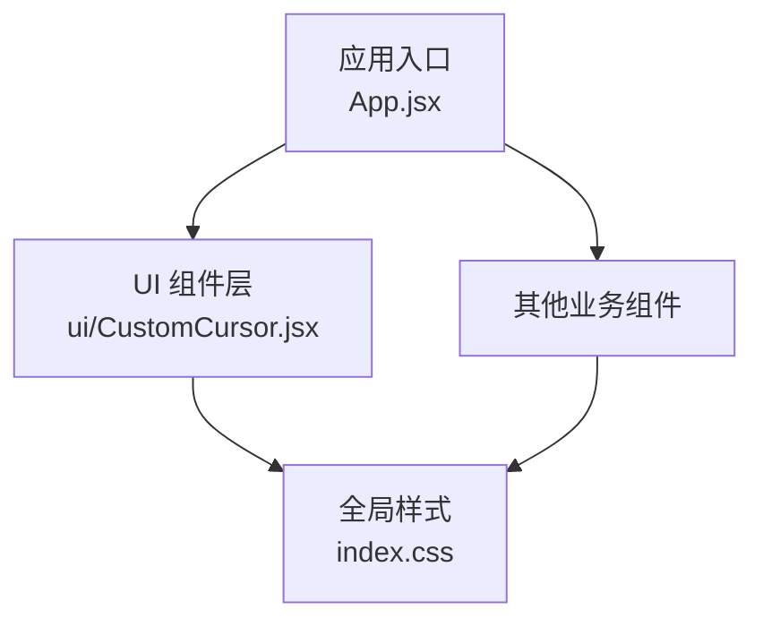
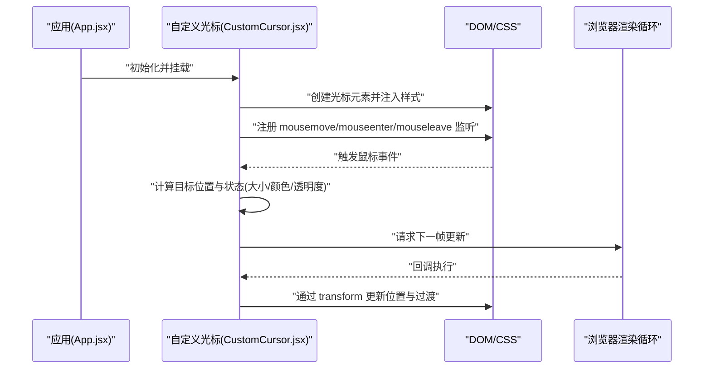
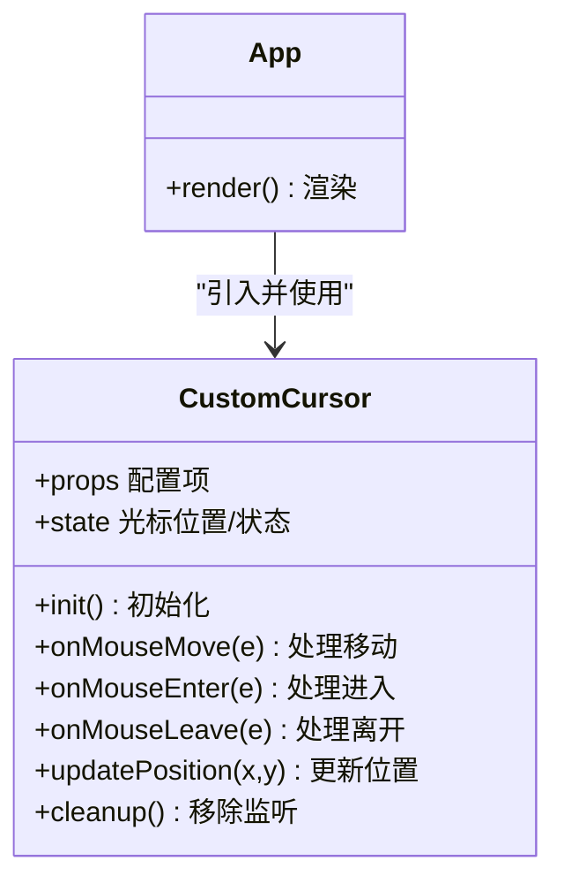
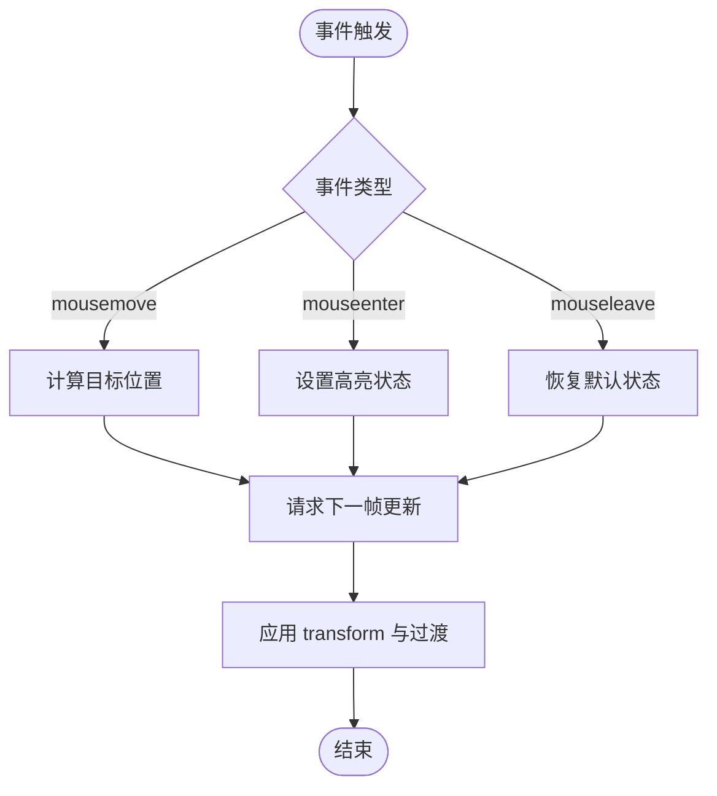
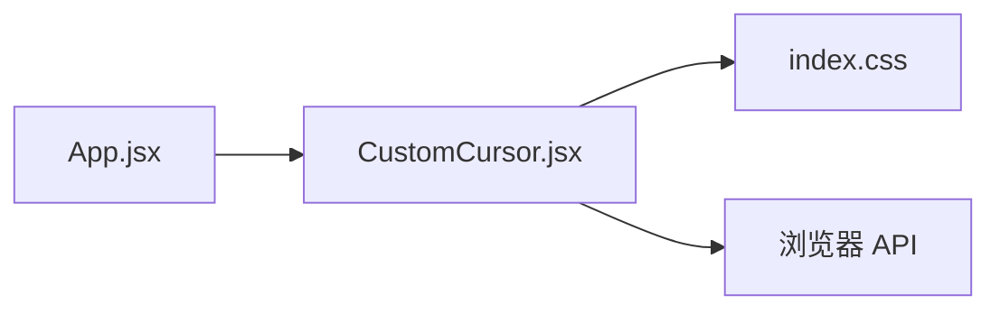

# 自定义光标组件

<cite>
**本文引用的文件**   
- [CustomCursor.jsx](file://src/components/ui/CustomCursor.jsx)
- [App.jsx](file://src/App.jsx)
- [index.css](file://src/index.css)
</cite>

## 更新摘要
**变更内容**   
- 更新了性能优化章节，重点介绍requestAnimationFrame的使用和内存管理策略
- 增强了鼠标事件监听机制的详细说明，包括mousemove、mouseenter、mouseleave事件的捕获和处理
- 完善了光标跟随动画的实现原理，解释CSS变换和JavaScript动画的结合使用
- 补充了响应式设计适配方案，说明移动端触摸事件的处理方法
- 提供了完整的使用示例和集成指南

## 目录
1. [简介](#简介)
2. [项目结构](#项目结构)
3. [核心组件](#核心组件)
4. [架构总览](#架构总览)
5. [详细组件分析](#详细组件分析)
6. [依赖关系分析](#依赖关系分析)
7. [性能考量](#性能考量)
8. [故障排查指南](#故障排查指南)
9. [结论](#结论)
10. [附录](#附录)

## 简介
本文件围绕"自定义光标组件"进行系统化文档化，重点覆盖：
- 鼠标事件监听机制（mousemove、mouseenter、mouseleave）的捕获与处理策略
- 光标跟随动画的实现原理，包括 CSS 变换与 JavaScript 动画的结合方式
- 视觉样式定制（大小、颜色、形状等）与属性选项说明
- 性能优化策略（requestAnimationFrame、内存管理、节流/防抖）
- 响应式设计与移动端触摸事件适配方案
- 完整使用示例与集成指南，展示在不同场景下的应用方法

## 项目结构
本项目采用 React + Vite 的前端工程结构。自定义光标组件位于 UI 子模块中，并在应用入口处按需引入与挂载。

图表来源
- [App.jsx](file://src/App.jsx)
- [CustomCursor.jsx](file://src/components/ui/CustomCursor.jsx)
- [index.css](file://src/index.css)

章节来源
- [App.jsx](file://src/App.jsx)
- [CustomCursor.jsx](file://src/components/ui/CustomCursor.jsx)
- [index.css](file://src/index.css)

## 核心组件
- 自定义光标组件负责：
  - 监听鼠标移动与进入/离开目标区域的事件
  - 驱动光标元素的位置更新与过渡动画
  - 提供可配置的视觉属性（如尺寸、颜色、圆角、透明度等）
  - 在移动端或无指针设备时隐藏默认光标并切换为触摸交互模式

章节来源
- [CustomCursor.jsx](file://src/components/ui/CustomCursor.jsx)

## 架构总览
整体交互流程如下：应用启动后，光标组件注册全局事件监听器；当用户移动鼠标或进入/离开特定区域时，组件根据配置计算新位置与状态，并通过 requestAnimationFrame 平滑更新 DOM 样式，最终实现流畅的光标跟随效果。

图表来源
- [App.jsx](file://src/App.jsx)
- [CustomCursor.jsx](file://src/components/ui/CustomCursor.jsx)
- [index.css](file://src/index.css)

## 详细组件分析

### 组件类图（代码级关系）
该组件以函数式组件形式组织，内部维护光标状态与配置项，并通过副作用完成事件绑定与清理。

图表来源
- [CustomCursor.jsx](file://src/components/ui/CustomCursor.jsx)
- [App.jsx](file://src/App.jsx)

章节来源
- [CustomCursor.jsx](file://src/components/ui/CustomCursor.jsx)
- [App.jsx](file://src/App.jsx)

### 鼠标事件监听机制
- 事件类型
  - mousemove：用于实时追踪鼠标坐标，驱动光标位置更新
  - mouseenter：用于进入可交互区域时的状态切换（如放大、变色）
  - mouseleave：用于离开可交互区域时的状态恢复
- 捕获与处理要点
  - 在组件挂载时添加事件监听，卸载时移除监听，避免内存泄漏
  - 对高频事件进行节流或合并到 requestAnimationFrame 中，降低主线程压力
  - 针对可交互元素（按钮、链接、卡片等）设置数据标记，便于统一判断是否进入高亮区域

章节来源
- [CustomCursor.jsx](file://src/components/ui/CustomCursor.jsx)

### 光标跟随动画实现原理
- 核心思路
  - 使用 CSS transform 的 translate 进行位移，减少重排与重绘开销
  - 结合 CSS transition 实现平滑过渡，或在 JS 侧使用 requestAnimationFrame 逐帧插值
- 关键步骤
  - 计算目标坐标（屏幕坐标或相对容器坐标）
  - 将目标坐标写入光标元素的 transform 属性
  - 通过 transition 或缓动函数控制动画曲线与时长
- 注意事项
  - 避免频繁修改布局相关属性（如 width/height/top/left），优先使用 transform
  - 合理设置 will-change 以提升合成层优先级，但需适度使用以避免内存占用过高

章节来源
- [CustomCursor.jsx](file://src/components/ui/CustomCursor.jsx)
- [index.css](file://src/index.css)

### 视觉样式定制与属性选项
- 常见配置项
  - 尺寸：宽度、高度、圆角
  - 颜色：填充色、描边色、透明度
  - 行为：跟随延迟、缩放比例、过渡时长
  - 可见性：桌面端显示、移动端隐藏
- 样式组织建议
  - 将基础样式放入全局样式表，按主题变量管理颜色与尺寸
  - 通过 props 传入动态样式，保持组件的可复用性与灵活性

章节来源
- [CustomCursor.jsx](file://src/components/ui/CustomCursor.jsx)
- [index.css](file://src/index.css)

### 响应式设计与移动端触摸事件适配
- 检测能力
  - 通过指针能力检测或媒体查询判断是否为触摸设备
  - 在无指针设备或移动端隐藏自定义光标，回退至系统光标
- 触摸事件
  - touchstart/touchmove/touchend 用于模拟鼠标交互
  - 将触摸坐标映射为光标位置，保持与桌面端一致的体验
- 性能与安全
  - 移动端尽量减少 DOM 操作频率，必要时使用节流
  - 注意滚动与手势冲突，避免误触导致的光标抖动

章节来源
- [CustomCursor.jsx](file://src/components/ui/CustomCursor.jsx)

### 复杂逻辑流程图（事件与动画）

图表来源
- [CustomCursor.jsx](file://src/components/ui/CustomCursor.jsx)

## 依赖关系分析
- 组件耦合
  - 自定义光标组件与 App 解耦，通过 props 接收配置，便于在不同页面复用
  - 样式与逻辑分离，CSS 仅负责外观与过渡，JS 负责事件与状态
- 外部依赖
  - 浏览器原生 API：addEventListener/removeEventListener、requestAnimationFrame
  - CSS 特性：transform、transition、will-change

图表来源
- [App.jsx](file://src/App.jsx)
- [CustomCursor.jsx](file://src/components/ui/CustomCursor.jsx)
- [index.css](file://src/index.css)

章节来源
- [App.jsx](file://src/App.jsx)
- [CustomCursor.jsx](file://src/components/ui/CustomCursor.jsx)
- [index.css](file://src/index.css)

## 性能考量
- 使用 requestAnimationFrame
  - 将位置更新与样式变更集中到每帧回调中，保证与屏幕刷新同步，避免掉帧
  - 通过 requestAnimationFrame 确保动画在最佳时机执行，提升渲染性能
- 节流与合并
  - 对 mousemove 等高频率事件进行节流，减少不必要的计算与 DOM 访问
  - 使用防抖技术处理频繁的鼠标事件，避免过度渲染
- 内存管理
  - 在组件卸载时移除所有事件监听器，防止闭包导致的内存泄漏
  - 谨慎使用 will-change，仅在需要时启用，并在不需要时及时移除
  - 及时清理定时器和其他异步任务，避免内存累积
- 样式优化
  - 优先使用 transform 与 opacity 进行动画，避免触发重排
  - 合理使用 CSS transition，避免过度复杂的动画组合
  - 利用 GPU 加速属性（如 transform、opacity）提升渲染性能
- 性能监控
  - 使用浏览器性能面板分析帧率与主线程耗时
  - 监控内存使用情况，及时发现内存泄漏问题
  - 定期测试不同设备和浏览器的性能表现

**更新** 新增了详细的性能优化策略，包括requestAnimationFrame的具体使用方法、内存管理最佳实践和性能监控建议

## 故障排查指南
- 常见问题
  - 光标不跟随：检查事件监听是否正确注册与移除，确认坐标计算逻辑
  - 动画卡顿：确认是否使用了 transform 与 transition，是否存在大量重排
  - 移动端异常：确认是否进行了指针能力检测，触摸事件是否被正确映射
  - 内存泄漏：检查组件卸载时是否正确清理事件监听器和定时器
- 调试建议
  - 在关键路径打印日志，观察事件触发频率与状态变化
  - 使用浏览器性能面板分析帧率与主线程耗时
  - 逐步关闭 will-change 与复杂过渡，定位性能瓶颈
  - 使用React DevTools检查组件渲染次数和性能指标

**更新** 增加了内存泄漏相关的故障排查内容和调试建议

## 结论
自定义光标组件通过事件监听与 CSS/JS 动画协同，实现了流畅且可定制的交互体验。遵循性能优化与响应式设计原则，可在多端设备上保持一致的用户感受。建议在项目中以配置化的方式集成，并根据业务需求扩展交互行为与视觉效果。

## 附录

### 使用示例与集成指南
- 基本集成
  - 在应用入口引入并挂载自定义光标组件
  - 通过 props 配置尺寸、颜色、过渡时长等参数
- 场景化应用
  - 导航栏与按钮：进入时放大并改变颜色，增强可点击感
  - 卡片与图片：悬停时轻微缩放与阴影变化，提升层次感
  - 表单输入：聚焦时边框高亮与光标形态变化，提升可用性
- 最佳实践
  - 为可交互元素添加统一的数据标记，便于统一处理
  - 在移动端禁用自定义光标，确保触控体验不受影响
  - 定期审查性能指标，确保动画流畅与资源占用合理
  - 使用性能监控工具持续优化用户体验

**更新** 增加了最佳实践中的性能监控建议

章节来源
- [App.jsx](file://src/App.jsx)
- [CustomCursor.jsx](file://src/components/ui/CustomCursor.jsx)
- [index.css](file://src/index.css)