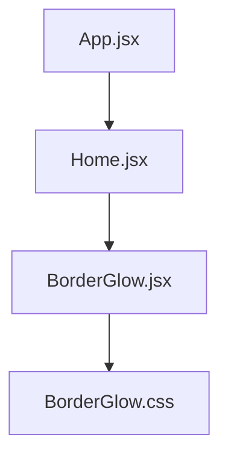
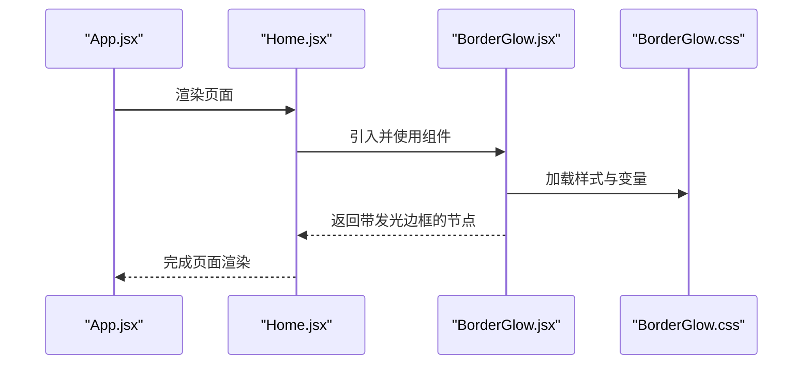
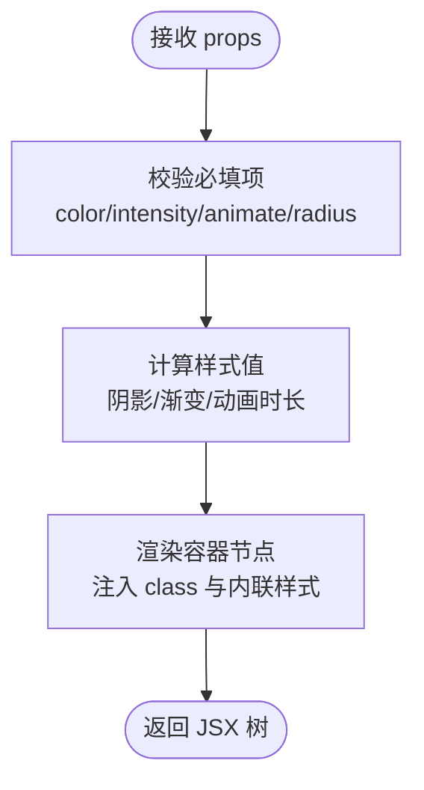
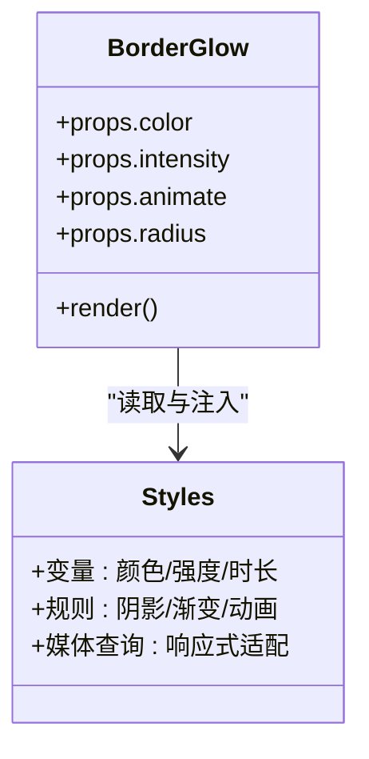
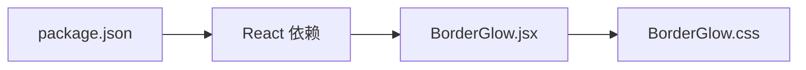

# 边框发光组件

<cite>
**本文引用的文件**   
- [src/components/ui/BorderGlow.jsx](file://src/components/ui/BorderGlow.jsx)
- [src/components/ui/BorderGlow.css](file://src/components/ui/BorderGlow.css)
- [src/App.jsx](file://src/App.jsx)
- [src/Home.jsx](file://src/Home.jsx)
- [package.json](file://package.json)
</cite>

## 目录
1. [简介](#简介)
2. [项目结构](#项目结构)
3. [核心组件](#核心组件)
4. [架构总览](#架构总览)
5. [详细组件分析](#详细组件分析)
6. [依赖分析](#依赖分析)
7. [性能考虑](#性能考虑)
8. [故障排查指南](#故障排查指南)
9. [结论](#结论)
10. [附录](#附录)

## 简介
本文件聚焦于“边框发光”UI 组件，说明其职责、使用方式、样式机制与集成要点。该组件通过 CSS 实现边框光晕效果，适用于卡片、按钮等需要强调边界的元素，提供可配置的发光颜色、强度与动画节奏，便于在项目中复用与扩展。

## 项目结构
与边框发光相关的代码位于 UI 子目录中，包含 React 组件与对应样式：
- 组件入口：src/components/ui/BorderGlow.jsx
- 样式定义：src/components/ui/BorderGlow.css
- 可能的页面级引用：src/App.jsx、src/Home.jsx（根据实际引入情况）

图表来源
- [src/App.jsx](file://src/App.jsx)
- [src/Home.jsx](file://src/Home.jsx)
- [src/components/ui/BorderGlow.jsx](file://src/components/ui/BorderGlow.jsx)
- [src/components/ui/BorderGlow.css](file://src/components/ui/BorderGlow.css)

章节来源
- [src/components/ui/BorderGlow.jsx](file://src/components/ui/BorderGlow.jsx)
- [src/components/ui/BorderGlow.css](file://src/components/ui/BorderGlow.css)
- [src/App.jsx](file://src/App.jsx)
- [src/Home.jsx](file://src/Home.jsx)

## 核心组件
- 组件名称：BorderGlow
- 作用：为任意子元素添加可配置的边框发光效果，支持颜色、强度、动画等属性控制。
- 典型用法：作为容器包裹卡片或内容块，传入主题色与动画参数即可生效。
- 样式策略：基于 CSS 变量与伪元素/阴影组合实现，避免复杂布局开销。

章节来源
- [src/components/ui/BorderGlow.jsx](file://src/components/ui/BorderGlow.jsx)
- [src/components/ui/BorderGlow.css](file://src/components/ui/BorderGlow.css)

## 架构总览
从应用层到组件层的调用关系如下：
- App 作为根组件加载页面路由或模块
- Home 承载具体页面内容，按需引入 BorderGlow
- BorderGlow 负责渲染带发光边框的容器，并注入样式

图表来源
- [src/App.jsx](file://src/App.jsx)
- [src/Home.jsx](file://src/Home.jsx)
- [src/components/ui/BorderGlow.jsx](file://src/components/ui/BorderGlow.jsx)
- [src/components/ui/BorderGlow.css](file://src/components/ui/BorderGlow.css)

## 详细组件分析

### 组件 API 与数据流
- 输入属性（建议）
  - color：发光主色（如十六进制或 HSL）
  - intensity：发光强度（影响阴影半径与透明度）
  - animate：是否启用呼吸/脉冲动画
  - radius：圆角大小
  - className：外部类名覆盖
- 内部状态
  - 无；纯展示型组件，行为由 props 驱动
- 输出
  - 渲染一个带发光边框的容器，内部透传 children

章节来源
- [src/components/ui/BorderGlow.jsx](file://src/components/ui/BorderGlow.jsx)
- [src/components/ui/BorderGlow.css](file://src/components/ui/BorderGlow.css)

### 样式机制与关键规则
- 变量与主题
  - 通过 CSS 变量集中管理颜色、强度、动画时长，便于全局替换
- 发光实现
  - 使用多层 box-shadow 叠加与半透明渐变，形成柔和光晕
  - 可选伪元素实现动态扫光/呼吸效果
- 兼容性与降级
  - 对不支持高级特性的浏览器提供静态阴影降级方案

图表来源
- [src/components/ui/BorderGlow.jsx](file://src/components/ui/BorderGlow.jsx)
- [src/components/ui/BorderGlow.css](file://src/components/ui/BorderGlow.css)

章节来源
- [src/components/ui/BorderGlow.css](file://src/components/ui/BorderGlow.css)

### 使用示例路径
- 在页面中引入并使用组件的路径参考：
  - [src/Home.jsx](file://src/Home.jsx)
  - [src/App.jsx](file://src/App.jsx)

章节来源
- [src/Home.jsx](file://src/Home.jsx)
- [src/App.jsx](file://src/App.jsx)

## 依赖分析
- 运行时依赖
  - React 生态（JSX、组件化）
- 样式依赖
  - 原生 CSS 变量与动画，无需额外样式库
- 构建与打包
  - 由包管理器与构建工具处理导入与样式注入

图表来源
- [package.json](file://package.json)
- [src/components/ui/BorderGlow.jsx](file://src/components/ui/BorderGlow.jsx)
- [src/components/ui/BorderGlow.css](file://src/components/ui/BorderGlow.css)

章节来源
- [package.json](file://package.json)

## 性能考虑
- 动画性能
  - 优先使用 transform 与 opacity 进行动画，减少重排与重绘
  - 合理设置动画时长与循环次数，避免过度消耗 GPU/CPU
- 阴影成本
  - 多层阴影在高密度列表场景下可能带来性能压力，建议限制并发数量或降低强度
- 样式隔离
  - 使用限定选择器与命名空间，避免全局污染导致的重复计算

[本节为通用指导，不直接分析具体文件]

## 故障排查指南
- 发光未显示
  - 检查组件是否正确引入与渲染
  - 确认样式文件已加载且未被覆盖
  - 验证 color 与 intensity 取值有效
- 动画卡顿
  - 减少同时出现的发光组件数量
  - 降低动画频率或关闭非首屏区域的动画
- 主题不一致
  - 统一通过 CSS 变量管理颜色，避免硬编码
- 兼容性异常
  - 针对旧浏览器回退为静态阴影，确保基础可读性

章节来源
- [src/components/ui/BorderGlow.jsx](file://src/components/ui/BorderGlow.jsx)
- [src/components/ui/BorderGlow.css](file://src/components/ui/BorderGlow.css)

## 结论
边框发光组件以轻量 CSS 为核心，结合 React 组件化封装，提供了易用、可配置、可扩展的视觉增强能力。建议在项目中统一通过 CSS 变量管理主题，并在高负载场景下谨慎使用动画与多层阴影，以获得更优的性能表现。

## 附录
- 快速上手
  - 在页面文件中引入组件并传入必要属性
  - 通过 CSS 变量调整全局主题
- 最佳实践
  - 将常用配色与强度封装为默认主题
  - 为不同屏幕尺寸提供差异化动画策略

[本节为概念性补充，不直接分析具体文件]