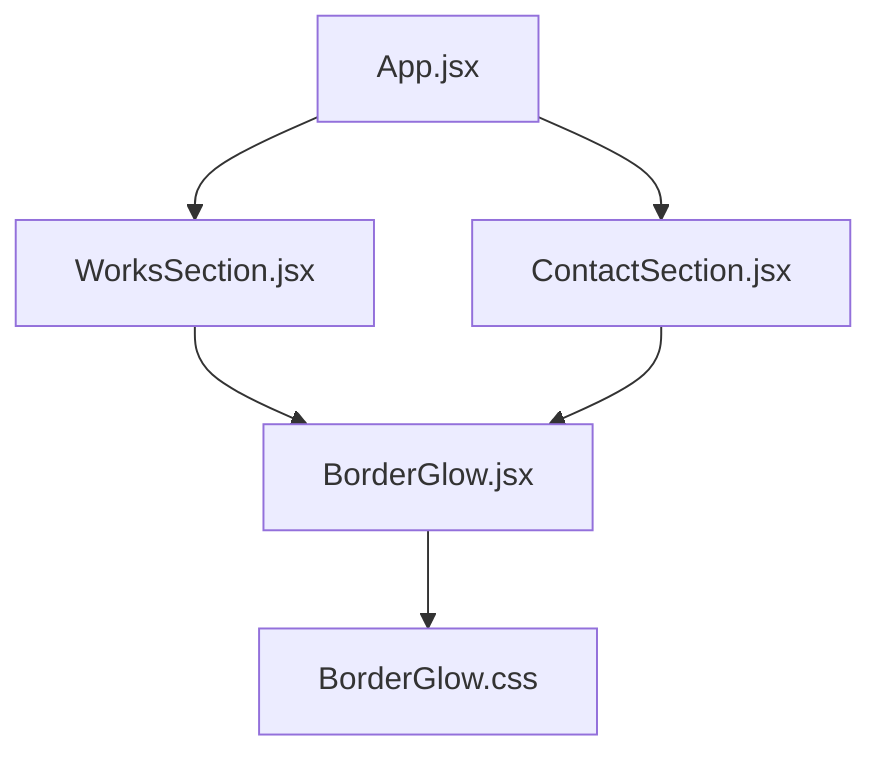
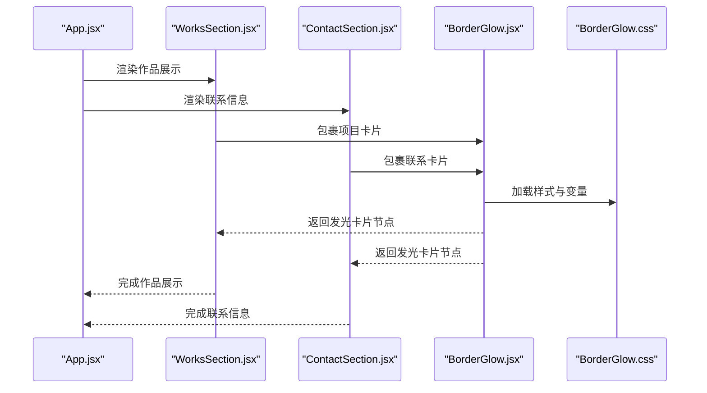
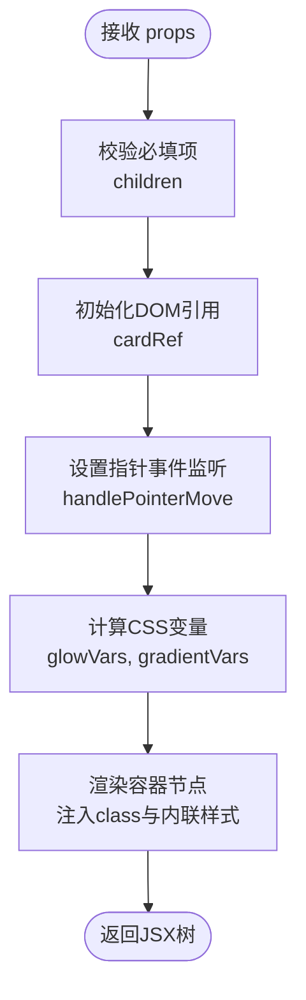
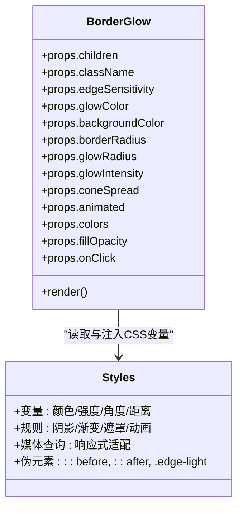
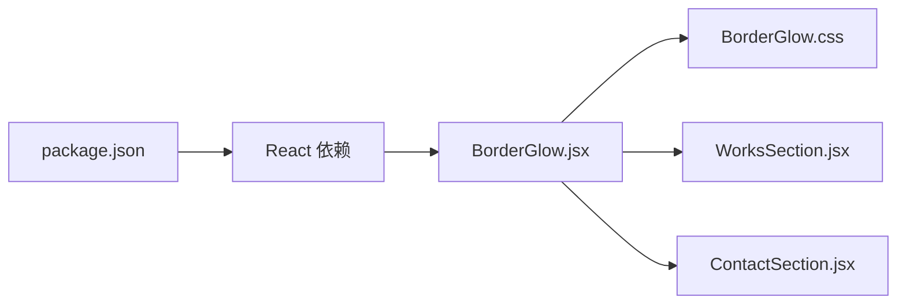

# 边框发光组件

<cite>
**本文引用的文件**   
- [src/components/ui/BorderGlow.jsx](file://src/components/ui/BorderGlow.jsx)
- [src/components/ui/BorderGlow.css](file://src/components/ui/BorderGlow.css)
- [src/App.jsx](file://src/App.jsx)
- [src/components/ContactSection.jsx](file://src/components/ContactSection.jsx)
- [src/components/WorksSection.jsx](file://src/components/WorksSection.jsx)
</cite>

## 更新摘要
**所做更改**   
- 更新了组件架构以反映BorderGlow作为主要卡片包装器的角色
- 添加了与ContactSection和WorksSection集成的详细说明
- 增强了API文档以包含新的指针跟踪和网格渐变功能
- 更新了使用示例以展示在实际项目中的应用

## 目录
1. [简介](#简介)
2. [项目结构](#项目结构)
3. [核心组件](#核心组件)
4. [架构总览](#架构总览)
5. [详细组件分析](#详细组件分析)
6. [依赖分析](#依赖分析)
7. [性能考虑](#性能考虑)
8. [故障排查指南](#故障排查指南)
9. [结论](#结论)
10. [附录](#附录)

## 简介
边框发光组件是一个高级的React UI组件，提供指针跟踪的网格渐变边缘光效。该组件通过CSS变量驱动，在鼠标移动时动态计算边缘距离和角度，实现柔和的彩色光晕效果。它现已成为项目中所有卡片元素的统一包装器，替代了之前使用的HoloCard组件，为ContactSection和WorksSection等模块提供一致的视觉体验。

## 项目结构
边框发光组件位于UI子目录中，包含增强的React组件和复杂的CSS样式：
- 组件入口：src/components/ui/BorderGlow.jsx
- 样式定义：src/components/ui/BorderGlow.css
- 集成点：src/components/ContactSection.jsx、src/components/WorksSection.jsx



**图表来源**
- [src/App.jsx](file://src/App.jsx)
- [src/components/WorksSection.jsx](file://src/components/WorksSection.jsx)
- [src/components/ContactSection.jsx](file://src/components/ContactSection.jsx)
- [src/components/ui/BorderGlow.jsx](file://src/components/ui/BorderGlow.jsx)
- [src/components/ui/BorderGlow.css](file://src/components/ui/BorderGlow.css)

**章节来源**
- [src/components/ui/BorderGlow.jsx](file://src/components/ui/BorderGlow.jsx)
- [src/components/ui/BorderGlow.css](file://src/components/ui/BorderGlow.css)
- [src/components/ContactSection.jsx](file://src/components/ContactSection.jsx)
- [src/components/WorksSection.jsx](file://src/components/WorksSection.jsx)

## 核心组件
- **组件名称**：BorderGlow
- **核心功能**：为任意子元素添加智能边框发光效果，支持指针跟踪、网格渐变和外发光
- **典型用法**：作为容器包裹卡片或内容块，配置主题色、动画参数和交互行为
- **技术特点**：基于CSS变量和指针事件驱动，纯函数式组件设计

**章节来源**
- [src/components/ui/BorderGlow.jsx](file://src/components/ui/BorderGlow.jsx)
- [src/components/ui/BorderGlow.css](file://src/components/ui/BorderGlow.css)

## 架构总览
从应用层到组件层的调用关系体现了BorderGlow作为统一视觉组件的角色：
- App作为根组件加载各个页面模块
- WorksSection和ContactSection等模块引入BorderGlow作为卡片包装器
- BorderGlow负责渲染带智能发光边框的容器，并通过CSS变量控制视觉效果



**图表来源**
- [src/App.jsx](file://src/App.jsx)
- [src/components/WorksSection.jsx](file://src/components/WorksSection.jsx)
- [src/components/ContactSection.jsx](file://src/components/ContactSection.jsx)
- [src/components/ui/BorderGlow.jsx](file://src/components/ui/BorderGlow.jsx)
- [src/components/ui/BorderGlow.css](file://src/components/ui/BorderGlow.css)

## 详细组件分析

### 组件API与数据流
BorderGlow组件提供了丰富的属性配置选项：

**输入属性**
- `children`：卡片内容（必需）
- `className`：额外类名
- `edgeSensitivity`：边缘光敏感度（默认30）
- `glowColor`：外发光颜色，HSL格式（如'40 80 80'）
- `backgroundColor`：卡片底色（默认'#120F17'）
- `borderRadius`：圆角大小（默认28px）
- `glowRadius`：外发光扩散半径（默认40px）
- `glowIntensity`：发光强度（0~1+，默认1.0）
- `coneSpread`：描边光锥宽度（默认25）
- `animated`：是否启用入场动画
- `colors`：mesh渐变取色数组（默认['#c084fc', '#f472b6', '#38bdf8']）
- `fillOpacity`：近边填充强度（默认0.5）
- `onClick`：点击回调函数

**内部状态**
- 无外部状态；纯展示型组件，所有行为由props和指针事件驱动
- 使用useRef管理DOM引用，useCallback优化事件处理函数

**输出**
- 渲染一个带智能发光边框的容器，内部透传children内容



**章节来源**
- [src/components/ui/BorderGlow.jsx](file://src/components/ui/BorderGlow.jsx)
- [src/components/ui/BorderGlow.css](file://src/components/ui/BorderGlow.css)

### 样式机制与关键规则
BorderGlow的样式系统基于CSS变量和现代CSS特性：

**变量与主题**
- 通过CSS变量集中管理颜色、强度、动画时长等配置
- 支持运行时动态修改，实现响应式主题切换

**发光实现**
- 使用多层box-shadow叠加与半透明渐变，形成柔和光晕
- 结合conic-gradient和mask-image实现指针跟踪的光锥效果
- 三层结构：边框渐变、背景填充、外发光层

**动画与交互**
- pointermove事件驱动边缘距离和角度计算
- 平滑过渡动画，离开时自动淡出
- 可选入场动画，挂载时自动扫一圈



**图表来源**
- [src/components/ui/BorderGlow.jsx](file://src/components/ui/BorderGlow.jsx)
- [src/components/ui/BorderGlow.css](file://src/components/ui/BorderGlow.css)

**章节来源**
- [src/components/ui/BorderGlow.css](file://src/components/ui/BorderGlow.css)

### 实际使用示例
BorderGlow已在多个组件中得到广泛应用：

**ContactSection中的使用**
```jsx
<BorderGlow
 key={idx}
 className="contact-info-card"
 backgroundColor="#0a0814"
 borderRadius={18}
>
 <div className="contact-card-icon">
   {item.icon}
 </div>
 <span className="contact-card-label">{item.label}</span>
 <span className="contact-card-value">{item.value}</span>
</BorderGlow>
```

**WorksSection中的使用**
```jsx
<BorderGlow
 className="work-card"
 backgroundColor="#0a0814"
 borderRadius={20}
 onClick={() => onSelect(project)}
>
 <div className="card-accent-line" style={{ background: project.color }} />
 <div className="card-header">...</div>
 <div className="card-body">...</div>
 <div className="card-footer">...</div>
</BorderGlow>
```

**章节来源**
- [src/components/ContactSection.jsx](file://src/components/ContactSection.jsx)
- [src/components/WorksSection.jsx](file://src/components/WorksSection.jsx)

## 依赖分析
BorderGlow组件的依赖关系简洁明了：

**运行时依赖**
- React生态（JSX、Hooks、组件化）
- 无其他第三方库依赖

**样式依赖**
- 原生CSS变量与现代CSS特性
- 无需额外样式库或预处理器

**构建与打包**
- 由包管理器与构建工具处理导入与样式注入
- CSS文件自动随组件加载



**图表来源**
- [src/components/ui/BorderGlow.jsx](file://src/components/ui/BorderGlow.jsx)
- [src/components/ui/BorderGlow.css](file://src/components/ui/BorderGlow.css)
- [src/components/WorksSection.jsx](file://src/components/WorksSection.jsx)
- [src/components/ContactSection.jsx](file://src/components/ContactSection.jsx)

**章节来源**
- [src/components/ui/BorderGlow.jsx](file://src/components/ui/BorderGlow.jsx)

## 性能考虑
BorderGlow组件在设计时充分考虑了性能优化：

**动画性能**
- 优先使用transform和opacity进行动画，减少重排与重绘
- 合理设置动画时长与循环次数，避免过度消耗GPU/CPU
- 使用requestAnimationFrame确保流畅的动画帧率

**内存管理**
- 使用useCallback缓存事件处理函数，避免不必要的重新创建
- 及时清理事件监听器和定时器
- 合理使用useRef避免重复计算

**渲染优化**
- 纯函数式组件设计，无状态开销
- CSS变量驱动样式更新，减少JavaScript计算
- 条件渲染动画效果，非首屏区域可禁用动画

**兼容性考虑**
- 对不支持高级特性的浏览器提供静态阴影降级方案
- 使用现代CSS特性时注意回退策略

## 故障排查指南
遇到BorderGlow组件问题时，可按以下步骤排查：

**发光未显示**
- 检查组件是否正确引入与渲染
- 确认样式文件已加载且未被覆盖
- 验证color与intensity取值有效
- 检查pointermove事件是否正常触发

**动画卡顿**
- 减少同时出现的发光组件数量
- 降低动画频率或关闭非首屏区域的动画
- 检查是否有大量DOM操作影响性能

**主题不一致**
- 统一通过CSS变量管理颜色，避免硬编码
- 检查不同组件间的样式优先级冲突
- 确认全局样式未覆盖组件样式

**交互异常**
- 检查pointermove事件绑定是否正确
- 验证getBoundingClientRect计算是否准确
- 确认元素尺寸和位置信息正常

**章节来源**
- [src/components/ui/BorderGlow.jsx](file://src/components/ui/BorderGlow.jsx)
- [src/components/ui/BorderGlow.css](file://src/components/ui/BorderGlow.css)

## 结论
BorderGlow组件作为项目的核心UI组件，成功替代了之前的HoloCard组件，为ContactSection和WorksSection等模块提供了统一的视觉体验。其基于CSS变量的设计模式确保了良好的性能和可维护性，指针跟踪功能为用户提供了丰富的交互体验。建议在项目开发中继续使用此组件，并根据需要扩展其功能以适应更多场景。

## 附录
**快速上手**
- 在页面文件中引入组件并传入必要属性
- 通过CSS变量调整全局主题
- 利用pointer事件实现自定义交互逻辑

**最佳实践**
- 将常用配色与强度封装为默认主题
- 为不同屏幕尺寸提供差异化动画策略
- 合理使用动画开关，平衡视觉效果与性能
- 遵循组件API设计规范，保持接口一致性

**扩展建议**
- 可添加更多预设主题和动画效果
- 支持触摸设备的手势交互
- 提供无障碍访问支持
- 增加性能监控和优化指标