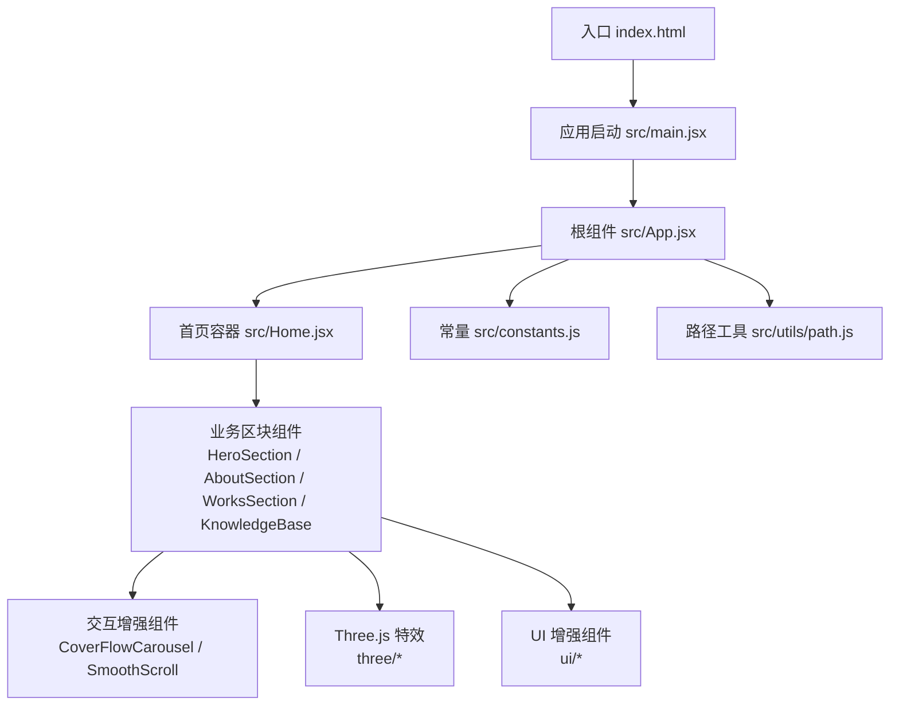
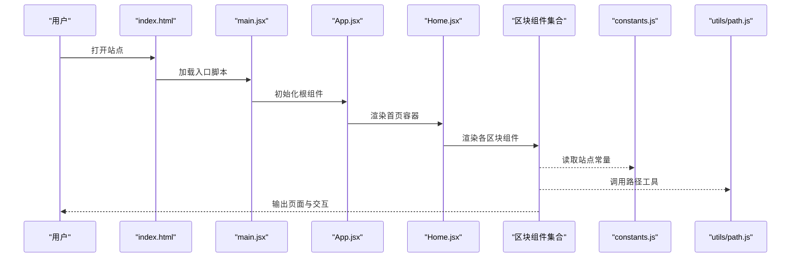
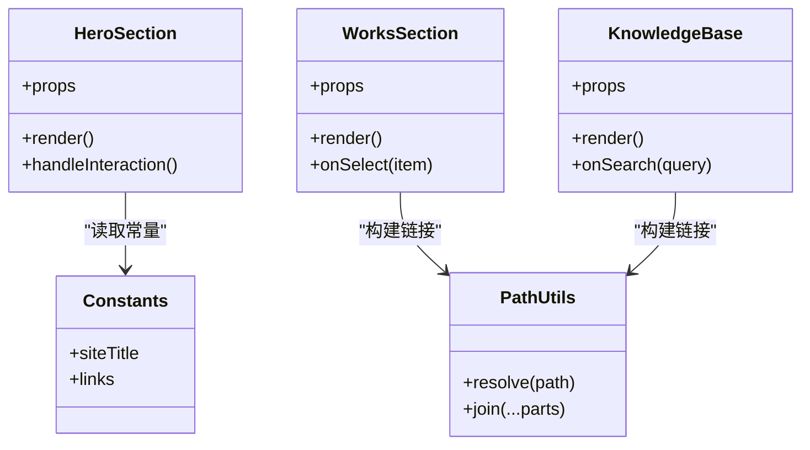
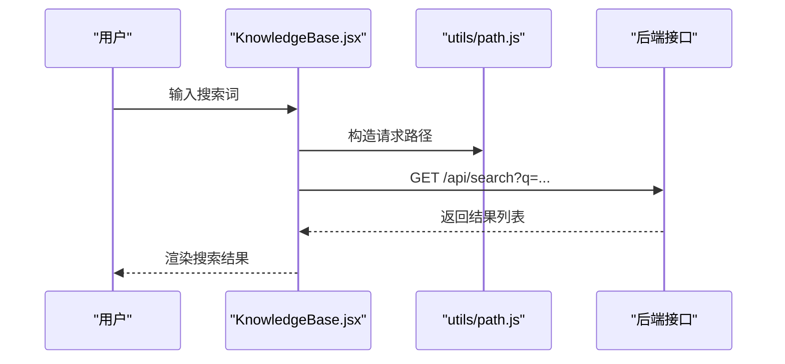
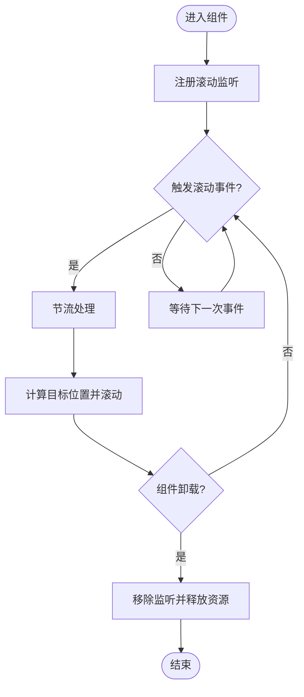
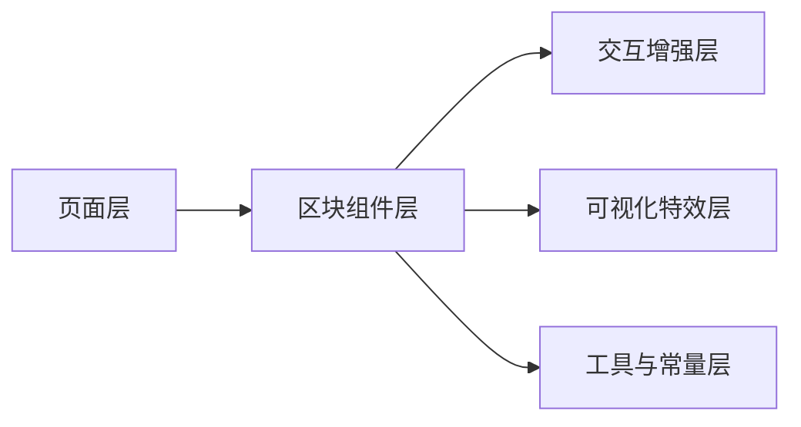
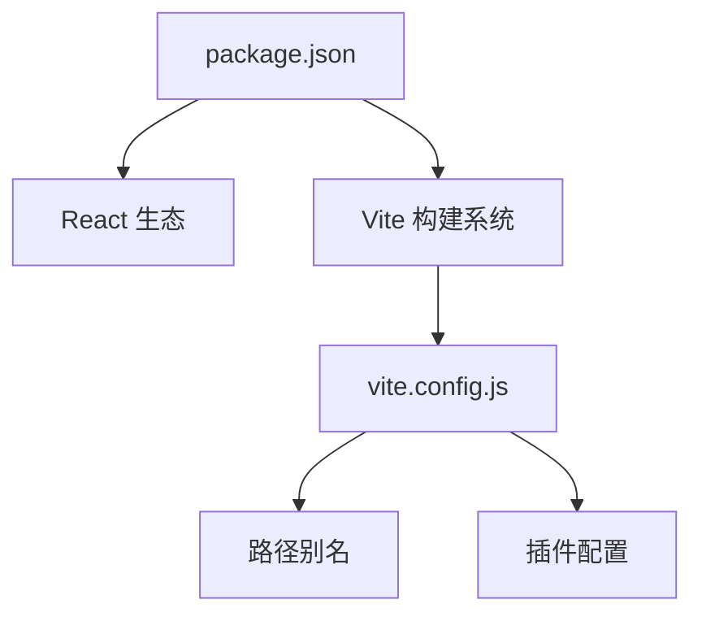

# 开发指南

<cite>
**本文引用的文件**   
- [package.json](file://package.json)
- [vite.config.js](file://vite.config.js)
- [index.html](file://index.html)
- [src/main.jsx](file://src/main.jsx)
- [src/App.jsx](file://src/App.jsx)
- [src/Home.jsx](file://src/Home.jsx)
- [src/constants.js](file://src/constants.js)
- [src/utils/path.js](file://src/utils/path.js)
- [src/components/HeroSection.jsx](file://src/components/HeroSection.jsx)
- [src/components/AboutSection.jsx](file://src/components/AboutSection.jsx)
- [src/components/WorksSection.jsx](file://src/components/WorksSection.jsx)
- [src/components/KnowledgeBase.jsx](file://src/components/KnowledgeBase.jsx)
- [src/components/CoverFlowCarousel.jsx](file://src/components/CoverFlowCarousel.jsx)
- [src/components/SmoothScroll.jsx](file://src/components/SmoothScroll.jsx)
- [src/components/three/ParticleHero.jsx](file://src/components/three/ParticleHero.jsx)
- [src/components/ui/TiltCard.jsx](file://src/components/ui/TiltCard.jsx)
</cite>

## 目录
1. [简介](#简介)
2. [项目结构](#项目结构)
3. [核心组件](#核心组件)
4. [架构总览](#架构总览)
5. [详细组件分析](#详细组件分析)
6. [依赖分析](#依赖分析)
7. [性能考虑](#性能考虑)
8. [故障排除指南](#故障排除指南)
9. [结论](#结论)
10. [附录](#附录)

## 简介
本指南面向贡献者，提供从环境搭建到提交代码的完整开发工作流程与规范。内容涵盖：
- JavaScript/JSX 编码规范、命名约定与注释标准
- React 组件设计原则、Props 设计与事件处理模式
- Git 工作流与版本控制规范（分支策略、提交信息、代码审查）
- 调试技巧与开发工具使用（浏览器调试、React DevTools、VS Code 配置）
- 测试策略与单元测试编写指南
- 项目结构扩展与新功能开发的标准流程
- 常见问题排查与故障排除方法

目标：帮助团队高效协作、统一风格、稳定交付。

## 项目结构
本项目基于 Vite + React，采用“按功能组织”的结构方式，页面级组件位于 src/components，通用 UI 与 Three.js 特效分别位于 ui 与 three 子目录，静态资源与常量在 assets 与 constants.js 中管理。

图表来源
- [index.html:1-20](file://index.html#L1-L20)
- [src/main.jsx:1-30](file://src/main.jsx#L1-L30)
- [src/App.jsx:1-40](file://src/App.jsx#L1-L40)
- [src/Home.jsx:1-40](file://src/Home.jsx#L1-L40)
- [src/components/HeroSection.jsx:1-40](file://src/components/HeroSection.jsx#L1-L40)
- [src/components/AboutSection.jsx:1-40](file://src/components/AboutSection.jsx#L1-L40)
- [src/components/WorksSection.jsx:1-40](file://src/components/WorksSection.jsx#L1-L40)
- [src/components/KnowledgeBase.jsx:1-40](file://src/components/KnowledgeBase.jsx#L1-L40)
- [src/components/CoverFlowCarousel.jsx:1-40](file://src/components/CoverFlowCarousel.jsx#L1-L40)
- [src/components/SmoothScroll.jsx:1-40](file://src/components/SmoothScroll.jsx#L1-L40)
- [src/components/three/ParticleHero.jsx:1-40](file://src/components/three/ParticleHero.jsx#L1-L40)
- [src/components/ui/TiltCard.jsx:1-40](file://src/components/ui/TiltCard.jsx#L1-L40)
- [src/constants.js:1-40](file://src/constants.js#L1-L40)
- [src/utils/path.js:1-40](file://src/utils/path.js#L1-L40)

章节来源
- [package.json:1-40](file://package.json#L1-L40)
- [vite.config.js:1-40](file://vite.config.js#L1-L40)
- [index.html:1-20](file://index.html#L1-L20)
- [src/main.jsx:1-30](file://src/main.jsx#L1-L30)
- [src/App.jsx:1-40](file://src/App.jsx#L1-L40)
- [src/Home.jsx:1-40](file://src/Home.jsx#L1-L40)
- [src/constants.js:1-40](file://src/constants.js#L1-L40)
- [src/utils/path.js:1-40](file://src/utils/path.js#L1-L40)

## 核心组件
本节概述关键组件的职责与协作关系，便于新成员快速理解数据与渲染流向。

- 应用入口与路由
  - main.jsx：创建 React 根节点并挂载到 DOM。
  - App.jsx：定义全局样式与布局，组合页面模块。
  - Home.jsx：作为首页容器，聚合各区块组件。

- 页面区块
  - HeroSection.jsx：首屏视觉与引导交互。
  - AboutSection.jsx：个人介绍与概览。
  - WorksSection.jsx：作品展示与导航。
  - KnowledgeBase.jsx：知识库或文章列表。

- 交互与增强
  - CoverFlowCarousel.jsx：封面流式轮播。
  - SmoothScroll.jsx：平滑滚动行为封装。
  - TiltCard.jsx：卡片倾斜动效。
  - ParticleHero.jsx：Three.js 粒子英雄区。

- 支撑模块
  - constants.js：站点常量（如标题、链接等）。
  - utils/path.js：路径解析与拼接工具。

章节来源
- [src/main.jsx:1-30](file://src/main.jsx#L1-L30)
- [src/App.jsx:1-40](file://src/App.jsx#L1-L40)
- [src/Home.jsx:1-40](file://src/Home.jsx#L1-L40)
- [src/components/HeroSection.jsx:1-40](file://src/components/HeroSection.jsx#L1-L40)
- [src/components/AboutSection.jsx:1-40](file://src/components/AboutSection.jsx#L1-L40)
- [src/components/WorksSection.jsx:1-40](file://src/components/WorksSection.jsx#L1-L40)
- [src/components/KnowledgeBase.jsx:1-40](file://src/components/KnowledgeBase.jsx#L1-L40)
- [src/components/CoverFlowCarousel.jsx:1-40](file://src/components/CoverFlowCarousel.jsx#L1-L40)
- [src/components/SmoothScroll.jsx:1-40](file://src/components/SmoothScroll.jsx#L1-L40)
- [src/components/ui/TiltCard.jsx:1-40](file://src/components/ui/TiltCard.jsx#L1-L40)
- [src/components/three/ParticleHero.jsx:1-40](file://src/components/three/ParticleHero.jsx#L1-L40)
- [src/constants.js:1-40](file://src/constants.js#L1-L40)
- [src/utils/path.js:1-40](file://src/utils/path.js#L1-L40)

## 架构总览
下图展示了从 HTML 到 React 组件树的加载与渲染流程，以及关键依赖关系。

图表来源
- [index.html:1-20](file://index.html#L1-L20)
- [src/main.jsx:1-30](file://src/main.jsx#L1-L30)
- [src/App.jsx:1-40](file://src/App.jsx#L1-L40)
- [src/Home.jsx:1-40](file://src/Home.jsx#L1-L40)
- [src/constants.js:1-40](file://src/constants.js#L1-L40)
- [src/utils/path.js:1-40](file://src/utils/path.js#L1-L40)

## 详细组件分析

### 组件设计规范与最佳实践
- 组件职责单一
  - 每个组件只负责一个明确的展示或交互职责，避免“上帝组件”。
- Props 设计
  - 明确必填与可选字段；为复杂对象提供默认值与 PropTypes 校验（若启用）。
  - 将可复用的状态提升到父组件，保持子组件无状态或最小状态。
- 事件处理
  - 使用稳定的回调函数引用，避免不必要的重渲染。
  - 对高频事件进行节流/防抖处理（例如滚动、拖拽）。
- 副作用与生命周期
  - 使用 useEffect 集中管理副作用，清理资源（监听器、定时器、动画帧）。
- 可访问性
  - 为交互元素提供语义化标签与 aria-* 属性，确保键盘可达。
- 样式组织
  - 组件级样式文件与组件同名存放，避免全局污染。
- 性能优化
  - 合理使用 useMemo/useCallback；大列表虚拟化；图片懒加载。

章节来源
- [src/components/HeroSection.jsx:1-40](file://src/components/HeroSection.jsx#L1-L40)
- [src/components/AboutSection.jsx:1-40](file://src/components/AboutSection.jsx#L1-L40)
- [src/components/WorksSection.jsx:1-40](file://src/components/WorksSection.jsx#L1-L40)
- [src/components/KnowledgeBase.jsx:1-40](file://src/components/KnowledgeBase.jsx#L1-L40)
- [src/components/CoverFlowCarousel.jsx:1-40](file://src/components/CoverFlowCarousel.jsx#L1-L40)
- [src/components/SmoothScroll.jsx:1-40](file://src/components/SmoothScroll.jsx#L1-L40)
- [src/components/ui/TiltCard.jsx:1-40](file://src/components/ui/TiltCard.jsx#L1-L40)

### 组件类图（以三个代表性组件为例）

图表来源
- [src/components/HeroSection.jsx:1-40](file://src/components/HeroSection.jsx#L1-L40)
- [src/components/WorksSection.jsx:1-40](file://src/components/WorksSection.jsx#L1-L40)
- [src/components/KnowledgeBase.jsx:1-40](file://src/components/KnowledgeBase.jsx#L1-L40)
- [src/constants.js:1-40](file://src/constants.js#L1-L40)
- [src/utils/path.js:1-40](file://src/utils/path.js#L1-L40)

### API/服务组件序列图（知识检索示例）

图表来源
- [src/components/KnowledgeBase.jsx:1-40](file://src/components/KnowledgeBase.jsx#L1-L40)
- [src/utils/path.js:1-40](file://src/utils/path.js#L1-L40)

### 复杂逻辑流程图（平滑滚动实现思路）

图表来源
- [src/components/SmoothScroll.jsx:1-40](file://src/components/SmoothScroll.jsx#L1-L40)

### 概念总览（不绑定具体源码）

[此图为概念示意，无需图表来源]

## 依赖分析
- 构建与运行
  - package.json：声明依赖与脚本命令（安装、开发、构建、预览）。
  - vite.config.js：Vite 构建配置（别名、插件、代理等）。
- 运行时依赖
  - React、ReactDOM、Three.js 生态（如有）、CSS 工具链等。
- 内部依赖
  - 组件间通过 props 与事件通信；常量与工具函数被多处复用。

图表来源
- [package.json:1-40](file://package.json#L1-L40)
- [vite.config.js:1-40](file://vite.config.js#L1-L40)

章节来源
- [package.json:1-40](file://package.json#L1-L40)
- [vite.config.js:1-40](file://vite.config.js#L1-L40)

## 性能考虑
- 渲染优化
  - 拆分大组件，减少不必要的全局状态更新。
  - 使用 memoization 缓存昂贵计算结果。
- 资源加载
  - 图片与模型按需加载与懒加载；预加载关键资源。
- 动画与 3D
  - 限制同时运行的动画数量；合理设置渲染分辨率与抗锯齿。
- 网络请求
  - 合并请求、缓存策略、错误重试与超时控制。
- 构建产物
  - 开启代码分割与压缩；按需引入第三方库。

[本节为通用指导，无需章节来源]

## 故障排除指南
- 常见环境问题
  - Node 版本不匹配：根据 package.json 指定版本安装。
  - 端口占用：修改开发服务器端口或终止占用进程。
- 构建失败
  - 检查 vite.config.js 中的别名与插件是否正确。
  - 清理 node_modules 后重新安装依赖。
- 运行时错误
  - 使用浏览器开发者工具定位报错堆栈。
  - 使用 React DevTools 检查组件树与状态。
- 样式问题
  - 确认 CSS 作用域与优先级；避免全局覆盖。
- 3D 场景异常
  - 检查纹理与模型路径；确认 WebGL 支持。

章节来源
- [vite.config.js:1-40](file://vite.config.js#L1-L40)
- [src/main.jsx:1-30](file://src/main.jsx#L1-L30)
- [src/App.jsx:1-40](file://src/App.jsx#L1-L40)

## 结论
遵循本指南的规范与流程，有助于提升团队协作效率与代码质量。建议在新功能开发与重构时同步更新相关文档与测试用例，保持项目长期可维护性。

[本节为总结，无需章节来源]

## 附录

### 一、开发环境与工具
- 环境要求
  - Node.js 版本：参考 package.json 指定版本。
  - 包管理器：npm/yarn/pnpm（任选其一，保持一致）。
- 本地开发
  - 安装依赖：执行安装脚本。
  - 启动开发服务器：执行开发脚本。
  - 构建生产包：执行构建脚本。
- VS Code 推荐配置
  - 编辑器：ESLint、Prettier、Stylelint、React 插件。
  - 保存时自动格式化与修复。
  - 启用 TypeScript/JavaScript 类型检查（如适用）。

章节来源
- [package.json:1-40](file://package.json#L1-L40)

### 二、代码规范与风格指南
- 语言与语法
  - JavaScript/JSX：遵循现代语法与 ESLint 规则。
  - 缩进与换行：统一 2 空格缩进；行宽建议 100 字符。
- 命名约定
  - 变量与函数：camelCase。
  - 组件与类型：PascalCase。
  - 常量：UPPER_SNAKE_CASE。
  - 文件：组件文件 PascalCase.jsx；工具文件 camelCase.js。
- 注释标准
  - 公共函数与复杂逻辑添加说明注释。
  - 重要决策与边界条件需记录原因。
- 导入与导出
  - 分组导入：第三方库、内部模块、样式文件。
  - 显式导出，避免隐式全局。
- 错误处理
  - 对外部请求与异步操作增加 try/catch 与友好提示。
  - 日志分级输出，避免泄露敏感信息。

章节来源
- [src/App.jsx:1-40](file://src/App.jsx#L1-L40)
- [src/constants.js:1-40](file://src/constants.js#L1-L40)
- [src/utils/path.js:1-40](file://src/utils/path.js#L1-L40)

### 三、Git 工作流与版本控制
- 分支策略
  - main：生产可用分支。
  - develop：集成开发分支。
  - feature/*：新功能分支。
  - fix/*：缺陷修复分支。
  - hotfix/*：紧急修复分支。
- 提交信息规范
  - 格式：type(scope): subject
  - type：feat、fix、docs、style、refactor、perf、test、build、ci、chore、revert。
  - 描述清晰、动词开头、不超过 72 字符。
- 代码审查流程
  - 提交 PR/MR，关联任务单。
  - 至少一名 reviewer 批准后方可合并。
  - CI 通过后合并至目标分支。
- 标签与发布
  - 使用语义化版本号（SemVer）。
  - 发布前完成回归测试与变更日志更新。

[本节为通用流程，无需章节来源]

### 四、调试技巧与开发工具
- 浏览器调试
  - Sources 面板断点调试；Network 面板查看请求。
  - Performance 面板分析卡顿与内存泄漏。
- React DevTools
  - 检查组件树、Props 与 State。
  - Profiler 分析渲染性能。
- 日志与埋点
  - 使用 console 分级输出；生产环境关闭冗余日志。
  - 关键用户行为埋点用于后续分析。

[本节为通用指导，无需章节来源]

### 五、测试策略与单元测试
- 测试分层
  - 单元测试：组件与工具函数。
  - 集成测试：关键业务流程。
  - 端到端测试：核心用户路径。
- 工具选择
  - Jest/Vitest + React Testing Library。
  - Playwright/Cypress 做 E2E。
- 编写要点
  - 以用户视角编写用例，关注行为而非实现细节。
  - Mock 外部依赖（网络、时间、随机数）。
  - 覆盖率阈值与持续集成。
- 示例流程（知识检索）
  - 模拟输入与点击，断言渲染结果与网络请求。

章节来源
- [src/components/KnowledgeBase.jsx:1-40](file://src/components/KnowledgeBase.jsx#L1-L40)
- [src/utils/path.js:1-40](file://src/utils/path.js#L1-L40)

### 六、项目结构扩展与新功能开发流程
- 新增页面
  - 在 components 下新建页面组件，并在 App/Home 中注册。
  - 如需路由，可在 App 中配置路由映射。
- 新增通用组件
  - 放入 components/ui 或 components/three（视用途而定）。
  - 提供清晰的 Props 定义与示例用法。
- 新增工具与常量
  - 在 utils 与 constants 中新增，并在 README 或组件注释中说明。
- 提交与审查
  - 遵循 Git 规范与 PR 流程，附带必要截图或演示。

章节来源
- [src/App.jsx:1-40](file://src/App.jsx#L1-L40)
- [src/Home.jsx:1-40](file://src/Home.jsx#L1-L40)
- [src/components/ui/TiltCard.jsx:1-40](file://src/components/ui/TiltCard.jsx#L1-L40)
- [src/components/three/ParticleHero.jsx:1-40](file://src/components/three/ParticleHero.jsx#L1-L40)
- [src/constants.js:1-40](file://src/constants.js#L1-L40)
- [src/utils/path.js:1-40](file://src/utils/path.js#L1-L40)