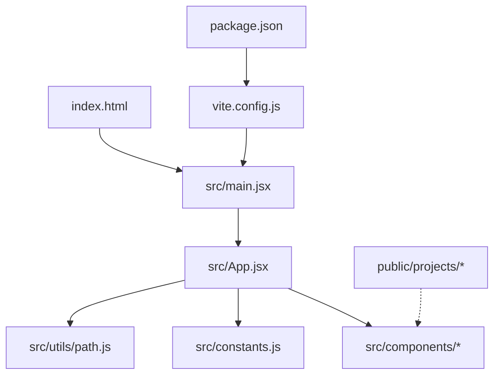
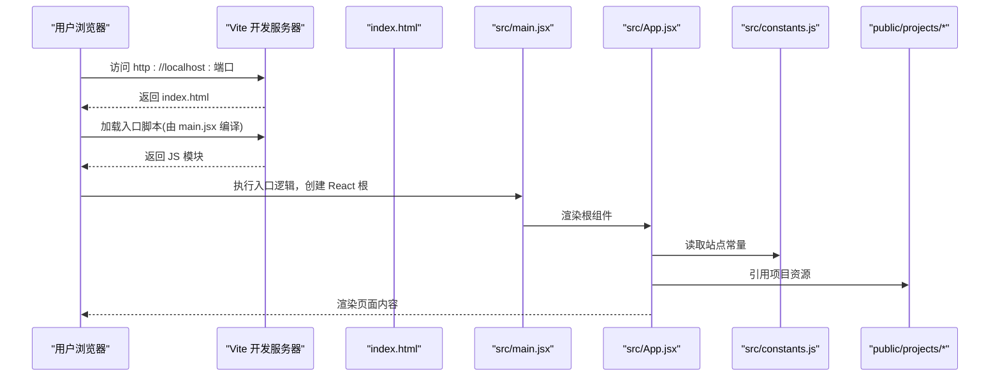
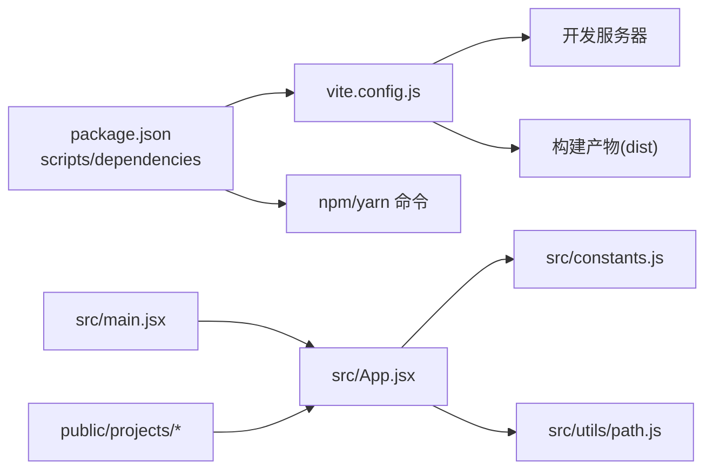

# 快速开始

<cite>
**本文引用的文件**   
- [package.json](file://package.json)
- [vite.config.js](file://vite.config.js)
- [index.html](file://index.html)
- [src/main.jsx](file://src/main.jsx)
- [src/App.jsx](file://src/App.jsx)
- [src/constants.js](file://src/constants.js)
- [src/utils/path.js](file://src/utils/path.js)
- [README.md](file://README.md)
</cite>

## 目录
1. [简介](#简介)
2. [项目结构](#项目结构)
3. [核心组件](#核心组件)
4. [架构总览](#架构总览)
5. [详细组件分析](#详细组件分析)
6. [依赖分析](#依赖分析)
7. [性能考虑](#性能考虑)
8. [故障排除指南](#故障排除指南)
9. [结论](#结论)
10. [附录](#附录)

## 简介
本快速开始指南面向初次接触 Goodent 个人作品集项目的开发者，目标是帮助你在最短时间内完成环境准备、安装依赖、启动开发服务器与构建生产包。文档同时提供目录结构与关键配置说明、常见问题排查方法以及基础自定义方式（如修改站点信息、添加新项目），兼顾初学者友好性与进阶技术细节。

## 项目结构
本项目采用基于 Vite + React 的前端工程化方案，主要目录与职责如下：
- public/projects：静态项目资源目录，用于存放各项目的图片、文档等素材，便于在页面中引用。
- src：源码目录
  - assets：通用静态资源（样式、字体、图标等）
  - components：业务组件与 UI 组件，包含 Three.js 相关可视化组件
  - utils：工具函数（路径处理等）
  - main.jsx：应用入口，挂载根组件到 DOM
  - App.jsx：应用根组件，组织路由/布局/全局状态
  - constants.js：站点常量与元信息（站点名、描述、社交链接等）
  - index.css：全局样式
  - Home.jsx：首页或主视图容器
- vite.config.js：Vite 构建与开发服务器配置
- index.html：HTML 模板，作为 SPA 的入口页
- package.json：项目元数据、脚本命令与依赖声明
- README.md：项目说明与使用说明

图表来源
- [index.html:1-50](file://index.html#L1-L50)
- [src/main.jsx:1-40](file://src/main.jsx#L1-L40)
- [src/App.jsx:1-60](file://src/App.jsx#L1-L60)
- [src/constants.js:1-40](file://src/constants.js#L1-L40)
- [src/utils/path.js:1-40](file://src/utils/path.js#L1-L40)
- [vite.config.js:1-40](file://vite.config.js#L1-L40)
- [package.json:1-40](file://package.json#L1-L40)

章节来源
- [package.json:1-40](file://package.json#L1-L40)
- [vite.config.js:1-40](file://vite.config.js#L1-L40)
- [index.html:1-50](file://index.html#L1-L50)
- [src/main.jsx:1-40](file://src/main.jsx#L1-L40)
- [src/App.jsx:1-60](file://src/App.jsx#L1-L60)
- [src/constants.js:1-40](file://src/constants.js#L1-L40)
- [src/utils/path.js:1-40](file://src/utils/path.js#L1-L40)

## 核心组件
- 应用入口与挂载
  - 入口 HTML 提供空壳 DOM 节点；main.jsx 负责创建 React 根并挂载到该节点。
  - App.jsx 作为根组件，组合页面布局、导航与内容区域，并引入站点常量与工具函数。
- 站点信息与常量
  - constants.js 集中管理站点标题、描述、作者、社交链接等元信息，便于统一修改。
- 资源与路径
  - public/projects 下按项目分目录存放素材，utils/path.js 提供路径拼接与规范化能力，避免跨平台差异。
- 构建与开发
  - vite.config.js 定义开发服务器端口、代理、插件与构建产物输出目录等。
  - package.json 中的 scripts 提供常用命令：安装依赖、启动开发服务、构建生产包等。

章节来源
- [src/main.jsx:1-40](file://src/main.jsx#L1-L40)
- [src/App.jsx:1-60](file://src/App.jsx#L1-L60)
- [src/constants.js:1-40](file://src/constants.js#L1-L40)
- [src/utils/path.js:1-40](file://src/utils/path.js#L1-L40)
- [vite.config.js:1-40](file://vite.config.js#L1-L40)
- [package.json:1-40](file://package.json#L1-L40)

## 架构总览
下图展示了从浏览器请求到 React 渲染的关键流程，以及配置文件的作用点。

图表来源
- [index.html:1-50](file://index.html#L1-L50)
- [src/main.jsx:1-40](file://src/main.jsx#L1-L40)
- [src/App.jsx:1-60](file://src/App.jsx#L1-L60)
- [src/constants.js:1-40](file://src/constants.js#L1-L40)
- [vite.config.js:1-40](file://vite.config.js#L1-L40)

## 详细组件分析

### 环境与依赖准备
- Node.js 版本
  - 请根据 package.json 中的 engines 字段要求选择匹配的 Node.js 版本。若未指定，建议使用当前长期支持版本（LTS）。
- 包管理器
  - 推荐使用 npm 或 yarn。若使用 yarn，请在后续命令前替换为对应命令。
- 本地端口占用
  - 若默认端口被占用，可在 vite.config.js 中调整开发服务器端口，或在命令行通过环境变量覆盖。

章节来源
- [package.json:1-40](file://package.json#L1-L40)
- [vite.config.js:1-40](file://vite.config.js#L1-L40)

### 安装与运行
- 安装依赖
  - 在项目根目录执行安装命令，等待依赖下载完成。
- 启动开发服务器
  - 执行开发命令后，打开浏览器访问提示的本地地址即可预览。
- 构建生产包
  - 执行构建命令生成优化后的静态资源，通常输出至 dist 目录，可直接部署到任意静态托管服务。

章节来源
- [package.json:1-40](file://package.json#L1-L40)

### 目录结构与关键配置说明
- index.html
  - 作为 SPA 的 HTML 模板，提供根节点与基本 meta 信息。
- vite.config.js
  - 配置开发服务器、构建选项、插件与别名等。
- package.json
  - 声明依赖与脚本命令，是项目运行的核心清单。
- src/main.jsx
  - 应用入口，负责初始化 React 并挂载到 DOM。
- src/App.jsx
  - 根组件，组织页面结构与子组件。
- src/constants.js
  - 站点元信息与全局常量，建议在此处维护站点名称、描述、作者、社交链接等。
- src/utils/path.js
  - 路径工具函数，用于安全地拼接与解析资源路径。
- public/projects
  - 项目素材目录，可按需新增子目录与文件，并在组件中按需引用。

章节来源
- [index.html:1-50](file://index.html#L1-L50)
- [vite.config.js:1-40](file://vite.config.js#L1-L40)
- [package.json:1-40](file://package.json#L1-L40)
- [src/main.jsx:1-40](file://src/main.jsx#L1-L40)
- [src/App.jsx:1-60](file://src/App.jsx#L1-L60)
- [src/constants.js:1-40](file://src/constants.js#L1-L40)
- [src/utils/path.js:1-40](file://src/utils/path.js#L1-L40)

### 常见自定义方式
- 修改站点信息
  - 在 constants.js 中更新站点标题、描述、作者与社交链接等元信息，保存后热重载即可生效。
- 添加新项目
  - 在 public/projects 下新建项目目录，放入图片、文档等资源；在相应组件中通过路径工具引用这些资源。
- 调整开发服务器端口
  - 在 vite.config.js 中设置端口，或通过命令行参数覆盖。
- 构建产物输出目录
  - 在 vite.config.js 中配置构建输出目录，便于对接不同部署平台。

章节来源
- [src/constants.js:1-40](file://src/constants.js#L1-L40)
- [src/utils/path.js:1-40](file://src/utils/path.js#L1-L40)
- [vite.config.js:1-40](file://vite.config.js#L1-L40)

## 依赖分析
下图展示项目的主要依赖关系与脚本命令流向。

图表来源
- [package.json:1-40](file://package.json#L1-L40)
- [vite.config.js:1-40](file://vite.config.js#L1-L40)
- [src/main.jsx:1-40](file://src/main.jsx#L1-L40)
- [src/App.jsx:1-60](file://src/App.jsx#L1-L60)
- [src/constants.js:1-40](file://src/constants.js#L1-L40)
- [src/utils/path.js:1-40](file://src/utils/path.js#L1-L40)

章节来源
- [package.json:1-40](file://package.json#L1-L40)
- [vite.config.js:1-40](file://vite.config.js#L1-L40)

## 性能考虑
- 资源体积
  - 将大图片或视频资源放在 public/projects 中，按需懒加载，避免首屏阻塞。
- 构建优化
  - 启用代码分割与压缩，合理拆分大型组件与第三方库。
- 缓存策略
  - 利用构建产物的文件名哈希，配合 CDN 缓存提升重复访问速度。
- 网络请求
  - 对接口进行合并与缓存，减少不必要的往返。

[本节为通用指导，不直接分析具体文件]

## 故障排除指南
- 端口被占用
  - 现象：启动时报端口冲突错误。
  - 解决：在 vite.config.js 中修改端口，或通过命令行参数覆盖。
- 依赖安装失败
  - 现象：npm/yarn 报错或卡住。
  - 解决：清理缓存后重试；检查 Node.js 版本是否符合要求；切换镜像源。
- 资源 404
  - 现象：图片、文档等静态资源无法加载。
  - 解决：确认资源位于 public 目录下且路径正确；使用路径工具函数拼接路径。
- 构建产物为空或异常
  - 现象：dist 目录无文件或打包失败。
  - 解决：检查 vite.config.js 的构建配置；确保入口文件存在且可解析。
- 开发服务器热重载不生效
  - 现象：修改代码后页面未刷新。
  - 解决：重启开发服务器；检查浏览器控制台是否有模块加载错误。

章节来源
- [vite.config.js:1-40](file://vite.config.js#L1-L40)
- [package.json:1-40](file://package.json#L1-L40)

## 结论
通过以上步骤，你可以快速搭建并运行 Goodent 个人作品集项目。建议在 constants.js 中统一管理站点信息，在 public/projects 中规范化管理项目素材，结合 vite.config.js 与 package.json 的脚本命令实现高效的开发与构建流程。遇到问题时，优先检查端口、依赖版本与资源路径。

[本节为总结性内容，不直接分析具体文件]

## 附录
- 参考文档
  - README.md：项目背景、功能概览与使用说明。
- 常用命令速查
  - 安装依赖：参见 package.json 中的 scripts。
  - 启动开发服务器：参见 package.json 中的 scripts。
  - 构建生产包：参见 package.json 中的 scripts。

章节来源
- [README.md:1-100](file://README.md#L1-L100)
- [package.json:1-40](file://package.json#L1-L40)