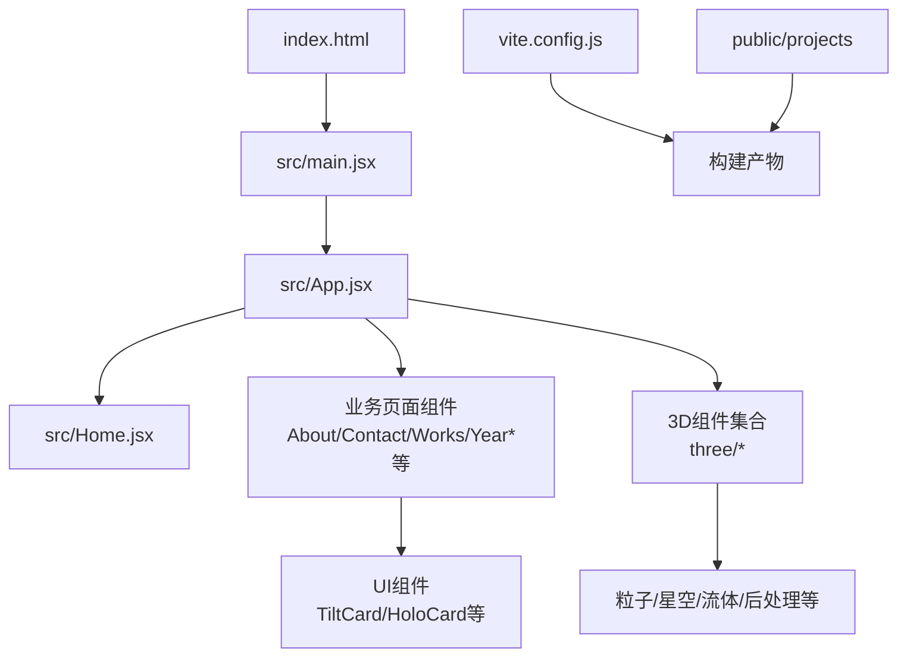
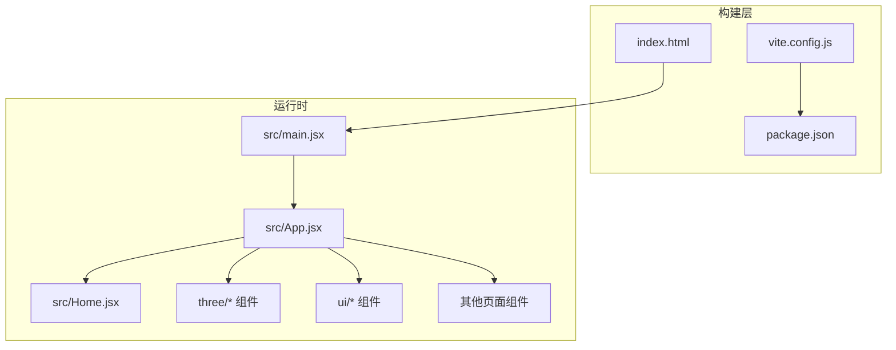
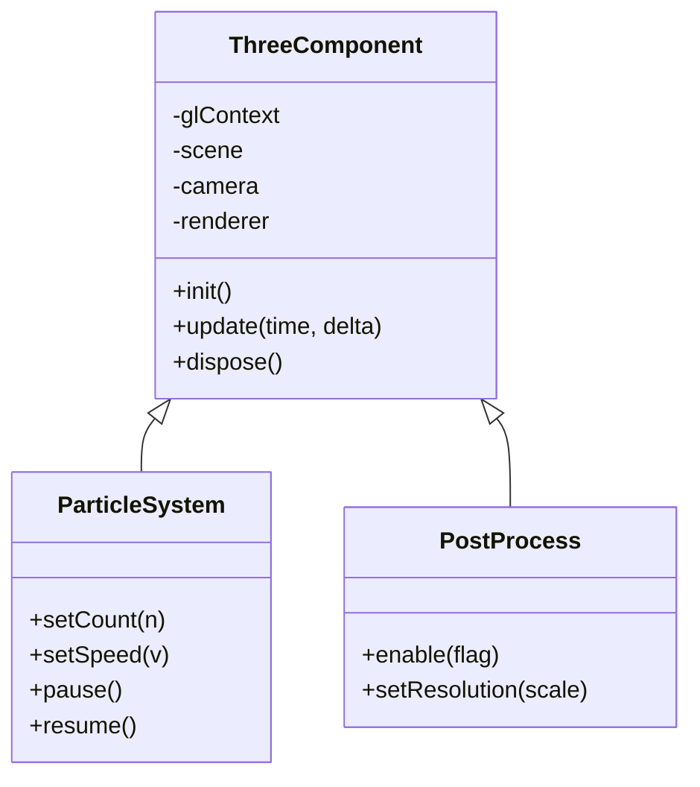
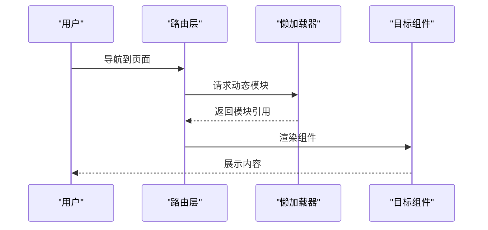
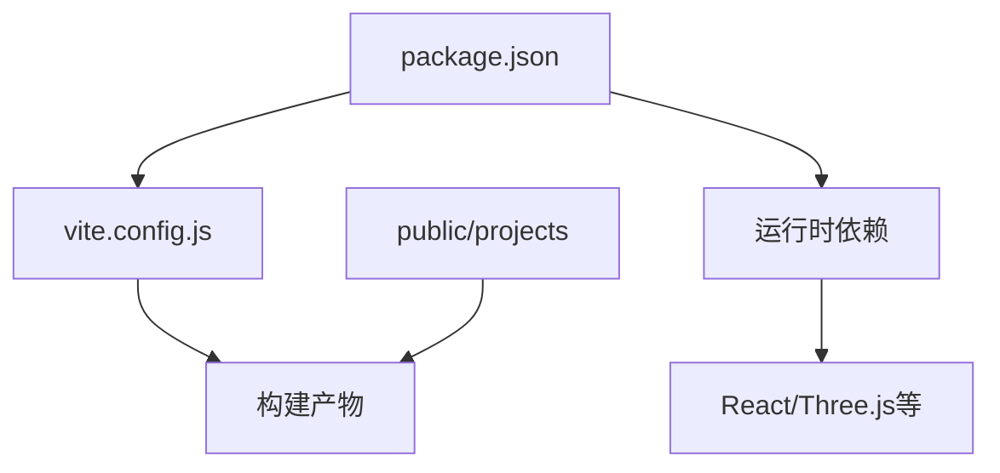

# 性能优化

<cite>
**本文引用的文件**   
- [vite.config.js](file://vite.config.js)
- [package.json](file://package.json)
- [index.html](file://index.html)
- [src/main.jsx](file://src/main.jsx)
- [src/App.jsx](file://src/App.jsx)
- [src/Home.jsx](file://src/Home.jsx)
- [src/constants.js](file://src/constants.js)
- [src/components/three/BlackHoleParticles.jsx](file://src/components/three/BlackHoleParticles.jsx)
- [src/components/three/CosmicField.jsx](file://src/components/three/CosmicField.jsx)
- [src/components/three/CosmicParticles.jsx](file://src/components/three/CosmicParticles.jsx)
- [src/components/three/FluidShader.jsx](file://src/components/three/FluidShader.jsx)
- [src/components/three/GalaxyCluster.jsx](file://src/components/three/GalaxyCluster.jsx)
- [src/components/three/MetallicText.jsx](file://src/components/three/MetallicText.jsx)
- [src/components/three/ParticleHero.jsx](file://src/components/three/ParticleHero.jsx)
- [src/components/three/PortfolioText3D.jsx](file://src/components/three/PortfolioText3D.jsx)
- [src/components/three/PostProcessing.jsx](file://src/components/three/PostProcessing.jsx)
- [src/components/three/PuffedText.jsx](file://src/components/three/PuffedText.jsx)
- [src/components/three/RayMarchedBlackHole.jsx](file://src/components/three/RayMarchedBlackHole.jsx)
- [src/components/three/SaturnParticles.jsx](file://src/components/three/SaturnParticles.jsx)
- [src/components/three/ShootingStars.jsx](file://src/components/three/ShootingStars.jsx)
- [src/components/three/SkyBox.jsx](file://src/components/three/SkyBox.jsx)
- [src/components/three/TerrazzoMaterial.jsx](file://src/components/three/TerrazzoMaterial.jsx)
- [src/components/ui/HoloCard.css](file://src/components/ui/HoloCard.css)
- [src/components/ui/TiltCard.jsx](file://src/components/ui/TiltCard.jsx)
- [src/components/AboutSection.jsx](file://src/components/AboutSection.jsx)
- [src/components/ContactSection.jsx](file://src/components/ContactSection.jsx)
- [src/components/CoverFlowCarousel.jsx](file://src/components/CoverFlowCarousel.jsx)
- [src/components/HeroSection.jsx](file://src/components/HeroSection.jsx)
- [src/components/KnowledgeBase.jsx](file://src/components/KnowledgeBase.jsx)
- [src/components/ProjectDetailModal.jsx](file://src/components/ProjectDetailModal.jsx)
- [src/components/SmoothScroll.jsx](file://src/components/SmoothScroll.jsx)
- [src/components/WorksSection.jsx](file://src/components/WorksSection.jsx)
- [src/components/YearOneProjects.jsx](file://src/components/YearOneProjects.jsx)
- [src/components/YearThreeProjects.jsx](file://src/components/YearThreeProjects.jsx)
</cite>

## 目录
1. [简介](#简介)
2. [项目结构](#项目结构)
3. [核心组件](#核心组件)
4. [架构总览](#架构总览)
5. [详细组件分析](#详细组件分析)
6. [依赖分析](#依赖分析)
7. [性能考量](#性能考量)
8. [故障排查指南](#故障排查指南)
9. [结论](#结论)
10. [附录](#附录)

## 简介
本文件面向Goodent项目的性能优化，围绕构建与打包、代码分割与懒加载、Vite配置优化、3D渲染（WebGL）性能、资源加载与缓存、内存管理、监控与分析、SEO与可访问性、生产部署调优以及测试与优化工作流等维度进行系统化说明。文档以仓库现有实现为依据，结合通用最佳实践给出可落地的建议与流程。

## 项目结构
项目采用React + Vite的前端工程化方案，3D场景集中在src/components/three目录，UI组件位于src/components下，入口与路由在src/main.jsx与src/App.jsx中组织。静态资源与示例素材位于public/projects。

图表来源
- [index.html:1-200](file://index.html#L1-L200)
- [src/main.jsx:1-200](file://src/main.jsx#L1-L200)
- [src/App.jsx:1-200](file://src/App.jsx#L1-L200)
- [src/Home.jsx:1-200](file://src/Home.jsx#L1-L200)
- [vite.config.js:1-200](file://vite.config.js#L1-L200)

章节来源
- [index.html:1-200](file://index.html#L1-L200)
- [src/main.jsx:1-200](file://src/main.jsx#L1-L200)
- [src/App.jsx:1-200](file://src/App.jsx#L1-L200)
- [src/Home.jsx:1-200](file://src/Home.jsx#L1-L200)
- [vite.config.js:1-200](file://vite.config.js#L1-L200)

## 核心组件
- 应用入口与挂载：main.jsx负责创建根节点并挂载App；App.jsx负责全局布局与路由组织；Home.jsx作为首页聚合各模块。
- 3D组件族：three目录下包含大量基于Three.js的可视化组件，如粒子系统、星空背景、流体着色器、后处理、金属文字、射线步进黑洞等。这些组件是渲染性能的关键点。
- UI交互组件：TiltCard、HoloCard等提供微交互动画，需关注动画帧率与重排重绘成本。
- 常量与工具：constants.js集中定义常量，便于统一管理与按需引入。

章节来源
- [src/main.jsx:1-200](file://src/main.jsx#L1-L200)
- [src/App.jsx:1-200](file://src/App.jsx#L1-L200)
- [src/Home.jsx:1-200](file://src/Home.jsx#L1-L200)
- [src/constants.js:1-200](file://src/constants.js#L1-L200)
- [src/components/three/BlackHoleParticles.jsx:1-200](file://src/components/three/BlackHoleParticles.jsx#L1-L200)
- [src/components/three/CosmicField.jsx:1-200](file://src/components/three/CosmicField.jsx#L1-L200)
- [src/components/three/CosmicParticles.jsx:1-200](file://src/components/three/CosmicParticles.jsx#L1-L200)
- [src/components/three/FluidShader.jsx:1-200](file://src/components/three/FluidShader.jsx#L1-L200)
- [src/components/three/GalaxyCluster.jsx:1-200](file://src/components/three/GalaxyCluster.jsx#L1-L200)
- [src/components/three/MetallicText.jsx:1-200](file://src/components/three/MoldText.jsx#L1-L200)
- [src/components/three/ParticleHero.jsx:1-200](file://src/components/three/ParticleHero.jsx#L1-L200)
- [src/components/three/PortfolioText3D.jsx:1-200](file://src/components/three/PortfolioText3D.jsx#L1-L200)
- [src/components/three/PostProcessing.jsx:1-200](file://src/components/three/PostProcessing.jsx#L1-L200)
- [src/components/three/PuffedText.jsx:1-200](file://src/components/three/PuffedText.jsx#L1-L200)
- [src/components/three/RayMarchedBlackHole.jsx:1-200](file://src/components/three/RayMarchedBlackHole.jsx#L1-L200)
- [src/components/three/SaturnParticles.jsx:1-200](file://src/components/three/SaturnParticles.jsx#L1-L200)
- [src/components/three/ShootingStars.jsx:1-200](file://src/components/three/ShootingStars.jsx#L1-L200)
- [src/components/three/SkyBox.jsx:1-200](file://src/components/three/SkyBox.jsx#L1-L200)
- [src/components/three/TerrazzoMaterial.jsx:1-200](file://src/components/three/TerrazzoMaterial.jsx#L1-L200)

## 架构总览
整体架构遵循“轻量入口 + 模块化组件 + 按需加载”的模式。构建阶段由Vite驱动，运行期通过React组件树组织页面，3D能力集中于three子目录，UI动效由独立组件封装。

图表来源
- [vite.config.js:1-200](file://vite.config.js#L1-L200)
- [package.json:1-200](file://package.json#L1-L200)
- [index.html:1-200](file://index.html#L1-L200)
- [src/main.jsx:1-200](file://src/main.jsx#L1-L200)
- [src/App.jsx:1-200](file://src/App.jsx#L1-L200)
- [src/Home.jsx:1-200](file://src/Home.jsx#L1-L200)

## 详细组件分析

### 3D渲染性能优化
- WebGL上下文管理
  - 建议在组件生命周期内显式创建与销毁WebGL上下文，避免重复初始化与泄漏。
  - 使用设备能力检测与降级策略，低性能设备减少粒子数量或关闭后处理。
- 几何体与材质优化
  - 合并相近网格、复用BufferGeometry、减少draw call。
  - 使用纹理图集与压缩格式（如WebP/AVIF），降低带宽与解码开销。
- 着色器与后处理
  - 将复杂计算移至GPU，避免CPU侧频繁更新uniform。
  - 后处理通道按需启用，必要时根据视口分辨率动态调整采样次数。
- LOD与可见性控制
  - 对远距离对象使用简化模型或隐藏细节层级。
  - 利用视锥剔除与距离阈值控制渲染范围。
- 粒子系统与星空效果
  - 使用InstancedMesh或Points批量绘制，减少状态切换。
  - 限制每帧更新量，使用时间步长平滑运动。

图表来源
- [src/components/three/BlackHoleParticles.jsx:1-200](file://src/components/three/BlackHoleParticles.jsx#L1-L200)
- [src/components/three/CosmicField.jsx:1-200](file://src/components/three/CosmicField.jsx#L1-L200)
- [src/components/three/CosmicParticles.jsx:1-200](file://src/components/three/CosmicParticles.jsx#L1-L200)
- [src/components/three/FluidShader.jsx:1-200](file://src/components/three/FluidShader.jsx#L1-L200)
- [src/components/three/GalaxyCluster.jsx:1-200](file://src/components/three/GalaxyCluster.jsx#L1-L200)
- [src/components/three/MetallicText.jsx:1-200](file://src/components/three/MetallicText.jsx#L1-L200)
- [src/components/three/ParticleHero.jsx:1-200](file://src/components/three/ParticleHero.jsx#L1-L200)
- [src/components/three/PortfolioText3D.jsx:1-200](file://src/components/three/PortfolioText3D.jsx#L1-L200)
- [src/components/three/PostProcessing.jsx:1-200](file://src/components/three/PostProcessing.jsx#L1-L200)
- [src/components/three/PuffedText.jsx:1-200](file://src/components/three/PuffedText.jsx#L1-L200)
- [src/components/three/RayMarchedBlackHole.jsx:1-200](file://src/components/three/RayMarchedBlackHole.jsx#L1-L200)
- [src/components/three/SaturnParticles.jsx:1-200](file://src/components/three/SaturnParticles.jsx#L1-L200)
- [src/components/three/ShootingStars.jsx:1-200](file://src/components/three/ShootingStars.jsx#L1-L200)
- [src/components/three/SkyBox.jsx:1-200](file://src/components/three/SkyBox.jsx#L1-L200)
- [src/components/three/TerrazzoMaterial.jsx:1-200](file://src/components/three/TerrazzoMaterial.jsx#L1-L200)

章节来源
- [src/components/three/BlackHoleParticles.jsx:1-200](file://src/components/three/BlackHoleParticles.jsx#L1-L200)
- [src/components/three/FluidShader.jsx:1-200](file://src/components/three/FluidShader.jsx#L1-L200)
- [src/components/three/PostProcessing.jsx:1-200](file://src/components/three/PostProcessing.jsx#L1-L200)
- [src/components/three/RayMarchedBlackHole.jsx:1-200](file://src/components/three/RayMarchedBlackHole.jsx#L1-L200)

### 代码分割与懒加载
- 路由级拆分：对非首屏页面使用动态导入，仅在进入路由时加载对应模块。
- 组件级拆分：对重型3D组件与大型UI组件使用按需加载，结合占位骨架屏提升感知性能。
- 预取与预加载：对高概率访问的路径使用预取策略，平衡首屏与后续体验。

章节来源
- [src/App.jsx:1-200](file://src/App.jsx#L1-L200)
- [src/Home.jsx:1-200](file://src/Home.jsx#L1-L200)

### Vite构建优化配置
- 分包策略：按功能域划分chunk，分离第三方库与业务逻辑，提高缓存命中率。
- 资源优化：开启图片/字体压缩与转换，输出多尺寸与格式变体。
- 构建产物：启用Gzip/Brotli压缩，合理设置缓存头，配合CDN长期缓存。
- 开发体验：热更新与增量编译，按需加载调试信息。

章节来源
- [vite.config.js:1-200](file://vite.config.js#L1-L200)
- [package.json:1-200](file://package.json#L1-L200)

### 资源加载优化
- 图片与媒体
  - 优先使用现代格式（WebP/AVIF），按需生成不同分辨率，结合响应式srcset。
  - 视频与音频使用懒加载与分段传输，避免阻塞首屏。
- CDN与缓存
  - 静态资源上CDN，开启强缓存与协商缓存组合策略。
  - 文件名哈希化，确保变更即失效，未变更资源长期命中缓存。
- 预连接与DNS预解析
  - 对关键域名添加预连接与预解析，缩短握手延迟。

章节来源
- [index.html:1-200](file://index.html#L1-L200)
- [package.json:1-200](file://package.json#L1-L200)

### 内存管理最佳实践
- 对象池
  - 对高频创建销毁的对象（如粒子、临时向量）建立对象池，减少GC压力。
- 垃圾回收
  - 及时释放不再使用的纹理、几何体与监听器，避免隐式引用导致泄漏。
- 泄漏检测
  - 使用浏览器开发者工具的Memory面板进行堆快照对比，定位持续增长的对象。
  - 在组件卸载钩子中执行清理逻辑，确保事件与定时器被移除。

章节来源
- [src/components/three/BlackHoleParticles.jsx:1-200](file://src/components/three/BlackHoleParticles.jsx#L1-L200)
- [src/components/three/FluidShader.jsx:1-200](file://src/components/three/FluidShader.jsx#L1-L200)
- [src/components/three/PostProcessing.jsx:1-200](file://src/components/three/PostProcessing.jsx#L1-L200)

### 性能监控与分析工具
- 浏览器开发者工具
  - Performance面板录制关键路径，识别长任务与掉帧原因。
  - Memory面板进行堆快照与Allocation instrumentation on JS heap snapshot。
  - Network面板分析资源大小、缓存命中与并发限制。
- 指标采集
  - 收集Core Web Vitals（LCP、FID、CLS），上报至监控平台。
  - 针对3D场景记录FPS、Draw Calls、三角面数与纹理内存占用。
- 自动化分析
  - 集成Lighthouse CI与WebPageTest，纳入持续集成流水线。

章节来源
- [src/main.jsx:1-200](file://src/main.jsx#L1-L200)
- [src/App.jsx:1-200](file://src/App.jsx#L1-L200)

### SEO优化与可访问性改进
- SEO
  - 为关键页面提供服务端渲染或预渲染，确保爬虫可索引。
  - 完善meta标签、结构化数据与Open Graph信息。
- 可访问性
  - 为交互元素提供语义化标签与ARIA属性。
  - 支持键盘导航与屏幕阅读器，确保颜色对比度达标。

章节来源
- [index.html:1-200](file://index.html#L1-L200)
- [src/components/AboutSection.jsx:1-200](file://src/components/AboutSection.jsx#L1-L200)
- [src/components/ContactSection.jsx:1-200](file://src/components/ContactSection.jsx#L1-L200)
- [src/components/WorksSection.jsx:1-200](file://src/components/WorksSection.jsx#L1-L200)

### 生产环境部署与调优
- 服务器
  - 启用HTTP/2或HTTP/3，开启Gzip/Brotli压缩。
  - 配置合理的缓存头与ETag，结合CDN边缘缓存。
- 前端
  - 生产构建开启Tree Shaking与代码压缩，剥离调试信息。
  - 对3D资源进行离线预处理与压缩，减少运行时开销。
- 监控
  - 接入错误日志与性能遥测，设置告警阈值与回滚策略。

章节来源
- [vite.config.js:1-200](file://vite.config.js#L1-L200)
- [package.json:1-200](file://package.json#L1-L200)

### 性能测试与优化工作流程
- 基线测量
  - 在稳定网络与设备上录制Performance，记录关键指标。
- 假设与实验
  - 提出优化假设（如减少粒子数量、合并纹理、关闭后处理）。
  - 通过A/B测试验证收益，记录差异与回归风险。
- 回归与发布
  - 将性能预算纳入CI，失败则阻断发布。
  - 灰度发布与快速回滚机制保障稳定性。

章节来源
- [src/components/three/ParticleHero.jsx:1-200](file://src/components/three/ParticleHero.jsx#L1-L200)
- [src/components/ui/TiltCard.jsx:1-200](file://src/components/ui/TiltCard.jsx#L1-L200)

## 依赖分析
- 构建与脚本
  - package.json定义依赖与构建脚本，Vite作为核心构建工具。
- 运行时依赖
  - React生态与Three.js相关库用于渲染与交互。
- 外部资源
  - public下的项目素材与图片，建议迁移至CDN并启用缓存。

图表来源
- [package.json:1-200](file://package.json#L1-L200)
- [vite.config.js:1-200](file://vite.config.js#L1-L200)

章节来源
- [package.json:1-200](file://package.json#L1-L200)
- [vite.config.js:1-200](file://vite.config.js#L1-L200)

## 性能考量
- 首屏加载
  - 最小化初始包体积，关键CSS内联，非关键资源延迟加载。
- 渲染性能
  - 控制3D场景复杂度，合理使用LOD与视锥剔除，避免主线程阻塞。
- 交互流畅度
  - 动画使用requestAnimationFrame，避免频繁DOM操作与强制同步布局。
- 网络效率
  - 资源压缩与分片，合理并行与优先级调度。

[本节为通用指导，不直接分析具体文件]

## 故障排查指南
- 常见症状
  - 首屏卡顿、滚动掉帧、内存持续增长、3D场景崩溃。
- 定位步骤
  - 使用Performance面板定位长任务与重排重绘热点。
  - 使用Memory面板进行堆快照对比，查找泄漏源。
  - 检查Network面板的资源大小与缓存命中情况。
- 修复建议
  - 拆分大组件与懒加载重型模块。
  - 释放WebGL资源与事件监听，避免闭包引用。
  - 优化纹理与几何体，减少draw call与过采样。

章节来源
- [src/components/three/BlackHoleParticles.jsx:1-200](file://src/components/three/BlackHoleParticles.jsx#L1-L200)
- [src/components/three/FluidShader.jsx:1-200](file://src/components/three/FluidShader.jsx#L1-L200)
- [src/components/three/PostProcessing.jsx:1-200](file://src/components/three/PostProcessing.jsx#L1-L200)

## 结论
通过对构建、加载、渲染、内存与监控的全链路优化，Goodent项目可在保证视觉表现的同时显著提升性能与稳定性。建议将性能预算与自动化测试纳入日常开发流程，持续迭代与验证优化效果。

[本节为总结，不直接分析具体文件]

## 附录
- 术语表
  - Draw Call：每次向GPU提交渲染指令的调用。
  - LOD：细节层次，根据距离或重要性切换模型精度。
  - Core Web Vitals：衡量用户体验的核心指标集合。
- 参考清单
  - 浏览器开发者工具手册
  - Vite官方文档
  - Three.js性能优化指南

[本节为补充信息，不直接分析具体文件]