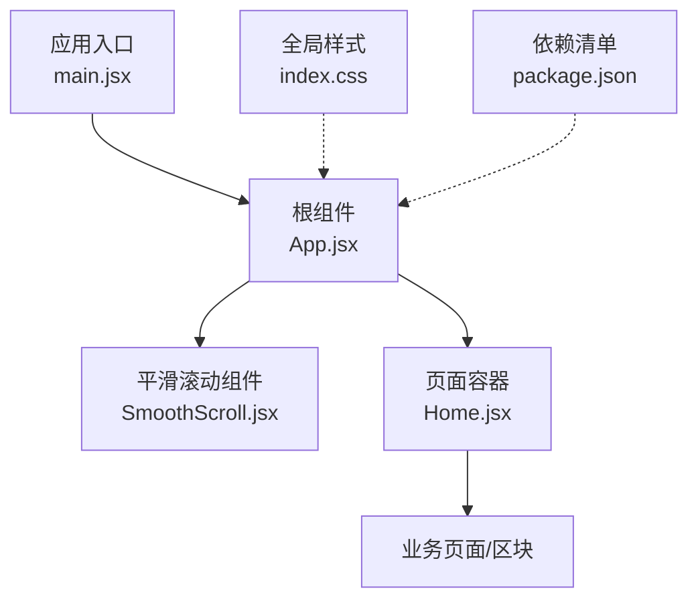
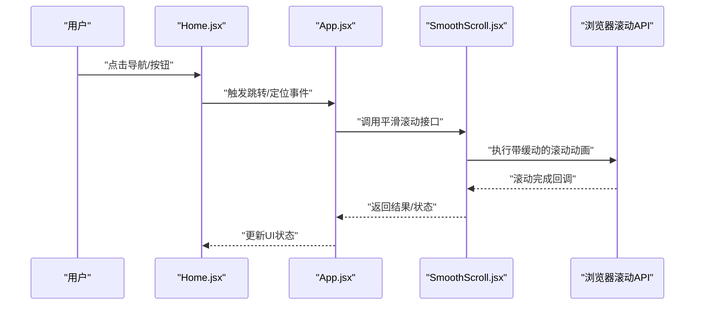
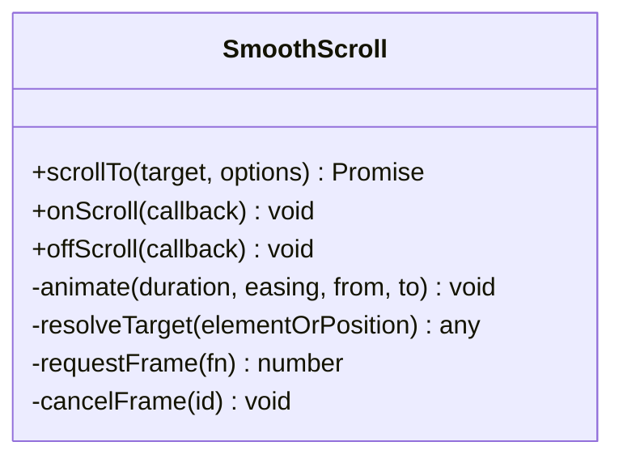
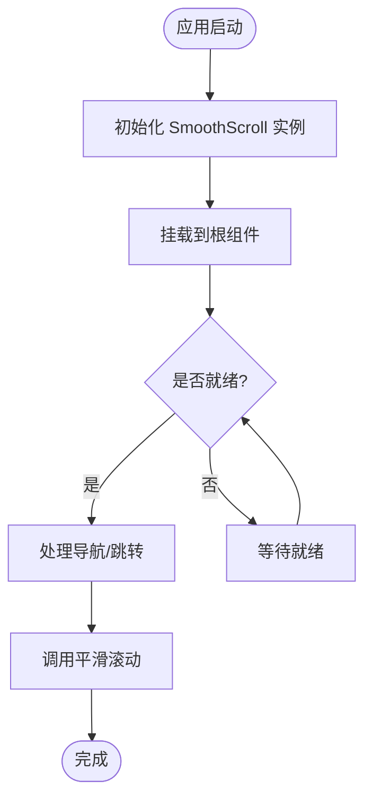
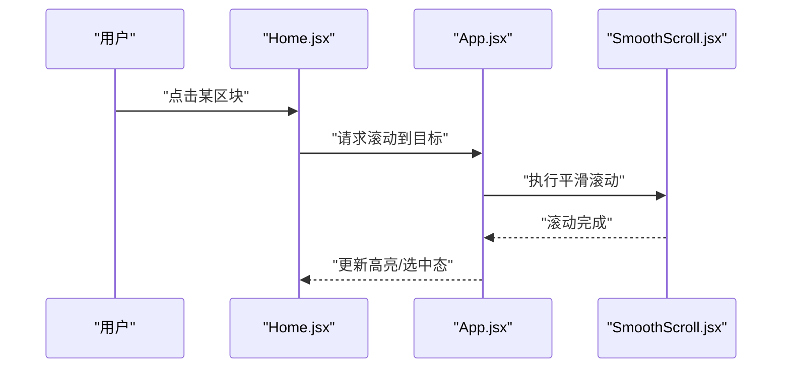
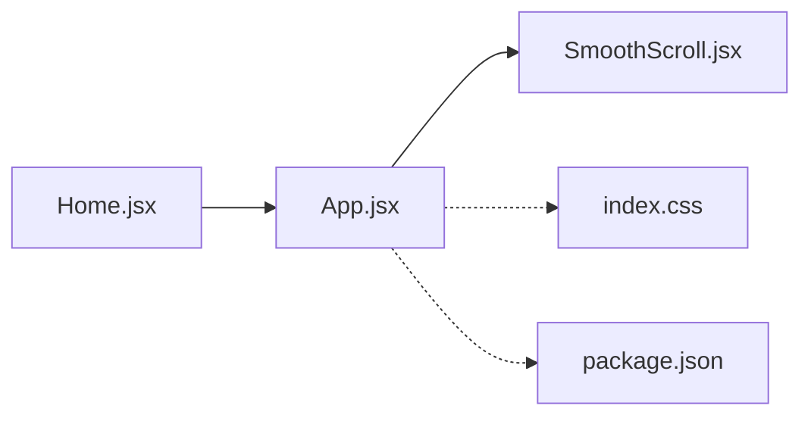

# 平滑滚动增强

<cite>
**本文引用的文件**   
- [SmoothScroll.jsx](file://src/components/SmoothScroll.jsx)
- [App.jsx](file://src/App.jsx)
- [Home.jsx](file://src/Home.jsx)
- [index.css](file://src/index.css)
- [package.json](file://package.json)
</cite>

## 目录
1. [简介](#简介)
2. [项目结构](#项目结构)
3. [核心组件](#核心组件)
4. [架构总览](#架构总览)
5. [详细组件分析](#详细组件分析)
6. [依赖分析](#依赖分析)
7. [性能考虑](#性能考虑)
8. [故障排查指南](#故障排查指南)
9. [结论](#结论)
10. [附录](#附录)

## 简介
本文件聚焦于“平滑滚动增强”的实现与使用，围绕项目中提供的 SmoothScroll 组件及其在应用中的集成方式展开。文档从系统架构、组件关系、数据流、处理逻辑、集成点、错误处理与性能特性等维度进行系统化说明，并辅以可视化图示帮助读者快速理解。

## 项目结构
本项目采用 React + Vite 的前端工程化结构。与平滑滚动相关的核心实现位于 src/components/SmoothScroll.jsx，并在入口应用层 App.jsx 中集成；页面级路由或容器 Home.jsx 负责承载内容区域；全局样式 index.css 提供基础样式；包管理 package.json 记录依赖版本。

图表来源
- [App.jsx](file://src/App.jsx)
- [SmoothScroll.jsx](file://src/components/SmoothScroll.jsx)
- [Home.jsx](file://src/Home.jsx)
- [index.css](file://src/index.css)
- [package.json](file://package.json)

章节来源
- [App.jsx](file://src/App.jsx)
- [SmoothScroll.jsx](file://src/components/SmoothScroll.jsx)
- [Home.jsx](file://src/Home.jsx)
- [index.css](file://src/index.css)
- [package.json](file://package.json)

## 核心组件
- 平滑滚动组件（SmoothScroll）：封装滚动行为，提供可配置的动画时长、缓动曲线、回调钩子等能力，用于在导航跳转、锚点定位、程序化滚动时获得一致的平滑体验。
- 应用集成（App.jsx）：在应用根层级引入并挂载 SmoothScroll，确保全应用范围内生效。
- 页面容器（Home.jsx）：作为页面容器，内部包含多个区块，便于演示平滑滚动在不同场景下的效果。
- 全局样式（index.css）：提供基础布局与滚动相关的基础样式，避免默认滚动行为干扰。
- 依赖清单（package.json）：声明第三方库与构建工具版本，便于复现与升级。

章节来源
- [SmoothScroll.jsx](file://src/components/SmoothScroll.jsx)
- [App.jsx](file://src/App.jsx)
- [Home.jsx](file://src/Home.jsx)
- [index.css](file://src/index.css)
- [package.json](file://package.json)

## 架构总览
下图展示了平滑滚动在应用中的整体交互流程：用户触发导航或点击事件后，由上层组件调用平滑滚动能力，最终驱动浏览器滚动到目标位置。

图表来源
- [Home.jsx](file://src/Home.jsx)
- [App.jsx](file://src/App.jsx)
- [SmoothScroll.jsx](file://src/components/SmoothScroll.jsx)

## 详细组件分析

### 平滑滚动组件（SmoothScroll）
- 职责边界
  - 统一滚动行为：屏蔽原生跳变，提供一致动画体验。
  - 配置化：支持时长、缓动函数、偏移量、回调等参数。
  - 兼容性：对不支持的浏览器回退为直接滚动。
- 关键能力
  - 程序化滚动：通过 API 将视口滚动至指定元素或坐标。
  - 事件监听：可选监听滚动进度、完成事件，供上层做联动效果。
  - 防抖节流：在高频率触发场景下避免重复动画。
- 复杂度与性能
  - 时间复杂度：单次滚动动画 O(1)，按帧推进。
  - 空间复杂度：O(1)，仅维护少量状态。
  - 优化建议：合并多次滚动请求、减少重排重绘、按需启用。

图表来源
- [SmoothScroll.jsx](file://src/components/SmoothScroll.jsx)

章节来源
- [SmoothScroll.jsx](file://src/components/SmoothScroll.jsx)

### 应用集成（App.jsx）
- 职责边界
  - 在应用根层级注入 SmoothScroll，使其在全局可用。
  - 提供统一的导航/跳转入口，集中处理滚动策略。
- 集成要点
  - 在根组件内包裹或注册 SmoothScroll 实例。
  - 暴露方法给子组件或路由守卫使用。
  - 结合全局样式确保滚动容器正确。

图表来源
- [App.jsx](file://src/App.jsx)
- [SmoothScroll.jsx](file://src/components/SmoothScroll.jsx)

章节来源
- [App.jsx](file://src/App.jsx)
- [SmoothScroll.jsx](file://src/components/SmoothScroll.jsx)

### 页面容器（Home.jsx）
- 职责边界
  - 组织页面区块，提供示例性的导航与跳转。
  - 演示不同滚动场景：锚点定位、列表项跳转、回到顶部等。
- 使用模式
  - 通过 props 或上下文获取平滑滚动方法。
  - 在点击事件中调用滚动 API，传入目标元素或坐标。

图表来源
- [Home.jsx](file://src/Home.jsx)
- [App.jsx](file://src/App.jsx)
- [SmoothScroll.jsx](file://src/components/SmoothScroll.jsx)

章节来源
- [Home.jsx](file://src/Home.jsx)
- [App.jsx](file://src/App.jsx)
- [SmoothScroll.jsx](file://src/components/SmoothScroll.jsx)

### 全局样式（index.css）
- 作用
  - 提供基础布局与滚动容器样式，避免默认滚动行为影响。
  - 保证滚动区域高度与视口匹配，提升一致性。
- 注意事项
  - 避免在根节点设置 overflow:hidden 导致无法滚动。
  - 合理设置 body/html 的 margin/padding，防止出现空白边距。

章节来源
- [index.css](file://src/index.css)

### 依赖清单（package.json）
- 作用
  - 记录构建工具与第三方依赖版本，便于环境复现与升级。
- 关注点
  - 确认是否引入与滚动相关的第三方库（如存在）。
  - 锁定版本以避免滚动行为差异。

章节来源
- [package.json](file://package.json)

## 依赖分析
- 组件耦合
  - App.jsx 依赖 SmoothScroll.jsx 提供的滚动能力。
  - Home.jsx 通过 App.jsx 暴露的接口间接依赖 SmoothScroll.jsx。
- 外部依赖
  - 若使用第三方滚动库，需在 package.json 中声明，并在 SmoothScroll.jsx 中导入。
- 潜在循环依赖
  - 保持单向依赖：Home -> App -> SmoothScroll，避免反向引用。

图表来源
- [Home.jsx](file://src/Home.jsx)
- [App.jsx](file://src/App.jsx)
- [SmoothScroll.jsx](file://src/components/SmoothScroll.jsx)
- [index.css](file://src/index.css)
- [package.json](file://package.json)

章节来源
- [Home.jsx](file://src/Home.jsx)
- [App.jsx](file://src/App.jsx)
- [SmoothScroll.jsx](file://src/components/SmoothScroll.jsx)
- [index.css](file://src/index.css)
- [package.json](file://package.json)

## 性能考虑
- 动画帧控制
  - 使用 requestAnimationFrame 系列 API 进行逐帧推进，避免阻塞主线程。
- 防抖与节流
  - 高频触发时合并滚动请求，减少重复动画。
- 计算开销
  - 尽量缓存目标元素与尺寸信息，避免频繁查询布局。
- 降级策略
  - 在不支持高级滚动的设备上回退为直接滚动，保障可用性。
- 内存占用
  - 及时清理事件监听与定时器，避免泄漏。

[本节为通用指导，不直接分析具体文件]

## 故障排查指南
- 症状：点击无响应或滚动异常
  - 检查是否在根组件正确初始化 SmoothScroll。
  - 确认滚动容器未被 overflow:hidden 阻断。
- 症状：滚动卡顿或掉帧
  - 检查是否存在大量 DOM 重排操作。
  - 降低动画时长或简化缓动曲线。
- 症状：移动端表现不一致
  - 验证设备是否支持相应滚动 API，必要时启用降级。
- 症状：多次点击导致动画叠加
  - 增加防抖/节流或取消上一次动画。

章节来源
- [SmoothScroll.jsx](file://src/components/SmoothScroll.jsx)
- [App.jsx](file://src/App.jsx)
- [index.css](file://src/index.css)

## 结论
通过将平滑滚动能力封装为独立组件并在应用根层级集成，项目实现了统一、可控且高性能的滚动体验。配合合理的样式与依赖管理，可在多端保持一致性。建议在后续迭代中持续优化动画性能与兼容性，完善错误处理与监控埋点。

[本节为总结性内容，不直接分析具体文件]

## 附录
- 最佳实践
  - 在导航切换时优先使用平滑滚动，提升用户体验。
  - 为长列表或复杂页面提供“回到顶部”快捷入口。
  - 对关键路径添加日志与指标，便于问题定位。
- 扩展方向
  - 支持惯性滚动与阻尼效果。
  - 与路由库深度集成，实现基于路由的自动平滑滚动。
  - 提供主题化配置，允许按页面定制滚动风格。

[本节为概念性内容，不直接分析具体文件]