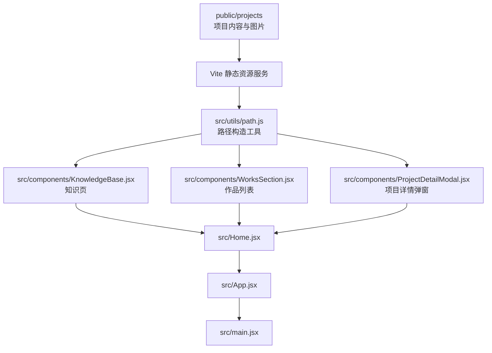
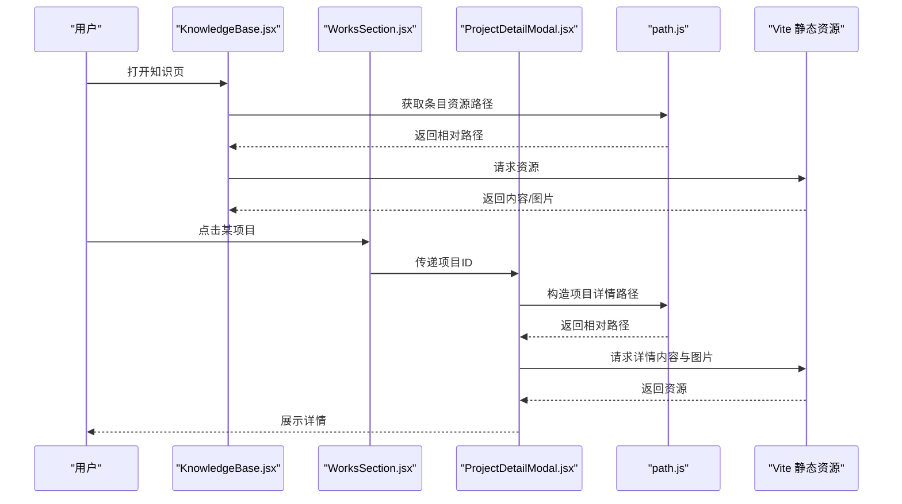
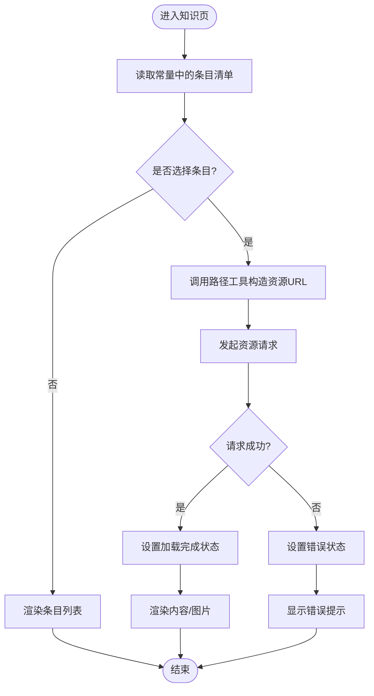
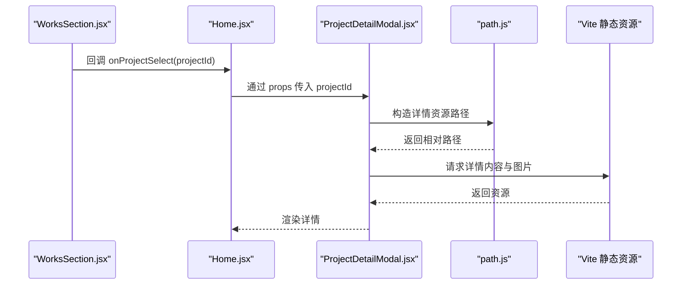
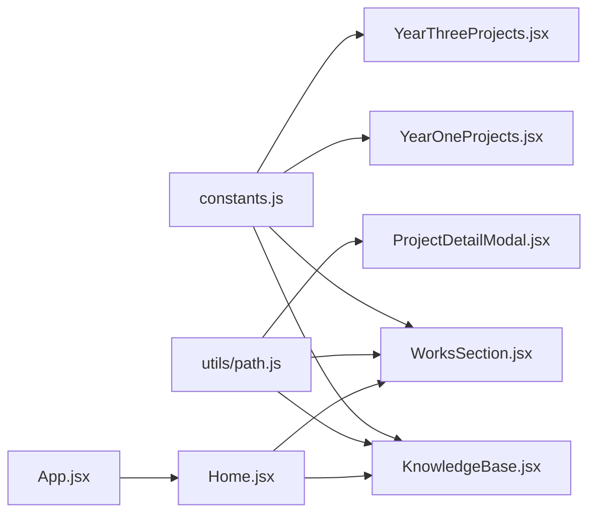

# 数据管理与状态

<cite>
**本文引用的文件**   
- [constants.js](file://src/constants.js)
- [path.js](file://src/utils/path.js)
- [App.jsx](file://src/App.jsx)
- [Home.jsx](file://src/Home.jsx)
- [KnowledgeBase.jsx](file://src/components/KnowledgeBase.jsx)
- [ProjectDetailModal.jsx](file://src/components/ProjectDetailModal.jsx)
- [WorksSection.jsx](file://src/components/WorksSection.jsx)
- [YearOneProjects.jsx](file://src/components/YearOneProjects.jsx)
- [YearThreeProjects.jsx](file://src/components/YearThreeProjects.jsx)
- [package.json](file://package.json)
- [vite.config.js](file://vite.config.js)
</cite>

## 目录
1. [简介](#简介)
2. [项目结构](#项目结构)
3. [核心组件](#核心组件)
4. [架构总览](#架构总览)
5. [详细组件分析](#详细组件分析)
6. [依赖分析](#依赖分析)
7. [性能考虑](#性能考虑)
8. [故障排查指南](#故障排查指南)
9. [结论](#结论)
10. [附录](#附录)

## 简介
本文件聚焦 Goodent 项目的数据管理与状态管理，围绕以下目标展开：
- 解析 constants.js 中全局常量与配置的组织方式
- 说明项目数据结构的设计原则与命名规范
- 解释文件系统访问机制，如何通过相对路径动态加载 public/projects 中的内容与图片资源
- 阐述状态管理模式（React Hooks、组件通信）的选择与实现策略
- 说明异步数据加载的处理方式（错误处理、加载状态）
- 提供数据验证与格式化工具函数的使用方法
- 给出数据迁移与版本管理的最佳实践
- 为数据层扩展与维护提供指导

## 项目结构
Goodent 采用“内容即数据”的静态站点模式：
- 业务数据以文件系统形式存放于 public/projects，按项目编号与主题组织
- 前端通过 Vite 构建时静态资源映射，使用相对路径访问这些内容
- 应用入口在 src/main.jsx，顶层路由与布局在 App.jsx，页面级逻辑在 Home.jsx
- 知识展示与作品列表等由多个组件协作完成，统一通过工具函数 path.js 生成资源路径

图表来源
- [vite.config.js](file://vite.config.js)
- [path.js](file://src/utils/path.js)
- [KnowledgeBase.jsx](file://src/components/KnowledgeBase.jsx)
- [WorksSection.jsx](file://src/components/WorksSection.jsx)
- [ProjectDetailModal.jsx](file://src/components/ProjectDetailModal.jsx)
- [Home.jsx](file://src/Home.jsx)
- [App.jsx](file://src/App.jsx)
- [main.jsx](file://src/main.jsx)

章节来源
- [package.json](file://package.json)
- [vite.config.js](file://vite.config.js)
- [App.jsx](file://src/App.jsx)
- [Home.jsx](file://src/Home.jsx)

## 核心组件
- 全局常量与配置（constants.js）
  - 集中定义项目元数据、分类、默认视图参数、UI 文案等
  - 作为单一事实源，供各页面与组件读取，避免硬编码
- 路径工具（utils/path.js）
  - 封装 public/projects 下的相对路径拼接规则
  - 提供统一的资源定位方法，屏蔽底层文件系统差异
- 知识页（components/KnowledgeBase.jsx）
  - 基于常量与路径工具渲染知识条目与图片
- 作品区（components/WorksSection.jsx）
  - 聚合项目列表，驱动详情页弹窗
- 项目详情弹窗（components/ProjectDetailModal.jsx）
  - 根据选中项目 ID 动态加载对应内容与图片资源
- 年份项目页（components/YearOneProjects.jsx、YearThreeProjects.jsx）
  - 按年度维度筛选并展示项目集合

章节来源
- [constants.js](file://src/constants.js)
- [path.js](file://src/utils/path.js)
- [KnowledgeBase.jsx](file://src/components/KnowledgeBase.jsx)
- [WorksSection.jsx](file://src/components/WorksSection.jsx)
- [ProjectDetailModal.jsx](file://src/components/ProjectDetailModal.jsx)
- [YearOneProjects.jsx](file://src/components/YearOneProjects.jsx)
- [YearThreeProjects.jsx](file://src/components/YearThreeProjects.jsx)

## 架构总览
整体数据流遵循“常量驱动 + 路径工具 + 组件状态”的模式：
- 常量定义项目结构与默认值
- 路径工具将项目标识转换为可被浏览器直接访问的资源 URL
- 组件通过 React Hooks 维护加载状态、错误状态与当前选中项
- 异步请求在组件内发起，统一进行错误捕获与用户提示

图表来源
- [KnowledgeBase.jsx](file://src/components/KnowledgeBase.jsx)
- [WorksSection.jsx](file://src/components/WorksSection.jsx)
- [ProjectDetailModal.jsx](file://src/components/ProjectDetailModal.jsx)
- [path.js](file://src/utils/path.js)

## 详细组件分析

### 全局常量与配置（constants.js）
- 职责
  - 集中管理项目元数据、分类、默认视图参数、UI 文案等
  - 为各页面与组件提供一致的数据契约
- 设计原则
  - 单一事实源：所有跨组件共享的配置均从该文件导入
  - 稳定键名：对外暴露的键名保持稳定，内部实现可演进
  - 可扩展性：新增项目或分类时，仅需更新常量
- 使用建议
  - 新增字段需同步更新相关组件的类型与校验逻辑
  - 对敏感或环境相关的值，建议通过环境变量注入并在常量层合并

章节来源
- [constants.js](file://src/constants.js)

### 路径工具（utils/path.js）
- 职责
  - 将项目 ID、子目录与文件名组合为浏览器可直接访问的相对路径
  - 统一处理 public/projects 下的资源定位
- 关键约定
  - 根目录：public/projects
  - 一级目录：项目编号（如 1、2、3）
  - 二级目录：主题名称（如 产品设计、机器人基础）
  - 三级目录：细分内容或图片文件夹（如 打印部件/方向盘）
- 使用建议
  - 所有资源访问必须经过该工具，避免在组件内拼接字符串
  - 对缺失资源应返回空串或抛出明确错误，便于上层统一处理

章节来源
- [path.js](file://src/utils/path.js)

### 知识页（components/KnowledgeBase.jsx）
- 职责
  - 基于常量与路径工具渲染知识条目与图片
- 状态管理
  - 使用 useState 管理当前条目、加载状态与错误信息
  - 使用 useEffect 在挂载或依赖变化时触发资源加载
- 交互流程
  - 选择条目 → 调用路径工具生成 URL → 发起资源请求 → 更新状态并渲染

图表来源
- [KnowledgeBase.jsx](file://src/components/KnowledgeBase.jsx)
- [path.js](file://src/utils/path.js)

章节来源
- [KnowledgeBase.jsx](file://src/components/KnowledgeBase.jsx)

### 作品区与项目详情（components/WorksSection.jsx、components/ProjectDetailModal.jsx）
- 职责
  - WorksSection：聚合项目列表，承载点击事件，向弹窗传递项目 ID
  - ProjectDetailModal：根据项目 ID 动态加载详情内容与图片
- 状态管理
  - 使用 useState 管理选中项目、加载状态、错误状态
  - 使用 useEffect 监听项目 ID 变化，触发资源加载
- 组件通信
  - 父组件（如 Home.jsx）持有选中项目状态，通过 props 传递给子组件
  - 弹窗关闭后清理状态，避免内存泄漏

图表来源
- [WorksSection.jsx](file://src/components/WorksSection.jsx)
- [ProjectDetailModal.jsx](file://src/components/ProjectDetailModal.jsx)
- [path.js](file://src/utils/path.js)

章节来源
- [WorksSection.jsx](file://src/components/WorksSection.jsx)
- [ProjectDetailModal.jsx](file://src/components/ProjectDetailModal.jsx)

### 年份项目页（components/YearOneProjects.jsx、components/YearThreeProjects.jsx）
- 职责
  - 按年度维度筛选并展示项目集合
- 数据绑定
  - 从常量中读取年度对应的项目 ID 列表
  - 复用路径工具生成每个项目的封面或缩略图路径
- 状态管理
  - 使用 useState 管理当前筛选条件与加载状态
  - 使用 useEffect 在筛选条件变化时重新计算列表

章节来源
- [YearOneProjects.jsx](file://src/components/YearOneProjects.jsx)
- [YearThreeProjects.jsx](file://src/components/YearThreeProjects.jsx)

### 应用入口与路由（src/App.jsx、src/Home.jsx）
- 职责
  - App.jsx：应用根节点，集成样式与全局布局
  - Home.jsx：首页容器，协调各区块组件的状态与导航
- 状态提升
  - 将“当前选中项目”提升到 Home.jsx，通过 props 向下分发
  - 保证弹窗与列表之间的状态一致性

章节来源
- [App.jsx](file://src/App.jsx)
- [Home.jsx](file://src/Home.jsx)

## 依赖分析
- 构建与静态资源
  - 使用 Vite 作为构建工具，public 目录下的内容会被原样复制到构建产物中，可通过相对路径访问
- 模块依赖
  - 各组件依赖 constants.js 与 utils/path.js
  - 页面级组件（Home.jsx）协调多个功能组件

图表来源
- [constants.js](file://src/constants.js)
- [path.js](file://src/utils/path.js)
- [KnowledgeBase.jsx](file://src/components/KnowledgeBase.jsx)
- [WorksSection.jsx](file://src/components/WorksSection.jsx)
- [ProjectDetailModal.jsx](file://src/components/ProjectDetailModal.jsx)
- [YearOneProjects.jsx](file://src/components/YearOneProjects.jsx)
- [YearThreeProjects.jsx](file://src/components/YearThreeProjects.jsx)
- [Home.jsx](file://src/Home.jsx)
- [App.jsx](file://src/App.jsx)

章节来源
- [package.json](file://package.json)
- [vite.config.js](file://vite.config.js)

## 性能考虑
- 资源预取与缓存
  - 对常用图片可使用浏览器缓存；必要时在路径工具中加入版本号查询参数
- 懒加载
  - 对长列表使用 IntersectionObserver 或虚拟滚动减少首屏压力
- 并发控制
  - 批量资源加载时使用 Promise.allSettled 统一处理成功与失败
- 去重与记忆化
  - 对重复请求的结果进行本地缓存，避免重复网络开销

[本节为通用指导，不直接分析具体文件]

## 故障排查指南
- 常见问题
  - 资源 404：检查路径工具生成的相对路径是否正确，确认 public/projects 下存在对应目录与文件
  - 跨域问题：确保资源位于 public 目录并通过相对路径访问，避免绝对域名
  - 状态不一致：检查状态提升位置与副作用清理逻辑，确保组件卸载时取消未完成的请求
- 调试建议
  - 在路径工具中添加日志输出，记录输入参数与最终路径
  - 在组件内打印加载状态与错误信息，快速定位失败环节

章节来源
- [path.js](file://src/utils/path.js)
- [ProjectDetailModal.jsx](file://src/components/ProjectDetailModal.jsx)

## 结论
Goodent 的数据与状态管理以“常量 + 路径工具 + 组件状态”为核心，结合 Vite 的静态资源能力，实现了简洁而可扩展的数据层。通过统一的路径构造与状态管理模式，项目在保持可读性的同时具备良好的可维护性与扩展性。

[本节为总结性内容，不直接分析具体文件]

## 附录

### 数据模型与命名规范
- 项目目录层级
  - public/projects/{project_id}/{topic}/{subtopic_or_images}
- 命名规范
  - project_id：数字编号，唯一且稳定
  - topic：中文或英文主题名，建议使用短横线分隔多词
  - subtopic_or_images：细分内容或图片文件夹，保持一致的命名风格
- 常量键名
  - 使用小驼峰或大写下划线，保持语义清晰
  - 对外暴露的键名保持稳定，内部实现可演进

章节来源
- [constants.js](file://src/constants.js)
- [path.js](file://src/utils/path.js)

### 异步数据加载与错误处理
- 推荐模式
  - 使用 useEffect 监听依赖变化，发起资源请求
  - 使用 useState 管理 loading、error、data 三类状态
  - 使用 AbortController 或组件卸载标志取消未完成请求
- 错误处理
  - 区分网络错误与资源不存在，分别给出友好提示
  - 对批量加载使用 allSettled，汇总错误并继续渲染可用部分

章节来源
- [ProjectDetailModal.jsx](file://src/components/ProjectDetailModal.jsx)
- [KnowledgeBase.jsx](file://src/components/KnowledgeBase.jsx)

### 数据验证与格式化
- 验证
  - 在路径工具中对输入参数进行基本校验（非空、类型正确）
  - 在常量层对枚举值进行白名单校验
- 格式化
  - 对日期、尺寸、单位等进行统一格式化函数
  - 对路径进行规范化处理（去除多余斜杠、大小写一致）

章节来源
- [path.js](file://src/utils/path.js)
- [constants.js](file://src/constants.js)

### 数据迁移与版本管理
- 目录迁移
  - 变更目录结构时，优先在路径工具中适配新规则，保持组件不变
  - 提供一次性迁移脚本，批量重命名或移动文件
- 常量版本
  - 对破坏性变更增加版本号前缀，逐步淘汰旧键名
  - 在常量文件中保留废弃键名的兼容映射
- 发布策略
  - 通过版本号或时间戳参数对静态资源进行缓存失效控制

章节来源
- [constants.js](file://src/constants.js)
- [path.js](file://src/utils/path.js)

### 扩展与维护指南
- 新增项目
  - 在 public/projects 下创建目录结构
  - 在 constants.js 中补充项目元数据
  - 复用现有组件，无需修改路径工具
- 新增资源类型
  - 在路径工具中增加新的资源类型映射
  - 在组件中增加对应的渲染分支
- 代码审查要点
  - 是否通过路径工具访问资源
  - 是否对加载状态与错误进行处理
  - 是否避免在组件内拼接路径字符串

章节来源
- [path.js](file://src/utils/path.js)
- [constants.js](file://src/constants.js)
- [ProjectDetailModal.jsx](file://src/components/ProjectDetailModal.jsx)
- [KnowledgeBase.jsx](file://src/components/KnowledgeBase.jsx)