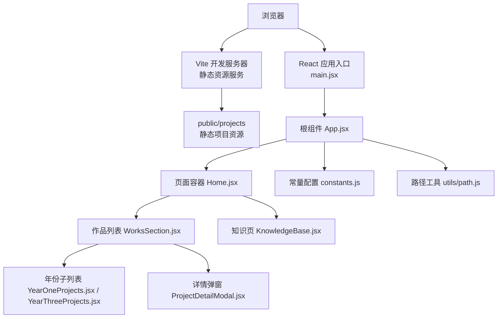
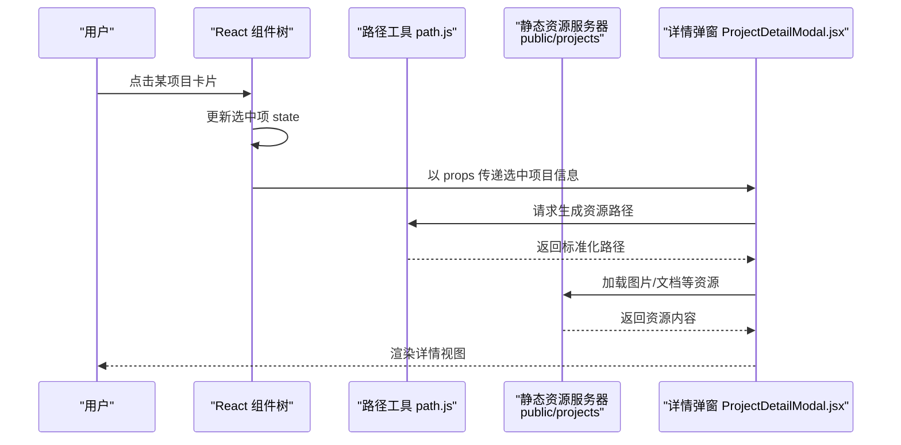
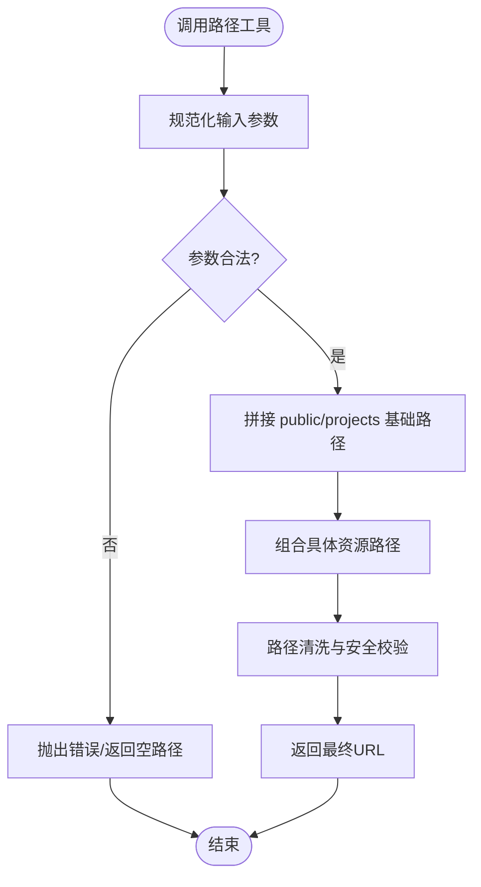
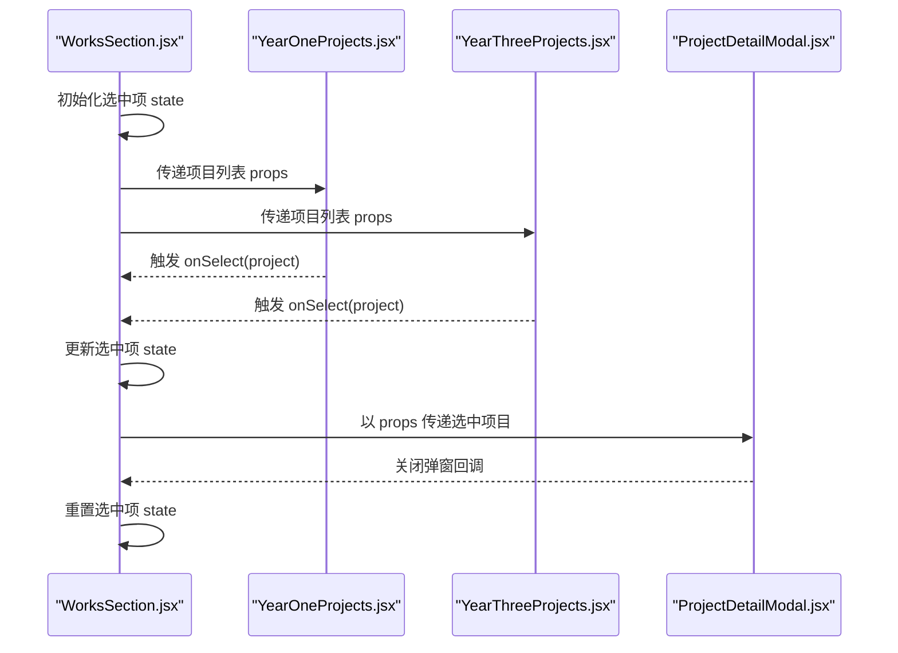
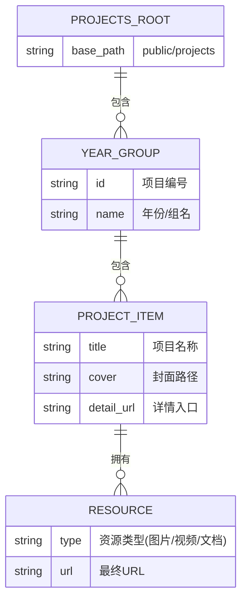
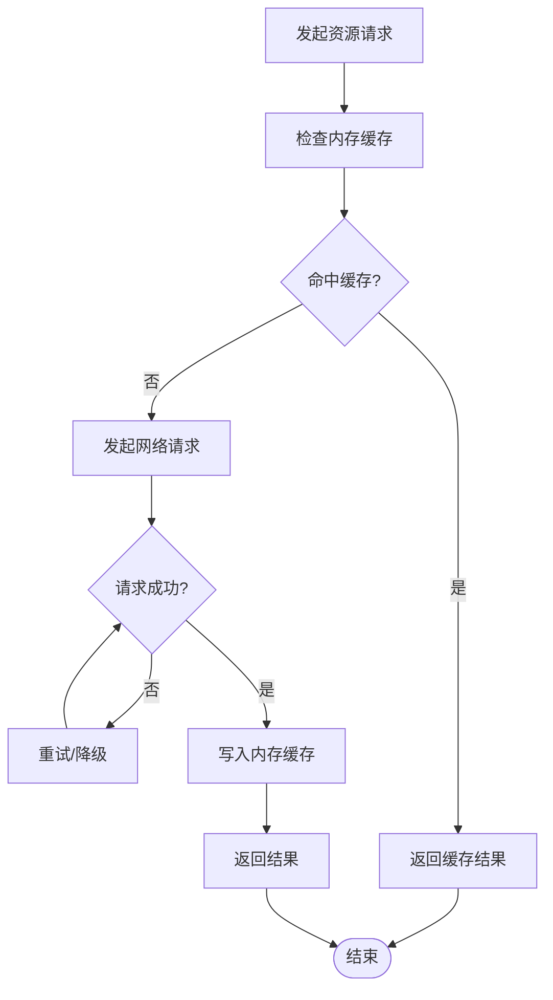
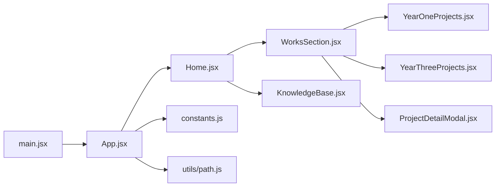

# 数据流管理

<cite>
**本文引用的文件**   
- [constants.js](file://src/constants.js)
- [path.js](file://src/utils/path.js)
- [App.jsx](file://src/App.jsx)
- [Home.jsx](file://src/Home.jsx)
- [main.jsx](file://src/main.jsx)
- [WorksSection.jsx](file://src/components/WorksSection.jsx)
- [ProjectDetailModal.jsx](file://src/components/ProjectDetailModal.jsx)
- [YearOneProjects.jsx](file://src/components/YearOneProjects.jsx)
- [YearThreeProjects.jsx](file://src/components/YearThreeProjects.jsx)
- [KnowledgeBase.jsx](file://src/components/KnowledgeBase.jsx)
- [package.json](file://package.json)
- [vite.config.js](file://vite.config.js)
</cite>

## 目录
1. [简介](#简介)
2. [项目结构](#项目结构)
3. [核心组件](#核心组件)
4. [架构总览](#架构总览)
5. [详细组件分析](#详细组件分析)
6. [依赖关系分析](#依赖关系分析)
7. [性能考虑](#性能考虑)
8. [故障排查指南](#故障排查指南)
9. [结论](#结论)
10. [附录](#附录)

## 简介
本文件面向Goodent项目的数据流管理，聚焦以下目标：
- 说明应用中的数据流向与管理策略
- 解释常量配置 constants.js 的组织结构与访问模式
- 阐述路径工具函数 path.js 的设计思路与静态资源管理机制
- 描述单向数据流在React组件中的实现（state、props、事件）
- 说明项目数据的结构设计，特别是 public/projects 中静态资源的访问与展示逻辑
- 给出数据缓存策略与异步数据处理模式
- 解释如何维护数据一致性与处理数据更新

## 项目结构
从数据流视角看，本项目采用“静态资源 + React单向数据流”的架构：
- 静态资源位于 public/projects，按编号与主题组织，便于通过路径工具统一访问
- 常量集中定义于 src/constants.js，作为全局配置入口
- 路径工具封装于 src/utils/path.js，提供统一的资源定位能力
- React组件层通过 props/state 驱动视图渲染，遵循单向数据流原则
- 构建与运行由 Vite 驱动，public 目录内容直接暴露为静态资源

图表来源
- [main.jsx](file://src/main.jsx)
- [App.jsx](file://src/App.jsx)
- [Home.jsx](file://src/Home.jsx)
- [WorksSection.jsx](file://src/components/WorksSection.jsx)
- [ProjectDetailModal.jsx](file://src/components/ProjectDetailModal.jsx)
- [YearOneProjects.jsx](file://src/components/YearOneProjects.jsx)
- [YearThreeProjects.jsx](file://src/components/YearThreeProjects.jsx)
- [KnowledgeBase.jsx](file://src/components/KnowledgeBase.jsx)
- [constants.js](file://src/constants.js)
- [path.js](file://src/utils/path.js)

章节来源
- [main.jsx](file://src/main.jsx)
- [App.jsx](file://src/App.jsx)
- [Home.jsx](file://src/Home.jsx)
- [package.json](file://package.json)
- [vite.config.js](file://vite.config.js)

## 核心组件
本节概述关键模块的职责与数据职责边界：
- 常量配置 constants.js：集中管理站点级常量（如基础路径、默认值等），供各组件统一读取
- 路径工具 path.js：封装资源路径拼接与规范化逻辑，屏蔽底层文件系统差异
- 根与页面组件（App.jsx、Home.jsx）：负责路由/布局与顶层状态编排
- 作品相关组件（WorksSection.jsx、YearOneProjects.jsx、YearThreeProjects.jsx、ProjectDetailModal.jsx）：负责项目清单、筛选、详情展示
- 知识页组件（KnowledgeBase.jsx）：承载知识类内容的展示与交互

章节来源
- [constants.js](file://src/constants.js)
- [path.js](file://src/utils/path.js)
- [App.jsx](file://src/App.jsx)
- [Home.jsx](file://src/Home.jsx)
- [WorksSection.jsx](file://src/components/WorksSection.jsx)
- [ProjectDetailModal.jsx](file://src/components/ProjectDetailModal.jsx)
- [YearOneProjects.jsx](file://src/components/YearOneProjects.jsx)
- [YearThreeProjects.jsx](file://src/components/YearThreeProjects.jsx)
- [KnowledgeBase.jsx](file://src/components/KnowledgeBase.jsx)

## 架构总览
下图展示了从用户操作到静态资源加载的完整数据流。

图表来源
- [WorksSection.jsx](file://src/components/WorksSection.jsx)
- [ProjectDetailModal.jsx](file://src/components/ProjectDetailModal.jsx)
- [path.js](file://src/utils/path.js)

## 详细组件分析

### 常量配置 constants.js
- 设计目标
  - 将站点级常量集中管理，避免硬编码分散在各组件
  - 提供稳定的访问入口，便于后续扩展与维护
- 组织结构建议
  - 基础路径与域名相关常量
  - 默认显示数量、分页大小等UI常量
  - 项目分类或标签映射表（若需要）
- 访问模式
  - 组件按需导入使用，保持单一数据源
  - 对外暴露命名导出，避免隐式依赖

章节来源
- [constants.js](file://src/constants.js)

### 路径工具 path.js
- 设计思路
  - 统一资源路径构造，屏蔽平台差异（Windows/Unix）
  - 提供安全的路径规范化与校验，防止越界访问
  - 支持相对路径与绝对路径的统一处理
- 资源管理机制
  - 基于 public/projects 的目录约定，生成可访问的URL
  - 对缺失资源进行降级处理（占位图/空态提示）
- 典型用法
  - 传入项目标识与资源类型，返回最终URL
  - 批量生成资源列表，配合懒加载减少首屏压力

图表来源
- [path.js](file://src/utils/path.js)

章节来源
- [path.js](file://src/utils/path.js)

### 单向数据流在React中的实现
- 数据方向
  - 自上而下：父组件通过 props 向下传递数据
  - 自下而上：子组件通过回调函数向父组件上报事件
- 状态管理
  - 局部状态：用于组件内部短期状态（如选中项、弹窗显隐）
  - 提升状态：当多个兄弟组件共享时，提升到最近公共父组件
- 事件处理
  - 点击、滚动、键盘等事件统一在父组件处理，再分发至子组件
- 示例流程（作品选择与详情展示）

图表来源
- [WorksSection.jsx](file://src/components/WorksSection.jsx)
- [YearOneProjects.jsx](file://src/components/YearOneProjects.jsx)
- [YearThreeProjects.jsx](file://src/components/YearThreeProjects.jsx)
- [ProjectDetailModal.jsx](file://src/components/ProjectDetailModal.jsx)

章节来源
- [WorksSection.jsx](file://src/components/WorksSection.jsx)
- [ProjectDetailModal.jsx](file://src/components/ProjectDetailModal.jsx)
- [YearOneProjects.jsx](file://src/components/YearOneProjects.jsx)
- [YearThreeProjects.jsx](file://src/components/YearThreeProjects.jsx)

### 项目数据结构与静态资源访问
- 目录约定
  - public/projects 下按编号分组，每个编号对应一个项目集合
  - 每个项目文件夹内包含图文等多媒体资源
- 访问策略
  - 通过 path.js 生成稳定URL，避免直接拼接字符串
  - 结合懒加载与预加载策略，优化首屏与交互体验
- 展示逻辑
  - 列表页仅加载缩略图与元信息
  - 详情页按需加载大图与附件，失败时回退到占位资源

图表来源
- [path.js](file://src/utils/path.js)
- [WorksSection.jsx](file://src/components/WorksSection.jsx)
- [ProjectDetailModal.jsx](file://src/components/ProjectDetailModal.jsx)

章节来源
- [path.js](file://src/utils/path.js)
- [WorksSection.jsx](file://src/components/WorksSection.jsx)
- [ProjectDetailModal.jsx](file://src/components/ProjectDetailModal.jsx)

### 数据缓存策略与异步处理
- 缓存策略
  - 浏览器HTTP缓存：利用静态资源强缓存头，提高重复访问速度
  - 内存缓存：在组件内缓存已加载的项目元信息与缩略图，避免重复请求
  - 可选持久化：对少量元数据使用 localStorage/sessionStorage 做轻量缓存
- 异步模式
  - 使用 Promise/async-await 组织资源加载流程
  - 失败重试与超时控制，保障弱网环境下的稳定性
  - 取消机制：组件卸载时取消未完成的请求，避免内存泄漏

[此图为概念性流程图，不直接映射具体源码文件]

### 数据一致性与更新
- 一致性原则
  - 单一事实来源：所有项目元信息来自同一数据源（文件或常量）
  - 不可变更新：通过新对象/数组替换旧引用，确保React正确感知变更
- 更新流程
  - 新增/修改项目后，同步更新对应的目录结构与元数据
  - 前端通过路径工具重新解析，保证前后端（静态资源）一致
- 冲突处理
  - 对并发更新场景，采用乐观更新+失败回滚策略
  - 对资源缺失，提供占位与友好提示

章节来源
- [path.js](file://src/utils/path.js)
- [WorksSection.jsx](file://src/components/WorksSection.jsx)
- [ProjectDetailModal.jsx](file://src/components/ProjectDetailModal.jsx)

## 依赖关系分析
- 组件依赖
  - App.jsx 作为根组件，挂载 Home.jsx 并注入全局常量与路径工具
  - Home.jsx 聚合业务页面，如 WorksSection.jsx、KnowledgeBase.jsx
  - WorksSection.jsx 协调年份子列表与详情弹窗
- 外部依赖
  - Vite 提供静态资源服务与构建能力
  - React 生态提供组件化与状态管理能力

图表来源
- [main.jsx](file://src/main.jsx)
- [App.jsx](file://src/App.jsx)
- [Home.jsx](file://src/Home.jsx)
- [WorksSection.jsx](file://src/components/WorksSection.jsx)
- [KnowledgeBase.jsx](file://src/components/KnowledgeBase.jsx)
- [YearOneProjects.jsx](file://src/components/YearOneProjects.jsx)
- [YearThreeProjects.jsx](file://src/components/YearThreeProjects.jsx)
- [ProjectDetailModal.jsx](file://src/components/ProjectDetailModal.jsx)
- [constants.js](file://src/constants.js)
- [path.js](file://src/utils/path.js)

章节来源
- [main.jsx](file://src/main.jsx)
- [App.jsx](file://src/App.jsx)
- [Home.jsx](file://src/Home.jsx)
- [package.json](file://package.json)
- [vite.config.js](file://vite.config.js)

## 性能考虑
- 资源加载
  - 使用懒加载与预加载平衡首屏与交互体验
  - 对大图进行压缩与格式优化（WebP/AVIF）
- 渲染优化
  - 合理使用 React.memo/useMemo/useCallback 减少重渲染
  - 列表虚拟化（长列表场景）
- 缓存优化
  - 合理设置HTTP缓存头，充分利用浏览器缓存
  - 内存缓存命中率监控与淘汰策略

[本节为通用指导，不直接分析具体文件]

## 故障排查指南
- 常见问题
  - 资源404：检查路径工具生成的URL是否正确，确认 public/projects 目录结构是否匹配
  - 跨域问题：确认资源位于 public 目录并由Vite静态服务托管
  - 缓存导致不更新：清理浏览器缓存或增加版本号/时间戳
- 调试建议
  - 在路径工具中加入日志输出，记录输入参数与最终URL
  - 在组件中打印props/state变化，定位数据不一致点
  - 使用浏览器开发者工具的Network面板观察请求与缓存命中情况

章节来源
- [path.js](file://src/utils/path.js)
- [ProjectDetailModal.jsx](file://src/components/ProjectDetailModal.jsx)

## 结论
Goodent项目通过“常量集中 + 路径工具封装 + React单向数据流”的方式，实现了清晰的数据管理与稳定的资源访问。借助合理的缓存与异步策略，可在保证用户体验的同时维持数据一致性。建议在后续迭代中持续完善元数据模型与缓存策略，进一步提升可维护性与性能。

[本节为总结性内容，不直接分析具体文件]

## 附录
- 术语
  - 单向数据流：数据自上而下流动，事件自下而上冒泡
  - 静态资源：无需服务端动态处理的文件，如图片、音视频、文档
- 最佳实践
  - 始终通过路径工具访问资源，避免硬编码
  - 将易变配置放入常量文件，保持组件纯净
  - 对关键路径与状态变更添加必要日志，便于排障

[本节为补充说明，不直接分析具体文件]