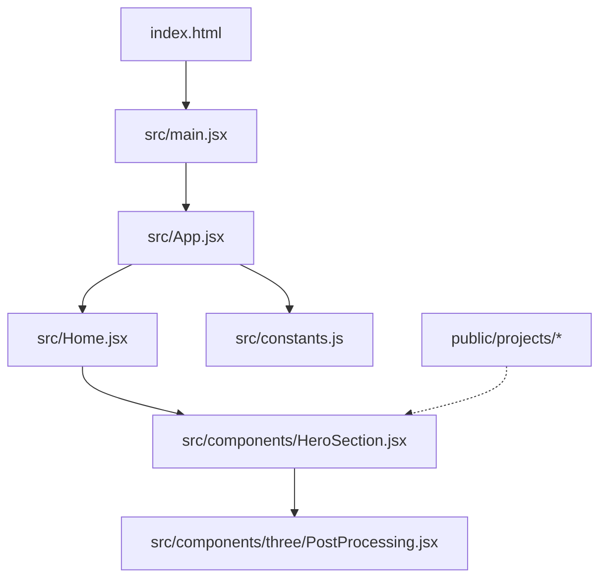
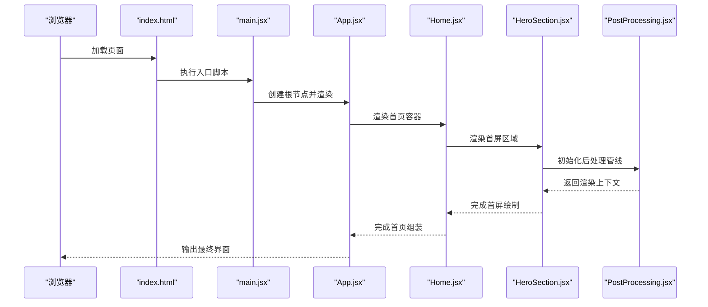
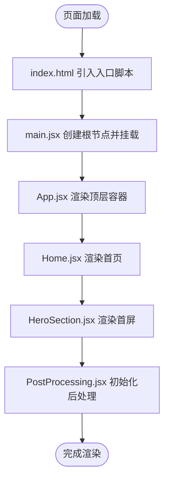
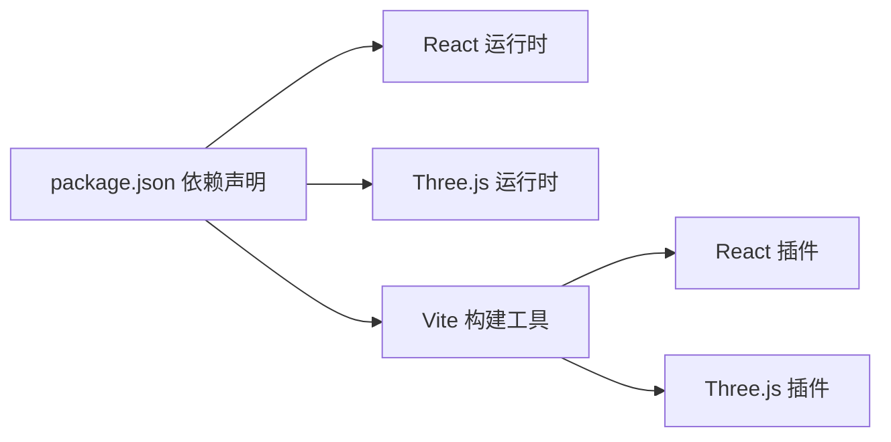

# 整体架构概览

<cite>
**本文引用的文件**   
- [main.jsx](file://src/main.jsx)
- [App.jsx](file://src/App.jsx)
- [Home.jsx](file://src/Home.jsx)
- [vite.config.js](file://vite.config.js)
- [package.json](file://package.json)
- [index.html](file://index.html)
- [constants.js](file://src/constants.js)
- [HeroSection.jsx](file://src/components/HeroSection.jsx)
- [PostProcessing.jsx](file://src/components/three/PostProcessing.jsx)
</cite>

## 目录
1. [简介](#简介)
2. [项目结构](#项目结构)
3. [核心组件](#核心组件)
4. [架构总览](#架构总览)
5. [详细组件分析](#详细组件分析)
6. [依赖分析](#依赖分析)
7. [性能考虑](#性能考虑)
8. [故障排查指南](#故障排查指南)
9. [结论](#结论)
10. [附录](#附录)

## 简介
本文件为 Goodent 项目的整体架构概览，聚焦于基于 React + Three.js + Vite 的技术栈选择与协同工作方式。文档从高层架构、模块化组织、构建配置、初始化流程、性能优化与可扩展性等方面展开，帮助读者快速理解系统设计与实现思路，并为后续扩展与维护提供参考。

## 项目结构
Goodent 采用以功能域为导向的模块化组织方式：
- src/components：页面级与通用 UI 组件，以及 Three.js 相关的 3D 场景与特效组件
- src/utils：工具函数（如路径处理）
- src/assets：静态资源
- public/projects：项目资料与媒体资源（按项目分类存放）
- 根目录：入口 HTML、Vite 配置、包管理与脚本等

图表来源
- [index.html:1-20](file://index.html#L1-L20)
- [main.jsx:1-20](file://src/main.jsx#L1-L20)
- [App.jsx:1-20](file://src/App.jsx#L1-L20)
- [Home.jsx:1-20](file://src/Home.jsx#L1-L20)
- [HeroSection.jsx:1-20](file://src/components/HeroSection.jsx#L1-L20)
- [PostProcessing.jsx:1-20](file://src/components/three/PostProcessing.jsx#L1-L20)
- [constants.js:1-20](file://src/constants.js#L1-L20)

章节来源
- [index.html:1-20](file://index.html#L1-L20)
- [main.jsx:1-20](file://src/main.jsx#L1-L20)
- [App.jsx:1-20](file://src/App.jsx#L1-L20)
- [Home.jsx:1-20](file://src/Home.jsx#L1-L20)
- [HeroSection.jsx:1-20](file://src/components/HeroSection.jsx#L1-L20)
- [PostProcessing.jsx:1-20](file://src/components/three/PostProcessing.jsx#1-L20)
- [constants.js:1-20](file://src/constants.js#L1-L20)

## 核心组件
- main.jsx：应用启动与挂载点初始化，负责创建 React 根节点并渲染到 DOM
- App.jsx：顶层路由与全局布局容器，聚合各业务模块
- Home.jsx：首页容器，组合首屏关键区域（如 Hero、作品展示等）
- HeroSection.jsx：首屏视觉区，集成 Three.js 场景与交互
- PostProcessing.jsx：Three.js 后处理管线封装，提供辉光、景深等效果
- constants.js：全局常量与配置项（如主题色、文案、路径前缀等）

职责关系
- main.jsx 仅承担“挂载”职责，保持最小化
- App.jsx 作为应用壳，管理全局状态与布局
- Home.jsx 编排页面内容，按需引入业务组件
- HeroSection.jsx 承载 3D 视觉体验，通过 PostProcessing.jsx 增强画面质量
- constants.js 为多组件共享的配置中心，降低耦合度

章节来源
- [main.jsx:1-20](file://src/main.jsx#L1-L20)
- [App.jsx:1-20](file://src/App.jsx#L1-L20)
- [Home.jsx:1-20](file://src/Home.jsx#L1-L20)
- [HeroSection.jsx:1-20](file://src/components/HeroSection.jsx#L1-L20)
- [PostProcessing.jsx:1-20](file://src/components/three/PostProcessing.jsx#L1-L20)
- [constants.js:1-20](file://src/constants.js#L1-L20)

## 架构总览
下图展示了从入口到主应用的初始化流程，以及关键模块间的调用关系。

图表来源
- [index.html:1-20](file://index.html#L1-L20)
- [main.jsx:1-20](file://src/main.jsx#L1-L20)
- [App.jsx:1-20](file://src/App.jsx#L1-L20)
- [Home.jsx:1-20](file://src/Home.jsx#L1-L20)
- [HeroSection.jsx:1-20](file://src/components/HeroSection.jsx#L1-L20)
- [PostProcessing.jsx:1-20](file://src/components/three/PostProcessing.jsx#L1-L20)

## 详细组件分析

### 技术栈选择与优势
- React：声明式 UI、生态完善、组件化开发，适合复杂交互与可维护性要求高的项目
- Three.js：WebGL 抽象层，提供高性能 3D 渲染能力，便于在浏览器中实现沉浸式视觉体验
- Vite：基于 ESModule 的快速构建工具，具备热更新、按需打包与插件生态，显著提升开发与构建效率

协同工作模式
- Vite 负责将 React 组件与 Three.js 资源进行高效打包与优化
- React 驱动 UI 与状态，Three.js 负责 3D 渲染，二者通过组件边界解耦
- 后处理管线由独立组件封装，避免对业务逻辑造成侵入

章节来源
- [package.json:1-20](file://package.json#L1-L20)
- [vite.config.js:1-20](file://vite.config.js#L1-L20)

### 初始化流程（main.jsx → App.jsx）
- index.html 作为页面骨架，引入入口脚本
- main.jsx 初始化 React 根节点并挂载到 DOM
- App.jsx 作为顶层容器，组织全局布局与路由
- Home.jsx 组合首屏与内容区块
- HeroSection.jsx 集成 Three.js 场景与交互
- PostProcessing.jsx 封装后处理效果，提升视觉品质

图表来源
- [index.html:1-20](file://index.html#L1-L20)
- [main.jsx:1-20](file://src/main.jsx#L1-L20)
- [App.jsx:1-20](file://src/App.jsx#L1-L20)
- [Home.jsx:1-20](file://src/Home.jsx#L1-L20)
- [HeroSection.jsx:1-20](file://src/components/HeroSection.jsx#L1-L20)
- [PostProcessing.jsx:1-20](file://src/components/three/PostProcessing.jsx#L1-L20)

### 构建配置（vite.config.js）
- 开发服务器与热更新：启用本地开发服务与模块热替换，提升迭代效率
- 构建优化：开启代码分割、资源压缩与 Tree Shaking，减少产物体积
- 插件扩展：按需引入 React 与 Three.js 相关插件，支持 JSX、着色器与资源处理
- 路径别名：统一资源引用路径，提高可读性与可维护性
- 环境变量：区分开发与生产环境配置，便于部署策略切换

章节来源
- [vite.config.js:1-20](file://vite.config.js#L1-L20)

### 数据与配置中心（constants.js）
- 集中管理全局常量（如主题、文案、路径前缀等），降低硬编码带来的耦合
- 为多个组件提供一致的数据源，便于统一修改与测试

章节来源
- [constants.js:1-20](file://src/constants.js#L1-L20)

## 依赖分析
- 运行时依赖
  - React：UI 框架与运行时
  - Three.js：3D 渲染引擎
  - 其他第三方库：根据 package.json 中的依赖声明使用
- 构建期依赖
  - Vite：构建与开发服务器
  - 插件：React、Three.js 相关插件用于解析与优化

图表来源
- [package.json:1-20](file://package.json#L1-L20)
- [vite.config.js:1-20](file://vite.config.js#L1-L20)

章节来源
- [package.json:1-20](file://package.json#L1-L20)
- [vite.config.js:1-20](file://vite.config.js#L1-L20)

## 性能考虑
- 资源加载与缓存
  - 利用 Vite 的构建产物版本化与浏览器缓存策略，提升二次访问速度
  - 对图片、模型等大资源进行压缩与懒加载
- 渲染性能
  - 合理控制 Three.js 场景复杂度（几何体数量、纹理分辨率、光照计算）
  - 使用后处理时注意效果层级与采样率，避免过度消耗 GPU
- 代码分割与按需加载
  - 通过路由或组件级动态导入，减少首屏体积
  - 将非关键逻辑延迟加载，缩短首次交互时间
- 内存管理
  - 及时释放不再使用的 Three.js 对象与事件监听，防止内存泄漏

[本节为通用指导，不直接分析具体文件]

## 故障排查指南
- 构建失败
  - 检查 vite.config.js 的插件与路径别名是否正确
  - 确认 package.json 中依赖版本兼容性与 Node 环境
- 运行时报错
  - 查看浏览器控制台错误堆栈，定位组件或资源加载问题
  - 检查 Three.js 场景初始化顺序与资源路径
- 性能问题
  - 使用浏览器性能面板分析渲染瓶颈与长任务
  - 评估后处理效果对帧率的影响并进行调优

章节来源
- [vite.config.js:1-20](file://vite.config.js#L1-L20)
- [package.json:1-20](file://package.json#L1-L20)

## 结论
Goodent 采用 React + Three.js + Vite 的组合，兼顾了 UI 的可维护性与 3D 渲染的高性能表现。通过清晰的模块化组织与合理的构建配置，项目在开发效率、用户体验与可扩展性方面取得了良好平衡。后续可在资源优化、代码分割与后处理调优上持续改进，进一步提升整体性能与可维护性。

[本节为总结性内容，不直接分析具体文件]

## 附录
- 部署策略建议
  - 静态站点托管：将构建产物部署至 CDN，结合缓存策略提升访问速度
  - 环境变量注入：通过构建时注入环境变量，区分不同环境的配置
  - 监控与日志：接入前端监控与错误上报，便于问题追踪与性能观测

[本节为概念性内容，不直接分析具体文件]