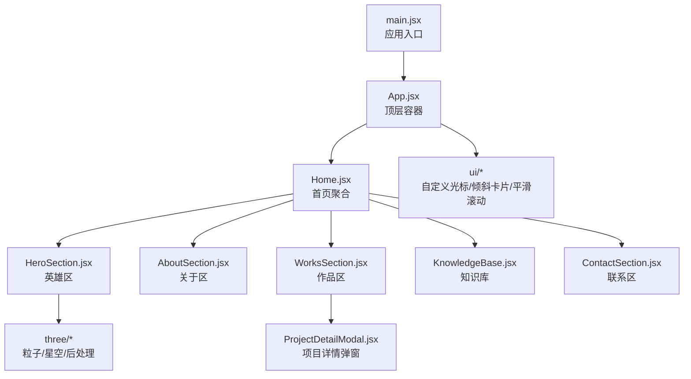
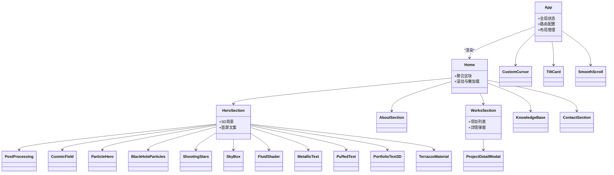
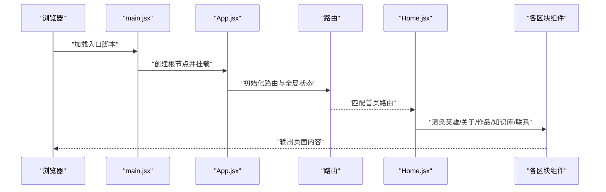
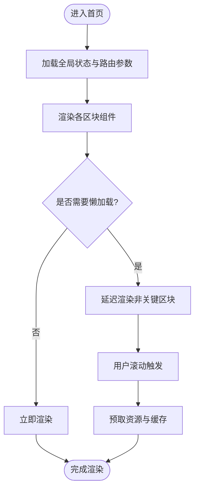
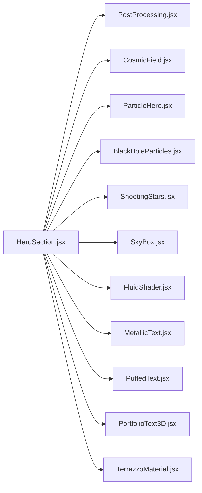
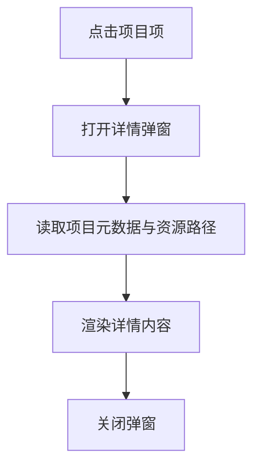
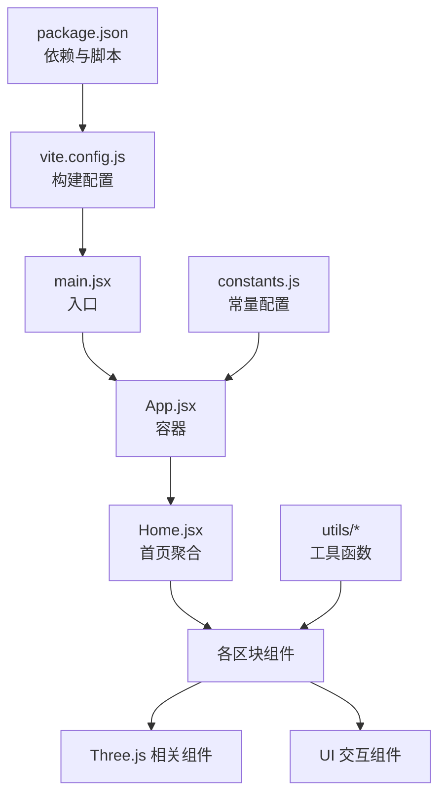

# 架构设计

<cite>
**本文引用的文件**   
- [main.jsx](file://src/main.jsx)
- [App.jsx](file://src/App.jsx)
- [Home.jsx](file://src/Home.jsx)
- [HeroSection.jsx](file://src/components/HeroSection.jsx)
- [AboutSection.jsx](file://src/components/AboutSection.jsx)
- [WorksSection.jsx](file://src/components/WorksSection.jsx)
- [KnowledgeBase.jsx](file://src/components/KnowledgeBase.jsx)
- [ContactSection.jsx](file://src/components/ContactSection.jsx)
- [PostProcessing.jsx](file://src/components/three/PostProcessing.jsx)
- [CosmicField.jsx](file://src/components/three/CosmicField.jsx)
- [ParticleHero.jsx](file://src/components/three/ParticleHero.jsx)
- [BlackHoleParticles.jsx](file://src/components/three/BlackHoleParticles.jsx)
- [ShootingStars.jsx](file://src/components/three/ShootingStars.jsx)
- [SkyBox.jsx](file://src/components/three/SkyBox.jsx)
- [FluidShader.jsx](file://src/components/three/FluidShader.jsx)
- [MetallicText.jsx](file://src/components/three/MetallicText.jsx)
- [PuffedText.jsx](file://src/components/three/PuffedText.jsx)
- [PortfolioText3D.jsx](file://src/components/three/PortfolioText3D.jsx)
- [TerrazzoMaterial.jsx](file://src/components/three/TerrazzoMaterial.jsx)
- [CustomCursor.jsx](file://src/components/ui/CustomCursor.jsx)
- [TiltCard.jsx](file://src/components/ui/TiltCard.jsx)
- [SmoothScroll.jsx](file://src/components/SmoothScroll.jsx)
- [ProjectDetailModal.jsx](file://src/components/ProjectDetailModal.jsx)
- [constants.js](file://src/constants.js)
- [path.js](file://src/utils/path.js)
- [vite.config.js](file://vite.config.js)
- [package.json](file://package.json)
</cite>

## 目录
1. [简介](#简介)
2. [项目结构](#项目结构)
3. [核心组件](#核心组件)
4. [架构总览](#架构总览)
5. [详细组件分析](#详细组件分析)
6. [依赖关系分析](#依赖关系分析)
7. [性能考量](#性能考量)
8. [故障排查指南](#故障排查指南)
9. [结论](#结论)
10. [附录](#附录)

## 简介
本架构设计文档面向Goodent项目的工程化与扩展性，围绕以下目标展开：
- 阐述整体系统架构与分层组织方式，包括组件化、单向数据流与模块化。
- 解释主入口 main.jsx 如何初始化React应用，以及 App.jsx 作为主容器如何管理全局状态与路由逻辑。
- 说明 Home.jsx 作为主页聚合层，如何组合各功能区块（英雄区、关于、作品、知识库、联系等）。
- 提供架构图表，展示组件层次关系与数据流向。
- 解释技术选型理由与权衡（如 React + Three.js、Vite）。
- 给出扩展机制与集成点建议，并总结性能优化策略与最佳实践。

## 项目结构
项目采用“按特性+按职责”的混合组织方式：
- src/main.jsx：应用启动与根节点挂载。
- src/App.jsx：顶层容器，负责全局状态、主题、路由与布局。
- src/Home.jsx：首页聚合器，组合多个业务区块。
- src/components：UI与Three.js场景组件按子域划分。
  - components/three：Three.js场景、材质、后处理与特效。
  - components/ui：通用交互组件（光标、卡片倾斜、平滑滚动等）。
- src/utils：工具函数（路径解析等）。
- public/projects：静态项目资源（图片、文档等），通过相对路径或工具函数访问。
- vite.config.js：构建配置（插件、别名、代理等）。
- package.json：依赖与脚本。

图表来源
- [main.jsx](file://src/main.jsx)
- [App.jsx](file://src/App.jsx)
- [Home.jsx](file://src/Home.jsx)
- [HeroSection.jsx](file://src/components/HeroSection.jsx)
- [AboutSection.jsx](file://src/components/AboutSection.jsx)
- [WorksSection.jsx](file://src/components/WorksSection.jsx)
- [KnowledgeBase.jsx](file://src/components/KnowledgeBase.jsx)
- [ContactSection.jsx](file://src/components/ContactSection.jsx)
- [PostProcessing.jsx](file://src/components/three/PostProcessing.jsx)
- [CosmicField.jsx](file://src/components/three/CosmicField.jsx)
- [ParticleHero.jsx](file://src/components/three/ParticleHero.jsx)
- [BlackHoleParticles.jsx](file://src/components/three/BlackHoleParticles.jsx)
- [ShootingStars.jsx](file://src/components/three/ShootingStars.jsx)
- [SkyBox.jsx](file://src/components/three/SkyBox.jsx)
- [FluidShader.jsx](file://src/components/three/FluidShader.jsx)
- [MetallicText.jsx](file://src/components/three/MetallicText.jsx)
- [PuffedText.jsx](file://src/components/three/PuffedText.jsx)
- [PortfolioText3D.jsx](file://src/components/three/PortfolioText3D.jsx)
- [TerrazzoMaterial.jsx](file://src/components/three/TerrazzoMaterial.jsx)
- [CustomCursor.jsx](file://src/components/ui/CustomCursor.jsx)
- [TiltCard.jsx](file://src/components/ui/TiltCard.jsx)
- [SmoothScroll.jsx](file://src/components/SmoothScroll.jsx)
- [ProjectDetailModal.jsx](file://src/components/ProjectDetailModal.jsx)

章节来源
- [main.jsx](file://src/main.jsx)
- [App.jsx](file://src/App.jsx)
- [Home.jsx](file://src/Home.jsx)
- [vite.config.js](file://vite.config.js)
- [package.json](file://package.json)

## 核心组件
- 应用入口 main.jsx
  - 负责创建React根节点、挂载到DOM、引入全局样式与必要的运行时依赖。
  - 通常在此处注入全局上下文（如主题、语言）与错误边界。
- 顶层容器 App.jsx
  - 管理全局状态（主题、用户信息、导航状态）、路由配置与页面布局。
  - 提供跨组件共享能力（例如通过Context或轻量状态库）。
- 首页聚合 Home.jsx
  - 将 HeroSection、AboutSection、WorksSection、KnowledgeBase、ContactSection 等模块组合为完整首页。
  - 协调区块间的交互（如滚动锚点、懒加载、预取资源）。

章节来源
- [main.jsx](file://src/main.jsx)
- [App.jsx](file://src/App.jsx)
- [Home.jsx](file://src/Home.jsx)

## 架构总览
整体采用“容器-展示-特效”三层分离：
- 容器层（App.jsx、Home.jsx）：负责状态、路由与页面编排。
- 展示层（各Section组件）：负责业务区块渲染与交互。
- 特效层（components/three）：封装Three.js场景、材质与后处理，供展示层按需引用。

图表来源
- [App.jsx](file://src/App.jsx)
- [Home.jsx](file://src/Home.jsx)
- [HeroSection.jsx](file://src/components/HeroSection.jsx)
- [AboutSection.jsx](file://src/components/AboutSection.jsx)
- [WorksSection.jsx](file://src/components/WorksSection.jsx)
- [KnowledgeBase.jsx](file://src/components/KnowledgeBase.jsx)
- [ContactSection.jsx](file://src/components/ContactSection.jsx)
- [PostProcessing.jsx](file://src/components/three/PostProcessing.jsx)
- [CosmicField.jsx](file://src/components/three/CosmicField.jsx)
- [ParticleHero.jsx](file://src/components/three/ParticleHero.jsx)
- [BlackHoleParticles.jsx](file://src/components/three/BlackHoleParticles.jsx)
- [ShootingStars.jsx](file://src/components/three/ShootingStars.jsx)
- [SkyBox.jsx](file://src/components/three/SkyBox.jsx)
- [FluidShader.jsx](file://src/components/three/FluidShader.jsx)
- [MetallicText.jsx](file://src/components/three/MetallicText.jsx)
- [PuffedText.jsx](file://src/components/three/PuffedText.jsx)
- [PortfolioText3D.jsx](file://src/components/three/PortfolioText3D.jsx)
- [TerrazzoMaterial.jsx](file://src/components/three/TerrazzoMaterial.jsx)
- [CustomCursor.jsx](file://src/components/ui/CustomCursor.jsx)
- [TiltCard.jsx](file://src/components/ui/TiltCard.jsx)
- [SmoothScroll.jsx](file://src/components/SmoothScroll.jsx)
- [ProjectDetailModal.jsx](file://src/components/ProjectDetailModal.jsx)

## 详细组件分析

### 应用入口与初始化流程
- main.jsx 负责创建React根节点并挂载到DOM，同时引入全局样式与必要的全局依赖。
- App.jsx 在挂载时初始化全局状态、注册路由与布局，并提供跨组件上下文。
- Home.jsx 作为首页聚合器，按需加载各区块，结合滚动与懒加载提升首屏体验。

图表来源
- [main.jsx](file://src/main.jsx)
- [App.jsx](file://src/App.jsx)
- [Home.jsx](file://src/Home.jsx)

章节来源
- [main.jsx](file://src/main.jsx)
- [App.jsx](file://src/App.jsx)
- [Home.jsx](file://src/Home.jsx)

### 首页聚合与区块协作
- Home.jsx 将多个业务区块组合为完整首页，并通过props与事件回调协调交互。
- 区块间通过受控状态或轻量上下文进行通信，避免深层级prop传递。
- 滚动与懒加载由统一工具或Hook管理，确保长页面性能。

图表来源
- [Home.jsx](file://src/Home.jsx)
- [HeroSection.jsx](file://src/components/HeroSection.jsx)
- [AboutSection.jsx](file://src/components/AboutSection.jsx)
- [WorksSection.jsx](file://src/components/WorksSection.jsx)
- [KnowledgeBase.jsx](file://src/components/KnowledgeBase.jsx)
- [ContactSection.jsx](file://src/components/ContactSection.jsx)

章节来源
- [Home.jsx](file://src/Home.jsx)
- [HeroSection.jsx](file://src/components/HeroSection.jsx)
- [AboutSection.jsx](file://src/components/AboutSection.jsx)
- [WorksSection.jsx](file://src/components/WorksSection.jsx)
- [KnowledgeBase.jsx](file://src/components/KnowledgeBase.jsx)
- [ContactSection.jsx](file://src/components/ContactSection.jsx)

### Three.js特效层设计与数据流
- 特效层以组件形式封装Three.js场景、材质与后处理，便于复用与按需加载。
- 常用组件包括：后处理、宇宙场、粒子英雄、黑洞粒子、流星、天空盒、流体着色器、金属文本、膨胀文本、作品集3D文本、水磨石材质等。
- 数据流遵循单向原则：父组件通过props传入配置（纹理、参数、动画时长），子组件内部维护渲染循环与生命周期。

图表来源
- [HeroSection.jsx](file://src/components/HeroSection.jsx)
- [PostProcessing.jsx](file://src/components/three/PostProcessing.jsx)
- [CosmicField.jsx](file://src/components/three/CosmicField.jsx)
- [ParticleHero.jsx](file://src/components/three/ParticleHero.jsx)
- [BlackHoleParticles.jsx](file://src/components/three/BlackHoleParticles.jsx)
- [ShootingStars.jsx](file://src/components/three/ShootingStars.jsx)
- [SkyBox.jsx](file://src/components/three/SkyBox.jsx)
- [FluidShader.jsx](file://src/components/three/FluidShader.jsx)
- [MetallicText.jsx](file://src/components/three/MetallicText.jsx)
- [PuffedText.jsx](file://src/components/three/PuffedText.jsx)
- [PortfolioText3D.jsx](file://src/components/three/PortfolioText3D.jsx)
- [TerrazzoMaterial.jsx](file://src/components/three/TerrazzoMaterial.jsx)

章节来源
- [HeroSection.jsx](file://src/components/HeroSection.jsx)
- [PostProcessing.jsx](file://src/components/three/PostProcessing.jsx)
- [CosmicField.jsx](file://src/components/three/CosmicField.jsx)
- [ParticleHero.jsx](file://src/components/three/ParticleHero.jsx)
- [BlackHoleParticles.jsx](file://src/components/three/BlackHoleParticles.jsx)
- [ShootingStars.jsx](file://src/components/three/ShootingStars.jsx)
- [SkyBox.jsx](file://src/components/three/SkyBox.jsx)
- [FluidShader.jsx](file://src/components/three/FluidShader.jsx)
- [MetallicText.jsx](file://src/components/three/MetallicText.jsx)
- [PuffedText.jsx](file://src/components/three/PuffedText.jsx)
- [PortfolioText3D.jsx](file://src/components/three/PortfolioText3D.jsx)
- [TerrazzoMaterial.jsx](file://src/components/three/TerrazzoMaterial.jsx)

### 通用交互组件与用户体验增强
- 自定义光标、倾斜卡片、平滑滚动等组件提升交互质感。
- 这些组件通常通过事件监听与CSS变换实现，注意移动端兼容性与性能。

章节来源
- [CustomCursor.jsx](file://src/components/ui/CustomCursor.jsx)
- [TiltCard.jsx](file://src/components/ui/TiltCard.jsx)
- [SmoothScroll.jsx](file://src/components/SmoothScroll.jsx)

### 项目详情弹窗与数据模型
- ProjectDetailModal 用于展示单个项目的详细信息，支持从列表点击跳转或弹窗打开。
- 数据模型包含项目元信息与资源路径，可通过 utils/path.js 进行路径解析与拼接。

图表来源
- [ProjectDetailModal.jsx](file://src/components/ProjectDetailModal.jsx)
- [path.js](file://src/utils/path.js)

章节来源
- [ProjectDetailModal.jsx](file://src/components/ProjectDetailModal.jsx)
- [path.js](file://src/utils/path.js)

## 依赖关系分析
- 构建与开发工具链
  - Vite：快速热更新、按需打包、插件生态丰富。
  - React：声明式UI、丰富的生态与社区支持。
  - Three.js：Web端高性能3D渲染，适合创意展示。
- 项目内依赖
  - 常量与配置集中在 constants.js，便于统一管理。
  - 路径工具 path.js 提供统一的资源访问方式。
  - 构建配置 vite.config.js 可设置别名、代理与插件。

图表来源
- [package.json](file://package.json)
- [vite.config.js](file://vite.config.js)
- [main.jsx](file://src/main.jsx)
- [App.jsx](file://src/App.jsx)
- [Home.jsx](file://src/Home.jsx)
- [constants.js](file://src/constants.js)
- [path.js](file://src/utils/path.js)

章节来源
- [package.json](file://package.json)
- [vite.config.js](file://vite.config.js)
- [constants.js](file://src/constants.js)
- [path.js](file://src/utils/path.js)

## 性能考量
- 首屏优化
  - 使用懒加载与代码分割，仅加载首屏必需资源。
  - 对Three.js场景进行按需实例化，避免不必要的渲染开销。
- 渲染优化
  - 合理拆分组件，减少重绘与回流。
  - 使用稳定的key与不可变数据结构，降低Diff成本。
- 资源优化
  - 图片与纹理压缩、CDN加速与缓存策略。
  - 字体与图标按需加载。
- 交互优化
  - 自定义光标与倾斜效果在低端设备上降级。
  - 平滑滚动使用requestAnimationFrame节流。
- 监控与度量
  - 接入性能埋点，监控FCP、LCP、CLS等指标。
  - 针对Three.js场景进行帧率与内存占用监控。

[本节为通用指导，不直接分析具体文件]

## 故障排查指南
- 常见问题定位
  - 入口挂载失败：检查main.jsx中根节点选择器与DOM就绪时机。
  - 路由异常：确认App.jsx中的路由配置与Home.jsx的匹配规则。
  - 3D场景卡顿：检查Three.js组件的渲染循环、纹理大小与后处理强度。
  - 资源路径错误：核对constants.js与path.js的路径拼接逻辑。
- 调试建议
  - 使用浏览器开发者工具的Performance面板分析渲染瓶颈。
  - 对Three.js场景启用调试模式，查看绘制调用与材质状态。
  - 对网络请求进行抓包，确认静态资源是否命中缓存。

章节来源
- [main.jsx](file://src/main.jsx)
- [App.jsx](file://src/App.jsx)
- [Home.jsx](file://src/Home.jsx)
- [constants.js](file://src/constants.js)
- [path.js](file://src/utils/path.js)

## 结论
Goodent项目采用清晰的容器-展示-特效分层架构，结合React与Three.js实现高表现力的创意展示。通过Vite构建工具与合理的组件拆分，项目在可维护性与性能之间取得良好平衡。后续扩展应遵循单向数据流与模块化原则，优先复用现有Three.js与UI组件，并在必要时引入新的聚合区块与路由页面。

[本节为总结性内容，不直接分析具体文件]

## 附录
- 技术选型理由与权衡
  - React + Three.js：声明式UI与3D渲染互补，适合交互式创意展示；需关注移动端性能与兼容性。
  - Vite：更快的开发与构建体验，插件生态完善；需关注生产环境体积与缓存策略。
- 扩展机制与集成点
  - 新增区块：在Home.jsx中聚合新组件，并在路由中注册对应路径。
  - 新增Three.js特效：在components/three下新建组件，通过props暴露配置接口。
  - 新增资源：在public/projects下放置资源，并通过utils/path.js进行访问。
- 最佳实践
  - 保持组件单一职责，避免过度耦合。
  - 使用常量与配置文件集中管理易变参数。
  - 对复杂交互进行单元测试与端到端测试覆盖。

[本节为补充信息，不直接分析具体文件]