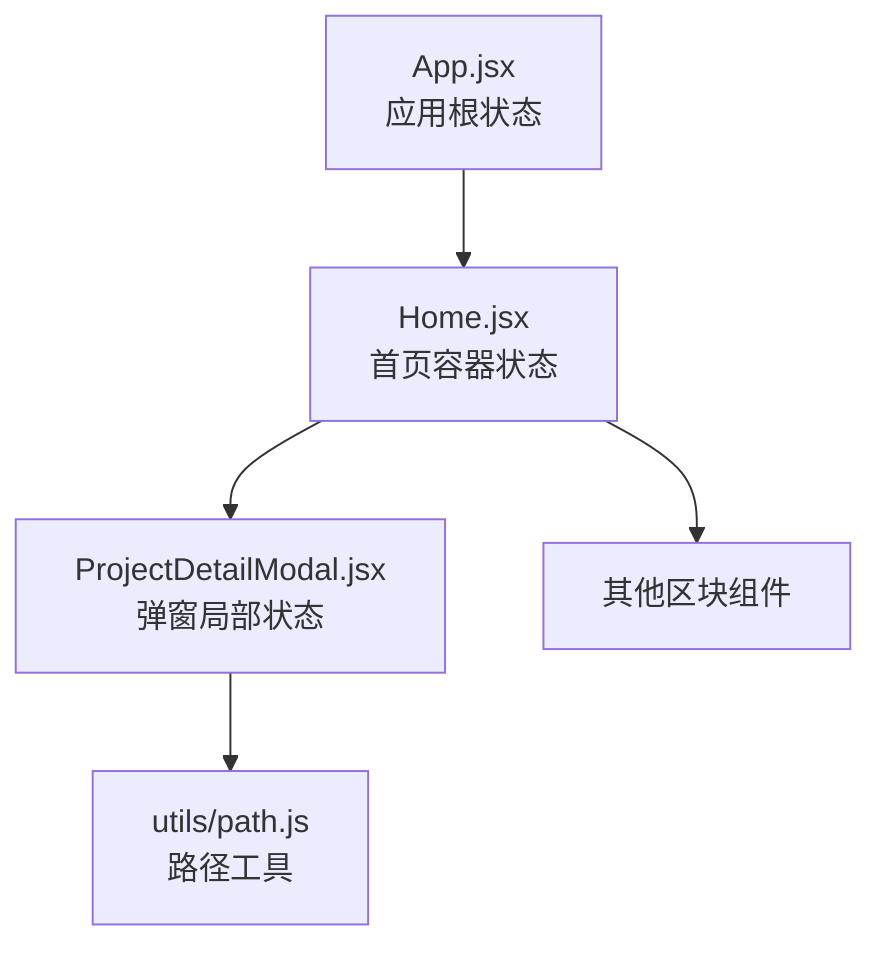
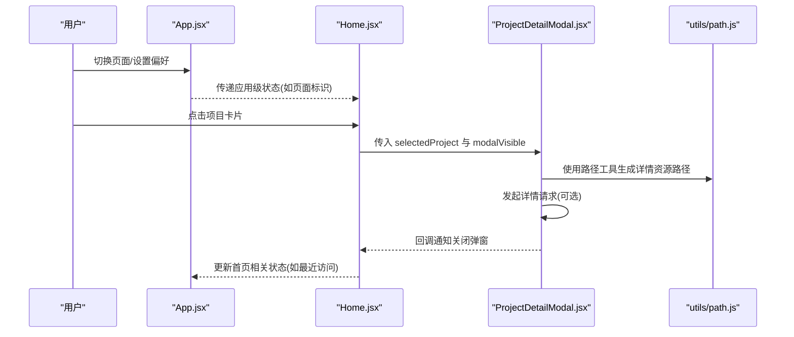
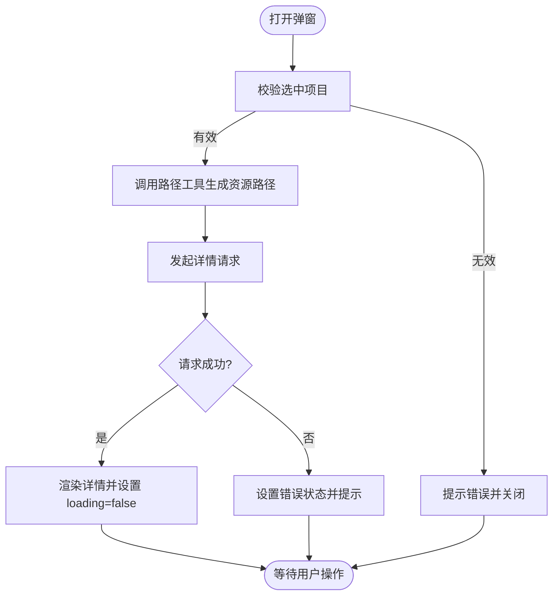
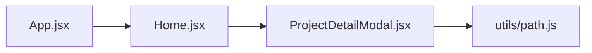

# 状态管理模式

<cite>
**本文引用的文件**   
- [App.jsx](file://src/App.jsx)
- [Home.jsx](file://src/Home.jsx)
- [ProjectDetailModal.jsx](file://src/components/ProjectDetailModal.jsx)
- [path.js](file://src/utils/path.js)
</cite>

## 目录
1. [简介](#简介)
2. [项目结构](#项目结构)
3. [核心组件与状态职责](#核心组件与状态职责)
4. [架构总览](#架构总览)
5. [详细组件分析](#详细组件分析)
6. [依赖关系分析](#依赖关系分析)
7. [性能考虑](#性能考虑)
8. [故障排查指南](#故障排查指南)
9. [结论](#结论)
10. [附录](#附录)

## 简介
本文件聚焦 Goodent 项目的状态管理模式，围绕 React Hooks（useState、useEffect）的使用策略展开，说明全局状态在 App.jsx 与 Home.jsx 中的组织方式，局部状态在 ProjectDetailModal.jsx 中的处理模式，以及工具函数 utils/path.js 在状态管理中的作用与最佳实践。文档还涵盖异步状态更新、错误状态管理、状态持久化策略、性能优化技巧（如选择器与记忆化），并总结状态提升的设计原则与适用场景。

## 项目结构
Goodent 采用轻量级前端架构，状态主要分布在以下位置：
- 应用根层：App.jsx 负责顶层路由或页面切换的状态，必要时将关键状态提升到父组件以共享给子视图。
- 首页容器：Home.jsx 作为内容入口，聚合多个区块组件，集中管理页面级数据加载与交互状态。
- 详情弹窗：ProjectDetailModal.jsx 管理弹窗的显示/隐藏、选中项目、加载进度与错误信息。
- 路径工具：utils/path.js 提供统一的路径解析与拼接能力，避免硬编码路径导致的“脏状态”和渲染不一致。

图表来源
- [App.jsx](file://src/App.jsx)
- [Home.jsx](file://src/Home.jsx)
- [ProjectDetailModal.jsx](file://src/components/ProjectDetailModal.jsx)
- [path.js](file://src/utils/path.js)

章节来源
- [App.jsx](file://src/App.jsx)
- [Home.jsx](file://src/Home.jsx)
- [ProjectDetailModal.jsx](file://src/components/ProjectDetailModal.jsx)
- [path.js](file://src/utils/path.js)

## 核心组件与状态职责
- App.jsx
  - 职责：维护应用级最小必要状态（例如当前页面标识、主题、语言等），必要时通过 props 向下传递。
  - 状态类型：UI 开关、页面导航、用户偏好。
  - 副作用：根据应用级状态初始化资源或监听全局事件。
- Home.jsx
  - 职责：聚合首页所需的数据与交互状态，协调各区块组件；负责数据获取、缓存与错误恢复。
  - 状态类型：列表数据、分页、筛选条件、加载与错误标志。
  - 副作用：基于查询参数或用户输入触发数据请求；将结果写入本地存储以实现简单持久化。
- ProjectDetailModal.jsx
  - 职责：管理弹窗可见性、当前选中项目、详情加载状态与错误提示。
  - 状态类型：modalVisible、selectedProject、loading、error。
  - 副作用：打开弹窗时按需拉取详情；关闭弹窗时清理临时状态。
- utils/path.js
  - 职责：提供路径拼接、相对路径解析、静态资源定位等工具方法，确保状态中存储的是稳定且可序列化的键值（如项目 ID），由工具函数动态生成展示路径。
  - 最佳实践：所有涉及路径的状态只保存“稳定键”，渲染前再调用 path.js 生成最终路径，避免重复计算与不一致。

章节来源
- [App.jsx](file://src/App.jsx)
- [Home.jsx](file://src/Home.jsx)
- [ProjectDetailModal.jsx](file://src/components/ProjectDetailModal.jsx)
- [path.js](file://src/utils/path.js)

## 架构总览
下图展示了状态在各组件间的流动与依赖关系，强调“最小必要状态上提 + 局部状态下沉”的原则。

图表来源
- [App.jsx](file://src/App.jsx)
- [Home.jsx](file://src/Home.jsx)
- [ProjectDetailModal.jsx](file://src/components/ProjectDetailModal.jsx)
- [path.js](file://src/utils/path.js)

## 详细组件分析

### App.jsx 状态设计
- 状态范围
  - 应用级 UI 控制（如主题、语言、导航）。
  - 跨页面共享的最小上下文（如用户会话标识）。
- 副作用
  - 根据应用级状态初始化第三方库或监听全局事件。
- 状态提升
  - 当某个子组件需要跨兄弟组件共享状态时，将其提升至 App.jsx，并通过 props 分发。
- 错误边界
  - 在根层捕获不可恢复的错误，降级到友好界面。

章节来源
- [App.jsx](file://src/App.jsx)

### Home.jsx 状态设计
- 数据流
  - 从后端或静态数据源获取列表，缓存至本地存储，减少重复请求。
  - 将筛选、排序、分页等状态集中在 Home.jsx，向子组件下发派生后的数据。
- 异步状态
  - 使用 loading 与 error 标志区分请求阶段，结合超时与重试策略提升鲁棒性。
- 持久化
  - 对非敏感配置与最近访问记录进行 localStorage 持久化，并在组件挂载时恢复。
- 选择器与记忆化
  - 对复杂过滤/排序逻辑使用选择器模式，配合 useMemo/useCallback 降低重渲染成本。

章节来源
- [Home.jsx](file://src/Home.jsx)

### ProjectDetailModal.jsx 局部状态
- 状态字段
  - modalVisible：控制弹窗显隐。
  - selectedProject：当前选中项的稳定键（如 ID）。
  - loading/error：详情加载状态与错误信息。
- 生命周期
  - 打开弹窗：校验 selectedProject，调用路径工具生成资源路径，按需拉取详情。
  - 关闭弹窗：重置 loading/error，释放临时引用。
- 与父组件通信
  - 通过回调函数向上通知关闭或选中变更，保持单向数据流。

图表来源
- [ProjectDetailModal.jsx](file://src/components/ProjectDetailModal.jsx)
- [path.js](file://src/utils/path.js)

章节来源
- [ProjectDetailModal.jsx](file://src/components/ProjectDetailModal.jsx)

### utils/path.js 工具函数与最佳实践
- 作用
  - 统一路径拼接与解析，屏蔽环境差异（开发/生产）。
  - 将“稳定键”转换为“展示路径”，使状态更简洁、可序列化。
- 最佳实践
  - 状态中仅保存稳定键（如项目 ID），渲染前再调用工具函数生成路径。
  - 对外暴露纯函数接口，便于单元测试与复用。
  - 对异常输入做防御性处理，返回默认路径或抛出明确错误。

章节来源
- [path.js](file://src/utils/path.js)

## 依赖关系分析
- 组件耦合
  - App.jsx 与 Home.jsx 通过 props 耦合，Home.jsx 与 ProjectDetailModal.jsx 通过回调与 props 耦合。
- 外部依赖
  - 路径工具 utils/path.js 被弹窗与可能的其他组件复用，降低硬编码带来的状态漂移。
- 潜在循环
  - 组件间应保持单向数据流，避免双向绑定导致的状态环。

图表来源
- [App.jsx](file://src/App.jsx)
- [Home.jsx](file://src/Home.jsx)
- [ProjectDetailModal.jsx](file://src/components/ProjectDetailModal.jsx)
- [path.js](file://src/utils/path.js)

章节来源
- [App.jsx](file://src/App.jsx)
- [Home.jsx](file://src/Home.jsx)
- [ProjectDetailModal.jsx](file://src/components/ProjectDetailModal.jsx)
- [path.js](file://src/utils/path.js)

## 性能考虑
- 状态选择器
  - 将复杂派生逻辑封装为选择器，仅在输入变化时重新计算，减少不必要的渲染。
- 记忆化技术
  - 使用 useMemo 缓存昂贵计算结果，使用 useCallback 稳定回调引用，避免子组件因引用变化而重渲染。
- 懒加载与分片
  - 对大列表或详情图片进行懒加载，首屏优先渲染关键内容。
- 去抖与节流
  - 搜索、滚动等高频事件使用去抖/节流，降低状态更新频率。
- 状态粒度
  - 将频繁变化的状态拆分为更细粒度的 state，避免整块状态更新引发大面积重渲染。

[本节为通用指导，不直接分析具体文件]

## 故障排查指南
- 常见问题
  - 弹窗未正确关闭：检查 modalVisible 的回调是否被正确触发与清除。
  - 路径不一致：确认状态中仅保存稳定键，渲染前统一通过路径工具生成。
  - 异步竞态：为请求添加唯一标识或取消令牌，避免旧响应覆盖新状态。
  - 错误状态丢失：在组件卸载或弹窗关闭时重置 loading/error，防止残留状态影响后续交互。
- 调试建议
  - 打印关键状态快照，对比前后差异。
  - 使用浏览器开发者工具的组件面板观察重渲染次数。
  - 对路径工具增加入参校验日志，快速定位非法输入。

章节来源
- [ProjectDetailModal.jsx](file://src/components/ProjectDetailModal.jsx)
- [path.js](file://src/utils/path.js)

## 结论
Goodent 的状态管理遵循“最小必要状态上提 + 局部状态下沉”的原则，利用 React Hooks 实现清晰的数据流与副作用分离。通过 utils/path.js 将稳定键与展示路径解耦，提升了状态的可维护性与一致性。结合选择器与记忆化技术，可在保证可读性的同时获得良好的性能表现。对于异步与错误状态，建议引入统一的加载/错误标志与清理策略，确保用户体验稳定可靠。

[本节为总结性内容，不直接分析具体文件]

## 附录
- 术语
  - 状态提升：将状态移动到最近的共同父组件，以便多个子组件共享。
  - 选择器：从原始状态派生出视图所需数据的纯函数。
  - 记忆化：缓存计算结果以避免重复计算。
- 参考实践
  - 在弹窗组件中始终包含 loading/error 状态，并在关闭时清理。
  - 在路径相关的状态中只保存稳定键，渲染前再解析为完整路径。

[本节为概念性内容，不直接分析具体文件]