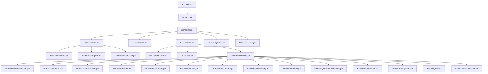
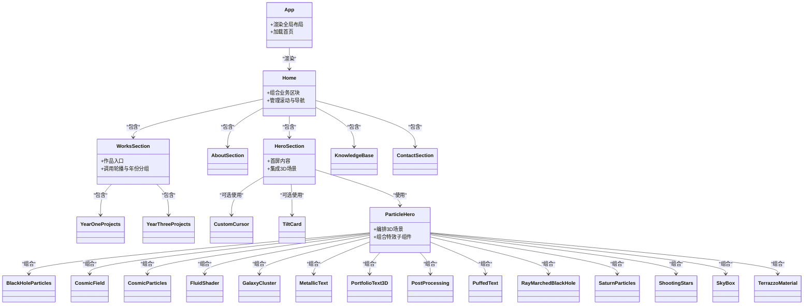
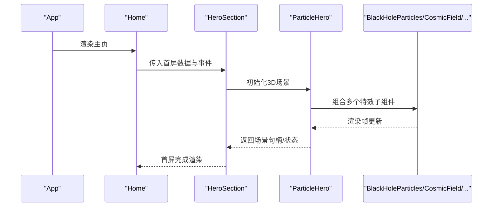
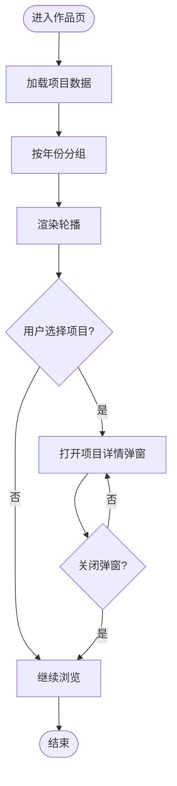
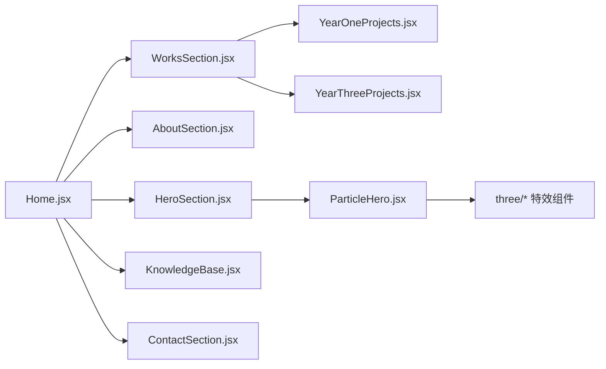

# 组件层次结构

<cite>
**本文引用的文件**   
- [main.jsx](file://src/main.jsx)
- [App.jsx](file://src/App.jsx)
- [Home.jsx](file://src/Home.jsx)
- [HeroSection.jsx](file://src/components/HeroSection.jsx)
- [AboutSection.jsx](file://src/components/AboutSection.jsx)
- [WorksSection.jsx](file://src/components/WorksSection.jsx)
- [YearOneProjects.jsx](file://src/components/YearOneProjects.jsx)
- [YearThreeProjects.jsx](file://src/components/YearThreeProjects.jsx)
- [KnowledgeBase.jsx](file://src/components/KnowledgeBase.jsx)
- [ContactSection.jsx](file://src/components/ContactSection.jsx)
- [ProjectDetailModal.jsx](file://src/components/ProjectDetailModal.jsx)
- [SmoothScroll.jsx](file://src/components/SmoothScroll.jsx)
- [CoverFlowCarousel.jsx](file://src/components/CoverFlowCarousel.jsx)
- [CustomCursor.jsx](file://src/components/ui/CustomCursor.jsx)
- [TiltCard.jsx](file://src/components/ui/TiltCard.jsx)
- [BlackHoleParticles.jsx](file://src/components/three/BlackHoleParticles.jsx)
- [CosmicField.jsx](file://src/components/three/CosmicField.jsx)
- [CosmicParticles.jsx](file://src/components/three/CosmicParticles.jsx)
- [FluidShader.jsx](file://src/components/three/FluidShader.jsx)
- [GalaxyCluster.jsx](file://src/components/three/GalaxyCluster.jsx)
- [MetallicText.jsx](file://src/components/three/MetallicText.jsx)
- [ParticleHero.jsx](file://src/components/three/ParticleHero.jsx)
- [PortfolioText3D.jsx](file://src/components/three/PortfolioText3D.jsx)
- [PostProcessing.jsx](file://src/components/three/PostProcessing.jsx)
- [PuffedText.jsx](file://src/components/three/PuffedText.jsx)
- [RayMarchedBlackHole.jsx](file://src/components/three/RayMarchedBlackHole.jsx)
- [SaturnParticles.jsx](file://src/components/three/SaturnParticles.jsx)
- [ShootingStars.jsx](file://src/components/three/ShootingStars.jsx)
- [SkyBox.jsx](file://src/components/three/SkyBox.jsx)
- [TerrazzoMaterial.jsx](file://src/components/three/TerrazzoMaterial.jsx)
</cite>

## 目录
1. [简介](#简介)
2. [项目结构](#项目结构)
3. [核心组件](#核心组件)
4. [架构总览](#架构总览)
5. [详细组件分析](#详细组件分析)
6. [依赖关系分析](#依赖关系分析)
7. [性能考量](#性能考量)
8. [故障排查指南](#故障排查指南)
9. [结论](#结论)
10. [附录](#附录)

## 简介
本文件聚焦于 Goodent 项目的 React 组件层次结构，从根入口到主页容器，再到各功能区块与通用 UI、3D 特效组件的层级关系。文档旨在帮助读者理解：
- 组件树的组织方式与职责边界
- 组合模式与可复用策略
- 命名规范与目录组织
- 避免过度嵌套与循环依赖的最佳实践

## 项目结构
Goodent 采用“按特性分层 + 通用能力下沉”的组织方式：
- src/main.jsx：应用启动与挂载点
- src/App.jsx：顶层布局与全局配置
- src/Home.jsx：主页容器，聚合业务区块
- src/components：业务区块与通用 UI、3D 特效
  - ui：纯展示型 UI 组件（如自定义光标、卡片）
  - three：基于 Three.js 的视觉特效组件
  - 其他：页面级区块（Hero、About、Works、KnowledgeBase、Contact 等）

图表来源
- [main.jsx](file://src/main.jsx)
- [App.jsx](file://src/App.jsx)
- [Home.jsx](file://src/Home.jsx)
- [HeroSection.jsx](file://src/components/HeroSection.jsx)
- [AboutSection.jsx](file://src/components/AboutSection.jsx)
- [WorksSection.jsx](file://src/components/WorksSection.jsx)
- [YearOneProjects.jsx](file://src/components/YearOneProjects.jsx)
- [YearThreeProjects.jsx](file://src/components/YearThreeProjects.jsx)
- [KnowledgeBase.jsx](file://src/components/KnowledgeBase.jsx)
- [ContactSection.jsx](file://src/components/ContactSection.jsx)
- [CoverFlowCarousel.jsx](file://src/components/CoverFlowCarousel.jsx)
- [CustomCursor.jsx](file://src/components/ui/CustomCursor.jsx)
- [TiltCard.jsx](file://src/components/ui/TiltCard.jsx)
- [ParticleHero.jsx](file://src/components/three/ParticleHero.jsx)
- [BlackHoleParticles.jsx](file://src/components/three/BlackHoleParticles.jsx)
- [CosmicField.jsx](file://src/components/three/CosmicField.jsx)
- [CosmicParticles.jsx](file://src/components/three/CosmicParticles.jsx)
- [FluidShader.jsx](file://src/components/three/FluidShader.jsx)
- [GalaxyCluster.jsx](file://src/components/three/GalaxyCluster.jsx)
- [MetallicText.jsx](file://src/components/three/MetallicText.jsx)
- [PortfolioText3D.jsx](file://src/components/three/PortfolioText3D.jsx)
- [PostProcessing.jsx](file://src/components/three/PostProcessing.jsx)
- [PuffedText.jsx](file://src/components/three/PuffedText.jsx)
- [RayMarchedBlackHole.jsx](file://src/components/three/RayMarchedBlackHole.jsx)
- [SaturnParticles.jsx](file://src/components/three/SaturnParticles.jsx)
- [ShootingStars.jsx](file://src/components/three/ShootingStars.jsx)
- [SkyBox.jsx](file://src/components/three/SkyBox.jsx)
- [TerrazzoMaterial.jsx](file://src/components/three/TerrazzoMaterial.jsx)

章节来源
- [main.jsx](file://src/main.jsx)
- [App.jsx](file://src/App.jsx)
- [Home.jsx](file://src/Home.jsx)

## 核心组件
- 根入口 main.jsx：负责创建 React 应用实例并挂载到 DOM。
- App.jsx：提供全局样式、路由或布局壳层，承载 Home 作为主视图。
- Home.jsx：主页容器，组合 Hero、About、Works、KnowledgeBase、Contact 等业务区块。
- 业务区块组件：
  - HeroSection.jsx：首屏视觉区，可能包含 3D 粒子与动效。
  - AboutSection.jsx：关于信息展示。
  - WorksSection.jsx：作品集合入口，内部使用轮播与年份分组。
  - YearOneProjects.jsx / YearThreeProjects.jsx：按年份聚合的项目列表。
  - KnowledgeBase.jsx：知识库模块。
  - ContactSection.jsx：联系方式与表单。
- 通用 UI 组件（ui/）：
  - CustomCursor.jsx：自定义鼠标指针。
  - TiltCard.jsx：带倾斜交互的卡片。
- 3D 特效组件（three/）：
  - ParticleHero.jsx：首屏 3D 场景编排器，组合多个粒子/材质/后处理子组件。
  - 其余为独立特效单元（星空、流体、金属字、后处理等）。

章节来源
- [App.jsx](file://src/App.jsx)
- [Home.jsx](file://src/Home.jsx)
- [HeroSection.jsx](file://src/components/HeroSection.jsx)
- [AboutSection.jsx](file://src/components/AboutSection.jsx)
- [WorksSection.jsx](file://src/components/WorksSection.jsx)
- [YearOneProjects.jsx](file://src/components/YearOneProjects.jsx)
- [YearThreeProjects.jsx](file://src/components/YearThreeProjects.jsx)
- [KnowledgeBase.jsx](file://src/components/KnowledgeBase.jsx)
- [ContactSection.jsx](file://src/components/ContactSection.jsx)
- [CustomCursor.jsx](file://src/components/ui/CustomCursor.jsx)
- [TiltCard.jsx](file://src/components/ui/TiltCard.jsx)
- [ParticleHero.jsx](file://src/components/three/ParticleHero.jsx)

## 架构总览
整体采用“容器-区块-原子”的分层组合：
- 容器层：Home 聚合页面区块；App 提供全局壳层。
- 区块层：Hero/About/Works/KnowledgeBase/Contact 各自封装一段业务逻辑与数据流。
- 原子层：ui 与 three 下的通用 UI 与 3D 特效，具备高内聚、低耦合特性。

图表来源
- [App.jsx](file://src/App.jsx)
- [Home.jsx](file://src/Home.jsx)
- [HeroSection.jsx](file://src/components/HeroSection.jsx)
- [AboutSection.jsx](file://src/components/AboutSection.jsx)
- [WorksSection.jsx](file://src/components/WorksSection.jsx)
- [YearOneProjects.jsx](file://src/components/YearOneProjects.jsx)
- [YearThreeProjects.jsx](file://src/components/YearThreeProjects.jsx)
- [KnowledgeBase.jsx](file://src/components/KnowledgeBase.jsx)
- [ContactSection.jsx](file://src/components/ContactSection.jsx)
- [CustomCursor.jsx](file://src/components/ui/CustomCursor.jsx)
- [TiltCard.jsx](file://src/components/ui/TiltCard.jsx)
- [ParticleHero.jsx](file://src/components/three/ParticleHero.jsx)
- [BlackHoleParticles.jsx](file://src/components/three/BlackHoleParticles.jsx)
- [CosmicField.jsx](file://src/components/three/CosmicField.jsx)
- [CosmicParticles.jsx](file://src/components/three/CosmicParticles.jsx)
- [FluidShader.jsx](file://src/components/three/FluidShader.jsx)
- [GalaxyCluster.jsx](file://src/components/three/GalaxyCluster.jsx)
- [MetallicText.jsx](file://src/components/three/MetallicText.jsx)
- [PortfolioText3D.jsx](file://src/components/three/PortfolioText3D.jsx)
- [PostProcessing.jsx](file://src/components/three/PostProcessing.jsx)
- [PuffedText.jsx](file://src/components/three/PuffedText.jsx)
- [RayMarchedBlackHole.jsx](file://src/components/three/RayMarchedBlackHole.jsx)
- [SaturnParticles.jsx](file://src/components/three/SaturnParticles.jsx)
- [ShootingStars.jsx](file://src/components/three/ShootingStars.jsx)
- [SkyBox.jsx](file://src/components/three/SkyBox.jsx)
- [TerrazzoMaterial.jsx](file://src/components/three/TerrazzoMaterial.jsx)

## 详细组件分析

### 根与容器层
- App.jsx
  - 职责：提供全局样式、路由/布局壳层，渲染 Home 作为主视图。
  - 边界：不承载具体业务逻辑，仅做装配与上下文注入。
- Home.jsx
  - 职责：聚合 Hero、About、Works、KnowledgeBase、Contact 等区块，统一处理滚动锚点与导航状态。
  - 边界：不直接实现细节，通过 props 向子区块传递数据与回调。

章节来源
- [App.jsx](file://src/App.jsx)
- [Home.jsx](file://src/Home.jsx)

### 首屏区块（HeroSection）
- 职责：呈现首屏视觉与信息，集成 3D 粒子场景与基础交互。
- 组合模式：
  - 使用 ParticleHero 编排 3D 场景。
  - 可选引入 CustomCursor、TiltCard 增强交互体验。
- 拆分建议：
  - 将文案、CTA、背景图层进一步拆分为更小的展示组件，便于主题切换与多语言扩展。

图表来源
- [HeroSection.jsx](file://src/components/HeroSection.jsx)
- [ParticleHero.jsx](file://src/components/three/ParticleHero.jsx)
- [BlackHoleParticles.jsx](file://src/components/three/BlackHoleParticles.jsx)
- [CosmicField.jsx](file://src/components/three/CosmicField.jsx)
- [CosmicParticles.jsx](file://src/components/three/CosmicParticles.jsx)
- [FluidShader.jsx](file://src/components/three/FluidShader.jsx)
- [GalaxyCluster.jsx](file://src/components/three/GalaxyCluster.jsx)
- [MetallicText.jsx](file://src/components/three/MetallicText.jsx)
- [PortfolioText3D.jsx](file://src/components/three/PortfolioText3D.jsx)
- [PostProcessing.jsx](file://src/components/three/PostProcessing.jsx)
- [PuffedText.jsx](file://src/components/three/PuffedText.jsx)
- [RayMarchedBlackHole.jsx](file://src/components/three/RayMarchedBlackHole.jsx)
- [SaturnParticles.jsx](file://src/components/three/SaturnParticles.jsx)
- [ShootingStars.jsx](file://src/components/three/ShootingStars.jsx)
- [SkyBox.jsx](file://src/components/three/SkyBox.jsx)
- [TerrazzoMaterial.jsx](file://src/components/three/TerrazzoMaterial.jsx)

章节来源
- [HeroSection.jsx](file://src/components/HeroSection.jsx)
- [CustomCursor.jsx](file://src/components/ui/CustomCursor.jsx)
- [TiltCard.jsx](file://src/components/ui/TiltCard.jsx)
- [ParticleHero.jsx](file://src/components/three/ParticleHero.jsx)

### 作品区块（WorksSection 及年份分组）
- WorksSection
  - 职责：作品入口页，提供分类与筛选，驱动 CoverFlowCarousel 展示。
  - 组合模式：组合 YearOneProjects、YearThreeProjects 等年份分组组件。
- YearOneProjects / YearThreeProjects
  - 职责：按年份聚合项目卡片，支持点击打开详情弹窗。
  - 交互：与 ProjectDetailModal 协作，传递选中项目数据。

图表来源
- [WorksSection.jsx](file://src/components/WorksSection.jsx)
- [YearOneProjects.jsx](file://src/components/YearOneProjects.jsx)
- [YearThreeProjects.jsx](file://src/components/YearThreeProjects.jsx)
- [CoverFlowCarousel.jsx](file://src/components/CoverFlowCarousel.jsx)
- [ProjectDetailModal.jsx](file://src/components/ProjectDetailModal.jsx)

章节来源
- [WorksSection.jsx](file://src/components/WorksSection.jsx)
- [YearOneProjects.jsx](file://src/components/YearOneProjects.jsx)
- [YearThreeProjects.jsx](file://src/components/YearThreeProjects.jsx)
- [CoverFlowCarousel.jsx](file://src/components/CoverFlowCarousel.jsx)
- [ProjectDetailModal.jsx](file://src/components/ProjectDetailModal.jsx)

### 知识库与联系区块
- KnowledgeBase
  - 职责：展示知识库条目，支持检索与分类。
  - 拆分建议：将条目卡片、搜索框、分页等拆为原子组件。
- ContactSection
  - 职责：联系方式与表单提交，校验与反馈。
  - 拆分建议：将表单字段、校验规则、成功/失败提示拆为独立组件。

章节来源
- [KnowledgeBase.jsx](file://src/components/KnowledgeBase.jsx)
- [ContactSection.jsx](file://src/components/ContactSection.jsx)

### 通用 UI 与 3D 特效
- ui/CustomCursor、ui/TiltCard
  - 职责：无状态或弱状态的展示型组件，关注交互与样式。
  - 复用策略：以 props 控制外观与行为，避免隐式依赖。
- three/*
  - 职责：独立的 3D 视觉单元，适合在首屏或特定区域按需加载。
  - 编排器：ParticleHero 作为编排中心，组合多种特效与材质。
  - 优化建议：对重型 3D 组件进行懒加载与资源预取，减少首屏压力。

章节来源
- [CustomCursor.jsx](file://src/components/ui/CustomCursor.jsx)
- [TiltCard.jsx](file://src/components/ui/TiltCard.jsx)
- [ParticleHero.jsx](file://src/components/three/ParticleHero.jsx)
- [BlackHoleParticles.jsx](file://src/components/three/BlackHoleParticles.jsx)
- [CosmicField.jsx](file://src/components/three/CosmicField.jsx)
- [CosmicParticles.jsx](file://src/components/three/CosmicParticles.jsx)
- [FluidShader.jsx](file://src/components/three/FluidShader.jsx)
- [GalaxyCluster.jsx](file://src/components/three/GalaxyCluster.jsx)
- [MetallicText.jsx](file://src/components/three/MetallicText.jsx)
- [PortfolioText3D.jsx](file://src/components/three/PortfolioText3D.jsx)
- [PostProcessing.jsx](file://src/components/three/PostProcessing.jsx)
- [PuffedText.jsx](file://src/components/three/PuffedText.jsx)
- [RayMarchedBlackHole.jsx](file://src/components/three/RayMarchedBlackHole.jsx)
- [SaturnParticles.jsx](file://src/components/three/SaturnParticles.jsx)
- [ShootingStars.jsx](file://src/components/three/ShootingStars.jsx)
- [SkyBox.jsx](file://src/components/three/SkyBox.jsx)
- [TerrazzoMaterial.jsx](file://src/components/three/TerrazzoMaterial.jsx)

## 依赖关系分析
- 组件耦合度
  - 容器层（Home）与区块层（Hero/About/Works/...）松耦合，通过 props 通信。
  - 3D 特效集中在 three/ 下，由 ParticleHero 编排，避免在各区块重复实现。
- 潜在循环依赖
  - 当前结构未见明显循环引用；若新增跨区块共享状态，建议使用 Context 或轻量状态库，避免双向依赖。
- 外部依赖
  - 3D 特效依赖 Three.js 生态；建议在入口处按需加载，降低初始包体积。

图表来源
- [Home.jsx](file://src/Home.jsx)
- [HeroSection.jsx](file://src/components/HeroSection.jsx)
- [AboutSection.jsx](file://src/components/AboutSection.jsx)
- [WorksSection.jsx](file://src/components/WorksSection.jsx)
- [YearOneProjects.jsx](file://src/components/YearOneProjects.jsx)
- [YearThreeProjects.jsx](file://src/components/YearThreeProjects.jsx)
- [KnowledgeBase.jsx](file://src/components/KnowledgeBase.jsx)
- [ContactSection.jsx](file://src/components/ContactSection.jsx)
- [ParticleHero.jsx](file://src/components/three/ParticleHero.jsx)

## 性能考量
- 首屏优化
  - 对 3D 场景进行懒加载与分片加载，优先渲染关键文本与图片。
  - 使用 Suspense 与动态 import 包裹重型组件。
- 渲染优化
  - 对列表项（项目卡片）使用稳定 key，避免不必要的重排。
  - 对频繁更新的 3D 场景使用 requestAnimationFrame 节流与离屏渲染。
- 资源管理
  - 纹理与模型资源预取与缓存，避免二次下载。
  - 合理设置 Three.js 渲染分辨率与像素比，平衡画质与性能。

## 故障排查指南
- 常见问题
  - 3D 场景未显示：检查 WebGL 支持、着色器编译错误与资源路径。
  - 轮播卡顿：确认数据量与动画帧率，必要时降级为静态展示。
  - 自定义光标异常：在非触摸设备检测与事件监听清理。
- 定位步骤
  - 在浏览器控制台查看报错堆栈，定位到对应组件文件。
  - 逐步注释 3D 子组件，缩小问题范围。
  - 使用 React DevTools 检查组件树与 props 传递是否正确。

## 结论
Goodent 的组件层次清晰，遵循“容器-区块-原子”的组合模式，具备良好的可扩展性与可维护性。建议持续完善：
- 明确每个组件的职责边界与对外接口
- 将大组件拆分为更小、更专注的子组件
- 建立统一的命名规范与目录约定
- 对 3D 特效进行按需加载与性能监控

## 附录
- 命名规范
  - 业务组件：语义化命名，如 HeroSection、WorksSection。
  - 通用 UI：前缀 ui/，如 CustomCursor、TiltCard。
  - 3D 特效：前缀 three/，如 ParticleHero、BlackHoleParticles。
- 目录组织策略
  - 按特性划分区块，通用能力下沉至 ui 与 three。
  - 保持组件文件与样式文件就近存放，提升可读性。
- 复用策略与最佳实践
  - 通过 props 暴露可控属性，避免隐式依赖。
  - 使用组合而非继承，提高灵活性。
  - 避免深层嵌套与循环依赖，必要时引入状态管理或事件总线。