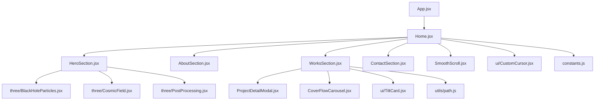
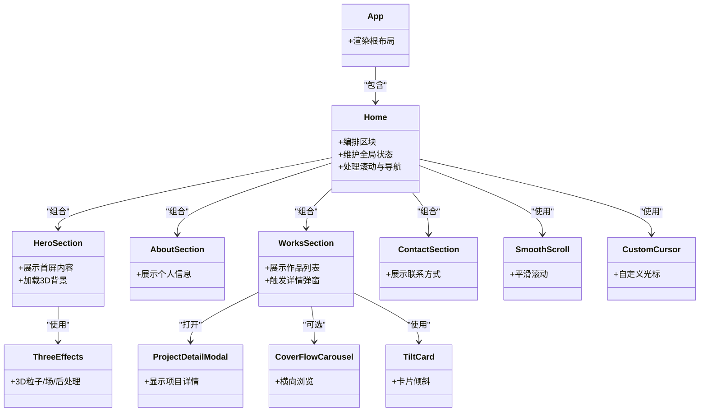
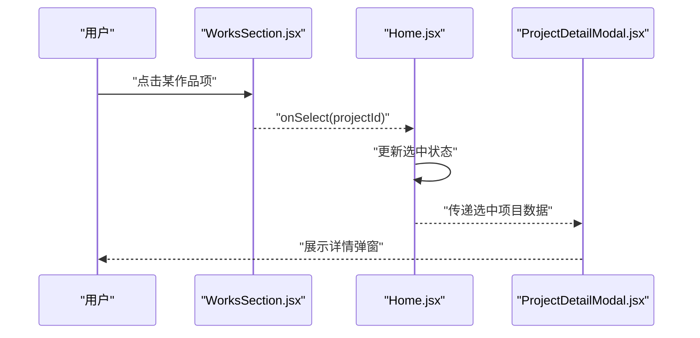
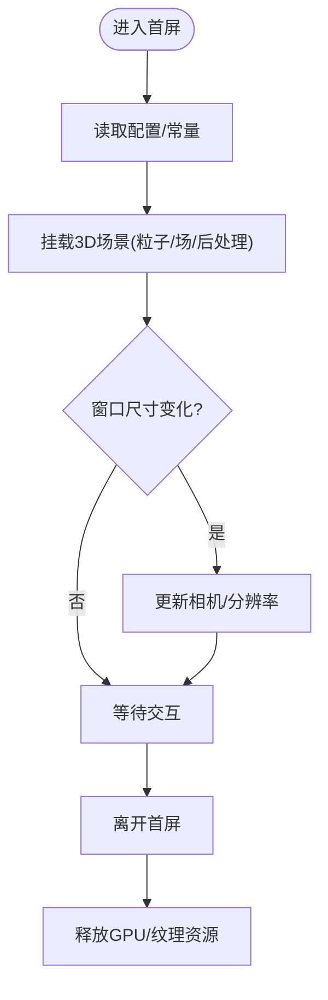
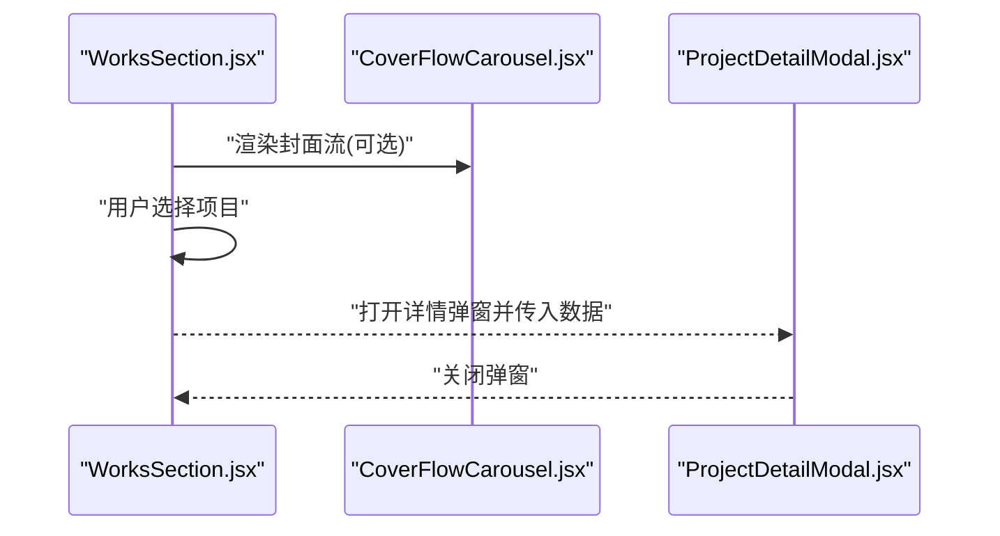
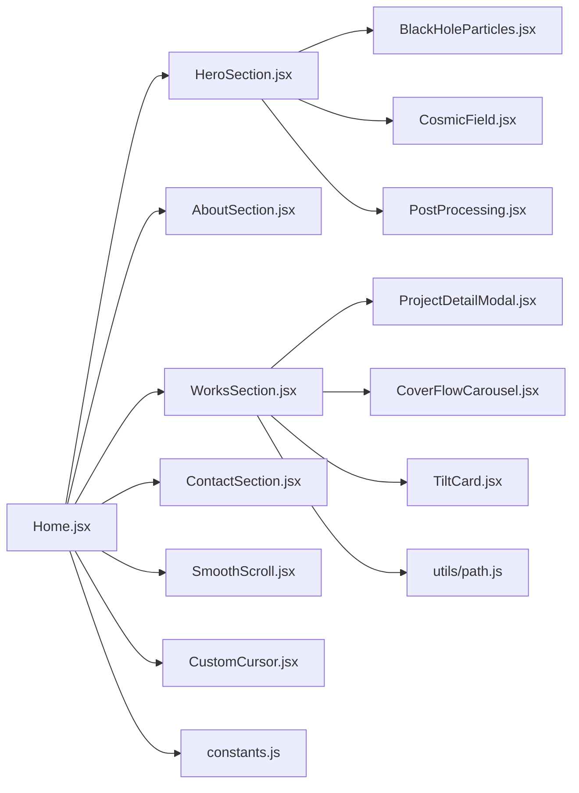

# 组件架构设计

<cite>
**本文引用的文件**   
- [Home.jsx](file://src/Home.jsx)
- [App.jsx](file://src/App.jsx)
- [HeroSection.jsx](file://src/components/HeroSection.jsx)
- [AboutSection.jsx](file://src/components/AboutSection.jsx)
- [WorksSection.jsx](file://src/components/WorksSection.jsx)
- [ContactSection.jsx](file://src/components/ContactSection.jsx)
- [ProjectDetailModal.jsx](file://src/components/ProjectDetailModal.jsx)
- [CoverFlowCarousel.jsx](file://src/components/CoverFlowCarousel.jsx)
- [SmoothScroll.jsx](file://src/components/SmoothScroll.jsx)
- [CustomCursor.jsx](file://src/components/ui/CustomCursor.jsx)
- [TiltCard.jsx](file://src/components/ui/TiltCard.jsx)
- [BlackHoleParticles.jsx](file://src/components/three/BlackHoleParticles.jsx)
- [CosmicField.jsx](file://src/components/three/CosmicField.jsx)
- [PostProcessing.jsx](file://src/components/three/PostProcessing.jsx)
- [constants.js](file://src/constants.js)
- [utils/path.js](file://src/utils/path.js)
</cite>

## 目录
1. [简介](#简介)
2. [项目结构](#项目结构)
3. [核心组件](#核心组件)
4. [架构总览](#架构总览)
5. [详细组件分析](#详细组件分析)
6. [依赖关系分析](#依赖关系分析)
7. [性能考虑](#性能考虑)
8. [故障排查指南](#故障排查指南)
9. [结论](#结论)
10. [附录](#附录)

## 简介
本文件面向Goodent项目的React组件化架构，聚焦以下目标：
- 说明基于React的组件层次结构与职责划分
- 解释父子组件通信机制（props、事件回调）与状态管理策略（受控/非受控、提升状态）
- 解析主页容器组件如何编排各功能区块
- 阐述核心业务组件的设计理念与实现模式
- 描述组件间依赖关系与数据流向（包括事件冒泡与状态提升）
- 总结组件复用策略与最佳实践（UI与业务分离）
- 给出生命周期管理与性能优化建议

## 项目结构
项目采用“按特性分层 + 资源分类”的组织方式：
- src/components：业务与通用组件
  - 顶层业务区块：HeroSection、AboutSection、WorksSection、ContactSection等
  - UI基础组件：ui/CustomCursor、ui/TiltCard
  - 3D视觉组件：three/*（Three.js相关）
  - 交互增强：CoverFlowCarousel、ProjectDetailModal、SmoothScroll
- src/utils：工具函数（如路径处理）
- src/constants.js：全局常量配置
- src/main.jsx、src/App.jsx：应用入口与根布局
- public/projects：静态项目素材

图表来源
- [App.jsx](file://src/App.jsx)
- [Home.jsx](file://src/Home.jsx)
- [HeroSection.jsx](file://src/components/HeroSection.jsx)
- [AboutSection.jsx](file://src/components/AboutSection.jsx)
- [WorksSection.jsx](file://src/components/WorksSection.jsx)
- [ContactSection.jsx](file://src/components/ContactSection.jsx)
- [ProjectDetailModal.jsx](file://src/components/ProjectDetailModal.jsx)
- [CoverFlowCarousel.jsx](file://src/components/CoverFlowCarousel.jsx)
- [SmoothScroll.jsx](file://src/components/SmoothScroll.jsx)
- [CustomCursor.jsx](file://src/components/ui/CustomCursor.jsx)
- [TiltCard.jsx](file://src/components/ui/TiltCard.jsx)
- [BlackHoleParticles.jsx](file://src/components/three/BlackHoleParticles.jsx)
- [CosmicField.jsx](file://src/components/three/CosmicField.jsx)
- [PostProcessing.jsx](file://src/components/three/PostProcessing.jsx)
- [constants.js](file://src/constants.js)
- [utils/path.js](file://src/utils/path.js)

章节来源
- [App.jsx](file://src/App.jsx)
- [Home.jsx](file://src/Home.jsx)

## 核心组件
- Home.jsx：主页容器组件，负责页面骨架与区块编排，协调导航滚动、全局交互与数据装配。
- HeroSection.jsx：首屏展示区，承载3D背景与主标题信息，通常作为视觉焦点。
- AboutSection.jsx：个人介绍区块，呈现基本信息与技能概览。
- WorksSection.jsx：作品展示区块，聚合项目列表、筛选与详情弹窗。
- ContactSection.jsx：联系方式区块，提供联系表单或链接。
- ProjectDetailModal.jsx：项目详情弹窗，承接从作品列表触发的详情展示。
- CoverFlowCarousel.jsx：封面流式轮播，用于作品或案例的横向浏览。
- SmoothScroll.jsx：平滑滚动行为封装，供页面跳转与区块定位使用。
- ui/CustomCursor.jsx、ui/TiltCard.jsx：通用UI增强组件，分别提供自定义光标与卡片倾斜效果。
- three/*：3D场景与后处理组件，为HeroSection等提供沉浸式背景。
- constants.js、utils/path.js：常量与路径工具，被多个组件共享。

章节来源
- [Home.jsx](file://src/Home.jsx)
- [HeroSection.jsx](file://src/components/HeroSection.jsx)
- [AboutSection.jsx](file://src/components/AboutSection.jsx)
- [WorksSection.jsx](file://src/components/WorksSection.jsx)
- [ContactSection.jsx](file://src/components/ContactSection.jsx)
- [ProjectDetailModal.jsx](file://src/components/ProjectDetailModal.jsx)
- [CoverFlowCarousel.jsx](file://src/components/CoverFlowCarousel.jsx)
- [SmoothScroll.jsx](file://src/components/SmoothScroll.jsx)
- [CustomCursor.jsx](file://src/components/ui/CustomCursor.jsx)
- [TiltCard.jsx](file://src/components/ui/TiltCard.jsx)
- [BlackHoleParticles.jsx](file://src/components/three/BlackHoleParticles.jsx)
- [CosmicField.jsx](file://src/components/three/CosmicField.jsx)
- [PostProcessing.jsx](file://src/components/three/PostProcessing.jsx)
- [constants.js](file://src/constants.js)
- [utils/path.js](file://src/utils/path.js)

## 架构总览
整体采用“容器-展示”分层：
- 容器组件（Home.jsx）承担编排职责，组合各区块并维护跨区块的状态（如当前选中项目）。
- 展示组件（HeroSection、AboutSection、WorksSection等）专注渲染与局部交互，通过props接收数据，通过回调向上传递事件。
- 3D与特效组件（three/*）作为独立子树，按需挂载，避免阻塞主线程。
- 通用UI组件（ui/*）可被多处复用，保持纯展示与最小副作用。

图表来源
- [App.jsx](file://src/App.jsx)
- [Home.jsx](file://src/Home.jsx)
- [HeroSection.jsx](file://src/components/HeroSection.jsx)
- [AboutSection.jsx](file://src/components/AboutSection.jsx)
- [WorksSection.jsx](file://src/components/WorksSection.jsx)
- [ContactSection.jsx](file://src/components/ContactSection.jsx)
- [ProjectDetailModal.jsx](file://src/components/ProjectDetailModal.jsx)
- [CoverFlowCarousel.jsx](file://src/components/CoverFlowCarousel.jsx)
- [SmoothScroll.jsx](file://src/components/SmoothScroll.jsx)
- [CustomCursor.jsx](file://src/components/ui/CustomCursor.jsx)
- [TiltCard.jsx](file://src/components/ui/TiltCard.jsx)
- [BlackHoleParticles.jsx](file://src/components/three/BlackHoleParticles.jsx)
- [CosmicField.jsx](file://src/components/three/CosmicField.jsx)
- [PostProcessing.jsx](file://src/components/three/PostProcessing.jsx)

## 详细组件分析

### 主页容器组件 Home.jsx
- 职责
  - 组织页面区块顺序与布局
  - 统一处理滚动锚点与导航高亮
  - 集中管理跨区块状态（例如当前选中的项目ID）
  - 注入全局交互能力（自定义光标、平滑滚动）
- 数据流
  - 从常量或工具模块获取静态数据（如项目元信息、路径）
  - 将数据以props形式下发至各区块
  - 通过回调将子组件事件上提，更新自身状态
- 关键流程（点击作品→查看详情）

图表来源
- [Home.jsx](file://src/Home.jsx)
- [WorksSection.jsx](file://src/components/WorksSection.jsx)
- [ProjectDetailModal.jsx](file://src/components/ProjectDetailModal.jsx)

章节来源
- [Home.jsx](file://src/Home.jsx)

### 首屏展示 HeroSection.jsx
- 设计理念
  - 强调视觉冲击力，结合3D粒子/场/后处理营造沉浸感
  - 控制渲染时机与资源加载，避免首屏卡顿
- 实现要点
  - 通过props接收主题文案与CTA动作
  - 内部按需挂载3D子组件，并在卸载时清理资源
  - 对窗口尺寸变化进行响应式适配
- 与3D组件的关系

图表来源
- [HeroSection.jsx](file://src/components/HeroSection.jsx)
- [BlackHoleParticles.jsx](file://src/components/three/BlackHoleParticles.jsx)
- [CosmicField.jsx](file://src/components/three/CosmicField.jsx)
- [PostProcessing.jsx](file://src/components/three/PostProcessing.jsx)

章节来源
- [HeroSection.jsx](file://src/components/HeroSection.jsx)
- [BlackHoleParticles.jsx](file://src/components/three/BlackHoleParticles.jsx)
- [CosmicField.jsx](file://src/components/three/CosmicField.jsx)
- [PostProcessing.jsx](file://src/components/three/PostProcessing.jsx)

### 作品展示 WorksSection.jsx
- 设计理念
  - 以卡片网格/轮播形式展示项目，支持筛选与详情查看
  - 与通用UI组件解耦，便于替换样式与交互
- 数据与交互
  - 从父级或常量获取项目清单
  - 通过回调通知父组件选中项，驱动弹窗展示
  - 可选集成封面流式轮播以提升浏览体验
- 与弹窗和轮播的协作

图表来源
- [WorksSection.jsx](file://src/components/WorksSection.jsx)
- [CoverFlowCarousel.jsx](file://src/components/CoverFlowCarousel.jsx)
- [ProjectDetailModal.jsx](file://src/components/ProjectDetailModal.jsx)

章节来源
- [WorksSection.jsx](file://src/components/WorksSection.jsx)
- [CoverFlowCarousel.jsx](file://src/components/CoverFlowCarousel.jsx)
- [ProjectDetailModal.jsx](file://src/components/ProjectDetailModal.jsx)

### 关于我 AboutSection.jsx
- 职责
  - 展示个人简介、技能标签、经历时间线等
- 交互
  - 通常为只读展示，必要时提供展开/折叠
- 数据来源
  - 从常量或外部JSON导入，减少硬编码

章节来源
- [AboutSection.jsx](file://src/components/AboutSection.jsx)

### 联系方式 ContactSection.jsx
- 职责
  - 提供邮箱、社交链接或表单入口
- 交互
  - 点击跳转或调用外部服务（如mailto、第三方表单）

章节来源
- [ContactSection.jsx](file://src/components/ContactSection.jsx)

### 项目详情弹窗 ProjectDetailModal.jsx
- 职责
  - 居中展示项目详细信息，支持键盘ESC关闭与遮罩点击关闭
- 状态
  - 受控于父组件（是否可见、当前项目数据）
- 事件
  - 向上抛出关闭事件，由父组件更新状态

章节来源
- [ProjectDetailModal.jsx](file://src/components/ProjectDetailModal.jsx)

### 封面流式轮播 CoverFlowCarousel.jsx
- 职责
  - 提供横向滑动/翻页浏览，适合大量作品的快速预览
- 交互
  - 支持触摸拖拽、键盘方向键切换

章节来源
- [CoverFlowCarousel.jsx](file://src/components/CoverFlowCarousel.jsx)

### 平滑滚动 SmoothScroll.jsx
- 职责
  - 封装浏览器滚动API，提供平滑过渡与锚点定位
- 使用场景
  - 导航栏跳转、区块内定位

章节来源
- [SmoothScroll.jsx](file://src/components/SmoothScroll.jsx)

### UI增强组件
- CustomCursor.jsx
  - 自定义鼠标指针，跟随移动并响应悬停态
- TiltCard.jsx
  - 为卡片添加3D倾斜效果，提升交互质感

章节来源
- [CustomCursor.jsx](file://src/components/ui/CustomCursor.jsx)
- [TiltCard.jsx](file://src/components/ui/TiltCard.jsx)

### 3D视觉组件
- BlackHoleParticles.jsx、CosmicField.jsx、PostProcessing.jsx
  - 分别负责粒子系统、宇宙场与后处理管线
  - 在HeroSection中按需挂载，注意资源释放与性能调优

章节来源
- [BlackHoleParticles.jsx](file://src/components/three/BlackHoleParticles.jsx)
- [CosmicField.jsx](file://src/components/three/CosmicField.jsx)
- [PostProcessing.jsx](file://src/components/three/PostProcessing.jsx)

## 依赖关系分析
- 组件耦合
  - Home.jsx与业务区块松耦合，通过props与回调通信
  - WorksSection与ProjectDetailModal为弱耦合，仅通过事件与数据传递
  - 3D组件仅在HeroSection中引入，避免全局污染
- 外部依赖
  - 常量与路径工具被多处引用，降低重复定义
- 潜在循环依赖
  - 当前结构未见明显循环；若未来引入跨区块直接引用，需通过上下文或状态提升化解

图表来源
- [Home.jsx](file://src/Home.jsx)
- [HeroSection.jsx](file://src/components/HeroSection.jsx)
- [AboutSection.jsx](file://src/components/AboutSection.jsx)
- [WorksSection.jsx](file://src/components/WorksSection.jsx)
- [ContactSection.jsx](file://src/components/ContactSection.jsx)
- [ProjectDetailModal.jsx](file://src/components/ProjectDetailModal.jsx)
- [CoverFlowCarousel.jsx](file://src/components/CoverFlowCarousel.jsx)
- [SmoothScroll.jsx](file://src/components/SmoothScroll.jsx)
- [CustomCursor.jsx](file://src/components/ui/CustomCursor.jsx)
- [TiltCard.jsx](file://src/components/ui/TiltCard.jsx)
- [BlackHoleParticles.jsx](file://src/components/three/BlackHoleParticles.jsx)
- [CosmicField.jsx](file://src/components/three/CosmicField.jsx)
- [PostProcessing.jsx](file://src/components/three/PostProcessing.jsx)
- [constants.js](file://src/constants.js)
- [utils/path.js](file://src/utils/path.js)

章节来源
- [Home.jsx](file://src/Home.jsx)
- [constants.js](file://src/constants.js)
- [utils/path.js](file://src/utils/path.js)

## 性能考虑
- 首屏优化
  - 延迟加载3D场景与重型资源，优先渲染文本与关键内容
  - 使用懒加载与代码分割，按需引入3D组件
- 渲染优化
  - 对列表项使用稳定key，避免不必要的重渲染
  - 对大列表启用虚拟滚动或分页
- 内存与资源
  - 在组件卸载时释放3D纹理、监听器与定时器
  - 避免在高频回调中创建新对象，必要时缓存计算结果
- 交互流畅度
  - 将昂贵计算移出主线程或使用requestIdleCallback
  - 对动画使用合成层属性（transform、opacity）

[本节为通用指导，不直接分析具体文件]

## 故障排查指南
- 常见问题
  - 3D场景未显示：检查资源路径与权限、确认组件已挂载且未过早卸载
  - 弹窗无法关闭：确认父组件状态更新与事件回调绑定正确
  - 滚动异常：检查SmoothScroll是否正确初始化与销毁
  - 图片/模型加载失败：核对public路径与相对路径拼接逻辑
- 定位方法
  - 在关键回调处打印日志，观察事件链路与状态变更
  - 使用浏览器开发者工具的Performance面板分析帧率与耗时
  - 针对3D场景，检查WebGL控制台输出与GPU资源占用

章节来源
- [ProjectDetailModal.jsx](file://src/components/ProjectDetailModal.jsx)
- [SmoothScroll.jsx](file://src/components/SmoothScroll.jsx)
- [utils/path.js](file://src/utils/path.js)

## 结论
Goodent项目采用清晰的容器-展示分层与模块化组织，Home.jsx作为编排中心，将各业务区块与通用UI/3D能力有机组合。通过props与回调完成父子通信，配合状态提升与受控组件模式，实现了良好的可维护性与扩展性。后续可在懒加载、虚拟化与3D资源管理等方面继续深化，以获得更优的首屏与交互体验。

[本节为总结性内容，不直接分析具体文件]

## 附录
- 组件复用策略
  - 将纯展示与交互细节下沉到ui/*，业务组件仅关注领域逻辑
  - 通过高阶组件或组合模式复用通用行为（如滚动、光标）
- 生命周期与副作用
  - 使用Effect钩子在挂载时注册资源，在卸载时清理
  - 对窗口resize、滚动监听等事件做防抖/节流
- 数据源与常量
  - 将静态数据集中到constants.js或外部JSON，便于维护与国际化扩展

[本节为补充说明，不直接分析具体文件]