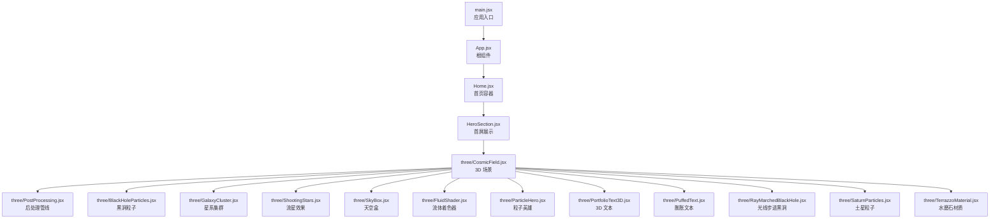
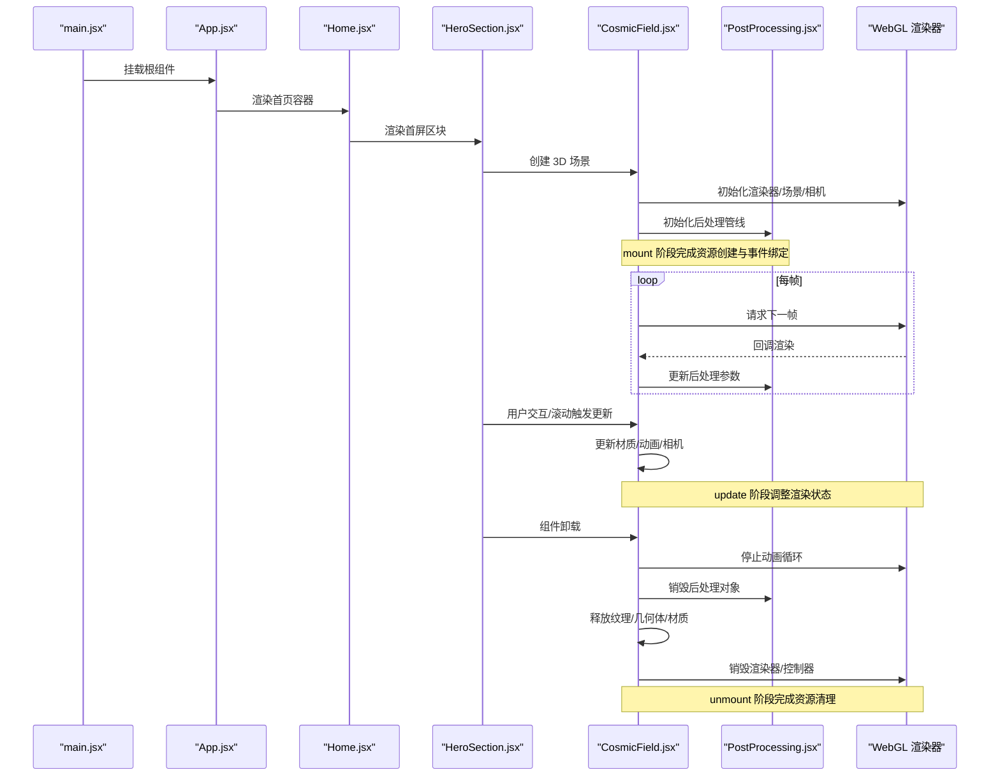
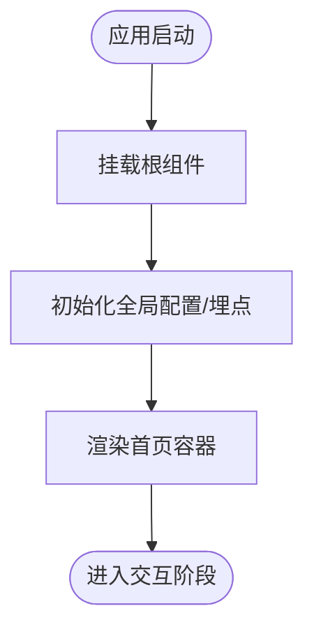
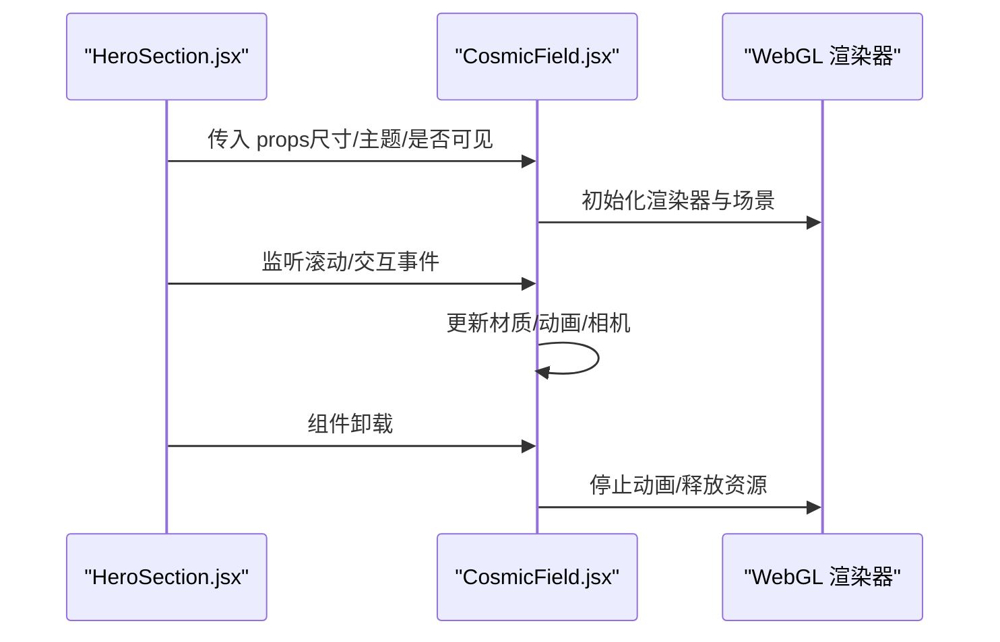
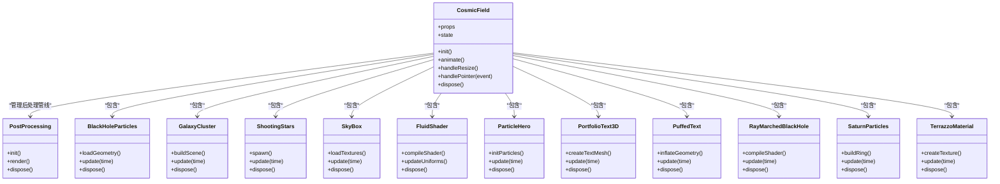
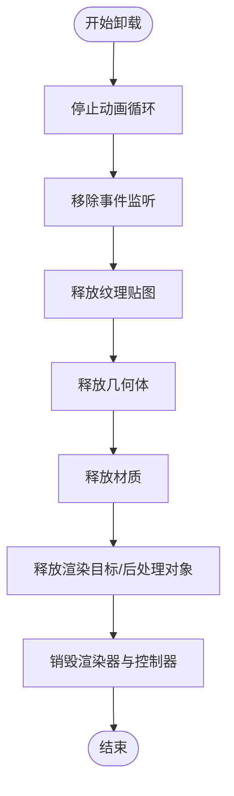
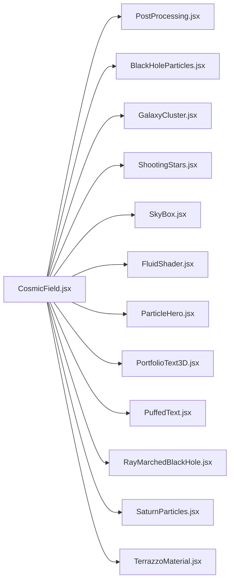

# 组件生命周期管理

<cite>
**本文引用的文件**   
- [main.jsx](file://src/main.jsx)
- [App.jsx](file://src/App.jsx)
- [HeroSection.jsx](file://src/components/HeroSection.jsx)
- [CosmicField.jsx](file://src/components/three/CosmicField.jsx)
- [PostProcessing.jsx](file://src/components/three/PostProcessing.jsx)
- [BlackHoleParticles.jsx](file://src/components/three/BlackHoleParticles.jsx)
- [GalaxyCluster.jsx](file://src/components/three/GalaxyCluster.jsx)
- [ShootingStars.jsx](file://src/components/three/ShootingStars.jsx)
- [SkyBox.jsx](file://src/components/three/SkyBox.jsx)
- [FluidShader.jsx](file://src/components/three/FluidShader.jsx)
- [ParticleHero.jsx](file://src/components/three/ParticleHero.jsx)
- [PortfolioText3D.jsx](file://src/components/three/PortfolioText3D.jsx)
- [PuffedText.jsx](file://src/components/three/PuffedText.jsx)
- [RayMarchedBlackHole.jsx](file://src/components/three/RayMarchedBlackHole.jsx)
- [SaturnParticles.jsx](file://src/components/three/SaturnParticles.jsx)
- [TerrazzoMaterial.jsx](file://src/components/three/TerrazzoMaterial.jsx)
- [SmoothScroll.jsx](file://src/components/SmoothScroll.jsx)
- [Home.jsx](file://src/Home.jsx)
</cite>

## 目录
1. [简介](#简介)
2. [项目结构](#项目结构)
3. [核心组件](#核心组件)
4. [架构总览](#架构总览)
5. [详细组件分析](#详细组件分析)
6. [依赖关系分析](#依赖关系分析)
7. [性能考量](#性能考量)
8. [故障排查指南](#故障排查指南)
9. [结论](#结论)
10. [附录](#附录)

## 简介
本文件聚焦 Goodent 项目中 React 组件的生命周期管理，覆盖挂载（mount）、更新（update）、卸载（unmount）三个阶段。重点说明应用初始化流程、根组件 App.jsx 的生命周期职责、页面级组件如 HeroSection 的渲染与交互生命周期，以及 3D 场景中的资源管理与清理策略，特别是 CosmicField 中 WebGL 资源的创建、使用与释放，避免内存泄漏。同时提供性能监控与调试技巧，帮助开发者理解渲染过程并制定优化策略。

## 项目结构
Goodent 采用基于功能的目录组织方式：
- src/main.jsx：应用入口，负责 React 根节点挂载与全局样式注入。
- src/App.jsx：根组件，承载路由或布局逻辑，协调各页面模块。
- src/Home.jsx：首页容器，组合多个业务区块。
- src/components/*：页面与通用 UI 组件，包含 HeroSection、WorksSection、AboutSection 等。
- src/components/three/*：Three.js/WebGL 相关 3D 组件，包括 CosmicField、PostProcessing、各类粒子与特效组件。
- src/utils/*：工具函数与常量。

图表来源
- [main.jsx](file://src/main.jsx)
- [App.jsx](file://src/App.jsx)
- [Home.jsx](file://src/Home.jsx)
- [HeroSection.jsx](file://src/components/HeroSection.jsx)
- [CosmicField.jsx](file://src/components/three/CosmicField.jsx)
- [PostProcessing.jsx](file://src/components/three/PostProcessing.jsx)
- [BlackHoleParticles.jsx](file://src/components/three/BlackHoleParticles.jsx)
- [GalaxyCluster.jsx](file://src/components/three/GalaxyCluster.jsx)
- [ShootingStars.jsx](file://src/components/three/ShootingStars.jsx)
- [SkyBox.jsx](file://src/components/three/SkyBox.jsx)
- [FluidShader.jsx](file://src/components/three/FluidShader.jsx)
- [ParticleHero.jsx](file://src/components/three/ParticleHero.jsx)
- [PortfolioText3D.jsx](file://src/components/three/PortfolioText3D.jsx)
- [PuffedText.jsx](file://src/components/three/PuffedText.jsx)
- [RayMarchedBlackHole.jsx](file://src/components/three/RayMarchedBlackHole.jsx)
- [SaturnParticles.jsx](file://src/components/three/SaturnParticles.jsx)
- [TerrazzoMaterial.jsx](file://src/components/three/TerrazzoMaterial.jsx)

章节来源
- [main.jsx](file://src/main.jsx)
- [App.jsx](file://src/App.jsx)
- [Home.jsx](file://src/Home.jsx)
- [HeroSection.jsx](file://src/components/HeroSection.jsx)
- [CosmicField.jsx](file://src/components/three/CosmicField.jsx)

## 核心组件
本节概述关键组件在生命周期中的职责与协作关系。

- main.jsx
  - 作用：React 应用启动，将根组件挂载到 DOM。
  - 生命周期要点：仅执行一次挂载；若存在错误边界或全局异常捕获，应在该阶段完成注册。
  
- App.jsx
  - 作用：根组件，负责顶层布局、路由或全局状态初始化。
  - 生命周期要点：在 mount 阶段进行一次性初始化（如全局事件监听、统计埋点），在 unmount 阶段清理这些副作用。

- Home.jsx
  - 作用：首页容器，聚合多个区块组件。
  - 生命周期要点：根据路由或条件渲染控制子组件挂载时机，减少不必要的初始计算。

- HeroSection.jsx
  - 作用：首屏展示区，可能包含 3D 场景入口或动画触发。
  - 生命周期要点：在 mount 时按需加载 3D 资源，在 update 时响应滚动或交互变化，在 unmount 时停止动画与释放资源。

- three/CosmicField.jsx
  - 作用：3D 场景核心，管理 Three.js 渲染器、场景、相机、控制器、后处理管线与各类 3D 子组件。
  - 生命周期要点：
    - mount：创建渲染器、场景、相机、控制器，初始化后处理管线，加载纹理与几何体，绑定事件与动画循环。
    - update：响应 props/state 变化，更新材质参数、动画时间、相机位置等。
    - unmount：停止动画循环，移除事件监听，释放纹理、几何体、材质、渲染目标、后处理对象，销毁渲染器与控制器。

章节来源
- [main.jsx](file://src/main.jsx)
- [App.jsx](file://src/App.jsx)
- [Home.jsx](file://src/Home.jsx)
- [HeroSection.jsx](file://src/components/HeroSection.jsx)
- [CosmicField.jsx](file://src/components/three/CosmicField.jsx)

## 架构总览
下图展示了从应用启动到 3D 场景渲染的关键调用链与数据流，强调生命周期阶段的划分与资源管理点。

图表来源
- [main.jsx](file://src/main.jsx)
- [App.jsx](file://src/App.jsx)
- [Home.jsx](file://src/Home.jsx)
- [HeroSection.jsx](file://src/components/HeroSection.jsx)
- [CosmicField.jsx](file://src/components/three/CosmicField.jsx)
- [PostProcessing.jsx](file://src/components/three/PostProcessing.jsx)

## 详细组件分析

### 应用初始化流程（main.jsx 与 App.jsx）
- main.jsx
  - 负责 React 根节点挂载，确保 DOM 就绪后再渲染。
  - 建议：在此处注册全局错误边界、性能监控探针，避免重复初始化。
- App.jsx
  - 作为根组件，承担全局布局与路由切换。
  - 建议在 mount 阶段初始化全局状态或第三方 SDK，在 unmount 阶段统一清理。

图表来源
- [main.jsx](file://src/main.jsx)
- [App.jsx](file://src/App.jsx)

章节来源
- [main.jsx](file://src/main.jsx)
- [App.jsx](file://src/App.jsx)

### HeroSection 生命周期与 3D 集成
- HeroSection 在 mount 时决定是否加载 3D 场景，避免首屏阻塞。
- 在 update 阶段响应滚动、窗口尺寸变化与主题切换，动态调整 3D 参数。
- 在 unmount 阶段通知 3D 组件停止动画并释放资源。

图表来源
- [HeroSection.jsx](file://src/components/HeroSection.jsx)
- [CosmicField.jsx](file://src/components/three/CosmicField.jsx)

章节来源
- [HeroSection.jsx](file://src/components/HeroSection.jsx)
- [CosmicField.jsx](file://src/components/three/CosmicField.jsx)

### CosmicField 3D 资源管理与清理策略
CosmicField 是 3D 场景的核心，负责管理渲染器、场景、相机、控制器、后处理管线与子 3D 组件。其生命周期管理要点如下：

- 挂载阶段（mount）
  - 创建渲染器、场景、相机、控制器。
  - 初始化后处理管线（如 Bloom、色调映射）。
  - 加载纹理、几何体、材质，构建场景图。
  - 绑定窗口 resize、指针事件、滚动事件。
  - 启动动画循环（requestAnimationFrame）。
- 更新阶段（update）
  - 根据 props/state 更新材质参数、动画时间、相机位置与 FOV。
  - 响应交互事件，更新射线检测与选中对象。
- 卸载阶段（unmount）
  - 停止动画循环。
  - 移除所有事件监听。
  - 释放纹理、几何体、材质、渲染目标、后处理对象。
  - 销毁渲染器与控制器，避免 GPU 资源残留。

图表来源
- [CosmicField.jsx](file://src/components/three/CosmicField.jsx)
- [PostProcessing.jsx](file://src/components/three/PostProcessing.jsx)
- [BlackHoleParticles.jsx](file://src/components/three/BlackHoleParticles.jsx)
- [GalaxyCluster.jsx](file://src/components/three/GalaxyCluster.jsx)
- [ShootingStars.jsx](file://src/components/three/ShootingStars.jsx)
- [SkyBox.jsx](file://src/components/three/SkyBox.jsx)
- [FluidShader.jsx](file://src/components/three/FluidShader.jsx)
- [ParticleHero.jsx](file://src/components/three/ParticleHero.jsx)
- [PortfolioText3D.jsx](file://src/components/three/PortfolioText3D.jsx)
- [PuffedText.jsx](file://src/components/three/PuffedText.jsx)
- [RayMarchedBlackHole.jsx](file://src/components/three/RayMarchedBlackHole.jsx)
- [SaturnParticles.jsx](file://src/components/three/SaturnParticles.jsx)
- [TerrazzoMaterial.jsx](file://src/components/three/TerrazzoMaterial.jsx)

章节来源
- [CosmicField.jsx](file://src/components/three/CosmicField.jsx)
- [PostProcessing.jsx](file://src/components/three/PostProcessing.jsx)
- [BlackHoleParticles.jsx](file://src/components/three/BlackHoleParticles.jsx)
- [GalaxyCluster.jsx](file://src/components/three/GalaxyCluster.jsx)
- [ShootingStars.jsx](file://src/components/three/ShootingStars.jsx)
- [SkyBox.jsx](file://src/components/three/SkyBox.jsx)
- [FluidShader.jsx](file://src/components/three/FluidShader.jsx)
- [ParticleHero.jsx](file://src/components/three/ParticleHero.jsx)
- [PortfolioText3D.jsx](file://src/components/three/PortfolioText3D.jsx)
- [PuffedText.jsx](file://src/components/three/PuffedText.jsx)
- [RayMarchedBlackHole.jsx](file://src/components/three/RayMarchedBlackHole.jsx)
- [SaturnParticles.jsx](file://src/components/three/SaturnParticles.jsx)
- [TerrazzoMaterial.jsx](file://src/components/three/TerrazzoMaterial.jsx)

### 复杂逻辑流程图：3D 资源清理
为避免内存泄漏，3D 组件在卸载时必须按顺序释放资源。以下流程图描述了清理步骤。

图表来源
- [CosmicField.jsx](file://src/components/three/CosmicField.jsx)
- [PostProcessing.jsx](file://src/components/three/PostProcessing.jsx)

章节来源
- [CosmicField.jsx](file://src/components/three/CosmicField.jsx)
- [PostProcessing.jsx](file://src/components/three/PostProcessing.jsx)

## 依赖关系分析
3D 组件之间存在明确的依赖关系：CosmicField 作为场景管理器，依赖后处理管线与各子 3D 组件；子组件之间通常无直接耦合，通过 CosmicField 进行协调。

图表来源
- [CosmicField.jsx](file://src/components/three/CosmicField.jsx)
- [PostProcessing.jsx](file://src/components/three/PostProcessing.jsx)
- [BlackHoleParticles.jsx](file://src/components/three/BlackHoleParticles.jsx)
- [GalaxyCluster.jsx](file://src/components/three/GalaxyCluster.jsx)
- [ShootingStars.jsx](file://src/components/three/ShootingStars.jsx)
- [SkyBox.jsx](file://src/components/three/SkyBox.jsx)
- [FluidShader.jsx](file://src/components/three/FluidShader.jsx)
- [ParticleHero.jsx](file://src/components/three/ParticleHero.jsx)
- [PortfolioText3D.jsx](file://src/components/three/PortfolioText3D.jsx)
- [PuffedText.jsx](file://src/components/three/PuffedText.jsx)
- [RayMarchedBlackHole.jsx](file://src/components/three/RayMarchedBlackHole.jsx)
- [SaturnParticles.jsx](file://src/components/three/SaturnParticles.jsx)
- [TerrazzoMaterial.jsx](file://src/components/three/TerrazzoMaterial.jsx)

章节来源
- [CosmicField.jsx](file://src/components/three/CosmicField.jsx)
- [PostProcessing.jsx](file://src/components/three/PostProcessing.jsx)
- [BlackHoleParticles.jsx](file://src/components/three/BlackHoleParticles.jsx)
- [GalaxyCluster.jsx](file://src/components/three/GalaxyCluster.jsx)
- [ShootingStars.jsx](file://src/components/three/ShootingStars.jsx)
- [SkyBox.jsx](file://src/components/three/SkyBox.jsx)
- [FluidShader.jsx](file://src/components/three/FluidShader.jsx)
- [ParticleHero.jsx](file://src/components/three/ParticleHero.jsx)
- [PortfolioText3D.jsx](file://src/components/three/PortfolioText3D.jsx)
- [PuffedText.jsx](file://src/components/three/PuffedText.jsx)
- [RayMarchedBlackHole.jsx](file://src/components/three/RayMarchedBlackHole.jsx)
- [SaturnParticles.jsx](file://src/components/three/SaturnParticles.jsx)
- [TerrazzoMaterial.jsx](file://src/components/three/TerrazzoMaterial.jsx)

## 性能考量
- 延迟加载与按需初始化
  - 仅在可视区域或用户交互时初始化 3D 场景，减少首屏开销。
- 资源复用与缓存
  - 对纹理、几何体、材质进行缓存，避免重复创建。
- 动画节流与降帧
  - 在非活跃标签页或不可见区域降低帧率或暂停动画。
- 后处理管线优化
  - 合理设置分辨率缩放因子，避免过度采样导致性能下降。
- 事件去抖与防抖
  - 对滚动、resize、pointer 事件进行节流，减少频繁更新。
- 内存监控
  - 使用浏览器性能面板与堆快照，定位未释放的纹理与几何体。

[本节为通用指导，不直接分析具体文件]

## 故障排查指南
- 常见症状
  - 页面切换后出现黑屏或卡顿：可能是 3D 资源未正确释放。
  - 内存持续增长：检查是否存在未移除的事件监听或未销毁的后处理对象。
  - 纹理闪烁或丢失：确认纹理加载与释放顺序是否正确。
- 排查步骤
  - 在 unmount 阶段添加日志，确认 dispose 方法被调用。
  - 使用浏览器“性能”与“内存”面板对比卸载前后的堆快照。
  - 逐步注释 3D 子组件，定位问题来源。
- 修复建议
  - 确保每个 3D 对象都有对应的 dispose 调用。
  - 将资源生命周期与组件生命周期严格绑定。
  - 对异步资源加载增加错误处理与重试机制。

章节来源
- [CosmicField.jsx](file://src/components/three/CosmicField.jsx)
- [PostProcessing.jsx](file://src/components/three/PostProcessing.jsx)

## 结论
通过对 main.jsx 与 App.jsx 的应用初始化流程、HeroSection 的页面级生命周期管理，以及 CosmicField 的 3D 资源全生命周期管理进行深入分析，可以建立清晰的组件生命周期治理体系。关键在于：
- 在 mount 阶段集中创建与绑定资源。
- 在 update 阶段最小化变更范围，按需更新。
- 在 unmount 阶段严格执行资源释放，避免内存泄漏。
配合性能监控与调试技巧，可显著提升用户体验与应用稳定性。

[本节为总结性内容，不直接分析具体文件]

## 附录
- 推荐调试工具
  - Chrome DevTools 的 Performance、Memory、Sources 面板。
  - React DevTools 的 Profiler 用于分析重渲染与耗时。
- 最佳实践清单
  - 为每个 3D 对象维护引用并在 unmount 时释放。
  - 使用统一的资源管理器封装创建与销毁逻辑。
  - 对大型纹理与模型进行压缩与分块加载。

[本节为补充信息，不直接分析具体文件]