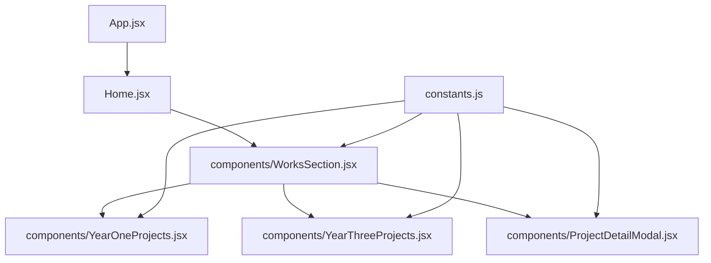
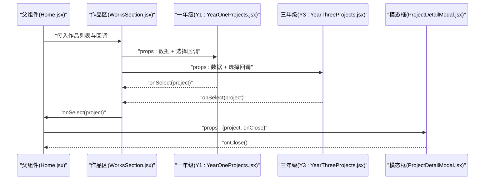
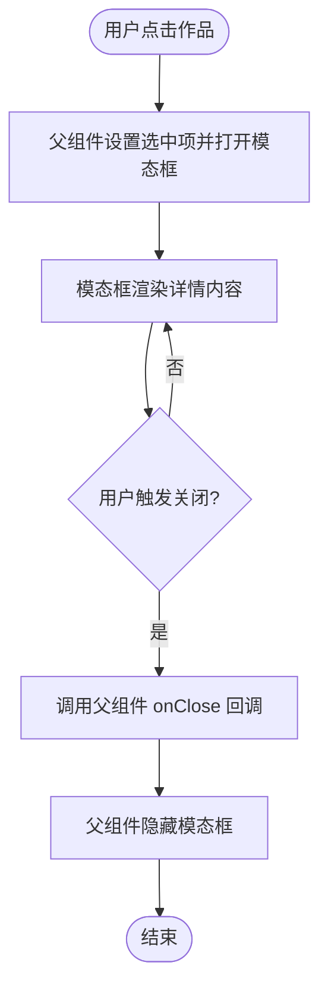
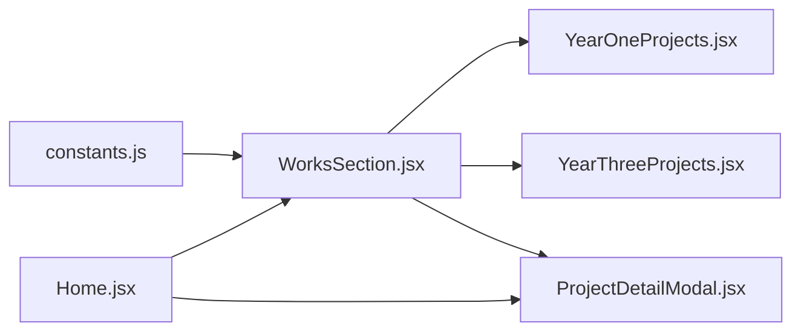

# 组件通信机制

<cite>
**本文引用的文件**   
- [App.jsx](file://src/App.jsx)
- [Home.jsx](file://src/Home.jsx)
- [constants.js](file://src/constants.js)
- [WorksSection.jsx](file://src/components/WorksSection.jsx)
- [YearOneProjects.jsx](file://src/components/YearOneProjects.jsx)
- [YearThreeProjects.jsx](file://src/components/YearThreeProjects.jsx)
- [ProjectDetailModal.jsx](file://src/components/ProjectDetailModal.jsx)
</cite>

## 目录
1. [简介](#简介)
2. [项目结构](#项目结构)
3. [核心组件](#核心组件)
4. [架构总览](#架构总览)
5. [详细组件分析](#详细组件分析)
6. [依赖关系分析](#依赖关系分析)
7. [性能考虑](#性能考虑)
8. [故障排查指南](#故障排查指南)
9. [结论](#结论)
10. [附录](#附录)

## 简介
本文件聚焦于 Goodent 项目的 React 组件通信机制，围绕以下目标展开：
- 说明 props 向下传递、事件向上冒泡与状态提升模式在本项目中的使用方式。
- 解释 constants.js 中全局配置数据的共享机制与使用模式。
- 描述 WorksSection 与其子组件 YearOneProjects、YearThreeProjects 之间的数据流转。
- 解析 ProjectDetailModal 模态框的状态管理以及与父组件的交互流程。
- 总结复杂场景下的跨层级与兄弟组件通信策略，并给出事件处理最佳实践与避免不必要重渲染的性能优化建议。

## 项目结构
Goodent 采用按功能域组织的组件结构，关键通信路径集中在页面级容器与业务区块组件之间：
- App.jsx 作为应用根入口，负责顶层路由或布局组织。
- Home.jsx 作为首页容器，聚合各区块组件（如 WorksSection）。
- components/ 下为具体业务区块与通用 UI 组件，其中 WorksSection 负责作品展示区的数据编排与交互协调。
- constants.js 提供全局常量与配置，供多处组件共享。

图表来源
- [App.jsx](file://src/App.jsx)
- [Home.jsx](file://src/Home.jsx)
- [components/WorksSection.jsx](file://src/components/WorksSection.jsx)
- [components/YearOneProjects.jsx](file://src/components/YearOneProjects.jsx)
- [components/YearThreeProjects.jsx](file://src/components/YearThreeProjects.jsx)
- [components/ProjectDetailModal.jsx](file://src/components/ProjectDetailModal.jsx)
- [constants.js](file://src/constants.js)

章节来源
- [App.jsx](file://src/App.jsx)
- [Home.jsx](file://src/Home.jsx)
- [components/WorksSection.jsx](file://src/components/WorksSection.jsx)
- [constants.js](file://src/constants.js)

## 核心组件
- App.jsx：应用根节点，负责挂载首页与全局样式等基础能力。
- Home.jsx：首页容器，组合多个区块组件，承载页面级状态（如当前选中作品、模态框显隐）并通过 props 下发给子区块。
- WorksSection.jsx：作品展示区，负责从常量或外部数据源获取作品列表，维护“选中项”和“模态框显隐”等状态，并将数据与回调函数以 props 形式传递给 YearOneProjects 与 YearThreeProjects。
- YearOneProjects.jsx / YearThreeProjects.jsx：年份维度的作品子列表，接收父组件下发的数据与回调，通过事件回调向父组件上报用户操作（如点击某作品）。
- ProjectDetailModal.jsx：详情模态框，接收父组件传入的选中作品信息与关闭回调，负责展示详情与响应关闭动作。
- constants.js：集中定义项目元数据、分类、图片路径前缀等全局配置，被多个组件读取，避免硬编码与重复逻辑。

章节来源
- [App.jsx](file://src/App.jsx)
- [Home.jsx](file://src/Home.jsx)
- [components/WorksSection.jsx](file://src/components/WorksSection.jsx)
- [components/YearOneProjects.jsx](file://src/components/YearOneProjects.jsx)
- [components/YearThreeProjects.jsx](file://src/components/YearThreeProjects.jsx)
- [components/ProjectDetailModal.jsx](file://src/components/ProjectDetailModal.jsx)
- [constants.js](file://src/constants.js)

## 架构总览
下图展示了 WorksSection 与其子组件及模态框之间的数据流与控制流：父组件持有状态并通过 props 下发；子组件通过回调将事件上抛；模态框由父组件控制显隐与内容。

图表来源
- [Home.jsx](file://src/Home.jsx)
- [components/WorksSection.jsx](file://src/components/WorksSection.jsx)
- [components/YearOneProjects.jsx](file://src/components/YearOneProjects.jsx)
- [components/YearThreeProjects.jsx](file://src/components/YearThreeProjects.jsx)
- [components/ProjectDetailModal.jsx](file://src/components/ProjectDetailModal.jsx)

## 详细组件分析

### 全局配置共享：constants.js
- 作用：集中存放项目元数据、分类、资源路径前缀等，避免在各组件内硬编码。
- 使用模式：
  - 在需要访问配置的组件中直接导入常量对象。
  - 对只读数据进行解构或按需引用，减少不必要的依赖变更。
  - 若配置较大，可在上层进行缓存或惰性加载，避免首屏阻塞。
- 注意事项：
  - 常量变更会触发所有导入该模块的组件重新渲染，应谨慎更新频率。
  - 对于动态配置，建议使用受控状态或上下文管理，而非频繁替换常量对象。

章节来源
- [constants.js](file://src/constants.js)

### 作品区数据编排：WorksSection.jsx
- 职责：
  - 汇总来自 constants.js 的作品数据。
  - 维护“当前选中作品”和“模态框显隐”等状态。
  - 将数据与回调函数以 props 形式下发给 YearOneProjects 与 YearThreeProjects。
  - 根据用户选择打开/关闭 ProjectDetailModal。
- 数据流向：
  - 常量 -> WorksSection（数据源）
  - WorksSection -> Year*Projects（props 数据与回调）
  - Year*Projects -> WorksSection（事件回调）
  - WorksSection -> Home.jsx（状态提升后的统一状态）
  - Home.jsx -> ProjectDetailModal（模态框内容与显隐）
- 设计要点：
  - 使用状态提升将“选中项”与“模态框显隐”提升到最近的共同父组件，确保单一数据源。
  - 回调函数稳定化（如使用 useMemo/useCallback）以避免子组件因 props 引用变化而重渲染。

章节来源
- [components/WorksSection.jsx](file://src/components/WorksSection.jsx)
- [Home.jsx](file://src/Home.jsx)
- [constants.js](file://src/constants.js)

### 年份维度子列表：YearOneProjects.jsx 与 YearThreeProjects.jsx
- 职责：
  - 接收父组件下发的作品片段与选择回调。
  - 渲染对应年份的作品卡片或缩略图。
  - 在用户点击时调用 onSelect 回调，将所选项目上抛至父组件。
- 通信模式：
  - 向下：通过 props 接收数据与回调。
  - 向上：通过事件回调将用户操作上报。
- 性能建议：
  - 列表项尽量使用稳定的 key。
  - 对纯展示型子组件使用 memo 包裹，避免父组件其他 props 变化导致其重渲染。

章节来源
- [components/YearOneProjects.jsx](file://src/components/YearOneProjects.jsx)
- [components/YearThreeProjects.jsx](file://src/components/YearThreeProjects.jsx)
- [components/WorksSection.jsx](file://src/components/WorksSection.jsx)

### 详情模态框：ProjectDetailModal.jsx
- 职责：
  - 接收选中作品信息与关闭回调。
  - 渲染详情内容并提供关闭按钮或遮罩点击关闭。
- 状态管理：
  - 自身不持有“是否显示”的状态，由父组件通过 props 控制显隐。
  - 关闭时调用父组件传入的 onClose 回调，由父组件更新状态。
- 交互流程：

图表来源
- [components/ProjectDetailModal.jsx](file://src/components/ProjectDetailModal.jsx)
- [components/WorksSection.jsx](file://src/components/WorksSection.jsx)
- [Home.jsx](file://src/Home.jsx)

章节来源
- [components/ProjectDetailModal.jsx](file://src/components/ProjectDetailModal.jsx)
- [components/WorksSection.jsx](file://src/components/WorksSection.jsx)
- [Home.jsx](file://src/Home.jsx)

### 跨层级与兄弟组件通信
- 跨层级（父到孙）：
  - 通过 props 逐层传递，适合少量且稳定的数据与回调。
  - 当层级较深或需频繁更新时，可考虑 Context API 或状态库（如 Zustand/Redux），以减少 prop drilling。
- 兄弟组件：
  - 通过状态提升到最近共同父组件，再由父组件分发 props 给兄弟组件。
  - 示例：YearOneProjects 与 YearThreeProjects 的选择行为均通过 WorksSection 中转，最终由 Home.jsx 统一管理。

章节来源
- [components/WorksSection.jsx](file://src/components/WorksSection.jsx)
- [components/YearOneProjects.jsx](file://src/components/YearOneProjects.jsx)
- [components/YearThreeProjects.jsx](file://src/components/YearThreeProjects.jsx)
- [Home.jsx](file://src/Home.jsx)

## 依赖关系分析
- 组件耦合：
  - WorksSection 与 Year*Projects 为父子关系，耦合度适中，通过 props 与回调解耦。
  - ProjectDetailModal 仅依赖父组件传入的数据与回调，内部无副作用，易于测试与复用。
- 外部依赖：
  - constants.js 作为静态配置源，被多个组件直接导入，形成单向依赖。
- 潜在循环依赖：
  - 当前结构未见循环导入迹象，保持单向数据流有助于稳定性。

图表来源
- [constants.js](file://src/constants.js)
- [components/WorksSection.jsx](file://src/components/WorksSection.jsx)
- [components/YearOneProjects.jsx](file://src/components/YearOneProjects.jsx)
- [components/YearThreeProjects.jsx](file://src/components/YearThreeProjects.jsx)
- [components/ProjectDetailModal.jsx](file://src/components/ProjectDetailModal.jsx)
- [Home.jsx](file://src/Home.jsx)

章节来源
- [components/WorksSection.jsx](file://src/components/WorksSection.jsx)
- [components/YearOneProjects.jsx](file://src/components/YearOneProjects.jsx)
- [components/YearThreeProjects.jsx](file://src/components/YearThreeProjects.jsx)
- [components/ProjectDetailModal.jsx](file://src/components/ProjectDetailModal.jsx)
- [Home.jsx](file://src/Home.jsx)
- [constants.js](file://src/constants.js)

## 性能考虑
- 避免不必要的重渲染
  - 使用 React.memo 包裹纯展示型子组件（如 Year*Projects 的列表项）。
  - 对回调函数使用 useCallback，对计算结果使用 useMemo，确保 props 引用稳定。
  - 拆分大对象为更细粒度的 props，降低无关变更带来的重渲染。
- 列表渲染优化
  - 为列表项提供稳定且唯一的 key。
  - 对长列表使用虚拟滚动或分页加载。
- 常量与配置
  - 常量对象变更会触发所有导入者重渲染，应避免高频更新；必要时改用受控状态或懒加载。
- 模态框
  - 仅在需要时渲染详情内容，避免在隐藏状态下执行昂贵计算或网络请求。
- 事件处理
  - 合并多次快速点击，使用防抖/节流减少重复回调。
  - 在父组件集中处理副作用，子组件仅负责派发事件。

[本节为通用性能指导，不直接分析具体文件]

## 故障排查指南
- 常见问题
  - 模态框无法关闭：检查父组件是否正确传入 onClose 回调，以及子组件是否调用了该回调。
  - 选中项未更新：确认状态提升位置是否正确，回调链是否完整。
  - 列表项点击无效：核对 key 的唯一性与事件绑定是否正确。
  - 常量变更导致大面积重渲染：评估是否可将部分配置下沉为局部状态或使用惰性加载。
- 定位步骤
  - 在父组件打印 props 与 state 的变化，确认数据流是否符合预期。
  - 在子组件生命周期或渲染钩子中记录渲染次数，识别异常重渲染点。
  - 使用浏览器开发者工具的 React DevTools 检查组件树与状态。

章节来源
- [components/ProjectDetailModal.jsx](file://src/components/ProjectDetailModal.jsx)
- [components/WorksSection.jsx](file://src/components/WorksSection.jsx)
- [components/YearOneProjects.jsx](file://src/components/YearOneProjects.jsx)
- [components/YearThreeProjects.jsx](file://src/components/YearThreeProjects.jsx)
- [Home.jsx](file://src/Home.jsx)

## 结论
Goodent 项目采用清晰的单向数据流与状态提升模式，结合常量集中管理与回调上抛的事件机制，实现了 WorksSection 与其子组件、模态框之间的稳定通信。通过合理的性能优化策略（memo、useCallback、useMemo、稳定 key 等），可有效避免不必要的重渲染，提升用户体验。未来如需进一步简化深层组件通信，可引入 Context 或轻量状态库，以保持代码的可维护性与扩展性。

[本节为总结性内容，不直接分析具体文件]

## 附录
- 术语
  - 状态提升：将状态移动到最近的共同父组件，由父组件统一管理并分发。
  - 回调上抛：子组件通过 props 传入的回调函数向父组件上报事件。
  - 常量共享：通过导入常量对象实现多组件间的数据共享。
- 参考路径
  - 父组件到子组件的 props 传递：参见 [Home.jsx](file://src/Home.jsx)、[components/WorksSection.jsx](file://src/components/WorksSection.jsx)。
  - 子组件到父组件的事件回调：参见 [components/YearOneProjects.jsx](file://src/components/YearOneProjects.jsx)、[components/YearThreeProjects.jsx](file://src/components/YearThreeProjects.jsx)。
  - 模态框状态管理：参见 [components/ProjectDetailModal.jsx](file://src/components/ProjectDetailModal.jsx)。
  - 全局配置共享：参见 [constants.js](file://src/constants.js)。