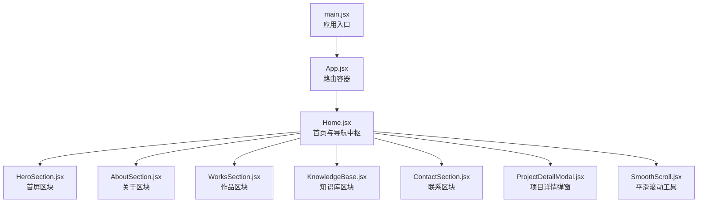
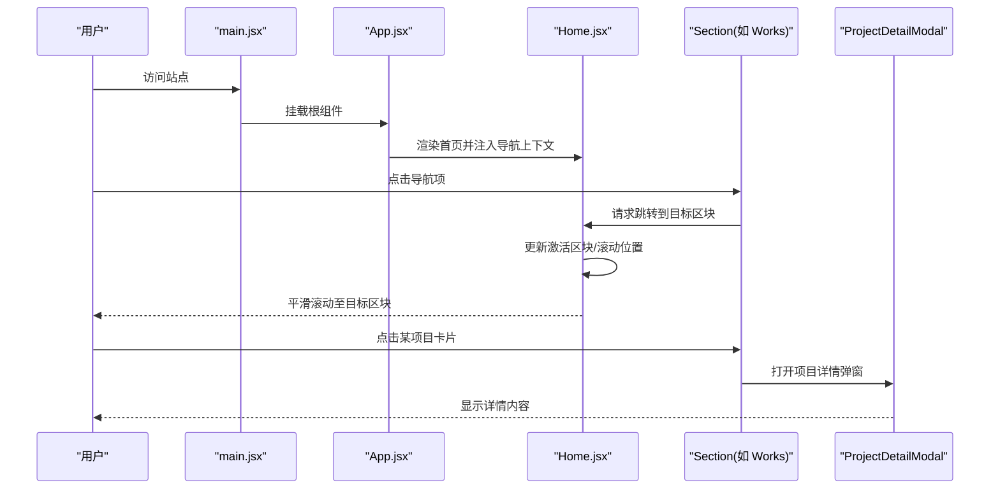
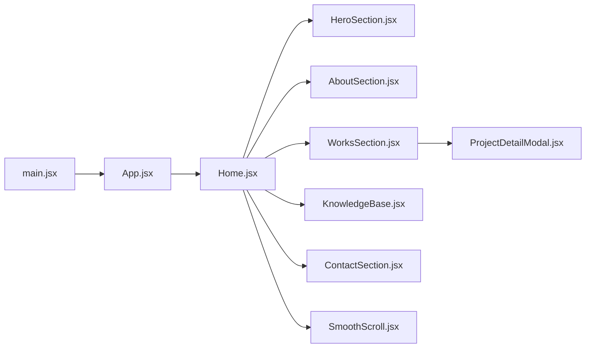
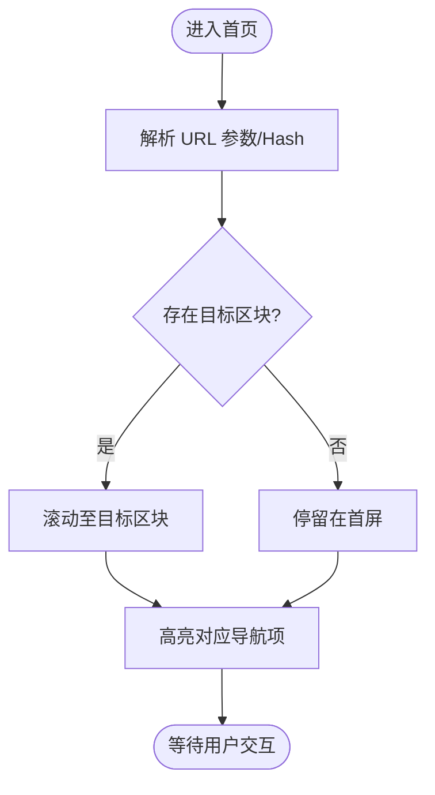

# 路由导航设计

<cite>
**本文引用的文件**   
- [App.jsx](file://src/App.jsx)
- [Home.jsx](file://src/Home.jsx)
- [main.jsx](file://src/main.jsx)
- [SmoothScroll.jsx](file://src/components/SmoothScroll.jsx)
- [HeroSection.jsx](file://src/components/HeroSection.jsx)
- [AboutSection.jsx](file://src/components/AboutSection.jsx)
- [WorksSection.jsx](file://src/components/WorksSection.jsx)
- [KnowledgeBase.jsx](file://src/components/KnowledgeBase.jsx)
- [ContactSection.jsx](file://src/components/ContactSection.jsx)
- [ProjectDetailModal.jsx](file://src/components/ProjectDetailModal.jsx)
- [constants.js](file://src/constants.js)
- [path.js](file://src/utils/path.js)
</cite>

## 目录
1. [简介](#简介)
2. [项目结构](#项目结构)
3. [核心组件](#核心组件)
4. [架构总览](#架构总览)
5. [详细组件分析](#详细组件分析)
6. [依赖关系分析](#依赖关系分析)
7. [性能考虑](#性能考虑)
8. [故障排查指南](#故障排查指南)
9. [结论](#结论)
10. [附录](#附录)

## 简介
本设计文档聚焦于 Goodent 项目的路由与导航体系。该项目采用单页面应用（SPA）模式，通过“锚点+滚动”的页面内导航实现多区块切换，并结合模态框承载详情内容。文档将系统阐述：
- SPA 路由策略与页面切换逻辑
- App.jsx 中的路由配置与导航状态管理
- Home.jsx 中各功能区块的滚动导航与平滑滚动效果
- 移动端与桌面端的导航适配策略
- URL 参数处理与深度链接支持
- 面包屑导航与返回按钮的实现思路
- 导航性能优化与用户体验改进方案

## 项目结构
Goodent 为基于 React + Vite 的前端项目，入口文件 main.jsx 挂载根组件 App.jsx；App.jsx 作为路由容器渲染 Home.jsx；Home.jsx 内部按功能组织多个 Section 组件，并通过锚点与滚动完成导航。

图表来源
- [main.jsx](file://src/main.jsx)
- [App.jsx](file://src/App.jsx)
- [Home.jsx](file://src/Home.jsx)
- [HeroSection.jsx](file://src/components/HeroSection.jsx)
- [AboutSection.jsx](file://src/components/AboutSection.jsx)
- [WorksSection.jsx](file://src/components/WorksSection.jsx)
- [KnowledgeBase.jsx](file://src/components/KnowledgeBase.jsx)
- [ContactSection.jsx](file://src/components/ContactSection.jsx)
- [ProjectDetailModal.jsx](file://src/components/ProjectDetailModal.jsx)
- [SmoothScroll.jsx](file://src/components/SmoothScroll.jsx)

章节来源
- [main.jsx](file://src/main.jsx)
- [App.jsx](file://src/App.jsx)
- [Home.jsx](file://src/Home.jsx)

## 核心组件
- App.jsx：作为应用的路由容器，负责加载全局样式、初始化导航上下文、提供导航状态与跳转方法给子组件使用。
- Home.jsx：首页主布局，聚合所有功能区块，维护当前激活区块、滚动位置、URL 同步等导航相关状态。
- SmoothScroll.jsx：封装平滑滚动能力，供各区块或导航项调用。
- 各 Section 组件（Hero/About/Works/KnowledgeBase/Contact）：各自定义锚点 ID 与展示内容，配合 Home 进行定位与高亮。
- ProjectDetailModal.jsx：以模态框形式打开项目详情，避免整页刷新，保持 SPA 体验。

章节来源
- [App.jsx](file://src/App.jsx)
- [Home.jsx](file://src/Home.jsx)
- [SmoothScroll.jsx](file://src/components/SmoothScroll.jsx)
- [HeroSection.jsx](file://src/components/HeroSection.jsx)
- [AboutSection.jsx](file://src/components/AboutSection.jsx)
- [WorksSection.jsx](file://src/components/WorksSection.jsx)
- [KnowledgeBase.jsx](file://src/components/KnowledgeBase.jsx)
- [ContactSection.jsx](file://src/components/ContactSection.jsx)
- [ProjectDetailModal.jsx](file://src/components/ProjectDetailModal.jsx)

## 架构总览
下图展示了从入口到导航交互的关键流程：main.jsx 启动应用，App.jsx 提供导航上下文，Home.jsx 管理当前区块与滚动行为，Section 组件响应点击并触发滚动，必要时打开详情弹窗。

图表来源
- [main.jsx](file://src/main.jsx)
- [App.jsx](file://src/App.jsx)
- [Home.jsx](file://src/Home.jsx)
- [WorksSection.jsx](file://src/components/WorksSection.jsx)
- [ProjectDetailModal.jsx](file://src/components/ProjectDetailModal.jsx)

## 详细组件分析

### App.jsx：路由容器与导航状态
- 职责
  - 提供全局导航上下文（当前区块、跳转方法、是否处于移动端等）。
  - 统一处理 URL 变化与初始锚点解析，确保首次加载可直达指定区块。
  - 管理导航历史栈（用于返回按钮与面包屑）。
- 关键设计
  - 使用集中式状态保存当前激活区块与滚动偏移量。
  - 暴露统一的 navigateTo(sectionId, options) 接口，供子组件调用。
  - 监听浏览器前进/后退事件，同步 UI 与滚动位置。
- 与子组件协作
  - 向 Home.jsx 注入导航上下文。
  - 在需要时读取 URL 查询参数，驱动初始导航。

章节来源
- [App.jsx](file://src/App.jsx)

### Home.jsx：导航中枢与滚动控制
- 职责
  - 聚合所有 Section 组件，维护当前激活区块与滚动位置。
  - 根据 URL hash 或查询参数执行初始定位。
  - 协调 SmoothScroll 实现平滑滚动。
- 关键设计
  - 使用 IntersectionObserver 或滚动监听计算当前可见区块，自动更新激活状态。
  - 对导航项点击事件进行防抖与节流，避免重复滚动。
  - 在移动端与桌面端分别设置不同的滚动行为与菜单展开策略。
- 与 Section 组件协作
  - 接收来自各 Section 的跳转请求，统一执行滚动与状态更新。
  - 向 Section 传递当前激活状态，用于高亮导航项。

章节来源
- [Home.jsx](file://src/Home.jsx)
- [SmoothScroll.jsx](file://src/components/SmoothScroll.jsx)

### SmoothScroll.jsx：平滑滚动工具
- 职责
  - 封装原生 scrollIntoView 或自定义动画，实现平滑滚动。
  - 提供可选参数：偏移量、缓动曲线、回调函数。
- 关键设计
  - 针对长列表与复杂布局，优先使用 requestAnimationFrame 驱动的滚动动画。
  - 兼容移动端触摸滚动，避免与系统手势冲突。

章节来源
- [SmoothScroll.jsx](file://src/components/SmoothScroll.jsx)

### Section 组件：区块与锚点
- HeroSection.jsx / AboutSection.jsx / WorksSection.jsx / KnowledgeBase.jsx / ContactSection.jsx
  - 每个区块拥有唯一锚点 ID，便于直接定位。
  - 在移动端可能采用抽屉式或底部固定导航，桌面端采用顶部导航栏。
  - 部分区块包含项目卡片，点击后打开 ProjectDetailModal。

章节来源
- [HeroSection.jsx](file://src/components/HeroSection.jsx)
- [AboutSection.jsx](file://src/components/AboutSection.jsx)
- [WorksSection.jsx](file://src/components/WorksSection.jsx)
- [KnowledgeBase.jsx](file://src/components/KnowledgeBase.jsx)
- [ContactSection.jsx](file://src/components/ContactSection.jsx)

### ProjectDetailModal.jsx：详情弹窗与返回
- 职责
  - 以模态框形式展示项目详情，不改变主路由，保持 SPA 体验。
  - 提供关闭与返回操作，必要时回退浏览器历史栈。
- 关键设计
  - 打开弹窗时可写入 URL 查询参数（如 ?project=xxx），支持分享与深度链接。
  - 关闭弹窗时清理参数或回退到上一状态。

章节来源
- [ProjectDetailModal.jsx](file://src/components/ProjectDetailModal.jsx)

### 常量与路径工具
- constants.js：集中定义区块标识、默认锚点、导航项顺序等常量，便于统一维护。
- path.js：提供路径拼接、URL 参数解析与序列化等工具函数，辅助深度链接与面包屑生成。

章节来源
- [constants.js](file://src/constants.js)
- [path.js](file://src/utils/path.js)

## 依赖关系分析
- 入口依赖
  - main.jsx 依赖 App.jsx 作为根组件。
- 路由容器依赖
  - App.jsx 依赖 Home.jsx 及导航上下文提供者。
- 页面布局依赖
  - Home.jsx 依赖各 Section 组件与 SmoothScroll 工具。
- 详情弹窗依赖
  - Section 组件在需要时依赖 ProjectDetailModal。

图表来源
- [main.jsx](file://src/main.jsx)
- [App.jsx](file://src/App.jsx)
- [Home.jsx](file://src/Home.jsx)
- [HeroSection.jsx](file://src/components/HeroSection.jsx)
- [AboutSection.jsx](file://src/components/AboutSection.jsx)
- [WorksSection.jsx](file://src/components/WorksSection.jsx)
- [KnowledgeBase.jsx](file://src/components/KnowledgeBase.jsx)
- [ContactSection.jsx](file://src/components/ContactSection.jsx)
- [SmoothScroll.jsx](file://src/components/SmoothScroll.jsx)
- [ProjectDetailModal.jsx](file://src/components/ProjectDetailModal.jsx)

## 性能考虑
- 滚动性能
  - 使用 requestAnimationFrame 驱动平滑滚动，避免阻塞主线程。
  - 对滚动监听进行节流，减少频繁重排与重绘。
- 渲染优化
  - 对大型区块（如作品列表）采用懒加载与虚拟滚动，按需渲染。
  - 图片资源启用懒加载与压缩，减少首屏体积。
- 导航状态
  - 使用稳定的区块标识与最小化状态更新，避免不必要的重渲染。
  - 在移动端减少 DOM 操作，优先使用 CSS transform 与 opacity 过渡。
- 深度链接
  - 仅在首次加载时解析 URL 参数，后续导航尽量使用内存状态，降低开销。

[本节为通用指导，无需代码来源]

## 故障排查指南
- 无法跳转到指定区块
  - 检查区块锚点 ID 是否与常量一致。
  - 确认 Home.jsx 是否正确监听点击事件并调用平滑滚动。
- 移动端导航错位
  - 检查移动端菜单展开逻辑与滚动锁定是否生效。
  - 验证 SmoothScroll 在移动端是否被禁用或降级。
- 详情弹窗无法关闭
  - 检查关闭回调是否清理了 URL 参数与状态。
  - 确认事件冒泡未被阻止。
- 深度链接无效
  - 核对 URL 参数键名与解析逻辑。
  - 确认首次加载时是否正确执行初始定位。

章节来源
- [Home.jsx](file://src/Home.jsx)
- [SmoothScroll.jsx](file://src/components/SmoothScroll.jsx)
- [ProjectDetailModal.jsx](file://src/components/ProjectDetailModal.jsx)
- [constants.js](file://src/constants.js)
- [path.js](file://src/utils/path.js)

## 结论
Goodent 采用 SPA 的“锚点+滚动”导航策略，结合集中式导航上下文与平滑滚动工具，实现了流畅的多区块切换体验。通过模态框承载详情内容，避免了整页刷新，提升了交互效率。建议在后续迭代中进一步完善 URL 参数与深度链接规范，引入更完善的错误边界与日志埋点，以提升可观测性与稳定性。

[本节为总结性内容，无需代码来源]

## 附录

### 导航流程图（概念）

[此图为概念流程，不对应具体源码，故无图表来源]

### 移动端与桌面端适配要点
- 桌面端
  - 顶部固定导航栏，悬停高亮，点击平滑滚动。
  - 侧边或顶部面包屑，显示当前位置层级。
- 移动端
  - 汉堡菜单或底部导航，点击后收起菜单并滚动。
  - 简化面包屑，仅显示当前区块名称。
  - 关闭键盘遮挡，确保滚动区域可见。

[本节为通用指导，无需代码来源]

### URL 参数与深度链接建议
- 使用查询参数表示详情（如 ?project=xxx），打开弹窗时写入，关闭时清理。
- 使用 Hash 表示区块（如 #works），便于书签与分享。
- 首次加载时优先解析 Hash，其次解析查询参数，最后回退默认区块。

章节来源
- [path.js](file://src/utils/path.js)
- [constants.js](file://src/constants.js)

### 面包屑与返回按钮实现思路
- 面包屑
  - 基于当前区块与详情弹窗状态构建层级数组。
  - 点击任意层级直接跳转或关闭弹窗回到上层。
- 返回按钮
  - 在弹窗内提供返回，必要时调用浏览器历史回退。
  - 在移动端可使用系统返回手势，但需拦截并同步状态。

章节来源
- [ProjectDetailModal.jsx](file://src/components/ProjectDetailModal.jsx)
- [Home.jsx](file://src/Home.jsx)