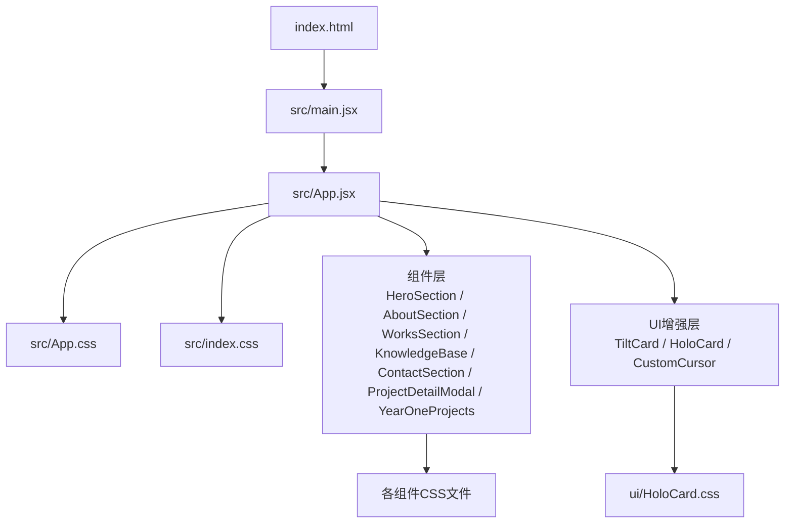
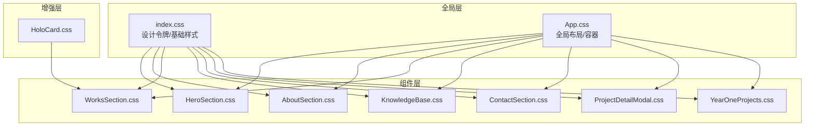
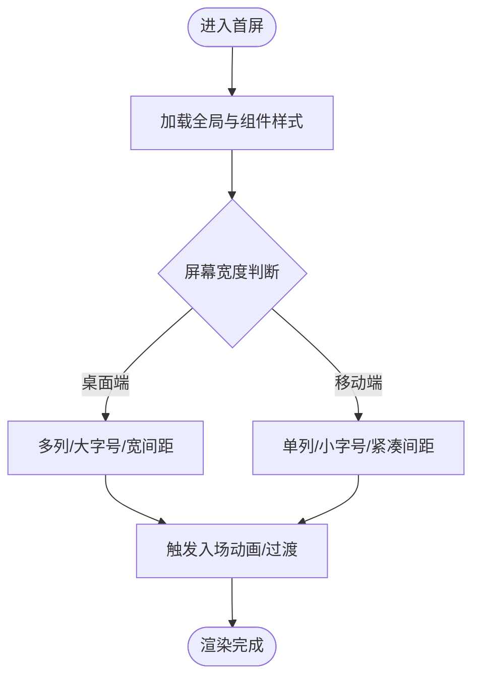
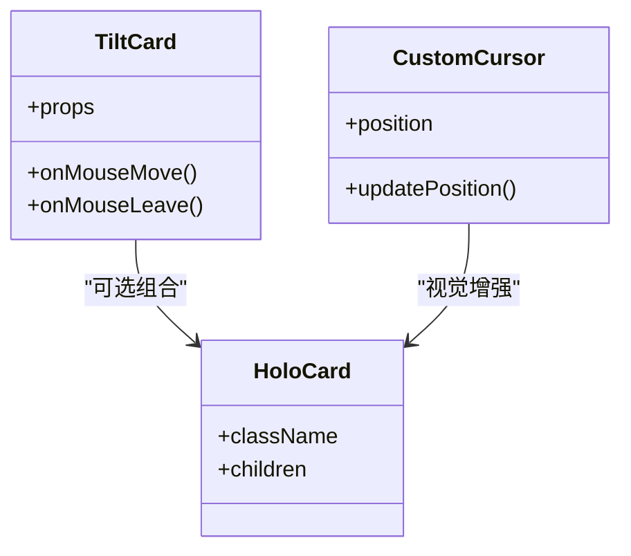
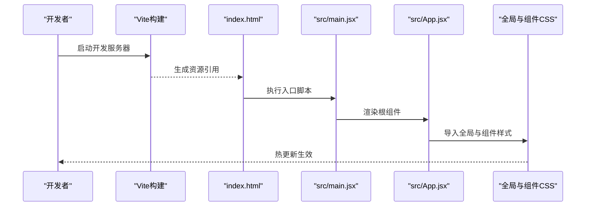

# 样式与主题

<cite>
**本文引用的文件**   
- [index.html](file://index.html)
- [package.json](file://package.json)
- [vite.config.js](file://vite.config.js)
- [src/main.jsx](file://src/main.jsx)
- [src/App.jsx](file://src/App.jsx)
- [src/App.css](file://src/App.css)
- [src/index.css](file://src/index.css)
- [src/components/HeroSection.jsx](file://src/components/HeroSection.jsx)
- [src/components/HeroSection.css](file://src/components/HeroSection.css)
- [src/components/AboutSection.jsx](file://src/components/AboutSection.jsx)
- [src/components/AboutSection.css](file://src/components/AboutSection.css)
- [src/components/WorksSection.jsx](file://src/components/WorksSection.jsx)
- [src/components/WorksSection.css](file://src/components/WorksSection.css)
- [src/components/KnowledgeBase.jsx](file://src/components/KnowledgeBase.jsx)
- [src/components/KnowledgeBase.css](file://src/components/KnowledgeBase.css)
- [src/components/ContactSection.jsx](file://src/components/ContactSection.jsx)
- [src/components/ContactSection.css](file://src/components/ContactSection.css)
- [src/components/ProjectDetailModal.jsx](file://src/components/ProjectDetailModal.jsx)
- [src/components/ProjectDetailModal.css](file://src/components/ProjectDetailModal.css)
- [src/components/YearOneProjects.jsx](file://src/components/YearOneProjects.jsx)
- [src/components/YearOneProjects.css](file://src/components/YearOneProjects.css)
- [src/components/CoverFlowCarousel.jsx](file://src/components/CoverFlowCarousel.jsx)
- [src/components/SmoothScroll.jsx](file://src/components/SmoothScroll.jsx)
- [src/components/ui/TiltCard.jsx](file://src/components/ui/TiltCard.jsx)
- [src/components/ui/HoloCard.css](file://src/components/ui/HoloCard.css)
- [src/components/ui/CustomCursor.jsx](file://src/components/ui/CustomCursor.jsx)
</cite>

## 目录
1. [简介](#简介)
2. [项目结构](#项目结构)
3. [核心组件](#核心组件)
4. [架构总览](#架构总览)
5. [详细组件分析](#详细组件分析)
6. [依赖分析](#依赖分析)
7. [性能考虑](#性能考虑)
8. [故障排查指南](#故障排查指南)
9. [结论](#结论)
10. [附录](#附录)

## 简介
本文件面向Goodent项目的样式与主题管理，系统性梳理CSS架构、模块化组织、响应式策略、动画体系、主题定制机制、性能优化、调试工作流、浏览器兼容性与移动端适配等。目标是帮助开发者快速理解并高效扩展样式系统，同时保证可维护性与性能表现。

## 项目结构
Goodent采用“组件级样式”的模块化组织方式：每个业务组件与其对应的CSS文件就近存放，便于定位与维护；全局样式集中在入口文件中，提供基础重置、设计令牌（颜色、字体、间距）与通用布局规则。

图表来源
- [index.html:1-50](file://index.html#L1-L50)
- [src/main.jsx:1-40](file://src/main.jsx#L1-L40)
- [src/App.jsx:1-60](file://src/App.jsx#L1-L60)
- [src/App.css:1-200](file://src/App.css#L1-L200)
- [src/index.css:1-200](file://src/index.css#L1-L200)
- [src/components/HeroSection.jsx:1-120](file://src/components/HeroSection.jsx#L1-L120)
- [src/components/HeroSection.css:1-200](file://src/components/HeroSection.css#L1-L200)
- [src/components/ui/HoloCard.css:1-200](file://src/components/ui/HoloCard.css#L1-L200)

章节来源
- [index.html:1-50](file://index.html#L1-L50)
- [src/main.jsx:1-40](file://src/main.jsx#L1-L40)
- [src/App.jsx:1-60](file://src/App.jsx#L1-L60)
- [src/App.css:1-200](file://src/App.css#L1-L200)
- [src/index.css:1-200](file://src/index.css#L1-L200)

## 核心组件
- 应用壳与入口
  - 入口挂载点与根组件引入位于入口脚本中，负责加载全局样式与根组件。
  - 根组件负责组合页面区块与全局样式，确保样式作用域清晰。
- 全局样式
  - 全局重置、基础排版、设计令牌（颜色变量、字体族、字号阶梯、行高、间距）集中定义，供所有组件复用。
- 组件样式
  - 每个组件拥有独立CSS文件，遵循BEM或语义化命名约定，避免全局污染。
  - 通过类名与作用域隔离，提升可维护性。

章节来源
- [src/main.jsx:1-40](file://src/main.jsx#L1-L40)
- [src/App.jsx:1-60](file://src/App.jsx#L1-L60)
- [src/App.css:1-200](file://src/App.css#L1-L200)
- [src/index.css:1-200](file://src/index.css#L1-L200)

## 架构总览
整体样式架构分为三层：
- 全局层：基础重置、设计令牌、通用布局与工具类。
- 组件层：按功能模块划分的样式，内聚于各自CSS文件。
- 增强层：交互与动效相关的样式（如卡片倾斜、全息效果、自定义光标）。

图表来源
- [src/index.css:1-200](file://src/index.css#L1-L200)
- [src/App.css:1-200](file://src/App.css#L1-L200)
- [src/components/HeroSection.css:1-200](file://src/components/HeroSection.css#L1-L200)
- [src/components/AboutSection.css:1-200](file://src/components/AboutSection.css#L1-L200)
- [src/components/WorksSection.css:1-200](file://src/components/WorksSection.css#L1-L200)
- [src/components/KnowledgeBase.css:1-200](file://src/components/KnowledgeBase.css#L1-L200)
- [src/components/ContactSection.css:1-200](file://src/components/ContactSection.css#L1-L200)
- [src/components/ProjectDetailModal.css:1-200](file://src/components/ProjectDetailModal.css#L1-L200)
- [src/components/YearOneProjects.css:1-200](file://src/components/YearOneProjects.css#L1-L200)
- [src/components/ui/HoloCard.css:1-200](file://src/components/ui/HoloCard.css#L1-L200)

## 详细组件分析

### HeroSection（首屏展示）
- 样式职责：全屏背景、主标题与副标题排版、CTA按钮、响应式断点适配。
- 响应式策略：使用媒体查询调整字号、间距与布局方向；在移动端优先单列布局。
- 动画与过渡：文本渐显、按钮悬停过渡、背景元素微动效。
- 主题支持：通过CSS变量控制主色、强调色与背景渐变。

图表来源
- [src/components/HeroSection.jsx:1-120](file://src/components/HeroSection.jsx#L1-L120)
- [src/components/HeroSection.css:1-200](file://src/components/HeroSection.css#L1-L200)

章节来源
- [src/components/HeroSection.jsx:1-120](file://src/components/HeroSection.jsx#L1-L120)
- [src/components/HeroSection.css:1-200](file://src/components/HeroSection.css#L1-L200)

### AboutSection（关于我）
- 样式职责：个人信息卡片、技能标签、时间线或介绍段落。
- 布局方案：Flex布局为主，配合Grid进行标签网格排列。
- 主题支持：通过变量控制卡片背景、边框与阴影层次。

章节来源
- [src/components/AboutSection.jsx:1-120](file://src/components/AboutSection.jsx#L1-L120)
- [src/components/AboutSection.css:1-200](file://src/components/AboutSection.css#L1-L200)

### WorksSection（作品展示）
- 样式职责：作品卡片网格、封面图比例、悬浮信息层。
- 布局方案：CSS Grid实现自适应网格；Flex用于卡片内部排版。
- 动画与过渡：卡片悬浮缩放、阴影加深、图片遮罩淡入。
- 主题支持：卡片主题色、强调色与文字对比度由变量驱动。

章节来源
- [src/components/WorksSection.jsx:1-120](file://src/components/WorksSection.jsx#L1-L120)
- [src/components/WorksSection.css:1-200](file://src/components/WorksSection.css#L1-L200)

### KnowledgeBase（知识库）
- 样式职责：知识条目列表、分类筛选、搜索框样式。
- 布局方案：Flex纵向列表+Grid分类标签。
- 交互：筛选状态切换过渡、搜索结果高亮。

章节来源
- [src/components/KnowledgeBase.jsx:1-120](file://src/components/KnowledgeBase.jsx#L1-L120)
- [src/components/KnowledgeBase.css:1-200](file://src/components/KnowledgeBase.css#L1-L200)

### ContactSection（联系）
- 样式职责：表单字段、提交按钮、联系方式展示。
- 布局方案：Flex表单布局，移动端垂直堆叠。
- 主题支持：输入框焦点态、错误提示色由变量控制。

章节来源
- [src/components/ContactSection.jsx:1-120](file://src/components/ContactSection.jsx#L1-L120)
- [src/components/ContactSection.css:1-200](file://src/components/ContactSection.css#L1-L200)

### ProjectDetailModal（项目详情弹窗）
- 样式职责：模态容器、内容滚动区域、关闭按钮。
- 布局方案：固定定位覆盖层，内容区使用Flex居中。
- 动画：弹出/收起过渡、背景遮罩透明度变化。

章节来源
- [src/components/ProjectDetailModal.jsx:1-120](file://src/components/ProjectDetailModal.jsx#L1-L120)
- [src/components/ProjectDetailModal.css:1-200](file://src/components/ProjectDetailModal.css#L1-L200)

### YearOneProjects（一年级项目）
- 样式职责：项目卡片集合、年份分组、导航锚点。
- 布局方案：Grid自适应网格，Flex分组标题。
- 主题：不同年份可用不同强调色区分。

章节来源
- [src/components/YearOneProjects.jsx:1-120](file://src/components/YearOneProjects.jsx#L1-L120)
- [src/components/YearOneProjects.css:1-200](file://src/components/YearOneProjects.css#L1-L200)

### UI增强组件（TiltCard / HoloCard / CustomCursor）
- TiltCard：基于JS计算倾斜角度，配合CSS transform实现3D倾斜。
- HoloCard：全息风格卡片，使用渐变、阴影与伪元素营造光泽。
- CustomCursor：自定义光标跟随，结合CSS与少量JS更新位置。

图表来源
- [src/components/ui/TiltCard.jsx:1-120](file://src/components/ui/TiltCard.jsx#L1-L120)
- [src/components/ui/HoloCard.css:1-200](file://src/components/ui/HoloCard.css#L1-L200)
- [src/components/ui/CustomCursor.jsx:1-120](file://src/components/ui/CustomCursor.jsx#L1-L120)

章节来源
- [src/components/ui/TiltCard.jsx:1-120](file://src/components/ui/TiltCard.jsx#L1-L120)
- [src/components/ui/HoloCard.css:1-200](file://src/components/ui/HoloCard.css#L1-L200)
- [src/components/ui/CustomCursor.jsx:1-120](file://src/components/ui/CustomCursor.jsx#L1-L120)

## 依赖分析
- 构建与打包
  - Vite作为构建工具，负责CSS压缩、按需加载与缓存策略。
  - package.json声明依赖与脚本命令，便于开发与生产环境切换。
- 样式加载顺序
  - index.html引入入口脚本，main.jsx加载App.jsx，App.jsx引入全局样式与组件样式。
  - 组件样式通过ES模块导入，Vite自动处理依赖与去重。

图表来源
- [package.json:1-120](file://package.json#L1-L120)
- [vite.config.js:1-120](file://vite.config.js#L1-L120)
- [index.html:1-50](file://index.html#L1-L50)
- [src/main.jsx:1-40](file://src/main.jsx#L1-L40)
- [src/App.jsx:1-60](file://src/App.jsx#L1-L60)

章节来源
- [package.json:1-120](file://package.json#L1-L120)
- [vite.config.js:1-120](file://vite.config.js#L1-L120)
- [index.html:1-50](file://index.html#L1-L50)
- [src/main.jsx:1-40](file://src/main.jsx#L1-L40)
- [src/App.jsx:1-60](file://src/App.jsx#L1-L60)

## 性能考虑
- CSS压缩与Tree Shaking
  - 生产构建启用CSS压缩，移除未使用的选择器与重复规则。
- 按需加载
  - 组件样式随组件懒加载，减少首屏体积。
- 缓存策略
  - 利用Vite哈希文件名与浏览器缓存，提升二次访问速度。
- 动画性能
  - 优先使用transform与opacity，避免触发布局重排。
- 资源优化
  - 图片与图标按需加载，使用现代格式与尺寸适配。

[本节为通用指导，不直接分析具体文件]

## 故障排查指南
- 样式未生效
  - 检查组件是否正确导入对应CSS文件。
  - 确认类名拼写与作用域是否冲突。
- 响应式异常
  - 核对媒体查询断点与设备像素比。
  - 检查父容器宽高约束是否影响子元素布局。
- 动画卡顿
  - 避免在高频事件中操作布局属性。
  - 使用will-change谨慎优化，防止内存占用过高。
- 主题变量失效
  - 确认CSS变量定义层级与继承关系。
  - 检查动态切换变量的时机与DOM更新。

章节来源
- [src/App.css:1-200](file://src/App.css#L1-L200)
- [src/index.css:1-200](file://src/index.css#L1-L200)
- [src/components/HeroSection.css:1-200](file://src/components/HeroSection.css#L1-L200)
- [src/components/WorksSection.css:1-200](file://src/components/WorksSection.css#L1-L200)
- [src/components/ProjectDetailModal.css:1-200](file://src/components/ProjectDetailModal.css#L1-L200)

## 结论
Goodent的样式架构以“全局设计令牌+组件级样式”为核心，结合Vite构建能力实现高效的模块化与性能优化。通过统一的变量体系与清晰的组件边界，开发者可以快速扩展主题与新增功能，同时保持代码的可读性与可维护性。

[本节为总结性内容，不直接分析具体文件]

## 附录

### 样式组织与命名约定
- 文件组织
  - 全局样式集中于index.css与App.css。
  - 组件样式与组件同目录，命名与组件一致。
- 命名约定
  - 使用语义化类名，推荐BEM风格。
  - 避免深层嵌套，保持选择器扁平化。

章节来源
- [src/index.css:1-200](file://src/index.css#L1-L200)
- [src/App.css:1-200](file://src/App.css#L1-L200)
- [src/components/HeroSection.css:1-200](file://src/components/HeroSection.css#L1-L200)

### 响应式设计最佳实践
- 媒体查询
  - 统一断点常量，避免散乱数值。
- 弹性布局
  - 使用Flex进行一维布局，合理设置flex-wrap与对齐。
- 网格布局
  - 使用Grid进行二维布局，配合auto-fit与minmax实现自适应。

章节来源
- [src/components/WorksSection.css:1-200](file://src/components/WorksSection.css#L1-L200)
- [src/components/AboutSection.css:1-200](file://src/components/AboutSection.css#L1-L200)

### 动画与过渡
- CSS过渡
  - 对hover、focus等状态使用transition平滑过渡。
- CSS动画
  - 关键帧动画用于复杂入场效果，注意性能与降级。
- GSAP集成
  - 如需高级动画，可在组件生命周期中引入GSAP，并在卸载时清理实例。

章节来源
- [src/components/HeroSection.css:1-200](file://src/components/HeroSection.css#L1-L200)
- [src/components/ProjectDetailModal.css:1-200](file://src/components/ProjectDetailModal.css#L1-L200)

### 主题定制机制
- 设计令牌
  - 颜色变量：主色、强调色、中性色、成功/警告/错误色。
  - 字体配置：字体族、字号阶梯、行高、字重。
  - 间距系统：统一间距刻度，避免随意数值。
- 主题切换
  - 通过根节点data-theme或CSS变量动态切换。
  - 组件读取变量，无需额外逻辑。

章节来源
- [src/index.css:1-200](file://src/index.css#L1-L200)
- [src/App.css:1-200](file://src/App.css#L1-L200)

### 样式调试与开发工作流
- 开发模式
  - 使用Vite热更新，实时预览样式变更。
- 调试工具
  - 浏览器开发者工具检查样式计算与性能面板。
- 规范检查
  - 引入CSSLint或Stylelint进行静态检查。

章节来源
- [vite.config.js:1-120](file://vite.config.js#L1-L120)
- [package.json:1-120](file://package.json#L1-L120)

### 浏览器兼容性与移动端适配
- 兼容性
  - 针对旧浏览器提供降级方案（如不使用新特性或使用polyfill）。
- 移动端
  - 使用viewport元标签，适配不同分辨率与像素密度。
  - 触摸事件与手势优化，避免误触。

章节来源
- [index.html:1-50](file://index.html#L1-L50)
- [src/components/HeroSection.css:1-200](file://src/components/HeroSection.css#L1-L200)