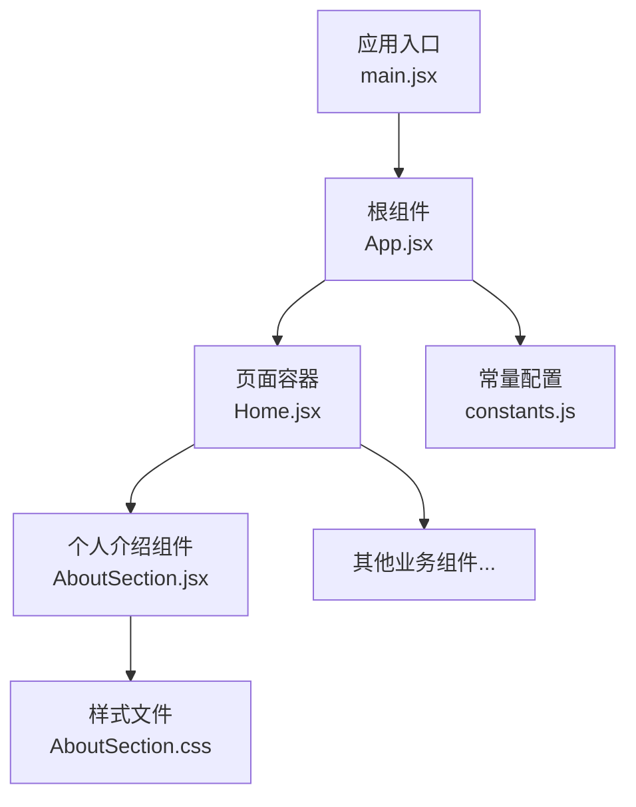
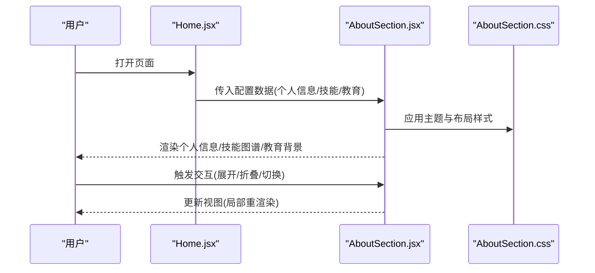
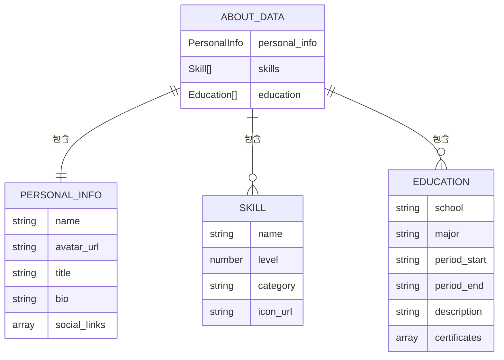
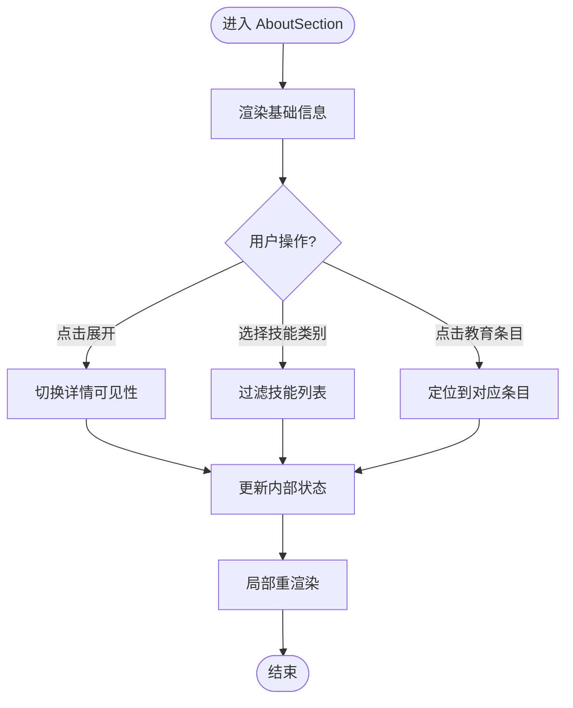
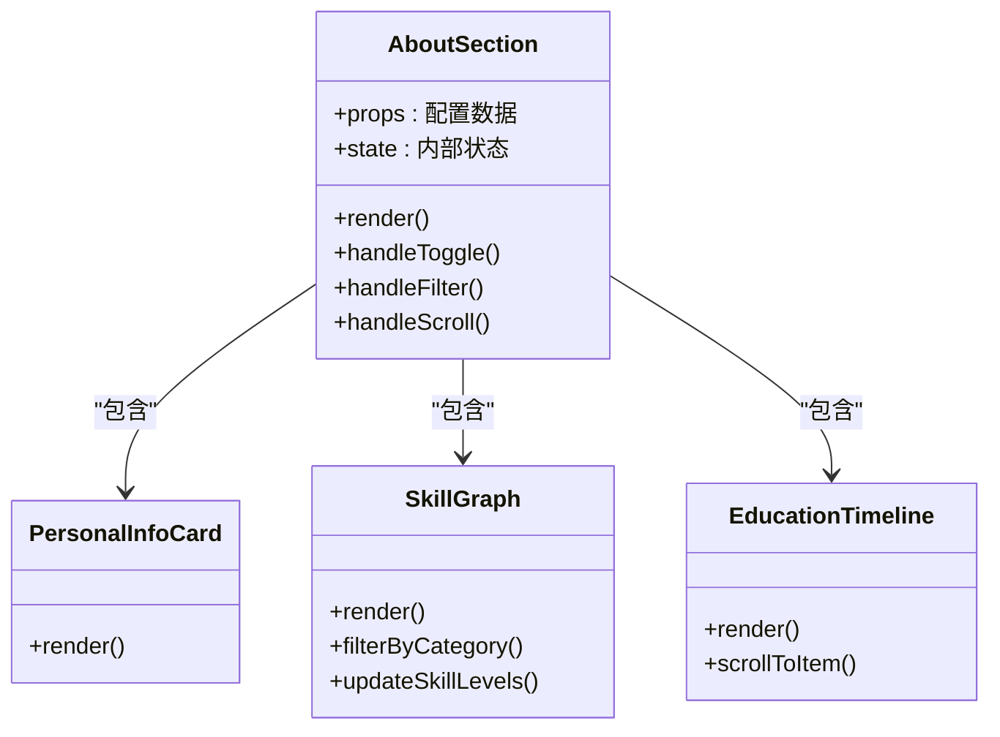
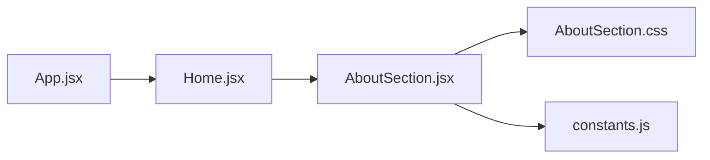

# 个人介绍组件

<cite>
**本文引用的文件**   
- [AboutSection.jsx](file://src/components/AboutSection.jsx)
- [AboutSection.css](file://src/components/AboutSection.css)
- [App.jsx](file://src/App.jsx)
- [Home.jsx](file://src/Home.jsx)
- [constants.js](file://src/constants.js)
</cite>

## 更新摘要
**变更内容**   
- 更新了技能图谱数据配置，反映最新的技能进度调整
- Python和C++技能进度条位置互换
- PCB技能替换为COMSOL Multiphysics
- Arduino技能升级为STM32/ESP32
- 相关数据结构示例和配置说明已同步更新

## 目录
1. [简介](#简介)
2. [项目结构](#项目结构)
3. [核心组件](#核心组件)
4. [架构总览](#架构总览)
5. [详细组件分析](#详细组件分析)
6. [依赖分析](#依赖分析)
7. [性能考虑](#性能考虑)
8. [故障排查指南](#故障排查指南)
9. [结论](#结论)
10. [附录](#附录) 

## 简介
本文件围绕 AboutSection 个人介绍组件，提供从设计理念到技术实现、数据模型与状态管理、交互逻辑、动态加载与响应式布局、全局状态集成、性能优化与用户体验改进的系统性文档。目标读者包括前端开发者与产品设计师，旨在帮助快速上手、定制扩展并稳定维护该组件。

## 项目结构
本项目采用按功能域组织的前端工程结构，AboutSection 位于 src/components 下，样式独立于组件文件；应用入口在 src/main.jsx，页面路由与组合在 src/Home.jsx 与 src/App.jsx 中完成；常量配置集中在 src/constants.js。

图表来源
- [App.jsx](file://src/App.jsx)
- [Home.jsx](file://src/Home.jsx)
- [AboutSection.jsx](file://src/components/AboutSection.jsx)
- [AboutSection.css](file://src/components/AboutSection.css)
- [constants.js](file://src/constants.js)

章节来源
- [App.jsx](file://src/App.jsx)
- [Home.jsx](file://src/Home.jsx)
- [AboutSection.jsx](file://src/components/AboutSection.jsx)
- [AboutSection.css](file://src/components/AboutSection.css)
- [constants.js](file://src/constants.js)

## 核心组件
AboutSection 负责展示个人基本信息、技能图谱可视化、教育背景等模块，并提供可配置的展示样式与交互行为。其设计要点：
- 模块化拆分：个人信息、技能图谱、教育背景各自为独立区块，便于单独测试与复用。
- 数据驱动：通过 props 或外部配置注入数据，避免硬编码。
- 响应式布局：基于 CSS 媒体查询与弹性布局，适配桌面与移动端。
- 可扩展性：预留插槽与主题变量，支持自定义图标、颜色与动画。

章节来源
- [AboutSection.jsx](file://src/components/AboutSection.jsx)
- [AboutSection.css](file://src/components/AboutSection.css)

## 架构总览
下图展示了 AboutSection 在应用中的位置与数据流向。数据通常由上层（Home 或 App）注入，组件内部仅做渲染与交互处理，保持低耦合。

图表来源
- [Home.jsx](file://src/Home.jsx)
- [AboutSection.jsx](file://src/components/AboutSection.jsx)
- [AboutSection.css](file://src/components/AboutSection.css)

## 详细组件分析

### 数据结构设计
建议的数据模型包含以下字段（示例说明，具体以实际实现为准）：
- 个人信息
  - 姓名、头像、职位、简介、联系方式、社交链接
- 技能图谱
  - 技能名称、熟练度等级、标签分类、图标资源
- 教育背景
  - 学校、专业、时间区间、描述、证书/奖项

**更新** 技能图谱数据结构现已支持更灵活的技能配置，包括Python、C++、COMSOL Multiphysics、STM32/ESP32等现代开发工具链的熟练度展示。

章节来源
- [AboutSection.jsx](file://src/components/AboutSection.jsx)
- [constants.js](file://src/constants.js)

### 状态管理机制
- 受控与非受控模式：对外暴露 props 作为单一数据源，内部维护最小必要状态（如展开/折叠、当前选中项）。
- 事件冒泡与回调：将关键交互事件（点击、切换）向上抛出，由父组件统一处理或持久化。
- 副作用隔离：数据获取与缓存放在父层或工具层，组件只消费数据，降低耦合。

章节来源
- [AboutSection.jsx](file://src/components/AboutSection.jsx)

### 用户交互逻辑
- 信息卡片展开/折叠：点击标题或按钮切换详情区域显示。
- 技能筛选与排序：按类别过滤、按熟练度排序，提升可读性。
- 教育时间轴导航：点击节点滚动至对应条目，支持键盘可达性。

章节来源
- [AboutSection.jsx](file://src/components/AboutSection.jsx)

### 动态内容加载
- 懒加载与分页：长列表（如技能/教育）按需加载，减少首屏压力。
- 图片与图标异步：使用占位图与延迟加载策略，结合错误回退。
- 增量更新：对频繁变更的字段（如在线状态）采用轮询或 WebSocket 推送，组件侧做最小化更新。

章节来源
- [AboutSection.jsx](file://src/components/AboutSection.jsx)

### 响应式布局与跨设备适配
- 网格与弹性布局：根据屏幕宽度自动调整列数与间距。
- 断点策略：针对手机、平板、桌面三档断点优化排版与字号。
- 触控友好：增大点击热区，提供滑动与手势支持。

章节来源
- [AboutSection.css](file://src/components/AboutSection.css)

### 与全局状态管理的集成
- 集中式配置：将个人信息、技能、教育等静态数据放入 constants.js，供多页面共享。
- 上下文传递：通过 React Context 或轻量状态库在 Home/App 层注入，AboutSection 消费数据。
- 单向数据流：确保数据自上而下流动，避免组件间直接耦合。

**更新** 技能数据配置已更新，现在包含最新的编程语言和开发工具链信息，支持更丰富的技能展示。

章节来源
- [constants.js](file://src/constants.js)
- [Home.jsx](file://src/Home.jsx)
- [App.jsx](file://src/App.jsx)

### 配置示例与自定义指南
以下为常见配置项说明（不展示代码，仅提供字段与用途说明）：
- 个人信息
  - 姓名、头像 URL、职位、简介、社交链接数组
- 技能图谱
  - 每项包含名称、等级（0-100）、分类、图标 URL
  - **更新** 支持多种编程语言（Python、C++）和开发平台（STM32/ESP32、COMSOL Multiphysics）的配置
- 教育背景
  - 学校、专业、起止时间、描述、证书列表
- 展示样式
  - 主题色、字体大小、卡片圆角、阴影强度、动画时长
- 交互开关
  - 是否允许展开详情、是否启用筛选、是否启用时间轴导航

**更新** 技能配置示例现已反映最新的技能进度调整，包括Python和C++的熟练度互换，以及新增的COMSOL Multiphysics和STM32/ESP32技能支持。

章节来源
- [AboutSection.jsx](file://src/components/AboutSection.jsx)
- [AboutSection.css](file://src/components/AboutSection.css)
- [constants.js](file://src/constants.js)

### 类关系与组件层次（概念示意）

**更新** 技能图谱组件现已增强，支持动态技能进度调整和更多类型的开发工具链展示。

图表来源
- [AboutSection.jsx](file://src/components/AboutSection.jsx)

## 依赖分析
- 组件内聚：AboutSection 聚焦展示与交互，尽量不引入复杂业务逻辑。
- 外部依赖：样式文件、可能的第三方图表库（若使用），应通过按需引入与版本锁定控制体积。
- 循环依赖：避免 AboutSection 与其父组件互相引用，使用 props 与回调解耦。

图表来源
- [AboutSection.jsx](file://src/components/AboutSection.jsx)
- [AboutSection.css](file://src/components/AboutSection.css)
- [constants.js](file://src/constants.js)
- [Home.jsx](file://src/Home.jsx)
- [App.jsx](file://src/App.jsx)

章节来源
- [AboutSection.jsx](file://src/components/AboutSection.jsx)
- [AboutSection.css](file://src/components/AboutSection.css)
- [constants.js](file://src/constants.js)
- [Home.jsx](file://src/Home.jsx)
- [App.jsx](file://src/App.jsx)

## 性能考虑
- 渲染优化
  - 使用 memo 包裹子区块，避免不必要的重渲染。
  - 虚拟列表用于长技能/教育列表。
- 资源优化
  - 图片懒加载与 WebP 格式，设置合理尺寸与占位。
  - 图标使用 SVG 或图标字体，按需加载。
- 计算优化
  - 大数据集预处理（排序、分组）在父层完成，组件只做展示。
- 网络优化
  - 合并请求、缓存策略、失败重试与降级展示。

[本节为通用指导，无需源码引用]

## 故障排查指南
- 常见问题
  - 数据未渲染：检查 props 是否正确传入与字段名匹配。
  - 样式错乱：确认 CSS 变量与断点定义是否存在冲突。
  - 交互无响应：核对事件绑定与回调函数是否被正确调用。
  - 技能数据显示异常：检查 constants.js 中的技能配置是否与组件期望的数据结构匹配。
- 调试建议
  - 在关键分支打印日志或使用浏览器调试面板观察状态变化。
  - 使用 React DevTools 检查组件树与属性更新。
  - 验证技能进度数据的数值范围是否在有效范围内（0-100）。
- 回退策略
  - 当外部数据不可用时，提供默认占位内容与提示文案。
  - 技能数据加载失败时，显示友好的错误提示和重试选项。

**更新** 新增了关于技能数据配置相关的故障排查指导，帮助开发者快速定位和解决技能进度显示问题。

章节来源
- [AboutSection.jsx](file://src/components/AboutSection.jsx)
- [AboutSection.css](file://src/components/AboutSection.css)

## 结论
AboutSection 以数据驱动与模块化为核心，兼顾可配置性与可扩展性。通过合理的状态管理与响应式布局，能够在多设备上提供一致的用户体验。遵循本文的配置与优化建议，可快速落地并持续迭代。

**更新** 随着技能图谱功能的增强和数据结构的优化，组件现在能够更好地展示现代化的开发技能组合，为用户提供更准确和全面的个人能力展示。

[本节为总结性内容，无需源码引用]

## 附录
- 术语表
  - 受控组件：由外部 props 控制状态的组件。
  - 非受控组件：内部维护自身状态的组件。
  - 断点：CSS 媒体查询中定义的屏幕宽度阈值。
  - 技能图谱：可视化展示个人技能水平和熟练度的图形界面。
- 参考路径
  - 组件实现：[AboutSection.jsx](file://src/components/AboutSection.jsx)
  - 样式定义：[AboutSection.css](file://src/components/AboutSection.css)
  - 常量配置：[constants.js](file://src/constants.js)
  - 页面组合：[Home.jsx](file://src/Home.jsx)、[App.jsx](file://src/App.jsx)
- 技能配置更新记录
  - Python和C++技能进度条位置互换
  - PCB技能替换为COMSOL Multiphysics
  - Arduino技能升级为STM32/ESP32

**更新** 新增了技能配置更新记录，方便开发者了解最近的技术栈变化和配置调整。