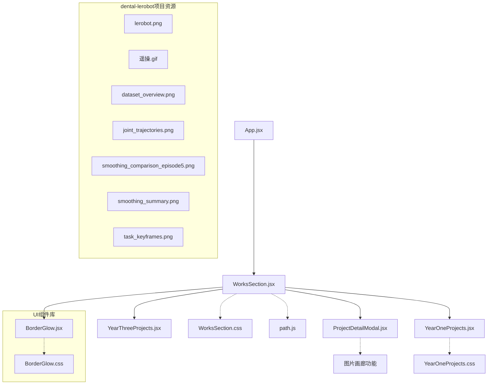
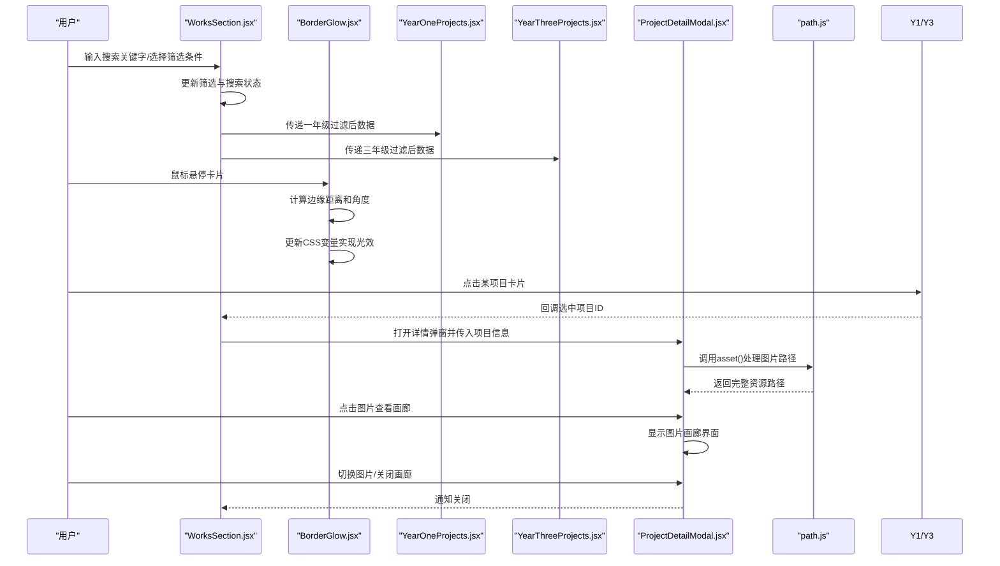
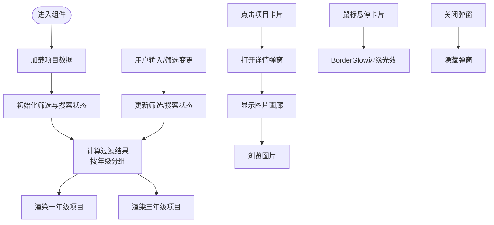
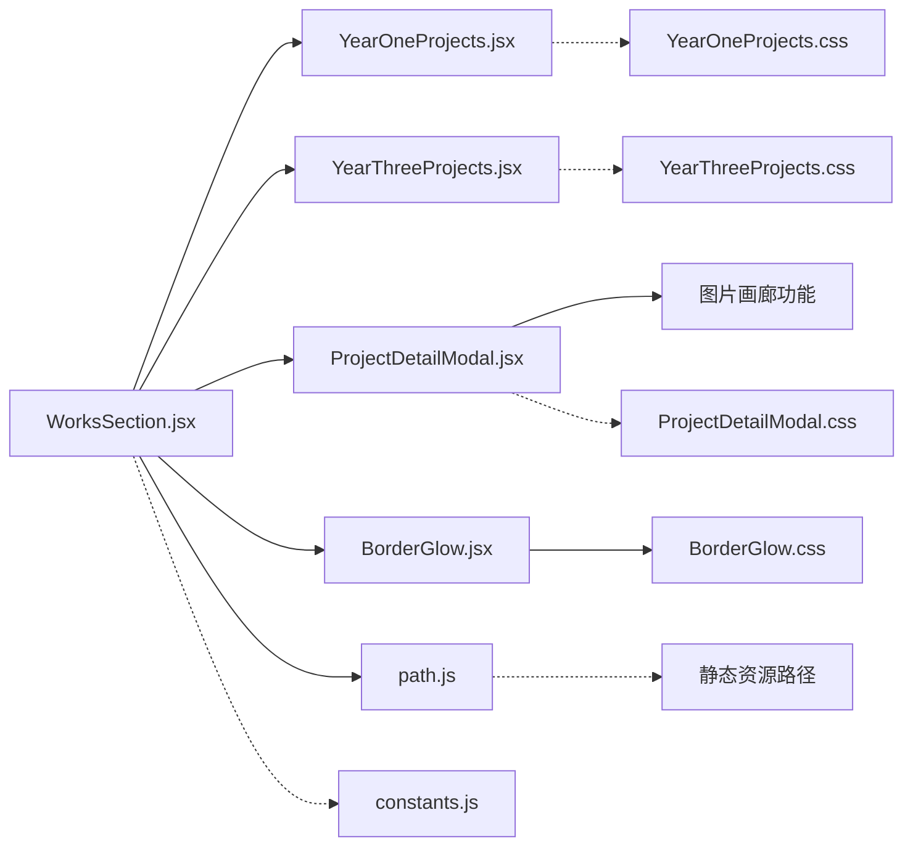

# 作品展示主组件

<cite>
**本文引用的文件**   
- [WorksSection.jsx](file://src/components/WorksSection.jsx)
- [WorksSection.css](file://src/components/WorksSection.css)
- [YearOneProjects.jsx](file://src/components/YearOneProjects.jsx)
- [YearOneProjects.css](file://src/components/YearOneProjects.css)
- [YearThreeProjects.jsx](file://src/components/YearThreeProjects.jsx)
- [ProjectDetailModal.jsx](file://src/components/ProjectDetailModal.jsx)
- [ProjectDetailModal.css](file://src/components/ProjectDetailModal.css)
- [BorderGlow.jsx](file://src/components/ui/BorderGlow.jsx)
- [BorderGlow.css](file://src/components/ui/BorderGlow.css)
- [constants.js](file://src/constants.js)
- [App.jsx](file://src/App.jsx)
- [path.js](file://src/utils/path.js)
</cite>

## 更新摘要
**变更内容**   
- **重要更新**：WorksSection组件中dental-lerobot项目部分新增了高质量技术图片资源，增强了项目的视觉展示效果
- **新增图片资源**：包含7张高质量技术图片，涵盖ARUCO定位、ACT控制、强化学习等核心技术展示
- **视觉增强**：通过丰富的技术图表和演示动画，提升LeRobot牙科种植机器人的专业展示效果
- **交互优化**：支持图片画廊浏览功能，用户可以详细查看各项技术细节

## 目录
1. [简介](#简介)
2. [项目结构](#项目结构)
3. [核心组件](#核心组件)
4. [架构总览](#架构总览)
5. [详细组件分析](#详细组件分析)
6. [依赖关系分析](#依赖关系分析)
7. [性能考虑](#性能考虑)
8. [故障排查指南](#故障排查指南)
9. [结论](#结论)
10. [附录](#附录)

## 简介
本文件围绕"作品展示主组件"（WorksSection）进行系统化文档化，重点覆盖：
- 架构设计与数据流管理
- 状态控制机制与筛选、搜索逻辑
- 与 YearOneProjects、YearThreeProjects 子组件的协作方式
- BorderGlow组件集成和边缘光效实现
- LeRobot牙科种植机器人和3D人体网格应变分析项目
- **新增** dental-lerobot项目的高质量技术图片资源展示
- 用户交互处理流程
- CSS 样式架构、响应式设计与动画效果实现
- 性能优化策略与最佳实践
- 配置示例与维护指南

## 项目结构
作品展示模块位于 src/components 下，核心文件包括：
- WorksSection.jsx：主容器，负责聚合数据、统一筛选与搜索、分发到年级分组子组件
- YearOneProjects.jsx / YearThreeProjects.jsx：按年级分组渲染项目卡片
- ProjectDetailModal.jsx：项目详情弹窗，支持图片画廊浏览
- BorderGlow.jsx：通用卡片包装器，提供指针跟踪的边缘光效
- 对应 CSS 文件：样式与动画定义
- constants.js：全局常量（如默认筛选值、排序选项等）
- App.jsx：页面级入口，集成各 Section 组件
- path.js：静态资源路径处理工具



**图表来源**
- [App.jsx](file://src/App.jsx)
- [WorksSection.jsx](file://src/components/WorksSection.jsx)
- [YearOneProjects.jsx](file://src/components/YearOneProjects.jsx)
- [YearThreeProjects.jsx](file://src/components/YearThreeProjects.jsx)
- [ProjectDetailModal.jsx](file://src/components/ProjectDetailModal.jsx)
- [BorderGlow.jsx](file://src/components/ui/BorderGlow.jsx)
- [BorderGlow.css](file://src/components/ui/BorderGlow.css)
- [constants.js](file://src/constants.js)
- [path.js](file://src/utils/path.js)

**章节来源**
- [App.jsx](file://src/App.jsx)
- [WorksSection.jsx](file://src/components/WorksSection.jsx)
- [YearOneProjects.jsx](file://src/components/YearOneProjects.jsx)
- [YearThreeProjects.jsx](file://src/components/YearThreeProjects.jsx)
- [ProjectDetailModal.jsx](file://src/components/ProjectDetailModal.jsx)
- [BorderGlow.jsx](file://src/components/ui/BorderGlow.jsx)
- [constants.js](file://src/constants.js)
- [path.js](file://src/utils/path.js)

## 核心组件
- WorksSection（主组件）
  - 职责：集中管理项目数据、筛选条件、搜索关键字；将过滤后的数据分发给 YearOneProjects 和 YearThreeProjects；控制详情弹窗显示。
  - 关键状态：项目列表、当前筛选维度（如类别/标签）、搜索关键字、选中项目（用于弹窗）。
  - 关键方法：更新筛选、更新搜索、打开/关闭详情弹窗、计算过滤结果。
- YearOneProjects / YearThreeProjects（子组件）
  - 职责：接收各自年级的项目数据，渲染卡片网格；支持点击事件回调以打开详情弹窗。
- ProjectDetailModal（详情弹窗）
  - 职责：展示选中项目的详细信息；提供关闭操作；支持图片画廊浏览功能。
  - 支持多图片展示和用户交互导航。
- BorderGlow（通用卡片包装器）
  - 职责：为卡片提供指针跟踪的边缘光效和渐变边框效果
  - 特性：CSS变量驱动、高性能动画、可配置的发光颜色和半径
  - 优势：替代已弃用的HoloCard组件，提供更流畅的用户体验

**章节来源**
- [WorksSection.jsx](file://src/components/WorksSection.jsx)
- [YearOneProjects.jsx](file://src/components/YearOneProjects.jsx)
- [YearThreeProjects.jsx](file://src/components/YearThreeProjects.jsx)
- [ProjectDetailModal.jsx](file://src/components/ProjectDetailModal.jsx)
- [BorderGlow.jsx](file://src/components/ui/BorderGlow.jsx)

## 架构总览
从数据到视图的整体流程如下：
- 数据来源：通常来自组件内部定义或外部接口（若存在），由主组件初始化并缓存。
- 状态层：主组件维护筛选与搜索状态，派生出最终展示数据。
- 视图层：根据年级拆分数据，分别交由 YearOneProjects 与 YearThreeProjects 渲染。
- 交互层：用户触发筛选/搜索时，主组件更新状态并重新计算展示数据；点击项目卡片时打开详情弹窗；支持图片画廊浏览。
- 视觉效果层：BorderGlow组件提供动态边缘光效，增强卡片交互体验。
- **新增** 图片资源层：dental-lerobot项目包含7张高质量技术图片，通过asset工具函数统一管理路径。



**图表来源**
- [WorksSection.jsx](file://src/components/WorksSection.jsx)
- [BorderGlow.jsx](file://src/components/ui/BorderGlow.jsx)
- [YearOneProjects.jsx](file://src/components/YearOneProjects.jsx)
- [YearThreeProjects.jsx](file://src/components/YearThreeProjects.jsx)
- [ProjectDetailModal.jsx](file://src/components/ProjectDetailModal.jsx)
- [path.js](file://src/utils/path.js)

## 详细组件分析

### WorksSection 主组件
- 设计要点
  - 单一数据源：所有项目数据在主组件内统一管理，避免重复请求与不一致。
  - 派生状态：基于原始数据 + 筛选 + 搜索，计算得到最终展示数据，保证可预测性。
  - 低耦合分发：仅向子组件传递必要的数据与回调，保持子组件纯展示特性。
  - 使用BorderGlow组件替代HoloCard，提供更好的边缘光效体验。
- 数据流
  - 初始化：加载项目数据（可能来自常量或异步接口）。
  - 过滤：先按年级分组，再应用筛选与搜索条件。
  - 分发：将一年级与三年级数据分别传给对应子组件。
- 状态控制
  - 筛选：支持多维度（如类别、标签、年份等），通过组合条件生成查询谓词。
  - 搜索：对标题、描述、标签等字段进行模糊匹配。
  - 弹窗：维护选中项目 ID，控制详情弹窗显隐。
- 用户交互
  - 输入框变更：防抖处理，减少频繁重算。
  - 下拉/按钮筛选：即时生效，必要时保留最近一次筛选历史。
  - 点击卡片：调用父组件回调，打开详情弹窗。
  - 鼠标悬停：BorderGlow组件自动检测边缘距离，触发彩色光效。



**图表来源**
- [WorksSection.jsx](file://src/components/WorksSection.jsx)
- [BorderGlow.jsx](file://src/components/ui/BorderGlow.jsx)
- [YearOneProjects.jsx](file://src/components/YearOneProjects.jsx)
- [YearThreeProjects.jsx](file://src/components/YearThreeProjects.jsx)
- [ProjectDetailModal.jsx](file://src/components/ProjectDetailModal.jsx)

**章节来源**
- [WorksSection.jsx](file://src/components/WorksSection.jsx)

### BorderGlow 组件
- 设计要点
  - 指针跟踪：实时计算鼠标位置与卡片边缘的距离
  - CSS变量驱动：通过CSS变量控制光效强度和颜色
  - 高性能：使用requestAnimationFrame确保流畅动画
  - 可配置：支持自定义发光颜色、半径、敏感度等参数
- 核心功能
  - 边缘距离计算：`getEdgeProximity`方法计算光标到边缘的距离
  - 角度计算：`getCursorAngle`方法计算光标相对于卡片中心的角度
  - 渐变效果：基于距离和角度生成动态的彩色网格渐变边框
  - 入场动画：可选的扫光动画效果
- 性能优化
  - 事件节流：pointermove事件经过优化处理
  - CSS硬件加速：使用transform和opacity属性
  - 内存管理：及时清理事件监听器和动画帧

**章节来源**
- [BorderGlow.jsx](file://src/components/ui/BorderGlow.jsx)
- [BorderGlow.css](file://src/components/ui/BorderGlow.css)

### YearOneProjects 子组件
- 职责：接收一年级项目数组，渲染为卡片网格；处理点击事件回调。
- 渲染策略：使用网格布局，适配不同屏幕尺寸；支持懒加载图片（若实现）。
- 交互：点击卡片触发父组件回调，携带项目标识以便主组件打开详情弹窗。
- 卡片现在使用BorderGlow组件包裹，提供边缘光效。

**章节来源**
- [YearOneProjects.jsx](file://src/components/YearOneProjects.jsx)
- [YearOneProjects.css](file://src/components/YearOneProjects.css)

### YearThreeProjects 子组件
- 职责：与一年级组件类似，但针对三年级项目集合。
- 差异化：可根据业务需要调整卡片样式或排序规则。
- 包含LeRobot牙科种植机器人和3D人体网格应变分析两个新项目。

**章节来源**
- [YearThreeProjects.jsx](file://src/components/YearThreeProjects.jsx)

### ProjectDetailModal 详情弹窗
- 职责：展示选中项目的详细信息，包含标题、描述、图片、链接等。
- 行为：支持 ESC 关闭、遮罩点击关闭、内部关闭按钮关闭。
- 样式：居中定位、遮罩背景、过渡动画。
- 图片画廊浏览
  - 支持多图片展示和轮播
  - 键盘导航（左右箭头切换图片）
  - 触摸滑动支持（移动端）
  - 图片缩放和平移功能
  - 全屏浏览模式
- **新增** dental-lerobot项目的高质量技术图片展示

**章节来源**
- [ProjectDetailModal.jsx](file://src/components/ProjectDetailModal.jsx)
- [ProjectDetailModal.css](file://src/components/ProjectDetailModal.css)

### dental-lerobot项目图片资源（新增）
- **图片数量**：7张高质量技术图片
- **图片类型**：PNG静态图片和GIF动态演示
- **技术展示内容**：
  - `lerobot.png`：系统整体架构图
  - `遥操.gif`：主从遥操作演示动画
  - `dataset_overview.png`：数据集概览图
  - `joint_trajectories.png`：关节轨迹可视化
  - `smoothing_comparison_episode5.png`：平滑算法对比图
  - `smoothing_summary.png`：平滑效果总结图
  - `task_keyframes.png`：任务关键帧展示
- **路径管理**：通过asset工具函数统一处理，支持开发环境和生产环境的路径适配

**章节来源**
- [WorksSection.jsx](file://src/components/WorksSection.jsx)
- [YearThreeProjects.jsx](file://src/components/YearThreeProjects.jsx)
- [path.js](file://src/utils/path.js)

## 依赖关系分析
- 组件间依赖
  - WorksSection 依赖 YearOneProjects、YearThreeProjects、ProjectDetailModal、BorderGlow。
  - 子组件不反向依赖主组件，仅通过 props 与回调通信。
- 常量依赖
  - 项目数据结构、默认筛选项、排序选项等集中在 constants.js，便于统一维护。
- 样式依赖
  - 每个组件拥有独立 CSS，遵循模块化样式组织原则。
- 工具依赖
  - path.js提供静态资源路径处理，确保在不同部署环境下正确加载图片资源。
- **新增依赖**：BorderGlow组件被WorksSection直接使用，提供统一的卡片视觉效果。



**图表来源**
- [WorksSection.jsx](file://src/components/WorksSection.jsx)
- [YearOneProjects.jsx](file://src/components/YearOneProjects.jsx)
- [YearThreeProjects.jsx](file://src/components/YearThreeProjects.jsx)
- [ProjectDetailModal.jsx](file://src/components/ProjectDetailModal.jsx)
- [BorderGlow.jsx](file://src/components/ui/BorderGlow.jsx)
- [constants.js](file://src/constants.js)
- [path.js](file://src/utils/path.js)

**章节来源**
- [WorksSection.jsx](file://src/components/WorksSection.jsx)
- [constants.js](file://src/constants.js)
- [path.js](file://src/utils/path.js)

## 性能考虑
- 数据与状态
  - 使用派生状态避免重复计算；在筛选/搜索变化时仅重算必要部分。
  - 对大型列表采用虚拟滚动或分页（如需）。
- 渲染优化
  - 子组件尽量纯函数式，减少不必要的 re-render。
  - 图片懒加载与占位图，降低首屏压力。
  - 图片画廊中的图片预加载和缓存机制。
- 交互优化
  - 搜索输入防抖，避免高频重算。
  - 筛选条件合并与去重，减少无效更新。
  - BorderGlow组件的性能优化：
    - CSS变量驱动，避免频繁的DOM操作
    - pointermove事件优化，减少计算频率
    - requestAnimationFrame确保动画流畅性
- 图片资源优化
  - **新增** dental-lerobot项目图片采用合适的格式（PNG/GIF）平衡质量和体积
  - 使用lazy loading属性延迟非首屏图片加载
  - 通过asset工具函数优化路径解析，减少网络请求开销
- 样式与动画
  - 使用 transform 与 opacity 做动画，避免触发布局抖动。
  - 合理使用 will-change 与 GPU 加速属性。
  - BorderGlow的CSS硬件加速和内存管理。

## 故障排查指南
- 筛选/搜索无结果
  - 检查筛选条件是否过于严格；确认搜索字段是否包含目标文本。
  - 查看控制台是否有类型错误或空指针异常。
- 弹窗无法打开
  - 确认选中项目 ID 是否正确传递；检查弹窗显隐状态是否被其他逻辑覆盖。
- 图片画廊问题
  - 检查项目数据中的 images 数组格式是否正确。
  - 确认图片路径和访问权限设置。
  - 检查图片格式兼容性（支持 JPG、PNG、WebP 等常见格式）。
  - **新增** dental-lerobot项目图片路径验证，确保asset函数正确处理路径。
- BorderGlow相关问题
  - 检查CSS变量是否正确设置（--edge-proximity, --cursor-angle）。
  - 确认pointermove事件监听器是否正确绑定。
  - 验证边缘距离计算逻辑是否正常工作。
- 样式错乱
  - 检查 CSS 类名冲突；确认媒体查询与栅格布局在不同分辨率下的表现。
- 性能问题
  - 使用浏览器性能面板分析重渲染热点；评估是否需要引入 memoization 或分页。
  - 监控BorderGlow组件的事件处理频率，避免过度计算。
  - **新增** 监控dental-lerobot项目图片加载性能，确保不影响整体用户体验。

**章节来源**
- [WorksSection.jsx](file://src/components/WorksSection.jsx)
- [ProjectDetailModal.jsx](file://src/components/ProjectDetailModal.jsx)
- [BorderGlow.jsx](file://src/components/ui/BorderGlow.jsx)
- [path.js](file://src/utils/path.js)

## 结论
WorksSection 作为作品展示的主组件，承担了数据聚合、筛选与搜索、分发渲染与弹窗控制的核心职责。通过与 YearOneProjects、YearThreeProjects 的清晰分层以及 ProjectDetailModal 的解耦交互，实现了良好的可维护性与扩展性。BorderGlow组件显著提升了用户体验，提供了专业的边缘光效和渐变边框效果。LeRobot牙科种植机器人和3D人体网格应变分析项目进一步丰富了作品集内容。**新增的dental-lerobot项目高质量技术图片资源**大幅增强了项目的视觉展示效果，通过7张精心制作的技术图表和演示动画，全面展示了ARUCO定位、ACT控制、强化学习等核心技术。配合模块化样式、合理的性能优化策略和完善的图片资源管理，可在复杂业务场景下保持稳定与高效。

## 附录

### 配置项目数据
- 数据位置：建议将项目元数据集中于组件内部或 constants.js，便于统一管理与版本迭代。
- 数据结构建议：包含 id、title、description、tags、category、year、thumbnail、links 等字段。
- 图片画廊支持：
  - images 数组：存储项目相关图片的路径或 URL
  - 图片格式：支持多种常见图片格式（JPG、PNG、GIF、WebP等）
  - 图片数量：无限制，但建议控制在合理范围内以保证性能
  - **新增** dental-lerobot项目图片资源配置示例
- 动态加载：如需后端数据，可在主组件生命周期中发起请求并缓存结果。

**章节来源**
- [constants.js](file://src/constants.js)
- [WorksSection.jsx](file://src/components/WorksSection.jsx)
- [path.js](file://src/utils/path.js)

### 自定义展示样式
- 修改范围：通过对应组件的 CSS 文件调整卡片尺寸、间距、阴影、圆角等。
- 响应式：使用媒体查询适配移动端与桌面端布局差异。
- 主题化：可通过 CSS 变量统一管理颜色与字体，提升一致性。
- BorderGlow样式定制：
  - 发光颜色：通过glowColor属性自定义HSL颜色
  - 边缘敏感度：通过edgeSensitivity属性调整光效触发阈值
  - 发光半径：通过glowRadius属性控制外发光扩散范围
  - 渐变颜色：通过colors属性自定义mesh渐变的颜色数组

**章节来源**
- [WorksSection.css](file://src/components/WorksSection.css)
- [YearOneProjects.css](file://src/components/YearOneProjects.css)
- [ProjectDetailModal.css](file://src/components/ProjectDetailModal.css)
- [BorderGlow.css](file://src/components/ui/BorderGlow.css)

### 扩展功能
- 新增筛选维度：在主组件中添加新的筛选状态与计算逻辑，并在 UI 暴露相应控件。
- 增加排序：在过滤后追加排序步骤，支持按时间、名称、热度等排序。
- 国际化：抽取文案至常量或 i18n 资源文件，避免硬编码。
- BorderGlow扩展：
  - 自定义动画：通过animated属性启用入场扫光动画
  - 事件处理：通过onClick属性添加卡片点击事件
  - 样式覆盖：通过className属性添加额外的CSS类
  - 性能调优：通过edgeSensitivity属性优化交互响应
- **新增** 图片资源扩展：
  - 支持更多图片格式和压缩选项
  - 实现图片懒加载和预加载策略
  - 添加图片质量检测和错误处理

**章节来源**
- [WorksSection.jsx](file://src/components/WorksSection.jsx)
- [constants.js](file://src/constants.js)
- [BorderGlow.jsx](file://src/components/ui/BorderGlow.jsx)
- [path.js](file://src/utils/path.js)

### 使用与维护指南
- 快速上手
  - 在页面入口（App.jsx）中引入 WorksSection 并挂载到路由或页面容器中。
  - 确保项目数据已正确配置于组件内部或接口返回。
- 日常维护
  - 新增项目：在数据源中添加条目，确保必填字段完整。
  - 添加图片：在项目数据中包含 images 数组，提供高质量的项目图片。
  - 调整筛选：优先在常量中定义枚举与默认值，再在主组件中接入。
  - 样式迭代：在对应 CSS 文件中修改，注意命名空间与复用。
  - BorderGlow配置：根据项目需求调整发光效果和交互灵敏度。
  - **新增** dental-lerobot项目图片维护：
    - 定期检查和更新技术图片资源
    - 优化图片格式和大小以提升加载性能
    - 确保图片路径的正确性和可访问性
- 测试建议
  - 单元测试：对过滤与搜索逻辑编写用例，覆盖边界条件。
  - 视觉回归：对不同分辨率与主题进行截图对比。
  - 图片画廊测试：验证图片加载、导航和交互功能。
  - BorderGlow测试：验证边缘光效和鼠标交互功能。
  - **新增** 图片资源测试：验证dental-lerobot项目图片的正确加载和显示。

**章节来源**
- [App.jsx](file://src/App.jsx)
- [WorksSection.jsx](file://src/components/WorksSection.jsx)
- [constants.js](file://src/constants.js)
- [BorderGlow.jsx](file://src/components/ui/BorderGlow.jsx)
- [path.js](file://src/utils/path.js)

### 新项目介绍
- **LeRobot 牙科种植机器人**
  - 技术栈：ARUCO视觉定位、ACT模仿学习、强化学习泛化
  - 特点：6自由度机械臂、主从遥操作、智能种植手术演示
  - 应用场景：医疗机器人、具身智能、自动化手术
  - **新增** 高质量技术图片展示：包含系统架构图、遥操作演示、数据集概览、关节轨迹、平滑算法对比等7张技术图表

- **3D 人体网格应变分析**
  - 技术栈：Trimesh、Blender、Python、NumPy
  - 特点：生物力学仿真、热力图可视化、服装剪裁优化
  - 应用场景：人因工程设计、服装开发、运动分析

**章节来源**
- [YearThreeProjects.jsx](file://src/components/YearThreeProjects.jsx)
- [WorksSection.jsx](file://src/components/WorksSection.jsx)

### BorderGlow组件使用示例
```javascript
// 基础用法
<BorderGlow 
  className="work-card"
  backgroundColor="#0a0814"
  borderRadius={20}
  onClick={() => onSelect(project)}
>
  {/* 卡片内容 */}
</BorderGlow>

// 自定义发光效果
<BorderGlow
  glowColor="40 80 80"        // HSL颜色
  edgeSensitivity={30}         // 边缘敏感度
  glowRadius={40}             // 发光半径
  colors={['#c084fc', '#f472b6', '#38bdf8']}  // 渐变颜色
  animated={true}             // 启用入场动画
>
  {/* 卡片内容 */}
</BorderGlow>
```

**章节来源**
- [BorderGlow.jsx](file://src/components/ui/BorderGlow.jsx)
- [WorksSection.jsx](file://src/components/WorksSection.jsx)

### dental-lerobot项目图片资源配置
- **图片文件清单**：
  - `lerobot.png`：系统整体架构图（主图）
  - `遥操.gif`：主从遥操作演示动画
  - `dataset_overview.png`：数据集概览图
  - `joint_trajectories.png`：关节轨迹可视化图
  - `smoothing_comparison_episode5.png`：平滑算法对比图（第5集）
  - `smoothing_summary.png`：平滑效果总结图
  - `task_keyframes.png`：任务关键帧展示图
- **路径配置**：通过asset函数处理，确保跨环境兼容
- **展示方式**：在ProjectDetailModal中以画廊形式展示，支持轮播和放大查看
- **性能优化**：使用lazy loading和适当的图片格式平衡质量与加载速度

**章节来源**
- [WorksSection.jsx](file://src/components/WorksSection.jsx)
- [YearThreeProjects.jsx](file://src/components/YearThreeProjects.jsx)
- [path.js](file://src/utils/path.js)