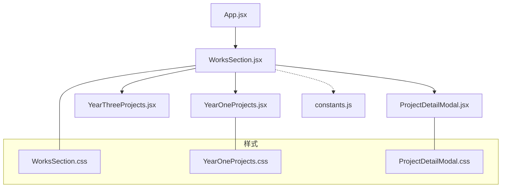
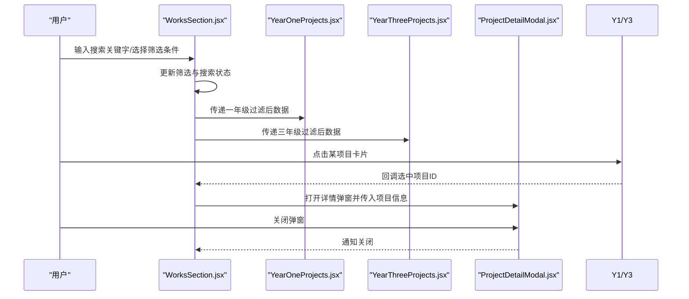
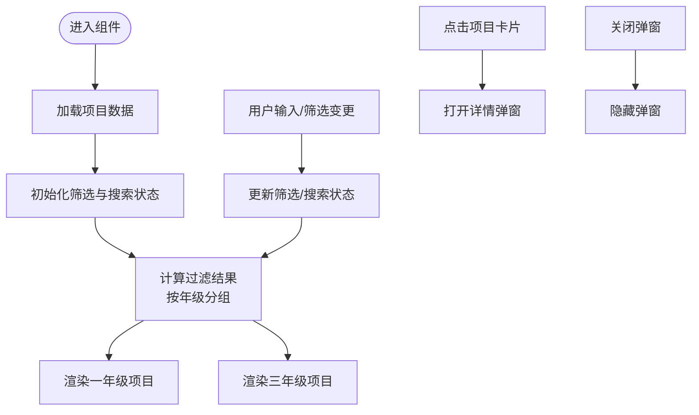
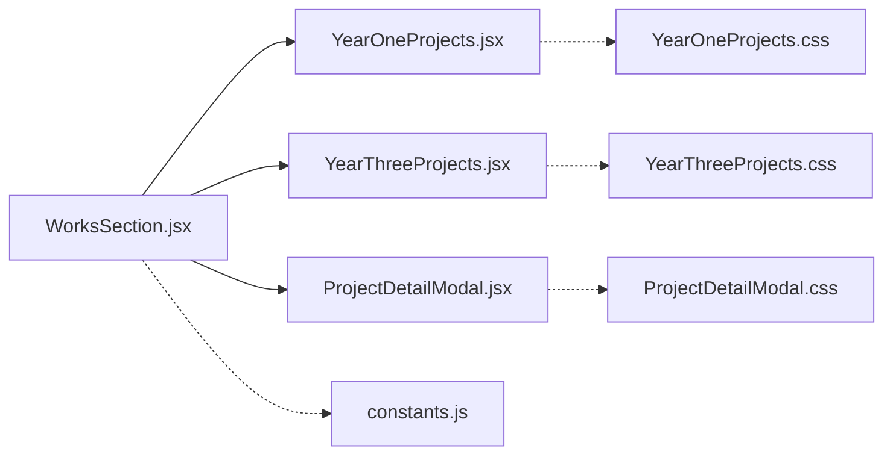

# 作品展示主组件

<cite>
**本文引用的文件**   
- [WorksSection.jsx](file://src/components/WorksSection.jsx)
- [WorksSection.css](file://src/components/WorksSection.css)
- [YearOneProjects.jsx](file://src/components/YearOneProjects.jsx)
- [YearOneProjects.css](file://src/components/YearOneProjects.css)
- [YearThreeProjects.jsx](file://src/components/YearThreeProjects.jsx)
- [ProjectDetailModal.jsx](file://src/components/ProjectDetailModal.jsx)
- [ProjectDetailModal.css](file://src/components/ProjectDetailModal.css)
- [constants.js](file://src/constants.js)
- [App.jsx](file://src/App.jsx)
</cite>

## 目录
1. [简介](#简介)
2. [项目结构](#项目结构)
3. [核心组件](#核心组件)
4. [架构总览](#架构总览)
5. [详细组件分析](#详细组件分析)
6. [依赖关系分析](#依赖关系分析)
7. [性能考虑](#性能考虑)
8. [故障排查指南](#故障排查指南)
9. [结论](#结论)
10. [附录](#附录)

## 简介
本文件围绕“作品展示主组件”（WorksSection）进行系统化文档化，重点覆盖：
- 架构设计与数据流管理
- 状态控制机制与筛选、搜索逻辑
- 与 YearOneProjects、YearThreeProjects 子组件的协作方式
- 用户交互处理流程
- CSS 样式架构、响应式设计与动画效果实现
- 性能优化策略与最佳实践
- 配置示例与维护指南

## 项目结构
作品展示模块位于 src/components 下，核心文件包括：
- WorksSection.jsx：主容器，负责聚合数据、统一筛选与搜索、分发到年级分组子组件
- YearOneProjects.jsx / YearThreeProjects.jsx：按年级分组渲染项目卡片
- ProjectDetailModal.jsx：项目详情弹窗
- 对应 CSS 文件：样式与动画定义
- constants.js：全局常量（如默认筛选值、排序选项等）
- App.jsx：页面级入口，集成各 Section 组件

图表来源
- [App.jsx](file://src/App.jsx)
- [WorksSection.jsx](file://src/components/WorksSection.jsx)
- [YearOneProjects.jsx](file://src/components/YearOneProjects.jsx)
- [YearThreeProjects.jsx](file://src/components/YearThreeProjects.jsx)
- [ProjectDetailModal.jsx](file://src/components/ProjectDetailModal.jsx)
- [constants.js](file://src/constants.js)
- [WorksSection.css](file://src/components/WorksSection.css)
- [YearOneProjects.css](file://src/components/YearOneProjects.css)
- [ProjectDetailModal.css](file://src/components/ProjectDetailModal.css)

章节来源
- [App.jsx](file://src/App.jsx)
- [WorksSection.jsx](file://src/components/WorksSection.jsx)
- [YearOneProjects.jsx](file://src/components/YearOneProjects.jsx)
- [YearThreeProjects.jsx](file://src/components/YearThreeProjects.jsx)
- [ProjectDetailModal.jsx](file://src/components/ProjectDetailModal.jsx)
- [constants.js](file://src/constants.js)

## 核心组件
- WorksSection（主组件）
  - 职责：集中管理项目数据、筛选条件、搜索关键字；将过滤后的数据分发给 YearOneProjects 和 YearThreeProjects；控制详情弹窗显示。
  - 关键状态：项目列表、当前筛选维度（如类别/标签）、搜索关键字、选中项目（用于弹窗）。
  - 关键方法：更新筛选、更新搜索、打开/关闭详情弹窗、计算过滤结果。
- YearOneProjects / YearThreeProjects（子组件）
  - 职责：接收各自年级的项目数据，渲染卡片网格；支持点击事件回调以打开详情弹窗。
- ProjectDetailModal（详情弹窗）
  - 职责：展示选中项目的详细信息；提供关闭操作。

章节来源
- [WorksSection.jsx](file://src/components/WorksSection.jsx)
- [YearOneProjects.jsx](file://src/components/YearOneProjects.jsx)
- [YearThreeProjects.jsx](file://src/components/YearThreeProjects.jsx)
- [ProjectDetailModal.jsx](file://src/components/ProjectDetailModal.jsx)

## 架构总览
从数据到视图的整体流程如下：
- 数据来源：通常来自 constants.js 或外部接口（若存在），由主组件初始化并缓存。
- 状态层：主组件维护筛选与搜索状态，派生出最终展示数据。
- 视图层：根据年级拆分数据，分别交由 YearOneProjects 与 YearThreeProjects 渲染。
- 交互层：用户触发筛选/搜索时，主组件更新状态并重新计算展示数据；点击项目卡片时打开详情弹窗。

图表来源
- [WorksSection.jsx](file://src/components/WorksSection.jsx)
- [YearOneProjects.jsx](file://src/components/YearOneProjects.jsx)
- [YearThreeProjects.jsx](file://src/components/YearThreeProjects.jsx)
- [ProjectDetailModal.jsx](file://src/components/ProjectDetailModal.jsx)

## 详细组件分析

### WorksSection 主组件
- 设计要点
  - 单一数据源：所有项目数据在主组件内统一管理，避免重复请求与不一致。
  - 派生状态：基于原始数据 + 筛选 + 搜索，计算得到最终展示数据，保证可预测性。
  - 低耦合分发：仅向子组件传递必要的数据与回调，保持子组件纯展示特性。
- 数据流
  - 初始化：加载项目数据（可能来自常量或异步接口）。
  - 过滤：先按年级分组，再应用筛选与搜索条件。
  - 分发：将一年级与三年级数据分别传给对应子组件。
- 状态控制
  - 筛选：支持多维度（如类别、标签、年份等），通过组合条件生成查询谓词。
  - 搜索：对标题、描述、标签等字段进行模糊匹配。
  - 弹窗：维护选中项目 ID，控制详情弹窗显隐。
- 用户交互
  - 输入框变更：防抖处理，减少频繁重算。
  - 下拉/按钮筛选：即时生效，必要时保留最近一次筛选历史。
  - 点击卡片：调用父组件回调，打开详情弹窗。

图表来源
- [WorksSection.jsx](file://src/components/WorksSection.jsx)
- [YearOneProjects.jsx](file://src/components/YearOneProjects.jsx)
- [YearThreeProjects.jsx](file://src/components/YearThreeProjects.jsx)
- [ProjectDetailModal.jsx](file://src/components/ProjectDetailModal.jsx)

章节来源
- [WorksSection.jsx](file://src/components/WorksSection.jsx)

### YearOneProjects 子组件
- 职责：接收一年级项目数组，渲染为卡片网格；处理点击事件回调。
- 渲染策略：使用网格布局，适配不同屏幕尺寸；支持懒加载图片（若实现）。
- 交互：点击卡片触发父组件回调，携带项目标识以便主组件打开详情弹窗。

章节来源
- [YearOneProjects.jsx](file://src/components/YearOneProjects.jsx)
- [YearOneProjects.css](file://src/components/YearOneProjects.css)

### YearThreeProjects 子组件
- 职责：与一年级组件类似，但针对三年级项目集合。
- 差异化：可根据业务需要调整卡片样式或排序规则。

章节来源
- [YearThreeProjects.jsx](file://src/components/YearThreeProjects.jsx)

### ProjectDetailModal 详情弹窗
- 职责：展示选中项目的详细信息，包含标题、描述、图片、链接等。
- 行为：支持 ESC 关闭、遮罩点击关闭、内部关闭按钮关闭。
- 样式：居中定位、遮罩背景、过渡动画。

章节来源
- [ProjectDetailModal.jsx](file://src/components/ProjectDetailModal.jsx)
- [ProjectDetailModal.css](file://src/components/ProjectDetailModal.css)

## 依赖关系分析
- 组件间依赖
  - WorksSection 依赖 YearOneProjects、YearThreeProjects、ProjectDetailModal。
  - 子组件不反向依赖主组件，仅通过 props 与回调通信。
- 常量依赖
  - 项目数据结构、默认筛选项、排序选项等集中在 constants.js，便于统一维护。
- 样式依赖
  - 每个组件拥有独立 CSS，遵循模块化样式组织原则。

图表来源
- [WorksSection.jsx](file://src/components/WorksSection.jsx)
- [YearOneProjects.jsx](file://src/components/YearOneProjects.jsx)
- [YearThreeProjects.jsx](file://src/components/YearThreeProjects.jsx)
- [ProjectDetailModal.jsx](file://src/components/ProjectDetailModal.jsx)
- [constants.js](file://src/constants.js)
- [YearOneProjects.css](file://src/components/YearOneProjects.css)
- [ProjectDetailModal.css](file://src/components/ProjectDetailModal.css)

章节来源
- [WorksSection.jsx](file://src/components/WorksSection.jsx)
- [constants.js](file://src/constants.js)

## 性能考虑
- 数据与状态
  - 使用派生状态避免重复计算；在筛选/搜索变化时仅重算必要部分。
  - 对大型列表采用虚拟滚动或分页（如需）。
- 渲染优化
  - 子组件尽量纯函数式，减少不必要的 re-render。
  - 图片懒加载与占位图，降低首屏压力。
- 交互优化
  - 搜索输入防抖，避免高频重算。
  - 筛选条件合并与去重，减少无效更新。
- 样式与动画
  - 使用 transform 与 opacity 做动画，避免触发布局抖动。
  - 合理使用 will-change 与 GPU 加速属性。

[本节为通用指导，无需具体文件引用]

## 故障排查指南
- 筛选/搜索无结果
  - 检查筛选条件是否过于严格；确认搜索字段是否包含目标文本。
  - 查看控制台是否有类型错误或空指针异常。
- 弹窗无法打开
  - 确认选中项目 ID 是否正确传递；检查弹窗显隐状态是否被其他逻辑覆盖。
- 样式错乱
  - 检查 CSS 类名冲突；确认媒体查询与栅格布局在不同分辨率下的表现。
- 性能问题
  - 使用浏览器性能面板分析重渲染热点；评估是否需要引入 memoization 或分页。

章节来源
- [WorksSection.jsx](file://src/components/WorksSection.jsx)
- [ProjectDetailModal.jsx](file://src/components/ProjectDetailModal.jsx)

## 结论
WorksSection 作为作品展示的主组件，承担了数据聚合、筛选与搜索、分发渲染与弹窗控制的核心职责。通过与 YearOneProjects、YearThreeProjects 的清晰分层以及 ProjectDetailModal 的解耦交互，实现了良好的可维护性与扩展性。配合模块化样式与合理的性能优化策略，可在复杂业务场景下保持稳定与高效。

[本节为总结性内容，无需具体文件引用]

## 附录

### 配置项目数据
- 数据位置：建议将项目元数据集中于 constants.js，便于统一管理与版本迭代。
- 数据结构建议：包含 id、title、description、tags、category、year、thumbnail、links 等字段。
- 动态加载：如需后端数据，可在主组件生命周期中发起请求并缓存结果。

章节来源
- [constants.js](file://src/constants.js)
- [WorksSection.jsx](file://src/components/WorksSection.jsx)

### 自定义展示样式
- 修改范围：通过对应组件的 CSS 文件调整卡片尺寸、间距、阴影、圆角等。
- 响应式：使用媒体查询适配移动端与桌面端布局差异。
- 主题化：可通过 CSS 变量统一管理颜色与字体，提升一致性。

章节来源
- [WorksSection.css](file://src/components/WorksSection.css)
- [YearOneProjects.css](file://src/components/YearOneProjects.css)
- [ProjectDetailModal.css](file://src/components/ProjectDetailModal.css)

### 扩展功能
- 新增筛选维度：在主组件中添加新的筛选状态与计算逻辑，并在 UI 暴露相应控件。
- 增加排序：在过滤后追加排序步骤，支持按时间、名称、热度等排序。
- 国际化：抽取文案至常量或 i18n 资源文件，避免硬编码。

章节来源
- [WorksSection.jsx](file://src/components/WorksSection.jsx)
- [constants.js](file://src/constants.js)

### 使用与维护指南
- 快速上手
  - 在页面入口（App.jsx）中引入 WorksSection 并挂载到路由或页面容器中。
  - 确保项目数据已正确配置于常量文件或接口返回。
- 日常维护
  - 新增项目：在数据源中添加条目，确保必填字段完整。
  - 调整筛选：优先在常量中定义枚举与默认值，再在主组件中接入。
  - 样式迭代：在对应 CSS 文件中修改，注意命名空间与复用。
- 测试建议
  - 单元测试：对过滤与搜索逻辑编写用例，覆盖边界条件。
  - 视觉回归：对不同分辨率与主题进行截图对比。

章节来源
- [App.jsx](file://src/App.jsx)
- [WorksSection.jsx](file://src/components/WorksSection.jsx)
- [constants.js](file://src/constants.js)