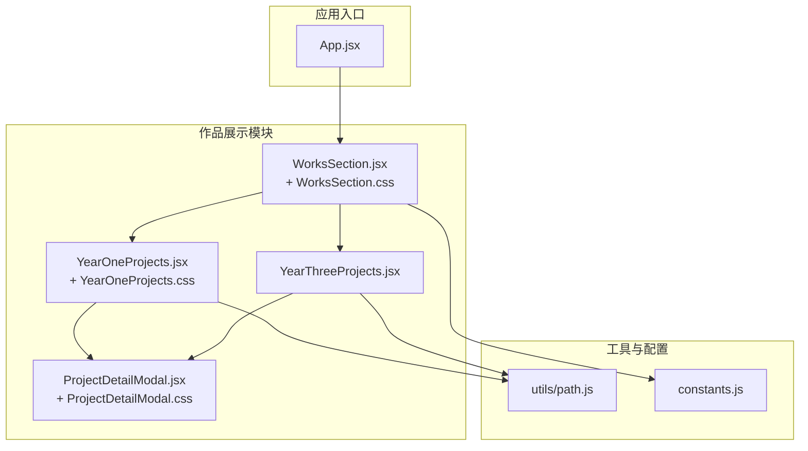
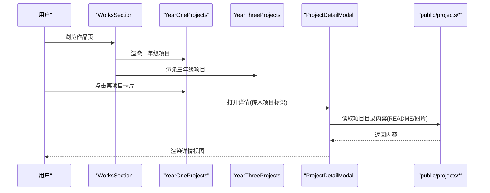
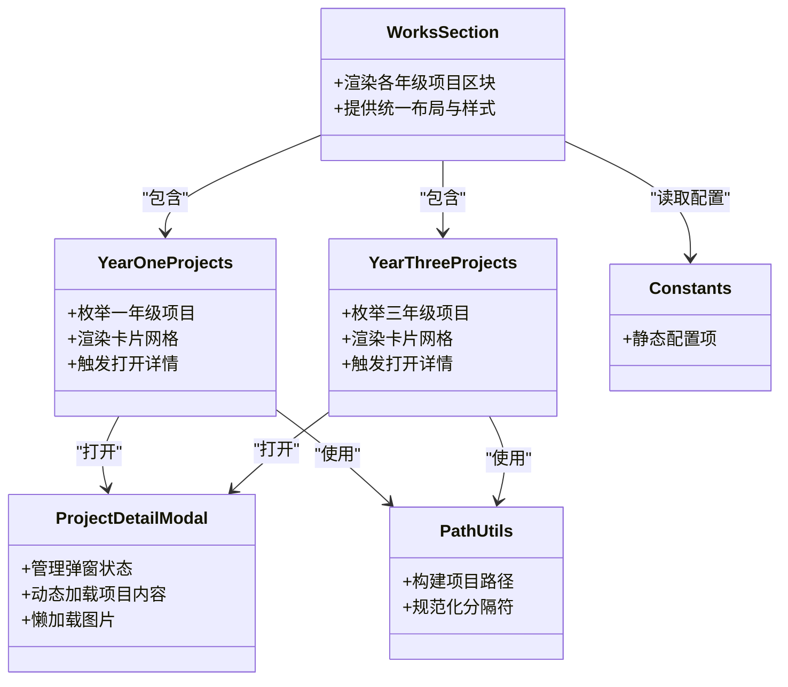

# 作品展示组件

<cite>
**本文引用的文件**   
- [WorksSection.jsx](file://src/components/WorksSection.jsx)
- [WorksSection.css](file://src/components/WorksSection.css)
- [YearOneProjects.jsx](file://src/components/YearOneProjects.jsx)
- [YearOneProjects.css](file://src/components/YearOneProjects.css)
- [YearThreeProjects.jsx](file://src/components/YearThreeProjects.jsx)
- [ProjectDetailModal.jsx](file://src/components/ProjectDetailModal.jsx)
- [ProjectDetailModal.css](file://src/components/ProjectDetailModal.css)
- [path.js](file://src/utils/path.js)
- [constants.js](file://src/constants.js)
- [App.jsx](file://src/App.jsx)
</cite>

## 目录
1. [简介](#简介)
2. [项目结构](#项目结构)
3. [核心组件](#核心组件)
4. [架构总览](#架构总览)
5. [详细组件分析](#详细组件分析)
6. [依赖分析](#依赖分析)
7. [性能考虑](#性能考虑)
8. [故障排查指南](#故障排查指南)
9. [结论](#结论)
10. [附录](#附录)

## 简介
本文件面向开发者与维护者，系统化阐述“作品展示系统”的架构与实现。重点覆盖以下方面：
- WorksSection 组件及其子组件（YearOneProjects、YearThreeProjects）的职责划分与协作关系
- 项目分类展示、年份筛选、项目详情模态框等核心功能
- 项目数据结构设计、文件路径管理、动态内容加载机制
- YearOneProjects 与 YearThreeProjects 的实现差异与复用模式
- ProjectDetailModal 的交互逻辑、内容渲染与状态管理
- 如何添加新项目、自定义展示样式、扩展筛选功能的实践方法
- 文件系统访问、图片懒加载与性能优化策略
- 项目管理最佳实践与常见问题解决方案

## 项目结构
作品展示系统位于 src/components 目录下，围绕“按年级组织的项目集合 + 详情弹窗”展开。公共工具与常量分别位于 src/utils 与 src/constants。

图表来源
- [App.jsx](file://src/App.jsx)
- [WorksSection.jsx](file://src/components/WorksSection.jsx)
- [YearOneProjects.jsx](file://src/components/YearOneProjects.jsx)
- [YearThreeProjects.jsx](file://src/components/YearThreeProjects.jsx)
- [ProjectDetailModal.jsx](file://src/components/ProjectDetailModal.jsx)
- [path.js](file://src/utils/path.js)
- [constants.js](file://src/constants.js)

章节来源
- [App.jsx](file://src/App.jsx)
- [WorksSection.jsx](file://src/components/WorksSection.jsx)
- [YearOneProjects.jsx](file://src/components/YearOneProjects.jsx)
- [YearThreeProjects.jsx](file://src/components/YearThreeProjects.jsx)
- [ProjectDetailModal.jsx](file://src/components/ProjectDetailModal.jsx)
- [path.js](file://src/utils/path.js)
- [constants.js](file://src/constants.js)

## 核心组件
- WorksSection：页面级容器，负责渲染不同年级的项目区块，并提供统一的标题、说明与布局控制。
- YearOneProjects / YearThreeProjects：年级维度的项目列表组件，负责从静态资源中读取项目清单、渲染卡片网格、处理点击事件以打开详情弹窗。
- ProjectDetailModal：项目详情弹窗，负责根据选中项目动态加载对应目录下的内容（如 README、图片等），并管理弹窗的显示/隐藏与滚动行为。

章节来源
- [WorksSection.jsx](file://src/components/WorksSection.jsx)
- [YearOneProjects.jsx](file://src/components/YearOneProjects.jsx)
- [YearThreeProjects.jsx](file://src/components/YearThreeProjects.jsx)
- [ProjectDetailModal.jsx](file://src/components/ProjectDetailModal.jsx)

## 架构总览
整体采用“父容器 + 年级子组件 + 详情弹窗”的分层架构。数据源为 public/projects 下的静态目录，通过工具函数解析路径与文件名，避免硬编码；详情弹窗按需加载目标项目的文本与媒体资源。

图表来源
- [WorksSection.jsx](file://src/components/WorksSection.jsx)
- [YearOneProjects.jsx](file://src/components/YearOneProjects.jsx)
- [YearThreeProjects.jsx](file://src/components/YearThreeProjects.jsx)
- [ProjectDetailModal.jsx](file://src/components/ProjectDetailModal.jsx)

## 详细组件分析

### WorksSection 组件
职责与行为
- 作为作品展示页面的根容器，聚合多个年级的子组件。
- 提供统一的页面标题、描述与布局结构。
- 可承载全局筛选或排序逻辑（若需要）。

关键要点
- 使用 CSS 类名进行样式隔离，便于主题定制。
- 通过 props 向子组件传递必要的数据或回调。

章节来源
- [WorksSection.jsx](file://src/components/WorksSection.jsx)
- [WorksSection.css](file://src/components/WorksSection.css)

### YearOneProjects 与 YearThreeProjects 组件
共性
- 均负责从静态目录中枚举项目、生成卡片网格、响应点击事件打开详情弹窗。
- 均依赖路径工具函数构建项目路径，确保跨环境一致。

差异点
- 数据源目录不同：一年级与三年级分别映射到不同的顶层目录。
- 可选的默认筛选条件或展示顺序可能不同。
- 样式微调（如卡片尺寸、间距）可通过各自 CSS 文件独立控制。

复用模式
- 将“枚举项目 + 渲染网格 + 打开详情”的通用逻辑抽象为共享函数或 Hook（建议），在两个组件中复用。
- 仅保留年级相关的差异化配置（如目录前缀、默认标签）。

章节来源
- [YearOneProjects.jsx](file://src/components/YearOneProjects.jsx)
- [YearOneProjects.css](file://src/components/YearOneProjects.css)
- [YearThreeProjects.jsx](file://src/components/YearThreeProjects.jsx)

### ProjectDetailModal 组件
交互逻辑
- 接收当前选中的项目标识，计算其所在目录路径。
- 打开时锁定背景滚动，关闭时恢复。
- 支持键盘 ESC 关闭与点击遮罩关闭。

内容渲染
- 根据项目目录结构动态加载内容（例如 README 文本、图片列表）。
- 对图片资源进行懒加载，减少首屏压力。
- 对长内容启用内部滚动区域，保持弹窗尺寸稳定。

状态管理
- 维护弹窗可见性、当前项目信息、已加载内容缓存等状态。
- 提供受控与非受控两种使用方式（视具体实现而定）。

章节来源
- [ProjectDetailModal.jsx](file://src/components/ProjectDetailModal.jsx)
- [ProjectDetailModal.css](file://src/components/ProjectDetailModal.css)

### 项目数据结构与路径管理
- 项目标识：通常由目录名或唯一 ID 表示，用于定位 public/projects/{year}/{project} 下的资源。
- 路径拼接：通过 utils/path.js 提供的工具函数统一处理相对路径与平台差异。
- 元数据：建议在项目目录内提供结构化元数据（如 README.md、封面图、标签、年份等），以便前端统一渲染。

章节来源
- [path.js](file://src/utils/path.js)
- [constants.js](file://src/constants.js)

## 依赖分析
组件间依赖关系如下：

图表来源
- [WorksSection.jsx](file://src/components/WorksSection.jsx)
- [YearOneProjects.jsx](file://src/components/YearOneProjects.jsx)
- [YearThreeProjects.jsx](file://src/components/YearThreeProjects.jsx)
- [ProjectDetailModal.jsx](file://src/components/ProjectDetailModal.jsx)
- [path.js](file://src/utils/path.js)
- [constants.js](file://src/constants.js)

章节来源
- [App.jsx](file://src/App.jsx)
- [WorksSection.jsx](file://src/components/WorksSection.jsx)
- [YearOneProjects.jsx](file://src/components/YearOneProjects.jsx)
- [YearThreeProjects.jsx](file://src/components/YearThreeProjects.jsx)
- [ProjectDetailModal.jsx](file://src/components/ProjectDetailModal.jsx)
- [path.js](file://src/utils/path.js)
- [constants.js](file://src/constants.js)

## 性能考虑
- 图片懒加载：对详情页图片使用懒加载，仅在进入可视区域时请求，降低带宽与内存占用。
- 内容缓存：对已加载的项目内容做本地缓存，避免重复 IO。
- 虚拟滚动：当项目数量较大时，可对卡片网格采用虚拟滚动，提升渲染性能。
- 资源预取：在鼠标悬停或即将进入视口时预取项目封面图，提高交互流畅度。
- 样式与脚本拆分：按需加载详情弹窗相关样式与脚本，减少主包体积。

[本节为通用性能建议，不直接分析具体文件]

## 故障排查指南
常见问题与解决思路
- 无法加载项目内容
  - 检查 public/projects 下是否存在对应目录与文件。
  - 确认路径工具函数是否正确拼接了年份与项目名称。
- 图片不显示或闪烁
  - 确认图片路径是否有效，必要时增加占位图与错误回退。
  - 检查懒加载阈值与 IntersectionObserver 兼容性。
- 弹窗滚动异常
  - 确认弹窗打开时是否锁定了背景滚动，关闭后是否恢复。
  - 检查弹窗内部滚动容器高度与 overflow 设置。
- 样式错乱
  - 核对组件对应的 CSS 文件是否被正确引入。
  - 检查 BEM 命名冲突或第三方样式覆盖。

章节来源
- [ProjectDetailModal.jsx](file://src/components/ProjectDetailModal.jsx)
- [ProjectDetailModal.css](file://src/components/ProjectDetailModal.css)
- [YearOneProjects.jsx](file://src/components/YearOneProjects.jsx)
- [YearThreeProjects.jsx](file://src/components/YearThreeProjects.jsx)

## 结论
本系统通过清晰的组件分层与路径工具抽象，实现了按年级组织的作品展示与详情查看能力。借助懒加载与缓存策略，兼顾了用户体验与性能。后续可在筛选、搜索、标签云等方面进一步扩展，以满足更丰富的展示需求。

[本节为总结性内容，不直接分析具体文件]

## 附录

### 如何添加新项目
步骤概览
- 在 public/projects/{year}/{project-name} 下创建项目目录，并放入 README 与图片等资源。
- 若存在新的年级，需在 WorksSection 中注册对应子组件。
- 如需新增筛选维度，可在 YearXProjects 中扩展过滤逻辑。

参考路径
- [WorksSection.jsx](file://src/components/WorksSection.jsx)
- [YearOneProjects.jsx](file://src/components/YearOneProjects.jsx)
- [YearThreeProjects.jsx](file://src/components/YearThreeProjects.jsx)
- [path.js](file://src/utils/path.js)

### 自定义展示样式
- 修改 WorksSection.css 调整整体布局与间距。
- 针对特定年级，修改 YearOneProjects.css 或 YearThreeProjects 对应样式。
- 详情弹窗样式在 ProjectDetailModal.css 中调整。

参考路径
- [WorksSection.css](file://src/components/WorksSection.css)
- [YearOneProjects.css](file://src/components/YearOneProjects.css)
- [ProjectDetailModal.css](file://src/components/ProjectDetailModal.css)

### 扩展筛选功能
- 在年级组件中增加筛选状态（如标签、关键词）。
- 基于项目元数据（可从 README 或同级配置文件读取）进行过滤。
- 将筛选结果传递给渲染逻辑，保持 UI 与数据解耦。

参考路径
- [YearOneProjects.jsx](file://src/components/YearOneProjects.jsx)
- [YearThreeProjects.jsx](file://src/components/YearThreeProjects.jsx)
- [constants.js](file://src/constants.js)

### 文件系统访问与动态加载机制
- 静态资源访问：通过 Vite 的静态资源约定访问 public 目录。
- 路径管理：使用 path.js 统一处理路径拼接与规范化。
- 动态加载：在打开详情弹窗时按需拉取项目内容，结合缓存与懒加载提升性能。

参考路径
- [path.js](file://src/utils/path.js)
- [ProjectDetailModal.jsx](file://src/components/ProjectDetailModal.jsx)

### 最佳实践
- 为每个项目提供一致的目录结构与元数据，便于自动化处理。
- 将通用逻辑抽取为工具函数或 Hook，减少重复代码。
- 对敏感或大型资源进行压缩与懒加载，保障首屏体验。
- 使用语义化类名与模块化样式，避免样式污染。

[本节为通用实践建议，不直接分析具体文件]