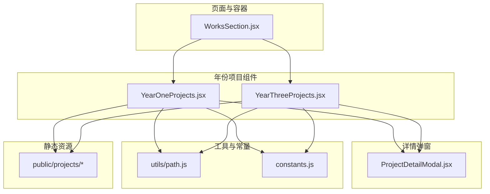
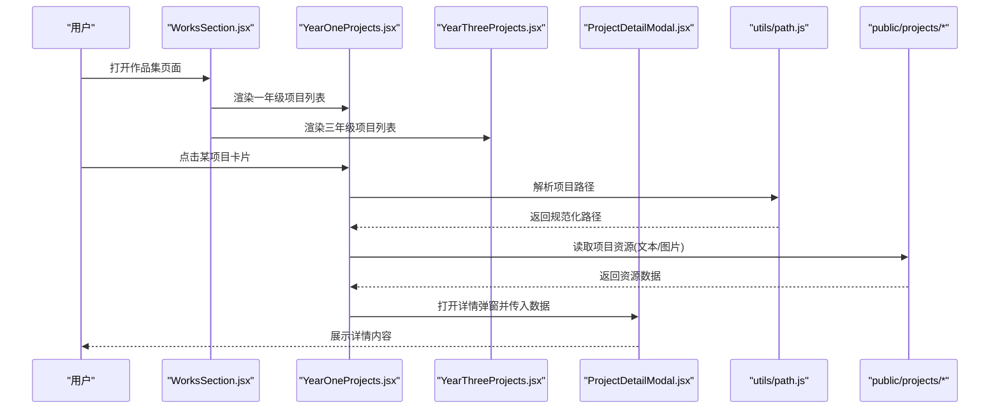
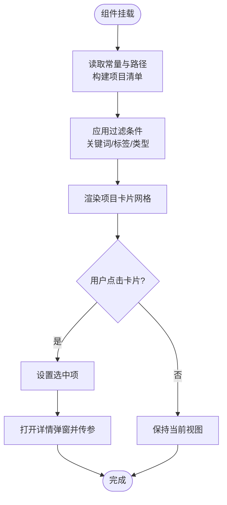
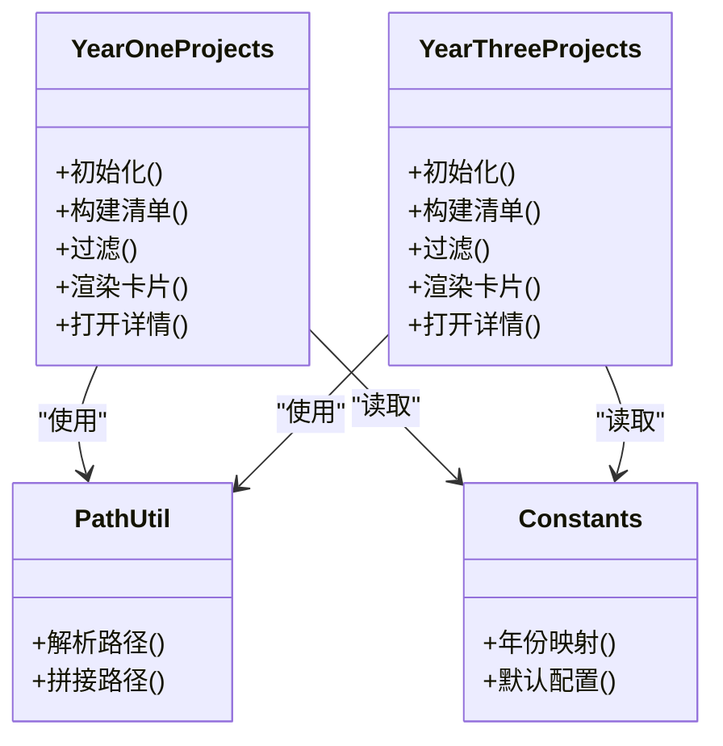
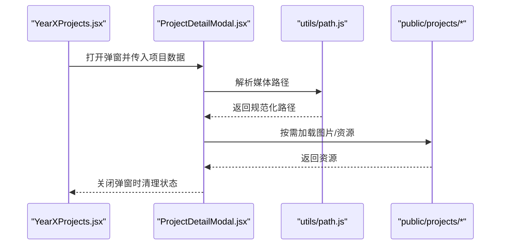
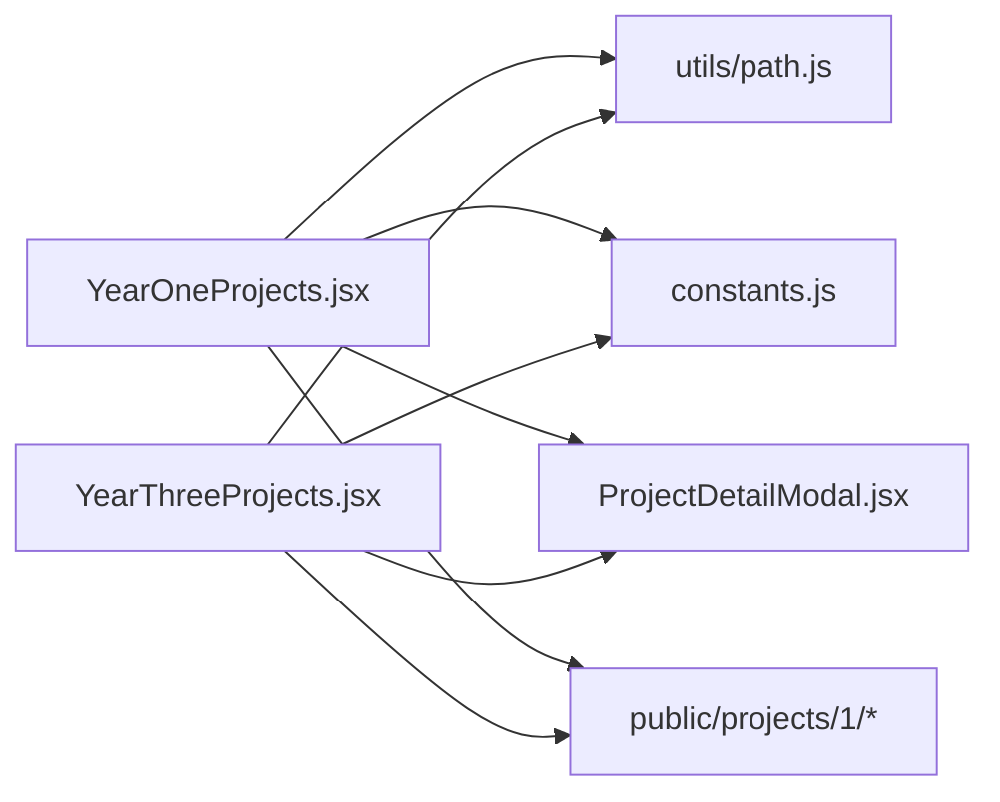

# 年份项目组件

<cite>
**本文引用的文件**   
- [YearOneProjects.jsx](file://src/components/YearOneProjects.jsx)
- [YearThreeProjects.jsx](file://src/components/YearThreeProjects.jsx)
- [YearOneProjects.css](file://src/components/YearOneProjects.css)
- [ProjectDetailModal.jsx](file://src/components/ProjectDetailModal.jsx)
- [path.js](file://src/utils/path.js)
- [constants.js](file://src/constants.js)
- [WorksSection.jsx](file://src/components/WorksSection.jsx)
</cite>

## 目录
1. [简介](#简介)
2. [项目结构](#项目结构)
3. [核心组件](#核心组件)
4. [架构总览](#架构总览)
5. [详细组件分析](#详细组件分析)
6. [依赖关系分析](#依赖关系分析)
7. [性能与优化](#性能与优化)
8. [故障排查指南](#故障排查指南)
9. [结论](#结论)
10. [附录：开发手册](#附录开发手册)

## 简介
本文件面向开发者，系统化阐述“年份项目”相关组件的实现原理与设计模式，重点覆盖 YearOneProjects 与 YearThreeProjects 两个组件。文档将说明：
- 两个组件的差异点、复用机制与扩展方法
- 项目数据的获取方式、过滤逻辑与渲染策略
- 如何添加新的年份项目、自定义卡片样式与实现特殊展示效果
- 文件路径管理、图片加载优化与错误处理机制
- 组件间通信模式与状态同步策略
- 提供完整的使用与开发手册

## 项目结构
围绕“年份项目”的核心代码位于 src/components 与 src/utils，静态资源位于 public/projects。关键文件如下：
- 组件层：YearOneProjects.jsx、YearThreeProjects.jsx、ProjectDetailModal.jsx、WorksSection.jsx
- 工具层：path.js（路径解析）、constants.js（常量配置）
- 资源层：public/projects/{year}/{project}（按年与项目组织）

图表来源
- [WorksSection.jsx](file://src/components/WorksSection.jsx)
- [YearOneProjects.jsx](file://src/components/YearOneProjects.jsx)
- [YearThreeProjects.jsx](file://src/components/YearThreeProjects.jsx)
- [ProjectDetailModal.jsx](file://src/components/ProjectDetailModal.jsx)
- [path.js](file://src/utils/path.js)
- [constants.js](file://src/constants.js)

章节来源
- [YearOneProjects.jsx](file://src/components/YearOneProjects.jsx)
- [YearThreeProjects.jsx](file://src/components/YearThreeProjects.jsx)
- [ProjectDetailModal.jsx](file://src/components/ProjectDetailModal.jsx)
- [path.js](file://src/utils/path.js)
- [constants.js](file://src/constants.js)
- [WorksSection.jsx](file://src/components/WorksSection.jsx)

## 核心组件
- YearOneProjects：负责一年级项目的数据读取、过滤与渲染，并驱动详情弹窗展示。
- YearThreeProjects：负责三年级项目的对应能力，通常与一年级在数据结构或展示细节上存在差异。
- ProjectDetailModal：通用详情弹窗，承载项目详情内容、媒体与交互。
- path.js：统一的路径解析与拼接工具，屏蔽文件系统差异。
- constants.js：集中管理年份、默认值、枚举等常量。
- WorksSection：页面级容器，组合不同年份的组件实例。

章节来源
- [YearOneProjects.jsx](file://src/components/YearOneProjects.jsx)
- [YearThreeProjects.jsx](file://src/components/YearThreeProjects.jsx)
- [ProjectDetailModal.jsx](file://src/components/ProjectDetailModal.jsx)
- [path.js](file://src/utils/path.js)
- [constants.js](file://src/constants.js)
- [WorksSection.jsx](file://src/components/WorksSection.jsx)

## 架构总览
下图展示了从页面到组件再到资源的整体调用链与数据流。

图表来源
- [WorksSection.jsx](file://src/components/WorksSection.jsx)
- [YearOneProjects.jsx](file://src/components/YearOneProjects.jsx)
- [YearThreeProjects.jsx](file://src/components/YearThreeProjects.jsx)
- [ProjectDetailModal.jsx](file://src/components/ProjectDetailModal.jsx)
- [path.js](file://src/utils/path.js)

## 详细组件分析

### YearOneProjects 组件
职责与流程
- 初始化阶段：根据常量与路径工具确定一年级项目根目录，扫描可用项目集合。
- 数据准备：为每个项目构建元信息（标题、封面、摘要、路径等），必要时进行排序或去重。
- 过滤与搜索：支持按关键词、标签或类型筛选，更新本地状态以触发重渲染。
- 渲染策略：网格布局渲染项目卡片；点击后通过回调向父级或弹窗组件传递选中项。
- 详情联动：将选中项目数据传递给 ProjectDetailModal 进行展示。

关键设计点
- 路径抽象：通过 path.js 统一处理跨平台路径分隔符与相对路径。
- 状态隔离：组件内部维护过滤条件与选中项，避免与父组件耦合过深。
- 可扩展性：通过常量与配置项控制行为，便于新增字段或规则。

图表来源
- [YearOneProjects.jsx](file://src/components/YearOneProjects.jsx)
- [path.js](file://src/utils/path.js)
- [constants.js](file://src/constants.js)

章节来源
- [YearOneProjects.jsx](file://src/components/YearOneProjects.jsx)
- [YearOneProjects.css](file://src/components/YearOneProjects.css)
- [path.js](file://src/utils/path.js)
- [constants.js](file://src/constants.js)

### YearThreeProjects 组件
职责与流程
- 与一年级组件类似，但针对三年级项目的数据结构与展示需求做了差异化处理。
- 可能包含不同的默认过滤规则、排序策略或字段映射。
- 同样通过 path.js 与 constants.js 进行路径与常量管理，确保一致性。

差异点与复用机制
- 差异点：字段映射、默认排序、过滤维度、UI 文案或布局微调。
- 复用机制：共享路径工具与常量；若存在重复逻辑，可进一步抽取为 hooks 或工具函数。
- 扩展方法：通过新增常量键或配置项快速适配新字段；通过 CSS 变量或类名切换主题风格。

图表来源
- [YearOneProjects.jsx](file://src/components/YearOneProjects.jsx)
- [YearThreeProjects.jsx](file://src/components/YearThreeProjects.jsx)
- [path.js](file://src/utils/path.js)
- [constants.js](file://src/constants.js)

章节来源
- [YearThreeProjects.jsx](file://src/components/YearThreeProjects.jsx)
- [path.js](file://src/utils/path.js)
- [constants.js](file://src/constants.js)

### ProjectDetailModal 组件
职责与流程
- 接收来自年份组件的项目数据，渲染详情内容（文本、图片、附件等）。
- 管理弹窗的显示/隐藏与关闭事件。
- 对媒体资源进行懒加载与错误兜底，提升用户体验。

图表来源
- [ProjectDetailModal.jsx](file://src/components/ProjectDetailModal.jsx)
- [path.js](file://src/utils/path.js)

章节来源
- [ProjectDetailModal.jsx](file://src/components/ProjectDetailModal.jsx)
- [path.js](file://src/utils/path.js)

## 依赖关系分析
- 组件内聚：年份组件各自封装数据获取、过滤与渲染，降低耦合度。
- 外部依赖：
  - path.js：统一路径处理，避免硬编码路径带来的跨平台问题。
  - constants.js：集中管理年份、默认值与枚举，便于全局调整。
  - ProjectDetailModal：作为通用详情展示组件被多个年份组件复用。
- 资源依赖：public/projects 下的目录结构决定数据可用性，需保证命名规范与完整性。

图表来源
- [YearOneProjects.jsx](file://src/components/YearOneProjects.jsx)
- [YearThreeProjects.jsx](file://src/components/YearThreeProjects.jsx)
- [ProjectDetailModal.jsx](file://src/components/ProjectDetailModal.jsx)
- [path.js](file://src/utils/path.js)
- [constants.js](file://src/constants.js)

章节来源
- [YearOneProjects.jsx](file://src/components/YearOneProjects.jsx)
- [YearThreeProjects.jsx](file://src/components/YearThreeProjects.jsx)
- [ProjectDetailModal.jsx](file://src/components/ProjectDetailModal.jsx)
- [path.js](file://src/utils/path.js)
- [constants.js](file://src/constants.js)

## 性能与优化
- 图片懒加载：仅在弹窗可见或进入视口时加载大图，减少首屏压力。
- 资源预取：对热门项目可在空闲时预取缩略图，提升交互流畅度。
- 路径缓存：对常用路径结果进行缓存，避免重复计算。
- 过滤优化：对大型数据集采用索引或分片策略，避免主线程阻塞。
- 样式优化：使用 CSS 变量与类名切换，减少运行时样式计算。

[本节为通用指导，不直接分析具体文件]

## 故障排查指南
常见问题与定位步骤
- 路径解析失败：检查 path.js 的解析逻辑与 public/projects 目录结构是否一致。
- 资源缺失：确认项目目录下必需的图片与文本是否存在，名称是否与常量或配置匹配。
- 过滤无结果：核对过滤条件与数据字段是否对齐，必要时打印中间状态。
- 弹窗无法关闭：检查事件绑定与状态重置逻辑。
- 样式错乱：对比 YearOneProjects.css 与 YearThreeProjects 的样式覆盖范围，避免冲突。

章节来源
- [path.js](file://src/utils/path.js)
- [YearOneProjects.jsx](file://src/components/YearOneProjects.jsx)
- [YearThreeProjects.jsx](file://src/components/YearThreeProjects.jsx)
- [ProjectDetailModal.jsx](file://src/components/ProjectDetailModal.jsx)
- [YearOneProjects.css](file://src/components/YearOneProjects.css)

## 结论
YearOneProjects 与 YearThreeProjects 通过统一的工具与常量体系，实现了高内聚、低耦合的年份项目展示能力。两者在数据结构与展示细节上的差异通过配置与轻量扩展即可满足，同时借助 ProjectDetailModal 实现详情展示的复用。遵循本文的开发手册与最佳实践，可快速新增年份、定制样式与增强交互体验。

[本节为总结性内容，不直接分析具体文件]

## 附录：开发手册

### 如何添加新的年份项目
- 在 public/projects 下新建年份目录与项目子目录，确保包含必要的图片与文本资源。
- 在 constants.js 中注册新年份的映射与默认配置。
- 如需独立组件，参考 YearOneProjects 或 YearThreeProjects 的结构创建新组件，并在 WorksSection 中引入与渲染。
- 若仅需复用现有组件，可通过 props 或常量切换年份标识与过滤规则。

章节来源
- [constants.js](file://src/constants.js)
- [WorksSection.jsx](file://src/components/WorksSection.jsx)
- [YearOneProjects.jsx](file://src/components/YearOneProjects.jsx)
- [YearThreeProjects.jsx](file://src/components/YearThreeProjects.jsx)

### 自定义项目卡片样式
- 在 YearOneProjects.css 中定义或覆盖卡片类名，使用 CSS 变量统一管理主题色与尺寸。
- 对于三年级组件，建议新增专用样式文件或基于 CSS 模块/变量进行隔离，避免相互影响。
- 响应式布局建议使用栅格与媒体查询，确保多端一致体验。

章节来源
- [YearOneProjects.css](file://src/components/YearOneProjects.css)
- [YearOneProjects.jsx](file://src/components/YearOneProjects.jsx)
- [YearThreeProjects.jsx](file://src/components/YearThreeProjects.jsx)

### 实现特殊展示效果
- 在 ProjectDetailModal 中增加过渡动画或视差效果，注意性能开销与降级策略。
- 对复杂媒体（视频/模型）采用懒加载与占位图，提升首屏性能。
- 使用 path.js 提供的路径解析能力，动态生成资源 URL，避免硬编码。

章节来源
- [ProjectDetailModal.jsx](file://src/components/ProjectDetailModal.jsx)
- [path.js](file://src/utils/path.js)

### 文件路径管理与图片加载优化
- 路径管理：所有路径通过 path.js 解析与拼接，确保跨平台兼容与一致性。
- 图片优化：优先加载缩略图，详情弹窗再加载原图；对大图进行压缩与格式转换。
- 错误处理：图片加载失败时回退到占位图，并记录日志以便排查。

章节来源
- [path.js](file://src/utils/path.js)
- [ProjectDetailModal.jsx](file://src/components/ProjectDetailModal.jsx)

### 组件间通信与状态同步
- 年份组件通过回调或上下文向父级传递选中项目，父级再传递给详情弹窗。
- 状态最小化：仅保留必要状态（如过滤条件、选中项），避免冗余导致频繁重渲染。
- 解耦策略：将路径与常量抽离至工具与配置层，组件只关注业务逻辑与 UI。

章节来源
- [YearOneProjects.jsx](file://src/components/YearOneProjects.jsx)
- [YearThreeProjects.jsx](file://src/components/YearThreeProjects.jsx)
- [ProjectDetailModal.jsx](file://src/components/ProjectDetailModal.jsx)
- [path.js](file://src/utils/path.js)
- [constants.js](file://src/constants.js)