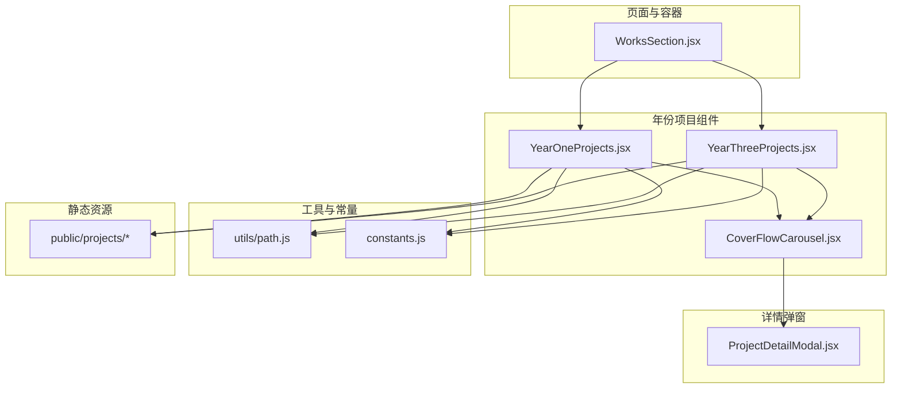
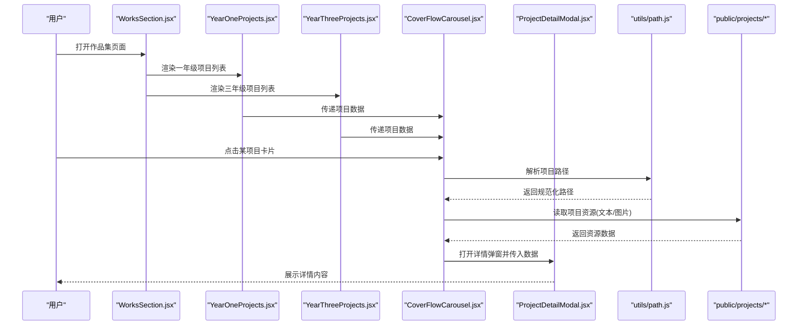
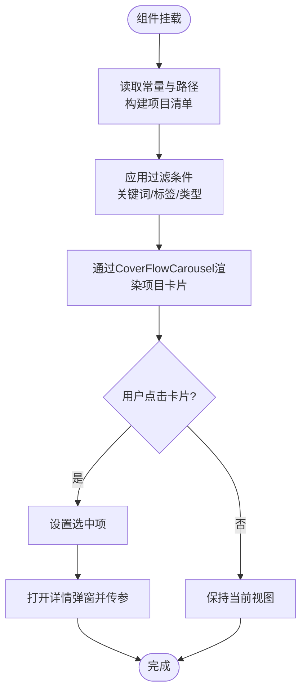
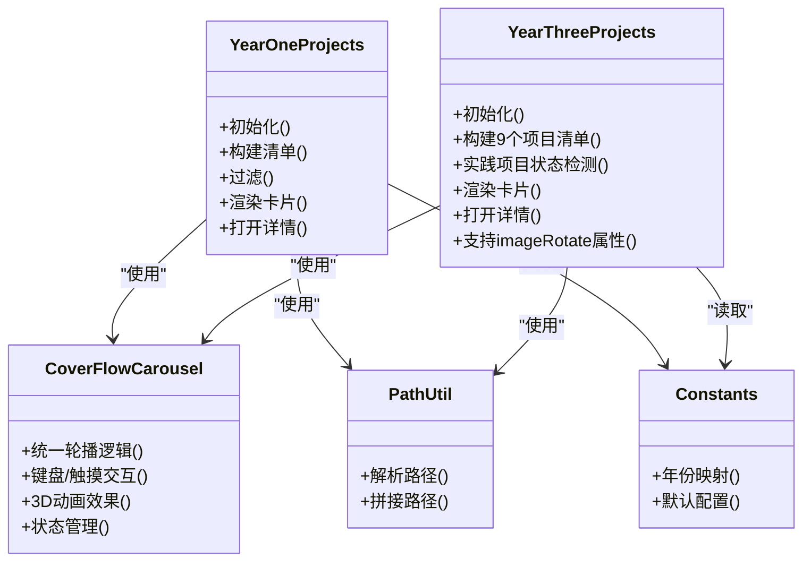
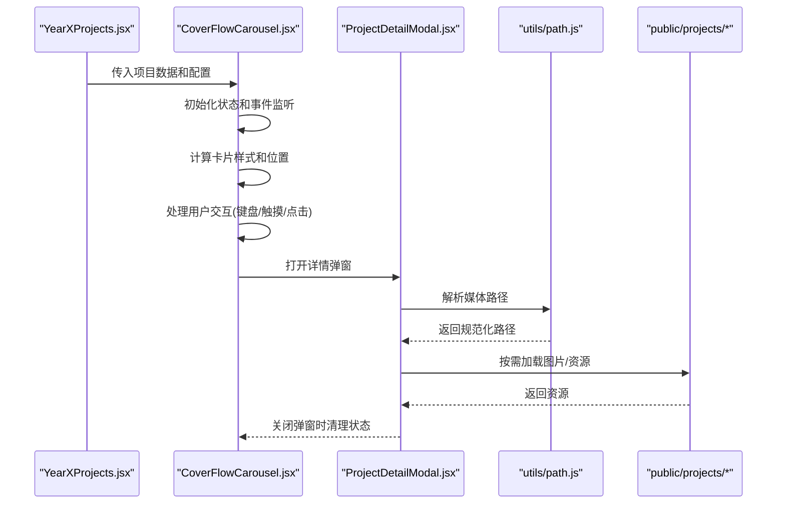
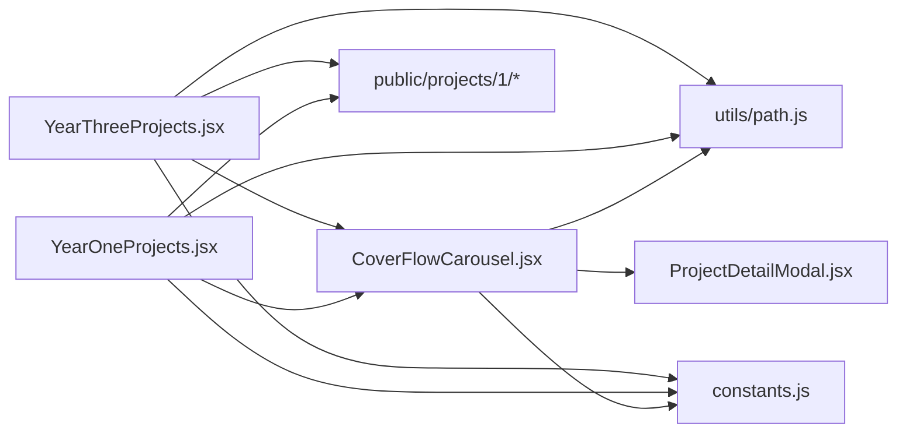

# 年份项目组件

<cite>
**本文引用的文件**   
- [YearOneProjects.jsx](file://src/components/YearOneProjects.jsx)
- [YearThreeProjects.jsx](file://src/components/YearThreeProjects.jsx)
- [CoverFlowCarousel.jsx](file://src/components/CoverFlowCarousel.jsx)
- [ProjectDetailModal.jsx](file://src/components/ProjectDetailModal.jsx)
- [path.js](file://src/utils/path.js)
- [constants.js](file://src/constants.js)
- [WorksSection.jsx](file://src/components/WorksSection.jsx)
</cite>

## 更新摘要
**所做更改**   
- 更新了YearThreeProjects组件的详细分析，反映新增的两个重大项目
- 新增了LeRobot牙科种植机器人项目的技术细节说明
- 新增了3D人体网格应变分析项目的生物力学应用说明
- 更新了组件架构分析，突出CoverFlowCarousel的复用机制
- 增强了项目数据结构的详细说明

## 目录
1. [简介](#简介)
2. [项目结构](#项目结构)
3. [核心组件](#核心组件)
4. [架构总览](#架构总览)
5. [详细组件分析](#详细组件分析)
6. [依赖关系分析](#依赖关系分析)
7. [性能与优化](#性能与优化)
8. [故障排查指南](#故障排查指南)
9. [结论](#结论)
10. [附录：开发手册](#附录开发手册)

## 简介
本文件面向开发者，系统化阐述"年份项目"相关组件的实现原理与设计模式，重点覆盖 YearOneProjects 与 YearThreeProjects 两个组件。文档将说明：
- 两个组件的差异点、复用机制与扩展方法
- 项目数据的获取方式、过滤逻辑与渲染策略
- 如何添加新的年份项目、自定义卡片样式与实现特殊展示效果
- 文件路径管理、图片加载优化与错误处理机制
- 组件间通信模式与状态同步策略
- 提供完整的使用与开发手册

**最新更新**：YearThreeProjects组件已显著扩展，新增了两个重大工程项目：基于HuggingFace框架的LeRobot牙科种植机器人（使用ARUCO标记和ACT模仿学习）以及基于Python Trimesh/NumPy和Blender的3D人体网格应变分析系统。

## 项目结构
围绕"年份项目"的核心代码位于 src/components 与 src/utils，静态资源位于 public/projects。关键文件如下：
- 组件层：YearOneProjects.jsx、YearThreeProjects.jsx、CoverFlowCarousel.jsx、ProjectDetailModal.jsx、WorksSection.jsx
- 工具层：path.js（路径解析）、constants.js（常量配置）
- 资源层：public/projects/{year}/{project}（按年与项目组织）



**图表来源**
- [WorksSection.jsx](file://src/components/WorksSection.jsx)
- [YearOneProjects.jsx](file://src/components/YearOneProjects.jsx)
- [YearThreeProjects.jsx](file://src/components/YearThreeProjects.jsx)
- [CoverFlowCarousel.jsx](file://src/components/CoverFlowCarousel.jsx)
- [ProjectDetailModal.jsx](file://src/components/ProjectDetailModal.jsx)
- [path.js](file://src/utils/path.js)
- [constants.js](file://src/constants.js)

## 核心组件
- **YearOneProjects**：负责一年级项目的数据读取、过滤与渲染，并驱动详情弹窗展示。
- **YearThreeProjects**：负责三年级项目的对应能力，现已扩展为包含9个项目的综合作品集，涵盖工效学、大创、数理方法、微电路设计、自动控制、数值分析、产品制造、LeRobot牙科机器人和3D人体网格应变分析等领域。
- **CoverFlowCarousel**：共享的轮播组件，统一处理所有年份项目的UI交互、动画效果和状态管理。
- **ProjectDetailModal**：通用详情弹窗，承载项目详情内容、媒体与交互。
- **path.js**：统一的路径解析与拼接工具，屏蔽文件系统差异。
- **constants.js**：集中管理年份、默认值、枚举等常量。
- **WorksSection**：页面级容器，组合不同年份的组件实例。

**章节来源**
- [YearOneProjects.jsx](file://src/components/YearOneProjects.jsx)
- [YearThreeProjects.jsx](file://src/components/YearThreeProjects.jsx)
- [CoverFlowCarousel.jsx](file://src/components/CoverFlowCarousel.jsx)
- [ProjectDetailModal.jsx](file://src/components/ProjectDetailModal.jsx)
- [path.js](file://src/utils/path.js)
- [constants.js](file://src/constants.js)
- [WorksSection.jsx](file://src/components/WorksSection.jsx)

## 架构总览
下图展示了从页面到组件再到资源的整体调用链与数据流。



**图表来源**
- [WorksSection.jsx](file://src/components/WorksSection.jsx)
- [YearOneProjects.jsx](file://src/components/YearOneProjects.jsx)
- [YearThreeProjects.jsx](file://src/components/YearThreeProjects.jsx)
- [CoverFlowCarousel.jsx](file://src/components/CoverFlowCarousel.jsx)
- [ProjectDetailModal.jsx](file://src/components/ProjectDetailModal.jsx)
- [path.js](file://src/utils/path.js)

## 详细组件分析

### YearOneProjects 组件
职责与流程
- 初始化阶段：根据常量与路径工具确定一年级项目根目录，扫描可用项目集合。
- 数据准备：为每个项目构建元信息（标题、封面、摘要、路径等），必要时进行排序或去重。
- 过滤与搜索：支持按关键词、标签或类型筛选，更新本地状态以触发重渲染。
- 渲染策略：通过CoverFlowCarousel组件实现统一的轮播展示；点击后通过回调向父级或弹窗组件传递选中项。
- 详情联动：将选中项目数据传递给 ProjectDetailModal 进行展示。

关键设计点
- 路径抽象：通过 path.js 统一处理跨平台路径分隔符与相对路径。
- 状态隔离：组件内部维护过滤条件与选中项，避免与父组件耦合过深。
- 可扩展性：通过常量与配置项控制行为，便于新增字段或规则。



**图表来源**
- [YearOneProjects.jsx](file://src/components/YearOneProjects.jsx)
- [CoverFlowCarousel.jsx](file://src/components/CoverFlowCarousel.jsx)
- [path.js](file://src/utils/path.js)
- [constants.js](file://src/constants.js)

**章节来源**
- [YearOneProjects.jsx](file://src/components/YearOneProjects.jsx)
- [path.js](file://src/utils/path.js)
- [constants.js](file://src/constants.js)

### YearThreeProjects 组件
职责与流程
- **重大更新**：现已包含9个综合性项目，涵盖多个学科领域
- 数据驱动：通过PROJECTS数组定义所有项目元数据，包括工效学、大创、数学物理方法、微电路设计、自动控制原理、数值分析、产品制造、LeRobot牙科机器人和3D人体网格应变分析
- 状态检测：通过detectYearThreeStatus函数区分实践项目和课程项目
- 渲染策略：使用CoverFlowCarousel组件实现统一的轮播展示效果

**新增重大项目详解**：

#### LeRobot牙科种植机器人项目
- **技术栈**：HuggingFace LeRobot框架 + ARUCO视觉定位 + ACT模仿学习 + 强化学习
- **硬件配置**：6自由度机械臂（底座旋转、肩部俯仰、肘部俯仰、腕部俯仰、腕部旋转 + 平行夹爪）
- **核心技术**：ARUCO码视觉定位、主从臂遥操作数据采集、ACT动作分块策略、RL鲁棒性提升
- **应用场景**：牙科种植手术自动化操作

#### 3D人体网格应变分析项目
- **技术栈**：Python (Trimesh/NumPy) + Blender + 计算几何算法
- **分析方法**：面积应变、形状畸变（剪切应变）、边长应变三类力学指标
- **可视化方案**：红-绿-蓝顶点色热力图，直观呈现皮肤拉伸、挤压与扭曲区域
- **应用领域**：服装剪裁优化与人因工程设计

**差异化特性**：
- 支持imageRotate属性处理竖长图片的显示优化
- 丰富的项目元数据结构，包含详细的描述、亮点和技术标签
- 完善的文档附件支持，涵盖PPT、PDF、STEP等多种格式



**图表来源**
- [YearOneProjects.jsx](file://src/components/YearOneProjects.jsx)
- [YearThreeProjects.jsx](file://src/components/YearThreeProjects.jsx)
- [CoverFlowCarousel.jsx](file://src/components/CoverFlowCarousel.jsx)
- [path.js](file://src/utils/path.js)
- [constants.js](file://src/constants.js)

**章节来源**
- [YearThreeProjects.jsx](file://src/components/YearThreeProjects.jsx)
- [CoverFlowCarousel.jsx](file://src/components/CoverFlowCarousel.jsx)
- [path.js](file://src/utils/path.js)
- [constants.js](file://src/constants.js)

### CoverFlowCarousel 共享组件
职责与流程
- **核心功能**：统一处理所有年份项目的轮播展示逻辑
- **交互支持**：键盘导航、拖拽滑动、点击切换等多模态交互
- **动画效果**：Framer Motion驱动的3D翻转、缩放、模糊等视觉效果
- **状态管理**：活跃项目索引、选中项目、拖拽状态等统一管理
- **响应式设计**：适配不同屏幕尺寸和设备类型

关键特性
- 输入验证：确保projects数组非空且有效
- 安全导航：防止越界访问和异常状态
- 性能优化：懒加载图片、防抖处理、内存管理
- 可访问性：ARIA标签、键盘支持、屏幕阅读器兼容



**图表来源**
- [CoverFlowCarousel.jsx](file://src/components/CoverFlowCarousel.jsx)
- [ProjectDetailModal.jsx](file://src/components/ProjectDetailModal.jsx)
- [path.js](file://src/utils/path.js)

**章节来源**
- [CoverFlowCarousel.jsx](file://src/components/CoverFlowCarousel.jsx)
- [ProjectDetailModal.jsx](file://src/components/ProjectDetailModal.jsx)
- [path.js](file://src/utils/path.js)

### ProjectDetailModal 组件
职责与流程
- 接收来自年份组件的项目数据，渲染详情内容（文本、图片、附件等）。
- 管理弹窗的显示/隐藏与关闭事件。
- 对媒体资源进行懒加载与错误兜底，提升用户体验。
- 支持多种文件格式的预览和下载。

**章节来源**
- [ProjectDetailModal.jsx](file://src/components/ProjectDetailModal.jsx)
- [path.js](file://src/utils/path.js)

## 依赖关系分析
- **组件内聚**：年份组件各自封装数据获取、过滤与渲染，降低耦合度。
- **共享组件**：CoverFlowCarousel作为核心共享组件，被YearOneProjects和YearThreeProjects共同使用，实现代码复用。
- **外部依赖**：
  - path.js：统一路径处理，避免硬编码路径带来的跨平台问题。
  - constants.js：集中管理年份、默认值与枚举，便于全局调整。
  - ProjectDetailModal：作为通用详情展示组件被多个年份组件复用。
- **资源依赖**：public/projects 下的目录结构决定数据可用性，需保证命名规范与完整性。



**图表来源**
- [YearOneProjects.jsx](file://src/components/YearOneProjects.jsx)
- [YearThreeProjects.jsx](file://src/components/YearThreeProjects.jsx)
- [CoverFlowCarousel.jsx](file://src/components/CoverFlowCarousel.jsx)
- [ProjectDetailModal.jsx](file://src/components/ProjectDetailModal.jsx)
- [path.js](file://src/utils/path.js)
- [constants.js](file://src/constants.js)

**章节来源**
- [YearOneProjects.jsx](file://src/components/YearOneProjects.jsx)
- [YearThreeProjects.jsx](file://src/components/YearThreeProjects.jsx)
- [CoverFlowCarousel.jsx](file://src/components/CoverFlowCarousel.jsx)
- [ProjectDetailModal.jsx](file://src/components/ProjectDetailModal.jsx)
- [path.js](file://src/utils/path.js)
- [constants.js](file://src/constants.js)

## 性能与优化
- **图片懒加载**：仅在弹窗可见或进入视口时加载大图，减少首屏压力。
- **资源预取**：对热门项目可在空闲时预取缩略图，提升交互流畅度。
- **路径缓存**：对常用路径结果进行缓存，避免重复计算。
- **过滤优化**：对大型数据集采用索引或分片策略，避免主线程阻塞。
- **样式优化**：使用 CSS 变量与类名切换，减少运行时样式计算。
- **组件复用**：通过CoverFlowCarousel减少重复代码，提高维护效率。
- **内存管理**：及时清理事件监听器和定时器，防止内存泄漏。

## 故障排查指南
常见问题与定位步骤
- **路径解析失败**：检查 path.js 的解析逻辑与 public/projects 目录结构是否一致。
- **资源缺失**：确认项目目录下必需的图片与文本是否存在，名称是否与常量或配置匹配。
- **过滤无结果**：核对过滤条件与数据字段是否对齐，必要时打印中间状态。
- **弹窗无法关闭**：检查事件绑定与状态重置逻辑。
- **样式错乱**：对比 YearOneProjects.css 与 YearThreeProjects 的样式覆盖范围，避免冲突。
- **轮播异常**：检查CoverFlowCarousel的输入验证和项目数据结构完整性。
- **新项目不显示**：确认PROJECTS数组中是否正确添加了新项目的完整元数据。

**章节来源**
- [path.js](file://src/utils/path.js)
- [YearOneProjects.jsx](file://src/components/YearOneProjects.jsx)
- [YearThreeProjects.jsx](file://src/components/YearThreeProjects.jsx)
- [CoverFlowCarousel.jsx](file://src/components/CoverFlowCarousel.jsx)
- [ProjectDetailModal.jsx](file://src/components/ProjectDetailModal.jsx)

## 结论
YearOneProjects 与 YearThreeProjects 通过统一的 CoverFlowCarousel 共享组件和工具与常量体系，实现了高内聚、低耦合的年份项目展示能力。YearThreeProjects组件现已发展为包含9个综合性项目的强大作品集，涵盖了从传统工程学科到前沿AI机器人的广泛技术领域。两者在数据结构与展示细节上的差异通过配置与轻量扩展即可满足，同时借助 ProjectDetailModal 实现详情展示的复用。遵循本文的开发手册与最佳实践，可快速新增年份、定制样式与增强交互体验。

## 附录：开发手册

### 如何添加新的年份项目
- 在 public/projects 下新建年份目录与项目子目录，确保包含必要的图片与文本资源。
- 在 YearThreeProjects.jsx 的 PROJECTS 数组中添加新项目对象，包含完整的元数据：
  - id: 唯一标识符
  - title: 项目标题
  - subtitle: 副标题
  - category: 分类标签
  - year: 年份信息
  - color/accentColor: 主题色彩
  - tags: 技术标签数组
  - description: 项目描述
  - highlights: 亮点列表
  - images: 图片资源数组
  - documents: 文档附件数组
- 如需独立组件，参考 YearOneProjects 或 YearThreeProjects 的结构创建新组件，并在 WorksSection 中引入与渲染。
- 若仅需复用现有组件，可通过 props 或常量切换年份标识与过滤规则。

**章节来源**
- [YearThreeProjects.jsx](file://src/components/YearThreeProjects.jsx)
- [WorksSection.jsx](file://src/components/WorksSection.jsx)
- [YearOneProjects.jsx](file://src/components/YearOneProjects.jsx)

### 自定义项目卡片样式
- 在 YearOneProjects.css 中定义或覆盖卡片类名，使用 CSS 变量统一管理主题色与尺寸。
- 对于三年级组件，建议新增专用样式文件或基于 CSS 模块/变量进行隔离，避免相互影响。
- 响应式布局建议使用栅格与媒体查询，确保多端一致体验。
- 利用CoverFlowCarousel提供的CSS变量（--cf-color, --cf-accent）实现动态主题切换。

**章节来源**
- [YearOneProjects.css](file://src/components/YearOneProjects.css)
- [YearOneProjects.jsx](file://src/components/YearOneProjects.jsx)
- [YearThreeProjects.jsx](file://src/components/YearThreeProjects.jsx)
- [CoverFlowCarousel.jsx](file://src/components/CoverFlowCarousel.jsx)

### 实现特殊展示效果
- 在 ProjectDetailModal 中增加过渡动画或视差效果，注意性能开销与降级策略。
- 对复杂媒体（视频/模型）采用懒加载与占位图，提升首屏性能。
- 使用 path.js 提供的路径解析能力，动态生成资源 URL，避免硬编码。
- 利用CoverFlowCarousel的Framer Motion集成实现高级动画效果。

**章节来源**
- [ProjectDetailModal.jsx](file://src/components/ProjectDetailModal.jsx)
- [path.js](file://src/utils/path.js)
- [CoverFlowCarousel.jsx](file://src/components/CoverFlowCarousel.jsx)

### 文件路径管理与图片加载优化
- **路径管理**：所有路径通过 path.js 解析与拼接，确保跨平台兼容与一致性。
- **图片优化**：优先加载缩略图，详情弹窗再加载原图；对大图进行压缩与格式转换。
- **错误处理**：图片加载失败时回退到占位图，并记录日志以便排查。
- **内存管理**：及时释放不再使用的图片和资源引用。

**章节来源**
- [path.js](file://src/utils/path.js)
- [ProjectDetailModal.jsx](file://src/components/ProjectDetailModal.jsx)
- [CoverFlowCarousel.jsx](file://src/components/CoverFlowCarousel.jsx)

### 组件间通信与状态同步
- **年份组件通过CoverFlowCarousel向父级传递选中项目**，父级再传递给详情弹窗。
- **状态最小化**：仅保留必要状态（如过滤条件、选中项），避免冗余导致频繁重渲染。
- **解耦策略**：将路径与常量抽离至工具与配置层，组件只关注业务逻辑与 UI。
- **事件冒泡**：合理使用事件委托和阻止冒泡，避免不必要的重新渲染。

**章节来源**
- [YearOneProjects.jsx](file://src/components/YearOneProjects.jsx)
- [YearThreeProjects.jsx](file://src/components/YearThreeProjects.jsx)
- [CoverFlowCarousel.jsx](file://src/components/CoverFlowCarousel.jsx)
- [ProjectDetailModal.jsx](file://src/components/ProjectDetailModal.jsx)
- [path.js](file://src/utils/path.js)
- [constants.js](file://src/constants.js)

### 新增项目模板示例
以下是添加新项目的标准模板结构：

```javascript
{
  id: 'unique-project-id',
  title: '项目名称',
  subtitle: '项目副标题',
  category: '项目分类',
  year: '年份信息',
  color: '#主题色',
  accentColor: 'rgba(主题色透明度)',
  tags: ['技术标签1', '技术标签2'],
  description: '项目详细描述...',
  highlights: [
    '亮点1',
    '亮点2',
    '亮点3'
  ],
  images: [
    asset('/projects/3/项目文件夹/图片1.jpg'),
    asset('/projects/3/项目文件夹/图片2.png')
  ],
  documents: [
    { name: '文档名称', path: asset('/projects/3/项目文件夹/文档.pdf') }
  ],
  // 可选：针对竖长图片的旋转优化
  imageRotate: 90
}
```

**章节来源**
- [YearThreeProjects.jsx](file://src/components/YearThreeProjects.jsx)
- [path.js](file://src/utils/path.js)